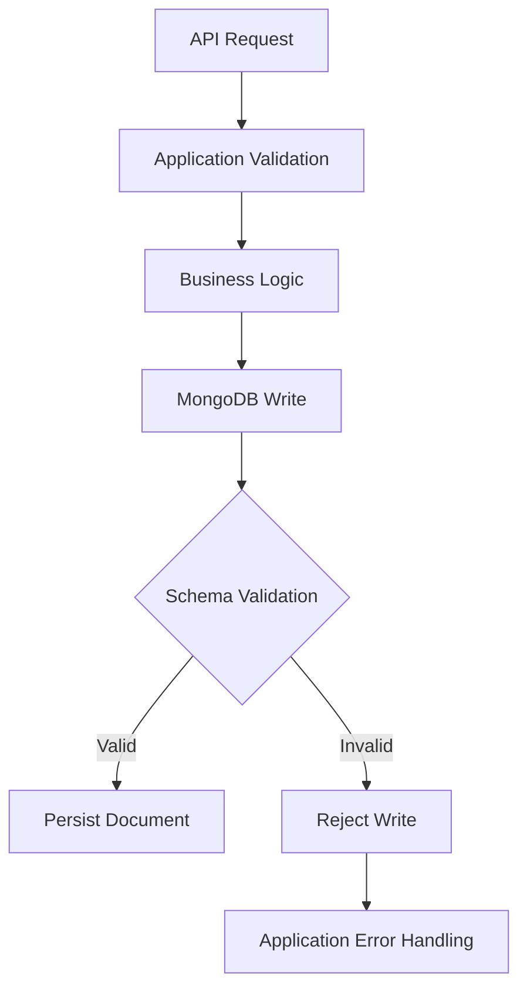
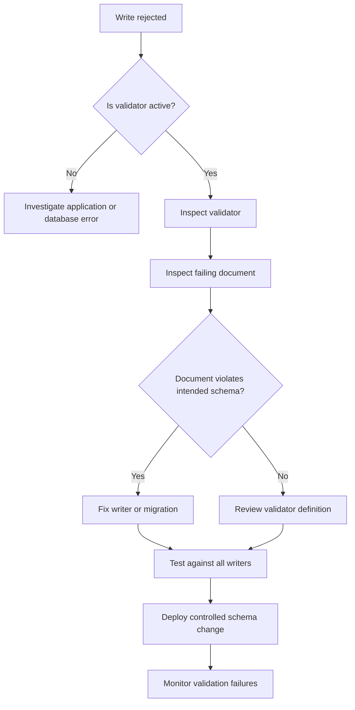

# 05- Schema Validation Issues

## Overview

MongoDB's flexible document model does not require every document in a collection to have an identical structure. That flexibility is useful for evolving applications, but unrestricted schema variation can eventually create inconsistent data that is difficult to query, index, migrate, and operate.

MongoDB schema validation provides a database-level guardrail between completely schemaless storage and rigid relational-style schemas.

A production application should generally use multiple validation layers:

```text
Client Request
      ↓
API / Pydantic / Serializer Validation
      ↓
Application Business Validation
      ↓
MongoDB Schema Validation
      ↓
Persistent Document
```

Each layer solves a different problem:

| Layer | Primary responsibility |
|---|---|
| API validation | Request shape and basic input correctness |
| Application validation | Business rules and workflow constraints |
| MongoDB validation | Persistent document structure and BSON types |
| Indexes | Uniqueness and query-performance guarantees |
| Transactions | Multi-document consistency |

MongoDB schema validation should therefore be treated as a **database safety boundary**, not a replacement for application validation.

## Why Schema Validation Matters

Without validation, a collection can gradually contain incompatible representations:

```javascript
{
  name: "Alice",
  age: 30
}
```

and:

```javascript
{
  name: "Bob",
  age: "30"
}
```

and:

```javascript
{
  name: "Charlie",
  years_old: 30
}
```

The application may initially tolerate these differences, but they create problems for:

- Queries
- Aggregations
- Indexes
- Reporting
- API serialization
- Data migrations
- Analytics
- Background workers
- Event consumers
- Operational tooling

Validation makes the database reject or warn about documents that violate the intended structure.

## Schema Validation Architecture



The important point is that MongoDB validation occurs close to persistence.

If multiple services write to the same collection, database validation provides a shared safety boundary:

```text
FastAPI ────────┐
Django ─────────┤
Celery Worker ──┤
Migration ──────┤──→ MongoDB Validation
CLI Tool ───────┤
Import Job ─────┘
```

This is particularly valuable in microservice architectures where several processes may write to the same MongoDB collection.

## JSON Schema Validation

MongoDB supports validation rules based on JSON Schema through the `$jsonSchema` operator.

A basic validator:

```javascript
db.createCollection("users", {
  validator: {
    $jsonSchema: {
      bsonType: "object",
      required: ["email", "status"],
      properties: {
        email: {
          bsonType: "string"
        },
        status: {
          bsonType: "string"
        }
      }
    }
  }
})
```

This establishes a structural contract:

```text
Document
├── email → string
└── status → string
```

The validator does not mean every possible business rule belongs in MongoDB.

## Required Fields

Use `required` for fields that must exist.

Example:

```javascript
{
  $jsonSchema: {
    bsonType: "object",
    required: [
      "tenant_id",
      "email",
      "status"
    ],
    properties: {
      tenant_id: {
        bsonType: "string"
      },
      email: {
        bsonType: "string"
      },
      status: {
        bsonType: "string"
      }
    }
  }
}
```

Without `required`, a property definition does not necessarily require the field to exist.

This distinction is frequently misunderstood.

## Required vs Optional Fields

Consider:

```javascript
properties: {
  phone: {
    bsonType: "string"
  }
}
```

This describes the expected type **if the field exists**.

It does not necessarily require:

```text
phone
```

to be present.

To require it:

```javascript
required: ["phone"]
```

Schema design should distinguish:

```text
Field must exist
```

from:

```text
Field may exist, but must have a specific type if present
```

## BSON Type Validation

MongoDB validation should generally use BSON-aware types.

Example:

```javascript
{
  created_at: {
    bsonType: "date"
  },
  customer_id: {
    bsonType: "objectId"
  },
  retry_count: {
    bsonType: "int"
  },
  total: {
    bsonType: "decimal"
  }
}
```

This prevents accidental representations such as:

```javascript
{
  created_at: "2026-09-23T10:00:00Z"
}
```

when the application expects a BSON date.

## Common BSON Types in Validation

| BSON type | Typical backend usage |
|---|---|
| `objectId` | MongoDB identifiers |
| `string` | Names, statuses, identifiers |
| `date` | Timestamps |
| `bool` | Flags |
| `int` | Counters |
| `long` | Large integer values |
| `double` | Floating-point values |
| `decimal` | Precise monetary values |
| `array` | Lists |
| `object` | Embedded documents |
| `null` | Explicit nullable values |

Choose types based on application semantics rather than convenience.

For monetary values, for example, `decimal` may be preferable to binary floating-point representations when exact decimal arithmetic is required.

## Nested Document Validation

Embedded documents can be validated recursively.

Example:

```javascript
db.createCollection("customers", {
  validator: {
    $jsonSchema: {
      bsonType: "object",
      required: ["profile"],
      properties: {
        profile: {
          bsonType: "object",
          required: ["name", "address"],
          properties: {
            name: {
              bsonType: "string"
            },
            address: {
              bsonType: "object",
              required: ["country"],
              properties: {
                country: {
                  bsonType: "string"
                },
                postal_code: {
                  bsonType: "string"
                }
              }
            }
          }
        }
      }
    }
  }
})
```

This is useful when the embedded structure is part of the persistent contract.

Avoid creating unnecessarily deep validation schemas when the nested structure is intentionally flexible.

## Array Validation

Arrays can be constrained using `items`.

Example:

```javascript
{
  $jsonSchema: {
    bsonType: "object",
    required: ["roles"],
    properties: {
      roles: {
        bsonType: "array",
        items: {
          bsonType: "string"
        }
      }
    }
  }
}
```

This prevents:

```javascript
{
  roles: ["admin", 42]
}
```

when the application expects an array of strings.

## Arrays of Embedded Documents

A more realistic schema:

```javascript
{
  $jsonSchema: {
    bsonType: "object",
    required: ["items"],
    properties: {
      items: {
        bsonType: "array",
        items: {
          bsonType: "object",
          required: ["sku", "quantity"],
          properties: {
            sku: {
              bsonType: "string"
            },
            quantity: {
              bsonType: "int",
              minimum: 1
            }
          }
        }
      }
    }
  }
}
```

This protects the structure of every embedded item.

## Numeric Constraints

JSON Schema validation can enforce constraints such as:

```javascript
{
  quantity: {
    bsonType: "int",
    minimum: 1
  }
}
```

Other useful constraints include:

- `minimum`
- `maximum`
- `minLength`
- `maxLength`
- `pattern`
- `enum`

Example:

```javascript
{
  status: {
    bsonType: "string",
    enum: [
      "pending",
      "processing",
      "completed",
      "cancelled"
    ]
  }
}
```

This is useful for bounded state fields.

## Validation Rules vs Business Rules

Not every rule belongs in the MongoDB validator.

A good database-level rule:

```text
status must be one of the supported BSON strings
```

A business rule:

```text
An order can transition from paid to shipped only after payment verification
```

may require application logic or a transaction.

Another business rule:

```text
Customer cannot place an order when account is suspended
```

typically requires access to other application state.

Use MongoDB validation for persistent structure and fundamental invariants that should hold regardless of the writer.

## Validation Levels

MongoDB supports validation levels that determine which documents are subject to validation.

Conceptually:

| Level | Behavior |
|---|---|
| `strict` | Validate inserts and updates against the validator |
| `moderate` | Apply validation while allowing existing invalid documents to remain untouched unless an operation would cause validation to apply |
| `off` | Disable validation |

The exact operational behavior matters when introducing validation to an existing collection containing legacy documents.

## Introducing Validation to Legacy Data

A common production scenario is:

```text
Existing collection
    ↓
Mixed historical schemas
    ↓
New validator introduced
```

Immediately enforcing a strict schema can break existing workflows.

A safer migration can be:

```text
Inventory existing documents
        ↓
Classify invalid data
        ↓
Define target schema
        ↓
Backfill / migrate
        ↓
Test application compatibility
        ↓
Introduce validation
        ↓
Monitor validation failures
        ↓
Move to stricter enforcement
```

Do not assume a validator can safely be introduced without understanding the existing dataset.

## Validation Actions

MongoDB supports validation actions that determine what happens when a document fails validation.

| Action | Behavior |
|---|---|
| `error` | Reject the operation |
| `warn` | Allow the operation while recording a validation warning |

For production enforcement, `error` is generally appropriate once the application and existing data have been prepared.

During a controlled migration, `warn` can help discover incompatible writers before enforcing rejection.

## Validation Failure

A rejected write can produce an error indicating that the document failed validation.

Typical troubleshooting questions:

```text
Which collection?
        ↓
Which operation?
        ↓
Which document?
        ↓
Which field violates the validator?
        ↓
Was the writer updated?
        ↓
Is the validator itself correct?
```

Do not immediately disable validation.

First determine whether:

```text
application data is wrong
```

or:

```text
validation rules are wrong
```

## Inspecting Collection Validation

Inspect the collection configuration:

```javascript
db.getCollectionInfos({
  name: "users"
})
```

Review:

- `validator`
- `validationLevel`
- `validationAction`

For a specific deployment, use the appropriate administrative privileges.

## Modifying a Validator

Validation rules can be changed with `collMod`.

Example:

```javascript
db.runCommand({
  collMod: "users",
  validator: {
    $jsonSchema: {
      bsonType: "object",
      required: [
        "email",
        "status"
      ],
      properties: {
        email: {
          bsonType: "string"
        },
        status: {
          bsonType: "string",
          enum: [
            "active",
            "disabled"
          ]
        }
      }
    }
  },
  validationLevel: "strict",
  validationAction: "error"
})
```

Validator changes should be treated like schema migrations.

Review them through:

- Code review
- CI/CD
- Staging
- Production rollout
- Monitoring
- Rollback planning

Avoid ad-hoc production changes that are not captured in infrastructure or migration history.

## Querying for Invalid Data

MongoDB does not provide a universal "find all documents violating this arbitrary validator" query.

For existing data, explicitly identify violations using aggregation or application-level validation.

For example, to locate documents where `retry_count` is not an integer:

```javascript
db.jobs.find({
  retry_count: {
    $exists: true,
    $not: {
      $type: "int"
    }
  }
})
```

For complex schemas, write a migration validator or application-side audit process rather than attempting to express every rule as one query.

## Application Validation

Python applications commonly use Pydantic or another validation layer.

Example:

```python
from pydantic import BaseModel, Field


class OrderItem(BaseModel):
    sku: str
    quantity: int = Field(ge=1)


class Order(BaseModel):
    tenant_id: str
    status: str
    items: list[OrderItem]
```

This provides fast feedback before MongoDB is called.

The database validator still provides protection against other writers.

## Two-Layer Validation

A strong production design is:

```text
FastAPI
  ↓
Pydantic
  ↓
Business Service
  ↓
PyMongo
  ↓
MongoDB Validator
```

This gives:

- Better API error messages
- Early rejection
- Consistent persistence rules
- Protection against non-API writers

The two layers should not necessarily be byte-for-byte identical.

Application validation can be richer because it understands business context.

## Validation in Background Workers

Consider:

```text
FastAPI
    ↓
Kafka
    ↓
Celery / Worker
    ↓
MongoDB
```

The API may validate the event before publishing, but the worker is still a separate database writer.

MongoDB validation protects against:

- Worker bugs
- Migration scripts
- CLI operations
- Import jobs
- Future services
- Manual administrative writes

This is one of the strongest arguments for database-level validation in multi-writer architectures.

## Validation and Schema Evolution

Schema evolution is one of the main reasons to avoid excessively strict validators.

Suppose version 1 contains:

```javascript
{
  name: "Alice",
  email: "alice@example.com"
}
```

Version 2 adds:

```javascript
{
  name: "Alice",
  email: "alice@example.com",
  phone: "+91..."
}
```

Making `phone` immediately required can break older application versions.

A safer deployment strategy is:

```text
Deploy code that understands old + new schema
        ↓
Deploy new writes
        ↓
Backfill existing documents
        ↓
Verify migration
        ↓
Make new field required if appropriate
        ↓
Remove old compatibility behavior later
```

This is the same expand-and-contract principle used for relational schema migrations.

## Backward-Compatible Validation

During a rolling deployment:

```text
Application v1
Application v2
       ↓
    MongoDB
```

Both versions may temporarily write different document shapes.

A validator should support the transition state.

Do not deploy:

```text
Strict validator
        ↓
Old application still running
```

if the old application cannot satisfy the new schema.

## Validation Versioning

For complex schemas, maintain a conceptual schema version:

```javascript
{
  schema_version: 2,
  ...
}
```

This can help with:

- Data migrations
- Backward compatibility
- Debugging
- Event processing
- Operational audits

However, `schema_version` does not replace actual validation.

It is metadata describing the document contract.

## Validation and Schema Flexibility

MongoDB schema flexibility does not mean:

```text
anything goes
```

A production collection can intentionally define:

```text
Stable core fields
+
Validated nested structure
+
Controlled optional fields
+
Application-specific extensions
```

For example:

```javascript
{
  tenant_id: "...",
  order_id: ObjectId("..."),
  status: "processing",
  created_at: ISODate("..."),
  metadata: {
    // intentionally flexible
  }
}
```

The core contract can be strict while `metadata` remains flexible.

## Allowing Flexible Metadata

A common pattern is:

```javascript
{
  metadata: {
    source: "partner-api",
    correlation_id: "...",
    arbitrary_extension: true
  }
}
```

Do not validate every metadata property if the field is intentionally extensible.

Instead, validate the boundary:

```javascript
metadata: {
  bsonType: "object"
}
```

This prevents the field from becoming an arbitrary BSON scalar while retaining flexibility.

## Schema Validation and Indexes

Validation does not replace indexes.

For example:

```text
Validator
    ↓
email must be a string
```

does not guarantee:

```text
email must be unique
```

A unique index provides that guarantee:

```javascript
db.users.createIndex(
  {
    tenant_id: 1,
    email: 1
  },
  {
    unique: true
  }
)
```

Use each mechanism for the problem it solves:

| Requirement | Mechanism |
|---|---|
| Field must exist | Schema validation |
| Field must be string | Schema validation |
| Value must be within enum | Schema validation |
| Value must be unique | Unique index |
| Query must be fast | Appropriate index |
| Multiple documents must change atomically | Transaction |
| Business workflow rule | Application/service layer |

## Validation and Nullability

Suppose:

```javascript
{
  phone: null
}
```

is valid.

The validator must explicitly allow the relevant BSON type:

```javascript
{
  phone: {
    bsonType: [
      "string",
      "null"
    ]
  }
}
```

If the application expects a string whenever the field exists, use:

```javascript
{
  phone: {
    bsonType: "string"
  }
}
```

and ensure the field is either omitted or represented consistently according to the application's schema.

Inconsistent handling of:

```text
missing
null
empty string
```

is a common source of validation and query bugs.

## Validation and ObjectId

IDs should be validated according to how they are stored.

For example:

```javascript
{
  _id: {
    bsonType: "objectId"
  }
}
```

For application-owned references:

```javascript
{
  customer_id: {
    bsonType: "objectId"
  }
}
```

An API may receive:

```text
"65f000000000000000000001"
```

as a string, but the repository should convert it before persistence:

```python
from bson import ObjectId

customer_id = ObjectId(customer_id_string)
```

Do not weaken database validation merely because the HTTP representation is a string.

## Validation and Dates

Prefer BSON dates:

```javascript
{
  created_at: {
    bsonType: "date"
  }
}
```

rather than unconstrained strings:

```javascript
{
  created_at: {
    bsonType: "string"
  }
}
```

BSON dates provide better semantics for:

- Range queries
- Sorting
- Aggregation
- TTL indexes
- Time-based processing

## Validation and Numeric Types

Be careful with numeric types.

MongoDB distinguishes between numeric BSON representations.

For example:

```javascript
{
  retry_count: {
    bsonType: "int"
  }
}
```

may reject values represented differently.

For counters and monetary values, choose the intended BSON type deliberately.

Do not assume:

```text
number
```

is a single MongoDB storage type.

## Validation During Data Imports

Import tools and migration scripts are common sources of validation failures.

A JSON import may contain:

```json
{
  "retry_count": "3"
}
```

while the validator expects:

```text
int
```

The import process should therefore be tested against the target schema before production execution.

For CSV imports, remember that CSV values commonly begin as strings and may require explicit conversion.

## Validation and MongoDB Compass

Compass can help inspect:

- Collection structure
- Documents
- Schema patterns
- Validation configuration
- Query behavior

Use it for investigation and controlled development workflows.

For production configuration, prefer version-controlled database migrations or infrastructure automation over manual GUI changes.

## Validation Troubleshooting Workflow



## Structured Validation Troubleshooting

### Symptom

Examples:

```text
Document failed validation
```

or:

```text
Write operation rejected
```

### Possible Causes

- Missing required field
- Incorrect BSON type
- Invalid enum value
- Nested object mismatch
- Array element mismatch
- Numeric constraint failure
- New application version incompatible with validator
- Legacy data incompatible with migration
- Incorrect validator configuration

### Isolation Strategy

1. Capture the exact failing document shape.
2. Inspect the active collection validator.
3. Identify the exact field causing the mismatch.
4. Reproduce the write in a controlled environment.
5. Determine whether the writer or validator is incorrect.
6. Check whether other application versions use the collection.

### Diagnostic Commands

Inspect collection configuration:

```javascript
db.getCollectionInfos({
  name: "orders"
})
```

Inspect representative documents:

```javascript
db.orders.findOne({
  _id: ObjectId("65f000000000000000000001")
})
```

Test the intended write against a non-production environment before changing production validation.

### Root Cause

Classify the failure as:

```text
Data quality
Schema definition
Application incompatibility
Migration incompatibility
Import incompatibility
Configuration error
```

### Corrective Action

Examples:

```text
Incorrect application type
→ Fix serialization

Missing required field
→ Fix writer / migration

Incorrect validator
→ Correct schema definition

Legacy documents
→ Backfill before enforcement

Rolling deployment incompatibility
→ Use backward-compatible schema evolution
```

### Prevention

- Version validators through migrations.
- Test all known writers.
- Use representative fixtures.
- Monitor validation failures.
- Review schema changes.
- Use backward-compatible deployments.
- Maintain recovery procedures for data migrations.

## Validation in CI/CD

Schema validation should be tested before production deployment.

A practical pipeline:

```text
Schema definition
      ↓
Migration
      ↓
Test MongoDB instance
      ↓
Insert valid fixtures
      ↓
Insert invalid fixtures
      ↓
Run application integration tests
      ↓
Run migration tests
      ↓
Deploy
```

Example test cases:

```text
Valid document → accepted
Missing required field → rejected
Wrong BSON type → rejected
Invalid enum → rejected
Valid legacy document → accepted where required
New schema document → accepted
```

## Testing Validation with Python

A test can verify that invalid data is rejected:

```python
import pytest
from pymongo.errors import WriteError


def test_invalid_order_is_rejected(orders):
    invalid_order = {
        "tenant_id": "tenant-100",
        "status": 123,
    }

    with pytest.raises(WriteError):
        orders.insert_one(invalid_order)
```

The exact exception hierarchy depends on the operation and driver behavior, so integration tests should validate the actual failure contract used by the application.

## Production Schema Migration Strategy

For an existing collection:

```text
Inventory
   ↓
Profile
   ↓
Design target schema
   ↓
Add compatible validation
   ↓
Deploy compatible application
   ↓
Backfill data
   ↓
Verify
   ↓
Increase enforcement
```

Avoid changing validation rules and application code independently without compatibility analysis.

## Rolling Deployments

Suppose version 1 writes:

```javascript
{
  email: "alice@example.com"
}
```

Version 2 writes:

```javascript
{
  email: "alice@example.com",
  status: "active"
}
```

Do not immediately require:

```text
status
```

if version 1 instances are still serving requests.

A safer sequence is:

```text
1. Deploy validator allowing both shapes.
2. Deploy application version 2.
3. Confirm all writers understand the new field.
4. Backfill existing documents.
5. Change validator to require status.
```

This minimizes deployment-order failures.

## Schema Validation and Microservices

Shared collections create a special challenge.

For example:

```text
orders-api ────────┐
billing-service ───┤
reporting-worker ──┤
migration-job ─────┤
                   ↓
                MongoDB
```

Each writer may evolve independently.

A database validator establishes a minimum shared contract, but it does not solve service ownership.

For long-term maintainability, define:

- Collection ownership
- Allowed writers
- Schema ownership
- Migration ownership
- Compatibility rules
- Versioning strategy

Avoid having many services directly mutate the same collection without clear ownership.

## Security Considerations

Schema validation can support security by preventing malformed or unexpected security-sensitive fields, but it is not an authorization system.

For example, validation can ensure:

```javascript
{
  role: {
    bsonType: "string"
  }
}
```

It does not determine whether a particular caller is allowed to set:

```javascript
role: "admin"
```

Authorization must remain in the application and database permission model.

Do not rely on schema validation to prevent privilege escalation.

## Performance Considerations

Validation adds work to writes because MongoDB must evaluate the validator.

For normal application documents, this overhead is generally preferable to accepting invalid persistent state.

However, large and complex validators can increase write-path work.

Be especially careful with:

- High-throughput ingestion
- Large documents
- Large arrays
- Complex nested structures
- Large batch imports

Measure validation impact in realistic workloads.

Do not remove validation solely because a benchmark against a trivial workload shows measurable overhead.

## High Availability Considerations

Schema validation is part of the collection definition and therefore participates in the normal MongoDB deployment model.

When changing validation in a replica-set or sharded environment, consider:

- Deployment timing
- Application compatibility
- Migration state
- Rolling application versions
- Automation
- Monitoring
- Recovery procedures

The main availability risk is usually not the validation operation itself but an incompatible validator being introduced while old writers are still active.

## Backup and Recovery Considerations

Schema changes should be included in disaster-recovery planning.

A database backup contains data, but operational recovery also requires understanding:

```text
Database data
+
Indexes
+
Collection configuration
+
Validation rules
+
Users / roles
+
Application configuration
+
Migration history
```

A restore procedure should verify that the restored database has the expected collection validation configuration.

## Common Mistakes

### Assuming MongoDB Is Completely Schemaless

Flexible schema does not mean schema discipline is unnecessary.

Production systems still need stable contracts.

### Making Every Field Required

Overly strict validation makes schema evolution difficult.

Only require fields that are genuinely mandatory.

### Using Validation for Business Workflows

A validator cannot replace complex application-level state management.

### Ignoring Existing Data

A validator designed for new documents may be incompatible with historical documents.

### Changing Validation Without Deployment Coordination

Rolling applications can write incompatible shapes.

### Treating `null` and Missing as Equivalent

These states can have different application semantics.

### Ignoring Non-Application Writers

CLI scripts, imports, workers, and migrations can all write invalid documents if validation is absent or disabled.

### Treating Validation as Authorization

A valid document can still represent an unauthorized business action.

## Production Pitfalls

| Pitfall | Why it happens | Prevention |
|---|---|---|
| Existing documents fail new expectations | Validator designed only for new data | Audit and migrate first |
| Deployment starts failing after schema change | Old application version still writes old shape | Use backward-compatible rollout |
| Imports fail | CSV/JSON values have incorrect BSON types | Transform and validate before import |
| Optional fields cause errors | `required` used unnecessarily | Separate required from optional fields |
| `null` values rejected | Validator permits only one BSON type | Explicitly define nullability |
| Business rules leak into validator | Database schema confused with workflow logic | Keep workflow rules in service layer |
| Multiple services conflict | No shared schema ownership | Define ownership and compatibility |
| Production validator changed manually | GUI/CLI change not versioned | Manage schema through migrations |

## Production Checklist

### Schema Design

- [ ] Core fields are clearly defined.
- [ ] BSON types are intentional.
- [ ] Required fields are genuinely mandatory.
- [ ] Optional fields are explicitly considered.
- [ ] Nested structures are validated where useful.
- [ ] Arrays have appropriate element validation.
- [ ] Flexible extension fields are intentionally flexible.

### Application

- [ ] API validation exists.
- [ ] Business validation exists where required.
- [ ] Application types match MongoDB BSON types.
- [ ] All known writers have been tested.
- [ ] Background workers are compatible.
- [ ] Import jobs are compatible.

### Deployment

- [ ] Validator changes are version-controlled.
- [ ] CI tests valid and invalid documents.
- [ ] Rolling deployment compatibility is verified.
- [ ] Existing data has been audited.
- [ ] Migration procedures are documented.
- [ ] Rollback or forward-fix procedures exist.

### Operations

- [ ] Validation failures are observable.
- [ ] Database logs are monitored.
- [ ] Migration progress is measurable.
- [ ] Backups are available.
- [ ] Recovery procedures include collection configuration.
- [ ] Schema ownership is defined.

## Interview Traps

### "MongoDB is schemaless, so schema validation is unnecessary."

MongoDB supports flexible schemas, but production applications often benefit from database-level structural guarantees.

### "JSON Schema validation replaces Pydantic."

No.

Pydantic validates application input.

MongoDB validation protects persisted data from all writers.

### "A validator enforces uniqueness."

Not by itself.

Use a unique index for uniqueness.

### "Required fields are automatically validated by `properties`."

No.

A field generally needs to be included in `required` if its presence must be enforced.

### "Schema validation enforces business rules."

Only simple structural constraints should generally live there.

Cross-document and workflow rules usually belong in application logic, transactions, or other database mechanisms.

### "Adding a required field is always backward compatible."

No.

Existing application versions may continue producing documents without the new field.

Use an expand-and-contract migration strategy.

### "Disabling validation is the easiest way to fix a migration."

It may hide the real incompatibility and allow additional invalid data into the collection.

Prefer fixing the writer or migrating the data.

## Key Takeaways

- **MongoDB schema validation provides a database-level structural contract that protects collections from inconsistent BSON types, missing required fields, and malformed nested structures.**
- **Use application validation for request and business logic, while using MongoDB validation for persistent data invariants; neither mechanism replaces the other.**
- **Schema changes must be deployed compatibly with existing data and rolling application versions, typically using an expand, migrate, verify, and enforce strategy.**
- **Validation does not replace unique indexes, authorization, transactions, or application-level workflow rules; each mechanism protects a different invariant.**
- **Treat validators as production schema migrations: version them, test valid and invalid documents, monitor validation failures, and include their configuration in operational and recovery procedures.**