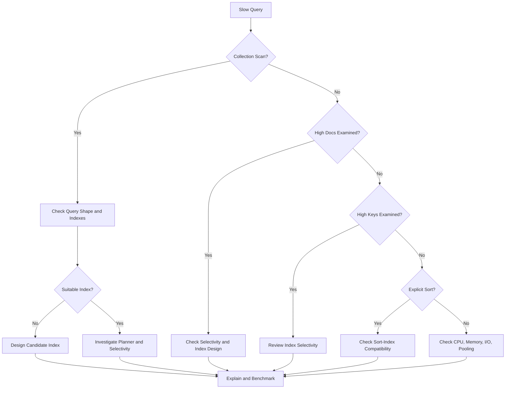

# 06- Index and Query Performance Issues

## Overview

MongoDB query performance problems usually originate from one of four areas:

- The query shape is inefficient.
- The available indexes do not support the query.
- The query planner selects an inefficient execution strategy.
- The workload or deployment has become constrained by CPU, memory, storage, connections, or data growth.

A slow query should therefore not be treated as an "add an index" problem.

A production troubleshooting workflow is:

```text
Slow Request
    ↓
Identify MongoDB Operation
    ↓
Capture Query Shape + Parameters
    ↓
Run explain("executionStats")
    ↓
Inspect Keys / Documents / Sort / Plan
    ↓
Check Indexes + Data Distribution
    ↓
Optimize Query or Index
    ↓
Measure Again
    ↓
Monitor for Regression
```

The key principle is to optimize based on **measured execution behavior**, not assumptions.

## Query Performance Symptoms

Common symptoms include:

| Symptom | Likely investigation area |
|---|---|
| API response time increased | Query latency, connection pool, application overhead |
| High MongoDB CPU | Inefficient queries, aggregation, missing indexes |
| High `totalDocsExamined` | Poor filtering or index coverage |
| High `totalKeysExamined` | Inefficient index or low selectivity |
| `COLLSCAN` | Missing/unused suitable index |
| Unexpected `SORT` | Index does not support requested sort |
| High disk I/O | Working set, collection scans, large indexes |
| Query latency increases with collection size | Poor query/index scalability |
| Writes slowed after adding indexes | Excessive index maintenance |
| Intermittent latency spikes | Pool contention, replication, cache misses, resource saturation |
| One query is fast and later becomes slow | Data distribution, plan changes, cache state, collection growth |
| Aggregation consumes significant resources | Poor pipeline ordering or large intermediate results |

The first task is to establish whether the problem is:

```text
Query-specific
        or
System-wide
```

## Query Performance Troubleshooting Methodology

Use the following workflow for production incidents:

```text
Symptom
↓
Possible causes
↓
Isolation strategy
↓
Diagnostic commands
↓
Root cause
↓
Corrective action
↓
Prevention
```

Do not immediately create or remove indexes during an incident without measuring the effect.

## Establish a Baseline

Before changing a query, record:

- Query latency
- Request rate
- Query shape
- Result count
- `nReturned`
- `totalKeysExamined`
- `totalDocsExamined`
- Execution time
- Current indexes
- Collection size
- Working-set behavior
- MongoDB CPU
- Memory pressure
- Disk I/O
- Connection pool utilization

A useful baseline might look like:

```text
Query:
  tenant_id = X
  status = "pending"
  created_at >= T
  sort created_at DESC

Current:
  p95 latency: 480 ms
  nReturned: 25
  totalKeysExamined: 180000
  totalDocsExamined: 180000
  executionTimeMillis: 430
```

This provides measurable evidence for optimization.

## Identify the Exact Query Shape

Two queries that appear similar may have different performance characteristics.

For example:

```javascript
db.orders.find({
  tenant_id: "tenant-100",
  status: "pending"
})
```

and:

```javascript
db.orders.find({
  tenant_id: "tenant-100",
  status: "completed"
})
```

have the same structural shape but potentially different selectivity.

A production diagnosis should consider:

- Predicate fields
- Operators
- Sort
- Projection
- Pagination
- Result size
- Data distribution

Do not optimize against a single small development dataset.

## Query Selectivity

Selectivity describes how effectively a predicate narrows the candidate data.

Suppose a collection contains 100 million documents.

```text
tenant_id = "tenant-100"
```

may return 50 million documents.

Whereas:

```text
tenant_id = "tenant-100"
AND status = "pending"
AND region = "eu-west-1"
```

may return only 10,000.

Indexes become more useful when predicates efficiently narrow the candidate set.

High-cardinality fields often provide more selective filtering than low-cardinality fields, but index design must consider the complete query shape rather than one field in isolation.

## Collection Scan

A collection scan means MongoDB examines documents across the collection to evaluate the query.

A simplified plan may contain:

```text
COLLSCAN
```

Example:

```javascript
db.orders.find({
  status: "pending"
}).explain("executionStats")
```

If `status` has no suitable index, MongoDB may inspect a large portion of the collection.

A collection scan is not automatically a bug.

It can be reasonable when:

- The collection is small.
- The query returns most documents.
- An index would not meaningfully reduce work.
- The query is intentionally scanning the collection.

The important question is whether the amount of work is appropriate for the workload.

## IXSCAN

`IXSCAN` indicates that MongoDB is scanning an index.

Example conceptual plan:

```text
IXSCAN
  ↓
FETCH
  ↓
Documents
```

The index narrows candidate records, and `FETCH` retrieves documents that must be examined.

A query using an index is not automatically efficient.

For example:

```text
totalKeysExamined = 10,000,000
nReturned          = 20
```

still indicates substantial work.

## FETCH

`FETCH` occurs when MongoDB needs to retrieve documents after using an index.

Consider:

```javascript
db.users.find(
  {
    email: "alice@example.com"
  },
  {
    email: 1,
    name: 1
  }
)
```

If the index only supports:

```text
email
```

MongoDB may still need to fetch the full document to obtain `name`.

A carefully designed index may allow a covered query in appropriate workloads.

## SORT

A `SORT` stage can be expensive when MongoDB cannot satisfy the requested order efficiently through an index.

Example:

```javascript
db.orders.find({
  tenant_id: "tenant-100"
}).sort({
  created_at: -1
})
```

A suitable compound index may avoid an explicit sort:

```javascript
db.orders.createIndex({
  tenant_id: 1,
  created_at: -1
})
```

Index order must be designed against the actual equality, sort, and range predicates.

## LIMIT

`limit()` can reduce the amount of data MongoDB must return:

```javascript
db.orders.find({
  tenant_id: "tenant-100"
})
.sort({
  created_at: -1
})
.limit(50)
```

But `limit()` does not automatically make an inefficient query efficient.

A query that must scan millions of documents before finding 50 matches can still be expensive.

## Explain Plans

`explain()` is one of the most important tools for MongoDB query troubleshooting.

Basic usage:

```javascript
db.orders.find({
  tenant_id: "tenant-100",
  status: "pending"
}).explain("executionStats")
```

For an aggregation:

```javascript
db.orders.aggregate([
  {
    $match: {
      tenant_id: "tenant-100",
      status: "pending"
    }
  },
  {
    $sort: {
      created_at: -1
    }
  }
]).explain("executionStats")
```

Useful modes include:

| Mode | Purpose |
|---|---|
| `queryPlanner` | Inspect candidate and winning plans |
| `executionStats` | Execute and measure the selected plan |
| `allPlansExecution` | Inspect additional candidate-plan execution information |

For performance investigations, `executionStats` is often the most useful starting point.

## Important Explain Metrics

### `nReturned`

Number of documents returned.

Example:

```text
nReturned = 50
```

This should be compared with how much work MongoDB performed.

### `totalKeysExamined`

Number of index keys examined.

Example:

```text
totalKeysExamined = 500000
```

### `totalDocsExamined`

Number of documents examined.

Example:

```text
totalDocsExamined = 450000
```

### `executionTimeMillis`

Measured execution time for the explained operation.

Do not treat this as identical to end-to-end API latency because application processing, network latency, serialization, connection acquisition, and other work occur outside the database operation.

## Keys Examined vs Documents Examined

One useful diagnostic ratio is:

```text
keys examined / documents returned
```

and:

```text
documents examined / documents returned
```

Example:

```text
nReturned            = 20
totalKeysExamined    = 20
totalDocsExamined    = 20
```

This is often efficient.

Contrast:

```text
nReturned            = 20
totalKeysExamined    = 900000
totalDocsExamined    = 850000
```

This query is doing substantially more work than its result size suggests.

These metrics are not absolute pass/fail thresholds. They are evidence for determining where work is occurring.

## Winning and Rejected Plans

MongoDB's query planner evaluates candidate execution strategies and selects a winning plan.

An explain result can contain information about:

```text
Winning Plan
Rejected Plans
```

A query may have multiple indexes that appear relevant.

For example:

```text
Index A:
{ tenant_id: 1, status: 1 }

Index B:
{ status: 1, created_at: -1 }

Index C:
{ tenant_id: 1, created_at: -1 }
```

The planner evaluates candidates based on the query shape and available statistics.

Do not assume the index with the largest number of fields will always win.

## Query Planner Stages

Common stages include:

| Stage | Meaning |
|---|---|
| `COLLSCAN` | Collection scan |
| `IXSCAN` | Index scan |
| `FETCH` | Retrieve matching documents |
| `SORT` | Explicit sort |
| `LIMIT` | Limit result set |
| `OR` | Combine multiple query branches |
| `PROJECTION_*` | Apply projection |
| `SHARD_MERGE` | Merge results in a sharded deployment |

The exact plan tree depends on the MongoDB version, query, indexes, and deployment topology.

## Index Selection

Index design should start with real query patterns.

Suppose the application frequently executes:

```javascript
db.orders.find({
  tenant_id: "tenant-100",
  status: "pending"
}).sort({
  created_at: -1
}).limit(50)
```

A candidate index is:

```javascript
db.orders.createIndex({
  tenant_id: 1,
  status: 1,
  created_at: -1
})
```

This aligns the index with:

```text
Equality
Equality
Sort
```

The correct index should ultimately be verified with `explain()` against realistic data.

## ESR Guideline

The ESR guideline is a useful starting point for compound index design:

```text
Equality
Sort
Range
```

For example:

```javascript
db.orders.find({
  tenant_id: "tenant-100",
  status: "pending",
  created_at: {
    $gte: ISODate("2026-09-01T00:00:00Z")
  }
}).sort({
  priority: -1
})
```

A candidate index needs to account for:

- Equality predicates
- Sort requirements
- Range predicates

Do not apply ESR mechanically. Actual query shape, selectivity, sort requirements, index size, and workload characteristics still need to be measured.

## Equality Predicates

Equality predicates are typically strong candidates for the beginning of a compound index.

Example:

```javascript
{
  tenant_id: "tenant-100",
  status: "pending"
}
```

Candidate:

```javascript
{
  tenant_id: 1,
  status: 1
}
```

The order between equality fields can sometimes be interchangeable from a basic prefix perspective, but data distribution and workload can still influence practical behavior.

## Sort Performance

Suppose:

```javascript
db.events.find({
  tenant_id: "tenant-100"
}).sort({
  created_at: -1
})
```

A useful index is:

```javascript
{
  tenant_id: 1,
  created_at: -1
}
```

This allows MongoDB to locate the tenant's entries and traverse them in the required order.

An index that supports filtering but not sorting may still result in:

```text
IXSCAN
   ↓
FETCH
   ↓
SORT
```

## Range Predicates

Range operators include:

```javascript
$gt
$gte
$lt
$lte
```

Example:

```javascript
{
  created_at: {
    $gte: ISODate("2026-09-01T00:00:00Z")
  }
}
```

Range predicates can substantially increase the number of candidate index entries.

Design the surrounding equality and sort strategy carefully.

## Regex Query Performance

Regex queries are frequently misunderstood.

Potentially index-friendly:

```javascript
{
  username: /^alice/
}
```

Potentially expensive:

```javascript
{
  username: /alice/
}
```

A leading wildcard or unanchored regex can require scanning many index entries or documents.

Avoid exposing arbitrary regex search directly to public APIs without considering:

- Query cost
- Input size
- Index usage
- Rate limiting
- ReDoS-like application risks
- User-controlled workload amplification

For large-scale text search requirements, evaluate appropriate search technologies instead of forcing regex onto large collections.

## `$exists` Queries

Example:

```javascript
db.users.find({
  phone: {
    $exists: true
  }
})
```

Performance depends on the index and distribution of the field.

If a field is sparse or optional, consider whether a partial or sparse index better matches the workload.

Do not add an index solely because `$exists` appears in a query.

## Array Queries

Arrays can introduce multikey indexes.

Example:

```javascript
{
  tags: ["python", "mongodb", "backend"]
}
```

Index:

```javascript
db.posts.createIndex({
  tags: 1
})
```

A query:

```javascript
db.posts.find({
  tags: "mongodb"
})
```

can use the multikey index.

However, compound indexes involving array fields require careful modeling because multikey behavior can affect what index patterns are possible and how efficiently they operate.

## Embedded Document Queries

Consider:

```javascript
{
  customer: {
    country: "IN",
    city: "Kolkata"
  }
}
```

Query:

```javascript
db.orders.find({
  "customer.country": "IN"
})
```

Index:

```javascript
db.orders.createIndex({
  "customer.country": 1
})
```

Prefer explicit field-path queries when the application needs a particular nested property.

## Projection and Performance

Projection limits fields returned to the application:

```javascript
db.users.find(
  {
    tenant_id: "tenant-100"
  },
  {
    _id: 1,
    email: 1,
    status: 1
  }
)
```

Benefits include:

- Lower network payload
- Less application deserialization
- Lower memory usage
- Potentially covered queries

Projection does not automatically make a query covered.

The index must contain the required fields and the query must satisfy the conditions for index-only execution.

## Covered Queries

A covered query can be answered entirely from an index without fetching the corresponding documents.

For example:

```javascript
db.users.createIndex({
  tenant_id: 1,
  email: 1,
  status: 1
})
```

Query:

```javascript
db.users.find(
  {
    tenant_id: "tenant-100",
    email: "alice@example.com"
  },
  {
    _id: 0,
    email: 1,
    status: 1
  }
)
```

If the query is covered, the explain plan can show little or no document-fetch work.

Covered queries can be useful for high-volume read paths, but do not create large indexes solely to force coverage.

## Pagination Performance

### Offset Pagination

A common pattern:

```javascript
db.orders.find({
  tenant_id: "tenant-100"
})
.sort({
  created_at: -1
})
.skip(100000)
.limit(50)
```

Large offsets can become increasingly expensive because MongoDB still has to traverse preceding results.

### Keyset Pagination

For large datasets, prefer a cursor-based strategy.

Example:

```javascript
db.orders.find({
  tenant_id: "tenant-100",
  created_at: {
    $lt: ISODate("2026-09-20T10:00:00Z")
  }
})
.sort({
  created_at: -1
})
.limit(50)
```

In production, use a stable unique tie-breaker such as `_id` when timestamps can collide.

A typical sort/index design might be:

```javascript
{
  tenant_id: 1,
  created_at: -1,
  _id: -1
}
```

The exact query must implement the compound cursor predicate correctly.

## Large Result Sets

Returning thousands or millions of documents from a single request creates pressure on:

- MongoDB
- Network
- Application memory
- Serialization
- API clients

Prefer bounded results:

```javascript
.limit(100)
```

For batch processing, use cursors and process incrementally.

Do not treat `limit()` as a substitute for proper pagination.

## Aggregation Performance Issues

Aggregation pipelines can become expensive when they process large intermediate datasets.

Poor pattern:

```javascript
db.orders.aggregate([
  {
    $sort: {
      created_at: -1
    }
  },
  {
    $match: {
      tenant_id: "tenant-100"
    }
  }
])
```

Prefer early filtering when possible:

```javascript
db.orders.aggregate([
  {
    $match: {
      tenant_id: "tenant-100"
    }
  },
  {
    $sort: {
      created_at: -1
    }
  }
])
```

This reduces the amount of data later stages need to process.

## `$match` and Indexes

An early `$match` can allow MongoDB to use an appropriate index.

Example:

```javascript
db.orders.aggregate([
  {
    $match: {
      tenant_id: "tenant-100",
      status: "pending"
    }
  },
  {
    $group: {
      _id: "$customer_id",
      total: {
        $sum: "$amount"
      }
    }
  }
])
```

Candidate index:

```javascript
{
  tenant_id: 1,
  status: 1
}
```

The actual benefit should be verified with an explain plan.

## `$lookup` Performance

`$lookup` can become expensive when joining large datasets.

Investigate:

- Foreign collection indexes
- Join cardinality
- Number of documents entering `$lookup`
- Projection before the join
- Whether embedding would better match the access pattern

A common optimization is:

```text
$match
  ↓
$project
  ↓
$lookup
```

rather than joining a large unfiltered dataset.

## `$unwind` Performance

`$unwind` can multiply documents.

Suppose:

```text
1 million documents
×
average 20 array elements
=
potentially 20 million pipeline records
```

This can dramatically increase memory and CPU requirements.

Filter before `$unwind` whenever possible.

## `$group` Performance

`$group` may require substantial processing for large datasets.

Example:

```javascript
{
  $group: {
    _id: "$customer_id",
    total: {
      $sum: "$amount"
    }
  }
}
```

If the pipeline feeds millions of documents into `$group`, investigate whether earlier filtering or data-model changes can reduce the input.

## Sorting in Aggregation

A large pipeline sort can be expensive:

```javascript
{
  $sort: {
    created_at: -1
  }
}
```

Where possible, structure the pipeline so an appropriate index can provide the required ordering.

Do not assume every `$sort` can be satisfied by an index. Earlier pipeline stages may change the available ordering.

## Index Intersection

MongoDB can sometimes combine indexes for a query.

For example:

```text
Index A → tenant_id
Index B → status
```

may be considered together.

However, index intersection should not generally be used as the primary strategy for heavily used query shapes when a well-designed compound index better represents the access pattern.

Prefer explicit compound indexes for important production queries where justified by workload evidence.

## Unused Indexes

Every index has a cost.

Indexes consume:

- Memory
- Disk
- Write bandwidth
- Maintenance work
- Operational complexity

A collection with excessive indexes may experience slower writes and larger storage requirements.

Before removing an index, verify:

- Usage
- Query patterns
- Deployment history
- Application versions
- Reporting jobs
- Operational scripts
- Hidden or infrequent workloads

Never remove a production index solely because it appears unused during a short observation period.

## Index Statistics

MongoDB provides index statistics that can help identify usage patterns.

Example:

```javascript
db.orders.aggregate([
  {
    $indexStats: {}
  }
])
```

Review:

- Index name
- Access operations
- Access timing
- Deployment context

Index statistics should be interpreted over an appropriate observation window.

A weekly or monthly batch job may not use an index during a short development test but may still depend on it.

## Index Size

Large indexes can consume substantial memory and disk.

Inspect collection statistics where appropriate:

```javascript
db.orders.stats()
```

Review:

- `size`
- `count`
- `storageSize`
- `totalIndexSize`
- Index details

Large indexes can reduce cache efficiency if the workload cannot keep frequently accessed index pages in memory.

## Working Set and Memory

MongoDB performance depends heavily on the relationship between the working set and available memory.

Conceptually:

```text
Frequently accessed data
        +
Frequently accessed indexes
        ↓
   Working Set
        ↓
Available Memory
```

If the working set fits comfortably in memory, many operations can avoid storage-level reads.

If the working set exceeds available memory substantially, cache misses and disk I/O can increase.

Do not solve memory problems simply by adding indexes. An index itself consumes memory and storage.

## Storage Performance

Slow queries may actually be symptoms of storage pressure.

Investigate:

- Disk latency
- IOPS
- Throughput
- Cache behavior
- Storage growth
- Index size
- Checkpoint activity
- Host-level resource contention

A query that performs well on a local SSD can behave differently on a constrained production volume.

## CPU Saturation

High MongoDB CPU can result from:

- Collection scans
- Large index scans
- Complex aggregations
- Large sorts
- `$lookup`
- `$group`
- Regex operations
- High concurrency
- Excessive query volume

Use query-level evidence together with host and database metrics.

Do not increase CPU capacity before determining whether inefficient queries are consuming the available CPU.

## Connection Pool Issues

An API may report high database latency even when the query itself is fast.

Example:

```text
HTTP Request
    ↓
Wait for MongoDB connection
    ↓
Execute query
    ↓
Serialize result
```

If the application waits for a connection from the pool, MongoDB query execution time may remain low while API latency increases.

In Python, review:

- `maxPoolSize`
- `minPoolSize`
- `maxConnecting`
- `waitQueueTimeoutMS`
- `serverSelectionTimeoutMS`
- Application concurrency

Do not increase `maxPoolSize` blindly. More concurrent database operations can increase contention and database resource consumption.

## Python Query Diagnosis

Example with PyMongo:

```python
from pymongo import MongoClient

client = MongoClient(
    "mongodb://localhost:27017",
    serverSelectionTimeoutMS=5000,
)

db = client["application"]
orders = db["orders"]

plan = orders.find(
    {
        "tenant_id": "tenant-100",
        "status": "pending",
    }
).sort(
    "created_at",
    -1,
).limit(50).explain("executionStats")

print(plan["executionStats"])
```

Use the same query shape and representative data when comparing before and after changes.

## FastAPI Performance Diagnosis

For a FastAPI endpoint:

```text
HTTP request
    ↓
FastAPI dependency
    ↓
Repository
    ↓
PyMongo
    ↓
MongoDB
```

Measure each layer separately.

For example:

```text
API latency       = 240 ms
Connection wait   = 5 ms
MongoDB execution = 210 ms
Serialization     = 10 ms
Other application = 15 ms
```

This is much more actionable than simply reporting:

```text
API is slow
```

## Django Performance Diagnosis

For Django applications using MongoDB through a repository or service layer, measure:

```text
View
 ↓
Service
 ↓
Repository
 ↓
MongoDB
```

Do not assume a slow HTTP request is necessarily caused by MongoDB.

Application-side serialization, external services, template rendering, network calls, and connection acquisition can all contribute to latency.

## Before-and-After Optimization

Suppose the initial query produces:

```text
nReturned            = 50
totalKeysExamined    = 450000
totalDocsExamined    = 450000
executionTimeMillis  = 380
```

The query is:

```javascript
db.orders.find({
  tenant_id: "tenant-100",
  status: "pending"
}).sort({
  created_at: -1
}).limit(50)
```

After adding a workload-appropriate compound index:

```javascript
db.orders.createIndex({
  tenant_id: 1,
  status: 1,
  created_at: -1
})
```

Suppose the measured result becomes:

```text
nReturned            = 50
totalKeysExamined    = 50
totalDocsExamined    = 50
executionTimeMillis  = 4
```

The optimization is meaningful because the amount of database work decreased dramatically, not merely because an index now exists.

## Query Regression

A query can become slower without any code change.

Possible causes:

- Collection growth
- Data distribution changes
- Index growth
- Working-set changes
- Increased request volume
- New application query patterns
- Planner behavior changes
- Deployment changes
- Storage pressure
- Replica lag
- Cache behavior

Performance monitoring should therefore track trends rather than only one-time benchmarks.

## Query Performance Monitoring

Track important query families using metrics such as:

| Metric | Purpose |
|---|---|
| p50 latency | Typical performance |
| p95 latency | High-percentile behavior |
| p99 latency | Tail latency |
| Operations/sec | Workload volume |
| `docsExamined` | Document work |
| `keysExamined` | Index work |
| Result count | Query output size |
| Error rate | Reliability |
| CPU | Resource pressure |
| Disk latency | Storage pressure |
| Connections | Pool/database pressure |

The most important metric depends on the workload, but latency percentiles and workload volume are usually more informative than averages alone.

## Slow Query Investigation

A production workflow can be:

```text
1. Identify slow query family
2. Capture representative query
3. Check current indexes
4. Run explain("executionStats")
5. Inspect nReturned
6. Inspect totalKeysExamined
7. Inspect totalDocsExamined
8. Inspect winning plan
9. Check for COLLSCAN/SORT/FETCH
10. Check data distribution
11. Design candidate optimization
12. Benchmark against representative data
13. Deploy safely
14. Monitor regression
```

Avoid changing multiple variables simultaneously.

If you change:

```text
query
+
index
+
pagination
+
projection
```

at the same time, it becomes harder to determine which change produced the improvement.

## Production Troubleshooting Decision Tree



## Common Query Performance Mistakes

### Adding an Index for Every Slow Query

More indexes are not always better.

Indexes have:

- Storage cost
- Memory cost
- Write cost
- Maintenance cost

Design indexes around important query patterns.

### Looking Only for `COLLSCAN`

An `IXSCAN` can still be inefficient.

For example:

```text
IXSCAN
totalKeysExamined = 10,000,000
nReturned = 10
```

The query is using an index but still doing excessive work.

### Ignoring Sort

A query may filter efficiently but then perform an expensive in-memory or disk-assisted sort.

Always inspect the complete execution plan.

### Using Large `skip()` Values

Offset pagination becomes increasingly expensive as offsets grow.

Use stable keyset pagination for large datasets where appropriate.

### Returning Entire Documents

If an endpoint needs three fields, do not automatically transfer a large document containing hundreds of fields.

Use projection when it materially reduces work or payload.

### Ignoring Data Distribution

A query that performs well for one tenant may behave poorly for another tenant with a much larger dataset.

Test representative distributions.

### Benchmarking on Tiny Datasets

A query that takes 1 ms against 10,000 documents says little about behavior at 500 million documents.

### Creating Indexes Without Measuring

An index should be justified by:

```text
Workload
+
Query shape
+
Explain evidence
+
Operational cost
```

### Removing Indexes Too Quickly

An index may support an infrequent but critical workload.

Measure over an appropriate operational window.

## Aggregation Performance Mistakes

Avoid:

- `$sort` before filtering when filtering can happen first.
- `$lookup` against unnecessarily large input sets.
- `$unwind` before filtering.
- Large `$group` operations without reducing input.
- Returning unnecessary fields throughout the pipeline.
- Using aggregation when a simpler indexed query is sufficient.
- Running unrestricted analytical aggregations on primary production workloads.

For heavy analytics, consider workload isolation or an architecture designed for analytical processing.

## Security Considerations

Performance optimization must not weaken security.

Avoid:

- Removing tenant filters to simplify queries.
- Exposing arbitrary query operators through REST APIs.
- Accepting unrestricted user-controlled regex.
- Allowing clients to choose arbitrary sort fields without controls.
- Exposing `explain()` endpoints publicly.
- Returning excessive document fields.
- Logging sensitive query parameters.

A multi-tenant query should preserve authorization boundaries:

```javascript
{
  tenant_id: authenticatedTenantId,
  status: "pending"
}
```

Do not trust:

```javascript
{
  tenant_id: request.query.tenant_id
}
```

unless authorization has independently established that the caller can access that tenant.

## Scalability Considerations

At increasing scale, query optimization becomes an architectural concern.

```text
Single MongoDB
      ↓
Replica Set
      ↓
Read Scaling
      ↓
Workload Isolation
      ↓
Sharding
```

Before sharding, optimize:

- Data model
- Query shape
- Indexes
- Working set
- Connection behavior
- Application concurrency

Sharding does not automatically fix an inefficient query.

A poorly designed query can become a distributed poorly designed query.

## Sharding and Query Performance

In a sharded cluster, query performance also depends on whether MongoDB can target specific shards.

A query that includes the shard key appropriately can often be targeted.

A query without useful shard-key information may become:

```text
mongos
  ↓
Shard A
Shard B
Shard C
Shard D
  ↓
Merge
```

This scatter-gather pattern can become expensive as the number of shards grows.

Query design and shard-key design therefore need to be considered together.

## High Availability Considerations

Performance incidents can interact with replica-set behavior.

Investigate:

- Primary CPU
- Secondary lag
- Election activity
- Write concern
- Read preference
- Connection distribution
- Long-running operations

Do not solve read latency by sending arbitrary reads to secondaries without considering:

- Read staleness
- Consistency requirements
- Secondary capacity
- Application semantics

## Operational Commands

### Inspect Indexes

```javascript
db.orders.getIndexes()
```

### Inspect Collection Statistics

```javascript
db.orders.stats()
```

### Inspect Index Statistics

```javascript
db.orders.aggregate([
  {
    $indexStats: {}
  }
])
```

### Explain a Query

```javascript
db.orders.find({
  tenant_id: "tenant-100",
  status: "pending"
}).explain("executionStats")
```

### Explain an Aggregation

```javascript
db.orders.aggregate([
  {
    $match: {
      tenant_id: "tenant-100"
    }
  },
  {
    $group: {
      _id: "$status",
      count: {
        $sum: 1
      }
    }
  }
]).explain("executionStats")
```

## Production Optimization Checklist

### Query

- [ ] Query shape is known.
- [ ] Result size is bounded.
- [ ] Projection is intentional.
- [ ] Pagination strategy is appropriate.
- [ ] User-controlled filters are constrained.
- [ ] User-controlled regex is controlled.
- [ ] Tenant/authorization filters cannot be bypassed.

### Explain Plan

- [ ] `executionStats` has been reviewed.
- [ ] `nReturned` is understood.
- [ ] `totalKeysExamined` is understood.
- [ ] `totalDocsExamined` is understood.
- [ ] Winning plan is understood.
- [ ] `COLLSCAN` is justified or eliminated.
- [ ] Expensive `SORT` stages are understood.
- [ ] `FETCH` behavior is understood.

### Index

- [ ] Index matches the actual workload.
- [ ] Compound field ordering is intentional.
- [ ] Equality, sort, and range behavior is understood.
- [ ] Index size is acceptable.
- [ ] Write overhead is acceptable.
- [ ] Duplicate indexes have been avoided.
- [ ] Index usage is monitored.

### System

- [ ] CPU has been checked.
- [ ] Memory pressure has been checked.
- [ ] Storage latency has been checked.
- [ ] Connection pool behavior has been checked.
- [ ] Replica-set health has been checked.
- [ ] Collection growth has been considered.
- [ ] Data distribution has been considered.

## Interview Traps

### "If a query uses an index, it is optimized."

No.

An index can still require millions of key or document examinations.

### "COLLSCAN always means the query is bad."

No.

For small collections or queries returning most documents, a collection scan may be appropriate.

### "More indexes always improve performance."

No.

Indexes improve selected reads while adding storage, memory, and write-maintenance costs.

### "`limit()` makes an expensive query cheap."

Not necessarily.

MongoDB may still need to scan substantial data before producing the limited result.

### "A large `skip()` is efficient pagination."

Not for large offsets.

Keyset or cursor-based pagination is generally more scalable for deep pagination.

### "Compound index order does not matter."

It matters.

The index prefix, equality predicates, sort requirements, and range conditions all affect whether the index efficiently supports the query.

### "Sharding fixes query performance."

No.

Sharding can provide horizontal scale, but poorly targeted queries can create scatter-gather workloads across shards.

## Production Runbook

```text
Incident
  ↓
Confirm latency increase
  ↓
Identify affected endpoint/query
  ↓
Check request rate
  ↓
Check MongoDB CPU / memory / disk
  ↓
Check connection pool
  ↓
Capture representative query
  ↓
Run explain("executionStats")
  ↓
Inspect indexes
  ↓
Inspect collection/data growth
  ↓
Identify root cause
  ↓
Apply smallest safe optimization
  ↓
Benchmark
  ↓
Deploy
  ↓
Monitor p50/p95/p99
  ↓
Verify resource impact
  ↓
Document root cause
```

A production incident should result in both a correction and a prevention mechanism.

Examples:

```text
Missing index
→ Add migration + regression test

Poor pagination
→ Introduce cursor pagination

Query regression
→ Add query-performance monitoring

Unbounded regex
→ Restrict API search semantics

Collection growth
→ Review archival/data lifecycle strategy

Excessive indexes
→ Establish index review process
```

## Key Takeaways

- **Diagnose MongoDB query performance with measured execution behavior: `nReturned`, `totalKeysExamined`, `totalDocsExamined`, execution time, and the winning plan are more useful than simply checking whether an index exists.**
- **Design indexes around real query shapes, including equality predicates, sorting, ranges, projection, and pagination; validate every important index with realistic `explain("executionStats")` results.**
- **An `IXSCAN` is not automatically efficient, and a `COLLSCAN` is not automatically a defect; the correct decision depends on selectivity, result size, data volume, and workload.**
- **At scale, pagination strategy, aggregation pipeline ordering, connection pooling, working-set size, storage performance, and shard targeting can matter as much as individual indexes.**
- **Treat performance optimization as an iterative production process: establish a baseline, change one major variable, benchmark, deploy safely, monitor regression, and document the resulting root cause.**