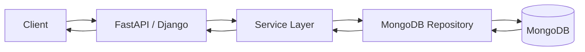
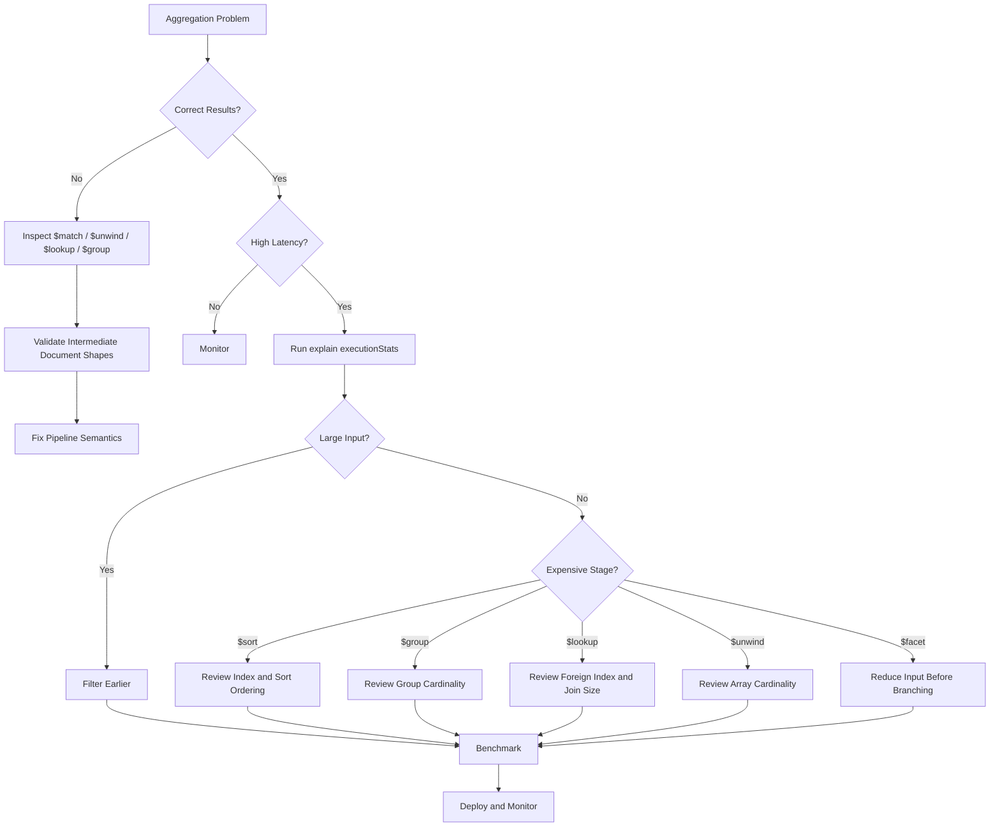

# 07- Aggregation Issues

## Overview

MongoDB aggregation issues typically occur when a pipeline processes more documents, fields, joins, array elements, or intermediate results than necessary.

A slow aggregation is not necessarily caused by one expensive stage. Performance often depends on the interaction between:

- Pipeline ordering
- Index usage
- Input cardinality
- Intermediate result size
- `$lookup` and `$unwind`
- `$group` and `$sort`
- Memory consumption
- Document size
- Data distribution
- Concurrency
- Sharding
- Application workload

A production troubleshooting workflow should therefore examine the complete pipeline:

```text
Aggregation Symptom
↓
Identify Pipeline + Workload
↓
Inspect Input Cardinality
↓
Run explain()
↓
Identify Expensive Stage
↓
Check Index Usage
↓
Reduce Data Early
↓
Optimize Pipeline / Data Model
↓
Benchmark
↓
Monitor Regression
```

The objective is not simply to make an aggregation execute faster. The objective is to ensure that the pipeline remains predictable as data volume and request concurrency increase.

## Aggregation Execution Model

An aggregation pipeline processes documents through an ordered sequence of stages.

Example:

```javascript
db.orders.aggregate([
  {
    $match: {
      tenant_id: "tenant-100",
      status: "completed"
    }
  },
  {
    $group: {
      _id: "$customer_id",
      total: {
        $sum: "$amount"
      }
    }
  },
  {
    $sort: {
      total: -1
    }
  },
  {
    $limit: 20
  }
])
```

Conceptually:

```text
Collection
    ↓
$match
    ↓
Filtered Documents
    ↓
$group
    ↓
Grouped Results
    ↓
$sort
    ↓
Top Results
    ↓
$limit
    ↓
Application
```

Every stage can change:

- Number of documents
- Document shape
- Field availability
- Ordering
- Memory requirements
- Ability to use indexes

This is why stage ordering matters.

## Common Aggregation Symptoms

| Symptom | Likely investigation area |
|---|---|
| Aggregation takes seconds or minutes | Pipeline shape, indexes, `$group`, `$sort`, `$lookup` |
| High CPU | Large pipeline, grouping, sorting, expressions |
| High memory usage | `$group`, `$sort`, `$facet`, large intermediate results |
| Disk activity increases | Large working sets or spill-to-disk behavior |
| API latency increases | Aggregation execution, connection pool, serialization |
| `$lookup` is slow | Foreign indexes, join cardinality, input size |
| `$unwind` causes huge workload | High array cardinality |
| `$sort` is expensive | Missing compatible index or large result set |
| Results are unexpectedly duplicated | `$unwind`, `$lookup`, many-to-many joins |
| Aggregation returns incomplete data | Incorrect `$match`, grouping, projection, or date boundaries |
| Production is slower than development | Data volume/distribution, memory, indexes, concurrency |
| Sharded aggregation is slow | Scatter-gather, shard targeting, merge workload |

## Aggregation Troubleshooting Methodology

Use this sequence for production incidents:

```text
Symptom
↓
Possible causes
↓
Isolation strategy
↓
Diagnostic commands
↓
Root cause
↓
Corrective action
↓
Prevention
```

For aggregation-specific investigations:

```text
1. Capture the exact pipeline.
2. Identify expected input and output cardinality.
3. Run explain().
4. Inspect the winning execution plan.
5. Determine whether the initial $match uses an index.
6. Identify stages producing large intermediate results.
7. Inspect $sort, $group, $lookup, $unwind, and $facet.
8. Reduce input data as early as possible.
9. Re-evaluate index and schema design.
10. Benchmark against production-like data.
11. Monitor after deployment.
```

## Establish a Baseline

Record at least:

- Pipeline execution time
- Request rate
- Result count
- Input document count
- Intermediate cardinality where measurable
- `totalKeysExamined`
- `totalDocsExamined`
- CPU
- Memory
- Disk activity
- Connection pool utilization
- Replica-set state
- Shard targeting behavior where applicable

Example:

```text
Pipeline:
  Tenant order summary

Before:
  Input documents:        8,400,000
  Output documents:       50
  totalDocsExamined:      8,400,000
  execution time:         4.8 s
  API p95:                5.2 s
```

This gives a concrete baseline for optimization.

## Explain Plans for Aggregations

Use `explain()` to inspect aggregation behavior.

Example:

```javascript
db.orders.aggregate([
  {
    $match: {
      tenant_id: "tenant-100",
      status: "completed"
    }
  },
  {
    $group: {
      _id: "$customer_id",
      total: {
        $sum: "$amount"
      }
    }
  }
]).explain("executionStats")
```

Depending on the MongoDB version and pipeline, explain output can contain information about:

- Query planning
- Index scans
- Collection scans
- Documents examined
- Keys examined
- Execution stages
- Aggregation-specific execution details

For production diagnosis, do not inspect only the final execution time. Determine where the work is being performed.

## Initial `$match`

One of the most important aggregation optimizations is reducing input early.

Poor pattern:

```javascript
db.orders.aggregate([
  {
    $group: {
      _id: "$customer_id",
      total: {
        $sum: "$amount"
      }
    }
  },
  {
    $match: {
      total: {
        $gt: 10000
      }
    }
  }
])
```

This must process all candidate orders before filtering grouped results.

A different optimization opportunity exists when filtering can happen before the grouping:

```javascript
db.orders.aggregate([
  {
    $match: {
      tenant_id: "tenant-100",
      status: "completed"
    }
  },
  {
    $group: {
      _id: "$customer_id",
      total: {
        $sum: "$amount"
      }
    }
  }
])
```

The principle is:

```text
Reduce input cardinality
        ↓
Process fewer documents
        ↓
Reduce downstream CPU and memory
```

## `$match` and Indexes

An initial `$match` can often benefit from an appropriate index.

Example:

```javascript
db.orders.createIndex({
  tenant_id: 1,
  status: 1,
  created_at: -1
})
```

Pipeline:

```javascript
db.orders.aggregate([
  {
    $match: {
      tenant_id: "tenant-100",
      status: "completed"
    }
  },
  {
    $sort: {
      created_at: -1
    }
  },
  {
    $limit: 100
  }
])
```

The index may support both filtering and ordering depending on the complete pipeline and query shape.

Verify with `explain()` rather than assuming index usage.

## `$project` and Data Reduction

`$project` controls which fields continue through the pipeline.

Example:

```javascript
{
  $project: {
    customer_id: 1,
    amount: 1,
    created_at: 1
  }
}
```

Reducing fields can help when:

- Documents are large.
- Later stages only require a small subset of fields.
- `$lookup`, `$group`, `$facet`, or serialization processes large documents.

However, do not insert `$project` stages mechanically.

MongoDB can optimize some projections automatically, and unnecessary pipeline stages can make the pipeline harder to reason about.

The important question is whether the stage materially reduces work.

## `$set` and Computed Fields

`$set` adds or replaces fields.

Example:

```javascript
{
  $set: {
    order_total: {
      $multiply: [
        "$quantity",
        "$unit_price"
      ]
    }
  }
}
```

Repeatedly computing expensive expressions over millions of documents can increase CPU usage.

If a value is required frequently and can be safely materialized, consider whether the data model should store it rather than recalculating it for every request.

Materialization introduces consistency and write-maintenance costs, so it should be an explicit architectural decision.

## `$unset`

`$unset` removes fields from the pipeline output:

```javascript
{
  $unset: [
    "internal_metadata",
    "debug_payload"
  ]
}
```

This can reduce downstream document size, particularly before stages that process or return large documents.

Do not use `$unset` to solve a fundamentally inefficient pipeline.

## `$group` Performance Issues

`$group` is often a major source of CPU and memory consumption.

Example:

```javascript
{
  $group: {
    _id: "$customer_id",
    total: {
      $sum: "$amount"
    },
    order_count: {
      $sum: 1
    }
  }
}
```

Potential problems include:

- Millions of input documents
- Very high grouping cardinality
- Large accumulator state
- Large intermediate results
- Expensive expressions

Investigate:

```text
Input documents
        ↓
Number of unique group keys
        ↓
Accumulator state
        ↓
Output documents
```

A pipeline grouping 100 million documents into 10 groups has different characteristics from one grouping 100 million documents into 80 million groups.

## High-Cardinality Grouping

Consider:

```javascript
{
  $group: {
    _id: "$request_id",
    count: {
      $sum: 1
    }
  }
}
```

If nearly every `request_id` is unique, the aggregation may maintain a very large number of groups.

If the business requirement only needs daily totals, grouping by:

```javascript
{
  $group: {
    _id: {
      day: "$day",
      service: "$service"
    }
  }
}
```

may produce a much smaller result set.

Aggregation performance often depends more on cardinality than on the number of pipeline stages.

## `$sort` Performance Issues

Large sorts can consume significant resources.

Example:

```javascript
{
  $sort: {
    created_at: -1
  }
}
```

Potential causes of expensive sorting:

- Large input
- No compatible index
- Sort occurring after cardinality expansion
- Large documents
- High concurrency

A common optimization is:

```text
$match
↓
$sort
↓
$limit
```

rather than:

```text
$sort
↓
$match
↓
$limit
```

when the filtering semantics allow it.

## `$sort` and `$limit`

This pattern:

```javascript
[
  {
    $sort: {
      created_at: -1
    }
  },
  {
    $limit: 50
  }
]
```

can be significantly cheaper than sorting and returning a massive result set when MongoDB can optimize the operation appropriately.

For filtered queries, combine the filter with a suitable index:

```javascript
db.orders.createIndex({
  tenant_id: 1,
  created_at: -1
})
```

Then:

```javascript
db.orders.aggregate([
  {
    $match: {
      tenant_id: "tenant-100"
    }
  },
  {
    $sort: {
      created_at: -1
    }
  },
  {
    $limit: 50
  }
])
```

## `$skip` in Aggregations

Large `$skip` values can become expensive:

```javascript
{
  $skip: 1000000
}
```

MongoDB may need to process or traverse a large number of preceding results.

For large datasets, use keyset or cursor-based pagination where the access pattern supports it.

Example:

```javascript
{
  $match: {
    tenant_id: "tenant-100",
    created_at: {
      $lt: ISODate("2026-09-20T10:00:00Z")
    }
  }
}
```

Combined with:

```javascript
{
  $sort: {
    created_at: -1,
    _id: -1
  }
}
```

This is generally more scalable than continuously increasing `skip`.

## `$unwind` Issues

`$unwind` expands array elements into separate pipeline documents.

Example document:

```javascript
{
  order_id: "ORD-100",
  items: [
    {sku: "A", quantity: 2},
    {sku: "B", quantity: 1},
    {sku: "C", quantity: 4}
  ]
}
```

After:

```javascript
{
  $unwind: "$items"
}
```

one document becomes three pipeline documents.

If:

```text
5 million documents
×
average 20 array elements
```

the pipeline can potentially process around:

```text
100 million pipeline documents
```

This is one of the most common aggregation cardinality explosions.

## Reducing `$unwind` Cost

Filter before unwinding where possible.

Instead of:

```javascript
[
  {
    $unwind: "$items"
  },
  {
    $match: {
      "items.category": "electronics"
    }
  }
]
```

consider filtering the array itself or using a pipeline structure that reduces irrelevant array elements before expansion.

The exact optimization depends on whether the application needs:

- One document per array element
- One document per parent
- Aggregated array information
- A subset of array elements

## `$lookup` Performance

`$lookup` performs a join-like operation against another collection.

Example:

```javascript
{
  $lookup: {
    from: "customers",
    localField: "customer_id",
    foreignField: "_id",
    as: "customer"
  }
}
```

Performance depends heavily on:

- Number of input documents
- Join cardinality
- Foreign collection indexes
- Size of matched documents
- Subsequent `$unwind`
- Subsequent filtering

A foreign-field index is often critical for frequently executed equality joins.

For example:

```javascript
db.customers.createIndex({
  _id: 1
})
```

The `_id` index already exists by default.

## `$lookup` with Pipeline

More complex joins can use a pipeline:

```javascript
{
  $lookup: {
    from: "orders",
    let: {
      customerId: "$_id"
    },
    pipeline: [
      {
        $match: {
          $expr: {
            $eq: [
              "$customer_id",
              "$$customerId"
            ]
          }
        }
      },
      {
        $project: {
          _id: 1,
          amount: 1,
          created_at: 1
        }
      }
    ],
    as: "orders"
  }
}
```

This provides more control but can also make optimization more complex.

Keep the foreign pipeline selective.

## `$lookup` Cardinality

Suppose:

```text
1 million customers
×
average 500 orders
```

A join can create an enormous intermediate result.

Ask:

```text
Does the API really need every related order?
```

Often the better design is:

```text
Customer
  ↓
$lookup
  ↓
$match
  ↓
$sort
  ↓
$limit
```

rather than returning every related document.

## `$facet` Performance

`$facet` allows multiple pipelines to process the same input.

Example:

```javascript
{
  $facet: {
    data: [
      { $sort: { created_at: -1 } },
      { $limit: 50 }
    ],
    total: [
      { $count: "count" }
    ]
  }
}
```

This is useful for APIs requiring:

```text
Paginated data
+
Total count
```

However, `$facet` can become expensive when the input is large.

Reduce the input before `$facet`:

```javascript
[
  {
    $match: {
      tenant_id: "tenant-100"
    }
  },
  {
    $facet: {
      data: [...],
      total: [...]
    }
  }
]
```

Do not place an unnecessarily broad dataset into a multi-branch pipeline.

## `$count`

Example:

```javascript
{
  $count: "total"
}
```

Counting a large filtered dataset can itself be expensive.

A common API pattern is:

```text
Fetch page
+
Count entire result set
```

The page may be cheap while the count is expensive.

For very large collections, evaluate whether exact counts are actually required.

Possible alternatives include:

- Approximate counts where acceptable
- Cached counts
- Precomputed counters
- Separate analytics infrastructure

The correct choice depends on product requirements.

## `$bucket`

`$bucket` groups documents into specified ranges.

Example:

```javascript
{
  $bucket: {
    groupBy: "$amount",
    boundaries: [
      0,
      100,
      500,
      1000,
      5000
    ],
    default: "5000+",
    output: {
      count: {
        $sum: 1
      }
    }
  }
}
```

Potential performance problems come from feeding large datasets into the stage unnecessarily.

Filter the population before bucketing where possible.

## `$bucketAuto`

`$bucketAuto` dynamically determines bucket boundaries.

It can be useful for analytical workloads but may require substantial processing because the database needs to derive the bucket distribution.

Avoid using it on request paths that require extremely predictable low latency unless the workload has been benchmarked.

## `$replaceRoot` and `$replaceWith`

These stages can reshape documents:

```javascript
{
  $replaceWith: "$customer"
}
```

or:

```javascript
{
  $replaceRoot: {
    newRoot: "$customer"
  }
}
```

Problems often occur when the replacement changes the expected document structure and later stages assume fields that no longer exist.

When troubleshooting, inspect the document shape after every major transformation.

## `$unionWith`

`$unionWith` combines results from another collection.

Example:

```javascript
{
  $unionWith: {
    coll: "archived_orders"
  }
}
```

This can become expensive because multiple collections may need to be scanned or indexed independently.

Consider whether the data model or storage architecture should instead provide a unified access path.

## `$merge`

`$merge` writes aggregation results into a target collection.

Example:

```javascript
{
  $merge: {
    into: "customer_order_totals",
    on: "_id",
    whenMatched: "replace",
    whenNotMatched: "insert"
  }
}
```

This is useful for materialized views and batch processing.

Production considerations include:

- Idempotency
- Write volume
- Target indexes
- Failure handling
- Concurrency
- Partial execution
- Scheduling

Do not treat `$merge` as a free caching mechanism.

## `$out`

`$out` writes aggregation results to a collection.

It is useful for controlled batch workflows but can have substantial operational impact because the aggregation must produce and persist the resulting dataset.

Avoid using heavy `$out` workloads directly on latency-sensitive request paths.

## Expression Performance

Expressions can become expensive when evaluated across millions of documents.

Examples include:

- String transformations
- Date extraction
- Array processing
- Complex conditionals
- Nested expressions

Example:

```javascript
{
  $set: {
    normalized_email: {
      $toLower: "$email"
    }
  }
}
```

If this is repeatedly required at very high volume, consider whether the normalized value should be stored at write time.

This is a classic trade-off:

```text
Compute at read
    vs
Compute at write
```

## Date Expression Issues

Date filtering should use precise boundaries.

Example:

```javascript
{
  $match: {
    created_at: {
      $gte: ISODate("2026-09-01T00:00:00Z"),
      $lt: ISODate("2026-10-01T00:00:00Z")
    }
  }
}
```

Prefer half-open intervals:

```text
[start, end)
```

This avoids overlap between adjacent time ranges.

Be careful with:

- Time zones
- Daylight-saving transitions
- Application-local dates
- UTC storage
- Inclusive vs exclusive boundaries

For backend systems, storing timestamps consistently in UTC is generally easier to reason about.

## String Expression Issues

String expressions can be CPU-intensive over large datasets.

Examples:

```javascript
$concat
$substr
$toLower
$toUpper
$regexMatch
$replaceAll
```

Do not repeatedly normalize millions of documents on every API request if the same derived value can safely be maintained during writes.

## Conditional Expressions

Expressions such as `$cond`, `$ifNull`, and `$switch` are useful:

```javascript
{
  $set: {
    priority_label: {
      $switch: {
        branches: [
          {
            case: {
              $gte: ["$priority", 90]
            },
            then: "critical"
          },
          {
            case: {
              $gte: ["$priority", 50]
            },
            then: "normal"
          }
        ],
        default: "low"
      }
    }
  }
}
```

The main performance concern is not the existence of conditional expressions but applying complex expressions across unnecessarily large input sets.

## Memory and Aggregation

Stages such as:

- `$group`
- `$sort`
- `$facet`
- `$setWindowFields`

can require substantial working memory depending on workload.

A memory-heavy aggregation can result in:

```text
Large input
   ↓
Large intermediate state
   ↓
Memory pressure
   ↓
Storage activity / slower execution
   ↓
Higher API latency
```

Do not evaluate aggregation performance solely from CPU.

Memory and storage behavior are equally important.

## `allowDiskUse`

For aggregation workloads that exceed in-memory processing limits, disk use can be permitted where supported by the MongoDB deployment/version and operation.

Example:

```javascript
db.orders.aggregate(
  [
    {
      $group: {
        _id: "$customer_id",
        total: {
          $sum: "$amount"
        }
      }
    }
  ],
  {
    allowDiskUse: true
  }
)
```

Disk use can prevent an aggregation from failing because of memory constraints, but it is not a performance optimization.

If an aggregation spills to disk, performance may degrade substantially.

Treat disk spilling as a signal to investigate:

- Input size
- Pipeline structure
- Grouping cardinality
- Sort strategy
- Data model
- Workload isolation

## Aggregation and Working Set

Aggregation workloads can compete with operational workloads for memory and storage resources.

For example:

```text
API reads
     +
Background aggregation
     +
Backup activity
     ↓
Shared MongoDB resources
```

A large analytics aggregation can therefore increase latency for ordinary API requests.

For production systems, consider:

- Scheduling heavy jobs
- Running analytics on separate infrastructure
- Read isolation where appropriate
- Materialized views
- Data warehouse or analytical systems

## Aggregation in APIs

A typical backend architecture is:



Aggregation pipelines should normally remain inside the repository/data-access layer rather than being constructed directly from arbitrary client input.

This provides:

- Controlled query shapes
- Authorization enforcement
- Index-aware design
- Validation
- Easier testing
- Better observability

## FastAPI Aggregation Example

A repository can expose a specific business operation:

```python
from datetime import datetime

from pymongo.collection import Collection


class OrderRepository:
    def __init__(self, collection: Collection):
        self.collection = collection

    def get_customer_totals(
        self,
        tenant_id: str,
        start: datetime,
        end: datetime,
        limit: int = 50,
    ) -> list[dict]:
        pipeline = [
            {
                "$match": {
                    "tenant_id": tenant_id,
                    "created_at": {
                        "$gte": start,
                        "$lt": end,
                    },
                }
            },
            {
                "$group": {
                    "_id": "$customer_id",
                    "total": {
                        "$sum": "$amount",
                    },
                    "order_count": {
                        "$sum": 1,
                    },
                }
            },
            {
                "$sort": {
                    "total": -1,
                }
            },
            {
                "$limit": min(limit, 100),
            },
        ]

        return list(self.collection.aggregate(pipeline))
```

Production considerations:

- Bound user-controlled limits.
- Enforce tenant authorization.
- Validate date ranges.
- Avoid arbitrary client-defined pipeline stages.
- Add indexes based on the actual workload.
- Monitor aggregation latency.
- Consider caching or materialization for frequently requested expensive reports.

## Aggregation from Python

PyMongo supports aggregation through `Collection.aggregate()`.

Example:

```python
pipeline = [
    {
        "$match": {
            "tenant_id": tenant_id,
            "status": "completed",
        }
    },
    {
        "$group": {
            "_id": "$customer_id",
            "total": {
                "$sum": "$amount",
            },
        }
    },
]

cursor = orders.aggregate(pipeline)

for document in cursor:
    process(document)
```

Prefer cursor-based processing for large result sets instead of immediately converting an unbounded aggregation result to a list.

Avoid:

```python
results = list(
    orders.aggregate(large_pipeline)
)
```

when the output can become very large.

## Aggregation Cursor Handling

For large outputs:

```python
cursor = orders.aggregate(pipeline)

for document in cursor:
    process(document)
```

This allows incremental processing.

However, cursor-based consumption does not make an expensive pipeline itself cheap. MongoDB may still need substantial work before or between batches.

## Background Aggregations

Heavy aggregation workloads are often better suited to:

- Celery
- Kubernetes Jobs
- Airflow
- Scheduled workers
- Batch pipelines

Example architecture:

```text
API Request
    ↓
Create Report Job
    ↓
Queue
    ↓
Celery Worker
    ↓
MongoDB Aggregation
    ↓
Materialized Result
    ↓
Redis / MongoDB / Object Storage
    ↓
API retrieves result
```

This prevents a long-running aggregation from consuming an API request worker.

## Aggregation and Redis

Redis can be useful for caching expensive aggregation results.

Example:

```text
Request
  ↓
Redis cache
  ↓
Hit → return result
  ↓
Miss
  ↓
MongoDB aggregation
  ↓
Store result
  ↓
Return result
```

Use caching only when:

- The result is reusable.
- Staleness is acceptable.
- Cache invalidation is manageable.
- The underlying aggregation is sufficiently expensive to justify caching.

Do not use Redis to hide an unbounded aggregation problem indefinitely.

## Aggregation and Kafka

For high-volume event systems, repeatedly aggregating raw operational data may be inefficient.

An architecture might instead be:

```text
MongoDB Change Stream
        ↓
Kafka
        ↓
Aggregation Consumer
        ↓
Materialized Metrics
        ↓
MongoDB / Redis / Analytics Store
```

This shifts repeated computation from request time toward incremental processing.

The trade-off is greater system complexity and eventual consistency.

## Aggregation and Schema Design

Aggregation performance can often be improved through data modeling.

Suppose every request requires:

```text
Customer
+
Latest 10 Orders
+
Order Count
+
Total Spend
```

Repeatedly calculating all four values from raw order data may be expensive.

Possible alternatives include storing derived values:

```javascript
{
  customer_id: "C-100",
  order_count: 1250,
  total_spend: 87500,
  latest_orders: [...]
}
```

This improves read performance but introduces write-time consistency requirements.

Senior-level MongoDB design therefore asks:

```text
Should this value be calculated at read time,
or maintained at write time?
```

## Aggregation Anti-Patterns

### Unbounded Aggregations on Request Paths

Avoid:

```text
HTTP request
  ↓
Scan millions of documents
  ↓
$group
  ↓
$sort
  ↓
Return response
```

For expensive reports, prefer asynchronous processing or materialized results.

### `$lookup` Before Filtering

Poor:

```javascript
[
  { $lookup: ... },
  { $match: ... }
]
```

when the filter could safely reduce the input first.

Prefer:

```javascript
[
  { $match: ... },
  { $lookup: ... }
]
```

when semantics permit.

### `$unwind` Too Early

Unwinding a large array before filtering can multiply work dramatically.

### Sorting Huge Intermediate Results

Avoid creating large intermediate datasets and sorting them when earlier filtering can reduce the population.

### Repeated Runtime Computation

If an expensive derived field is needed for nearly every request, consider whether materialization is more appropriate.

### Exact Counts Everywhere

Exact counts over huge datasets can become expensive.

Evaluate whether the product actually requires exact real-time counts.

### Returning Massive Aggregation Results

An aggregation returning hundreds of thousands of documents can overwhelm:

- MongoDB
- Network
- Python process
- API clients

Paginate, stream, export asynchronously, or redesign the result.

## Common Data Correctness Issues

Aggregation problems are not always performance problems.

### Duplicate Results

Potential causes:

- `$unwind`
- `$lookup`
- Many-to-many relationships
- Incorrect grouping keys

Example:

```javascript
{
  $group: {
    _id: "$customer_id"
  }
}
```

may eliminate distinctions that the business logic requires.

### Missing Results

Potential causes:

- `$match`
- Incorrect date boundaries
- Null handling
- Incorrect `$lookup`
- `$unwind` removing documents
- Incorrect `$group`
- Projection removing required fields

### Null vs Missing Fields

MongoDB documents may contain:

```javascript
{
  field: null
}
```

or omit the field entirely:

```javascript
{
}
```

Aggregation expressions can behave differently depending on whether a field is:

- Missing
- `null`
- Empty array
- Empty string

Test these cases explicitly.

## `$unwind` and Missing Arrays

Consider:

```javascript
{
  $unwind: "$items"
}
```

Documents without matching array elements may disappear from the pipeline.

When required, use:

```javascript
{
  $unwind: {
    path: "$items",
    preserveNullAndEmptyArrays: true
  }
}
```

This changes result semantics and should be chosen intentionally.

## Date Boundary Bugs

Avoid ambiguous application-generated date ranges.

Prefer:

```javascript
{
  created_at: {
    $gte: start,
    $lt: end
  }
}
```

rather than:

```javascript
{
  created_at: {
    $gte: start,
    $lte: end
  }
}
```

when adjacent periods must not overlap.

## Aggregation and Transactions

Aggregation can participate in transactional workflows in supported scenarios, but transactions should not be used simply because an aggregation exists.

Transactions are appropriate when multiple reads/writes require a transactional consistency boundary.

For reporting workloads, a transaction may increase resource consumption without solving the underlying performance problem.

Separate:

```text
Transactional workload
```

from:

```text
Analytical workload
```

when architecture requires it.

## Aggregation on Replica Sets

Read preference can affect where aggregation executes.

For workloads where slightly stale data is acceptable, some architectures may use secondary reads.

However, evaluate:

- Secondary capacity
- Replication lag
- Read consistency
- Failure behavior
- Network topology

Do not automatically send heavy aggregations to secondaries. A reporting query can still overwhelm the secondary and increase replication lag or reduce failover capacity.

## Aggregation in Sharded Clusters

Aggregation in a sharded cluster may involve:

```text
mongos
  ↓
Shard A ─┐
Shard B ─┼→ Partial Results
Shard C ─┘
            ↓
         Merge
            ↓
         Result
```

Performance depends on whether MongoDB can target relevant shards.

A query that includes useful shard-key information can reduce unnecessary shard participation.

Scatter-gather aggregation can become expensive because every relevant shard may process the workload.

## Sharded Aggregation Issues

Investigate:

- Shard-key selectivity
- Number of targeted shards
- Scatter-gather behavior
- Data distribution
- Hot shards
- Merge workload
- Network traffic
- Skewed cardinality

Do not treat a sharded cluster as a replacement for query optimization.

## Security Considerations

Aggregation pipelines should not be directly controlled by untrusted clients.

Avoid APIs such as:

```http
POST /aggregate
```

where the client can submit arbitrary MongoDB pipeline stages.

Risks include:

- Unauthorized data access
- Expensive queries
- Data exfiltration
- Resource exhaustion
- Cross-tenant access
- Injection-like query construction errors

Prefer predefined server-side pipelines:

```text
Client parameters
    ↓
Validation
    ↓
Authorization
    ↓
Controlled repository method
    ↓
Known aggregation pipeline
```

For multi-tenant applications, tenant isolation should be enforced server-side.

## Observability

Aggregation monitoring should capture:

- Operation latency
- Query shape
- Execution frequency
- Error rate
- Result size
- Database CPU
- Memory pressure
- Disk activity
- Connection usage
- Replica lag
- Shard participation

For application logs, record safe metadata such as:

```json
{
  "operation": "customer_order_summary",
  "tenant": "tenant-100",
  "duration_ms": 240,
  "result_count": 50
}
```

Do not log sensitive documents or credentials.

## Performance Regression Testing

Aggregation pipelines should be treated like application code.

A regression test can verify:

```text
Pipeline correctness
+
Representative data volume
+
Expected latency envelope
+
Index availability
```

Do not rely exclusively on unit tests.

A pipeline may return correct results while becoming operationally unacceptable at production scale.

## CI/CD Considerations

For important pipelines:

```text
Code Change
    ↓
Unit Tests
    ↓
Aggregation Result Tests
    ↓
Representative Dataset
    ↓
Performance Benchmark
    ↓
Deployment
    ↓
Production Monitoring
```

Avoid automatically running huge production-scale aggregations in every CI job.

Instead, use a representative benchmark dataset and controlled performance thresholds.

## Production Checklist

### Correctness

- [ ] Pipeline output is verified.
- [ ] Null and missing-field behavior is tested.
- [ ] Date boundaries are explicit.
- [ ] `$unwind` behavior is understood.
- [ ] `$lookup` cardinality is understood.
- [ ] Grouping keys are correct.
- [ ] Tenant boundaries are enforced.

### Performance

- [ ] Pipeline has been explained.
- [ ] Initial `$match` is selective where appropriate.
- [ ] Suitable indexes exist.
- [ ] Large `$sort` stages are understood.
- [ ] `$group` cardinality is understood.
- [ ] `$lookup` performance is measured.
- [ ] `$unwind` expansion is measured.
- [ ] Large `$skip` usage has been reviewed.
- [ ] Result size is bounded.
- [ ] Memory and disk behavior are understood.

### Production

- [ ] API timeouts are configured.
- [ ] Expensive reports are moved to background processing when appropriate.
- [ ] Aggregation latency is monitored.
- [ ] Database resource usage is monitored.
- [ ] Shard targeting is understood where applicable.
- [ ] Read preference is intentional.
- [ ] Security boundaries are enforced.
- [ ] Performance regression testing exists for critical pipelines.

## Troubleshooting Decision Tree



## Production Runbook

```text
Aggregation Incident
        ↓
Confirm affected API/job
        ↓
Capture exact pipeline
        ↓
Check request volume
        ↓
Check MongoDB CPU / memory / disk
        ↓
Run explain()
        ↓
Inspect initial $match
        ↓
Inspect $sort / $group / $lookup / $unwind
        ↓
Measure intermediate cardinality
        ↓
Check indexes
        ↓
Check data growth and distribution
        ↓
Identify root cause
        ↓
Apply smallest safe optimization
        ↓
Benchmark with representative data
        ↓
Deploy
        ↓
Monitor latency and resources
        ↓
Document prevention
```

## Interview Traps

### "Aggregation is always slower than normal queries."

Not necessarily.

Aggregation is a framework for processing data. A well-designed pipeline can efficiently filter, transform, and aggregate large datasets.

The important factors are the pipeline, indexes, data volume, and workload.

### "Adding `$match` anywhere has the same performance effect."

No.

Filtering early can dramatically reduce the amount of data processed by later stages.

### "`$lookup` is equivalent to a cheap relational join."

No.

Join cost depends on input cardinality, foreign indexes, document sizes, and result cardinality.

### "`$unwind` only changes document structure."

It also changes cardinality.

One input document can become many pipeline documents, potentially multiplying the workload.

### "`allowDiskUse` fixes aggregation performance."

No.

It can allow certain operations to use disk when memory is insufficient, but disk-based processing can be significantly slower.

### "Aggregation performance is only about indexes."

No.

Indexes matter, especially for early filtering and ordering, but `$group`, `$sort`, `$lookup`, `$unwind`, memory, working set, data distribution, and concurrency can dominate execution cost.

### "A correct aggregation is production-ready."

Not necessarily.

Correctness and operational scalability are separate concerns. A pipeline can return exactly the right answer while being too expensive to execute at production volume.

## Key Takeaways

- **Aggregation performance is primarily controlled by input cardinality, pipeline ordering, index usage, and the amount of intermediate state created by stages such as `$group`, `$sort`, `$lookup`, and `$unwind`.**
- **Use `explain()` and production-like data to identify where the pipeline spends its work; do not optimize based only on the number of pipeline stages or the presence of an index.**
- **Reduce data as early as semantics allow, avoid unnecessary cardinality expansion, and design indexes around the initial filtering and ordering requirements.**
- **Expensive aggregations often belong in background jobs, materialized views, caches, or analytical infrastructure rather than synchronous API request paths.**
- **Treat aggregation pipelines as production code: validate correctness, enforce security boundaries, benchmark realistic workloads, monitor regressions, and document operational behavior.**