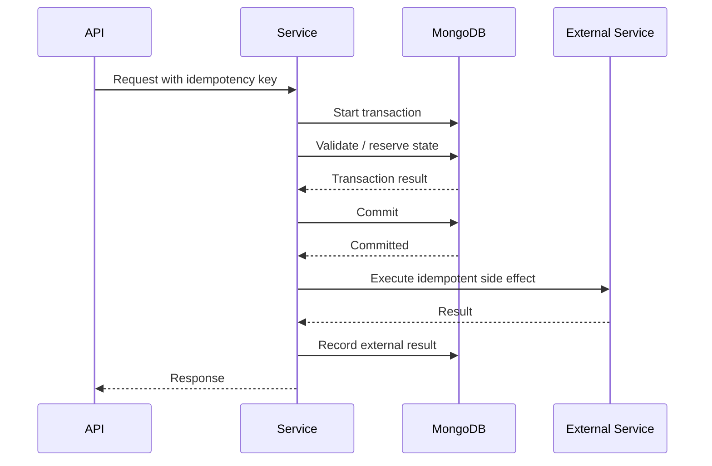
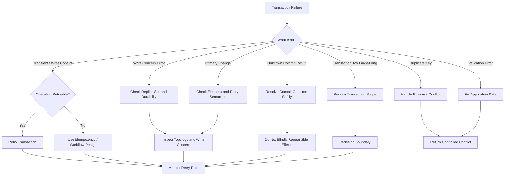

# 08- Transaction Issues

## Overview

MongoDB transactions provide atomicity across multiple documents and collections, but they should be used deliberately. Many transaction problems are caused not by MongoDB itself, but by transaction boundaries that are too large, unnecessary, long-lived, or incompatible with the application's concurrency model.

A production transaction investigation should distinguish between:

- Transaction correctness
- Transaction conflicts
- Transaction lifetime
- Read and write concerns
- Retry behavior
- Replica-set health
- Application concurrency
- Transaction size and workload
- Data-model problems

A useful troubleshooting model is:

```text
Transaction Failure
↓
Identify Transaction Boundary
↓
Classify Error
↓
Check Session / Transaction State
↓
Check Read + Write Concerns
↓
Check Replica Set / Server State
↓
Check Concurrent Writes
↓
Check Transaction Duration and Size
↓
Determine Retry Safety
↓
Correct Root Cause
↓
Test Failure Scenario
↓
Monitor Production Behavior
```

The core principle is:

> Use transactions when multiple operations genuinely require an atomic consistency boundary. Do not use transactions to compensate for poor data modeling or unnecessarily broad business workflows.

## MongoDB Transaction Model

A single MongoDB document operation is atomic at the document level.

For example:

```javascript
db.accounts.updateOne(
  { _id: "A100" },
  {
    $inc: {
      balance: -100
    }
  }
)
```

The update to that document is atomic.

However, consider a money transfer:

```text
Account A
    ↓
Debit $100

Account B
    ↓
Credit $100
```

If these are independent operations, a failure between them can leave the system inconsistent.

A transaction provides:

```text
Start Transaction
      ↓
Debit Account A
      ↓
Credit Account B
      ↓
Commit
      ↓
Both changes become committed together
```

If the transaction aborts:

```text
Debit
Credit
  ↓
Abort
  ↓
Changes rolled back
```

## When Transactions Are Appropriate

Transactions are appropriate when multiple writes must satisfy a single atomic business invariant.

Examples include:

- Financial transfers
- Inventory reservation across multiple documents
- Creating an order and related state changes
- Updating multiple collections that must remain consistent
- Coordinated state transitions

Example:

```text
Order
  +
Inventory
  +
Payment State
```

If partial updates would violate a business invariant, a transaction may be justified.

## When Transactions Should Be Avoided

Do not automatically wrap every request in a transaction.

Transactions may be unnecessary when:

- One document contains all required state.
- A single atomic update can enforce the invariant.
- Operations are independent.
- Eventual consistency is acceptable.
- A background workflow can reconcile state.
- The data model can be redesigned to avoid cross-document coordination.

Prefer:

```javascript
db.inventory.updateOne(
  {
    _id: "SKU-100",
    available: { $gte: 1 }
  },
  {
    $inc: {
      available: -1
    }
  }
)
```

over a multi-document transaction when the business invariant can safely be enforced by one atomic document update.

## Transaction vs Single-Document Atomicity

| Requirement | Preferred approach |
|---|---|
| Update one document | Atomic document operation |
| Conditional state transition | Atomic update with filter |
| Update several independent documents | Separate operations if consistency permits |
| Multiple documents must commit together | Transaction |
| High-volume independent writes | Bulk operations where appropriate |
| Eventual consistency workflow | Events / asynchronous processing |
| Frequently updated related data | Reconsider data model |

The first question should always be:

```text
Can this invariant be enforced atomically within one document?
```

If yes, a transaction may not be necessary.

## Transaction Lifecycle

A transaction generally follows:

```text
Create Client
    ↓
Start Session
    ↓
Start Transaction
    ↓
Read / Write
    ↓
Commit
    ↓
End Session
```

On failure:

```text
Operation
    ↓
Exception
    ↓
Abort Transaction
    ↓
Retry or Fail
```

The session is an important part of the transaction context.

## Session and Transaction Relationship

MongoDB transactions are associated with sessions.

In PyMongo:

```python
with client.start_session() as session:
    with session.start_transaction():
        accounts.update_one(
            {"_id": "A100"},
            {"$inc": {"balance": -100}},
            session=session,
        )

        accounts.update_one(
            {"_id": "B100"},
            {"$inc": {"balance": 100}},
            session=session,
        )
```

Every operation intended to participate in the transaction must use the same session.

A common mistake is:

```python
with client.start_session() as session:
    with session.start_transaction():
        accounts.update_one(
            {"_id": "A100"},
            {"$inc": {"balance": -100}},
        )
```

The missing:

```python
session=session
```

means the operation is not associated with that transaction.

## Transaction State

A transaction has a lifecycle:

```text
No Transaction
      ↓
Transaction Started
      ↓
Operations
      ↓
 ┌────┴────┐
 ↓         ↓
Commit    Abort
 ↓         ↓
Committed Aborted
```

Application code should not attempt to reuse a completed transaction as though it were still active.

If a transaction fails, determine whether the session can safely retry the transaction or whether the application operation itself must be retried.

## Transaction Errors

Common transaction-related error categories include:

| Error category | Typical cause |
|---|---|
| Transaction aborted | Explicit abort or server-side abort |
| Write conflict | Concurrent modification |
| Transient transaction error | Retryable transaction failure |
| Unknown commit result | Client cannot determine whether commit completed |
| Transaction too large/long | Excessive workload |
| Not supported | Deployment/configuration limitations |
| Session error | Invalid or incorrectly reused session |
| Write concern failure | Required acknowledgment not achieved |
| Primary/election issue | Replica-set topology change |

Always classify the error before implementing a retry.

## Write Conflicts

Two concurrent operations can attempt to modify related data.

Conceptually:

```text
Transaction A
    ↓
Read Document X
    ↓
Modify X
          ↘
            Concurrent Update
          ↗
Transaction B
    ↓
Modify Document X
```

MongoDB may abort one transaction because of a write conflict.

This is expected behavior in concurrent systems.

The application must determine whether the transaction can safely be retried.

## Transient Transaction Errors

Some transaction failures are transient and can be retried.

A retry strategy should distinguish:

```text
Transient transaction failure
```

from:

```text
Permanent application error
```

Do not retry everything.

For example:

```text
Validation failure
→ Retry will not fix it

Authorization failure
→ Retry will not fix it

Write conflict
→ Retry may succeed

Transient transaction error
→ Retry may succeed
```

## Retry Safety

Retries are only safe when the transaction's business operation is designed to be retryable.

Suppose the application executes:

```text
Create payment
Charge external provider
Update MongoDB
```

A MongoDB transaction cannot atomically include an external payment provider.

Retrying the entire business workflow could potentially charge the customer twice.

Therefore:

```text
MongoDB transaction
≠
Distributed transaction across external systems
```

Use idempotency keys and explicit workflow state for external side effects.

## Transaction Retry Architecture

A robust architecture can look like:



The exact ordering depends on business semantics, but external side effects should not be assumed to participate in MongoDB's transaction.

## Commit Ambiguity

One particularly important failure mode occurs when the client cannot determine whether a commit succeeded.

Conceptually:

```text
Application
    ↓
commitTransaction()
    ↓
MongoDB commits
    ↓
Network failure
    ↓
Application receives no definitive response
```

The application now has an ambiguous outcome.

It should not blindly assume:

```text
Commit failed
```

and execute the business operation again.

Retry behavior for commit results is different from retrying the entire transaction body.

## Read Concern

Read concern controls the consistency characteristics of reads.

Common levels include:

- `local`
- `available`
- `majority`
- `snapshot`
- `linearizable` in applicable contexts

Transaction design should explicitly consider what consistency is required.

For example:

```text
Strong consistency requirement
        ↓
Evaluate majority / snapshot semantics
        ↓
Evaluate transaction requirements
```

Do not choose a read concern solely because it is commonly used elsewhere in the application.

## Write Concern

Write concern determines how MongoDB acknowledges writes.

Common patterns include:

```javascript
{ w: 1 }
```

and:

```javascript
{ w: "majority" }
```

`majority` requires acknowledgment from a majority of voting members under the relevant replica-set semantics.

For durability-sensitive operations, majority write concern is often important.

However, stronger acknowledgment can affect latency and availability characteristics.

## Read Preference

Read preference controls which replica-set members can serve reads.

Common modes include:

- `primary`
- `primaryPreferred`
- `secondary`
- `secondaryPreferred`
- `nearest`

Transactions have additional restrictions and semantics around read preference.

Do not assume that sending reads to secondaries automatically improves transaction performance.

Consider:

- Replication lag
- Consistency
- Network latency
- Secondary capacity
- Failover behavior

## Transaction and Replica Sets

Transactions interact closely with replica-set topology.

A simplified deployment:

```text
                ┌──────────────┐
                │   Primary    │
                └──────┬───────┘
                       │
             Replication / Oplog
                 ┌─────┴─────┐
                 ↓           ↓
          ┌──────────┐ ┌──────────┐
          │ Secondary│ │ Secondary│
          └──────────┘ └──────────┘
```

During a transaction, the application is interacting with a specific MongoDB topology and transaction context.

Replica-set health problems can therefore surface as transaction errors.

## Elections During Transactions

If the primary steps down during a transaction:

```text
Transaction
    ↓
Primary steps down
    ↓
Transaction interrupted
    ↓
Application receives error
    ↓
Determine retry semantics
```

The application should use the driver's transaction retry mechanisms where appropriate rather than implementing arbitrary retries.

Monitor:

- Election events
- Primary changes
- Replication lag
- Transaction aborts
- Application retry rates

## Transaction Lifetime

Long-running transactions are dangerous because they can hold resources and interact poorly with concurrent workloads.

Avoid:

```text
Start transaction
    ↓
Call external HTTP service
    ↓
Wait 10 seconds
    ↓
Process business logic
    ↓
Call another service
    ↓
Commit
```

Instead, keep database transactions focused:

```text
Validate
    ↓
Start transaction
    ↓
Database operations
    ↓
Commit
```

External calls should generally occur outside the transaction unless there is a specific reason they must influence the transaction's database state.

## Transaction Duration

A transaction's duration should be minimized.

Long transactions can:

- Increase contention
- Increase conflict probability
- Increase resource usage
- Increase rollback work
- Interact poorly with concurrent writes
- Increase latency
- Increase operational complexity

Measure:

```text
transaction duration
+
operations per transaction
+
documents touched
```

rather than only counting transaction failures.

## Transaction Size

Transactions should not become a substitute for batch processing.

Poor pattern:

```text
Start transaction
↓
Process 500,000 documents
↓
Commit
```

This creates a large transaction boundary and can create substantial resource pressure.

Prefer smaller units of work when business semantics permit.

If a large migration requires transactional semantics, consider whether the data model or migration strategy can be redesigned.

## Transaction Performance

Transactions have overhead compared with independent document operations.

Potential sources include:

- Session management
- Snapshot/consistency requirements
- Conflict detection
- Commit processing
- Write concern
- Replication
- Larger transaction state

For high-throughput workloads, compare:

```text
Single atomic update
```

against:

```text
Multi-document transaction
```

when both can satisfy the business requirement.

## Transaction Example: Account Transfer

A transaction can protect a transfer:

```python
from pymongo import MongoClient


client = MongoClient(
    "mongodb://localhost:27017",
    serverSelectionTimeoutMS=5000,
)

db = client["banking"]
accounts = db["accounts"]


def transfer(
    from_account: str,
    to_account: str,
    amount: int,
) -> None:
    if amount <= 0:
        raise ValueError("amount must be positive")

    with client.start_session() as session:
        with session.start_transaction():
            result = accounts.update_one(
                {
                    "_id": from_account,
                    "balance": {"$gte": amount},
                },
                {
                    "$inc": {"balance": -amount},
                },
                session=session,
            )

            if result.modified_count != 1:
                raise ValueError("insufficient funds or source account missing")

            result = accounts.update_one(
                {"_id": to_account},
                {
                    "$inc": {"balance": amount},
                },
                session=session,
            )

            if result.modified_count != 1:
                raise ValueError("destination account missing")
```

The conditional source update is important.

The application should not:

```text
Read balance
↓
Check balance in Python
↓
Later decrement balance
```

without considering concurrent updates.

The database predicate:

```javascript
balance: { $gte: amount }
```

helps enforce the invariant atomically.

## Transaction Options in Python

PyMongo allows transaction options to be specified.

Example:

```python
from pymongo import ReadConcern, WriteConcern
from pymongo.read_preferences import Primary


with client.start_session() as session:
    with session.start_transaction(
        read_concern=ReadConcern("snapshot"),
        write_concern=WriteConcern("majority"),
        read_preference=Primary(),
    ):
        ...
```

Use explicit options when the application's consistency and durability requirements justify them.

Avoid configuring stronger guarantees without understanding the latency and availability implications.

## Automatic Transaction Retry

PyMongo provides transaction APIs that handle important transaction retry semantics.

For example:

```python
def operation(session):
    accounts.update_one(
        {"_id": "A100"},
        {"$inc": {"balance": -100}},
        session=session,
    )

    accounts.update_one(
        {"_id": "B100"},
        {"$inc": {"balance": 100}},
        session=session,
    )


with client.start_session() as session:
    session.with_transaction(operation)
```

The driver can retry transactions for appropriate transient conditions.

Even when using driver-provided retry behavior, the callback should be designed so that retrying it does not create unsafe external side effects.

## Transaction Callback Rules

A transaction callback should ideally contain database operations only.

Prefer:

```python
def operation(session):
    collection.update_one(
        {"_id": "A100"},
        {"$inc": {"balance": -100}},
        session=session,
    )
```

Avoid:

```python
def operation(session):
    collection.update_one(...)

    requests.post(
        "https://payment.example.com/charge",
        ...
    )
```

The external request can execute more than once if the transaction callback is retried.

## Idempotency

For operations that can be retried, use an idempotency mechanism.

Example document:

```javascript
{
  "_id": "payment-request-7f92",
  "status": "completed",
  "amount": 100,
  "created_at": ISODate("2026-09-23T10:00:00Z")
}
```

The application can enforce uniqueness:

```javascript
db.payments.createIndex(
  { request_id: 1 },
  { unique: true }
)
```

Then repeated requests using the same idempotency key can resolve to the same logical operation rather than creating duplicate effects.

## Transaction and Unique Index Errors

Unique constraints can cause transaction failures.

Example:

```javascript
db.users.createIndex(
  { email: 1 },
  { unique: true }
)
```

Two concurrent transactions attempting to create:

```text
alice@example.com
```

may cause one operation to fail.

Do not automatically treat duplicate-key errors as transient transaction failures.

A duplicate-key violation is usually a business or application-level conflict.

## Transaction and Schema Validation

Schema validation can also cause transaction operations to fail.

For example:

```javascript
{
  $jsonSchema: {
    required: ["status", "amount"]
  }
}
```

An insert missing `amount` can abort the transaction.

The correct response is generally:

```text
Fix application data
```

rather than:

```text
Retry transaction indefinitely
```

## Transaction and Write Conflicts

A typical failure pattern:

```text
Transaction A
    ↓
Read X
    ↓
Modify X
          ↘
            Transaction B modifies X
          ↗
Transaction A
    ↓
Commit
    ↓
Conflict
```

Possible response:

```text
Abort
↓
Retry transaction
```

provided the operation is safe to retry.

Repeated write conflicts can indicate a deeper data-model problem.

## Hot Documents

A hot document is frequently modified by many concurrent requests.

Example:

```javascript
{
  "_id": "global-counter",
  "count": 123456789
}
```

If hundreds or thousands of workers repeatedly update it, contention can become significant.

Wrapping additional operations around the hot document in a transaction can increase contention further.

Possible architectural alternatives include:

- Sharded counters
- Partitioned state
- Event-driven aggregation
- Periodic materialization
- Per-tenant counters
- Batched updates

## Transaction and Microservices

Transactions do not automatically provide atomicity across microservices.

Consider:

```text
Order Service
    ↓
MongoDB

Payment Service
    ↓
Payment Provider

Inventory Service
    ↓
MongoDB
```

A MongoDB transaction in Order Service cannot atomically commit changes in the Payment Service's database.

For distributed workflows, use patterns such as:

- Saga
- Outbox
- Idempotency
- Event-driven workflows
- Compensation

A transaction may still be useful within each service boundary.

## Transaction and Outbox Pattern

A transaction can atomically update business state and an outbox document:

```text
MongoDB Transaction
    ├── Update Order
    └── Insert Outbox Event
             ↓
          Commit
             ↓
       Event Publisher
             ↓
           Kafka
```

Example:

```javascript
session.withTransaction(() => {
  db.orders.updateOne(
    { _id: "ORD-100" },
    { $set: { status: "confirmed" } },
    { session }
  )

  db.outbox.insertOne(
    {
      event_type: "OrderConfirmed",
      aggregate_id: "ORD-100",
      created_at: new Date()
    },
    { session }
  )
})
```

The exact implementation depends on the application driver and language, but the architectural principle is:

```text
Business state + event record
        ↓
Same transaction
```

A separate worker can then publish the event to Kafka.

## Transaction and Celery

For background workers, avoid holding a MongoDB transaction open while the worker performs unrelated work.

Poor:

```text
Start transaction
↓
Process 1,000 messages
↓
Call external service
↓
Sleep
↓
Commit
```

Prefer:

```text
Message
↓
Short database transaction
↓
Commit
↓
Acknowledge message
```

or an idempotent workflow that can safely retry.

## Transaction and Kafka

Kafka offsets and MongoDB transactions are separate systems.

This does not automatically provide exactly-once behavior across both systems.

A typical workflow:

```text
Kafka Message
    ↓
Consumer
    ↓
MongoDB Transaction
    ↓
Commit
    ↓
Commit Kafka Offset
```

Failure between the database commit and Kafka offset commit can cause the message to be processed again.

Therefore the MongoDB operation should be idempotent.

Use:

- Event IDs
- Unique constraints
- Idempotency keys
- State-transition guards

## Transaction and Redis

Redis state is not automatically part of a MongoDB transaction.

Avoid assuming:

```text
MongoDB transaction
+
Redis update
=
Atomic distributed transaction
```

If MongoDB is the source of truth, Redis should generally be treated as a cache or derived state that can be rebuilt.

## Transaction and FastAPI

A FastAPI service should keep transaction boundaries inside the service/repository layer.

Avoid embedding transaction control directly in HTTP transport logic.

Prefer:

```text
HTTP endpoint
    ↓
Service
    ↓
Transaction boundary
    ↓
Repository operations
    ↓
MongoDB
```

This makes transaction behavior easier to test and reuse.

## Transaction and Django

When using MongoDB from Django through PyMongo or a MongoDB-specific integration, do not assume Django's relational transaction APIs provide identical semantics.

The transaction boundary must be defined according to the MongoDB driver/backend being used.

A repository/service architecture makes the transaction semantics explicit:

```text
Django View
    ↓
Service
    ↓
MongoDB Session
    ↓
Transaction
    ↓
Repositories
```

## Transaction Timeout and API Design

A synchronous HTTP request should not hold a database transaction open while waiting on:

- User input
- External API calls
- Long computations
- File uploads
- Queue processing
- Human approval

Bad:

```text
HTTP request
  ↓
Start MongoDB transaction
  ↓
Call external API
  ↓
Wait 5 seconds
  ↓
Commit
```

Better:

```text
HTTP request
  ↓
Validate
  ↓
Short MongoDB transaction
  ↓
Commit
  ↓
Asynchronous external workflow
```

## Transaction Failure Decision Tree



## Diagnosing Transaction Failures

Start with the application error.

Capture:

```text
Error code
Error labels
Operation
Transaction duration
Transaction size
Session state
Read concern
Write concern
Read preference
MongoDB topology
Retry count
```

Do not log:

- Credentials
- Connection strings containing secrets
- Sensitive document contents
- Payment information
- Personal data

## Replica Set Diagnostics

Useful `mongosh` commands include:

```javascript
rs.status()
```

Inspect replication information:

```javascript
rs.printSecondaryReplicationInfo()
```

Inspect primary state:

```javascript
db.hello()
```

Review server information:

```javascript
db.serverStatus()
```

These commands help determine whether transaction errors correlate with:

- Elections
- Secondary lag
- Connection problems
- Topology changes
- Resource pressure

## Transaction Performance Investigation

When transactions become slow, inspect:

```text
Transaction duration
↓
Number of operations
↓
Number of documents touched
↓
Query execution
↓
Index usage
↓
Write concern
↓
Replication latency
↓
Concurrent writes
```

Do not assume transaction overhead is the root cause.

A transaction containing an inefficient query is still inefficient because of the query.

## Transaction Metrics

Monitor:

| Metric | Why it matters |
|---|---|
| Transaction count | Workload volume |
| Transaction latency | User impact |
| Commit latency | Commit overhead |
| Abort rate | Reliability |
| Retry rate | Concurrency/topology issues |
| Write conflicts | Contention |
| Active transactions | Resource pressure |
| Long-running transactions | Operational risk |
| MongoDB CPU | Resource pressure |
| Replication lag | Durability/topology health |

Track rates and trends rather than relying on isolated failures.

## Common Transaction Mistakes

### Wrapping Every Request in a Transaction

This adds overhead and complexity where single-document atomicity may be sufficient.

### Performing External Calls Inside Transactions

Retries can cause duplicate external side effects.

### Holding Transactions Open Too Long

Long transactions increase contention and resource usage.

### Forgetting the Session

Every operation intended to participate in the transaction must use the transaction's session.

### Retrying Every Exception

Permanent errors do not become successful because they are retried.

### Ignoring Idempotency

Retryable transaction workflows should be safe to execute more than once at the business-operation level.

### Using Transactions to Fix Data Modeling

A poorly modeled workload may require unnecessary cross-document transactions.

Consider whether embedding or atomic document updates can eliminate the transaction.

### Large Batch Transactions

Processing hundreds of thousands of records inside one transaction increases operational risk.

Use smaller units where business requirements permit.

### Assuming MongoDB Transactions Are Distributed Transactions

MongoDB transactions do not automatically coordinate external systems.

### Ignoring Write Concern

A transaction's durability and acknowledgment behavior depend on its configuration and deployment.

## Production Pitfalls

### High Abort Rate

Possible causes:

- Hot documents
- Concurrent writes
- Long transaction duration
- Poor retry strategy
- Primary elections

Investigate contention before simply increasing retry counts.

### High Retry Rate

A high retry rate can hide an architectural problem.

For example:

```text
High contention
    ↓
Frequent transaction conflicts
    ↓
Retries
    ↓
More writes
    ↓
More contention
```

This can create a feedback loop.

### Transaction Latency Spikes During Elections

Primary elections can interrupt in-progress operations.

Correlate transaction failures with replica-set topology events.

### Transactions During Backups or Heavy Jobs

Large background operations can compete for resources with transactional API traffic.

Use workload scheduling and isolation where appropriate.

## Testing Transaction Failures

Do not test only the successful path.

Test:

- Duplicate key
- Validation failure
- Write conflict
- Primary stepdown
- Network interruption
- Application timeout
- Transaction retry
- Commit ambiguity
- Insufficient balance
- Missing destination document
- Concurrent state transition

Example test scenario:

```text
Initial balance:
A = 100
B = 50

Transfer:
A → B = 75

Expected:
A = 25
B = 125
```

Failure during the transaction should not produce:

```text
A = 25
B = 50
```

or:

```text
A = 100
B = 125
```

## Transaction Testing with Concurrency

Concurrency testing should simulate competing operations.

For example:

```text
100 concurrent transfers
        ↓
Same account
        ↓
Transaction conflicts
        ↓
Retries
        ↓
Verify final invariant
```

The most important assertion is often not simply that every operation returned success.

Verify the business invariant:

```text
Total money before
=
Total money after
```

## Observability for Transaction Errors

A useful application metric set is:

```text
mongodb.transaction.started
mongodb.transaction.committed
mongodb.transaction.aborted
mongodb.transaction.retried
mongodb.transaction.write_conflict
mongodb.transaction.duration
```

Add dimensions carefully.

Avoid high-cardinality labels such as:

```text
transaction_id
customer_id
request_id
```

on metrics systems unless the monitoring platform and cardinality strategy explicitly support them.

Use structured logs for detailed identifiers instead.

## Production Transaction Checklist

### Design

- [ ] Transaction is required by a business invariant.
- [ ] Single-document atomicity cannot satisfy the requirement.
- [ ] Transaction scope is as small as practical.
- [ ] External side effects are outside the transaction.
- [ ] Idempotency is defined where retries are possible.
- [ ] Data model has been reviewed for unnecessary cross-document coordination.

### Configuration

- [ ] Read concern is intentional.
- [ ] Write concern is intentional.
- [ ] Read preference is intentional.
- [ ] Transaction timeout behavior is understood.
- [ ] Replica-set topology supports the workload.

### Application

- [ ] All transaction operations use the same session.
- [ ] Transaction errors are classified.
- [ ] Retry behavior is deliberate.
- [ ] Permanent errors are not blindly retried.
- [ ] Commit ambiguity is handled safely.
- [ ] External calls are not accidentally repeated by transaction callbacks.

### Performance

- [ ] Transaction duration is monitored.
- [ ] Number of operations is bounded.
- [ ] Queries inside transactions are indexed.
- [ ] Hot documents have been identified.
- [ ] Write conflicts are monitored.
- [ ] Long-running transactions are detected.

### Operations

- [ ] Replica-set health is monitored.
- [ ] Election events are correlated with failures.
- [ ] Replication lag is monitored.
- [ ] Abort and retry rates are monitored.
- [ ] Failure scenarios are tested.
- [ ] Recovery behavior is documented.

## Production Runbook

```text
Transaction Incident
        ↓
Capture exact error
        ↓
Classify error and labels
        ↓
Check transaction duration
        ↓
Check retry count
        ↓
Check write conflicts
        ↓
Check MongoDB topology
        ↓
Check primary/election events
        ↓
Check read/write concerns
        ↓
Inspect queries inside transaction
        ↓
Check hot documents
        ↓
Determine retry safety
        ↓
Apply corrective action
        ↓
Test failure scenario
        ↓
Monitor abort/retry rates
        ↓
Document root cause and prevention
```

## Interview Traps

### "MongoDB transactions are unnecessary because document operations are atomic."

Single-document operations are atomic, but business invariants can span multiple documents. Transactions provide a mechanism for multi-document atomicity where required.

### "Every MongoDB operation should be inside a transaction."

No.

Transactions introduce overhead and should be used when the business invariant requires them.

### "Retrying a transaction is always safe."

No.

Retry safety depends on the operation and whether it contains external side effects.

### "A MongoDB transaction can atomically update MongoDB and Kafka."

No.

They are separate systems. Patterns such as transactional outbox and idempotent consumers are used to coordinate such workflows.

### "A transaction guarantees that an external API call happens exactly once."

No.

External calls are outside MongoDB's transaction boundary.

### "Higher write concern always means better performance."

Higher durability guarantees can increase latency and affect availability characteristics.

The correct setting depends on the business requirement.

### "Long transactions are safer because more operations are protected."

Longer transaction boundaries can increase contention, resource consumption, and failure probability.

## Key Takeaways

- **Use MongoDB transactions for genuine multi-document atomicity requirements; prefer single-document atomic updates and appropriate data modeling when they can enforce the business invariant.**
- **Keep transactions short and database-focused: avoid external calls, long computations, large batches, and unnecessary work inside the transaction boundary.**
- **Classify transaction failures before retrying; transient conflicts may be retryable, while validation, authorization, and business conflicts generally require corrective handling rather than repeated retries.**
- **Design transaction callbacks and surrounding workflows for idempotency, especially when using FastAPI, Celery, Kafka, or external services where retries can repeat business operations.**
- **Monitor transaction duration, aborts, retries, write conflicts, replica-set events, and replication health so transaction problems can be diagnosed as both application and infrastructure issues.**