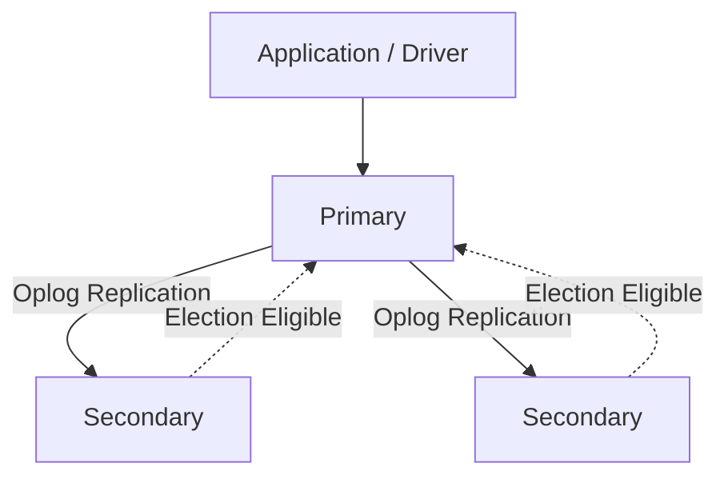
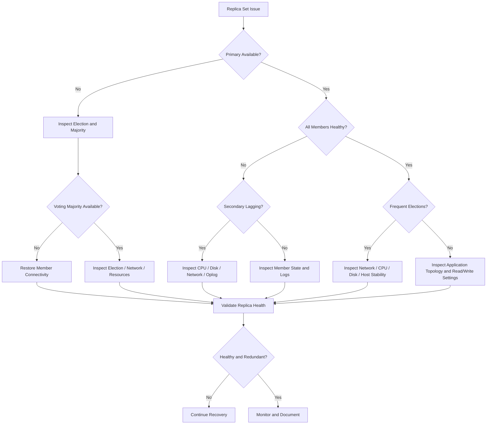

# 09- Replica Set Issues

## Overview

A MongoDB replica set provides high availability through multiple `mongod` members that maintain copies of the same dataset. One member is normally elected as the primary, while other eligible members replicate data and can become primary after a failure.

Replica-set problems can affect:

- Application availability
- Read and write latency
- Write durability
- Failover behavior
- Replication lag
- Transaction reliability
- Backup consistency
- Change streams
- Operational recovery

A production troubleshooting workflow should distinguish between:

```text
Application Connectivity
        ↓
Replica-Set Topology
        ↓
Primary Availability
        ↓
Replication Health
        ↓
Election State
        ↓
Oplog Health
        ↓
Storage / Resource Health
        ↓
Application Read/Write Configuration
```

The key principle is that a replica set is both a **database topology** and a **failure-management system**. A healthy primary does not necessarily mean the replica set is healthy.

## Replica Set Architecture

A typical three-member replica set looks like:



The primary accepts writes under normal operation.

Secondaries replicate operations from the primary's oplog and can become primary when eligible.

A replica set may contain:

- Primary
- Secondary members
- Hidden members
- Delayed members
- Non-voting members
- Arbiters

Member configuration determines whether a node can vote, become primary, serve reads, or participate in specific operational workloads.

## Replica Set Health Model

A useful production model is:

```text
Replica Set Health
├── Membership
├── Connectivity
├── Elections
├── Replication
├── Oplog
├── Storage
├── CPU / Memory
├── Network
└── Application Topology Awareness
```

A replica set can be degraded even when the primary is serving traffic.

For example:

```text
Primary:    Healthy
Secondary:  30 minutes behind
Secondary:  DOWN
```

Writes may continue, but the deployment has lost redundancy and may have a reduced failure tolerance.

## Common Replica Set Symptoms

| Symptom | Likely investigation area |
|---|---|
| No primary available | Elections, connectivity, member health |
| Writes failing | Primary state, topology discovery, authentication |
| Reads fail intermittently | Driver topology, secondary health, read preference |
| Frequent primary changes | Network, resource pressure, member configuration |
| Secondary lagging | Disk, CPU, network, write workload |
| Secondary stuck in `STARTUP2` | Initial sync |
| Member stuck in `RECOVERING` | Recovery or storage issue |
| Member becomes `UNKNOWN` | Connectivity or process failure |
| Rollbacks occur | Majority durability, connectivity, elections |
| Transactions fail during elections | Primary changes / transient transaction errors |
| Change streams stop | Replica-set availability or cursor interruption |
| Backups fail | Member health, connectivity, read availability |
| Oplog window becomes too small | High write rate or insufficient oplog capacity |

## First Diagnostic Step

Start with:

```javascript
rs.status()
```

This provides information about:

- Member state
- Member health
- Primary
- Secondary members
- Election information
- Replication state
- Last heartbeat
- Sync source
- Error information

Do not immediately reconfigure the replica set after seeing an unhealthy member.

First establish why the member is unhealthy.

## Inspect Replica Set Configuration

Use:

```javascript
rs.conf()
```

Review:

- Member hosts
- `_id`
- Priority
- Votes
- Hidden status
- Delay
- Tags
- Replica-set configuration

Configuration mistakes can cause unexpected election or replication behavior.

## Inspect Current Topology

Use:

```javascript
db.hello()
```

Important information includes:

- Whether the node is primary
- Whether it is secondary
- Replica-set name
- Primary address
- Hosts
- Passives and arbiters where applicable
- Topology information

This is useful when debugging application connection problems.

## Replica Set Member States

Common states include:

| State | Meaning |
|---|---|
| `PRIMARY` | Current writable primary |
| `SECONDARY` | Replicating secondary |
| `STARTUP` | Starting |
| `STARTUP2` | Initial synchronization |
| `RECOVERING` | Recovering and not serving normal traffic |
| `ARBITER` | Voting member without data |
| `UNKNOWN` | Member state cannot currently be determined |
| `REMOVED` | Member is no longer part of the active replica-set configuration |
| `ROLLBACK` | Member is rolling back divergent operations |
| `DOWN` | Member is unavailable |

The exact operational implications depend on the member's configuration and MongoDB version.

## No Primary Available

A common application error is effectively:

```text
No primary available
```

Possible causes include:

- Primary process is down.
- Primary lost network connectivity.
- Election is in progress.
- No eligible member can obtain a majority.
- Replica-set configuration is incorrect.
- Members cannot communicate.
- Driver cannot discover the topology.
- Authentication or TLS configuration prevents connectivity.

Start with:

```javascript
rs.status()
```

Then inspect:

```javascript
db.hello()
```

and host-level service/network status.

## Election Process

When the primary becomes unavailable, eligible voting members can participate in an election.

Conceptually:

```text
Primary Failure
      ↓
Members Detect Failure
      ↓
Election
      ↓
Eligible Candidate
      ↓
Majority Agreement
      ↓
New Primary
      ↓
Drivers Discover New Topology
      ↓
Application Resumes Writes
```

There can be a short period during which no primary exists.

Applications and drivers should therefore tolerate transient topology changes.

## Frequent Elections

Frequent elections are a production warning sign.

Possible causes:

- Network instability
- Packet loss
- High latency
- CPU starvation
- Memory pressure
- Disk stalls
- Container restarts
- Kubernetes node instability
- Host failures
- Incorrect member configuration

Do not treat every election as an isolated MongoDB problem.

Investigate the infrastructure underneath the database.

## Election Diagnostics

Check:

```javascript
rs.status()
```

Review:

- `electionTime`
- Member state
- Health
- Heartbeat information
- Last heartbeat message
- Sync source
- Election-related fields

Also inspect:

- MongoDB logs
- Operating system logs
- Container restart history
- Kubernetes events
- Network metrics
- CPU and memory metrics
- Storage latency

## Majority and Elections

A replica set depends on voting members and majority availability for important topology decisions.

For a three-voting-member deployment:

```text
Members = 3
Majority = 2
```

If:

```text
Member A = DOWN
Member B = DOWN
Member C = PRIMARY
```

the remaining member cannot obtain a majority for normal election purposes.

This is why a replica set should not be evaluated simply by asking:

```text
"Is one MongoDB node still running?"
```

The real question is:

```text
"Does the topology still have the required voting majority and redundancy?"
```

## Replication

Secondaries replicate operations from the primary through the oplog.

Conceptually:

```text
Application
    ↓
Primary
    ↓
Oplog
    ↓
Secondary
    ↓
Apply Operations
```

Replication is asynchronous.

Therefore, a secondary can temporarily lag behind the primary.

## Replication Lag

Replication lag represents how far a secondary is behind the primary.

A simplified interpretation:

```text
Primary:
10:00:30

Secondary:
10:00:25

Lag:
5 seconds
```

High lag can affect:

- Read freshness
- Failover readiness
- Backup strategies
- Oplog window
- Secondary-based workloads
- Disaster recovery objectives

## Inspect Replication Lag

A useful command is:

```javascript
rs.printSecondaryReplicationInfo()
```

Also inspect:

```javascript
rs.status()
```

Look for:

- Last applied operation
- Last durable operation
- Sync source
- Health
- State

Exact output differs by MongoDB version.

## Causes of Replication Lag

Common causes include:

### High Write Rate

The primary generates operations faster than a secondary can apply them.

```text
Write Rate
    ↓
Oplog Growth
    ↓
Secondary Apply Rate < Primary Rate
    ↓
Replication Lag
```

### Slow Secondary Storage

A secondary with slower storage may struggle to apply writes.

### CPU Saturation

Heavy aggregation, indexing, validation, or other workloads can compete with replication.

### Network Constraints

The secondary may not receive oplog data quickly enough.

### Initial Sync

A newly added member may require significant time to synchronize.

### Resource Contention

Backups and analytical workloads can compete with replication.

## Secondary Lag Troubleshooting

Use:

```text
Symptom
↓
Confirm lag
↓
Check secondary CPU
↓
Check disk latency
↓
Check network throughput
↓
Check oplog rate
↓
Check competing workloads
↓
Check sync source
↓
Determine whether lag is recovering
↓
Correct bottleneck
```

Do not immediately restart a lagging secondary.

A restart can make recovery slower if the underlying problem is still present.

## Oplog

The oplog is a capped collection that records replication operations.

It allows secondaries to follow changes made on the primary.

Conceptually:

```text
Primary
  ↓
Oplog
  ├── Operation A
  ├── Operation B
  ├── Operation C
  └── Operation D
          ↓
      Secondary
```

The oplog is bounded.

Therefore, replication health depends not only on current lag but also on the amount of historical oplog available.

## Oplog Window

The oplog window is approximately the amount of time represented by the oldest and newest relevant oplog entries.

For example:

```text
Oldest oplog entry: 08:00
Newest oplog entry: 14:00

Approximate window:
6 hours
```

If a secondary falls further behind than the available oplog history, it may no longer be able to catch up incrementally and may require initial synchronization.

## Oplog Window and Write Rate

A high write rate can consume oplog capacity quickly.

Conceptually:

```text
Higher write rate
      ↓
Faster oplog growth
      ↓
Smaller time window
      ↓
Less recovery time for lagging members
```

Monitor the oplog window in production.

A replica set with a healthy secondary today can still be vulnerable if the oplog window is too small for expected maintenance or outage periods.

## Secondary Too Far Behind

If a secondary falls outside the oplog window, it may require a full initial sync.

Typical workflow:

```text
Secondary falls behind
        ↓
Oplog history unavailable
        ↓
Incremental replication impossible
        ↓
Initial sync required
        ↓
Collection data copied
        ↓
Indexes / metadata synchronized
        ↓
Secondary catches up
```

Do not treat this as an ordinary replication-lag incident.

Investigate why the secondary fell behind and whether the oplog window is adequate.

## Initial Sync

Initial sync copies the dataset and brings a new or recovering member into synchronization.

Potential causes for a long initial sync include:

- Large database
- Slow network
- Slow storage
- High write rate
- Resource contention
- Large index build workload

During initial sync, the member does not provide normal secondary redundancy.

For production systems, plan member replacement and initial sync carefully.

## Initial Sync Troubleshooting

Check:

```javascript
rs.status()
```

and MongoDB logs.

Investigate:

- Current state
- Sync source
- Network throughput
- Disk throughput
- Dataset size
- Write rate
- Errors
- Authentication/TLS configuration

Do not repeatedly restart initial synchronization without understanding why it is failing.

## Sync Source Problems

A secondary chooses a sync source according to replica-set topology and configuration.

A secondary may have trouble replicating if:

- Candidate sync sources are unavailable.
- Network connectivity is unstable.
- Candidate nodes are lagging.
- Authentication fails.
- TLS configuration fails.
- The topology is misconfigured.

Inspect replica-set status and MongoDB logs before changing member configuration.

## Hidden Members

A hidden member is not normally exposed as a standard read target for application traffic but can serve operational purposes.

Potential use cases include:

- Dedicated backup workloads
- Reporting
- Operational isolation

Hidden members still consume resources and require monitoring.

Do not assume a hidden member is automatically a backup strategy.

## Priority

Replica-set member priority influences election eligibility and preferred primary selection.

Example conceptual configuration:

```javascript
{
  _id: 0,
  host: "mongo-0:27017",
  priority: 2
}
```

and:

```javascript
{
  _id: 1,
  host: "mongo-1:27017",
  priority: 1
}
```

Priority should reflect the actual infrastructure.

Do not give a fragile node the highest priority simply because it has a desirable hostname.

## Votes

Voting configuration affects election majority.

Changing votes can affect:

- Election behavior
- Fault tolerance
- Majority calculations
- Deployment availability

Replica-set voting configuration should be changed deliberately and tested.

## Arbiters

An arbiter participates in elections but does not store data.

Arbiters can provide an additional vote, but they do not provide an additional copy of the data.

For example:

```text
Primary
   +
Secondary
   +
Arbiter
```

provides two data-bearing members, not three copies of the dataset.

For production architecture, evaluate whether adding a data-bearing member is more appropriate for the required redundancy.

## Read Preference Issues

Applications can configure read preference.

Common modes include:

| Mode | Behavior |
|---|---|
| `primary` | Reads from primary |
| `primaryPreferred` | Prefer primary |
| `secondary` | Read from secondary |
| `secondaryPreferred` | Prefer secondary |
| `nearest` | Select lowest-latency suitable member |

Secondary reads can reduce primary read load but introduce potential staleness.

For user-facing workflows requiring current state, use an appropriate consistency strategy rather than assuming secondary reads are equivalent to primary reads.

## Stale Reads

Consider:

```text
Primary:
order.status = "confirmed"

Secondary:
order.status = "pending"
```

A read from the secondary immediately after the write may observe the older value.

This matters for:

- Payment state
- Inventory
- Authentication
- Authorization
- Order status
- User-facing confirmation

Read preference must therefore be chosen according to business semantics.

## Write Concern and Replica Sets

Write concern affects how writes are acknowledged.

For example:

```javascript
{
  w: "majority"
}
```

requires acknowledgment from a majority under the configured replica-set semantics.

Compare:

```text
w: 1
```

with:

```text
w: "majority"
```

The trade-off is between acknowledgment latency and durability/replication guarantees.

Do not choose write concern solely based on maximum throughput.

## Rollbacks

A rollback can occur when a former primary has operations that were not replicated to the new majority before losing primary status.

Conceptually:

```text
Old Primary
    ↓
Uncommitted Operation
    ↓
Network Partition
    ↓
New Primary Elected
    ↓
Old Primary Rejoins
    ↓
Divergent Operation
    ↓
Rollback
```

Rollback is an important reason to understand write concern and majority acknowledgment.

Applications should not assume that every acknowledged write is permanently durable across all topology failures under every write-concern configuration.

## Rollback Investigation

When rollback occurs:

1. Identify affected member.
2. Review MongoDB logs.
3. Determine the rollback range.
4. Identify affected operations.
5. Compare application state.
6. Determine whether external side effects occurred.
7. Reconcile business state if necessary.
8. Investigate the network/election root cause.

A rollback should trigger an operational review rather than simply being ignored.

## Heartbeats

Replica-set members use heartbeats to determine member availability and topology state.

Conceptually:

```text
Node A
  ↔ heartbeat ↔
Node B
  ↔ heartbeat ↔
Node C
```

Heartbeat failures can result from:

- Network problems
- Process failure
- CPU starvation
- Host failure
- Firewall configuration
- DNS problems
- Kubernetes networking

A heartbeat problem is not necessarily a MongoDB software problem.

## Network Troubleshooting

Check connectivity between every replica-set member.

For containerized deployments:

```text
mongo-0
  ↕
mongo-1
  ↕
mongo-2
```

Ensure that each advertised hostname is resolvable and reachable from the other members.

A common production mistake is configuring:

```text
localhost:27017
```

for a member that must be reachable from other containers or hosts.

Use addresses that are valid from the replica-set members' network perspective.

## Docker Replica Set Issues

A Docker deployment may look like:

```yaml
services:
  mongo1:
    image: mongo:8
    hostname: mongo1

  mongo2:
    image: mongo:8
    hostname: mongo2

  mongo3:
    image: mongo:8
    hostname: mongo3
```

Replica-set configuration should advertise addresses resolvable by all members.

For example:

```javascript
rs.initiate({
  _id: "rs0",
  members: [
    { _id: 0, host: "mongo1:27017" },
    { _id: 1, host: "mongo2:27017" },
    { _id: 2, host: "mongo3:27017" }
  ]
})
```

Do not use container-local addresses that clients or peer members cannot resolve.

## Kubernetes Replica Set Issues

Kubernetes introduces additional failure domains:

```text
Application
    ↓
Service
    ↓
MongoDB Pod
    ↓
Persistent Volume
    ↓
Node
```

Potential failure causes include:

- Pod restart
- Node failure
- Persistent volume problems
- DNS issues
- Network policies
- Resource limits
- Readiness/liveness misconfiguration
- Incorrect StatefulSet identity
- Incorrect advertised hostnames

MongoDB replica-set members require stable identities.

A StatefulSet-based deployment is generally more appropriate than treating MongoDB pods as disposable stateless replicas.

## Persistent Storage

Replica-set members require durable storage.

A pod restart should not result in accidental data loss because the database volume was ephemeral.

Verify:

```text
Pod
 ↓
Persistent Volume
 ↓
Stable MongoDB data directory
```

Do not use ephemeral storage for production MongoDB data without a deliberate architecture and recovery strategy.

## Disk Full Issues

A replica-set member can become unhealthy when storage fills.

Symptoms may include:

- Writes failing
- Secondary lag
- Recovery errors
- Process shutdown
- Oplog pressure
- Log growth problems

Check:

```text
Filesystem usage
Disk latency
IOPS
Storage growth
MongoDB data size
Index size
Oplog size
Logs
```

Storage monitoring should alert before the filesystem reaches critical capacity.

## CPU and Memory Issues

Resource pressure can affect elections and replication.

For example:

```text
CPU saturation
    ↓
Delayed heartbeats
    ↓
Topology instability
    ↓
Election risk
```

or:

```text
Disk pressure
    ↓
Slow replication
    ↓
Secondary lag
    ↓
Reduced redundancy
```

Database infrastructure should therefore have appropriate resource headroom.

## Connection Problems from Python

PyMongo should normally use a long-lived `MongoClient` per process.

Example:

```python
from pymongo import MongoClient

client = MongoClient(
    "mongodb://mongo1:27017,mongo2:27017,mongo3:27017/"
    "?replicaSet=rs0",
    serverSelectionTimeoutMS=5000,
)

db = client["application"]
```

Avoid creating a new `MongoClient` for every request.

Bad:

```python
def handler():
    client = MongoClient("mongodb://...")
    return client["application"]["orders"].find_one()
```

This can create unnecessary connection-management overhead.

Prefer one client per application process and reuse it.

## Driver Topology Discovery

A replica-set-aware connection string allows the driver to discover topology changes.

Example:

```text
mongodb://mongo1:27017,mongo2:27017,mongo3:27017/?replicaSet=rs0
```

This is preferable to configuring the application against only the current primary when the deployment requires automatic failover discovery.

## Primary Stepdown and Application Behavior

During a primary stepdown:

```text
Primary
  ↓
Stepdown
  ↓
Election
  ↓
New Primary
  ↓
Driver topology update
  ↓
Application retries where appropriate
```

Applications should expect transient errors around topology changes.

Do not implement an infinite application-level retry loop.

Use bounded retry behavior with appropriate timeouts and backoff.

## Transactions and Replica Set Failures

Transactions can fail during:

- Primary elections
- Network partitions
- Write conflicts
- Replication problems

Applications should use driver-supported transaction retry behavior where appropriate.

Do not assume that a transaction error means no database state changed, particularly around ambiguous commit outcomes.

## Change Streams and Replica Set Health

Change streams depend on replica-set or supported sharded-cluster infrastructure.

A change-stream consumer should handle:

- Cursor interruption
- Network errors
- Primary changes
- Resume tokens
- Consumer restarts

Conceptually:

```text
MongoDB
   ↓
Change Stream
   ↓
Consumer
   ↓
Process Event
   ↓
Persist Processing State
   ↓
Resume if Interrupted
```

A replica-set incident can therefore appear as an event-processing incident.

## Backup and Replica Sets

A healthy replica set does not replace backups.

Replica sets protect against:

- Single-member failure
- Some infrastructure failures
- Primary failure

They do not protect against:

- Accidental deletion
- Application corruption
- Malicious modification
- Incorrect bulk updates
- Region-wide disaster

Maintain independent backup and recovery capabilities.

## Hidden Members for Backup Workloads

A hidden secondary can sometimes isolate backup or reporting workloads from application traffic.

However:

```text
Hidden Secondary
≠
Backup
```

It still contains live replicated data and can be affected by application-level corruption or destructive writes.

Backups should provide independent recovery points.

## Monitoring

A production replica-set dashboard should include:

### Topology

- Primary availability
- Number of healthy members
- Election count
- Member state

### Replication

- Replication lag
- Oplog window
- Sync source
- Initial sync state

### Resources

- CPU
- Memory
- Disk usage
- Disk latency
- Network throughput

### Database

- Connections
- Operations
- Lock/contention indicators
- Query latency
- Write latency

### Application

- Server selection errors
- Retry rate
- Transaction aborts
- Timeout rate
- Change-stream reconnects

## Alerting Recommendations

Useful alerts include:

```text
No primary
        ↓
Immediate high-priority alert
```

```text
Replica member unhealthy
        ↓
High-priority alert
```

```text
Replication lag above threshold
        ↓
Warning / high priority depending on workload
```

```text
Oplog window approaching recovery threshold
        ↓
High-priority operational alert
```

```text
Frequent elections
        ↓
Infrastructure investigation
```

Thresholds should be based on workload and recovery objectives rather than arbitrary universal values.

## Security Considerations

Replica-set troubleshooting must not bypass security controls.

Avoid:

- Disabling authentication to troubleshoot production.
- Disabling TLS without a controlled emergency procedure.
- Exposing MongoDB ports publicly.
- Sharing production credentials in logs.
- Granting administrative roles to application users.
- Connecting directly from developer machines to production without approved controls.

Production diagnostics should use least-privileged operational access.

## Disaster Recovery Considerations

Replica-set availability and disaster recovery are separate concerns.

A three-member replica set in one region:

```text
Region A
├── Primary
├── Secondary
└── Secondary
```

can still be lost by:

```text
Region-wide outage
```

A production DR architecture may require:

```text
Primary Region
    ↓
Replica / Backup Strategy
    ↓
Secondary Region
    ↓
Recovery Procedure
```

The exact architecture depends on RPO and RTO requirements.

## Common Replica Set Mistakes

### Running All Members on One Host

Three MongoDB processes on one physical host do not provide host-level fault tolerance.

If the host fails:

```text
All members fail
```

Distribute failure domains appropriately.

### Treating a Secondary as a Backup

A secondary replicates destructive changes too.

Use independent backups.

### Using Incorrect Hostnames

Replica-set members must advertise addresses reachable by peers and clients.

### Ignoring Replication Lag

A secondary that is technically `SECONDARY` may still be operationally unhealthy if it is far behind.

### Using Secondaries for Strongly Consistent Reads

Secondary reads can be stale.

Choose read preference according to business requirements.

### Ignoring Oplog Window

A secondary can fall so far behind that incremental replication is no longer possible.

### Changing Replica Configuration During an Incident Without Diagnosis

Configuration changes can make recovery harder.

Establish the failure mode first.

### Overusing Arbiters

An arbiter contributes a vote but no data redundancy.

### Running Heavy Workloads on All Secondaries

Backups, analytics, and application reads can compete with replication.

Workload isolation should be deliberate.

## Production Troubleshooting Decision Tree



## Production Runbook

```text
Replica Set Incident
        ↓
Confirm application symptom
        ↓
Run rs.status()
        ↓
Run db.hello()
        ↓
Identify primary
        ↓
Check member health
        ↓
Check elections
        ↓
Check replication lag
        ↓
Check oplog window
        ↓
Check CPU / memory / disk / network
        ↓
Inspect MongoDB logs
        ↓
Check driver connection configuration
        ↓
Check read/write concern
        ↓
Identify root cause
        ↓
Restore member health or topology
        ↓
Verify majority and redundancy
        ↓
Verify application connectivity
        ↓
Monitor recovery
        ↓
Document incident and prevention
```

## Operational Checklist

### Topology

- [ ] Replica-set name is correct.
- [ ] All members are reachable.
- [ ] Hostnames resolve correctly.
- [ ] Primary is available.
- [ ] Required voting majority is available.
- [ ] Member priorities are intentional.
- [ ] Voting configuration is intentional.

### Replication

- [ ] Secondaries are healthy.
- [ ] Replication lag is within workload tolerance.
- [ ] Oplog window is sufficient.
- [ ] Sync sources are healthy.
- [ ] Initial sync status is understood.

### Infrastructure

- [ ] CPU has sufficient headroom.
- [ ] Memory is sufficient.
- [ ] Storage is healthy.
- [ ] Disk latency is acceptable.
- [ ] Network connectivity is stable.
- [ ] Hosts/pods have independent failure domains where appropriate.

### Application

- [ ] Driver is replica-set aware.
- [ ] Connection pool is reused appropriately.
- [ ] Server selection timeout is configured.
- [ ] Retry behavior is bounded.
- [ ] Read preference is intentional.
- [ ] Write concern matches durability requirements.
- [ ] Transaction retry behavior is understood.

### Recovery

- [ ] Backups are independent of replication.
- [ ] Restore procedures are tested.
- [ ] Elections are monitored.
- [ ] Rollbacks are investigated.
- [ ] Disaster recovery procedures are documented.

## Interview Traps

### "A replica set is just a primary with backups."

No.

A replica set is an actively coordinated topology involving elections, replication, heartbeats, voting, and failover.

### "Three MongoDB processes mean three copies of the data."

Only if all three are data-bearing members.

An arbiter does not store a copy of the dataset.

### "A healthy primary means the replica set is healthy."

No.

Secondaries can be unavailable or significantly behind while the primary continues serving traffic.

### "Replication is synchronous."

Normal replication from primary to secondary is asynchronous. Write concern determines when the client receives acknowledgment and therefore affects durability semantics.

### "A secondary always has the latest data."

No.

Secondaries can lag behind the primary.

### "Replica sets eliminate the need for backups."

No.

Replication protects availability; backups provide recovery points for corruption, accidental deletion, and other logical failures.

### "A primary election is always a database failure."

Not necessarily.

Elections are part of normal replica-set failover behavior, but frequent or unexpected elections indicate an underlying availability problem that should be investigated.

### "Increasing retry counts fixes replica-set instability."

Retries can mask symptoms while increasing load. Frequent retries should trigger investigation into elections, network failures, resource pressure, and topology health.

## Key Takeaways

- **A replica-set health assessment must examine the entire topology, not just whether a primary is currently serving traffic; member health, replication lag, elections, majority availability, and oplog coverage all matter.**
- **Frequent elections and replication lag are usually symptoms that require infrastructure and workload investigation across network, CPU, memory, storage, and MongoDB configuration.**
- **Applications should use replica-set-aware drivers, bounded retry behavior, appropriate read preference, and write concern that matches the required consistency and durability guarantees.**
- **A secondary is not a backup, and a replica set is not a disaster-recovery strategy by itself; maintain independent backups and test recovery procedures.**
- **Production troubleshooting should establish the topology state first, identify the root cause, restore redundancy safely, verify application behavior, and monitor the replica set after recovery.**