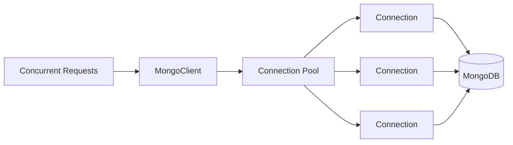
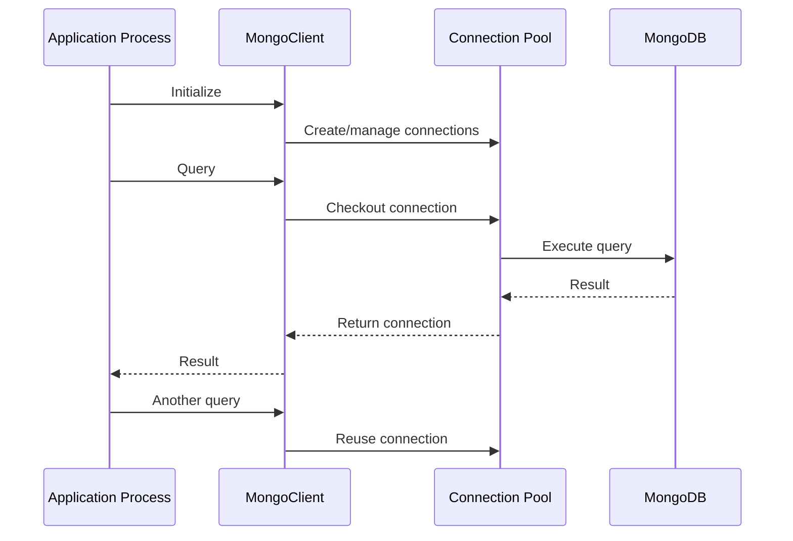
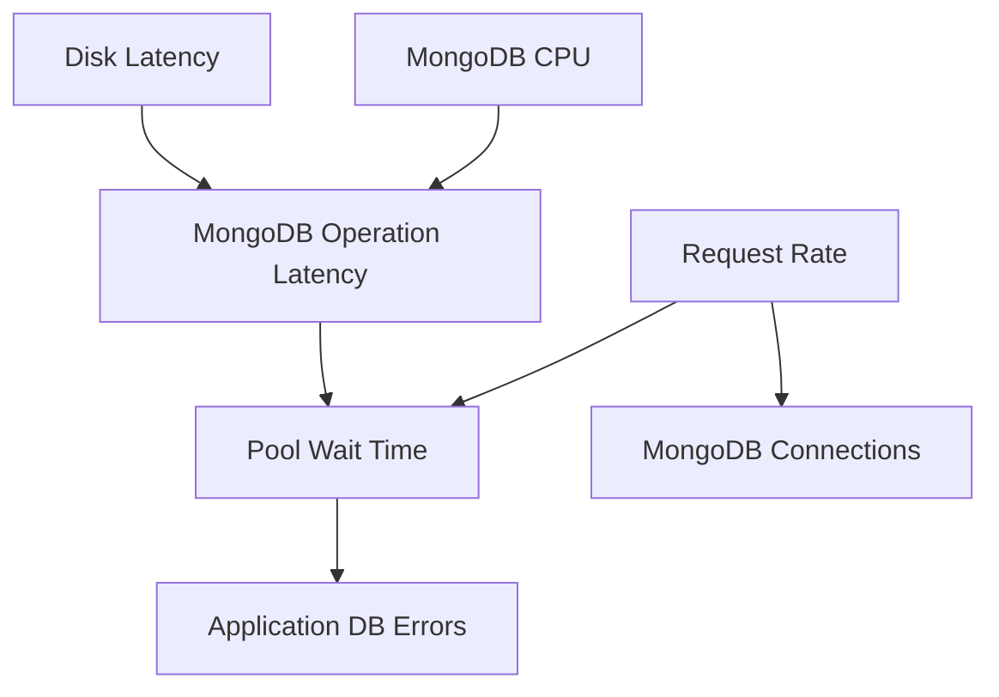

# 12- Connection Pool Issues

## Overview

MongoDB connection pooling is the mechanism that allows a Python application to reuse established network connections instead of creating a new connection for every database operation.

In a production backend, the request path typically looks like:

```text
HTTP / gRPC Request
        ↓
Application Worker
        ↓
MongoClient
        ↓
Connection Pool
        ↓
Available MongoDB Connection
        ↓
MongoDB Server
```

Connection-pool problems commonly appear as:

- Increasing API latency
- Requests waiting for database connections
- `WaitQueueTimeoutError`
- `ServerSelectionTimeoutError`
- Excessive MongoDB connections
- Connection churn
- High CPU from connection establishment
- TLS handshake overhead
- Database overload
- Timeouts during traffic spikes
- Apparently random failures under concurrency

The most important production principle is:

> **Do not treat connection-pool size as an isolated application setting. Pool capacity must be considered together with application workers, replicas, MongoDB topology, query latency, and traffic concurrency.**

## How MongoDB Connection Pooling Works

A `MongoClient` maintains pools of connections to MongoDB servers.

Conceptually:



When application code executes:

```python
collection.find_one({"order_id": order_id})
```

the driver selects an appropriate MongoDB server and obtains a connection from the relevant pool.

After the operation completes, the connection is returned to the pool for reuse.

The application normally does **not** create and close a TCP connection for every query.

## Why Connection Pools Exist

Without pooling, a high-throughput application could repeatedly perform:

```text
Create TCP connection
        ↓
TLS handshake
        ↓
Authenticate
        ↓
Execute query
        ↓
Close connection
```

For every operation.

Pooling changes this to:

```text
Create connection
        ↓
Keep connection available
        ↓
Reuse
        ↓
Reuse
        ↓
Reuse
```

This reduces connection-establishment overhead and improves latency.

## MongoClient and Pool Ownership

A `MongoClient` owns the connection pools associated with its topology.

A common production pattern is:

```text
Application Process
       ↓
One MongoClient
       ↓
Connection Pools
       ↓
MongoDB Servers
```

For example:

```python
from pymongo import MongoClient

client = MongoClient(
    MONGO_URI,
    serverSelectionTimeoutMS=5_000,
)

db = client["application"]
orders = db["orders"]
```

Reuse:

```python
orders.find_one({"order_id": "ORD-1001"})
```

Do not construct a client inside every request.

## Anti-Pattern: MongoClient Per Request

Bad:

```python
from pymongo import MongoClient


def get_order(order_id: str):
    client = MongoClient(MONGO_URI)

    return client["application"]["orders"].find_one(
        {"order_id": order_id}
    )
```

Under load:

```text
Request 1 → MongoClient
Request 2 → MongoClient
Request 3 → MongoClient
...
Request 10,000 → MongoClient
```

This can cause:

- Connection churn
- TLS handshake overhead
- Authentication overhead
- Increased MongoDB connection count
- Increased memory usage
- Slower requests
- Increased resource pressure

Prefer:

```python
client = MongoClient(MONGO_URI)

orders = client["application"]["orders"]


def get_order(order_id: str):
    return orders.find_one({"order_id": order_id})
```

## Pool Lifecycle

A typical synchronous Python service should manage the client at process/application scope.



Connections are reused rather than repeatedly established.

## Pool Size

Important PyMongo pool settings include:

| Setting | Purpose |
|---|---|
| `maxPoolSize` | Maximum number of connections in a pool |
| `minPoolSize` | Minimum number of connections maintained |
| `maxConnecting` | Maximum concurrent connection-establishment operations |
| `waitQueueTimeoutMS` | Maximum time waiting for a pooled connection |

Example:

```python
client = MongoClient(
    MONGO_URI,
    maxPoolSize=100,
    minPoolSize=10,
    maxConnecting=4,
    waitQueueTimeoutMS=2_000,
)
```

These values are workload-dependent.

Do not copy them into production without measuring actual concurrency and MongoDB capacity.

## What `maxPoolSize` Means

`maxPoolSize` limits the number of connections in a pool to a particular MongoDB server.

It does not mean:

```text
Entire application = 100 connections
```

A deployment with multiple processes, replicas, or MongoDB servers can have many more connections.

For example:

```text
8 application processes
×
100 pool connections
```

can potentially create a substantially larger connection footprint than a single-process test environment.

Topology and deployment architecture must therefore be considered.

## Pool Capacity and Application Workers

Consider:

```text
4 Kubernetes Pods
×
4 worker processes per Pod
×
100 maxPoolSize
```

The potential connection footprint can become large.

Conceptually:

```text
Pods
 ├── Worker
 │    └── MongoClient → Pool
 ├── Worker
 │    └── MongoClient → Pool
 ├── Worker
 │    └── MongoClient → Pool
 └── Worker
      └── MongoClient → Pool
```

A common production mistake is configuring:

```text
maxPoolSize = 200
```

without considering the number of processes and replicas.

## Connection Pools and Replica Sets

A replica-set-aware client maintains topology information and can have connections associated with multiple servers.

For example:

```text
MongoClient
    │
    ├── Pool → Primary
    │
    ├── Pool → Secondary 1
    │
    └── Pool → Secondary 2
```

The actual connection footprint therefore depends on:

- Topology
- Read preference
- Application processes
- Pool settings
- Driver behavior
- Workload

Do not assume that `maxPoolSize` translates directly into one global application-wide number.

## Connection Pool and Read Preference

With:

```python
MongoClient(
    MONGO_URI,
    readPreference="secondaryPreferred",
)
```

reads may be routed to suitable secondary members.

This can change the pool and connection distribution across the topology.

Read preference should be selected for consistency and workload requirements, not simply to reduce primary connections.

## Connection Pool and Sharded Clusters

In a sharded deployment:

```text
Application
     ↓
MongoClient
     ↓
MongoDB Topology
     ├── Mongos / Server
     ├── Mongos / Server
     └── Other suitable servers
```

Connection pools can therefore exist toward multiple servers.

A high pool limit combined with many application processes can create a significant connection footprint.

## Connection Checkout

Conceptually, a request performs:

```text
Request
  ↓
Select server
  ↓
Checkout connection
  ↓
Execute operation
  ↓
Return connection
```

If all available connections are busy:

```text
Request
  ↓
Pool
  ↓
No available connection
  ↓
Wait
```

If the wait exceeds the configured limit:

```text
WaitQueueTimeoutError
```

The important distinction is:

> **Pool exhaustion means the application cannot obtain a connection quickly enough; it does not automatically mean MongoDB has rejected the connection.**

## Pool Exhaustion

Typical symptoms:

- Requests become slow under concurrency.
- MongoDB query latency may appear normal for active queries.
- Application threads/tasks wait for connections.
- `WaitQueueTimeoutError` may occur.
- Increasing traffic makes the problem worse.

Architecture:

```text
High Request Concurrency
          ↓
More DB Operations
          ↓
Pool Connections Busy
          ↓
Connection Wait Queue
          ↓
Application Latency
          ↓
Timeouts
```

## Why Increasing the Pool Can Be Dangerous

Suppose:

```text
Current pool = 50
```

and requests are timing out.

Increasing it to:

```text
pool = 500
```

may reduce application-side waiting temporarily.

But it can also produce:

```text
More concurrent MongoDB operations
        ↓
Higher MongoDB CPU
        ↓
Higher disk pressure
        ↓
Higher query latency
        ↓
Connections remain busy longer
        ↓
More pool pressure
```

The correct fix may be:

- Query optimization
- Better indexing
- Lower application concurrency
- Faster storage
- Better MongoDB sizing
- Reduced transaction duration
- Reduced result size

Pool size should not be used to compensate for inefficient database operations.

## Diagnosing Pool Exhaustion

Use:

```text
Symptom
↓
Confirm connection wait
↓
Measure operation latency
↓
Check active connection count
↓
Check MongoDB query latency
↓
Check pool configuration
↓
Check application concurrency
↓
Identify long-running operations
↓
Correct bottleneck
↓
Validate under load
```

## `waitQueueTimeoutMS`

`waitQueueTimeoutMS` controls how long an operation waits for an available connection from the pool.

Example:

```python
client = MongoClient(
    MONGO_URI,
    maxPoolSize=100,
    waitQueueTimeoutMS=2_000,
)
```

If no connection becomes available within the configured period, the operation can fail.

This provides a bounded failure mode instead of allowing requests to wait indefinitely.

## Choosing `waitQueueTimeoutMS`

The value should align with application latency requirements.

For example:

```text
HTTP timeout = 5 seconds
```

A database pool wait timeout of:

```text
30 seconds
```

may be counterproductive because the database wait can exceed the request's useful lifetime.

Timeouts should be designed as a hierarchy:

```text
Client timeout
    >
API timeout
    >
Service timeout
    >
Database operation timeout
    >
Pool wait timeout
```

The exact hierarchy depends on architecture, but lower-level operations should not routinely outlive their callers.

## `minPoolSize`

`minPoolSize` controls the minimum pool size.

Example:

```python
MongoClient(
    MONGO_URI,
    minPoolSize=10,
)
```

A larger minimum pool can reduce connection-establishment latency after startup or periods of low activity.

However, it can also create persistent connections even when traffic is low.

Potential trade-off:

| Higher `minPoolSize` | Lower `minPoolSize` |
|---|---|
| More ready connections | Fewer idle connections |
| Less connection ramp-up | More connection establishment |
| Higher baseline resource use | Lower baseline resource use |
| Useful for stable traffic | Useful for variable traffic |

Do not increase it simply because a service has occasional latency spikes.

## `maxConnecting`

`maxConnecting` controls how many connections can be established concurrently when the pool needs more connections.

Example:

```python
MongoClient(
    MONGO_URI,
    maxConnecting=4,
)
```

This helps control connection-establishment bursts.

Without appropriate connection-establishment limits, a sudden traffic spike can create a connection storm.

## Connection Storms

A connection storm can occur after:

- Application restart
- Kubernetes rollout
- Autoscaling event
- MongoDB failover
- Network recovery
- Large traffic spike

Example:

```text
50 Pods Restart
      ↓
Each Pod Starts Workers
      ↓
Each Worker Creates MongoClient
      ↓
Pools Establish Connections
      ↓
Large Connection Burst
      ↓
MongoDB Connection Pressure
```

This is particularly important in Kubernetes and autoscaling environments.

## Kubernetes Connection Storms

Consider:

```text
20 Pods
×
4 Worker Processes
×
100 maxPoolSize
```

A deployment restart can create a large number of connections over a short period.

Mitigation strategies include:

- Appropriate pool sizing
- Controlled rollout
- Startup staggering where appropriate
- Appropriate `maxConnecting`
- Connection monitoring
- Reasonable pod replica counts
- MongoDB capacity planning

Do not solve a connection storm only by increasing MongoDB connection limits.

## Connection Churn

Connection churn occurs when connections are repeatedly created and closed instead of being reused.

Common causes:

- `MongoClient` created per request
- Short-lived processes
- Aggressive connection lifetime settings
- Frequent worker restarts
- Poor deployment configuration
- Network instability

Symptoms include:

- High connection establishment rate
- TLS handshake overhead
- Authentication overhead
- Increased CPU
- Increased latency

## Connection Lifetime

Long-lived connections are generally desirable, but infrastructure can impose connection lifetime requirements.

Potential factors include:

- Load balancers
- NAT devices
- Firewalls
- Network idle timeouts
- Cloud infrastructure
- MongoDB topology changes

Do not configure aggressive connection recycling without evidence that stale connections are causing a real problem.

## Connection Leaks

A MongoDB connection pool should manage connection checkout and return automatically.

Application code generally should not manually acquire and hold pool connections for ordinary CRUD operations.

Connection-like resource leaks are more commonly caused by:

- Long-running operations
- Unclosed sessions
- Long transactions
- Streaming cursors
- Application code holding database operations open
- Process lifecycle problems

Investigate operations that remain active longer than expected.

## Long-Running Queries

A pool can appear exhausted because queries are taking too long.

Example:

```text
Pool = 100
Active connections = 100
Query latency = 20 seconds
```

Even a reasonable pool size becomes insufficient when every operation remains active for 20 seconds.

Investigate:

- Missing indexes
- Collection scans
- Large aggregations
- Large documents
- Blocking sorts
- Excessive result sets
- Lock/contention effects
- Storage latency

## Long-Running Transactions

Transactions are particularly important because they can keep resources occupied for longer periods.

Avoid:

```text
Start transaction
    ↓
Call external REST API
    ↓
Wait 5 seconds
    ↓
Call another service
    ↓
Commit
```

Prefer:

```text
Prepare external data
    ↓
Start transaction
    ↓
Perform required database operations
    ↓
Commit quickly
```

Do not hold MongoDB transactions open while waiting for unrelated external systems.

## Cursor and Pool Behavior

A query cursor can represent an ongoing database interaction.

Bad:

```python
cursor = collection.find(
    {"status": "processing"}
)

# Cursor consumed very slowly over a long period.
for document in cursor:
    process_expensive_operation(document)
```

If processing is slow, the database operation can interact poorly with application concurrency and resource usage.

For large jobs, consider bounded batches:

```python
documents = collection.find(
    {"status": "processing"}
).limit(500)

for document in documents:
    process(document)
```

Then continue using a controlled pagination or checkpointing strategy.

## Connection Pool and Async Applications

FastAPI applications require careful consideration of blocking database calls.

Using synchronous PyMongo operations inside an async workload can block execution paths depending on how the operation is invoked.

For an async architecture, modern PyMongo provides `AsyncMongoClient`.

Example:

```python
from pymongo import AsyncMongoClient

client = AsyncMongoClient(
    MONGO_URI,
    maxPoolSize=100,
)
```

Use a consistent concurrency model rather than mixing synchronous and asynchronous clients without understanding the execution implications.

## Sync vs Async Pooling

| Architecture | Client |
|---|---|
| Traditional synchronous application | `MongoClient` |
| Async Python application | `AsyncMongoClient` |
| Celery synchronous worker | `MongoClient` |
| Django synchronous application | `MongoClient` where using PyMongo |
| Async background worker | `AsyncMongoClient` where appropriate |

The pool must be sized for the concurrency model of the application.

## Gunicorn and Uvicorn Workers

Consider:

```text
4 worker processes
```

Each process can have its own MongoDB client and connection pool.

Therefore:

```text
Worker count
×
Pool capacity
```

is an important capacity-planning input.

Increasing Gunicorn/Uvicorn worker count without revisiting MongoDB pool settings can unexpectedly increase database connections.

## Celery Workers

Celery introduces another source of concurrency.

Example:

```text
API Workers
    ↓
MongoDB Pools

Celery Workers
    ↓
MongoDB Pools
```

The combined connection footprint matters.

A common mistake is tuning API connection pools independently from background-worker pools.

## Pool Sizing Example

Suppose:

```text
Application Pods: 6
Workers per Pod: 4
maxPoolSize: 50
```

Potential connection capacity can become substantial:

```text
6 × 4 × 50 = 1,200
```

This is not a guarantee that exactly 1,200 connections will exist, but it demonstrates why pool configuration must be considered at deployment scale.

The MongoDB cluster must be sized for the application's aggregate connection and workload profile.

## Connection Pool and Throughput

Pool size should be based on measured workload.

A simplified model is:

```text
Required concurrency
≈
Request rate × Average database time
```

For example:

```text
500 DB operations/sec
×
0.050 sec average DB time
≈
25 concurrent DB operations
```

This is only a starting point. Real systems must account for:

- Latency distribution
- Bursty traffic
- Multiple MongoDB operations per request
- Long-running operations
- Read/write mix
- Worker concurrency
- Replica-set topology

Do not treat the formula as a production sizing algorithm by itself.

## Pool Sizing Workflow

Use:

```text
Measure traffic
↓
Measure DB operation latency
↓
Measure concurrency
↓
Measure MongoDB capacity
↓
Set initial pool size
↓
Load test
↓
Observe pool wait
↓
Observe MongoDB resource usage
↓
Tune
```

The goal is not maximum pool size.

The goal is sufficient concurrency without overloading MongoDB.

## Pool and MongoDB Connection Limits

MongoDB deployments have connection capacity constraints determined by:

- Deployment architecture
- MongoDB configuration
- Available resources
- Managed-service limits
- Topology
- Workload

Do not assume the database can accept unlimited application connections.

A large number of mostly idle connections still consumes resources.

## Monitoring Connections

Monitor both application and MongoDB sides.

MongoDB can expose connection statistics through:

```javascript
db.serverStatus().connections
```

Relevant fields can include:

- Current connections
- Available connections
- Total created connections

Example:

```javascript
db.serverStatus().connections
```

Use these metrics alongside application metrics rather than interpreting them in isolation.

## Application Metrics

Useful metrics include:

```text
mongodb_pool_wait_seconds
mongodb_operation_duration_seconds
mongodb_operation_errors_total
mongodb_server_selection_errors_total
mongodb_connection_creation_total
mongodb_timeout_total
```

The exact metric names depend on the application's instrumentation.

The important distinction is between:

```text
Waiting for pool
```

and:

```text
Waiting for MongoDB query
```

They require different remediation.

## Observability Model

A production dashboard should correlate:



This makes it easier to distinguish application concurrency problems from database performance problems.

## Diagnosing `WaitQueueTimeoutError`

### Symptom

Application operations fail while waiting for a pool connection.

### Possible Causes

- Pool too small
- Query latency too high
- Long transactions
- Excessive concurrency
- Connection leaks
- MongoDB overloaded
- Application worker count too high

### Isolation Strategy

Determine:

```text
How many operations are active?
How long do they run?
How long do requests wait?
How large is the pool?
How many processes exist?
```

### Diagnostic Commands

Inspect MongoDB connections:

```javascript
db.serverStatus().connections
```

Inspect slow queries using appropriate MongoDB monitoring and query analysis tools.

Inspect application metrics for pool wait time.

### Root Cause

If:

```text
Pool = 50
Active operations = 50
Query latency = 5 seconds
```

the pool is not necessarily the root cause.

The real issue may be slow queries.

### Corrective Action

Optimize the actual bottleneck:

- Index query
- Reduce result size
- Reduce transaction duration
- Reduce concurrency
- Increase pool carefully

### Prevention

Monitor pool wait and database operation latency independently.

## Diagnosing `ServerSelectionTimeoutError`

### Symptom

PyMongo cannot select a suitable MongoDB server.

### Possible Causes

- MongoDB unavailable
- DNS failure
- Network failure
- TLS failure
- Replica-set configuration problem
- Authentication/topology issue
- Incorrect connection string

### Isolation Strategy

Test:

```bash
mongosh "mongodb://..."
```

from the same environment.

### Diagnostic Commands

Check:

```javascript
db.hello()
```

and:

```javascript
rs.status()
```

when applicable.

### Root Cause

Determine whether the failure is:

```text
Connectivity
Topology
Authentication
TLS
MongoDB availability
```

### Corrective Action

Fix the underlying topology or connectivity issue.

### Prevention

Use correct replica-set-aware connection strings and monitor server-selection failures.

## Diagnosing High MongoDB Connection Counts

### Symptom

MongoDB reports unexpectedly high connection counts.

### Possible Causes

- Too many application workers
- Too many application replicas
- Excessive pool size
- Multiple `MongoClient` instances
- Connection churn
- Celery workers
- Multiple microservices

### Isolation Strategy

Build a connection inventory:

```text
Service
    ↓
Pods
    ↓
Processes
    ↓
MongoClient instances
    ↓
Pool configuration
```

### Diagnostic Approach

Calculate the theoretical upper bound from deployment configuration.

### Root Cause

Identify which application component creates the connection footprint.

### Corrective Action

- Reuse clients.
- Reduce unnecessary workers.
- Tune pool sizes.
- Reduce connection churn.
- Scale MongoDB appropriately.

### Prevention

Treat MongoDB connections as a shared platform resource.

## Diagnosing Connection Churn

### Symptom

Connections are repeatedly created and closed.

### Possible Causes

- MongoClient per request
- Frequent worker restarts
- Aggressive connection lifetime configuration
- Network instability
- Container churn

### Isolation Strategy

Compare:

```text
Connection creation rate
vs
Request rate
```

### Diagnostic Approach

Inspect application process lifecycle and MongoDB connection metrics.

### Root Cause

Determine whether clients are being repeatedly instantiated or processes are restarting.

### Corrective Action

Reuse clients and fix deployment/network instability.

### Prevention

Create one appropriate client per process and monitor process restarts.

## Diagnosing Latency During Deployment

### Symptom

API latency spikes immediately after a deployment.

### Possible Causes

- All workers establish connections simultaneously
- Connection pools warm simultaneously
- Kubernetes rollout too aggressive
- MongoDB connection capacity exceeded
- New application version executes slower queries

### Isolation Strategy

Compare:

```text
Before deployment
vs
During deployment
vs
After deployment
```

### Diagnostic Approach

Correlate:

- Pod startup
- Connection creation
- MongoDB connections
- CPU
- Query latency
- Pool wait time

### Root Cause

Identify whether the spike is connection establishment or workload-related.

### Corrective Action

Adjust deployment rollout, pool configuration, startup behavior, or application workload.

### Prevention

Load-test deployment behavior rather than only steady-state traffic.

## Connection Pool Issues in Docker

A common mistake is assuming:

```text
localhost
```

always refers to MongoDB.

Inside a container:

```text
localhost
```

refers to the container itself.

For example:

```text
FastAPI container
    ↓
localhost:27017
    ↓
FastAPI container
```

If MongoDB is another Compose service:

```text
FastAPI container
    ↓
mongo:27017
    ↓
MongoDB container
```

Use the Docker service hostname from the container network.

## Connection Pool Issues in Kubernetes

Kubernetes introduces additional connection-management concerns:

- Pod scaling
- Rolling deployments
- Worker processes
- Readiness failures
- Service discovery
- Network policies
- Node failures

A common architecture is:

```text
Load Balancer
     ↓
Service
     ↓
API Pods
 ┌───┼───┐
 ↓   ↓   ↓
Pool Pool Pool
 └───┼───┘
     ↓
 MongoDB
```

Pool configuration must be considered across all pods.

## Readiness Probe Problems

A readiness probe that performs an expensive MongoDB operation can create unnecessary connection pressure.

Bad pattern:

```text
Every second
    ↓
Every Pod
    ↓
Create MongoDB connection
    ↓
Run expensive query
```

Prefer a lightweight readiness design that reflects whether the service can reasonably handle traffic without creating a dependency storm.

## Connection Pool and Autoscaling

Autoscaling increases database concurrency.

Example:

```text
5 Pods
   ↓
Scale to 20 Pods
   ↓
4× application capacity
   ↓
Potentially 4× MongoDB connection capacity
```

MongoDB must be considered a scaling dependency.

An application can scale horizontally faster than the database can safely absorb connections or queries.

## Backpressure

Connection pools can provide a form of application-side backpressure.

If concurrency exceeds safe database capacity:

```text
Requests
   ↓
Pool capacity
   ↓
Bounded waiting
   ↓
Controlled failure
```

This is often preferable to unlimited concurrency.

A system that accepts unlimited database work can overload MongoDB and increase overall failure rates.

## Pool Tuning vs Query Optimization

Use this decision model:

| Symptom | First investigation |
|---|---|
| Pool wait high, DB queries fast | Pool/concurrency |
| Pool wait high, DB queries slow | Query/database performance |
| Connection count too high | Workers/replicas/pool/client lifecycle |
| Server selection timeout | Topology/network |
| Connection creation spikes | Client/process lifecycle |
| CPU high on MongoDB | Query/concurrency/resource pressure |
| Disk latency high | Storage/query workload |
| Frequent timeouts after autoscaling | Aggregate connection/workload capacity |

## Common Pool Configuration

A reasonable starting configuration might look like:

```python
from pymongo import MongoClient

client = MongoClient(
    MONGO_URI,
    maxPoolSize=50,
    minPoolSize=5,
    maxConnecting=4,
    waitQueueTimeoutMS=2_000,
    serverSelectionTimeoutMS=5_000,
)
```

This is an example, not a universal production configuration.

Measure before and after changing it.

## Avoiding Configuration by Guesswork

Bad process:

```text
Requests slow
   ↓
Increase maxPoolSize
   ↓
Still slow
   ↓
Increase again
```

Better:

```text
Requests slow
   ↓
Measure pool wait
   ↓
Measure MongoDB latency
   ↓
Measure active connections
   ↓
Inspect query performance
   ↓
Identify bottleneck
   ↓
Tune targeted setting
   ↓
Load test
```

## Security Considerations

Connection-pool configuration should not encourage insecure workarounds.

Do not:

- Disable TLS to reduce connection-establishment cost.
- Disable certificate verification.
- Use administrator credentials for applications.
- Expose MongoDB publicly to reduce network latency.
- Log complete connection strings.
- Store credentials in source code.

Performance tuning must preserve the security boundary.

## Cost Considerations

Large connection pools can increase resource consumption on:

- MongoDB
- Application processes
- Network infrastructure
- Managed database services

In cloud environments, excessive connections can contribute indirectly to higher infrastructure requirements.

The cheapest connection is often the one that does not need to exist because:

- The client is reused.
- The query is optimized.
- The result is cached appropriately.
- Application concurrency is controlled.

## High Availability Considerations

During replica-set failover:

```text
Primary
   ↓
Unavailable
   ↓
Election
   ↓
New Primary
   ↓
Driver topology update
```

Applications can temporarily experience:

- Server selection delays
- Retryable errors
- Increased latency

A connection pool should not be treated as a mechanism that eliminates failover effects.

Applications still need appropriate retry and timeout behavior.

## Disaster Recovery Considerations

Connection pooling does not provide disaster recovery.

It does not protect against:

- Region failure
- Data corruption
- Accidental deletion
- Application-level destructive operations

Use:

- Replica sets for high availability
- Backups for recovery
- Point-in-time recovery where required
- Tested disaster-recovery procedures

## Production Troubleshooting Checklist

### Client Lifecycle

- [ ] One appropriate MongoDB client per process.
- [ ] No client creation per request.
- [ ] Client lifecycle matches worker/process lifecycle.
- [ ] Clients are not incorrectly shared across processes.

### Pool Configuration

- [ ] `maxPoolSize` is measured rather than guessed.
- [ ] `minPoolSize` matches traffic characteristics.
- [ ] `maxConnecting` is intentional.
- [ ] `waitQueueTimeoutMS` aligns with application latency requirements.
- [ ] Pool configuration is consistent across services where appropriate.

### Deployment

- [ ] Worker count is known.
- [ ] Pod/instance count is known.
- [ ] Celery/background workers are included.
- [ ] Autoscaling impact is understood.
- [ ] Rolling deployments do not create connection storms.

### MongoDB

- [ ] Connection count is monitored.
- [ ] CPU is monitored.
- [ ] Memory is monitored.
- [ ] Disk latency is monitored.
- [ ] Query latency is monitored.
- [ ] Replica-set health is monitored.
- [ ] Server-selection errors are monitored.

### Application

- [ ] Pool wait time is observable.
- [ ] Long-running operations are identified.
- [ ] Queries use appropriate indexes.
- [ ] Large documents are avoided where unnecessary.
- [ ] Pagination is bounded.
- [ ] Transactions are short.
- [ ] Retry behavior is bounded.

## Production Runbook

```text
Connection Pool Incident
        ↓
Confirm application symptom
        ↓
Check WaitQueueTimeoutError / ServerSelectionTimeoutError
        ↓
Measure pool wait time
        ↓
Measure MongoDB operation latency
        ↓
Check MongoDB connection count
        ↓
Check application worker / pod count
        ↓
Check MongoClient creation pattern
        ↓
Check long-running queries
        ↓
Check transactions and cursors
        ↓
Check MongoDB CPU / disk / network
        ↓
Check replica-set topology
        ↓
Identify bottleneck
        ↓
Apply targeted change
        ↓
Load test / observe production behavior
        ↓
Document root cause and prevention
```

## Interview Traps

### "One `maxPoolSize=100` means the application can only have 100 MongoDB connections."

No.

The effective connection footprint depends on processes, application replicas, MongoDB topology, and client instances.

### "Increase the pool whenever requests are slow."

No.

Slow queries can keep existing connections occupied. Increasing the pool may simply send more concurrent work to an already overloaded MongoDB cluster.

### "MongoClient should be created for every request."

No.

A long-lived client is normally reused within a process so that connection pools and topology information can be reused.

### "Connection pool exhaustion means MongoDB has run out of connections."

Not necessarily.

The application may have exhausted its own pool while MongoDB still has available capacity.

### "A larger pool always improves throughput."

No.

Beyond the useful concurrency supported by the workload and MongoDB infrastructure, additional connections can increase contention and resource consumption.

### "Pool size can be configured independently for API and Celery workers."

No.

Both contribute to the total MongoDB connection footprint and must be considered together.

### "Kubernetes autoscaling only affects CPU."

No.

Scaling application replicas can also multiply:

- MongoDB connections
- Query concurrency
- Network traffic
- Database CPU
- Database I/O

### "Connection pooling eliminates failover errors."

No.

Replica-set elections can still temporarily affect server selection and operations. Applications require appropriate timeout and retry behavior.

## Key Takeaways

- **Reuse an appropriate `MongoClient` per process; creating a client per request causes connection churn, unnecessary handshakes, and excessive resource usage.**
- **Pool sizing must account for application replicas, worker processes, background workers, MongoDB topology, query latency, and database capacity rather than being treated as a single application-level number.**
- **Pool exhaustion and slow MongoDB queries are different problems; measure pool wait time and database operation latency separately before changing `maxPoolSize`.**
- **Use bounded waiting, intentional timeouts, controlled concurrency, and observability to create backpressure instead of allowing database work to grow without limit.**
- **Production connection-pool tuning is an end-to-end capacity problem involving application lifecycle, deployment scaling, MongoDB resources, query performance, and replica-set behavior.**