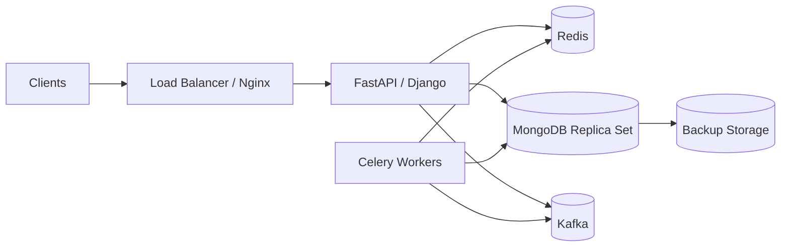
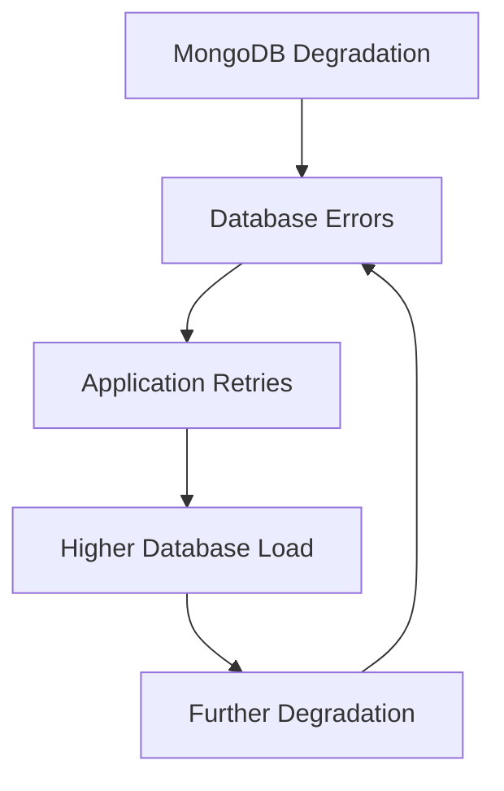
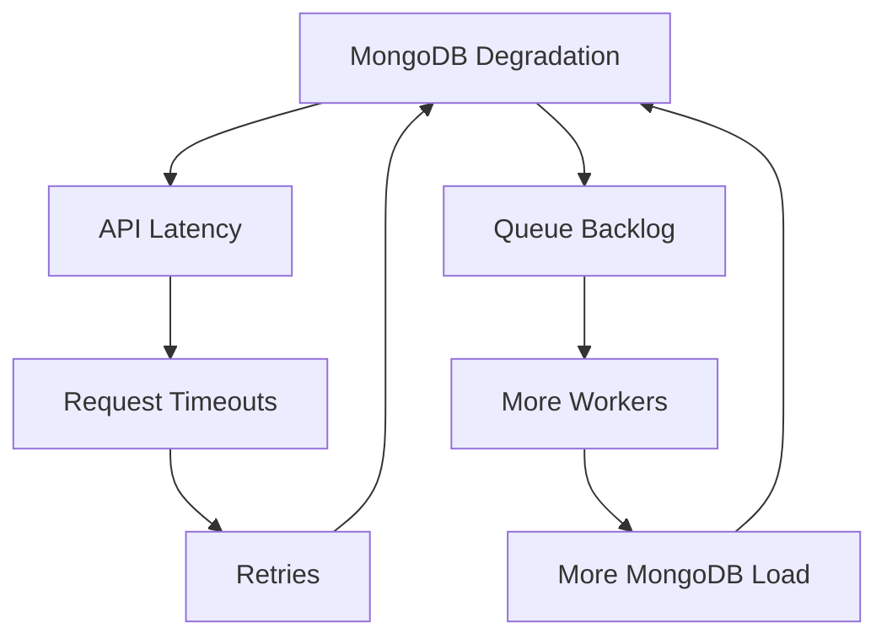

# 13- Production Failure Scenarios

## Overview

MongoDB production failures are rarely caused by a single database command. They usually emerge from interactions between application concurrency, query design, connection pools, replica-set behavior, storage, networking, deployment changes, and operational practices.

A senior backend engineer should approach a MongoDB incident as a systems problem:

```text
Application
    ↓
Connection Pool
    ↓
Network
    ↓
MongoDB Topology
    ↓
Queries / Transactions
    ↓
Indexes / Storage / Memory
    ↓
Replication / HA
```

The objective during an incident is not to immediately change configuration. It is to:

1. Establish the observed symptom.
2. Identify the affected scope.
3. Preserve evidence.
4. Isolate the failing layer.
5. Determine the root cause.
6. Apply the smallest safe corrective action.
7. Validate recovery.
8. Prevent recurrence.

## Production Failure Classification

| Failure category | Typical symptoms | Primary investigation |
|---|---|---|
| Connectivity | Connection refused, DNS errors, timeouts | Network, DNS, TLS, topology |
| Authentication | Authentication failures | Credentials, auth source, roles |
| Replica set | Elections, stale reads, write failures | `rs.status()`, replication |
| Query performance | High latency, timeouts | `explain()`, indexes, workload |
| Connection pool | Pool waits, timeout errors | Pool metrics, worker count |
| Memory | Evictions, latency, OOM | Working set, RAM, workload |
| Storage | High disk latency, write slowdown | Disk utilization and I/O |
| Lock/contention | Slow writes, latency spikes | Workload and operation behavior |
| Transactions | Aborts, conflicts, long transactions | Session and transaction lifecycle |
| Aggregation | High CPU/memory, slow requests | Pipeline and execution plan |
| Deployment | Failure immediately after release | Version/config/schema changes |
| Data corruption | Incorrect or inconsistent application state | Validation, writes, recovery |
| Backup/recovery | Failed restore or missing data | Backup artifacts and restore tests |
| Security | Unauthorized access or blocked access | Auth, TLS, network controls |

## Incident Response Methodology

Use the following model for production MongoDB incidents:

```text
Symptom
↓
Possible causes
↓
Isolation strategy
↓
Diagnostic commands
↓
Root cause
↓
Corrective action
↓
Prevention
```

Do not skip directly from symptom to configuration change.

For example:

```text
API latency increased
        ↓
Could be MongoDB query latency
Could be connection-pool waiting
Could be network latency
Could be application CPU
Could be replica-set election
        ↓
Measure each layer
        ↓
Identify bottleneck
        ↓
Apply targeted remediation
```

## Preserve Evidence Before Making Changes

During a production incident, collect:

- Application error rates
- Request latency
- MongoDB operation latency
- Connection counts
- CPU and memory
- Disk utilization and latency
- Replication lag
- Replica-set state
- Recent deployments
- Recent configuration changes
- Recent index changes
- Recent traffic changes
- Slow-query information
- Relevant logs
- Backup status

Avoid immediately:

- Dropping indexes
- Restarting every MongoDB node
- Increasing every timeout
- Increasing pool sizes dramatically
- Disabling authentication
- Disabling TLS
- Deleting data
- Running destructive repair commands
- Changing multiple variables simultaneously

The first objective is to understand the failure, not to make the system different.

## Production Architecture Context

A typical backend architecture might look like:



A MongoDB incident can therefore propagate into:

```text
MongoDB degradation
      ↓
API latency
      ↓
Request timeouts
      ↓
Retries
      ↓
More MongoDB traffic
      ↓
Further degradation
```

This feedback loop is particularly dangerous.

## Failure Scenario: MongoDB Becomes Unreachable

### Symptom

Applications report errors such as:

```text
ServerSelectionTimeoutError
Connection refused
Network is unreachable
Connection timed out
```

### Possible Causes

- MongoDB process unavailable
- Node failure
- Network outage
- DNS failure
- Firewall/security-group change
- Kubernetes NetworkPolicy
- Incorrect connection string
- TLS configuration problem
- Replica-set topology issue

### Isolation Strategy

Determine whether the failure affects:

- One application instance
- One availability zone
- One service
- All services
- All MongoDB clients

From the application environment:

```bash
mongosh "$MONGODB_URI"
```

Then inspect topology where access is available:

```javascript
db.hello()
```

For a replica set:

```javascript
rs.status()
```

### Root Cause

Separate:

```text
Application → MongoDB connectivity
```

from:

```text
MongoDB → MongoDB member connectivity
```

If multiple independent applications fail simultaneously, investigate shared infrastructure first.

### Corrective Action

Depending on the root cause:

- Restore network connectivity.
- Correct DNS.
- Restore MongoDB service.
- Fix security-group or firewall rules.
- Correct TLS configuration.
- Correct the connection string.
- Recover failed replica-set members.

### Prevention

- Monitor MongoDB connectivity.
- Monitor replica-set health.
- Test connectivity from application environments.
- Use infrastructure-as-code for network configuration.
- Maintain documented recovery procedures.

## Failure Scenario: Primary Becomes Unavailable

### Symptom

Applications experience:

- Write failures
- Temporary timeouts
- Retryable errors
- Increased latency
- Replica-set election activity

### Possible Causes

- Primary process failure
- Node failure
- Network partition
- Infrastructure failure
- Manual maintenance
- Resource exhaustion

### Isolation Strategy

Inspect:

```javascript
rs.status()
```

and:

```javascript
db.hello()
```

Identify:

- Current primary
- Secondary states
- Election activity
- Member health
- Replication lag

### Root Cause

A replica set can temporarily have no primary during an election.

The critical distinction is:

```text
Temporary election
```

versus:

```text
No healthy majority / persistent topology failure
```

### Corrective Action

If a healthy majority exists, allow normal election behavior to complete.

Do not manually force configuration changes unless required by the documented operational procedure.

### Prevention

- Use an appropriate replica-set topology.
- Monitor elections.
- Monitor member health.
- Configure application timeouts and retry behavior.
- Test failover before production incidents.

## Failure Scenario: Replica Set Has No Primary

### Symptom

Writes fail with errors indicating that a writable primary cannot be selected.

### Possible Causes

- Insufficient healthy members
- Network partition
- Election failure
- Configuration problems
- Majority unavailable
- Multiple members unavailable

### Isolation Strategy

Run:

```javascript
rs.status()
```

Inspect:

```text
PRIMARY
SECONDARY
STARTUP2
RECOVERING
UNKNOWN
DOWN
```

Also inspect:

```javascript
db.hello()
```

### Root Cause

Determine whether the replica set lacks:

- Healthy members
- Network connectivity
- Election eligibility
- Majority availability

### Corrective Action

Restore failed members or network connectivity.

Avoid changing replica-set membership during an active incident unless the operational runbook specifically requires it.

### Prevention

Monitor:

- Member state
- Elections
- Majority availability
- Replication lag
- Heartbeats

## Failure Scenario: Secondary Lag

### Symptom

Secondaries fall significantly behind the primary.

Possible application symptoms include:

- Stale reads
- Delayed failover capability
- Increased replication backlog
- Delayed backups or analytics
- Increased recovery risk

### Possible Causes

- High write rate
- Slow secondary storage
- CPU saturation
- Long-running operations
- Network throughput limitations
- Large batch writes
- Index-building workload

### Isolation Strategy

Inspect:

```javascript
rs.status()
```

Look at:

```text
optime
state
health
```

Compare primary and secondary replication progress.

### Root Cause

Determine whether lag originates from:

```text
Primary write volume
Secondary resource pressure
Network throughput
Operational activity
```

### Corrective Action

Depending on the cause:

- Reduce write pressure.
- Optimize write workload.
- Improve secondary resources.
- Resolve network bottlenecks.
- Stop inappropriate heavy operations.
- Rebuild or resync members when required.

### Prevention

Alert on replication lag before it reaches an operationally dangerous threshold.

## Failure Scenario: Replication Lag Causes Stale Reads

### Symptom

A client writes data successfully and immediately reads older data.

### Possible Causes

- `secondary` read preference
- `secondaryPreferred`
- Secondary replication lag
- Application-level caching

### Isolation Strategy

Determine:

```text
Where was the write sent?
Where was the read sent?
What read preference is configured?
What is the secondary lag?
```

Inspect the client's read preference and MongoDB topology.

### Root Cause

A read routed to a lagging secondary may observe data behind the latest primary state.

### Corrective Action

For consistency-sensitive operations, use primary reads or an appropriate consistency mechanism.

Do not use secondary reads for data that requires immediate read-after-write behavior without understanding the consistency implications.

### Prevention

Document consistency requirements per API or repository operation.

## Failure Scenario: Rollback After Failover

### Symptom

Data written shortly before a failover appears to be missing.

### Possible Causes

- Write not replicated to the eventual majority before failure
- Rollback after primary loss
- Network partition
- Insufficient write concern

### Isolation Strategy

Inspect:

- Write concern
- Replica-set events
- Oplog behavior
- Application write acknowledgements

### Root Cause

Acknowledgement and durability are not interchangeable concepts.

A write acknowledged under weaker conditions may not have achieved the durability guarantees required by the business operation.

### Corrective Action

Recover affected application state using:

- Reconciliation
- Idempotent event processing
- Application audit records
- Backup/PITR where necessary

### Prevention

Choose write concern based on business durability requirements rather than latency alone.

## Failure Scenario: MongoDB CPU Saturation

### Symptom

MongoDB CPU reaches sustained high utilization.

Applications experience:

- Increased latency
- Query timeouts
- Pool exhaustion
- Increased queueing

### Possible Causes

- Collection scans
- Poor indexes
- Large aggregations
- High concurrency
- Excessive writes
- Expensive `$lookup`
- Large sorts
- Traffic spike

### Isolation Strategy

Separate:

```text
CPU caused by query execution
```

from:

```text
CPU caused by workload volume
```

Investigate slow operations and query plans.

Example:

```javascript
db.orders.find({
    customer_id: "CUST-1001",
    status: "pending"
}).explain("executionStats")
```

Look at:

- `nReturned`
- `totalKeysExamined`
- `totalDocsExamined`
- Execution time
- `COLLSCAN`
- `IXSCAN`

### Root Cause

A common root cause is an index mismatch.

For example:

```text
Query:
customer_id + status

Existing index:
status
```

The query may still require substantial work.

### Corrective Action

Design indexes around actual access patterns.

Example:

```javascript
db.orders.createIndex({
    customer_id: 1,
    status: 1
})
```

Validate the result with `explain()`.

### Prevention

- Monitor slow queries.
- Review index effectiveness.
- Load-test critical queries.
- Track query performance after releases.

## Failure Scenario: Disk Latency Spike

### Symptom

MongoDB latency increases while CPU may remain moderate.

### Possible Causes

- Storage saturation
- Working-set misses
- Large scans
- High write volume
- Checkpoint/storage pressure
- Infrastructure degradation

### Isolation Strategy

Correlate:

```text
MongoDB latency
+
Disk latency
+
IOPS
+
Throughput
+
Working-set behavior
```

### Root Cause

If storage latency rises with MongoDB operation latency, the bottleneck may be below the query layer.

### Corrective Action

Depending on the environment:

- Reduce workload.
- Optimize queries.
- Increase storage performance.
- Increase available resources.
- Reduce unnecessary data access.

### Prevention

Monitor storage performance rather than only disk capacity.

## Failure Scenario: Memory Pressure

### Symptom

MongoDB performance degrades under increasing working-set size.

### Possible Causes

- Working set larger than available RAM
- Large indexes
- Large documents
- Aggregation workloads
- Increased concurrent operations

### Isolation Strategy

Inspect:

- Memory utilization
- Working-set behavior
- Index size
- Collection size
- Query patterns

### Root Cause

The database may repeatedly access data that cannot remain efficiently cached.

### Corrective Action

- Optimize queries.
- Remove unnecessary indexes.
- Reduce document sizes.
- Improve data access patterns.
- Increase memory where justified.

### Prevention

Capacity-plan memory around:

```text
Hot data
+
Indexes
+
Operational overhead
+
Workload growth
```

## Failure Scenario: Connection Pool Exhaustion

### Symptom

Applications report pool wait timeouts.

### Possible Causes

- Pool too small
- Slow queries
- Long transactions
- Excessive workers
- Excessive application replicas
- Connection lifecycle problems

### Isolation Strategy

Compare:

```text
Pool wait time
vs
MongoDB operation latency
vs
MongoDB connection count
```

### Root Cause

Do not assume the pool itself is the root cause.

For example:

```text
Pool = 100
Active connections = 100
Query latency = 15 seconds
```

The underlying issue may be query performance.

### Corrective Action

Optimize the actual bottleneck before substantially increasing pool size.

### Prevention

Monitor:

- Pool wait
- DB latency
- Connection count
- Worker count
- Pod count

## Failure Scenario: Connection Storm After Deployment

### Symptom

MongoDB connection count spikes immediately after deployment.

### Possible Causes

- Too many application workers
- Too many replicas
- Large `maxPoolSize`
- Every process initializes a client
- Aggressive rollout
- Autoscaling

### Isolation Strategy

Calculate:

```text
Application replicas
×
Worker processes
×
Potential pool capacity
```

Then compare against MongoDB connection metrics.

### Corrective Action

- Slow the rollout.
- Reduce unnecessary worker concurrency.
- Tune pool configuration.
- Reduce replica surge.
- Ensure client reuse.

### Prevention

Load-test deployment behavior, not just steady-state traffic.

## Failure Scenario: Authentication Failure After Rotation

### Symptom

Applications suddenly fail with authentication errors after a credential change.

### Possible Causes

- Secret rotation mismatch
- Incorrect username/password
- Incorrect `authSource`
- Secret not updated in all workloads
- Stale Kubernetes Secret
- Incorrect connection string

### Isolation Strategy

Verify credentials from the same runtime environment:

```bash
mongosh "$MONGODB_URI"
```

Check:

```text
Username
Password
authSource
TLS settings
Target cluster
```

### Root Cause

The application and database may disagree about the current credentials.

### Corrective Action

Update secrets through the approved secret-management mechanism and restart/reload applications as required.

### Prevention

Use:

- AWS Secrets Manager
- Kubernetes Secrets with appropriate controls
- Vault or equivalent secret management
- Automated rotation procedures

Never hard-code MongoDB credentials.

## Failure Scenario: TLS Handshake Failures

### Symptom

Applications cannot connect after enabling or changing TLS.

### Possible Causes

- Incorrect CA
- Expired certificate
- Hostname mismatch
- Incorrect client certificate
- TLS version incompatibility
- Incorrect connection options

### Isolation Strategy

Test from the same environment and inspect certificate validity.

For MongoDB client configuration, verify the TLS settings rather than disabling certificate validation.

### Root Cause

Determine whether the problem is:

```text
Certificate
CA trust
Hostname
Client configuration
Server configuration
```

### Corrective Action

Fix certificate or trust configuration.

Do not use insecure settings such as disabling certificate verification as a production workaround.

### Prevention

- Monitor certificate expiry.
- Automate certificate rotation.
- Test TLS changes in staging.
- Maintain documented certificate chains.

## Failure Scenario: DNS Failure

### Symptom

Applications cannot resolve the MongoDB hostname.

Typical errors include:

```text
ServerSelectionTimeoutError
Temporary failure in name resolution
DNS resolution failure
```

### Possible Causes

- DNS outage
- Incorrect hostname
- Kubernetes DNS issue
- Route 53 configuration issue
- VPC resolver problem

### Isolation Strategy

From the application environment:

```bash
nslookup mongodb.example.internal
```

or:

```bash
dig mongodb.example.internal
```

### Root Cause

Determine whether:

```text
DNS itself is failing
```

or:

```text
The configured hostname is incorrect
```

### Corrective Action

Restore or correct DNS configuration.

### Prevention

Monitor DNS dependencies and avoid unnecessary runtime DNS complexity.

## Failure Scenario: Network Partition

### Symptom

Some application instances can connect to MongoDB while others cannot.

### Possible Causes

- Availability-zone networking issue
- Security group/NACL change
- Kubernetes NetworkPolicy
- Routing problem
- Node-specific networking failure

### Isolation Strategy

Compare affected and unaffected application instances.

```text
Pod A → MongoDB ✓
Pod B → MongoDB ✓
Pod C → MongoDB ✗
Pod D → MongoDB ✗
```

This pattern suggests an infrastructure or placement issue rather than a universal MongoDB failure.

### Corrective Action

Compare:

- Node
- Availability zone
- Route
- Security rules
- DNS
- Network policy

### Prevention

Use infrastructure observability and multi-zone deployment.

## Failure Scenario: Slow Query Causes API Timeouts

### Symptom

API requests exceed their timeout while MongoDB operations consume substantial time.

### Possible Causes

- Missing index
- Poor compound index
- Large result set
- Inefficient aggregation
- Regex scan
- Deep pagination with `skip`
- Data growth exposing a previously hidden performance problem

### Isolation Strategy

Use:

```javascript
db.orders.find({
    customer_id: "CUST-1001",
    status: "pending"
}).explain("executionStats")
```

Inspect:

```text
nReturned
totalKeysExamined
totalDocsExamined
executionTimeMillis
```

### Root Cause

A query that worked with 100,000 documents may become unacceptable with 100 million documents.

### Corrective Action

Consider:

- Better index
- Keyset pagination
- Reduced projection
- Query rewriting
- Aggregation optimization
- Data-model changes

### Prevention

Benchmark critical queries against production-scale data volumes.

## Failure Scenario: Aggregation Overloads MongoDB

### Symptom

A reporting endpoint causes high CPU or memory usage.

### Possible Causes

- Large `$group`
- Large `$sort`
- Late `$match`
- `$unwind` explosion
- `$lookup` over large datasets
- Unbounded reporting queries

### Isolation Strategy

Analyze the pipeline stage by stage.

Prefer:

```javascript
[
    { $match: { tenant_id: "T100", status: "completed" } },
    { $project: { customer_id: 1, amount: 1, created_at: 1 } },
    { $group: {
        _id: "$customer_id",
        total: { $sum: "$amount" }
    }}
]
```

rather than processing the entire collection before filtering.

### Root Cause

Large intermediate datasets can make aggregation expensive even when the final result is small.

### Corrective Action

- Filter earlier.
- Project only required fields.
- Use appropriate indexes.
- Bound reporting windows.
- Move heavy analytics to an appropriate analytical workload where necessary.

### Prevention

Never allow arbitrary unbounded reporting queries against a transactional production cluster.

## Failure Scenario: Transaction Failures

### Symptom

Transactions abort or return transient errors.

### Possible Causes

- Write conflicts
- Primary election
- Transient transaction errors
- Long-running transactions
- Resource pressure
- Application retry problems

### Isolation Strategy

Capture:

- Transaction duration
- Error category
- Number of retries
- Operations inside transaction
- Replica-set events

### Root Cause

Transactions depend on both application logic and replica-set behavior.

### Corrective Action

Use bounded retry behavior for retryable transaction errors and ensure transaction operations are safe to retry.

### Prevention

- Keep transactions short.
- Avoid external calls inside transactions.
- Use idempotent business operations.
- Monitor transaction abort rates.

## Failure Scenario: Duplicate Processing During Retry

### Symptom

An operation appears to execute more than once.

Examples:

```text
Payment record created twice
Email event published twice
Inventory adjustment applied twice
```

### Possible Causes

- Client retry
- Worker retry
- Network ambiguity
- Application retry after uncertain result
- Missing idempotency key

### Isolation Strategy

Trace:

```text
Request ID
↓
MongoDB operation
↓
Retry
↓
Downstream side effect
```

### Root Cause

Retries are not automatically idempotent.

### Corrective Action

Use:

- Unique indexes
- Idempotency keys
- State transitions
- Outbox patterns
- Deduplication

Example:

```javascript
db.payment_operations.createIndex(
    { idempotency_key: 1 },
    { unique: true }
)
```

### Prevention

Design retry behavior before production rather than adding retries after incidents.

## Failure Scenario: Large Document Growth

### Symptom

Writes become slower and document operations consume increasing resources.

### Possible Causes

- Unbounded arrays
- Event history embedded into a single document
- Repeated `$push`
- Large nested structures

### Isolation Strategy

Inspect document size and growth patterns.

Ask:

```text
Does this array have an upper bound?
Will it grow indefinitely?
Is it queried together with the parent?
```

### Root Cause

Embedding is useful for bounded related data but dangerous for unbounded growth.

### Corrective Action

Move unbounded child data into a separate collection.

Instead of:

```text
customer
 └── events[]
      ├── event
      ├── event
      ├── event
      └── ...
```

consider:

```text
customers
events
```

with:

```text
events.customer_id
```

### Prevention

Model document growth explicitly during schema design.

## Failure Scenario: Hot Document

### Symptom

A small number of documents become a write bottleneck.

### Possible Causes

- Global counters
- Shared account balances
- Frequently updated status documents
- Centralized job state

### Isolation Strategy

Identify whether many concurrent operations target the same document.

### Root Cause

Document-level atomicity does not eliminate contention created by extremely high update frequency.

### Corrective Action

Consider:

- Bucketing
- Sharding workload across documents
- Append-only events
- Atomic counters distributed across buckets
- Queue-based serialization where appropriate

### Prevention

Identify hot-document patterns during capacity testing.

## Failure Scenario: Index Regression After Deployment

### Symptom

Query latency increases after a release or index change.

### Possible Causes

- Index removed
- Wrong compound-index ordering
- New query shape
- Index becoming too large
- Planner selecting a different plan

### Isolation Strategy

Compare:

```text
Previous explain plan
vs
Current explain plan
```

Inspect:

```text
IXSCAN
COLLSCAN
keys examined
documents examined
execution time
```

### Root Cause

Application query shape and index design must evolve together.

### Corrective Action

Restore or redesign the appropriate index after validating workload impact.

### Prevention

Include critical query performance checks in CI/CD and deployment validation.

## Failure Scenario: Accidental Data Deletion

### Symptom

Application data disappears unexpectedly.

### Possible Causes

- Incorrect `deleteMany`
- Bad migration
- Incorrect filter
- Operator error
- Compromised credentials

### Isolation Strategy

Immediately determine:

```text
What collection?
What time?
What documents?
Which actor?
Which application version?
Which command?
```

Preserve logs and audit evidence.

### Root Cause

Determine whether deletion was:

- Application-driven
- Migration-driven
- Manual
- Security-related

### Corrective Action

Do not immediately write replacement data over the affected collection.

Use the recovery strategy appropriate to the incident:

```text
Backup
+
PITR
+
Isolated restore
+
Selective recovery
+
Application reconciliation
```

### Prevention

- Least-privilege credentials
- Tested migrations
- Guardrails around destructive commands
- Backups
- Restore testing
- Audit logging

## Failure Scenario: Corrupted or Incorrect Application Data

### Symptom

MongoDB is available, but application behavior is incorrect.

Examples:

- Invalid state transitions
- Duplicate business records
- Incorrect references
- Unexpected field types
- Missing required fields

### Possible Causes

- Application bug
- Incomplete migration
- Schema drift
- Concurrent update race
- Bad import
- Worker retry problem

### Isolation Strategy

Compare:

```text
Expected schema
vs
Stored documents
vs
Application validation
```

### Root Cause

MongoDB availability does not imply application-data correctness.

### Corrective Action

Stop the source of corruption first.

Then:

1. Identify affected records.
2. Preserve evidence.
3. Correct the application.
4. Reconcile affected data.
5. Validate repaired state.

### Prevention

Use:

- Schema validation
- Application validation
- Unique indexes
- Conditional updates
- Transactions where appropriate
- Idempotency
- Data-quality checks

## Failure Scenario: Schema Migration Breaks Old Application Versions

### Symptom

A rolling deployment causes errors because different application versions read the same collection differently.

### Possible Causes

- Field renamed immediately
- Field type changed
- Required field introduced without compatibility
- Old code cannot parse new documents

### Isolation Strategy

Map:

```text
Application version
        ↓
Document version
        ↓
Read/write behavior
```

### Root Cause

A database migration was not backward-compatible.

### Corrective Action

Use expand-contract migration.

Example:

```text
Phase 1
Add new field

Phase 2
Deploy code that reads both fields

Phase 3
Backfill

Phase 4
Write new field

Phase 5
Remove old field after all consumers migrate
```

### Prevention

Treat schema changes as API compatibility problems.

## Failure Scenario: Import Overloads Production MongoDB

### Symptom

Production API latency increases during a bulk import.

### Possible Causes

- Massive write volume
- Index maintenance
- Collection contention
- Storage saturation
- Connection pressure
- Large documents

### Isolation Strategy

Compare:

```text
Import throughput
+
MongoDB CPU
+
Disk I/O
+
API latency
+
Replication lag
```

### Corrective Action

Prefer:

- Controlled batch size
- Appropriate import timing
- Staging collection
- Validation before merge
- Rate limiting
- Dedicated ingestion infrastructure

Avoid running unrestricted imports against a busy transactional workload.

### Prevention

Load-test import jobs and define operational limits.

## Failure Scenario: Backup Job Fails During Production Incident

### Symptom

An incident occurs while the latest backup is unavailable or invalid.

### Possible Causes

- Backup job failure
- Storage failure
- Credential problem
- Backup corruption
- Expired retention
- Unverified backup

### Isolation Strategy

Check:

```text
Latest successful backup
Backup timestamp
Backup artifact
Restore validation
PITR coverage
```

### Root Cause

A backup existing in storage is not proof that recovery is possible.

### Corrective Action

Identify the newest known-good recovery point.

### Prevention

Automate:

- Backup monitoring
- Backup integrity validation
- Restore testing
- RPO monitoring
- RTO testing

## Failure Scenario: Recovery Point Is Too Old

### Symptom

The latest usable backup is older than the required RPO.

### Possible Causes

- Failed backup jobs
- Insufficient backup frequency
- Incorrect retention
- Broken PITR configuration

### Isolation Strategy

Calculate:

```text
Current time
-
Latest recoverable point
=
Actual recovery gap
```

Compare it with the business RPO.

### Corrective Action

Use the newest available recovery mechanism and document the actual data-loss window.

### Prevention

Monitor actual recovery coverage rather than simply monitoring backup-job success.

## Failure Scenario: Application Retry Storm

### Symptom

MongoDB becomes increasingly overloaded while applications continuously retry failed operations.

### Failure Loop



### Possible Causes

- Immediate retries
- No exponential backoff
- Excessive retry counts
- Retry of non-retryable errors
- Large fleet retrying simultaneously

### Isolation Strategy

Measure:

```text
Original operations
vs
Retry operations
```

### Root Cause

The application can amplify the original database failure.

### Corrective Action

Use:

- Bounded retries
- Exponential backoff
- Jitter
- Retry classification
- Circuit breaking where appropriate
- Request deadlines

### Prevention

Design retry policies as part of the system architecture.

## Failure Scenario: Cache Failure Increases MongoDB Load

### Symptom

MongoDB load spikes after Redis becomes unavailable.

### Failure Chain

```text
Redis unavailable
      ↓
Cache misses
      ↓
More MongoDB reads
      ↓
Higher MongoDB load
      ↓
MongoDB latency
      ↓
API latency
```

### Isolation Strategy

Correlate:

- Redis errors
- Cache hit ratio
- MongoDB read rate
- MongoDB latency

### Root Cause

MongoDB may be healthy in isolation but unable to handle the suddenly increased read volume.

### Corrective Action

Use controlled degradation:

- Rate limiting
- Cache recovery
- Reduced expensive reads
- Request prioritization
- Database capacity controls

### Prevention

Load-test dependency failure scenarios.

## Failure Scenario: Kafka or Celery Backlog Overloads MongoDB

### Symptom

Background workers create increasing database load.

### Possible Causes

- Queue backlog
- Worker autoscaling
- Retry storm
- Batch job
- Consumer restart

### Isolation Strategy

Compare:

```text
Queue depth
+
Worker concurrency
+
MongoDB write rate
```

### Root Cause

A downstream database may become the bottleneck when workers scale independently.

### Corrective Action

Control worker concurrency and ingestion rate.

### Prevention

Treat MongoDB as a capacity-constrained dependency when scaling consumers.

## Failure Scenario: Production Deployment Introduces a Query Regression

### Symptom

MongoDB latency increases immediately after application deployment.

### Possible Causes

- New query
- N+1 database calls
- Missing index
- Larger projection
- New aggregation
- Changed pagination strategy

### Isolation Strategy

Compare application versions.

```text
Version N
    ↓
Query pattern A

Version N+1
    ↓
Query pattern B
```

### Root Cause

Application changes can change database workload without changing MongoDB configuration.

### Corrective Action

- Roll back application if safe.
- Disable the affected feature.
- Add or correct the required index.
- Optimize the query.

### Prevention

Monitor database query behavior as part of application releases.

## Failure Scenario: N+1 MongoDB Queries

### Symptom

One API request produces hundreds or thousands of MongoDB operations.

### Example

```text
GET /orders
    ↓
Find 100 orders
    ↓
For each order:
    Find customer
```

This produces approximately:

```text
1 + 100 queries
```

### Corrective Action

Use:

- Aggregation with `$lookup` where appropriate
- Batch queries
- `$in`
- Better document modeling
- Controlled denormalization

### Prevention

Instrument query counts per request.

## Failure Scenario: Unbounded Pagination

### Symptom

Later pages become increasingly slow.

### Possible Causes

Using:

```javascript
skip(1000000)
```

on a large collection.

### Root Cause

Large offsets can require the database to walk through many earlier records.

### Corrective Action

Use keyset/range pagination where appropriate:

```javascript
db.orders.find({
    _id: { $lt: last_seen_id }
})
.sort({ _id: -1 })
.limit(100)
```

### Prevention

Design pagination around expected collection size and access patterns.

## Failure Scenario: Security Incident

### Symptom

Unexpected database access or suspicious activity is detected.

### Possible Causes

- Leaked credentials
- Excessive database privileges
- Publicly accessible MongoDB
- Compromised application
- Missing network restrictions

### Isolation Strategy

Determine:

```text
Who accessed MongoDB?
From where?
Using which account?
Which collections?
Which operations?
When?
```

### Corrective Action

Depending on the incident:

- Revoke compromised credentials.
- Rotate secrets.
- Restrict network access.
- Disable compromised users.
- Preserve logs.
- Assess affected data.
- Follow the organization's incident-response process.

### Prevention

Use:

- Least privilege
- Private networking
- TLS
- Secret management
- Auditing where required
- Credential rotation
- Monitoring

## Failure Scenario: MongoDB Node Runs Out of Disk

### Symptom

Writes fail or MongoDB becomes unstable as storage approaches capacity.

### Possible Causes

- Data growth
- Oplog growth
- Large indexes
- Logs
- Temporary files
- Backup activity

### Isolation Strategy

Inspect:

```text
Filesystem usage
Database size
Collection size
Index size
Log size
Oplog size
```

### Corrective Action

Do not blindly delete MongoDB files.

Use the documented storage-management procedure for the deployment.

Possible actions include:

- Expand storage
- Remove safe non-database files
- Archive data
- Reduce unnecessary workload
- Perform controlled cleanup

### Prevention

Alert before storage exhaustion and capacity-plan growth.

## Failure Scenario: Shard Hotspot

### Symptom

One shard experiences significantly more load than others.

### Possible Causes

- Poor shard key
- Monotonically increasing key
- Low-cardinality shard key
- Skewed access pattern
- Hot tenant

### Isolation Strategy

Compare workload distribution across shards.

### Root Cause

The shard key does not distribute the workload according to actual access patterns.

### Corrective Action

Depending on the architecture:

- Adjust workload
- Refine shard-key strategy
- Reshard where appropriate
- Isolate hot tenants/workloads

### Prevention

Evaluate shard-key cardinality, frequency, distribution, and query targeting before production sharding.

## Failure Scenario: Change Stream Consumer Stops

### Symptom

Events stop reaching downstream systems.

### Possible Causes

- Consumer process failure
- Network interruption
- Invalid resume state
- MongoDB topology change
- Unhandled exception
- Consumer lag

### Isolation Strategy

Inspect:

```text
Consumer health
Last processed event
Resume token
MongoDB connectivity
Downstream processing
```

### Root Cause

Change-stream consumers are stateful event processors and require explicit failure handling.

### Corrective Action

Restart from a valid resume position where possible and reconcile downstream state if required.

### Prevention

Implement:

- Resume-token persistence
- Idempotent event handling
- Consumer monitoring
- Dead-letter handling
- Lag monitoring

## Failure Scenario: Deployment Rollback Does Not Restore Data

### Symptom

Application rollback completes, but errors continue.

### Possible Cause

The application version was rolled back while the database schema/data was not.

### Example

```text
Application v2
    ↓
Writes new schema

Database
    ↓
Contains v2 data

Rollback
    ↓
Application v1
    ↓
Cannot interpret v2 data
```

### Corrective Action

Use backward-compatible schema changes and understand whether data rollback is safe before deployment.

### Prevention

Prefer:

```text
Expand
↓
Deploy
↓
Migrate
↓
Contract
```

rather than destructive schema changes coupled to a single release.

## Failure Scenario: Incident During Peak Traffic

### Symptom

A database issue occurs while traffic is already near capacity.

### Risk

Emergency changes can make the situation worse.

### Recommended Approach

Prioritize:

1. Stop non-essential workload.
2. Reduce expensive traffic.
3. Protect database capacity.
4. Preserve existing healthy traffic.
5. Restore stability.
6. Investigate deeper root cause after stabilization.

Possible protective measures include:

- Rate limiting
- Feature flags
- Queue throttling
- Worker concurrency reduction
- Disabling expensive reporting
- Temporarily reducing non-critical background jobs

## Failure Scenario: Cascading Failure

A MongoDB incident can become a distributed-system incident:



The most important control is to prevent the application from amplifying database failure.

Use:

- Timeouts
- Bounded retries
- Backoff
- Jitter
- Rate limits
- Circuit breakers where appropriate
- Queue throttling
- Connection-pool limits

## Production Incident Priorities

During a severe MongoDB incident, prioritize:

| Priority | Goal |
|---|---|
| First | Protect data integrity |
| Second | Stop workload amplification |
| Third | Restore service |
| Fourth | Preserve evidence |
| Fifth | Recover degraded components |
| Sixth | Perform root-cause analysis |
| Seventh | Implement prevention |

Avoid optimizing for recovery speed at the cost of irreversible data loss.

## Post-Incident Review

A useful MongoDB postmortem should include:

### Impact

- Affected services
- Affected users
- Duration
- Error rate
- Data impact
- Availability impact

### Timeline

```text
T0  First abnormal metric
T1  Alert fired
T2  Investigation started
T3  Root cause identified
T4  Mitigation applied
T5  Service recovered
T6  Validation completed
```

### Root Cause

Separate:

```text
Trigger
```

from:

```text
Underlying systemic weakness
```

For example:

```text
Trigger:
Traffic spike

Systemic weakness:
Unbounded aggregation endpoint
```

### Contributing Factors

Consider:

- Missing monitoring
- Poor capacity planning
- Unsafe retry policy
- Missing index
- Weak deployment controls
- Insufficient testing
- Configuration drift

### Corrective Actions

Actions should be concrete and measurable:

```text
Add index
Add alert
Reduce worker concurrency
Add load test
Implement retry backoff
Test replica failover
Validate backups
```

## Production Readiness Checklist

### Availability

- [ ] Replica-set health is monitored.
- [ ] Failover has been tested.
- [ ] Application retry behavior is bounded.
- [ ] Timeouts are configured.

### Performance

- [ ] Critical queries have validated indexes.
- [ ] Slow-query monitoring exists.
- [ ] Aggregations are bounded.
- [ ] Pagination is designed for large datasets.
- [ ] Connection pools are capacity-planned.

### Reliability

- [ ] Transactions are short.
- [ ] Critical operations are idempotent.
- [ ] Background workers have concurrency limits.
- [ ] Dependency failures have been tested.

### Security

- [ ] Authentication is enabled.
- [ ] Least privilege is enforced.
- [ ] TLS is configured.
- [ ] MongoDB is not unnecessarily exposed publicly.
- [ ] Secrets are centrally managed.
- [ ] Security events are monitored.

### Recovery

- [ ] Backups are automated.
- [ ] Backup success is monitored.
- [ ] Restore tests are performed.
- [ ] RPO is measurable.
- [ ] RTO is tested.
- [ ] Recovery runbooks exist.

### Deployment

- [ ] Database changes are backward compatible.
- [ ] Query performance is checked after releases.
- [ ] Rolling deployments do not cause connection storms.
- [ ] Rollback procedures are documented.
- [ ] Schema migrations are tested.

## Production Failure Decision Matrix

| Symptom | First check | Avoid immediately |
|---|---|---|
| API timeout | DB latency vs pool wait | Blindly increasing timeout |
| Connection timeout | DNS/network/topology | Increasing pool |
| Primary unavailable | `rs.status()` | Manual topology changes |
| Secondary lag | Replication/resource metrics | Ignoring read consistency |
| High CPU | Query plans/workload | Adding indexes blindly |
| High disk latency | Storage + workload | Restarting nodes repeatedly |
| High connections | Workers/pods/client lifecycle | Raising limits blindly |
| Duplicate writes | Retry/idempotency | Assuming MongoDB duplicated data |
| Missing data | Audit/recovery evidence | Writing replacement data immediately |
| Import slowdown | Import + DB resource usage | Unlimited import concurrency |
| Backup failure | Latest known-good recovery point | Assuming another backup exists |
| Cache outage | Cache hit ratio + DB load | Allowing unlimited DB fallback |
| Queue backlog | Worker concurrency + DB load | Scaling workers without limits |

## Interview Traps

### "Replica sets are only for backups."

No.

Replica sets provide redundancy and automatic failover. Backups address recovery from data loss, corruption, and historical-state requirements.

### "A secondary is always safe for reads."

No.

Secondary reads can be stale depending on replication state and read configuration.

### "If MongoDB is available, the application is healthy."

No.

MongoDB can be healthy while:

- The application has exhausted its pool.
- Queries are inefficient.
- Retries are amplifying traffic.
- Redis failure is increasing database load.
- Background workers are overwhelming the database.

### "Increasing connection pool size fixes MongoDB timeouts."

Not necessarily.

If MongoDB is slow, a larger pool may increase concurrent database work and make the incident worse.

### "A successful write means the data can never roll back."

No.

Durability and acknowledgement semantics depend on write concern and replica-set state.

### "Application rollback automatically rolls back database changes."

No.

Application binaries and database state are separate deployment dimensions.

### "Backups are enough if the backup job reports success."

No.

Recovery capability must be validated through restore testing and measurable RPO/RTO.

### "Retries improve reliability automatically."

No.

Unbounded or poorly designed retries can turn a temporary database problem into a cascading failure.

## Key Takeaways

- **MongoDB production incidents should be treated as distributed-system failures involving application concurrency, networking, database workload, replication, storage, and deployment behavior.**
- **During an incident, preserve evidence and isolate the failing layer before changing pool sizes, indexes, topology, timeouts, or other configuration.**
- **Protect MongoDB from workload amplification using bounded retries, backoff, rate limiting, controlled worker concurrency, connection limits, and appropriate timeouts.**
- **High availability, backups, and application correctness solve different failure classes; replica sets provide availability, while tested backups and recovery procedures protect against data loss and corruption.**
- **Production readiness requires failure testing: replica failover, query regressions, connection storms, dependency outages, recovery procedures, schema migrations, and disaster-recovery scenarios should be exercised before they occur in production.**