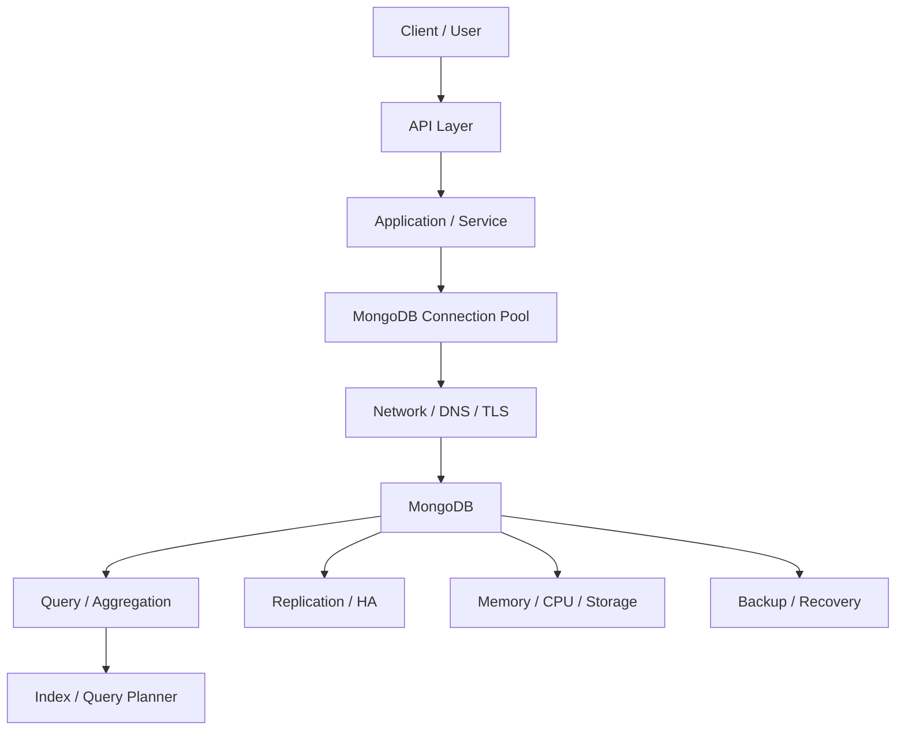
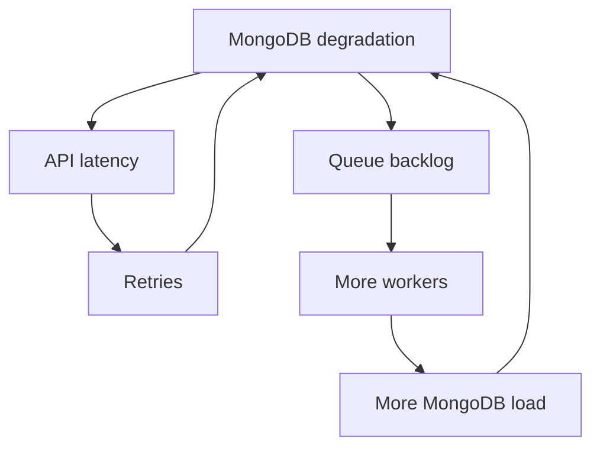

# README.md

## Overview

The MongoDB Troubleshooting section provides a structured approach to diagnosing database, application, infrastructure, performance, security, replication, and recovery problems in production MongoDB environments.

Troubleshooting should be evidence-driven rather than command-driven:

```text
Symptom
↓
Identify affected layer
↓
Collect evidence
↓
Isolate the failure
↓
Validate the root-cause hypothesis
↓
Apply the smallest safe corrective action
↓
Verify recovery
↓
Prevent recurrence
```

This section builds on MongoDB fundamentals, query design, indexing, replication, Python integration, operations, backup/recovery, and deployment knowledge.

## Navigation

| # | File | Description |
|---|---|---|
| 01 | [01- Troubleshooting Methodology](./01-%20Troubleshooting%20Methodology.md) | Systematic MongoDB troubleshooting process and incident isolation |
| 02 | [02- Connection and Authentication Issues](./02-%20Connection%20and%20Authentication%20Issues.md) | Connectivity, DNS, networking, TLS, authentication, and server-selection failures |
| 03 | [03- Query and Filter Issues](./03-%20Query%20and%20Filter%20Issues.md) | Query construction, filter operators, projection, and query correctness issues |
| 04 | [04- Update and Array Operation Issues](./04-%20Update%20and%20Array%20Operation%20Issues.md) | Update semantics, array operators, atomicity, concurrency, and bulk updates |
| 05 | [05- Schema Validation Issues](./05-%20Schema%20Validation%20Issues.md) | Validators, BSON types, schema drift, validation levels, and schema evolution |
| 06 | [06- Index and Query Performance Issues](./06-%20Index%20and%20Query%20Performance%20Issues.md) | Slow queries, indexes, execution plans, scans, sorting, and query optimization |
| 07 | [07- Aggregation Issues](./07-%20Aggregation%20Issues.md) | Aggregation failures, expensive stages, memory pressure, $lookup, $unwind, and pipeline optimization |
| 08 | [08- Transaction Issues](./08-%20Transaction%20Issues.md) | Sessions, transaction failures, conflicts, retries, consistency, and transaction design |
| 09 | [09- Replica Set Issues](./09-%20Replica%20Set%20Issues.md) | Elections, replication lag, primary failures, rollback, initial sync, and topology problems |
| 10 | [10- Import and Export Issues](./10-%20Import%20and%20Export%20Issues.md) | mongoimport, mongoexport, JSON/CSV issues, data types, and bulk data operations |
| 11 | [11- Python Integration Issues](./11-%20Python%20Integration%20Issues.md) | PyMongo connectivity, BSON, cursors, errors, FastAPI, Django, and application integration |
| 12 | [12- Connection Pool Issues](./12-%20Connection%20Pool%20Issues.md) | Pool exhaustion, connection storms, worker sizing, timeouts, and client lifecycle |
| 13 | [13- Production Failure Scenarios](./13-%20Production%20Failure%20Scenarios.md) | End-to-end production incidents, failure patterns, cascading failures, and recovery |
| 14 | [14- Diagnostic Commands](./14-%20Diagnostic%20Commands.md) | mongosh, replica-set, query, index, server, resource, and operational diagnostics |


## Troubleshooting Scope

MongoDB failures can originate at multiple layers:



A symptom observed at one layer does not necessarily identify the root cause.

For example:

```text
API timeout
```

could originate from:

- MongoDB query latency
- Connection-pool exhaustion
- DNS failure
- TLS negotiation
- Replica-set election
- Network latency
- Storage pressure
- Application retry storms
- Excessive worker concurrency

## Core Troubleshooting Methodology

Every significant problem should follow the same general model:

```text
Symptom
↓
Possible causes
↓
Isolation strategy
↓
Diagnostic commands
↓
Root cause
↓
Corrective action
↓
Prevention
```

### Symptom

Define the observable failure precisely.

Examples:

```text
API p95 latency increased from 200 ms to 4 s.
```

```text
MongoDB writes return server-selection errors.
```

```text
Secondary replication lag exceeds 60 seconds.
```

```text
Connection-pool wait timeouts increased after deployment.
```

Avoid vague descriptions such as:

```text
MongoDB is slow.
```

### Possible Causes

Build a hypothesis list before making changes.

For example:

```text
API latency
├── Slow MongoDB query
├── Connection-pool exhaustion
├── Network latency
├── Replica-set election
├── Storage pressure
├── CPU saturation
└── Application retry amplification
```

### Isolation Strategy

Determine which layer is actually failing.

Useful questions:

- Does the problem affect all application instances?
- Does it affect all queries or one query shape?
- Is MongoDB reachable directly?
- Is the primary healthy?
- Are secondaries healthy?
- Did traffic increase?
- Did the application version change?
- Did indexes change?
- Did infrastructure change?

### Diagnostic Commands

Choose commands that answer the current question.

Typical starting points:

```javascript
db.hello()
db.serverStatus()
db.currentOp()
db.stats()
rs.status()
rs.conf()
```

For query problems:

```javascript
db.collection.find(...).explain("executionStats")
```

### Root Cause

A root cause should explain the observed symptoms.

Example:

```text
New API release introduced a query without the required compound index.

That increased document examination by 100x,
which increased CPU and query latency,
which exhausted the application connection pool.
```

This is more useful than:

```text
MongoDB was slow.
```

### Corrective Action

Apply the smallest safe change that addresses the root cause.

Examples:

- Add or correct an index.
- Reduce worker concurrency.
- Fix a connection-pool lifecycle issue.
- Restore network connectivity.
- Correct credentials.
- Recover a failed replica-set member.
- Roll back an application deployment.
- Restore affected data.

### Prevention

Convert the incident into an engineering improvement:

- Monitoring
- Alerting
- Automated tests
- Capacity planning
- Query regression testing
- Backup validation
- Failure testing
- Deployment safeguards
- Documentation
- Runbooks

## Diagnostic Command Categories

| Category | Primary commands/tools | Main purpose |
|---|---|---|
| Connectivity | `mongosh`, `db.hello()`, `ping` | Validate reachability and topology |
| Server health | `db.serverStatus()` | Inspect runtime server state |
| Database health | `db.stats()` | Inspect database size and indexes |
| Collection health | `collStats` | Inspect collection storage and document metrics |
| Query analysis | `explain()` | Understand query execution |
| Index analysis | `getIndexes()`, `$indexStats` | Inspect index definitions and usage |
| Active operations | `currentOp()` | Find currently running work |
| Replica set | `rs.status()`, `rs.conf()` | Diagnose topology and elections |
| Replication | `rs.printReplicationInfo()` | Inspect oplog information |
| Replication lag | `rs.printSecondaryReplicationInfo()` | Inspect secondary progress |
| Authentication | `connectionStatus`, `usersInfo` | Diagnose identity and privilege problems |
| Schema | `getCollectionInfos()` | Inspect validation configuration |
| Resource health | `top`, `free`, `iostat`, `df` | Correlate MongoDB with OS resources |
| Kubernetes | `kubectl` | Diagnose container and infrastructure problems |
| Docker | `docker logs`, `docker stats` | Diagnose containerized deployments |
| Recovery | `mongodump`, `mongorestore` | Validate logical backup/recovery workflows |

## Connectivity Troubleshooting

A MongoDB connection failure should be isolated layer by layer:

```text
DNS
↓
TCP connectivity
↓
TLS
↓
MongoDB server selection
↓
Authentication
↓
Authorization
↓
Application connection pool
```

Start with:

```javascript
db.adminCommand({ ping: 1 })
```

Then:

```javascript
db.hello()
```

If the client cannot connect at all, investigate:

- DNS
- Routing
- Security groups
- Firewall rules
- Kubernetes NetworkPolicies
- TLS certificates
- MongoDB availability
- Replica-set topology

Do not immediately increase timeouts.

## Authentication and Authorization Troubleshooting

Authentication proves identity.

Authorization determines what that identity can do.

Useful diagnostics include:

```javascript
db.runCommand({
    connectionStatus: 1
})
```

and, with appropriate privileges:

```javascript
db.runCommand({
    usersInfo: "app_user",
    showPrivileges: true
})
```

Investigate:

```text
Username
↓
Authentication database
↓
Authentication mechanism
↓
Roles
↓
Target database
↓
Target collection
↓
Required action
```

Common causes include:

- Incorrect password
- Incorrect `authSource`
- Expired credentials
- Secret-rotation mismatch
- Missing role
- Incorrect database permissions
- TLS configuration problems

## Query Performance Troubleshooting

For slow queries, use:

```javascript
db.orders.find({
    tenant_id: "T100",
    status: "pending"
}).sort({
    created_at: -1
}).limit(100).explain("executionStats")
```

Focus on:

- `nReturned`
- `totalKeysExamined`
- `totalDocsExamined`
- `executionTimeMillis`
- `winningPlan`
- `rejectedPlans`

A query using an index is not necessarily efficient.

For example:

```text
nReturned = 20
totalKeysExamined = 900000
```

indicates that the query is doing substantially more work than the result size suggests.

Investigate:

- Query shape
- Compound-index ordering
- Selectivity
- Sort requirements
- Projection
- Pagination strategy
- Data volume
- Query planner behavior

## Index Troubleshooting

Inspect indexes:

```javascript
db.orders.getIndexes()
```

Inspect index usage:

```javascript
db.orders.aggregate([
    { $indexStats: {} }
])
```

Index troubleshooting should consider both read and write workloads.

An index can improve query latency while increasing:

- Write cost
- Storage consumption
- Memory pressure
- Backup size
- Index maintenance overhead

Do not remove an apparently unused index without understanding its purpose.

## Aggregation Troubleshooting

Expensive aggregation pipelines should be analyzed stage by stage.

Typical problem areas:

- Late `$match`
- Large `$group`
- Large `$sort`
- `$unwind` multiplying documents
- Expensive `$lookup`
- Large intermediate results
- Unbounded reporting windows

Prefer early filtering:

```javascript
[
    {
        $match: {
            tenant_id: "T100",
            status: "completed"
        }
    },
    {
        $project: {
            customer_id: 1,
            amount: 1,
            created_at: 1
        }
    },
    {
        $group: {
            _id: "$customer_id",
            total: { $sum: "$amount" }
        }
    }
]
```

Do not expose unrestricted analytical aggregation against a production transactional workload.

## Transaction Troubleshooting

Investigate:

- Session lifecycle
- Transaction duration
- Write conflicts
- Error labels
- Read concern
- Write concern
- Replica-set state
- Retry behavior

Transactions should normally be:

- Short
- Focused
- Retry-aware
- Idempotent where retries are possible

Avoid performing external network calls inside database transactions.

## Replica Set Troubleshooting

Start with:

```javascript
rs.status()
```

Then:

```javascript
rs.conf()
```

and:

```javascript
db.hello()
```

Investigate:

- Primary availability
- Member health
- Elections
- Replication lag
- Sync sources
- Priority
- Votes
- Hidden members
- Network connectivity

For replication information:

```javascript
rs.printReplicationInfo()
```

For secondary lag:

```javascript
rs.printSecondaryReplicationInfo()
```

A replica-set incident should be correlated with:

```text
Network
+
CPU
+
Memory
+
Disk latency
+
Write workload
```

## Connection Pool Troubleshooting

A connection-pool timeout does not automatically mean the pool is too small.

Investigate:

```text
Application replicas
×
Worker processes
×
Pool capacity
```

Then correlate with:

- MongoDB connection count
- Query latency
- Transaction duration
- Long-running operations
- Worker concurrency
- Deployment scaling behavior

A slow query can exhaust a correctly configured pool.

## Python Integration Troubleshooting

For PyMongo applications, inspect:

- `MongoClient` lifecycle
- Connection URI
- Pool settings
- Timeouts
- Query construction
- BSON conversion
- Cursor handling
- Retry behavior
- Exception classification

A long-running Python service should generally reuse a `MongoClient` for the process lifecycle rather than creating a client for every request.

Example:

```python
from pymongo import MongoClient

client = MongoClient(
    mongodb_uri,
    serverSelectionTimeoutMS=5_000,
    connectTimeoutMS=5_000,
    socketTimeoutMS=10_000,
)
```

## FastAPI Troubleshooting

Investigate MongoDB integration separately from API behavior.

Typical failure path:

```text
HTTP request
↓
FastAPI route
↓
Dependency / repository
↓
MongoClient
↓
MongoDB query
↓
Serialization
↓
HTTP response
```

Common issues include:

- New client per request
- Blocking database operations on an inappropriate async path
- Missing timeouts
- Excessive query count
- N+1 queries
- ObjectId serialization errors
- Poor pagination
- Unbounded aggregation

## Django Troubleshooting

MongoDB should not be assumed to behave like Django's native relational database backend.

Investigate the integration layer explicitly:

```text
Django request
↓
View / service
↓
Repository / MongoDB integration
↓
PyMongo or MongoDB integration library
↓
MongoDB
```

Pay attention to:

- Connection lifecycle
- Query behavior
- Serialization
- Transactions
- Schema validation
- Testing differences from relational ORM behavior

## Data Integrity Troubleshooting

When application data appears incorrect, first identify the source of the write.

Investigate:

```text
Application
↓
Worker
↓
Migration
↓
Import job
↓
Manual operation
↓
External integration
```

Useful diagnostic techniques include:

```javascript
db.orders.find({
    customer_id: {
        $exists: false
    }
})
```

Finding duplicate business identifiers:

```javascript
db.orders.aggregate([
    {
        $group: {
            _id: "$order_number",
            count: { $sum: 1 }
        }
    },
    {
        $match: {
            count: { $gt: 1 }
        }
    }
])
```

Do not immediately overwrite suspicious data. Preserve evidence and determine the correct recovery point first.

## Production Failure Troubleshooting

Production failures often involve multiple systems.

Example:



A database problem can therefore become a cascading failure.

Controls include:

- Bounded retries
- Exponential backoff
- Jitter
- Rate limiting
- Connection-pool limits
- Worker concurrency controls
- Request deadlines
- Circuit breaking where appropriate

## Resource Troubleshooting

MongoDB diagnostics should be correlated with host or container metrics.

### CPU

```bash
top
```

### Memory

```bash
free -h
```

### Disk Capacity

```bash
df -h
```

### Disk I/O

```bash
iostat -xz 1
```

### MongoDB Runtime Metrics

```javascript
db.serverStatus()
```

The objective is to distinguish:

```text
Query problem
```

from:

```text
Workload problem
```

from:

```text
Infrastructure problem
```

## Kubernetes Troubleshooting

When MongoDB or its clients run in Kubernetes:

```bash
kubectl get pods -A
```

Inspect a pod:

```bash
kubectl describe pod <pod-name> -n <namespace>
```

Inspect logs:

```bash
kubectl logs <pod-name> -n <namespace>
```

Inspect previous-container logs:

```bash
kubectl logs <pod-name> -n <namespace> --previous
```

Inspect resource consumption:

```bash
kubectl top pod <pod-name> -n <namespace>
```

Inspect events:

```bash
kubectl get events \
  -n <namespace> \
  --sort-by=.lastTimestamp
```

Investigate:

- OOM kills
- CPU throttling
- Persistent-volume latency
- Node failures
- Pod rescheduling
- Network policies
- DNS
- Resource limits

## Docker Troubleshooting

Inspect containers:

```bash
docker ps
```

Inspect MongoDB logs:

```bash
docker logs <container-name>
```

Inspect resource usage:

```bash
docker stats <container-name>
```

Inspect container configuration:

```bash
docker inspect <container-name>
```

Inspect volumes:

```bash
docker volume ls
```

A running container does not prove that MongoDB is operationally healthy.

## Backup and Recovery Troubleshooting

When a recovery incident occurs, determine:

```text
Latest successful backup
+
Latest validated backup
+
PITR coverage
+
Required RPO
+
Required RTO
```

For logical backup workflows:

```bash
mongodump \
  --uri="$MONGODB_URI" \
  --archive=backup.archive \
  --gzip
```

Test restoration in an isolated environment:

```bash
mongorestore \
  --uri="$RECOVERY_MONGODB_URI" \
  --archive=backup.archive \
  --gzip
```

A successful backup job does not prove recoverability. Restore testing is required.

## Change Stream Troubleshooting

When downstream events stop flowing, investigate:

- Consumer health
- MongoDB connectivity
- Last processed event
- Resume token
- Consumer lag
- Downstream processing
- Oplog availability

A production change-stream consumer should provide metrics such as:

```text
events_received
events_processed
events_failed
consumer_lag
last_processed_event
```

Event processing should be idempotent because retries and restarts can occur.

## Import and Export Troubleshooting

For import failures, investigate:

- File encoding
- JSON structure
- JSON Lines format
- CSV headers
- BSON types
- Duplicate keys
- Schema validation
- Authentication
- Network connectivity
- Index overhead

Example:

```bash
mongoimport \
  --uri="$MONGODB_URI" \
  --db=appdb \
  --collection=orders \
  --type=csv \
  --headerline \
  --file=orders.csv
```

Large imports should be treated as production workloads and monitored for their effect on:

- CPU
- Storage
- Replication lag
- API latency
- Connection usage

## Security Troubleshooting

Security failures should be diagnosed without weakening production security controls.

Investigate:

```text
Identity
↓
Authentication
↓
Authorization
↓
Network access
↓
TLS
↓
Audit evidence
```

Avoid production workarounds such as:

- Disabling TLS verification
- Making MongoDB publicly accessible
- Granting unrestricted admin roles
- Sharing production credentials
- Copying sensitive documents into public systems

## Troubleshooting by Symptom

| Symptom | First investigation | Common root causes |
|---|---|---|
| Connection timeout | DNS, network, `db.hello()` | Network, TLS, topology |
| Authentication failure | `connectionStatus` | Credentials, `authSource`, roles |
| API latency | DB latency vs pool wait | Slow queries, pool exhaustion |
| High CPU | Query workload and `serverStatus()` | Scans, aggregation, traffic |
| High disk latency | `iostat`, storage metrics | I/O saturation, large workload |
| High memory | Working set and index size | Large data/index footprint |
| Primary unavailable | `rs.status()` | Election, network, member failure |
| Secondary lag | Replica-set metrics | CPU, disk, network, write rate |
| Pool exhaustion | Pool and DB latency | Slow queries, worker count |
| Duplicate data | Retry path and unique constraints | Race conditions, retries |
| Missing data | Audit/recovery evidence | Delete, migration, rollback |
| Import failure | Import output and input format | Data types, validation |
| Change-stream gap | Consumer state and resume token | Consumer failure, oplog window |
| Backup failure | Backup artifact and status | Storage, credentials, job failure |

## Common Troubleshooting Mistakes

### Increasing Timeouts First

Longer timeouts can hide the underlying issue and increase resource consumption.

### Increasing Pool Size Without Measuring

A larger pool can increase database concurrency and worsen saturation.

### Assuming `COLLSCAN` Is Always Wrong

Small collections can legitimately be scanned.

### Assuming `IXSCAN` Means the Query Is Efficient

Inspect keys examined, documents examined, result count, and execution time.

### Running Large Diagnostic Queries

A troubleshooting command can itself become production load.

### Restarting Before Collecting Evidence

Restarting can remove useful runtime state and obscure the original failure.

### Changing Replica-Set Configuration During an Incident

Topology changes can affect quorum and elections. Use documented operational procedures.

### Testing Recovery Directly in Production

Restore backups into an isolated environment before validating them.

### Treating MongoDB as the Only Layer

Many MongoDB incidents originate from:

- Application retries
- Worker concurrency
- Network changes
- Deployment regressions
- Cache failures
- Queue backlogs

## Senior-Level Troubleshooting Patterns

### Query Problem

```text
API latency ↑
+
MongoDB latency ↑
+
totalDocsExamined ↑
+
Poor execution plan
```

Likely investigation:

```text
Query shape
→
Index
→
Execution plan
→
Data volume
```

### Pool Problem

```text
API latency ↑
+
Pool wait ↑
+
MongoDB operation latency moderate
```

Likely investigation:

```text
Worker count
→
Pool sizing
→
Connection lifecycle
→
Concurrency
```

### Storage Problem

```text
MongoDB latency ↑
+
CPU normal
+
Disk latency ↑
```

Likely investigation:

```text
Storage
→
Working set
→
Write volume
→
Collection/index growth
```

### Replica Problem

```text
Write failures ↑
+
Primary changes
+
Election activity
```

Likely investigation:

```text
rs.status()
→
Network
→
Member resources
→
Quorum
```

### Application Amplification

```text
MongoDB degradation
+
Retries ↑
+
Database traffic ↑
```

Likely investigation:

```text
Retry policy
→
Backoff
→
Request deadlines
→
Circuit protection
```

## Production Troubleshooting Checklist

### Connectivity

- [ ] DNS resolution verified.
- [ ] Network path verified.
- [ ] TLS verified.
- [ ] MongoDB topology verified.
- [ ] Authentication verified.
- [ ] Authorization verified.

### Performance

- [ ] Slow query identified.
- [ ] `explain("executionStats")` captured.
- [ ] Indexes inspected.
- [ ] Query volume compared with baseline.
- [ ] CPU and disk checked.
- [ ] Connection-pool behavior checked.

### High Availability

- [ ] Replica-set state checked.
- [ ] Primary identified.
- [ ] Elections checked.
- [ ] Secondary lag checked.
- [ ] Oplog window checked.

### Application

- [ ] Deployment changes reviewed.
- [ ] Worker concurrency reviewed.
- [ ] Retry behavior reviewed.
- [ ] Query count reviewed.
- [ ] Cache/queue dependencies reviewed.

### Recovery

- [ ] Backup status verified.
- [ ] Recovery point identified.
- [ ] RPO assessed.
- [ ] RTO assessed.
- [ ] Restore process documented.
- [ ] Reconciliation plan established.

### Security

- [ ] Credentials protected.
- [ ] Least privilege maintained.
- [ ] TLS remains enabled.
- [ ] Network restrictions remain enforced.
- [ ] Audit evidence preserved.

## Troubleshooting Principles

The following principles should guide production investigations:

| Principle | Practice |
|---|---|
| Measure first | Establish the actual symptom and scope |
| Isolate layers | Separate application, network, database, and infrastructure failures |
| Preserve evidence | Capture state before making disruptive changes |
| Prefer targeted diagnostics | Avoid unnecessary production load |
| Validate hypotheses | Use metrics and execution plans rather than assumptions |
| Change one major variable at a time | Preserve causal visibility |
| Protect data first | Avoid destructive recovery shortcuts |
| Control retries | Prevent cascading failures |
| Test recovery | Backups are useful only when recoverable |
| Prevent recurrence | Convert incidents into engineering improvements |

## Key Takeaways

- **MongoDB troubleshooting should follow a repeatable evidence-driven workflow: symptom, possible causes, isolation, diagnostics, root cause, corrective action, and prevention.**
- **Use the appropriate diagnostic layer—connectivity, queries, indexes, connections, replica sets, resources, application behavior, or recovery—rather than treating every problem as a MongoDB configuration issue.**
- **`db.hello()`, `rs.status()`, `db.serverStatus()`, `explain("executionStats")`, index inspection, and OS/container metrics form the core production troubleshooting toolkit.**
- **Protect production during investigation: preserve evidence, avoid destructive changes, limit diagnostic workload, maintain security controls, and test recovery in isolated environments.**
- **The highest-value troubleshooting outcome is not merely restoring service; it is identifying the systemic cause and adding monitoring, testing, capacity controls, or architectural safeguards that prevent recurrence.**