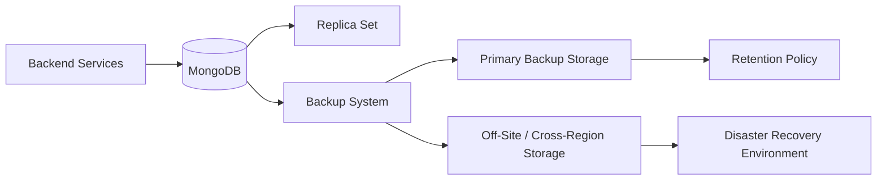
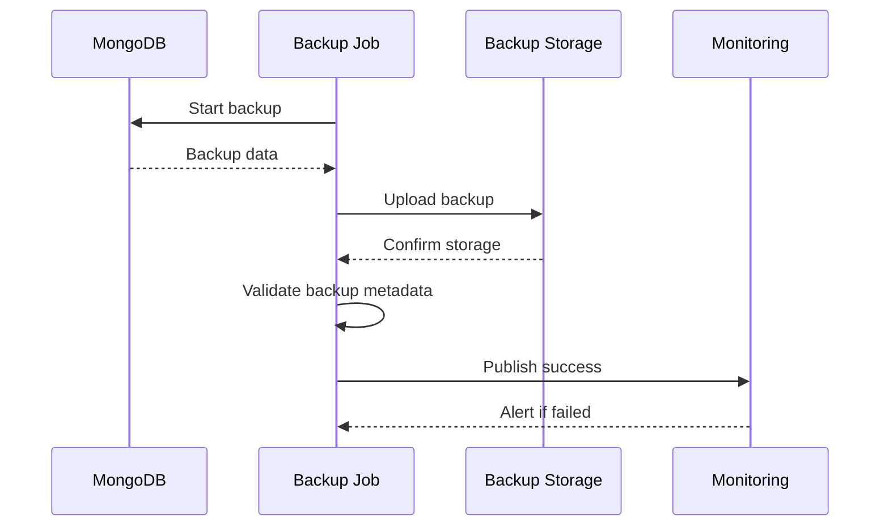
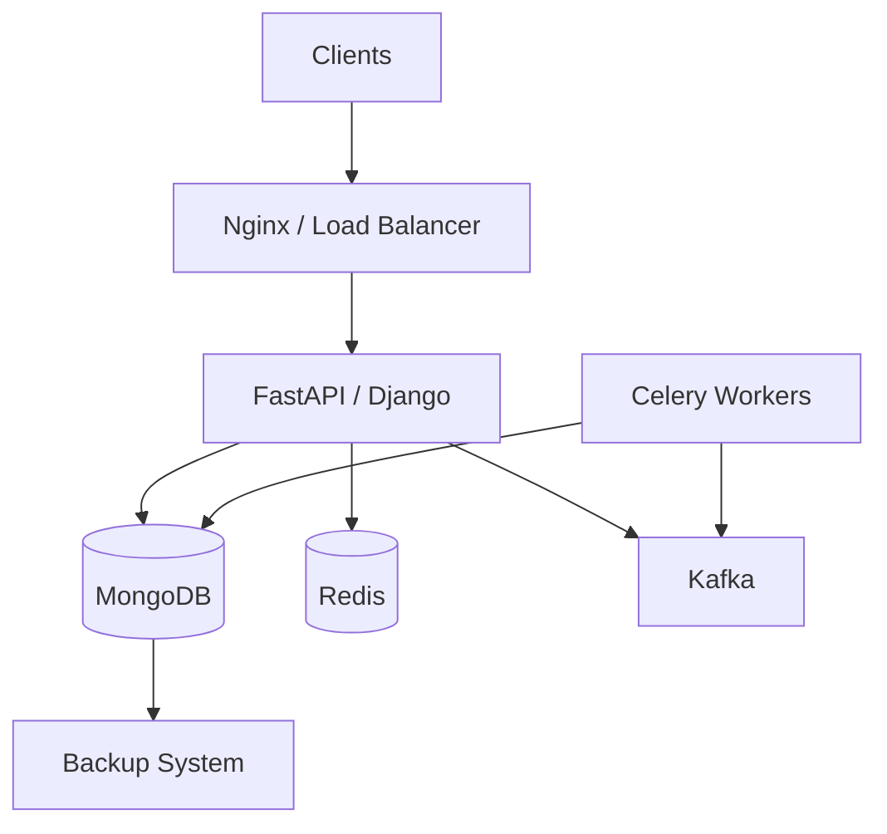

# README

## Overview

The MongoDB Backup-Recovery section defines the engineering practices required to protect MongoDB data against accidental deletion, corruption, infrastructure failure, operator error, software defects, and regional or environment-level disasters.

Backup and recovery should be treated as an operational system with measurable objectives rather than as a periodic database export.

The core relationship is:

```text
Business Data
     ↓
Backup Strategy
     ↓
Retention + Protection
     ↓
Restore Capability
     ↓
Recovery Testing
     ↓
Measured RPO / RTO
```

A production backup strategy must answer:

- What data is backed up?
- How frequently is it backed up?
- Where are backups stored?
- How long are they retained?
- How are backups protected?
- How is point-in-time recovery achieved?
- Who can access backups?
- How is restore correctness validated?
- How quickly can the system be recovered?
- What happens if the primary MongoDB environment is completely unavailable?

## Navigation

| Document | Focus |
|---|---|
| [01- Backup Fundamentals](01-%20Backup%20Fundamentals.md) | Backup concepts, recovery objectives, backup types, retention, and production backup architecture |
| [02- Logical Backups](02-%20Logical%20Backups.md) | Logical backup strategies and `mongodump`-based workflows |
| [03- Physical Backups](03-%20Physical%20Backups.md) | Physical backup concepts, filesystem/database snapshots, and consistency considerations |
| [04- MongoDB Dump and Restore](04-%20MongoDB%20Dump%20and%20Restore.md) | Practical `mongodump` and `mongorestore` workflows |
| [05- Point-in-Time Recovery](05-%20Point-in-Time%20Recovery.md) | Oplog-based recovery and recovery to a specific point in time |
| [06- Backup Validation](06-%20Backup%20Validation.md) | Backup integrity checks, restore validation, and automated verification |
| [07- Recovery Procedures](07-%20Recovery%20Procedures.md) | Production restore workflows and failure-specific recovery procedures |
| [08- Disaster Recovery](08-%20Disaster%20Recovery.md) | Regional, infrastructure, and environment-level MongoDB disaster recovery |
| [09- RPO and RTO](09-%20RPO%20and%20RTO.md) | Recovery objectives, measurement, and business-aligned recovery planning |
| [10- Backup Operations](10-%20Backup%20Operations.md) | Scheduling, monitoring, retention, storage, access control, and operational workflows |
| [11- Backup Testing](11-%20Backup%20Testing.md) | Restore drills, recovery testing, failure simulation, and readiness verification |
| [12- Backup and Recovery Best Practices](12-%20Backup%20and%20Recovery%20Best%20Practices.md) | Production backup architecture, security, reliability, and operational standards |

## Backup-Recovery Model

MongoDB recovery has several distinct layers:

| Layer | Purpose |
|---|---|
| Replica set | High availability and failover |
| Backup | Recovery from historical data loss or corruption |
| Oplog/PITR | Recovery to a specific point in time where supported |
| Snapshot | Fast recovery of large datasets |
| Off-site copy | Protection from infrastructure or regional failure |
| Restore testing | Proof that backups are actually usable |
| Disaster recovery | Recovery of the complete service environment |

A replica set should not be treated as a backup.

If a user accidentally deletes data and the deletion replicates to every secondary, replication provides no historical copy from which to recover the deleted records.

## Recovery Objectives

### Recovery Point Objective

**RPO** defines the maximum acceptable amount of data loss measured in time.

For example:

```text
RPO = 15 minutes
```

means the recovery architecture should target losing no more than approximately 15 minutes of accepted changes under the defined disaster scenario.

RPO affects:

- Backup frequency
- Oplog retention
- Replication architecture
- Cross-region replication
- Backup technology
- Recovery architecture

### Recovery Time Objective

**RTO** defines the maximum acceptable time to restore service.

For example:

```text
RTO = 60 minutes
```

requires the organization to design and test a recovery process capable of restoring the service within that target.

RTO affects:

- Backup format
- Restore speed
- Infrastructure automation
- Database size
- Snapshot availability
- Network bandwidth
- Application deployment
- DNS or traffic switching
- Operational runbooks

### RPO vs RTO

| Requirement | Primary concern | Typical design implication |
|---|---|---|
| Low RPO | Minimize data loss | Frequent backups, oplog/PITR, replication |
| Low RTO | Minimize downtime | Fast restore, pre-provisioned infrastructure, automation |
| Low RPO + low RTO | Minimize both | More sophisticated and usually more expensive architecture |

## Backup Types

### Logical Backup

Logical backups export database contents into a logical representation.

Typical tooling includes:

```bash
mongodump
mongorestore
```

Advantages:

- Portable
- Selective
- Useful for migrations
- Easy to inspect operationally
- Suitable for smaller datasets

Limitations:

- Restore can be slower for large datasets
- Backup size may be significant
- Operational consistency must be considered
- Not automatically equivalent to point-in-time recovery

### Physical or Snapshot Backup

Physical approaches preserve database storage at a lower level, often through supported snapshot mechanisms.

Advantages:

- Fast backup and restore for large datasets
- Efficient for large environments
- Can integrate well with infrastructure-level recovery

Limitations:

- More infrastructure-specific
- Requires careful consistency handling
- Less portable than logical backups
- Restore procedures depend on the storage platform

### Managed Backups

Managed MongoDB platforms can provide backup and recovery capabilities integrated with the database service.

These may include:

- Scheduled snapshots
- Continuous backup
- Point-in-time recovery
- Cross-region backup
- Retention policies
- Automated recovery workflows

The exact capabilities depend on the MongoDB deployment and service plan.

## Backup Architecture

A production architecture commonly separates the live database from backup storage:



The important architectural principle is that a database failure should not automatically destroy every backup copy.

## Backup Frequency

Backup frequency should be derived from RPO rather than an arbitrary schedule.

For example:

| Workload | Possible strategy |
|---|---|
| Low-change development database | Daily backup |
| Internal application | Daily or several-times-per-day backup |
| Production API | Frequent backups plus replication/PITR where required |
| Financial or high-value workload | Tight RPO with continuous or near-continuous recovery capability |

These are architectural examples, not universal schedules. The actual interval must come from business recovery requirements and measured restore capability.

## Retention

Retention determines how far into the past the organization can recover.

A retention policy may include:

```text
Recent backups
    ↓
Daily retention
    ↓
Weekly retention
    ↓
Monthly retention
    ↓
Long-term archive
```

Retention should consider:

- Regulatory requirements
- Business requirements
- Storage cost
- Recovery scenarios
- Data lifecycle policies
- Backup frequency
- Point-in-time recovery window

Avoid retaining every backup indefinitely unless there is a documented requirement.

## Backup Consistency

A backup is useful only if it represents a recoverable database state.

For MongoDB, consistency considerations depend on the backup mechanism, deployment topology, workload, and tooling.

Important questions include:

- Is the backup taken from an appropriate member?
- Are writes occurring during backup?
- Is replication healthy?
- Is the backup mechanism MongoDB-aware?
- Can the resulting data be restored consistently?
- Does the backup include the required metadata?
- Is point-in-time recovery required?

A backup job completing successfully does not prove that the resulting backup can restore the production system.

## Backup Security

Backups frequently contain the entire production dataset and therefore require security controls equivalent to, or stronger than, the primary database.

Protect:

- Backup files
- Snapshot storage
- Encryption keys
- Database credentials
- Backup service credentials
- Restore credentials
- Backup metadata
- Recovery infrastructure

Use:

- Encryption at rest
- Encryption in transit
- IAM-based access control
- Least-privilege roles
- Secret management
- Access logging
- Retention controls
- Separate backup credentials
- Restricted restore permissions

Do not store production backups in publicly accessible object storage.

## Backup Storage Strategy

A robust backup architecture commonly uses multiple copies:

```text
MongoDB
   ↓
Local / Primary Backup
   ↓
Off-Site Copy
   ↓
Cross-Region or Long-Term Storage
```

A useful design principle is to avoid placing all recovery copies under the same failure domain.

For example:

```text
MongoDB Region A
      ↓
Backup Storage Region A
      ↓
Backup Storage Region B
```

protects against failures affecting the original region, provided the backup system and access path are also independently available.

## Backup Workflow

A production backup workflow should be observable and failure-aware:



A backup job should not report success merely because the database command exited successfully.

Validation should include:

- Command exit status
- Expected backup artifacts
- Backup size sanity checks
- Upload completion
- Storage availability
- Retention metadata
- Restore verification where appropriate

## Restore Workflow

A production restore should be performed into an isolated environment first whenever practical.

```text
Select Recovery Point
        ↓
Provision Recovery Environment
        ↓
Restore Database
        ↓
Validate Database
        ↓
Validate Application
        ↓
Validate Data Integrity
        ↓
Switch Traffic
        ↓
Monitor
```

Avoid restoring directly over production unless the recovery runbook explicitly requires it.

## Recovery Validation

Database-level validation should verify:

- Database is reachable
- Expected databases exist
- Expected collections exist
- Indexes are present
- Expected document counts are plausible
- Critical records exist
- Application connectivity works
- Authentication works
- Required users and roles exist
- Application queries succeed

Application-level validation should verify:

- API health
- Authentication
- Critical read paths
- Critical write paths
- Background workers
- Kafka integrations where applicable
- Celery jobs
- Scheduled workloads
- Cache behavior
- External dependencies

## MongoDB and Backend Services

MongoDB recovery affects more than the database.

A typical backend architecture may look like:



During recovery, the engineering team must consider:

- API traffic
- Background workers
- Scheduled jobs
- Event consumers
- Cache state
- Message queues
- Idempotency
- Duplicate processing
- External integrations

Restoring MongoDB while leaving application workers active can create race conditions or inconsistent writes.

## Application Quiescing

Depending on the recovery scenario, applications may need to be:

- Stopped
- Put into maintenance mode
- Switched to read-only
- Prevented from writing to the recovery database
- Started only after validation

For example:

```text
Stop Writes
    ↓
Restore Database
    ↓
Validate
    ↓
Start Application
    ↓
Resume Workers
```

The correct sequence depends on the recovery architecture.

## Backup and Disaster Recovery

Backup is one component of disaster recovery.

Disaster recovery must also address:

- Compute infrastructure
- Networking
- DNS
- Secrets
- IAM
- Application deployment
- Configuration
- Monitoring
- External integrations
- Message queues
- Object storage
- Database backups

A database backup without recoverable application infrastructure may not satisfy the actual RTO.

## Common Failure Scenarios

### Accidental Deletion

```text
Accidental DELETE
       ↓
Stop further destructive operations
       ↓
Identify deletion time
       ↓
Determine available recovery point
       ↓
Restore to isolated environment
       ↓
Extract / recover required data
       ↓
Validate
       ↓
Reconcile with production
```

### Database Corruption

Potential recovery sources include:

- Replica members
- Snapshots
- Logical backups
- Point-in-time recovery
- Off-site backups

The correct recovery source depends on when corruption occurred and whether it propagated through replication.

### Complete Environment Loss

A full environment failure requires:

```text
Infrastructure Recovery
        ↓
Network / Security Recovery
        ↓
MongoDB Recovery
        ↓
Application Deployment
        ↓
Configuration / Secrets
        ↓
Traffic Restoration
        ↓
Validation
```

## Common Mistakes

### Treating Replication as Backup

Replication protects availability but generally does not provide historical recovery.

**Avoid it:** Maintain independent backup and recovery capabilities.

### Never Testing Restores

A successful backup command is not proof of recoverability.

**Avoid it:** Schedule restore drills and measure actual RTO.

### Storing Backups in the Same Failure Domain

If MongoDB and backups fail together, the backup provides little protection.

**Avoid it:** Maintain appropriately isolated backup copies.

### Giving Developers Full Backup Access

Backups may contain sensitive production data.

**Avoid it:** Apply least privilege and separate backup/restore permissions.

### Ignoring Application State

Restoring the database alone may not restore a functioning application.

**Avoid it:** Include API services, workers, queues, secrets, configuration, and external dependencies in recovery planning.

### Choosing Backup Frequency Without an RPO

A daily backup is meaningless if the business requires five-minute recovery points.

**Avoid it:** Derive backup frequency from documented RPO requirements.

## Operational Checklist

### Backup Design

- [ ] Backup method is documented.
- [ ] Backup frequency matches the required RPO.
- [ ] Retention policy is documented.
- [ ] Backup storage is isolated from the primary failure domain.
- [ ] Encryption is enabled.
- [ ] Backup access follows least privilege.

### Recovery

- [ ] Restore procedure is documented.
- [ ] Recovery environment can be provisioned.
- [ ] RTO has been measured.
- [ ] Critical application paths have been tested.
- [ ] Recovery dependencies are documented.
- [ ] Workers and background processes are controlled during recovery.

### Validation

- [ ] Backup jobs are monitored.
- [ ] Failed backups generate alerts.
- [ ] Restore tests are performed periodically.
- [ ] Backup integrity is verified.
- [ ] Recovery results are documented.
- [ ] RPO and RTO are periodically revalidated.

## Interview Considerations

Common senior-level questions include:

- Why is a replica set not a backup?
- What is the difference between RPO and RTO?
- When would you use `mongodump`?
- What are the limitations of logical backups for very large databases?
- How would you recover from an accidental deletion?
- How would you design backups for a multi-terabyte MongoDB deployment?
- How do you verify that a backup is actually usable?
- Why should backups be stored outside the primary failure domain?
- How would you recover MongoDB after a complete AWS region failure?
- What application components must be considered during database recovery?

A strong answer should connect MongoDB features to workload requirements, failure modes, recovery objectives, security, and operational validation.

## Key Takeaways

- **Backups provide historical recovery; replica sets primarily provide high availability and failover.**
- **Backup frequency, retention, and recovery architecture should be derived from measurable RPO and RTO requirements.**
- **A backup is not operationally trustworthy until restoration and validation have been tested.**
- **Production recovery must include the application, workers, configuration, secrets, networking, and dependent services—not only MongoDB data.**
- **Backup security, off-site isolation, monitoring, and recurring recovery drills are essential parts of a production MongoDB strategy.**