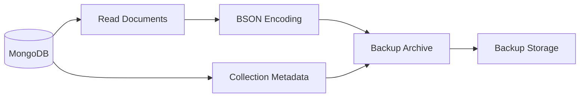
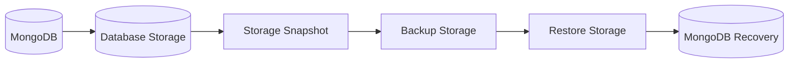
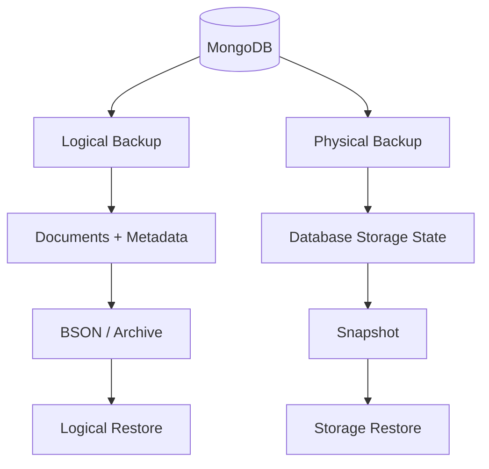
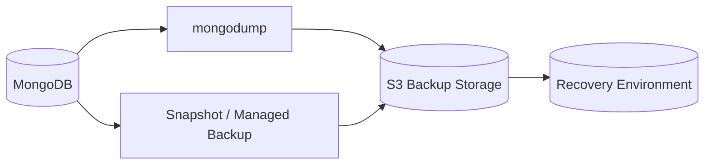
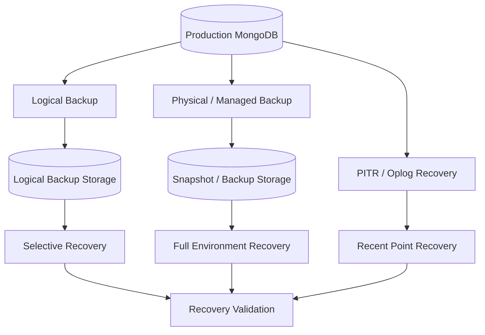

# 03- Logical vs Physical Backups

## Overview

MongoDB backup strategies generally fall into two broad categories:

- **Logical backups** — reconstruct database contents by reading and exporting logical database objects such as documents and collection metadata.
- **Physical backups** — preserve database storage at the storage-engine or infrastructure level, typically through filesystem or platform snapshots and MongoDB-supported backup mechanisms.

The distinction matters because backup format directly affects:

- Backup duration
- Restore duration
- Storage consumption
- Portability
- Recovery granularity
- Operational complexity
- Performance impact
- RPO and RTO
- Disaster recovery architecture

A production MongoDB environment should select backup mechanisms based on workload and recovery requirements rather than choosing a backup type purely because it is simpler.

```text
                    MongoDB Backup Strategies
                             │
              ┌──────────────┴──────────────┐
              │                             │
       Logical Backup                Physical Backup
              │                             │
        Documents + metadata       Storage-level state
              │                             │
        mongodump                  Snapshots / backup system
              │                             │
       Portable / selective         Fast large-scale recovery
              │                             │
       Migration / recovery        Production DR / large datasets
```

## Logical Backups

A logical backup exports MongoDB data through database-level operations.

The backup represents MongoDB objects logically rather than preserving the underlying database files.

A common example is:

```bash
mongodump \
  --uri="$MONGODB_URI" \
  --db=app \
  --archive="./app.archive" \
  --gzip
```

The resulting artifact contains logical representations of the selected MongoDB data and metadata.

### Logical Backup Flow



The restore process reverses the operation:

```text
Backup Archive
      │
      ▼
mongorestore
      │
      ├── Read BSON
      ├── Restore collections
      └── Restore metadata/indexes
      │
      ▼
MongoDB
```

## Why Logical Backups Exist

Logical backups provide a portable representation of MongoDB data.

They are particularly useful when the engineering task is about **data portability** rather than simply restoring an entire database storage environment.

Typical use cases include:

- Database migration
- Environment cloning
- Development data extraction
- Staging refreshes
- Collection-level recovery
- Database-level recovery
- Data migration between compatible MongoDB deployments
- Backup validation
- Selective restoration

## Advantages of Logical Backups

| Advantage | Explanation |
|---|---|
| Portability | Data can be restored independently of the original storage layout |
| Selective backup | Individual databases or collections can be targeted |
| Selective restore | Specific collections or namespaces can be restored |
| Simplicity | Easy to automate with Database Tools |
| Migration-friendly | Useful when moving data between environments |
| Inspectability | Backup contents can be examined through the restore tooling |
| Environment cloning | Useful for creating development or test datasets |

## Limitations of Logical Backups

Logical backups also have important limitations.

### Backup Speed

Every document must be read and encoded.

For large datasets:

```text
Large Collection
      ↓
Read Millions/Billions of Documents
      ↓
Encode
      ↓
Compress
      ↓
Write Backup
```

This can take substantially longer than a storage-level snapshot.

### Restore Speed

A logical restore generally requires inserting documents back into MongoDB.

The process can involve:

```text
Read Backup
    ↓
Decode BSON
    ↓
Insert Documents
    ↓
Build/Restore Indexes
    ↓
Validate
```

For large databases, this can make RTO difficult to satisfy.

### Resource Consumption

Logical backups can consume:

- Database I/O
- CPU
- Network bandwidth
- Backup-host CPU
- Backup storage
- Compression CPU

### Limited Recovery Granularity

A basic logical dump represents a database state rather than providing arbitrary historical recovery.

Point-in-time recovery requires additional mechanisms such as oplog-based recovery or a backup system specifically designed for continuous recovery.

## Physical Backups

A physical backup preserves database storage at a lower level.

Instead of reconstructing documents through MongoDB queries, the backup system captures the database's underlying storage state or a supported storage-level representation.

Typical mechanisms include:

- Filesystem snapshots
- Cloud volume snapshots
- Managed MongoDB backup systems
- Storage-engine-aware backup mechanisms

The exact implementation depends on the MongoDB deployment and infrastructure.

## Physical Backup Flow



The key difference is that the backup mechanism operates closer to the database's storage representation rather than reconstructing every document through logical database operations.

## Why Physical Backups Exist

Physical backup mechanisms become increasingly valuable as the database grows.

For a multi-terabyte deployment, a logical backup may require:

```text
Read TBs of documents
        ↓
Encode TBs of BSON
        ↓
Transfer TBs
        ↓
Restore TBs of documents
```

A storage-level mechanism can potentially provide much faster snapshot and restore operations, depending on the storage platform and backup architecture.

This makes physical approaches particularly relevant for:

- Large production databases
- Strict RTO requirements
- Infrastructure-level disaster recovery
- Rapid environment recovery
- Large-scale database cloning

## Advantages of Physical Backups

| Advantage | Explanation |
|---|---|
| Fast snapshot creation | Storage snapshots can be much faster than reading every document |
| Fast recovery | Restoring storage can avoid replaying every document through the database API |
| Large datasets | Better suited to very large database deployments |
| Infrastructure integration | Can integrate with cloud volume and snapshot systems |
| Efficient cloning | Useful for creating large recovery environments |

## Limitations of Physical Backups

Physical backup mechanisms are generally more infrastructure-dependent.

Potential limitations include:

- Reduced portability
- Storage-provider dependencies
- More complex consistency requirements
- Deployment-specific recovery procedures
- More complicated cross-platform migration
- Greater operational dependency on the storage layer

A snapshot that works for one infrastructure architecture may not be directly usable in another.

## Logical vs Physical Architecture

The fundamental difference can be visualized as:



Logical backup operates primarily at the **database object level**.

Physical backup operates primarily at the **storage level**.

## Comparison

| Dimension | Logical Backup | Physical Backup |
|---|---|---|
| Representation | Documents and metadata | Storage/database state |
| Typical tooling | `mongodump` / `mongorestore` | Snapshots or backup systems |
| Portability | High | Lower |
| Selective collection backup | Strong | Usually limited |
| Large dataset backup | Can be expensive | Often more efficient |
| Large dataset restore | Potentially slow | Often faster |
| Infrastructure dependency | Lower | Higher |
| Migration use cases | Strong | Limited |
| Environment cloning | Good | Excellent for compatible infrastructure |
| Recovery speed | Depends heavily on dataset size | Often faster |
| Operational complexity | Lower | Higher |
| Point-in-time recovery | Requires additional mechanisms | Depends on backup system |
| Storage-level recovery | No | Yes |
| Application-level filtering | Possible | Generally not the purpose |

## Backup Selection by Workload

The correct backup method depends heavily on workload characteristics.

| Workload | Typical Consideration |
|---|---|
| Local development | Logical backup |
| Small staging environment | Logical backup |
| Small production database | Logical or managed backup |
| Large production database | Physical/managed backup becomes increasingly important |
| Multi-terabyte production database | Storage-aware or managed backup should be evaluated |
| Data migration | Logical backup is often useful |
| Collection-level recovery | Logical backup is useful |
| Fast full-environment recovery | Physical/managed backup is often advantageous |
| Strict RTO | Prefer mechanisms with measured fast restore |
| Strict historical recovery | Evaluate PITR-capable backup architecture |

These are architectural guidelines rather than hard rules. The final decision should be based on measured backup and restore performance.

## Backup Strategy Should Not Be Binary

Production systems do not necessarily have to choose only one backup mechanism.

A layered strategy is often more useful:

```text
                    MongoDB
                       │
          ┌────────────┴────────────┐
          │                         │
    Logical Backup             Physical Backup
          │                         │
    Selective recovery        Fast full recovery
          │                         │
          └────────────┬────────────┘
                       │
                Off-Site Storage
                       │
                 Recovery Tests
```

For example:

- Logical backups can support selective recovery and migrations.
- Physical or managed backups can support rapid full-database recovery.
- Oplog/PITR capabilities can support fine-grained historical recovery.
- Cross-region copies can protect against regional failures.

## Backup and Restore Performance

Backup performance should be measured independently from restore performance.

Consider:

```text
Backup Duration
       +
Restore Duration
       +
Validation Duration
       =
Recovery Time
```

For example:

```text
Backup creation:       45 minutes
Backup transfer:       20 minutes
Database restore:      90 minutes
Index recovery:        25 minutes
Application validation: 10 minutes

Total recovery workflow: 190 minutes
```

If the required RTO is 60 minutes, this architecture does not satisfy the requirement regardless of whether the backup command succeeds.

## Logical Backup Performance

Logical backup throughput depends on:

- Number of documents
- Document size
- Number of collections
- MongoDB I/O capacity
- Network throughput
- Compression
- Backup host resources
- Index and metadata handling
- Concurrent production workload

Monitor:

```text
CPU
I/O
Network
Backup duration
Backup size
Compression ratio
MongoDB latency
Replication lag
```

A backup that causes unacceptable production latency is not operationally healthy even if it technically succeeds.

## Physical Backup Performance

Physical backup performance depends on:

- Storage subsystem
- Snapshot implementation
- Snapshot size
- Storage throughput
- Snapshot copy mechanism
- Cross-region transfer
- Backup retention
- Recovery infrastructure

For cloud deployments, also consider:

- Snapshot creation time
- Snapshot copy time
- Cross-region replication time
- Volume restoration time
- Database startup time
- Application recovery time

The complete RTO is larger than the raw snapshot restore duration.

## Consistency Considerations

Consistency is one of the most important differences between backup mechanisms.

A backup must represent a database state that can be recovered correctly.

Logical backup consistency depends on:

- How the dump is taken
- MongoDB deployment topology
- Concurrent writes
- Oplog handling
- Backup options
- Restore procedure

Physical backup consistency depends on:

- Snapshot mechanism
- Storage consistency
- MongoDB deployment
- Database state at snapshot time
- Supported MongoDB backup architecture

Do not assume that "snapshot" automatically means "consistent MongoDB backup."

## Replica Sets and Backup Sources

Replica sets provide another design dimension.

A production architecture may use:

```text
                    ┌──────────────┐
                    │   Primary    │
                    └──────┬───────┘
                           │
                    Replication
                           │
              ┌────────────┴────────────┐
              │                         │
        ┌─────▼─────┐             ┌─────▼─────┐
        │ Secondary │             │ Secondary │
        └─────┬─────┘             └───────────┘
              │
        Backup Workflow
              │
              ▼
        Backup Storage
```

Using a secondary can reduce direct backup workload on the primary in some architectures.

However, the selected member must be appropriate for the backup strategy.

Evaluate:

- Replication lag
- Node health
- Storage performance
- Network path
- Backup consistency
- Election configuration
- Impact on recovery objectives

A heavily lagging secondary should not automatically be considered a safe backup source.

## RPO Implications

RPO answers:

> How much accepted data can the organization afford to lose?

Logical and physical backups can have very different recovery-point characteristics depending on their scheduling.

Example:

```text
00:00  Backup
01:00  Backup
02:00  Backup
03:00  Failure
```

With hourly backups, the recovery point may be significantly older than the failure.

For tighter RPO requirements, evaluate:

- Frequent backups
- Oplog-based recovery
- Continuous backup
- Managed PITR
- Cross-region replication
- Application-level recovery mechanisms

## RTO Implications

RTO answers:

> How quickly must the service become operational again?

Consider a 2 TB database.

If a logical restore takes several hours:

```text
Failure
  ↓
Retrieve backup
  ↓
Transfer
  ↓
mongorestore
  ↓
Index recovery
  ↓
Validation
```

the architecture may not satisfy a short RTO.

A storage-level recovery mechanism may reduce the data restoration component substantially, but infrastructure startup and application recovery still need to be measured.

## Cost Considerations

Backup cost includes more than storage.

### Logical Backup Cost

Potential cost drivers:

- Backup host CPU
- Database I/O
- Network transfer
- Backup storage
- Compression CPU
- Object-storage requests
- Retention

### Physical Backup Cost

Potential cost drivers:

- Snapshot storage
- Incremental snapshot storage
- Cross-region copies
- Backup infrastructure
- Recovery infrastructure
- Managed backup service
- Long-term retention

A cheaper backup mechanism that cannot meet the RTO may be more expensive operationally during an actual incident.

## Security Considerations

Both backup types contain sensitive production data or provide access to sensitive database state.

Apply:

- Encryption at rest
- Encryption in transit
- Least-privilege access
- IAM controls
- Database authentication
- Secret management
- Audit logging
- Backup retention policies
- Restricted restore permissions
- Off-site access controls

Logical backups are especially easy to copy because they are portable files.

```text
MongoDB
   ↓
app.archive.gz
   ↓
Developer Laptop
   ↓
Cloud Drive
```

This is an unacceptable production data flow unless explicitly authorized and controlled.

Backup artifacts should remain in managed and audited storage.

## AWS Considerations

A common AWS-oriented architecture is:



Logical backups can be stored in Amazon S3 with appropriate:

- IAM policies
- Encryption
- Lifecycle policies
- Versioning
- Cross-region replication where required
- Retention controls

Physical or managed backups may use provider-specific snapshot mechanisms.

The exact architecture should depend on whether MongoDB runs:

- On EC2
- In Kubernetes
- In a managed MongoDB service
- In another infrastructure environment

## Kubernetes Considerations

In Kubernetes, the database storage layer becomes an important part of physical backup design.

```text
MongoDB Pod
    │
    ▼
Persistent Volume
    │
    ▼
Storage Snapshot
    │
    ▼
Backup Storage
```

However, Kubernetes volume snapshots and database consistency are different concerns.

A storage snapshot does not automatically make every database backup architecture correct.

The recovery design must consider:

- MongoDB replica-set state
- Storage consistency
- Volume attachment
- Pod scheduling
- Secrets
- Network configuration
- Service discovery
- Persistent volume restoration
- Application dependencies

## Migration Use Cases

Logical backups are particularly useful for migration.

Example:

```text
MongoDB Environment A
        │
        │ mongodump
        ▼
Logical Backup
        │
        │ Transfer
        ▼
MongoDB Environment B
        │
        │ mongorestore
        ▼
Migrated Data
```

This is useful when:

- Moving environments
- Creating staging copies
- Migrating selected databases
- Migrating selected collections
- Performing controlled data transfers

Physical snapshots are generally more tightly coupled to the original infrastructure.

## Selective Recovery

One major advantage of logical backups is selective restoration.

For example:

```bash
mongorestore \
  --uri="$MONGODB_URI" \
  --db=app \
  --collection=orders \
  ./backup/app/orders.bson
```

This is useful when only one collection needs recovery.

A storage-level snapshot generally operates at a much larger recovery boundary.

This makes logical backups particularly useful for:

- Accidental deletion
- Corrupted collections
- Data extraction
- Targeted migration
- Development refreshes

## Full Environment Recovery

Physical or managed backups become more attractive when the requirement is:

> Recover the entire MongoDB environment quickly.

The recovery flow may be:

```text
Infrastructure Failure
       ↓
Provision / Restore Storage
       ↓
Start MongoDB
       ↓
Validate Replica Set
       ↓
Validate Database
       ↓
Restore Application Connectivity
       ↓
Resume Traffic
```

This can avoid replaying billions of logical document inserts.

## Backup Layering

A mature MongoDB environment can use different mechanisms for different recovery scenarios.

| Recovery scenario | Suitable mechanism |
|---|---|
| Recover one collection | Logical backup |
| Recover selected documents | Logical backup or targeted recovery workflow |
| Clone staging environment | Logical or snapshot-based backup |
| Restore large production database | Physical/managed backup |
| Recover recent historical state | PITR-capable backup |
| Recover from regional outage | Off-site/cross-region backup |
| Long-term archive | Compressed logical or managed backup |
| Full infrastructure recovery | Physical/managed backup |

No single mechanism necessarily solves every recovery scenario.

## Hybrid Backup Architecture

A mature production design might look like:



This provides different recovery paths for different failure modes.

## When Logical Backup Is Preferable

Choose logical backup when:

- Portability matters.
- You need selective collection recovery.
- The database is relatively small.
- You are migrating data.
- You need development/staging copies.
- Restore time is compatible with the RTO.
- Operational simplicity is important.

## When Physical or Managed Backup Is Preferable

Prefer physical or managed approaches when:

- The database is very large.
- Restore time is a major concern.
- Full-database recovery is the primary requirement.
- Storage snapshots are supported and operationally appropriate.
- The platform provides reliable backup automation.
- Cross-region recovery is required.
- The workload requires a tighter recovery window.

The decision should be based on measured behavior rather than database size alone.

## Decision Framework

Use the following sequence:

```text
Define RPO
   ↓
Define RTO
   ↓
Measure Database Size
   ↓
Measure Growth Rate
   ↓
Measure Logical Backup Duration
   ↓
Measure Logical Restore Duration
   ↓
Evaluate Physical / Managed Backup
   ↓
Evaluate Recovery Granularity
   ↓
Evaluate Security and Cost
   ↓
Test Recovery
   ↓
Select Backup Architecture
```

This prevents backup technology from being selected before recovery requirements are understood.

## Production Pitfalls

### Choosing Based Only on Backup Speed

A fast backup does not guarantee a fast recovery.

**Avoid it:** Measure both backup and restore duration.

### Ignoring Recovery Granularity

A full snapshot may restore the database quickly but may be inconvenient when only one collection must be recovered.

**Avoid it:** Maintain an appropriate logical recovery path where selective recovery matters.

### Treating Snapshots as Automatically Consistent

Storage-level snapshots have database-level consistency requirements.

**Avoid it:** Use supported backup mechanisms and test recovery behavior.

### Ignoring Backup Load

Logical backups can compete with production workloads for I/O, CPU, and network resources.

**Avoid it:** Measure production impact and schedule or isolate backup workloads appropriately.

### Using Only Logical Backups for Very Large Databases

Logical restore time can eventually become incompatible with the required RTO.

**Avoid it:** Benchmark restore time as the dataset grows and evaluate physical or managed backup mechanisms.

### Using Only Physical Backups for Migration

Physical backups can be tightly coupled to infrastructure.

**Avoid it:** Use logical backups when portability or selective migration is important.

## Troubleshooting Methodology

### Logical Backup Is Slow

```text
Symptom
↓
mongodump takes significantly longer than expected
↓
Possible causes
├── Large dataset
├── Slow storage
├── High production load
├── Network bottleneck
├── Compression overhead
└── Backup source is overloaded
↓
Isolation strategy
├── Measure MongoDB CPU
├── Measure disk I/O
├── Measure network throughput
├── Compare backup size
└── Compare historical duration
↓
Diagnostic commands
```

MongoDB operational metrics and host-level monitoring should be used to identify the bottleneck.

```text
Root cause
↓
Corrective action
↓
Retest backup duration
↓
Prevention
```

### Logical Restore Is Too Slow

```text
Symptom
↓
mongorestore exceeds the RTO
↓
Possible causes
├── Dataset too large
├── Insufficient restore infrastructure
├── Network bottleneck
├── Index creation overhead
└── Storage throughput limitation
↓
Isolation strategy
├── Measure data transfer time
├── Measure document restore time
├── Measure index creation time
└── Measure validation time
↓
Corrective action
├── Increase recovery resources
├── Improve transfer path
├── Optimize backup format
└── Evaluate physical/managed recovery
↓
Prevention
↓
Run regular restore benchmarks
```

## Operational Checklist

### Logical Backup

- [ ] Backup scope is documented.
- [ ] Backup frequency matches RPO.
- [ ] Backup duration is monitored.
- [ ] Backup artifacts are encrypted.
- [ ] Backup credentials use least privilege.
- [ ] Backup storage is isolated.
- [ ] Restore procedures are documented.
- [ ] Selective recovery has been tested.

### Physical Backup

- [ ] Snapshot consistency is understood.
- [ ] Snapshot lifecycle is documented.
- [ ] Restore procedure is tested.
- [ ] Storage dependencies are documented.
- [ ] Cross-region recovery is considered.
- [ ] Recovery infrastructure is available.
- [ ] Restore duration is measured.

### Overall Recovery

- [ ] RPO is documented.
- [ ] RTO is documented.
- [ ] Backup and restore times are measured.
- [ ] Recovery validation is automated where practical.
- [ ] Disaster recovery procedures are documented.
- [ ] Recovery drills are performed periodically.

## Interview Traps

### Logical vs Physical

**Logical backup** represents database contents as logical MongoDB objects.

**Physical backup** preserves database storage or infrastructure state at a lower level.

### Which Is Faster?

There is no universal answer for every workload, but physical or managed snapshot-based recovery is generally better suited to very large datasets and short full-database recovery windows.

The actual answer should be based on benchmarked backup and restore times.

### Which Is More Portable?

Logical backups are generally more portable because they are not as tightly coupled to a specific storage subsystem.

### Which Is Better for Selective Recovery?

Logical backups generally provide better granularity for restoring individual databases or collections.

### Does Physical Backup Replace Logical Backup?

Not necessarily.

A production strategy can use both because they solve different recovery problems.

### Does a Backup Need to Be Tested?

Yes.

The strongest evidence that a backup strategy works is a successful, repeatable restore and validation process.

## Key Takeaways

- **Logical backups preserve MongoDB data as database-level objects and are particularly useful for portability, migration, and selective recovery.**
- **Physical backups preserve database storage state and are often better suited to large-scale production recovery and aggressive RTO requirements.**
- **Backup selection should be driven by measured RPO, RTO, dataset size, recovery granularity, security, cost, and operational complexity.**
- **A mature MongoDB architecture can combine logical, physical, and point-in-time recovery mechanisms rather than relying on one backup type.**
- **The real measure of a backup strategy is not backup completion but the ability to restore and validate the required recovery state within the defined RTO.**