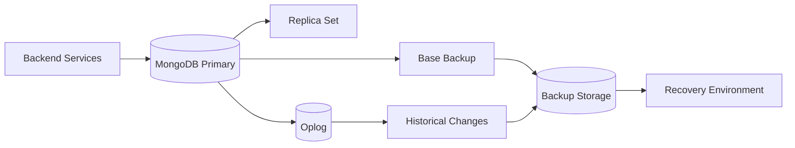
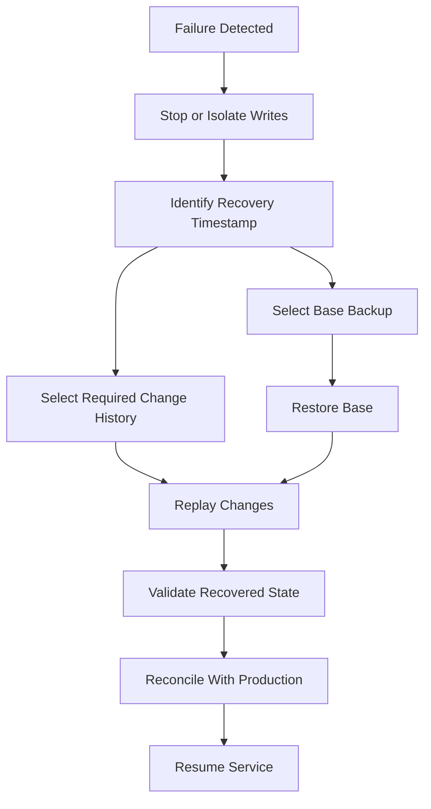
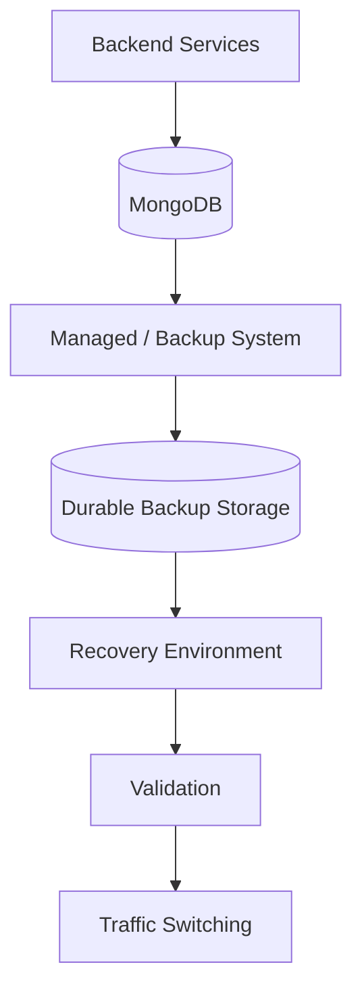

# 04- Point in Time Recovery

## Overview

Point-in-time recovery (PITR) allows a MongoDB deployment to be recovered to a specific point within a defined historical recovery window rather than only to the timestamp of the most recent full backup.

This capability is important when the failure is logical rather than purely infrastructural.

Examples include:

- Accidental deletion of documents
- Incorrect bulk updates
- Application bugs writing invalid data
- Malicious or unauthorized changes
- Corruption introduced by an application
- Recovery to a state immediately before a destructive deployment

The fundamental model is:

```text
Base Backup
    +
Historical Database Changes
    ↓
Recovery to Target Timestamp
```

A simplified recovery timeline is:

```text
10:00        10:30        11:00        11:30
  │            │            │            │
  ├────────────┼────────────┼────────────┤
  │            │            │            │
Backup       Writes       Bad Change    Failure
                             │
                             ▼
                    Recovery Target
                    = 10:59:59
```

Instead of restoring only the 10:00 backup, the recovery process reconstructs the database and applies changes until the required recovery timestamp.

## Why Point-in-Time Recovery Matters

A conventional scheduled backup might look like:

```text
00:00 ─────── 01:00 ─────── 02:00 ─────── 03:00
  Backup         Backup         Backup       Failure
```

If destructive activity occurs at 02:45, the latest full backup may be from 02:00.

Without PITR, recovery may require accepting the data state from 02:00 and manually reconstructing everything that happened afterward.

With PITR:

```text
02:00 Backup
     +
02:00 → 02:44:59 Changes
     ↓
Recovered Database
```

The target can be chosen close to the desired pre-failure state, provided the required recovery point falls within the available recovery window.

## PITR Components

A production PITR architecture generally requires several components:

| Component | Purpose |
|---|---|
| Base backup | Provides a starting database state |
| Oplog/change history | Provides changes after the base backup |
| Recovery window | Defines how far into the past recovery is possible |
| Backup storage | Stores durable recovery artifacts |
| Recovery tooling | Reconstructs the requested database state |
| Recovery environment | Isolated environment for restore and validation |
| Validation process | Confirms recovered data is correct |

The conceptual relationship is:

```text
Base Backup
     │
     ▼
Recovery Point
     │
     ├── Change 1
     ├── Change 2
     ├── Change 3
     ├── ...
     └── Change N
             │
             ▼
       Target Timestamp
```

## MongoDB Oplog

The MongoDB oplog is a critical building block for PITR in replica-set deployments.

The oplog records changes that must be replicated to secondary members.

Conceptually:

```text
Primary
   │
   ├── Write
   │
   ▼
Oplog
   │
   ├── Insert
   ├── Update
   ├── Delete
   └── Other replicated operations
   │
   ▼
Secondaries
```

The oplog is stored in the `local` database and is not intended to be treated as an indefinitely retained audit history.

Its available history is bounded by the configured oplog capacity and workload.

## Oplog Window

The **oplog window** is approximately the amount of historical time represented by the currently retained oplog entries.

For example:

```text
Current Time:       12:00
Oldest Oplog Entry: 08:00

Approximate Window: 4 hours
```

If the recovery target is 06:00, the current oplog alone cannot provide the required historical changes.

A useful operational relationship is:

```text
PITR Recovery Window
    <=
Available Backup + Change History Retention
```

The exact recovery capability depends on the complete backup architecture.

## PITR Architecture

A typical architecture is:



The recovery system combines a durable base backup with historical changes.

## Base Backup

A base backup provides the starting point for reconstruction.

Depending on the MongoDB deployment, this may be provided by:

- Managed backup systems
- Logical backups
- Snapshots
- Other supported backup mechanisms

A PITR system must ensure that the base backup and historical changes cover the target timestamp.

For example:

```text
Base Backup
Timestamp: 00:00

Required Recovery:
01:45

Available Changes:
00:00 → 02:00

Result:
Recovery to 01:45 is possible
```

If historical changes begin only at 01:00:

```text
Base Backup:       00:00
Changes available: 01:00 → 02:00
Target:            00:30

Result:
Insufficient recovery history
```

## Recovery Window

The recovery window defines how far back the system can recover.

Example:

```text
Current Time:       2026-09-22 18:00
Recovery Window:    72 hours

Earliest Target:
2026-09-19 18:00
```

A 72-hour PITR window does not mean that arbitrary recovery is available forever.

Recovery capability must be monitored continuously.

## RPO and PITR

PITR can substantially reduce the practical recovery point compared with infrequent full backups.

For example:

```text
Full Backup
     │
     ▼
00:00
     │
     ├── 00:05
     ├── 00:10
     ├── 00:15
     ├── ...
     └── 03:42
```

If the system retains the necessary historical changes, a recovery target can be selected close to the failure point.

However, PITR does not automatically guarantee zero data loss.

RPO depends on:

- Backup durability
- Historical change retention
- Replication health
- Backup transport
- Recovery architecture
- Failure scenario
- Recovery validation

## PITR vs Regular Backups

| Capability | Scheduled Backup | PITR |
|---|---|---|
| Recovery to backup timestamp | Yes | Yes |
| Recovery to arbitrary point within window | No | Yes |
| Protection from accidental deletion | Limited | Stronger |
| Historical recovery | Limited | Strong |
| Operational complexity | Lower | Higher |
| Storage requirements | Lower | Higher |
| Monitoring requirements | Moderate | Higher |
| RPO | Backup interval dependent | Can be much tighter |
| Recovery flexibility | Lower | Higher |

PITR is not a replacement for base backups.

It is a recovery capability built on top of durable backup and historical change retention.

## PITR Recovery Workflow

A controlled recovery process should normally be:



The recovery process should not immediately overwrite production.

An isolated recovery environment provides an opportunity to inspect the recovered state before making it authoritative.

## Choosing the Recovery Timestamp

Choosing the target timestamp is often the hardest operational decision.

Suppose:

```text
10:00  Normal
10:30  Normal
10:45  Deployment
10:50  Bad application release
10:55  Incorrect update
11:00  Incident detected
```

A recovery target might need to be immediately before the destructive operation rather than simply using the time the incident was detected.

The target should account for:

- Deployment time
- First known bad write
- First known corrupted record
- Queue processing
- Background workers
- Delayed application effects
- External integrations

For critical incidents, preserve the evidence needed to determine the correct recovery point before destructive recovery operations begin.

## Application-Aware Recovery

MongoDB recovery does not happen in isolation from the backend.

Consider:

```text
FastAPI / Django
       │
       ├── MongoDB
       ├── Redis
       ├── Kafka
       └── Celery
```

Suppose MongoDB is restored to 10:45 but Kafka consumers have already processed events generated after 10:45.

The application state may become inconsistent.

Therefore PITR planning must consider:

- Kafka offsets
- Celery tasks
- Redis cache state
- External API calls
- Event consumers
- Scheduled jobs
- Search indexes
- Object storage
- Audit systems

## Quiescing the Application

Depending on the incident, writes may need to be stopped before recovery.

A controlled process can be:

```text
Stop Application Writes
        ↓
Stop Background Workers
        ↓
Pause Event Consumers
        ↓
Identify Recovery Timestamp
        ↓
Recover MongoDB
        ↓
Validate
        ↓
Reconcile External State
        ↓
Resume Services
```

This prevents recovered MongoDB state from immediately being modified by old application processes.

## Logical PITR Considerations

Logical backup workflows can capture a base dump and, in suitable replica-set scenarios, relevant oplog information.

A conceptual process is:

```text
mongodump
    │
    ├── Base Data
    └── Oplog Information
             │
             ▼
        Backup Artifact
             │
             ▼
        mongorestore
```

The oplog captured by a dump represents the relevant changes during the dump operation; it should not be confused with an indefinite historical archive.

For true operational PITR, evaluate a backup system that explicitly supports the required recovery window and target-time recovery semantics.

## Managed PITR

Managed MongoDB platforms can provide backup capabilities with point-in-time recovery.

Typical capabilities may include:

- Continuous backup
- Configurable recovery windows
- Snapshot management
- Point-in-time restore
- Automated backup storage
- Recovery workflows
- Cross-region capabilities

Exact features vary by deployment model and service configuration.

Do not design a recovery runbook around a managed-service feature without verifying that the selected MongoDB deployment and service tier actually provide it.

## PITR with `mongodump`

`mongodump` and `mongorestore` can participate in oplog-aware backup workflows, but a normal dump should not be described as a complete PITR platform.

For example:

```bash
mongodump \
  --uri="$MONGODB_URI" \
  --oplog \
  --archive="./backup/app.archive"
```

The `--oplog` option captures relevant oplog information associated with the dump.

This can help make a dump consistent with changes occurring during the backup process.

It does **not** mean:

```text
mongodump
     =
continuous PITR
```

A production PITR architecture requires durable historical coverage and a tested mechanism for reconstructing the requested target state.

## Oplog Retention and PITR

The oplog is a bounded history.

If writes increase significantly:

```text
More Writes
    ↓
More Oplog Entries
    ↓
Same Oplog Storage Capacity
    ↓
Shorter Time Window
```

For example:

```text
Normal workload:
Oplog window = 72 hours

High-write workload:
Oplog window = 18 hours
```

The configured oplog size therefore should be evaluated against workload and recovery requirements.

Do not define the PITR window solely in hours without observing actual oplog behavior.

## Monitoring PITR Readiness

Monitor:

- Oplog window
- Backup freshness
- Backup success
- Backup age
- Backup storage health
- Historical change availability
- Replication health
- Secondary lag
- Recovery test results
- Restore duration
- Recovery validation failures

A useful operational dashboard can contain:

```text
Latest Successful Backup
Backup Age
Oplog Window
Replication Lag
Recovery Window
Last Restore Test
Last Restore Duration
Backup Storage Capacity
```

## Oplog Inspection

From `mongosh`, replica-set oplog information can be inspected through the `local` database.

For example:

```javascript
use local

db.oplog.rs.find()
  .sort({ts: -1})
  .limit(5)
```

For operational investigation, avoid scanning the entire oplog unnecessarily.

The exact representation of the oplog timestamp and diagnostic queries should be interpreted using MongoDB's supported operational tooling and version-specific documentation.

## Recovery Point Validation

Before restoring to a selected timestamp, verify:

```text
Target Timestamp
       │
       ├── Covered by base backup?
       ├── Covered by historical changes?
       ├── Backup artifacts available?
       ├── Recovery environment available?
       └── Dependencies recoverable?
```

If any required component is missing, the intended recovery point may not be achievable.

## PITR and Transactions

MongoDB transactions produce multiple operations that must be considered as part of the database's transactional behavior.

Recovery tooling must preserve the appropriate ordering and transactional semantics.

Do not treat oplog entries as unrelated application events and manually replay them without understanding transaction boundaries.

For production recovery, use supported MongoDB backup and restore mechanisms rather than building a custom oplog replay engine unless there is a very specific and justified operational requirement.

## PITR and Change Streams

Change streams and PITR solve different problems.

| Capability | Change Streams | PITR |
|---|---|---|
| Purpose | Event consumption | Historical database recovery |
| Primary use | Event-driven applications | Disaster/data recovery |
| Consumers | Applications/workers | Recovery tooling/operators |
| Historical retention | Not an archival system | Backup architecture defines window |
| Resume token | Yes | Not the same concept |
| Recovery of database state | No | Yes |

A Kafka pipeline consuming MongoDB change events is not automatically a backup.

Likewise, a PITR system is not an event-processing system.

## Security

PITR infrastructure contains highly sensitive historical database information.

Protect:

- Backup archives
- Snapshots
- Oplog-derived recovery data
- Recovery environments
- Recovery credentials
- Encryption keys
- Restore logs

Apply:

- Encryption at rest
- TLS
- Least-privilege IAM
- Restricted restore permissions
- Secret management
- Audit logging
- Network isolation
- Data retention controls

A recovered database should not automatically become accessible to every production service.

Use an isolated recovery environment until validation is complete.

## Recovery Environment

A dedicated recovery environment should ideally be reproducible.

For example:

```text
Infrastructure as Code
        │
        ▼
Recovery VPC / Network
        │
        ├── MongoDB
        ├── Application
        ├── Monitoring
        └── Validation Tools
```

Using Terraform, CloudFormation, Kubernetes manifests, or equivalent automation can reduce recovery time and manual errors.

The recovery environment should not depend on undocumented operator actions.

## PITR on AWS

A production AWS architecture might look like:



Consider:

- S3 or managed backup storage
- Encryption with KMS
- IAM least privilege
- Cross-region copies
- VPC isolation
- Recovery infrastructure
- DNS/traffic switching
- Secrets
- Monitoring

The exact architecture depends on whether MongoDB runs on Atlas, EC2, Kubernetes, or another deployment model.

## PITR and Kubernetes

For Kubernetes-based MongoDB deployments, recovery must consider both database state and Kubernetes infrastructure.

```text
Backup
   │
   ├── MongoDB Data
   ├── Database Configuration
   ├── Secrets
   ├── Persistent Storage
   └── Application Configuration
        │
        ▼
Recovery Cluster
```

A volume snapshot alone does not necessarily provide a complete MongoDB PITR strategy.

The recovery architecture must account for:

- Replica-set configuration
- Persistent volumes
- Storage snapshots
- Network policies
- Secrets
- Services
- Stateful workloads
- Application deployments

## Performance Considerations

PITR introduces additional operational overhead.

Potential costs include:

- Backup storage
- Continuous change capture
- Oplog storage
- Cross-region replication
- Network transfer
- Recovery infrastructure
- Restore validation
- Monitoring

The impact must be measured against business requirements.

A tighter recovery window generally requires more infrastructure and operational complexity.

## Cost Optimization

Do not optimize PITR cost by reducing the recovery window below the actual business requirement.

Instead consider:

- Compression
- Lifecycle policies
- Tiered backup storage
- Appropriate retention
- Cross-region copies only where required
- Automated cleanup
- Efficient recovery environments
- Scheduled recovery tests

A backup architecture should optimize total recovery cost, not merely storage cost.

## Common Mistakes

### Treating the Oplog as an Infinite History

The oplog is bounded.

**Avoid it:** Monitor the actual oplog window and ensure the backup architecture covers the required recovery period.

### Confusing Change Streams With PITR

Change streams expose database changes to applications; they are not a historical database backup.

**Avoid it:** Use a dedicated backup and recovery architecture for PITR.

### Choosing the Recovery Point Too Late

Incident detection may occur significantly after the first bad write.

**Avoid it:** Identify the first known destructive event and recover to a validated pre-failure timestamp.

### Restoring Directly Over Production

This can destroy the remaining good state and complicate investigation.

**Avoid it:** Restore into an isolated environment first.

### Ignoring Application Side Effects

MongoDB may be recovered while Kafka, Redis, Celery, or external systems remain in a newer state.

**Avoid it:** Include application dependencies in the recovery runbook.

### Not Monitoring Oplog Window

A PITR system can silently lose its required historical coverage.

**Avoid it:** Alert when the effective recovery window falls below the required threshold.

### Assuming `--oplog` Provides Full PITR

Oplog-aware `mongodump` workflows are not automatically equivalent to continuous PITR systems.

**Avoid it:** Verify exactly what historical recovery capability the backup architecture provides.

## Troubleshooting Methodology

### Required Recovery Point Is Unavailable

```text
Symptom
↓
Requested recovery timestamp cannot be restored
↓
Possible causes
├── Backup too old
├── Oplog window too short
├── Historical backup unavailable
├── Backup corruption
└── Incorrect recovery target
↓
Isolation strategy
├── Identify latest valid base backup
├── Determine backup coverage
├── Inspect historical change availability
└── Verify recovery artifacts
↓
Diagnostic commands
├── Inspect backup metadata
├── Inspect replica-set health
└── Inspect oplog window
↓
Root cause
↓
Corrective action
├── Recover to earliest valid point
├── Reconcile missing data manually
└── Escalate recovery procedure if required
↓
Prevention
├── Increase recovery coverage
├── Improve backup retention
└── Monitor recovery window
```

### Recovery Produces Inconsistent Application State

```text
Symptom
↓
MongoDB is restored but application behavior is inconsistent
↓
Possible causes
├── Kafka events processed after target timestamp
├── Celery tasks already executed
├── Redis contains newer cached state
├── External APIs contain newer state
└── Search indexes are ahead of MongoDB
↓
Isolation strategy
├── Identify dependent systems
├── Compare timestamps
└── Identify non-idempotent operations
↓
Corrective action
├── Rebuild derived state
├── Replay required events
├── Clear or rebuild caches
└── Reconcile external systems
↓
Prevention
├── Document dependency recovery
├── Design idempotent consumers
└── Test end-to-end recovery
```

## PITR Runbook

A production runbook should contain:

### Before Recovery

- Identify incident time.
- Stop destructive writes if possible.
- Preserve relevant logs.
- Preserve application deployment information.
- Identify candidate recovery timestamps.
- Verify backup availability.
- Verify recovery window.
- Provision isolated recovery infrastructure.

### During Recovery

- Restore the appropriate base backup.
- Apply historical changes using the supported recovery mechanism.
- Record the exact target timestamp.
- Record recovery duration.
- Monitor errors.
- Do not expose the recovered environment to production traffic prematurely.

### After Recovery

Validate:

- Database availability
- Collection integrity
- Indexes
- Critical business records
- Application APIs
- Authentication
- Background workers
- Kafka consumers
- Redis state
- External integrations

Only after validation should production traffic or recovered data be switched into service.

## Recovery Testing

PITR should be tested regularly.

A recovery drill should measure:

```text
Target Selection
      ↓
Infrastructure Provisioning
      ↓
Backup Retrieval
      ↓
Database Restore
      ↓
Historical Replay
      ↓
Validation
      ↓
Application Recovery
      ↓
Traffic Readiness
```

Record:

- Actual recovery time
- Actual recovery point
- Backup retrieval time
- Restore duration
- Historical replay duration
- Validation duration
- Manual steps
- Failure points

A documented PITR capability without successful recovery testing is an unverified assumption.

## Production Readiness Checklist

### Recovery Coverage

- [ ] Required RPO is documented.
- [ ] Required PITR window is documented.
- [ ] Base backups are available.
- [ ] Historical change coverage is available.
- [ ] Backup storage is durable.
- [ ] Off-site recovery is considered.

### Monitoring

- [ ] Backup freshness is monitored.
- [ ] Oplog window is monitored where relevant.
- [ ] Replication lag is monitored.
- [ ] Backup failures generate alerts.
- [ ] Recovery tests are tracked.
- [ ] Recovery duration is measured.

### Security

- [ ] Backup storage is encrypted.
- [ ] Recovery access is restricted.
- [ ] Credentials are stored securely.
- [ ] Recovery environments are isolated.
- [ ] Backup access is audited.

### Operations

- [ ] Recovery timestamp selection procedure exists.
- [ ] Application quiescing procedure exists.
- [ ] Restore runbook exists.
- [ ] Validation procedure exists.
- [ ] Kafka/Celery/Redis recovery dependencies are documented.
- [ ] Recovery drills are performed periodically.

## Interview Traps

### Is PITR the Same as a Backup?

No.

A backup provides a recoverable database state. PITR combines a base recovery state with historical changes so that recovery can target a specific point within a defined window.

### Is the Oplog a Backup?

No.

The oplog is a bounded replication history. It can participate in recovery architectures but should not be treated as an indefinitely retained backup.

### Is PITR Zero Data Loss?

Not necessarily.

The achievable RPO depends on the complete backup and recovery architecture.

### Can PITR Recover From Any Historical Timestamp?

Only if the required base backup and historical change information cover that timestamp.

### Should Recovery Be Performed Directly on Production?

Generally, recovery should first be performed in an isolated environment where the recovered state can be validated.

### Does PITR Recover Redis and Kafka?

No.

PITR recovers MongoDB state. Other systems require their own recovery or reconciliation strategies.

## Key Takeaways

- **PITR combines a recoverable base state with historical database changes to reconstruct MongoDB at a specific timestamp within a defined recovery window.**
- **The oplog provides bounded change history; it is an important recovery mechanism but is not an unlimited backup or archival system.**
- **PITR recovery must account for application dependencies such as Kafka, Celery, Redis, search indexes, and external systems because MongoDB may be restored to an older state than those systems.**
- **Recovery readiness depends on measurable backup coverage, historical retention, RPO, restore duration, validation, security, and regular recovery testing.**
- **A production PITR design should recover into an isolated environment first, validate the target state, reconcile dependent systems, and only then resume production traffic.**