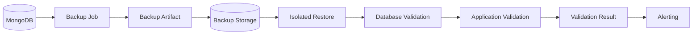
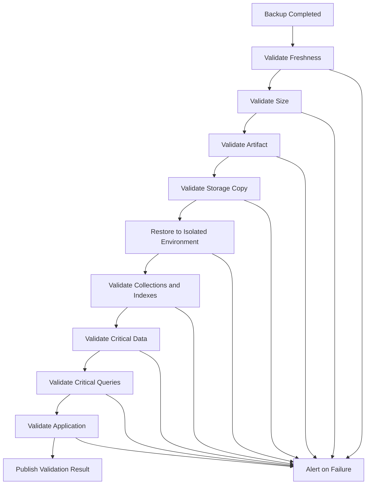

# 05- Backup Validation

## Overview

A MongoDB backup is not production-ready merely because `mongodump`, a snapshot system, or a managed backup service reports success.

Backup validation answers a more important question:

> Can this backup actually be used to recover the required MongoDB state within the expected RPO and RTO?

A useful model is:

```text
Backup Created
     ↓
Artifact Validation
     ↓
Backup Integrity Validation
     ↓
Restore Validation
     ↓
Database Validation
     ↓
Application Validation
     ↓
Recovery Measurement
```

Validation should exist at multiple levels because different failures can occur at different layers.

| Validation level | Primary question |
|---|---|
| Job validation | Did the backup operation complete? |
| Artifact validation | Does the expected backup artifact exist and look valid? |
| Integrity validation | Can the backup data be read? |
| Restore validation | Can MongoDB restore it successfully? |
| Database validation | Does the recovered database contain the expected state? |
| Application validation | Can the application use the recovered database? |
| Recovery validation | Can the entire recovery process satisfy RTO/RPO? |

## Why Backup Validation Matters

A backup process can report success while the recovery capability is still broken.

Possible examples include:

- Backup storage is full.
- Only part of the expected backup was uploaded.
- Credentials allow backup creation but not restore.
- A backup artifact is corrupted.
- Required collections are missing.
- Indexes are missing or incorrect.
- The backup is older than the required RPO.
- Restore takes longer than the RTO.
- MongoDB restores successfully but the application cannot start.
- Kafka, Celery, Redis, or external dependencies remain inconsistent.

Therefore:

```text
Backup Success
      ≠
Recovery Success
```

The stronger operational goal is:

```text
Verified Backup
      =
Recoverable + Validated + Timely
```

## Backup Validation Architecture

A production validation pipeline can be structured as:



The validation process should be independent enough that a broken backup job cannot falsely report itself as healthy.

## Validation Levels

### Backup Job Validation

Checks whether the backup command completed successfully.

For example:

```bash
mongodump \
  --uri="$MONGODB_URI" \
  --archive="/backup/app.archive.gz" \
  --gzip
```

A basic shell workflow might check the exit status:

```bash
set -euo pipefail

mongodump \
  --uri="$MONGODB_URI" \
  --archive="/backup/app.archive.gz" \
  --gzip

echo "Backup command completed successfully"
```

This is necessary but insufficient.

A successful process exit does not prove that the backup meets recovery requirements.

### Artifact Validation

Verify that the expected artifact exists and is plausible.

```bash
test -s /backup/app.archive.gz
```

Then inspect:

```bash
ls -lh /backup/app.archive.gz
```

Useful checks include:

- File exists
- File is non-empty
- File size is within expected bounds
- Expected naming convention is present
- Timestamp is correct
- Upload completed
- Storage metadata exists
- Checksum is available where appropriate

## Backup Size Validation

Backup size should be monitored over time.

Example:

```text
Date          Backup Size
2026-09-01    82 GB
2026-09-08    85 GB
2026-09-15    89 GB
2026-09-22    93 GB
```

A sudden change can indicate:

- Data growth
- Unexpected retention
- Missing collections
- Application bugs
- Backup configuration changes
- Compression changes
- Corruption
- Partial backup

Size validation should detect anomalies, not enforce an arbitrary exact size.

For example, this is dangerous:

```text
Expected backup size = exactly 100 GB
```

Real backup sizes naturally change as data changes.

A better approach is to establish expected ranges and alert on significant deviations.

## Backup Freshness

A backup can be valid but too old to satisfy the RPO.

Suppose:

```text
Required RPO: 15 minutes

Current time:        12:00
Last successful backup: 11:10
```

The backup is technically valid but operationally stale.

Track:

```text
Backup Age =
Current Time - Last Successful Backup
```

Alert when:

```text
Backup Age > Allowed Recovery Point Window
```

## Storage Validation

Uploading a backup to object storage introduces another failure boundary.

For example:

```text
MongoDB
   ↓
mongodump
   ↓
Local Archive
   ↓
Upload
   ↓
S3
```

Each step should be observable.

A local backup does not satisfy an off-site backup requirement if the upload fails.

Example AWS check:

```bash
aws s3 ls \
  s3://company-mongodb-backups/production/
```

A production workflow should verify the specific object rather than merely checking that the bucket is reachable.

## Checksums and Integrity

Checksums can help detect corruption or unexpected changes to backup artifacts.

For example:

```bash
sha256sum /backup/app.archive.gz
```

Store the resulting checksum alongside trusted backup metadata.

The validation flow becomes:

```text
Backup
  ↓
Generate Checksum
  ↓
Store Backup
  ↓
Retrieve Backup
  ↓
Recalculate Checksum
  ↓
Compare
```

A checksum verifies byte-level integrity of the artifact. It does not prove that the database represented by the artifact is semantically correct.

## Logical Backup Validation

For `mongodump` backups, validate:

- Expected databases
- Expected collections
- Backup metadata
- BSON files or archive readability
- Expected collection counts where practical
- Critical indexes after restore
- Critical documents after restore

For directory-format backups:

```bash
find ./backup -type f -maxdepth 3
```

The exact file structure depends on the dump configuration.

For archive-format backups, validate through the corresponding MongoDB Database Tools rather than treating the archive as a generic compressed file.

## Restore Validation

The strongest backup validation technique is restoration.

A typical process is:

```text
Backup Storage
      ↓
Download Backup
      ↓
Restore to Isolated MongoDB
      ↓
Validate Database
      ↓
Validate Application
      ↓
Record Result
```

Example:

```bash
mongorestore \
  --uri="$RECOVERY_MONGODB_URI" \
  --archive="/restore/app.archive.gz" \
  --gzip
```

A restore should normally happen in an isolated environment before the backup is considered fully validated.

## Restore Into an Isolated Database

When practical, restore into a separate database or environment.

For example:

```text
Production
   │
   ├── Backup
   │
   ▼
Recovery MongoDB
   │
   └── app_restore
```

Namespace rewriting can help avoid overwriting an existing database:

```bash
mongorestore \
  --uri="$RECOVERY_MONGODB_URI" \
  --nsFrom="app.*" \
  --nsTo="app_restore.*" \
  ./backup
```

This is useful for validation and selective recovery testing.

## Database-Level Validation

After restoration, validate structural integrity.

Typical checks include:

- Database exists
- Collections exist
- Expected document counts are plausible
- Indexes exist
- Collection options are correct
- Critical records exist
- Required metadata exists
- Authentication works
- Database connectivity works

Example:

```javascript
use app_restore

show collections

db.users.countDocuments()
db.orders.countDocuments()
db.products.countDocuments()

db.users.getIndexes()
db.orders.getIndexes()
```

Exact validation queries should be based on business-critical collections rather than relying only on total document counts.

## Document-Level Validation

Document counts alone are not sufficient.

For example:

```text
Expected orders:
10,000,000

Restored orders:
10,000,000
```

This does not prove that the correct documents were restored.

Validate critical business records where practical:

```javascript
db.orders.findOne({
  order_id: "ORD-2026-000123"
})
```

Validate:

- Critical identifiers
- Required fields
- Important relationships
- Timestamp ranges
- Status values
- Business invariants

## Sampling Strategy

Validating every document may be too expensive for large databases.

A practical strategy can combine:

```text
Structural Validation
        +
Aggregate Counts
        +
Deterministic Samples
        +
Critical Record Checks
        +
Application Tests
```

For example:

```text
10 million documents
       │
       ├── Collection count
       ├── Index validation
       ├── 1,000 deterministic samples
       ├── Critical business records
       └── Application smoke tests
```

Sampling should be deterministic or reproducible where possible so that validation results can be compared between recovery drills.

## Index Validation

Indexes are important to application correctness and performance.

After restore:

```javascript
db.orders.getIndexes()
```

Check:

- Index names
- Indexed fields
- Compound ordering
- Unique constraints
- Partial filters
- TTL configuration
- Sparse configuration
- Other required index options

A database can be functionally correct but operationally unusable if critical indexes are missing.

For example:

```text
Without Index
    ↓
COLLSCAN
    ↓
High latency
    ↓
Application timeout
```

## Query Validation

Run representative production queries against the restored database.

Example:

```javascript
db.orders.find({
  customer_id: "customer-123",
  status: "completed"
}).sort({
  created_at: -1
}).limit(20)
```

For critical queries, inspect the plan:

```javascript
db.orders.find({
  customer_id: "customer-123",
  status: "completed"
}).sort({
  created_at: -1
}).limit(20).explain("executionStats")
```

Validation should verify both:

- Query correctness
- Acceptable performance

## Aggregation Validation

Critical aggregation pipelines should also be tested after restore.

Example:

```javascript
db.orders.aggregate([
  {
    $match: {
      status: "completed"
    }
  },
  {
    $group: {
      _id: "$customer_id",
      total: {
        $sum: "$amount"
      }
    }
  }
])
```

Compare important results against known production baselines where appropriate.

For large datasets, exact result comparison may be expensive. Use business-specific validation strategies.

## Application-Level Validation

Database restoration is only one layer of recovery.

For a FastAPI or Django application:

```text
Recovered MongoDB
       ↓
Application Connection
       ↓
Health Check
       ↓
Authentication
       ↓
Critical Read Paths
       ↓
Critical Write Paths
       ↓
Background Workers
```

Example:

```text
GET /health
GET /api/orders/123
GET /api/customers/456
POST /api/orders
```

The validation environment should use controlled test operations so that recovery testing does not accidentally affect production.

## Python Recovery Validation

A lightweight Python validation script can verify critical collections:

```python
from pymongo import MongoClient

client = MongoClient(
    "mongodb://recovery-mongo:27017",
    serverSelectionTimeoutMS=5000,
)

db = client["app_restore"]

required_collections = {
    "users",
    "orders",
    "products",
}

actual_collections = set(db.list_collection_names())

missing = required_collections - actual_collections

if missing:
    raise RuntimeError(
        f"Missing collections: {sorted(missing)}"
    )

for collection_name in sorted(required_collections):
    count = db[collection_name].estimated_document_count()
    print(f"{collection_name}: {count}")
```

This validates structure but should be extended with application-specific checks for a production recovery pipeline.

## Validation With FastAPI

A recovery validation suite can call application endpoints rather than directly accessing MongoDB.

Example:

```python
import requests

BASE_URL = "https://recovery-api.internal"

response = requests.get(
    f"{BASE_URL}/health",
    timeout=10,
)

response.raise_for_status()

response = requests.get(
    f"{BASE_URL}/api/orders/ORD-2026-000123",
    timeout=10,
)

response.raise_for_status()
```

This validates the complete path:

```text
HTTP
 ↓
Nginx / Load Balancer
 ↓
FastAPI
 ↓
Repository
 ↓
MongoDB
```

## Background Worker Validation

Applications using Celery should include worker validation.

```text
Recovered MongoDB
       │
       ├── API
       └── Celery
              │
              ├── Task execution
              ├── Database writes
              └── Retry behavior
```

Validate:

- Worker starts
- MongoDB connection works
- Tasks execute
- Tasks do not duplicate destructive operations
- Retry behavior is correct
- Scheduled tasks are controlled during recovery

Do not automatically enable production workers against a recovery database unless the recovery procedure explicitly requires it.

## Kafka and Event-Driven Systems

If MongoDB is part of an event-driven architecture, validation should consider Kafka consumers and producers.

For example:

```text
MongoDB
   │
   ▼
Change Stream
   │
   ▼
Kafka
   │
   ▼
Consumer
```

A restored MongoDB state may be older than Kafka's current state.

Therefore validate:

- Consumer offsets
- Duplicate event handling
- Idempotency
- Rebuildability of derived data
- Search indexes
- Downstream projections

PITR and backup restoration should not automatically replay application events without a controlled recovery plan.

## Cache Validation

Redis usually should not be treated as the source of truth when MongoDB is the primary persistent store.

After recovery:

```text
MongoDB Recovery
      ↓
Invalidate Redis
      ↓
Rebuild Cache
      ↓
Resume Normal Traffic
```

If Redis contains state that cannot be reconstructed from MongoDB, it becomes part of the recovery architecture and requires its own backup/recovery strategy.

## Data Consistency Validation

Validation should include application-level invariants.

For example:

```text
Order
 ├── customer_id exists
 ├── amount >= 0
 ├── status is valid
 └── created_at <= updated_at
```

A Python validation example:

```python
def validate_order(order: dict) -> None:
    if order["amount"] < 0:
        raise ValueError("Order amount cannot be negative")

    if order["status"] not in {
        "pending",
        "completed",
        "cancelled",
    }:
        raise ValueError(
            f"Invalid order status: {order['status']}"
        )
```

Business invariants are often more valuable than simple document counts.

## Backup Freshness Validation

Automate freshness checks.

Conceptually:

```python
from datetime import datetime, timezone

last_successful_backup = datetime(
    2026,
    9,
    22,
    11,
    45,
    tzinfo=timezone.utc,
)

now = datetime.now(timezone.utc)

age_minutes = (
    now - last_successful_backup
).total_seconds() / 60

max_age_minutes = 30

if age_minutes > max_age_minutes:
    raise RuntimeError(
        f"Backup is stale: {age_minutes:.1f} minutes old"
    )
```

In production, the timestamp should come from backup metadata or the backup platform rather than hard-coded data.

## Backup Validation Pipeline

A mature automated pipeline can be:



The pipeline should stop on critical validation failures.

## Validation Frequency

Different validation levels can run at different frequencies.

| Validation | Suggested frequency |
|---|---|
| Backup job status | Every backup |
| Artifact existence | Every backup |
| Backup freshness | Continuous monitoring |
| Storage upload | Every backup |
| Basic integrity | Every backup where practical |
| Full restore | Scheduled |
| Application validation | Scheduled |
| Disaster recovery drill | Periodic |
| Full RTO measurement | Periodic |
| Cross-region recovery | Periodic |

The exact schedule should be based on business requirements and operational cost.

## Restore Drills

A restore drill validates the complete recovery path.

Example:

```text
1. Select a recent backup.
2. Provision recovery infrastructure.
3. Restore MongoDB.
4. Validate database structure.
5. Validate critical records.
6. Validate indexes.
7. Run application smoke tests.
8. Measure total recovery duration.
9. Record failures and manual steps.
10. Destroy the test environment.
```

Measure:

```text
Backup Retrieval
       +
Infrastructure Provisioning
       +
Database Restore
       +
Index Recovery
       +
Validation
       +
Application Startup
       =
Measured Recovery Time
```

## RTO Validation

A recovery test should record actual timing.

Example:

| Phase | Duration |
|---|---:|
| Infrastructure provisioning | 8 min |
| Backup retrieval | 12 min |
| MongoDB restore | 35 min |
| Index recovery | 10 min |
| Application deployment | 7 min |
| Validation | 8 min |
| Total | 80 min |

If the required RTO is 60 minutes, the recovery architecture requires improvement.

Do not claim an RTO based on theoretical estimates.

## RPO Validation

RPO should also be tested.

For example:

```text
Failure simulation:
14:00

Latest recoverable state:
13:48

Measured RPO:
12 minutes
```

Compare the measured result with the required RPO.

## Recovery Validation Metrics

Useful metrics include:

| Metric | Purpose |
|---|---|
| Last successful backup timestamp | Freshness |
| Backup age | RPO monitoring |
| Backup size | Growth/anomaly detection |
| Backup duration | Performance |
| Restore duration | RTO |
| Validation duration | Recovery overhead |
| Restore success rate | Reliability |
| Application validation success | End-to-end correctness |
| Recovery drill failures | Operational readiness |
| Recovery window | Historical recovery capability |

## Validation Evidence

Keep evidence from recovery tests.

Useful artifacts include:

- Backup identifier
- Backup timestamp
- Database version
- Database size
- Backup size
- Restore duration
- Recovery timestamp
- Validation results
- Application test results
- RPO measurement
- RTO measurement
- Failed checks
- Corrective actions

This makes recovery readiness auditable and repeatable.

## Security Considerations

Recovery environments contain production data.

Apply the same security controls used for production wherever practical:

- TLS
- Encryption at rest
- IAM
- Network restrictions
- Secret management
- Access logging
- Restricted administrative access
- Data retention controls

If a recovery environment is temporary:

```text
Provision
   ↓
Restore
   ↓
Validate
   ↓
Export required evidence
   ↓
Securely destroy
```

Do not leave restored production data in abandoned development or test infrastructure.

## Privacy Considerations

Backup validation may expose sensitive production information.

For non-production recovery tests, consider:

- Data masking
- Tokenization
- Synthetic test records
- Restricted access
- Short retention
- Isolated networks

Do not copy full production backups into developer environments simply to simplify validation.

## Cost Considerations

Full restore testing can be expensive for large MongoDB deployments.

Control cost through:

- Smaller representative validation environments where appropriate
- Scheduled full-scale recovery drills
- Automated environment teardown
- Lifecycle policies
- Compressed backups
- Storage tiering
- Controlled retention

Do not reduce validation coverage to the point where the recovery architecture becomes unverified.

## Common Mistakes

### Checking Only the Exit Code

```text
mongodump exited 0
        ↓
"Backup is healthy"
```

This is insufficient.

**Avoid it:** Validate the artifact, storage copy, restore, and recovered state.

### Checking Only Backup Size

A backup with an expected size can still be corrupt or logically incomplete.

**Avoid it:** Combine size checks with actual restore tests.

### Never Performing Restores

This is one of the most serious backup operational failures.

**Avoid it:** Schedule automated or periodic restore drills.

### Validating Only MongoDB

A restored database does not prove that the application works.

**Avoid it:** Validate API, workers, queues, caches, and critical business flows.

### Ignoring Indexes

A database can contain all expected documents while application performance collapses after recovery.

**Avoid it:** Validate critical indexes and representative query plans.

### Restoring Into a Shared Development Environment

Production data can leak into an environment with weaker controls.

**Avoid it:** Use isolated, access-controlled recovery environments.

### Ignoring RTO

A backup can be completely valid but operationally useless if restoring it takes longer than the business can tolerate.

**Avoid it:** Measure actual recovery time.

### Ignoring RPO

A backup can be recent enough for one workload but too old for another.

**Avoid it:** Monitor backup freshness against the documented RPO.

## Troubleshooting Methodology

### Backup Artifact Exists but Restore Fails

```text
Symptom
↓
Backup file exists but mongorestore fails
↓
Possible causes
├── Corrupt artifact
├── Incompatible Database Tools version
├── Incomplete upload
├── Invalid credentials
├── Target MongoDB incompatibility
└── Insufficient storage
↓
Isolation strategy
├── Verify checksum
├── Verify artifact size
├── Test local copy
├── Check restore logs
└── Test in isolated environment
↓
Diagnostic commands
```

Check the archive:

```bash
ls -lh /backup/app.archive.gz
sha256sum /backup/app.archive.gz
```

Test connectivity:

```bash
mongosh "$RECOVERY_MONGODB_URI" \
  --eval 'db.runCommand({ ping: 1 })'
```

```text
Root cause
↓
Corrective action
↓
Restore from another valid backup if necessary
↓
Prevention
├── Automated restore tests
├── Artifact integrity checks
└── Version compatibility testing
```

### Restore Succeeds but Application Fails

```text
Symptom
↓
MongoDB restore succeeds but API or workers fail
↓
Possible causes
├── Missing indexes
├── Missing collections
├── Schema mismatch
├── Authentication configuration
├── Application configuration
├── Redis state
├── Kafka state
└── External dependency state
↓
Isolation strategy
├── Test MongoDB directly
├── Test repository layer
├── Test API
└── Test background workers
↓
Root cause
↓
Corrective action
↓
Prevention
├── End-to-end recovery tests
└── Dependency-aware recovery runbooks
```

## Production Validation Checklist

### Backup Artifact

- [ ] Backup command completed successfully.
- [ ] Backup artifact exists.
- [ ] Artifact is non-empty.
- [ ] Backup size is plausible.
- [ ] Timestamp is correct.
- [ ] Checksum or equivalent integrity mechanism is available where appropriate.

### Storage

- [ ] Off-site copy exists.
- [ ] Object storage upload succeeded.
- [ ] Encryption is enabled.
- [ ] Retention policy is active.
- [ ] Backup access is restricted.

### Restore

- [ ] Backup can be restored.
- [ ] Recovery environment is isolated.
- [ ] Database starts successfully.
- [ ] Expected collections exist.
- [ ] Critical indexes exist.
- [ ] Critical records exist.

### Application

- [ ] API health checks pass.
- [ ] Critical read paths pass.
- [ ] Critical write paths pass.
- [ ] Background workers pass.
- [ ] Event processing is controlled.
- [ ] Cache behavior is understood.

### Recovery Objectives

- [ ] RPO is measured.
- [ ] RTO is measured.
- [ ] Recovery window is monitored.
- [ ] Restore drills are documented.
- [ ] Failed validation creates an alert.
- [ ] Corrective actions are tracked.

## Interview Traps

### Is a Successful Backup Command Enough?

No.

It proves only that the command completed successfully. It does not prove that the artifact is recoverable or that recovery satisfies RPO/RTO.

### What Is the Strongest Backup Validation?

A successful restore into an isolated environment followed by database and application validation provides much stronger evidence than artifact-only checks.

### Why Validate Indexes?

Indexes affect query correctness, uniqueness enforcement, TTL behavior, and production performance. Missing indexes can cause severe latency even when all documents were restored.

### Should Every Document Be Compared?

Not necessarily.

For very large datasets, combine structural checks, aggregate counts, deterministic sampling, critical-record validation, and application tests.

### Why Measure Restore Time?

Because RTO applies to recovery, not backup creation. A backup that takes five minutes to create but two hours to restore may not satisfy a 30-minute RTO.

### Does Backup Validation Prove Disaster Recovery?

Not by itself.

Full disaster recovery validation also needs to test infrastructure, networking, secrets, application deployment, dependent systems, traffic switching, and operational procedures.

## Key Takeaways

- **Backup validation must go beyond checking whether a backup command succeeded; the strongest validation is a repeatable restore followed by database and application verification.**
- **Validate backup freshness, artifact integrity, storage copies, collections, indexes, critical records, queries, and business invariants according to the recovery requirements.**
- **Measure actual RPO and RTO during recovery drills rather than relying on theoretical estimates.**
- **Recovery validation must include application dependencies such as FastAPI/Django services, Celery, Kafka, Redis, secrets, and infrastructure where they affect recoverability.**
- **A production backup should be considered trustworthy only when its recovery path is tested, monitored, secured, and demonstrably capable of meeting the required recovery objectives.**