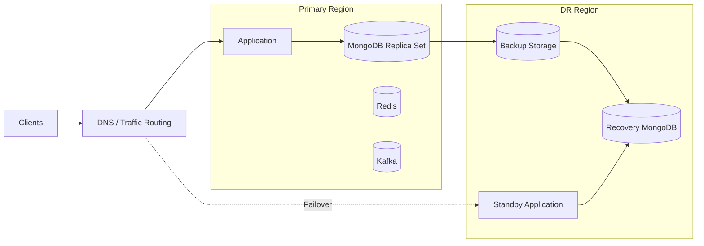

# 06- Disaster Recovery

## Overview

MongoDB disaster recovery (DR) is the capability to restore database and application services after a failure that exceeds the scope of normal high-availability mechanisms.

High availability primarily addresses failures such as:

- Primary node failure
- Instance failure
- Availability-zone failure
- Temporary network disruption

Disaster recovery addresses larger failures such as:

- Region failure
- Complete cluster loss
- Corrupted data
- Accidental deletion
- Ransomware or destructive access
- Backup-region failure
- Infrastructure misconfiguration
- Human error
- Application-driven data corruption

A production MongoDB DR strategy should answer five questions:

| Question | Example |
|---|---|
| What can fail? | Region, cluster, credentials, data |
| Where is the recoverable copy? | Another region or provider |
| How far back can we recover? | 30 days or 7 days of PITR |
| How quickly can we recover? | 60-minute RTO |
| How do we prove recovery works? | Automated restore and DR drills |

The fundamental distinction is:

```text
High Availability
    ↓
Keep the service running during expected infrastructure failures

Disaster Recovery
    ↓
Restore service after a major loss or unrecoverable failure
```

## Disaster Recovery vs High Availability

These concepts complement each other but solve different problems.

| Capability | High Availability | Disaster Recovery |
|---|---|---|
| Primary node failure | Yes | Not primarily |
| Replica failover | Yes | No |
| Availability-zone failure | Usually | Yes |
| Region failure | Limited | Yes |
| Accidental deletion | No | Yes |
| Corrupted data | No | Yes |
| Point-in-time recovery | No | Yes |
| Backup restoration | Not required for normal failover | Core mechanism |
| RPO planning | Relevant | Critical |
| RTO planning | Relevant | Critical |
| Recovery drills | Useful | Mandatory for mature systems |

A three-member replica set can provide strong availability while still being insufficient for a regional disaster if every member is deployed in the same region.

## RPO and RTO

Two measurements drive disaster recovery architecture.

### Recovery Point Objective

RPO defines how much recent data the business can afford to lose.

```text
Failure
   ↓
Latest recoverable state
   ↓
<------ RPO ------>
```

For example:

```text
Failure occurs:          14:00
Latest recoverable data: 13:50

Measured RPO:            10 minutes
```

If the business requires a 5-minute RPO, this architecture does not satisfy the requirement.

### Recovery Time Objective

RTO defines how long the service can remain unavailable.

```text
Failure
   ↓
Detection
   ↓
Provisioning
   ↓
Restore
   ↓
Validation
   ↓
Application startup
   ↓
Traffic restoration
```

Example:

```text
Failure:        14:00
Service ready:  14:42

Measured RTO:   42 minutes
```

### RPO and RTO Together

| Requirement | Architecture implication |
|---|---|
| Low RPO | Frequent backups, replication, or PITR |
| Very low RTO | Pre-provisioned infrastructure and automation |
| Low RPO + low RTO | More complex and expensive architecture |
| High RPO + high RTO | Simpler backup-based recovery may be sufficient |

RPO and RTO should be business requirements rather than arbitrary infrastructure targets.

## Disaster Recovery Architecture

A common production architecture is:



The exact architecture depends on RPO, RTO, workload size, compliance requirements, and budget.

## MongoDB DR Building Blocks

A robust DR strategy usually combines several mechanisms:

- Replica sets
- Backups
- Point-in-time recovery
- Off-site backup storage
- Cross-region infrastructure
- Infrastructure as Code
- Application deployment automation
- Secret management
- DNS or traffic management
- Restore validation
- Recovery runbooks
- Regular DR exercises

No single component provides complete disaster recovery.

## Backup Strategy

Backups are the foundation of most MongoDB DR architectures.

Possible backup mechanisms include:

| Backup type | Typical purpose |
|---|---|
| Logical backup | Selective restore, migration |
| Physical backup | Large-scale recovery |
| Managed backup | Operational simplicity |
| Snapshot | Fast infrastructure-level recovery |
| Point-in-time backup | Recovery from accidental or corrupted changes |

Logical backups can be created with MongoDB Database Tools:

```bash
mongodump \
  --uri="$MONGODB_URI" \
  --archive="/backup/mongodb.archive.gz" \
  --gzip
```

Restore:

```bash
mongorestore \
  --uri="$RECOVERY_MONGODB_URI" \
  --archive="/backup/mongodb.archive.gz" \
  --gzip
```

For large production systems, recovery strategy should be designed around the expected dataset size and RTO rather than assuming `mongodump` is always sufficient.

## Off-Site Backup Storage

A production backup should not depend on the infrastructure it is designed to recover from.

Weak architecture:

```text
MongoDB
   ↓
Backup
   ↓
Same server
```

If the server is lost, both database and backup may be lost.

A stronger design is:

```text
MongoDB
   ↓
Backup
   ↓
Object Storage
   ↓
Separate Region
```

For AWS environments, object storage such as Amazon S3 is commonly used for backup retention.

Example:

```bash
aws s3 cp \
  /backup/mongodb.archive.gz \
  s3://company-mongodb-backups/production/
```

Production implementations should also consider:

- Encryption
- Versioning
- Lifecycle policies
- Restricted IAM access
- Cross-region replication where appropriate
- Object lock or immutability requirements
- Backup deletion protection
- Audit logging

## Backup Isolation

Backup credentials should not have unrestricted production access.

A compromise of the production MongoDB environment should not automatically provide the ability to delete every backup.

A stronger model is:

```text
Production Identity
        │
        └── Write backup
                 ↓
          Backup Storage
                 │
        Restricted deletion
                 ↓
          Recovery Identity
```

Separate identities and permissions reduce blast radius.

## Point-in-Time Recovery

Point-in-time recovery (PITR) allows recovery to a specific point within an available recovery window.

Conceptually:

```text
Base Backup
     +
Historical Change Data
     ↓
Target Timestamp
     ↓
Recovered MongoDB State
```

For example:

```text
Base backup:       01:00
Corruption starts: 10:15
Target recovery:   10:14:59
```

PITR is especially valuable for:

- Accidental deletes
- Application bugs
- Incorrect bulk updates
- Corrupted writes
- Human mistakes

It is different from simply restoring the latest backup.

## Oplog and Recovery

MongoDB replica sets maintain an operation log (oplog) used for replication.

The oplog is bounded, so its available history depends on workload and configuration.

Conceptually:

```text
Base Backup
    ↓
Oplog History
    ↓
Target Timestamp
    ↓
Recovered State
```

The effective recovery window should be monitored rather than assumed.

A high-write workload can consume oplog history faster than a low-write workload.

## Cross-Region Recovery

For regional disaster scenarios, the recovery environment should exist independently of the primary region.

Possible architecture:

```text
Region A
┌─────────────────────────┐
│ Application             │
│ MongoDB                 │
│ Backup Pipeline         │
└────────────┬────────────┘
             │
             │ Backup / Replication
             ▼
Region B
┌─────────────────────────┐
│ Recovery Infrastructure │
│ MongoDB                 │
│ Application             │
└─────────────────────────┘
```

Cross-region recovery improves regional resilience but introduces:

- Network cost
- Data transfer cost
- Operational complexity
- Replication or backup lag
- Security configuration
- DNS/traffic failover requirements

## DR Architecture Patterns

### Backup and Restore

The simplest DR architecture is:

```text
Primary
   ↓
Backups
   ↓
DR Infrastructure
   ↓
Restore
   ↓
Application Startup
```

Characteristics:

| Property | Assessment |
|---|---|
| Cost | Lower |
| RTO | Higher |
| RPO | Depends on backup frequency/PITR |
| Complexity | Lower |
| Automation | Strongly recommended |

This is suitable when recovery can take minutes or hours.

### Pilot Light

Core recovery components are kept ready while most application infrastructure is inactive.

```text
Primary Region
    ↓
Continuous/Frequent Backup
    ↓
DR Region
    ├── Minimal infrastructure
    ├── Recovery configuration
    └── Data recovery capability
```

During disaster:

```text
Scale Infrastructure
        ↓
Recover MongoDB
        ↓
Deploy Application
        ↓
Route Traffic
```

### Warm Standby

A partially operational environment exists in the DR region.

```text
Primary Region
    ↓
Production Traffic

DR Region
    ↓
Running Infrastructure
    ↓
Reduced Capacity
```

During disaster, the DR environment is scaled to production capacity.

This reduces RTO but costs more than backup-only recovery.

### Active/Passive

One region serves production while another is continuously prepared for failover.

```text
Region A
ACTIVE
   │
   └── MongoDB
       
Region B
PASSIVE
   │
   └── Recovery / Standby
```

Traffic switches to Region B during disaster.

### Active/Active

Both regions actively serve traffic.

This can reduce recovery time but significantly increases system complexity.

Consider:

- Data consistency
- Write routing
- Conflict handling
- Global latency
- Distributed transactions
- Session management
- Cache consistency
- Event processing

Active/active should not be selected merely because it appears more resilient.

## MongoDB Replica Sets and DR

Replica sets provide redundancy inside a MongoDB deployment.

Typical topology:

```text
              ┌─────────────┐
              │   Primary   │
              └──────┬──────┘
                     │
              ┌──────┴──────┐
              │             │
        ┌─────▼─────┐ ┌─────▼─────┐
        │ Secondary │ │ Secondary │
        └───────────┘ └───────────┘
```

A replica set can tolerate certain node and availability-zone failures.

However:

```text
Replica Set
     ≠
Complete Disaster Recovery
```

If all members are lost or the dataset is corrupted, replication can reproduce the corruption rather than provide a clean historical recovery point.

## Cross-Region Replica Sets

A replica-set member can be placed in another region where architecture and operational requirements permit it.

Potential benefits:

- Additional failure-domain separation
- Faster recovery in some scenarios
- Reduced dependency on backup restoration

Potential problems:

- Inter-region latency
- Network partitions
- Election behavior
- Write latency implications
- Data transfer cost
- Operational complexity

Do not place replica-set members across regions without understanding the effect on election and write behavior.

## Backup vs Replication

Replication and backup solve different problems.

| Scenario | Replication | Backup/PITR |
|---|---:|---:|
| Primary node failure | Strong | Not primary mechanism |
| AZ failure | Strong | Yes |
| Accidental delete | No | Strong |
| Application corruption | No | Strong |
| Malicious update | No | Strong |
| Region loss | Depends on topology | Strong |
| Historical recovery | No | Strong |
| Fast failover | Strong | Usually slower |

A mature architecture uses both.

## Application Dependencies

MongoDB is rarely the only component required to restore an application.

A backend system might contain:

```text
                    ┌── MongoDB
                    │
Client → Nginx → FastAPI
                    │
                    ├── Redis
                    │
                    ├── Kafka
                    │
                    ├── Celery
                    │
                    └── External APIs
```

DR planning must identify the recovery requirements of each dependency.

| Component | DR question |
|---|---|
| MongoDB | How is persistent state recovered? |
| Redis | Can cache/state be rebuilt? |
| Kafka | Where are events and offsets recovered from? |
| Celery | Which tasks must be replayed or suppressed? |
| PostgreSQL | Is it independently recoverable? |
| Object storage | Is data replicated? |
| Secrets | Can credentials be recreated? |
| DNS | How is traffic redirected? |
| Kubernetes | Can workloads be recreated? |

## Stateless Application Recovery

Applications should ideally be deployable from source control and configuration rather than from a manually maintained server.

Example:

```text
Git Repository
     ↓
CI/CD
     ↓
Container Image
     ↓
DR Kubernetes Cluster
     ↓
FastAPI / Django
```

A recovery environment should not depend on manually copying application files from the failed production environment.

## Infrastructure as Code

Terraform, CloudFormation, or similar infrastructure-as-code systems can reduce recovery time.

For example:

```text
Terraform
   ├── Network
   ├── Security Groups
   ├── IAM
   ├── Kubernetes
   ├── Load Balancer
   └── Supporting Services
```

The goal is reproducibility.

```bash
terraform plan
terraform apply
```

DR automation should still be tested in an isolated environment before being trusted during an incident.

## Kubernetes and MongoDB DR

When MongoDB is used with Kubernetes, distinguish between:

- Kubernetes workload recovery
- MongoDB data recovery

Recreating a MongoDB Pod does not automatically recover lost persistent data.

A DR architecture might be:

```text
DR Kubernetes Cluster
        │
        ├── MongoDB Recovery Storage
        ├── FastAPI/Django
        ├── Celery
        └── Nginx/Ingress
```

Persistent storage and database recovery should be handled explicitly.

For production MongoDB deployments, managed MongoDB services or dedicated MongoDB operational tooling may be preferable to treating MongoDB as an ordinary stateless Kubernetes workload.

## DNS and Traffic Failover

Once the DR application is ready, traffic must be directed to it.

Typical flow:

```text
Client
  ↓
DNS / Global Traffic Layer
  ↓
Primary Region
```

During disaster:

```text
Client
  ↓
DNS / Global Traffic Layer
  ↓
DR Region
```

DNS failover has propagation and caching implications.

For low RTO systems, use traffic-management mechanisms designed around the required failover characteristics rather than assuming a DNS record change is instantaneous.

## Secrets and Configuration

A recovered application still needs:

- MongoDB credentials
- TLS certificates
- API keys
- OAuth credentials
- Kafka credentials
- Redis credentials
- Encryption keys
- Application configuration

Secrets should be stored in an appropriate secret-management system rather than only inside the failed production infrastructure.

Examples include:

- AWS Secrets Manager
- AWS Systems Manager Parameter Store
- Kubernetes Secrets backed by appropriate secret-management controls
- Dedicated enterprise secret managers

## Encryption During Recovery

Recovery environments should preserve encryption controls.

Validate:

```text
Backup
 ↓
Encrypted Storage
 ↓
Secure Transfer
 ↓
Encrypted Recovery Storage
 ↓
TLS
 ↓
Application
```

Do not disable TLS or encryption merely to simplify a DR exercise.

## Backup Validation in DR

A DR strategy is incomplete without backup validation.

The recovery process should periodically test:

```text
Backup
  ↓
Retrieve
  ↓
Restore
  ↓
Validate
  ↓
Application Test
  ↓
Measure RPO/RTO
```

A backup that has never been restored should not be treated as proven recovery capability.

## DR Testing Strategy

A mature organization performs multiple types of exercises.

| Test | Purpose |
|---|---|
| Backup restore test | Verify backup recoverability |
| Component failure test | Validate individual failure handling |
| Region simulation | Validate regional recovery |
| Application recovery | Validate application deployment |
| Dependency recovery | Validate external services |
| Full DR drill | Validate end-to-end recovery |
| RTO measurement | Measure recovery speed |
| RPO measurement | Measure data loss window |

## DR Runbook

A practical runbook should contain:

### Detection

```text
1. Confirm incident.
2. Identify affected region/cluster.
3. Determine whether normal failover is sufficient.
4. Declare DR if required.
```

### Assessment

```text
1. Identify last healthy MongoDB state.
2. Identify latest valid backup.
3. Determine recovery target.
4. Estimate data loss.
5. Confirm DR infrastructure availability.
```

### Recovery

```text
1. Provision or activate DR infrastructure.
2. Retrieve the selected backup.
3. Restore MongoDB.
4. Apply PITR if required.
5. Validate database state.
6. Deploy application.
7. Validate application.
8. Disable unsafe background processing.
9. Route traffic.
10. Monitor recovery environment.
```

### Stabilization

```text
1. Confirm application health.
2. Monitor MongoDB metrics.
3. Monitor error rates.
4. Monitor replication or synchronization.
5. Validate critical business operations.
6. Document recovery state.
```

### Post-Recovery

```text
1. Preserve incident evidence.
2. Identify root causes.
3. Reconcile data.
4. Plan return to normal topology.
5. Review RPO/RTO.
6. Update the DR runbook.
```

## Data Reconciliation

After a disaster, data may exist in multiple systems with different recovery points.

For example:

```text
MongoDB recovered to 10:00
Kafka contains events through 10:20
Redis contains cached state through 10:25
```

Blindly replaying everything can produce duplicates or inconsistent state.

Use:

- Idempotent operations
- Event identifiers
- Transaction boundaries
- Recovery timestamps
- Deduplication
- Explicit reconciliation procedures

## Idempotency During Recovery

Recovery operations should be safe to retry.

Example:

```python
def process_order_event(event: dict, collection) -> None:
    collection.update_one(
        {"event_id": event["event_id"]},
        {
            "$setOnInsert": {
                "event_id": event["event_id"],
                "order_id": event["order_id"],
                "status": event["status"],
            }
        },
        upsert=True,
    )
```

The exact implementation depends on the application, but the recovery principle is important:

```text
Retry
  ↓
Same event
  ↓
No unintended duplicate state
```

## Preventing Split-Brain Recovery

During a regional disaster, avoid accidentally running two independent production writers.

For example:

```text
Region A
   ↓
Still accepting writes

Region B
   ↓
Also accepting writes
```

This can create divergent state.

A DR procedure should explicitly define:

- Which region is authoritative
- How production traffic is stopped
- How write access is controlled
- When DR becomes active
- How the old region is fenced
- How data is reconciled

## Fencing

Fencing prevents the failed or isolated environment from continuing to modify production data.

Possible mechanisms include:

- Traffic removal
- Security-group changes
- Network isolation
- Credential revocation
- Application shutdown
- Load-balancer removal
- Explicit operational controls

The mechanism should be tested before it is needed during an incident.

## Monitoring During Recovery

Monitor both database and application layers.

### MongoDB

Monitor:

- Connection count
- Query latency
- Operation rates
- Storage usage
- Replication state
- Replication lag
- Oplog window
- CPU
- Memory
- Disk I/O
- Errors

### Application

Monitor:

- Request rate
- Error rate
- Latency
- HTTP status codes
- Queue depth
- Worker health
- Kafka consumer lag
- Redis errors

A recovered system is not healthy merely because the database responds to `ping`.

## DR Observability

Create explicit recovery metrics.

Example:

```text
dr_restore_duration_seconds
dr_validation_duration_seconds
dr_recovery_total_seconds
dr_backup_age_seconds
dr_recovery_point_timestamp
dr_validation_failures_total
```

These metrics make DR readiness measurable rather than subjective.

## Cost Considerations

DR architecture has a direct cost/reliability trade-off.

| Architecture | Relative cost | Typical recovery characteristics |
|---|---:|---|
| Backup and restore | Lower | Slower |
| Pilot light | Medium | Moderate |
| Warm standby | Higher | Faster |
| Active/passive | Higher | Fast |
| Active/active | Highest | Potentially very fast, but complex |

Cost also includes:

- Backup storage
- Cross-region transfer
- Standby infrastructure
- Monitoring
- Operational tooling
- DR testing
- Engineering maintenance

The cheapest architecture is not necessarily the cheapest business outcome if recovery failure has a high cost.

## Production Best Practices

- Define RPO and RTO with business stakeholders.
- Keep backups outside the primary failure domain.
- Use PITR where required.
- Encrypt backups.
- Restrict backup deletion permissions.
- Automate infrastructure recovery.
- Keep application deployment reproducible.
- Store secrets independently of the primary region.
- Validate backups through actual restores.
- Test application recovery, not just MongoDB recovery.
- Measure actual RPO and RTO.
- Document recovery procedures.
- Run regular DR exercises.
- Make recovery operations idempotent.
- Prevent split-brain writers.
- Monitor backup freshness and recovery capability.

## Common Mistakes

### Treating Replication as Backup

Replication can replicate accidental or malicious changes.

**Avoid it:** Maintain independent backups and historical recovery capability.

### Keeping Backups in the Same Failure Domain

A region-wide disaster can make both production and backups unavailable.

**Avoid it:** Store recoverable copies outside the primary failure domain.

### Never Testing Restore

A backup may be corrupt, incomplete, inaccessible, or operationally unusable.

**Avoid it:** Automate restore validation and perform periodic full recovery drills.

### Designing Only for MongoDB

The database may recover while the application remains unavailable.

**Avoid it:** Test the entire application dependency chain.

### Assuming DNS Failover Is Instant

DNS caching can delay traffic migration.

**Avoid it:** Choose a traffic-management strategy based on the required RTO.

### Running Both Regions as Writers

This can cause divergent data.

**Avoid it:** Define authoritative-region and fencing procedures.

### Ignoring Secrets

A recovered application cannot connect to MongoDB if credentials and certificates are unavailable.

**Avoid it:** Include secrets in the DR architecture.

### Ignoring Background Workers

Recovered Celery or Kafka consumers can replay work unexpectedly.

**Avoid it:** Explicitly control workers and event consumers during recovery.

### Using Manual Infrastructure

Manual provisioning increases recovery time and introduces operator error.

**Avoid it:** Use Infrastructure as Code and tested automation.

## Troubleshooting Methodology

### DR Restore Fails

```text
Symptom
↓
MongoDB cannot be restored in the DR environment
↓
Possible causes
├── Invalid backup
├── Corrupt artifact
├── Incompatible tooling
├── Missing credentials
├── Insufficient storage
├── Network failure
└── Recovery infrastructure failure
↓
Isolation strategy
├── Validate backup integrity
├── Test MongoDB connectivity
├── Validate storage capacity
├── Review restore logs
└── Test with another known-good backup
↓
Diagnostic commands
```

Connectivity:

```bash
mongosh "$RECOVERY_MONGODB_URI" \
  --eval 'db.runCommand({ ping: 1 })'
```

Artifact:

```bash
ls -lh /backup/mongodb.archive.gz
sha256sum /backup/mongodb.archive.gz
```

```text
Root cause
↓
Corrective action
↓
Restore from another valid recovery point if required
↓
Prevention
├── Automated restore tests
├── Backup validation
└── DR exercises
```

### MongoDB Recovers but Application Cannot Start

```text
Symptom
↓
Database is available but application remains unhealthy
↓
Possible causes
├── Missing secrets
├── Wrong connection string
├── Network restrictions
├── TLS configuration
├── Missing indexes
├── Schema incompatibility
├── Redis unavailable
└── Kafka unavailable
↓
Isolation strategy
├── Test MongoDB directly
├── Test application connectivity
├── Test dependencies individually
└── Run application smoke tests
↓
Root cause
↓
Corrective action
↓
Prevention
├── End-to-end DR tests
└── Automated environment validation
```

### Both Regions Accept Writes

```text
Symptom
↓
Primary and DR environments both process writes
↓
Possible causes
├── Traffic routing failure
├── Missing fencing
├── DNS propagation
└── Manual failover error
↓
Isolation strategy
├── Identify active writers
├── Stop non-authoritative writers
├── Inspect application traffic
└── Determine divergent data
↓
Root cause
↓
Corrective action
├── Fence old environment
├── Establish authoritative region
└── Reconcile data
↓
Prevention
├── Tested failover automation
└── Explicit fencing procedure
```

## Production DR Checklist

### Recovery Objectives

- [ ] RPO is documented.
- [ ] RTO is documented.
- [ ] Recovery dependencies are documented.
- [ ] Recovery ownership is defined.

### MongoDB

- [ ] Replica-set architecture is documented.
- [ ] Backups are enabled.
- [ ] PITR is configured where required.
- [ ] Backup retention is appropriate.
- [ ] Backup storage is outside the primary failure domain.
- [ ] Recovery credentials are available.
- [ ] Restore procedures are tested.

### Infrastructure

- [ ] DR infrastructure can be provisioned.
- [ ] Infrastructure is reproducible.
- [ ] Network configuration is documented.
- [ ] Security controls are available.
- [ ] TLS certificates can be recovered.
- [ ] Secrets can be recovered.

### Application

- [ ] Application deployment is reproducible.
- [ ] FastAPI/Django services can start.
- [ ] Celery workers are controlled.
- [ ] Kafka consumers are controlled.
- [ ] Redis recovery strategy is documented.
- [ ] External dependencies are documented.

### Operations

- [ ] DR runbook exists.
- [ ] Traffic failover is documented.
- [ ] Fencing is documented.
- [ ] Recovery validation is automated.
- [ ] RPO is measured.
- [ ] RTO is measured.
- [ ] DR drills are performed.
- [ ] Post-recovery reconciliation is documented.

## Interview Traps

### Is a Replica Set a Disaster Recovery Strategy?

Not by itself.

A replica set provides high availability and redundancy, but it does not replace independent backups or historical recovery.

### Why Can Replication Fail to Protect Against Data Corruption?

Because destructive or corrupted writes can be replicated to secondaries.

Backups and PITR provide historical recovery points that replication alone does not provide.

### What Determines RPO?

The amount of recent data the organization is willing to lose. Backup frequency, replication architecture, PITR, and recovery mechanisms determine the achievable RPO.

### What Determines RTO?

The time required to detect the failure, provision or activate infrastructure, recover data, validate it, deploy the application, and restore traffic.

### Why Is Cross-Region Backup Important?

A regional failure can make both the production database and local backup storage unavailable. An independent recovery location reduces this shared failure domain.

### Why Is DR Testing Important?

Because recovery depends on more than having backup files. Credentials, networking, infrastructure, application configuration, dependencies, data validation, and operational procedures can all fail independently.

### What Is the Difference Between Backup Validation and DR Testing?

Backup validation proves that a backup can be recovered and used. DR testing validates the broader system recovery process, including infrastructure, MongoDB, application services, dependencies, traffic management, and recovery objectives.

## Key Takeaways

- **High availability and disaster recovery solve different failure classes; MongoDB replica sets should complement, not replace, independent backups and historical recovery.**
- **RPO and RTO are the primary design constraints for MongoDB DR and should be measured through actual recovery exercises rather than assumed from architecture diagrams.**
- **A production DR design must recover the complete backend system, including MongoDB, application services, secrets, networking, workers, event systems, and traffic routing.**
- **Cross-region backups, PITR, isolated recovery infrastructure, least-privilege backup access, and tested restore procedures reduce the impact of regional, operational, and data-corruption failures.**
- **Regular DR drills, automated validation, fencing, idempotent recovery operations, and documented runbooks turn disaster recovery from a theoretical capability into an operational one.**