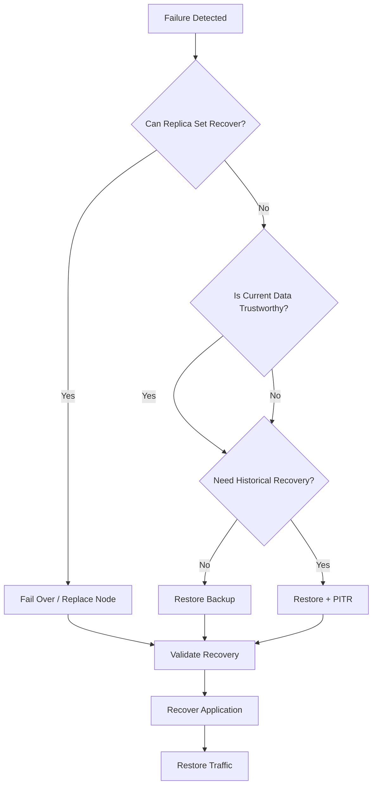
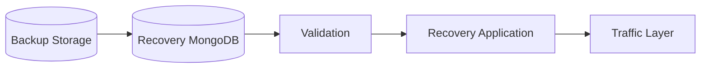

# 07- Recovery Procedures

## Overview

MongoDB recovery procedures define the operational steps used to restore database availability and data after failure, corruption, accidental deletion, or disaster.

A recovery procedure is different from a backup strategy. A backup strategy defines how recoverable data is created and retained; a recovery procedure defines exactly how that data is turned back into a functioning production system.

A production recovery process should be:

- Documented
- Repeatable
- Tested
- Observable
- Idempotent where possible
- Secured
- Time-bounded
- Compatible with the application's recovery requirements

The core recovery lifecycle is:

```text
Incident
   ↓
Assess Failure
   ↓
Select Recovery Strategy
   ↓
Select Recovery Point
   ↓
Protect/Fence Existing Environment
   ↓
Provision Recovery Environment
   ↓
Restore MongoDB
   ↓
Validate Data
   ↓
Recover Application Dependencies
   ↓
Validate Application
   ↓
Route Traffic
   ↓
Monitor and Stabilize
   ↓
Reconcile Data
```

## Recovery Scenarios

Different failures require different recovery procedures.

| Scenario | Typical recovery mechanism |
|---|---|
| Primary node failure | Replica-set election |
| Secondary failure | Replace/resync secondary |
| Availability-zone failure | Replica-set failover |
| Accidental document deletion | PITR or backup restore |
| Application-driven corruption | PITR |
| Collection deletion | Backup/PITR |
| Database corruption | Backup/PITR or managed recovery |
| Instance loss | Replica replacement or restore |
| Region failure | Cross-region DR |
| Complete cluster loss | Backup restore |
| Ransomware/destructive access | Isolated backup recovery |
| Configuration failure | Rebuild and restore |
| Bad deployment | Application rollback plus database assessment |

The first recovery decision should therefore be:

```text
What failed?
   ↓
Is the current MongoDB data trustworthy?
   ↓
Can normal HA recover the service?
   ↓
If not, which recovery point is required?
```

## Recovery Decision Tree



## Recovery Principles

### Preserve the Evidence

Do not immediately modify or destroy the failed environment.

Before destructive recovery actions:

- Record incident timestamps.
- Record MongoDB topology.
- Preserve relevant logs.
- Identify the last known healthy state.
- Capture backup metadata.
- Record current replication state.
- Preserve audit information.
- Document the operator performing each action.

This is particularly important when the incident involves data corruption or security compromise.

### Establish an Authoritative Recovery Point

Recovery should explicitly identify the state being restored.

For example:

```text
Target recovery point:
2026-09-22 10:14:59 UTC
```

Do not allow different operators or services to independently choose recovery points.

### Protect Against Split-Brain

Before activating a recovered environment, ensure the failed environment cannot continue accepting writes.

```text
Old Region
   ↓
Fence Writes
   ↓
Recover DR Region
   ↓
Validate
   ↓
Enable Traffic
```

## Recovery Roles

For production incidents, recovery responsibilities should be explicit.

| Role | Responsibility |
|---|---|
| Incident commander | Coordinates recovery |
| Database engineer | MongoDB recovery |
| Backend engineer | Application validation |
| Infrastructure engineer | Network and compute recovery |
| Security engineer | Credentials and security controls |
| Application owner | Business validation |
| Communications owner | Incident communication |

A single person may perform multiple roles in smaller teams, but ownership should still be explicit.

## Initial Incident Assessment

Before beginning recovery, collect:

```text
Incident start time
Current MongoDB topology
Current application state
Last known healthy timestamp
Last successful backup
Available PITR window
Current oplog window
Affected infrastructure
Affected region
Application dependencies
RPO
RTO
```

Example:

```text
Failure detected:          14:05 UTC
Last healthy state:        14:02 UTC
Latest backup:             13:00 UTC
PITR window:               30 days
Required RPO:              15 minutes
Required RTO:              60 minutes
```

The recovery point should normally be selected based on the failure and business requirements rather than simply choosing the newest backup.

## Normal Replica Set Failover

Not every MongoDB failure requires a restore.

If the primary fails and secondaries are healthy, the replica set can elect another primary.

Check status:

```javascript
rs.status()
```

Inspect the current connection:

```javascript
db.hello()
```

The expected recovery path is:

```text
Primary Failure
      ↓
Replica Set Detects Failure
      ↓
Election
      ↓
New Primary
      ↓
Application Driver Discovers New Primary
      ↓
Traffic Resumes
```

Modern MongoDB drivers are designed to handle replica-set topology changes when configured correctly.

Do not restore from backup merely because a primary instance failed.

## Replica Set Recovery Procedure

Use this procedure when the dataset remains trusted and the problem is isolated to a member.

### Assess

```javascript
rs.status()
rs.conf()
db.hello()
```

Inspect:

- Primary
- Secondaries
- Member states
- Health
- Replication lag
- Election state

### Determine the Failure

Possible causes:

- Instance failure
- Network failure
- Storage failure
- Process failure
- Availability-zone outage
- Configuration error

### Recover the Member

Depending on the failure:

```text
Restart
   ↓
Repair Infrastructure
   ↓
Resync
   ↓
Validate Secondary
   ↓
Return to Normal Topology
```

Do not rebuild a healthy member unnecessarily.

## Accidental Document Deletion

For accidental deletion, the recovery strategy depends on the availability of PITR and the scope of the incident.

Example:

```text
10:00   Healthy
10:15   Accidental delete
10:20   Incident detected
```

If PITR is available:

```text
Backup
  +
Historical Changes
  ↓
Recover to 10:14:59
```

If PITR is unavailable:

```text
Restore Latest Valid Backup
       ↓
Recover Missing Changes From Other Sources
       ↓
Reconcile
```

Restoring an entire production database may be unnecessary for a small deletion.

A safer pattern can be:

```text
Production
    │
    ▼
Temporary Recovery Database
    │
    ▼
Extract Required Documents
    │
    ▼
Validate
    │
    ▼
Controlled Production Restore
```

## Collection-Level Recovery

If a collection was accidentally dropped, avoid immediately restoring over production.

Instead:

```text
Backup
  ↓
Temporary MongoDB
  ↓
Restore Collection
  ↓
Validate
  ↓
Export Required Data
  ↓
Controlled Restore
```

Example:

```bash
mongorestore \
  --uri="$RECOVERY_MONGODB_URI" \
  --nsInclude="app.orders" \
  --archive="/backup/app.archive.gz" \
  --gzip
```

The exact recovery command depends on the backup format and namespace structure.

## Full Database Recovery

Use full recovery when:

- The database is corrupted.
- Multiple collections are affected.
- The cluster is lost.
- The recovery point is known and broad restoration is safer.
- The production environment cannot be trusted.

A typical process is:

```text
Select Recovery Point
        ↓
Provision Clean MongoDB
        ↓
Restore Backup
        ↓
Apply PITR if required
        ↓
Validate
        ↓
Recover Application
        ↓
Route Traffic
```

## Recovery Environment

A clean recovery environment should be isolated from the failed environment.

Example:



The recovery environment may be:

- A dedicated MongoDB cluster
- MongoDB Atlas recovery infrastructure
- A temporary cloud deployment
- A standby region
- A controlled Kubernetes environment

## Provisioning Recovery Infrastructure

Infrastructure should preferably be reproducible.

Typical components include:

```text
Network
Security Controls
MongoDB
Storage
Secrets
Application
Load Balancer
Monitoring
DNS / Traffic Management
```

For Infrastructure as Code:

```bash
terraform plan
terraform apply
```

Do not improvise infrastructure manually during a high-pressure incident unless the recovery procedure explicitly requires it.

## Restoring With `mongorestore`

For a directory backup:

```bash
mongorestore \
  --uri="$RECOVERY_MONGODB_URI" \
  /backup/mongodb
```

For an archive:

```bash
mongorestore \
  --uri="$RECOVERY_MONGODB_URI" \
  --archive="/backup/mongodb.archive" \
  --gzip
```

For a specific namespace:

```bash
mongorestore \
  --uri="$RECOVERY_MONGODB_URI" \
  --nsInclude="app.orders" \
  --archive="/backup/mongodb.archive.gz" \
  --gzip
```

Use `--drop` cautiously. It can destroy existing data in the target collections.

A production recovery environment should normally start from a known clean state rather than relying on destructive restore flags to clean an uncertain database.

## Restore Authentication

Recovery credentials should be prepared before a disaster.

Example:

```bash
mongorestore \
  --uri="$RECOVERY_MONGODB_URI" \
  --archive="/backup/mongodb.archive.gz" \
  --gzip
```

Where the URI is provided securely through a secret-management system.

Avoid placing credentials directly in shell history:

```bash
mongorestore \
  --username admin \
  --password "production-password"
```

Prefer secure environment or secret injection mechanisms.

## TLS During Recovery

If MongoDB requires TLS, the recovery environment must have the necessary certificates and trust configuration.

Example:

```bash
mongorestore \
  --uri="$RECOVERY_MONGODB_URI" \
  --tls \
  --tlsCAFile="/etc/mongodb/ca.pem" \
  --archive="/backup/mongodb.archive.gz" \
  --gzip
```

Recovery procedures should not disable TLS merely because the environment is temporary.

## Point-in-Time Recovery Procedure

PITR recovery requires:

1. A valid base backup.
2. Historical operation data covering the desired recovery point.
3. A target timestamp.
4. A controlled restore environment.
5. Validation after recovery.

Conceptually:

```text
Base Backup
    ↓
Restore
    ↓
Historical Operations
    ↓
Target Timestamp
    ↓
Recovered Database
```

Example recovery target:

```text
2026-09-22T10:14:59Z
```

The exact PITR mechanism depends on whether MongoDB Atlas, MongoDB tooling, or another backup platform is being used.

## Selecting a PITR Target

Suppose:

```text
10:00  Healthy
10:10  Application deployment
10:15  Bad migration
10:17  Corruption begins
10:30  Incident detected
```

Recovering to 10:29 would preserve corrupted state.

A better target may be:

```text
10:14:59
```

The target should be the latest known-good point before the destructive operation.

## PITR Validation

After PITR:

```text
Recovered State
      ↓
Validate Critical Collections
      ↓
Validate Critical Documents
      ↓
Validate Indexes
      ↓
Validate Queries
      ↓
Validate Application
```

Do not route production traffic immediately after a successful database restore.

## Recovery From Application Corruption

Application bugs can write syntactically valid but semantically incorrect data.

Example:

```text
Deployment
   ↓
Buggy update
   ↓
Millions of incorrect documents
   ↓
Replication
   ↓
All replicas contain bad state
```

The correct response is often historical recovery rather than replica failover.

Use:

```text
Identify corruption start
        ↓
Identify last known-good state
        ↓
Recover to that timestamp
        ↓
Validate
        ↓
Deploy fixed application
        ↓
Resume traffic
```

## Schema Migration Recovery

Schema migrations require special care.

Example:

```text
Migration
   ↓
Transforms millions of documents
   ↓
Application deployment
   ↓
Bug discovered
```

If the migration is destructive, rollback may require data recovery rather than code rollback.

Therefore production migrations should consider:

- Backward compatibility
- Expand-and-contract patterns
- Batch processing
- Idempotency
- Migration checkpoints
- Backup before destructive changes
- PITR availability
- Validation

## Recovering the Application

MongoDB recovery alone is not sufficient.

Application recovery should follow:

```text
MongoDB Ready
     ↓
Secrets Available
     ↓
Application Deployed
     ↓
Configuration Validated
     ↓
Health Checks
     ↓
Smoke Tests
     ↓
Workers Enabled
     ↓
Traffic Enabled
```

For FastAPI or Django, validate:

- Database connectivity
- Authentication
- Critical reads
- Critical writes
- Transactions
- Background tasks
- External integrations

## Recovery With FastAPI

A recovery smoke test can call critical endpoints:

```python
import requests

base_url = "https://recovery-api.internal"

health = requests.get(
    f"{base_url}/health",
    timeout=10,
)
health.raise_for_status()

order = requests.get(
    f"{base_url}/api/orders/ORD-2026-000123",
    timeout=10,
)
order.raise_for_status()
```

Production recovery tests should use controlled test operations rather than blindly creating production-like side effects.

## Recovery With Django

For Django services, validate:

```text
Django Application
      ↓
Configuration
      ↓
MongoDB Connection
      ↓
Repository / Service Layer
      ↓
Critical API
      ↓
Background Tasks
```

Do not assume that restoring MongoDB makes Django immediately operational.

Validate:

- Settings
- Environment variables
- Credentials
- Database connectivity
- Serialization
- Critical queries
- Workers
- Scheduled tasks

## Background Worker Recovery

Workers can cause unintended writes during recovery.

Example:

```text
Recovered MongoDB
       ↑
Celery Worker
       ↑
Old queued task
```

The task may have been generated before the disaster and may no longer be safe to execute.

Before enabling workers:

- Determine which tasks are safe.
- Inspect queue state.
- Decide whether tasks should be replayed.
- Verify idempotency.
- Prevent duplicate processing.

## Kafka Recovery

Kafka introduces another recovery dimension.

Suppose:

```text
MongoDB recovered to 10:00
Kafka contains events through 10:20
```

Replaying events from Kafka may reapply changes already present in the recovered MongoDB state.

Recovery should therefore define:

- Kafka recovery point
- Consumer offsets
- Event IDs
- Deduplication
- Replay boundaries
- Idempotency
- Derived-state rebuilding

## Redis Recovery

If Redis is primarily a cache:

```text
MongoDB Recovery
      ↓
Redis Flush / Expiration
      ↓
Application Rebuilds Cache
```

Do not restore stale cache state over a newly recovered authoritative database unless Redis contains durable application state that is explicitly part of the recovery architecture.

## Traffic Restoration

Traffic should be enabled only after recovery validation.

Recommended flow:

```text
Database
   ↓
Database Validation
   ↓
Application Validation
   ↓
Dependency Validation
   ↓
Read-Only Smoke Test
   ↓
Controlled Traffic
   ↓
Full Traffic
```

A gradual traffic shift can reduce risk.

For example:

```text
0%
 ↓
5%
 ↓
25%
 ↓
50%
 ↓
100%
```

At each stage monitor:

- Error rate
- Latency
- Database load
- Connection usage
- Queue depth
- Business errors

## Read-Only Recovery

When possible, expose the recovered environment to controlled read-only validation before enabling writes.

This helps verify:

- Documents
- Queries
- Indexes
- Serialization
- API responses
- Authentication

without immediately creating new production state.

## Data Reconciliation

After recovery, compare systems that may have diverged.

Examples:

```text
MongoDB
Kafka
Redis
PostgreSQL
Search Index
Data Warehouse
External APIs
```

Reconciliation may involve:

- Document counts
- Event counts
- Business totals
- Missing IDs
- Duplicate IDs
- Timestamp ranges
- Status mismatches

Example:

```text
Orders in MongoDB:      10,000,000
Orders in search index: 9,998,400

Difference:             1,600
```

This should trigger controlled investigation rather than blind reindexing.

## Recovery Verification

A recovery should have explicit acceptance criteria.

Example:

| Check | Requirement |
|---|---|
| MongoDB available | Yes |
| Critical collections | Present |
| Critical records | Valid |
| Critical indexes | Present |
| API health | Passing |
| Critical API reads | Passing |
| Critical writes | Passing |
| Background workers | Controlled |
| Kafka consumers | Controlled |
| Error rate | Within threshold |
| RPO | Within target |
| RTO | Within target |

## Recovery Completion Criteria

Do not declare recovery complete merely because traffic is flowing.

Recovery should be considered complete when:

- MongoDB is healthy.
- Application health checks pass.
- Critical business operations pass.
- Dependencies are operational.
- Data validation is complete.
- Monitoring is active.
- Error rates are stable.
- Recovery objectives have been measured.
- Remaining reconciliation tasks are documented.
- Incident ownership transitions to normal operations.

## Recovery Monitoring

Immediately after recovery, increase monitoring sensitivity.

Monitor:

### MongoDB

```text
Connections
Query latency
Operation rate
CPU
Memory
Disk usage
Disk latency
Storage growth
Locks/contention
Replication
Oplog
Errors
```

### Application

```text
HTTP error rate
Latency
Throughput
Worker failures
Queue depth
Kafka consumer lag
Redis errors
External API failures
```

### Business

```text
Order creation
Payment processing
Customer operations
Critical workflow success
Data reconciliation
```

## Security During Recovery

Recovery procedures often require elevated privileges.

Use:

- Temporary credentials where possible
- Least-privilege recovery roles
- MFA for human administrative access
- Secure secret injection
- TLS
- Network isolation
- Audit logging
- Restricted recovery environment access

Do not share production credentials through chat, tickets, shell history, or documentation.

## Recovery Environment Cleanup

Temporary recovery environments can contain production data.

After recovery:

```text
Recovery Complete
      ↓
Preserve Required Evidence
      ↓
Confirm Production State
      ↓
Export Required Logs
      ↓
Securely Destroy Temporary Data
      ↓
Revoke Temporary Credentials
```

Cleanup should be part of the recovery procedure rather than an optional manual task.

## Recovery Automation

Automate repeatable operations.

A recovery workflow might be:

```text
Trigger Recovery
      ↓
Provision Infrastructure
      ↓
Retrieve Backup
      ↓
Restore MongoDB
      ↓
Run Validation
      ↓
Deploy Application
      ↓
Run Smoke Tests
      ↓
Pause for Approval
      ↓
Switch Traffic
      ↓
Monitor
```

Human approval is appropriate before irreversible or production-impacting steps.

## Recovery Scripts

A recovery script should fail fast on unexpected conditions.

Example:

```bash
#!/usr/bin/env bash

set -euo pipefail

: "${RECOVERY_MONGODB_URI:?RECOVERY_MONGODB_URI is required}"
: "${BACKUP_FILE:?BACKUP_FILE is required}"

test -s "$BACKUP_FILE"

mongosh "$RECOVERY_MONGODB_URI" \
  --eval 'db.runCommand({ ping: 1 })'

mongorestore \
  --uri="$RECOVERY_MONGODB_URI" \
  --archive="$BACKUP_FILE" \
  --gzip

mongosh "$RECOVERY_MONGODB_URI" \
  --eval 'db.getSiblingDB("admin").runCommand({ ping: 1 })'

echo "Recovery restore completed"
```

A production implementation should add explicit validation and logging rather than treating command completion as sufficient.

## Idempotent Recovery Operations

Recovery procedures should be safe to retry whenever possible.

For example:

```text
Provision infrastructure
        ↓
Already exists?
        ├── Yes → Validate
        └── No  → Create
```

Similarly:

```text
Restore
  ↓
Validate target state
  ↓
Retry only if state is known
```

Blindly repeating destructive restore operations can make an incident worse.

## Rollback During Recovery

Recovery itself can fail.

For example:

```text
Restore
  ↓
Validation fails
  ↓
Do not route traffic
  ↓
Preserve recovery environment
  ↓
Investigate
  ↓
Select another recovery point
```

Do not continuously overwrite the recovery environment while investigating. Preserving the failed recovery attempt can provide useful diagnostic information.

## Recovery Runbook Structure

A production runbook should contain:

```text
Incident Trigger
↓
Preconditions
↓
Required Access
↓
Recovery Point Selection
↓
Fencing Procedure
↓
Infrastructure Provisioning
↓
Backup Retrieval
↓
MongoDB Restore
↓
PITR Procedure
↓
Database Validation
↓
Application Deployment
↓
Dependency Validation
↓
Traffic Failover
↓
Monitoring
↓
Reconciliation
↓
Cleanup
↓
Incident Closure
```

Every operational step should identify:

- Command or action
- Expected result
- Failure condition
- Rollback or alternative action
- Responsible role

## Common Mistakes

### Restoring Before Determining the Failure

An operator may restore a database when a normal replica-set failover would have solved the incident.

**Avoid it:** First determine whether the current data is healthy and whether HA can recover the service.

### Restoring Directly Over Production

This increases the risk of irreversible mistakes.

**Avoid it:** Restore into an isolated environment first whenever the incident allows.

### Choosing the Latest Backup Automatically

The latest backup may already contain corrupted data.

**Avoid it:** Identify the last known-good recovery point.

### Ignoring the Application

MongoDB can be recovered while the API remains broken.

**Avoid it:** Include application and dependency validation.

### Enabling Workers Too Early

Queued jobs can replay against partially recovered state.

**Avoid it:** Control Celery, Kafka consumers, and scheduled jobs until recovery is validated.

### Forgetting Indexes

Data restoration without required indexes can create severe performance degradation.

**Avoid it:** Validate critical indexes and representative queries.

### Using Production Credentials Everywhere

Recovery often requires elevated access, which increases credential exposure.

**Avoid it:** Use dedicated recovery identities and secret-management systems.

### Failing to Fence the Old Environment

Two production environments can accept writes simultaneously.

**Avoid it:** Define and test explicit fencing procedures.

### Treating Recovery as Complete When Traffic Returns

Traffic can flow while data reconciliation or dependency recovery is still incomplete.

**Avoid it:** Use explicit recovery acceptance criteria.

## Troubleshooting Methodology

### Restore Command Fails

```text
Symptom
↓
mongorestore fails
↓
Possible causes
├── Corrupt backup
├── Invalid URI
├── TLS failure
├── Authentication failure
├── Insufficient storage
├── Incompatible tooling
└── Network failure
↓
Isolation strategy
├── Validate artifact
├── Test MongoDB connectivity
├── Check storage
├── Check credentials
└── Review restore output
↓
Diagnostic commands
```

Connectivity:

```bash
mongosh "$RECOVERY_MONGODB_URI" \
  --eval 'db.runCommand({ ping: 1 })'
```

Artifact:

```bash
ls -lh "$BACKUP_FILE"
sha256sum "$BACKUP_FILE"
```

```text
Root cause
↓
Corrective action
↓
Retry using a known-good recovery point
↓
Prevention
├── Restore validation
├── Automated DR testing
└── Version compatibility checks
```

### Restored Database Has Missing Data

```text
Symptom
↓
Expected records are missing
↓
Possible causes
├── Wrong backup
├── Wrong recovery timestamp
├── Incomplete backup
├── Namespace filtering
├── Collection omitted
└── Data existed after selected recovery point
↓
Isolation strategy
├── Check backup metadata
├── Inspect collection list
├── Compare timestamps
├── Validate PITR window
└── Test another recovery point
↓
Diagnostic commands
```

```javascript
show dbs
show collections

db.orders.countDocuments()
db.orders.findOne()
```

```text
Root cause
↓
Corrective action
↓
Restore from correct recovery point
↓
Prevention
├── Recovery-point metadata
└── Automated restore validation
```

### Application Cannot Connect After Recovery

```text
Symptom
↓
MongoDB is healthy but application is unhealthy
↓
Possible causes
├── Wrong connection string
├── DNS failure
├── Network policy
├── TLS configuration
├── Credentials
├── Authentication database
└── Application configuration
↓
Isolation strategy
├── Test mongosh connectivity
├── Test application container
├── Verify secret injection
└── Check network path
↓
Root cause
↓
Corrective action
↓
Prevention
├── End-to-end recovery tests
└── Configuration validation
```

### Recovered System Has Duplicate Processing

```text
Symptom
↓
Events or background jobs are processed more than once
↓
Possible causes
├── Kafka replay
├── Celery retry
├── Consumer offset mismatch
├── Missing idempotency
└── Recovery after partial processing
↓
Isolation strategy
├── Stop consumers
├── Identify duplicate event IDs
├── Inspect offsets
└── Determine processing boundary
↓
Root cause
↓
Corrective action
├── Fence consumers
├── Deduplicate
└── Replay from controlled offset
↓
Prevention
├── Idempotent handlers
└── Explicit event recovery procedures
```

## Production Recovery Checklist

### Incident Assessment

- [ ] Incident start time recorded.
- [ ] Failure scope identified.
- [ ] Current MongoDB state assessed.
- [ ] Last known-good state identified.
- [ ] RPO identified.
- [ ] RTO identified.
- [ ] Recovery owner assigned.

### Recovery Point

- [ ] Recovery timestamp selected.
- [ ] Backup identified.
- [ ] PITR availability confirmed.
- [ ] Backup integrity validated.
- [ ] Recovery artifacts secured.

### Infrastructure

- [ ] Recovery environment available.
- [ ] Network configured.
- [ ] Security controls configured.
- [ ] Secrets available.
- [ ] Monitoring configured.

### MongoDB

- [ ] Restore completed.
- [ ] Collections validated.
- [ ] Critical records validated.
- [ ] Indexes validated.
- [ ] Query performance checked.
- [ ] Database health confirmed.

### Application

- [ ] FastAPI/Django services deployed.
- [ ] Database connectivity validated.
- [ ] Critical read paths validated.
- [ ] Critical write paths validated.
- [ ] Celery controlled and validated.
- [ ] Kafka consumers controlled and validated.
- [ ] Redis recovery strategy executed.

### Traffic

- [ ] Old environment fenced.
- [ ] Recovery environment validated.
- [ ] Traffic routing changed.
- [ ] Error rates monitored.
- [ ] Latency monitored.
- [ ] Business workflows validated.

### Completion

- [ ] RPO measured.
- [ ] RTO measured.
- [ ] Data reconciliation completed or tracked.
- [ ] Recovery evidence preserved.
- [ ] Temporary credentials revoked.
- [ ] Recovery environment cleaned up where appropriate.
- [ ] Incident review scheduled.

## Interview Traps

### Should You Always Restore From Backup When MongoDB Fails?

No.

If a replica-set member fails and the remaining topology is healthy, normal replica-set failover or member replacement is usually the appropriate recovery mechanism.

### What Is the First Question During Data Corruption?

Determine when corruption started and identify the latest known-good state.

This determines whether PITR or another historical recovery mechanism is required.

### Why Restore Into an Isolated Environment?

It allows data and application validation without immediately overwriting production state.

### Why Can Restoring the Database Still Leave the Application Broken?

The application also depends on networking, secrets, configuration, Redis, Kafka, external services, workers, and indexes.

### Why Must the Old Environment Be Fenced?

Without fencing, both old and recovered environments may accept writes, creating divergent data and potentially making reconciliation significantly harder.

### What Makes a Recovery Procedure Production-Ready?

It should be tested, automated where practical, observable, secured, repeatable, documented, and validated against actual RPO and RTO requirements.

## Key Takeaways

- **Choose the recovery mechanism based on the failure: replica-set failover for healthy-data infrastructure failures, and backup/PITR recovery when data itself cannot be trusted.**
- **Select an explicit last-known-good recovery point before restoring, and protect the existing environment from continued writes when activating a recovered system.**
- **Restore into an isolated environment whenever practical, then validate MongoDB, indexes, critical data, application services, workers, event systems, and dependencies before routing traffic.**
- **Make recovery procedures repeatable and observable through automation, Infrastructure as Code, secure credentials, validation checks, measured RPO/RTO, and documented runbooks.**
- **Treat traffic restoration as one stage of recovery rather than the finish line; reconciliation, monitoring, cleanup, and incident review are part of a complete recovery procedure.**