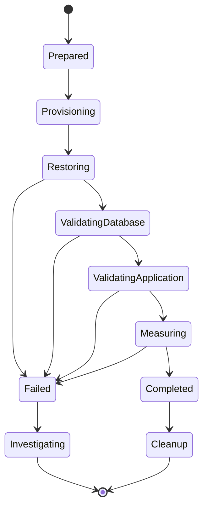

# 08- Recovery Testing

## Overview

MongoDB recovery testing verifies that the documented backup and disaster recovery architecture can actually restore usable database and application state.

A backup that exists but has never been restored is an unproven recovery capability.

Recovery testing should validate more than `mongorestore` success. A production-grade test should cover:

- Backup availability
- Backup integrity
- Restore correctness
- Database structure
- Critical data
- Indexes
- Query behavior
- Application connectivity
- Background workers
- Event processing
- Secrets and networking
- RPO
- RTO
- Operational procedures

The recovery testing lifecycle is:

```text
Select Recovery Scenario
        ↓
Select Backup / Recovery Point
        ↓
Provision Isolated Environment
        ↓
Restore MongoDB
        ↓
Validate Database
        ↓
Validate Application
        ↓
Validate Dependencies
        ↓
Measure RPO / RTO
        ↓
Record Evidence
        ↓
Destroy Test Environment
        ↓
Track Corrective Actions
```

## Why Recovery Testing Matters

Backup systems can fail in ways that are not visible during backup creation.

Examples include:

- Corrupted backup artifacts
- Incorrect backup retention
- Missing collections
- Missing indexes
- Invalid restore credentials
- Incompatible tooling
- Insufficient recovery storage
- Missing secrets
- Broken network configuration
- Incorrect application configuration
- Unrecoverable dependent systems
- Recovery procedures that take longer than the RTO

The important distinction is:

```text
Backup Created
      ≠
Backup Restorable
      ≠
Database Recoverable
      ≠
Application Recoverable
      ≠
Business Recoverable
```

Recovery testing progressively validates each layer.

## Recovery Testing Levels

| Level | What it validates | Typical frequency |
|---|---|---|
| Artifact check | Backup exists and is plausible | Every backup |
| Integrity check | Backup can be read | Every backup where practical |
| Database restore | MongoDB can be restored | Scheduled |
| Data validation | Recovered state is correct | Scheduled |
| Query validation | Critical queries work | Scheduled |
| Application validation | API/services work | Scheduled |
| Dependency validation | Redis/Kafka/workers work | Scheduled |
| Full DR drill | End-to-end recovery | Periodic |
| RPO/RTO measurement | Recovery objectives | Periodic |

A mature environment uses multiple levels rather than relying on a single large disaster recovery exercise.

## Recovery Test Types

### Automated Restore Test

The system automatically:

```text
Backup
  ↓
Temporary MongoDB
  ↓
Restore
  ↓
Validation
  ↓
Destroy
```

This provides frequent feedback with limited operational effort.

### Application Recovery Test

The restored MongoDB is connected to a recovered application environment.

```text
Backup
  ↓
MongoDB
  ↓
FastAPI / Django
  ↓
API Smoke Tests
```

This detects failures that a database-only restore test cannot detect.

### Full Disaster Recovery Exercise

A full exercise simulates a major production failure.

```text
Primary Region Failure
        ↓
DR Activation
        ↓
Infrastructure Recovery
        ↓
MongoDB Recovery
        ↓
Application Recovery
        ↓
Traffic Failover
        ↓
Business Validation
```

This provides the strongest evidence of operational readiness but is more expensive.

## Recovery Testing Architecture

A typical isolated test architecture is:


The recovery environment should be isolated from production.

## Recovery Test Environment

The test environment should reproduce the components that materially affect recovery.

Depending on the system, this may include:

- MongoDB
- FastAPI or Django
- Nginx
- Redis
- Kafka
- Celery
- Load balancer
- DNS
- Secrets
- TLS certificates
- Monitoring
- Network controls

Do not automatically reproduce every production component if it does not affect the recovery objective.

The environment should be representative enough to provide meaningful results without becoming unnecessarily expensive.

## Production Data Safety

Recovery tests may contain production data.

Treat the recovery environment as sensitive infrastructure.

Apply:

- Network isolation
- Encryption
- TLS
- Access control
- Secret management
- Audit logging
- Limited retention
- Secure cleanup

For non-production testing, consider:

- Masking
- Tokenization
- Synthetic data
- Restricted identities

Do not restore production data into an uncontrolled developer environment merely because it is convenient.

## Test Data Strategy

There are three common approaches.

| Strategy | Advantage | Limitation |
|---|---|---|
| Full production backup | Highest realism | Expensive and sensitive |
| Representative backup | Lower cost | May miss edge cases |
| Synthetic dataset | Safe and repeatable | Less realistic |

For recovery validation, real backup restoration is important because synthetic tests cannot validate the actual backup pipeline.

A practical strategy is:

```text
Frequent automated tests
        ↓
Representative or recent backup

Periodic full DR test
        ↓
Production-scale backup
```

## Recovery Test Preconditions

Before starting a test, record:

```text
Backup identifier
Backup timestamp
Database version
Backup size
Expected dataset size
Target recovery point
Required RPO
Required RTO
Recovery environment
Test owner
Test start time
```

Example:

| Property | Value |
|---|---|
| Backup | `prod-2026-09-22-0100` |
| Backup timestamp | 01:00 UTC |
| Target recovery point | 00:59:59 UTC |
| Required RPO | 15 minutes |
| Required RTO | 60 minutes |
| Environment | `mongodb-dr-test` |

## Recovery Test Lifecycle

A repeatable test should follow explicit phases.



## Phase: Preparation

Confirm:

- Backup exists
- Backup is within the intended recovery window
- Recovery credentials are available
- Target infrastructure is available
- Test owner is assigned
- Required validation tests are available

Do not begin a full recovery test without defining success criteria.

## Phase: Provisioning

Provision isolated infrastructure.

Example:

```text
Network
  ↓
Security Controls
  ↓
MongoDB
  ↓
Application
  ↓
Validation Tooling
```

Infrastructure as Code can make this reproducible.

```bash
terraform init
terraform plan
terraform apply
```

The exact commands depend on the organization's infrastructure.

## Phase: Backup Retrieval

Retrieve the selected backup from its durable storage.

Example:

```bash
aws s3 cp \
  s3://company-mongodb-backups/production/prod.archive.gz \
  ./prod.archive.gz
```

Validate:

```bash
test -s ./prod.archive.gz
sha256sum ./prod.archive.gz
```

Where checksums are part of the backup process, compare the retrieved checksum with the trusted backup metadata.

## Phase: MongoDB Restore

For an archive:

```bash
mongorestore \
  --uri="$RECOVERY_MONGODB_URI" \
  --archive="./prod.archive.gz" \
  --gzip
```

For a directory:

```bash
mongorestore \
  --uri="$RECOVERY_MONGODB_URI" \
  ./backup
```

The restore environment should normally be clean and isolated.

Avoid destructive options such as `--drop` unless the test specifically requires them and the target environment is known to be disposable.

## Measuring Restore Duration

Record:

```text
Restore start:
2026-09-22 01:10:00 UTC

Restore complete:
2026-09-22 01:42:00 UTC

Restore duration:
32 minutes
```

Restore duration is one of the most important inputs to RTO planning.

## Database Validation

After restore, verify database structure.

Example:

```javascript
show dbs
use app
show collections

db.users.countDocuments()
db.orders.countDocuments()
db.products.countDocuments()
```

Validate:

- Databases
- Collections
- Document counts
- Collection options
- Required metadata
- Critical records

Counts should be treated as evidence rather than absolute proof of correctness.

## Index Validation

Check critical collections:

```javascript
db.orders.getIndexes()
db.users.getIndexes()
db.products.getIndexes()
```

Validate:

- Index existence
- Key patterns
- Unique indexes
- Partial indexes
- TTL indexes
- Required compound indexes

A restored database without critical indexes can appear healthy while causing severe production performance problems.

## Query Validation

Run representative production queries.

Example:

```javascript
db.orders.find({
  customer_id: "customer-123",
  status: "completed"
})
.sort({
  created_at: -1
})
.limit(20)
```

Inspect important query plans:

```javascript
db.orders.find({
  customer_id: "customer-123",
  status: "completed"
})
.sort({
  created_at: -1
})
.limit(20)
.explain("executionStats")
```

Look for:

- Unexpected `COLLSCAN`
- Excessive `totalDocsExamined`
- Excessive `totalKeysExamined`
- Unexpected `SORT`
- High execution time

## Critical Data Validation

Critical records should be explicitly checked.

Example:

```javascript
db.orders.findOne({
  order_id: "ORD-2026-000123"
})
```

Validate business-critical fields such as:

- Identifiers
- Status
- Amount
- Customer relationship
- Timestamps
- Required nested data

For large datasets, combine deterministic sampling with aggregate validation.

## Data Sampling

A full document-by-document comparison may be impractical.

A practical strategy is:

```text
Collection Counts
       +
Critical Records
       +
Deterministic Samples
       +
Business Invariants
       +
Application Tests
```

For example:

```text
Orders
  ├── Total count
  ├── Date-range distribution
  ├── Critical order IDs
  ├── Deterministic sample
  └── Status distribution
```

The sampling method should be reproducible so that test results can be compared over time.

## Business Invariant Validation

Database structure does not guarantee business correctness.

Example:

```text
Order:
    amount >= 0
    status ∈ allowed values
    created_at <= updated_at
    customer_id exists
```

A Python validator:

```python
def validate_order(order: dict) -> None:
    if order["amount"] < 0:
        raise AssertionError("Negative order amount")

    valid_statuses = {
        "pending",
        "completed",
        "cancelled",
    }

    if order["status"] not in valid_statuses:
        raise AssertionError(
            f"Invalid order status: {order['status']}"
        )
```

Business invariants are especially important after PITR or corruption recovery.

## Aggregation Validation

Critical aggregation pipelines should be executed against the recovered database.

Example:

```javascript
db.orders.aggregate([
  {
    $match: {
      status: "completed"
    }
  },
  {
    $group: {
      _id: "$customer_id",
      total: {
        $sum: "$amount"
      }
    }
  }
])
```

Compare selected aggregate results against trusted production metrics where practical.

## Application Validation

A database restore is not complete until the application can use the recovered database.

Typical validation flow:

```text
Recovered MongoDB
      ↓
Repository
      ↓
Service Layer
      ↓
FastAPI / Django
      ↓
Nginx / Load Balancer
      ↓
HTTP Tests
```

Validate:

- Health endpoint
- Authentication
- Critical reads
- Critical writes
- Pagination
- Aggregations
- Error handling
- Transactions where applicable

## FastAPI Recovery Test

Example:

```python
import requests

BASE_URL = "https://recovery-api.internal"

response = requests.get(
    f"{BASE_URL}/health",
    timeout=10,
)
response.raise_for_status()

response = requests.get(
    f"{BASE_URL}/api/orders/ORD-2026-000123",
    timeout=10,
)
response.raise_for_status()
```

A production test suite should use controlled test data and avoid unintended side effects.

## Django Recovery Test

For Django applications, validate the service layer and API rather than assuming that MongoDB connectivity means the application is recovered.

Example test structure:

```text
Django startup
    ↓
Configuration
    ↓
MongoDB connection
    ↓
Repository
    ↓
Service layer
    ↓
API endpoint
    ↓
Business validation
```

Where MongoDB is accessed through PyMongo or an ODM/repository layer, the recovery test should exercise the same access path used by production.

## Background Worker Testing

Celery workers should be tested separately.

Validate:

- Worker starts
- MongoDB connection works
- Tasks can read recovered data
- Tasks can write safely
- Retry behavior is correct
- Duplicate execution is handled

Do not automatically execute the entire production task queue during a recovery test.

A safe test environment can use:

```text
Synthetic Queue
      ↓
Test Worker
      ↓
Recovery MongoDB
```

## Kafka Recovery Testing

If MongoDB participates in event-driven processing, test the event boundary explicitly.

Example:

```text
Kafka Event
    ↓
Consumer
    ↓
Idempotency Check
    ↓
MongoDB
```

Validate:

- Consumer connectivity
- Consumer offsets
- Event identifiers
- Duplicate handling
- Replay behavior
- Error handling
- Dead-letter behavior where applicable

Do not replay production Kafka traffic into a recovery environment without an explicit replay strategy.

## Redis Validation

When Redis is only a cache:

```text
MongoDB Recovery
      ↓
Application Starts
      ↓
Cache Miss
      ↓
MongoDB Read
      ↓
Redis Population
```

Validate that the application can rebuild the cache from MongoDB.

If Redis contains durable state, it must have its own recovery procedure and should be included in the DR test.

## Dependency Validation

Create a dependency matrix.

| Dependency | Recovery requirement | Test |
|---|---|---|
| MongoDB | Persistent state | Restore + queries |
| Redis | Cache/state | Read/write test |
| Kafka | Event processing | Consumer test |
| Celery | Background jobs | Controlled task |
| S3 | Backup access | Object retrieval |
| Secrets | Credentials | Secret resolution |
| DNS | Traffic routing | Controlled failover |
| Nginx | Request routing | HTTP smoke test |

This prevents MongoDB recovery from being treated as the entire system recovery.

## PITR Testing

PITR should be tested separately from ordinary backup restoration.

A useful test creates a known change sequence:

```text
T1
 ↓
Known-good state

T2
 ↓
Expected change

T3
 ↓
Known-good state

T4
 ↓
Intentional destructive change

T5
 ↓
Recovery target
```

Then recover to the point immediately before the destructive operation.

Example:

```text
10:00  Baseline
10:05  Insert test order
10:10  Update test order
10:15  Delete test order
10:20  Recovery test
```

Target:

```text
10:14:59
```

Validate that the deleted document exists in the recovered database while changes after the target timestamp do not.

## Recovery Testing With `mongodump`

Logical backup restoration can be tested using MongoDB Database Tools.

Create a test backup:

```bash
mongodump \
  --uri="$SOURCE_MONGODB_URI" \
  --archive="./test.archive.gz" \
  --gzip
```

Restore:

```bash
mongorestore \
  --uri="$RECOVERY_MONGODB_URI" \
  --archive="./test.archive.gz" \
  --gzip
```

Validate:

```bash
mongosh "$RECOVERY_MONGODB_URI" \
  --eval '
    const dbs = db.adminCommand({ listDatabases: 1 }).databases;
    printjson(dbs);
  '
```

For large production databases, full logical restores can be slow and resource-intensive, so test frequency should account for operational cost.

## Recovery Testing With Managed Backups

Managed MongoDB services can provide backup and restore capabilities that differ from self-managed Database Tools.

The recovery test should validate the actual production backup mechanism.

Do not test only:

```text
mongodump
```

if production recovery actually depends on:

```text
Managed Backup
   ↓
Managed Restore
   ↓
Recovery Cluster
```

The production recovery path is the path that needs validation.

## Recovery Testing in Kubernetes

For Kubernetes-based systems, test both:

```text
Infrastructure Recovery
        +
MongoDB Recovery
```

A test might validate:

```text
Terraform / CloudFormation
        ↓
Kubernetes Cluster
        ↓
Secrets
        ↓
MongoDB
        ↓
FastAPI / Django
        ↓
Validation
```

Do not assume that Kubernetes successfully recreating Pods means MongoDB data has been recovered.

## RPO Testing

RPO should be measured from the recovered data.

Suppose:

```text
Failure simulation:
14:00 UTC

Recovered latest valid state:
13:48 UTC
```

Then:

```text
Measured RPO = 12 minutes
```

Compare this with the requirement:

```text
Required RPO = 15 minutes
Measured RPO = 12 minutes
```

The test demonstrates the observed recovery point under the tested conditions.

## RTO Testing

Measure the complete recovery duration.

Example:

| Phase | Duration |
|---|---:|
| Detection | 5 min |
| Infrastructure provisioning | 8 min |
| Backup retrieval | 7 min |
| MongoDB restore | 25 min |
| Database validation | 5 min |
| Application deployment | 6 min |
| Smoke tests | 4 min |
| Traffic activation | 2 min |
| Total | 62 min |

If the required RTO is 60 minutes, the test has identified a gap.

Do not hide the gap by excluding inconvenient manual steps from the measurement.

## RTO Measurement Boundaries

Define the start and end points before testing.

Example:

```text
Start:
Confirmed production failure

End:
Critical application workflow successfully available
```

Avoid ambiguous measurements such as:

```text
MongoDB restore duration = 30 minutes
Therefore RTO = 30 minutes
```

RTO includes all recovery steps required to restore the service.

## Recovery Test Results

Record every test.

Example:

| Test | Result | Duration | Notes |
|---|---|---:|---|
| Backup retrieval | Pass | 7 min | Expected |
| MongoDB restore | Pass | 25 min | Expected |
| Data validation | Pass | 5 min | No mismatch |
| Application startup | Pass | 6 min | Expected |
| API smoke tests | Pass | 4 min | Expected |
| RPO | Pass | 12 min | Target 15 min |
| RTO | Fail | 62 min | Target 60 min |

A failed recovery test is valuable information.

The objective is not to produce only successful test reports.

## Recovery Test Evidence

Preserve:

- Backup identifier
- Recovery point
- Database version
- Backup size
- Restore size
- Restore duration
- Validation output
- Application test results
- RPO measurement
- RTO measurement
- Logs
- Errors
- Corrective actions

Avoid storing sensitive production data unnecessarily in the test evidence.

## Recovery Test Automation

A scheduled automated test can execute:

```text
Scheduled Trigger
       ↓
Select Backup
       ↓
Provision Environment
       ↓
Restore
       ↓
Database Validation
       ↓
Application Validation
       ↓
Publish Metrics
       ↓
Destroy Environment
```

The automation should produce machine-readable results.

Example result:

```json
{
  "backup": "prod-2026-09-22-0100",
  "restore_status": "passed",
  "database_validation": "passed",
  "application_validation": "passed",
  "rpo_minutes": 11,
  "rto_minutes": 48
}
```

## CI/CD Integration

Recovery tests can be integrated into operational pipelines.

For example:

```text
Backup Created
      ↓
Automated Validation
      ↓
Restore Test
      ↓
Validation
      ↓
Publish Result
```

Do not run full production-scale recovery tests on every application deployment unless the cost and operational impact are justified.

A better model is often:

```text
Every Backup
    ↓
Lightweight Validation

Daily / Weekly
    ↓
Automated Restore

Periodic
    ↓
Full DR Exercise
```

## Recovery Test Scheduling

The appropriate frequency depends on risk.

| Test | Example cadence |
|---|---|
| Backup existence | Every backup |
| Backup freshness | Continuous |
| Lightweight restore | Daily |
| Full database restore | Weekly or scheduled |
| Application recovery | Weekly or scheduled |
| PITR test | Monthly or scheduled |
| Full DR exercise | Quarterly or risk-based |
| Cross-region failover | Periodic and controlled |

These are example operating models, not universal requirements.

## Failure Injection

Recovery testing becomes more valuable when it tests realistic failure modes.

Possible scenarios:

- Primary MongoDB failure
- Complete MongoDB cluster loss
- Region outage
- Accidental collection deletion
- Accidental document deletion
- Application corruption
- Backup artifact failure
- Backup storage access failure
- Credential failure
- Network isolation
- Missing secret
- Missing index
- Kafka offset mismatch

The goal is to validate the recovery procedure under realistic conditions.

## Game Days

A game day is a controlled operational exercise where engineers simulate a failure.

Example:

```text
Scenario:
Primary MongoDB region unavailable

Expected:
1. Declare incident.
2. Fence primary.
3. Activate DR.
4. Recover MongoDB.
5. Deploy application.
6. Validate.
7. Route traffic.
8. Measure RTO.
```

Game days expose problems that documentation reviews cannot detect.

## Chaos Testing vs Recovery Testing

These concepts overlap but are not identical.

| Area | Chaos testing | Recovery testing |
|---|---|---|
| Primary goal | Test resilience | Test recovery |
| Failure injection | Core technique | Often used |
| Backup restoration | Not required | Core |
| RPO/RTO | Usually secondary | Primary |
| DR runbook | Not necessarily | Core |
| Application recovery | Possible | Important |
| Data restoration | Usually not | Core |

Chaos testing can complement recovery testing but should not replace it.

## Recovery Testing and Security

Security failures should be included in recovery tests.

Validate:

- Backup encryption
- TLS
- Recovery credentials
- IAM permissions
- MongoDB authorization
- Network restrictions
- Secret retrieval
- Audit logging

A recovery test should not require permanently elevated production permissions.

Use dedicated recovery identities where possible.

## Recovery Test Cleanup

After validation:

```text
Test Complete
     ↓
Preserve Required Evidence
     ↓
Confirm No Production Dependencies
     ↓
Destroy Recovery Environment
     ↓
Delete Temporary Production Data
     ↓
Revoke Temporary Credentials
```

Cleanup should be automated where practical.

Example:

```bash
terraform destroy
```

Do not destroy resources blindly. Confirm the target workspace or account before running destructive infrastructure commands.

## Cost Optimization

Recovery testing can become expensive for large MongoDB environments.

Control cost through:

- Automated teardown
- Ephemeral environments
- Scheduled testing
- Representative datasets
- Compressed backups
- Storage lifecycle policies
- Smaller application environments
- Full-scale tests at lower frequency

Do not optimize cost by eliminating the tests required to prove recovery capability.

## Common Mistakes

### Testing Only `mongorestore`

A successful restore does not prove application recovery.

**Avoid it:** Validate database, application, dependencies, and critical business workflows.

### Testing Only Synthetic Data

Synthetic data cannot prove that production backups are recoverable.

**Avoid it:** Include actual production backup restoration in controlled environments.

### Never Measuring RTO

A recovery procedure may appear reasonable but exceed the business requirement.

**Avoid it:** Measure from failure declaration to validated service availability.

### Measuring Only Database Restore Time

Database restore duration is only one component of RTO.

**Avoid it:** Include provisioning, secrets, application deployment, validation, and traffic restoration.

### Ignoring PITR

A latest-backup restore may not recover from application corruption that occurred after the backup.

**Avoid it:** Test historical recovery to known timestamps.

### Running Production Workers Against Test Data

Recovered data can trigger unexpected side effects.

**Avoid it:** Disable or isolate production workers and external integrations.

### Leaving Recovery Environments Running

Temporary recovery environments can accumulate significant cloud cost and sensitive data.

**Avoid it:** Automate cleanup and verify destruction.

### Treating Failed Tests as Operational Failures

A failed test is not itself a disaster.

**Avoid it:** Treat failures as evidence of a recovery gap and track corrective actions.

## Troubleshooting Methodology

### Restore Test Fails

```text
Symptom
↓
Recovery test cannot restore MongoDB
↓
Possible causes
├── Corrupt backup
├── Incorrect credentials
├── Incompatible tooling
├── Insufficient storage
├── Network failure
└── Invalid recovery environment
↓
Isolation strategy
├── Validate backup artifact
├── Test MongoDB connectivity
├── Verify storage
├── Verify credentials
└── Test known-good backup
↓
Diagnostic commands
```

```bash
ls -lh ./backup.archive.gz

sha256sum ./backup.archive.gz

mongosh "$RECOVERY_MONGODB_URI" \
  --eval 'db.runCommand({ ping: 1 })'
```

```text
Root cause
↓
Corrective action
↓
Repeat restore test
↓
Prevention
├── Automated restore testing
├── Backup integrity validation
└── Tool/version compatibility checks
```

### Database Restores but Validation Fails

```text
Symptom
↓
MongoDB restores successfully but expected data is incorrect
↓
Possible causes
├── Wrong recovery point
├── Incomplete backup
├── Wrong namespace
├── PITR target error
└── Data corruption existed before backup
↓
Isolation strategy
├── Inspect backup metadata
├── Compare recovery timestamps
├── Validate critical records
└── Test another recovery point
↓
Root cause
↓
Corrective action
↓
Prevention
├── Known-good recovery markers
└── Automated business validation
```

### Application Validation Fails

```text
Symptom
↓
MongoDB is healthy but API tests fail
↓
Possible causes
├── Missing indexes
├── Wrong connection configuration
├── Missing secrets
├── Network policy
├── Schema mismatch
├── Redis unavailable
└── Kafka unavailable
↓
Isolation strategy
├── Test MongoDB directly
├── Test repository
├── Test application
└── Test dependencies independently
↓
Root cause
↓
Corrective action
↓
Prevention
├── End-to-end recovery tests
└── Dependency-aware recovery runbooks
```

### RTO Is Exceeded

```text
Symptom
↓
Recovery completes after the required RTO
↓
Possible causes
├── Slow infrastructure provisioning
├── Slow backup retrieval
├── Slow MongoDB restore
├── Manual validation
├── Application deployment delay
└── Traffic switching delay
↓
Isolation strategy
├── Measure every recovery phase
├── Identify largest contributor
└── Repeat test after optimization
↓
Root cause
↓
Corrective action
├── Automate manual steps
├── Pre-provision infrastructure
├── Optimize backup retrieval
└── Improve restore architecture
↓
Prevention
└── Regular RTO measurement
```

## Production Recovery Testing Checklist

### Planning

- [ ] Recovery scenarios are documented.
- [ ] RPO is defined.
- [ ] RTO is defined.
- [ ] Test owner is assigned.
- [ ] Success criteria are documented.
- [ ] Recovery environment is identified.

### Backup

- [ ] Actual production backup is tested.
- [ ] Backup timestamp is recorded.
- [ ] Backup integrity is checked.
- [ ] Backup retrieval is tested.
- [ ] PITR is tested where required.

### MongoDB

- [ ] Restore succeeds.
- [ ] Databases exist.
- [ ] Collections exist.
- [ ] Critical records exist.
- [ ] Indexes exist.
- [ ] Representative queries succeed.
- [ ] Aggregations succeed where required.

### Application

- [ ] FastAPI/Django starts.
- [ ] Database connectivity succeeds.
- [ ] Critical APIs succeed.
- [ ] Authentication succeeds.
- [ ] Critical writes succeed.
- [ ] Celery behavior is validated.
- [ ] Kafka behavior is validated.
- [ ] Redis recovery is validated.

### Recovery Objectives

- [ ] RPO is measured.
- [ ] RTO is measured.
- [ ] Recovery phase durations are recorded.
- [ ] Results are compared against requirements.

### Security

- [ ] Recovery credentials are controlled.
- [ ] TLS is enabled.
- [ ] Backup encryption is validated.
- [ ] Recovery access is restricted.
- [ ] Temporary credentials are revoked.

### Cleanup

- [ ] Test data is removed.
- [ ] Recovery environment is destroyed.
- [ ] Temporary resources are cleaned up.
- [ ] Required evidence is retained.
- [ ] Cloud costs are reviewed.

### Continuous Improvement

- [ ] Failed tests generate corrective actions.
- [ ] Recovery runbooks are updated.
- [ ] Automation gaps are tracked.
- [ ] RPO/RTO trends are reviewed.
- [ ] DR exercises are repeated.

## Interview Traps

### Is Backup Validation the Same as Recovery Testing?

No.

Backup validation checks whether a backup artifact appears valid or can be restored. Recovery testing validates the broader recovery process, including database, application, dependencies, RPO, RTO, and operational procedures.

### Why Test With Real Production Backups?

Because a synthetic backup does not prove that the actual production backup pipeline works.

Production backup tests should be performed in controlled, isolated environments with appropriate security controls.

### Why Measure RTO During Testing?

Because recovery time depends on the entire process, not only database restore speed.

### Why Test PITR Separately?

A normal restore proves recovery from a backup point. PITR validates the ability to recover to a historical timestamp, which is critical for corruption and accidental-change scenarios.

### What Should Happen When a Recovery Test Fails?

The failure should become a tracked engineering finding.

A mature process records:

```text
Failure
↓
Root Cause
↓
Risk
↓
Corrective Action
↓
Owner
↓
Retest
```

### Why Test Background Workers?

Because recovering MongoDB does not automatically make asynchronous processing safe. Celery and Kafka consumers may replay work, create duplicates, or modify recovered data unexpectedly.

### Is a Successful Game Day Proof That DR Is Perfect?

No.

A game day validates the tested scenario under the tested conditions. Infrastructure, workload, architecture, dependencies, and failure modes change over time, so recovery testing must be continuous.

## Key Takeaways

- **Recovery testing proves whether the backup and disaster recovery architecture can actually restore usable MongoDB and application state; backup existence alone is not sufficient.**
- **Test progressively from artifact integrity and MongoDB restoration through data validation, indexes, queries, application services, dependencies, and business workflows.**
- **Measure real RPO and RTO during recovery tests, including infrastructure provisioning, backup retrieval, database restore, application recovery, validation, and traffic restoration.**
- **Use isolated environments, controlled credentials, secure handling of production data, automated cleanup, and reproducible infrastructure to make recovery testing safe and repeatable.**
- **Treat failed recovery tests as engineering findings: identify the root cause, implement corrective action, retest, and continuously improve the recovery runbook and automation.**