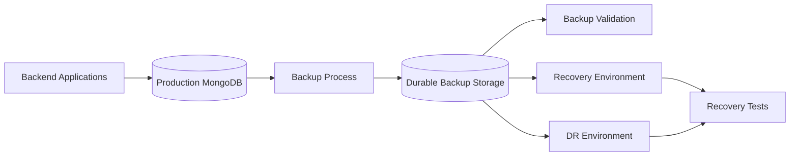
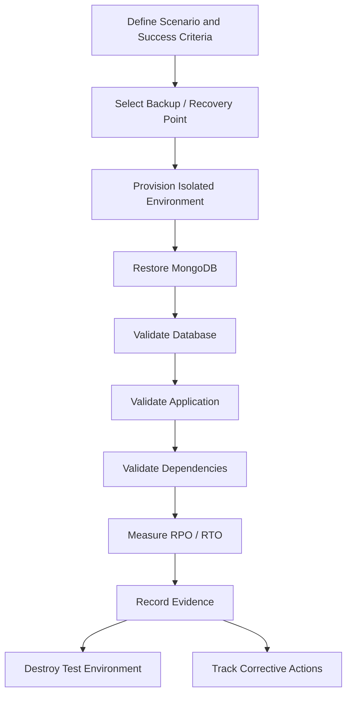

# README

## Overview

MongoDB backup and recovery is the operational discipline used to protect persistent data against accidental deletion, corruption, infrastructure failure, regional outages, application defects, and other recovery scenarios.

A production backup strategy is not simply:

```text
Create Backup
    ↓
Store Backup
```

It is a complete recovery lifecycle:

```text
Production MongoDB
       ↓
Backup Strategy
       ↓
Backup Creation
       ↓
Backup Storage
       ↓
Backup Validation
       ↓
Recovery Procedures
       ↓
Recovery Testing
       ↓
Disaster Recovery
       ↓
Measured RPO / RTO
```

This section focuses on designing, operating, validating, and testing MongoDB recovery capabilities from an intermediate to senior backend engineering perspective.

The primary objective is to ensure that MongoDB data can be recovered **correctly, securely, and within defined recovery objectives**.

## Navigation

| # | File | Description |
|---|---|---|
| 01 | [01- Backup Fundamentals](./01-%20Backup%20Fundamentals.md) | Backup architecture, backup types, RPO/RTO, retention, consistency, and recovery fundamentals |
| 02 | [02- mongodump and mongorestore](./02-%20mongodump%20and%20mongorestore.md) | Logical backup and restore using MongoDB Database Tools |
| 03 | [03- Logical vs Physical Backups](./03-%20Logical%20vs%20Physical%20Backups.md) | Comparison of logical and physical backup strategies and their operational trade-offs |
| 04 | [04- Point in Time Recovery](./04-%20Point%20in%20Time%20Recovery.md) | Recovery to a specific historical point using backup and change history |
| 05 | [05- Backup Validation](./05-%20Backup%20Validation.md) | Backup integrity, restore validation, data verification, and backup health checks |
| 06 | [06- Disaster Recovery](./06-%20Disaster%20Recovery.md) | MongoDB disaster recovery architecture, failure scenarios, DR strategies, and recovery objectives |
| 07 | [07- Recovery Procedures](./07-%20Recovery%20Procedures.md) | Operational procedures for restoring MongoDB and recovering dependent backend services |
| 08 | [08- Recovery Testing](./08-%20Recovery%20Testing.md) | Automated and manual recovery tests, RPO/RTO measurement, DR exercises, and recovery validation |

## Backup and Recovery Architecture

A production MongoDB backup architecture should separate the primary database from the backup system.



The backup destination should provide appropriate durability, access control, encryption, retention, and geographic separation from the production database.

## Recovery Objectives

Two metrics define the practical recovery target.

### RPO

**Recovery Point Objective** defines how much data loss is acceptable, measured in time.

Example:

```text
RPO = 15 minutes
```

This means the recovery architecture should target a state no more than approximately 15 minutes behind the failure point, subject to the exact recovery mechanism and tested conditions.

### RTO

**Recovery Time Objective** defines how long recovery may take before the service must become operational.

Example:

```text
RTO = 60 minutes
```

RTO should include the complete recovery workflow, not just MongoDB restore time.

```text
Failure
  ↓
Detection
  ↓
Infrastructure Recovery
  ↓
Backup Retrieval
  ↓
MongoDB Restore
  ↓
Validation
  ↓
Application Recovery
  ↓
Dependency Recovery
  ↓
Traffic Restoration
  ↓
Service Available
```

## Backup Strategy

A backup strategy should answer:

- What data is protected?
- How frequently is it backed up?
- Where is it stored?
- How long is it retained?
- How is it encrypted?
- Who can access it?
- How is it validated?
- How is it restored?
- How is PITR supported?
- What is the expected RPO?
- What is the expected RTO?
- How frequently is recovery tested?

Typical production layers include:

| Layer | Purpose |
|---|---|
| Continuous replication | High availability |
| Regular backups | Disaster recovery |
| Point-in-time recovery | Recovery from accidental or corrupt changes |
| Cross-region backup | Regional disaster protection |
| Restore testing | Prove recoverability |
| Full DR exercise | Validate end-to-end recovery |

Replication should not be treated as a substitute for backups.

## Logical Backups

Logical backups export MongoDB data into a representation that can be restored using MongoDB Database Tools.

Typical tooling:

```bash
mongodump
mongorestore
```

Advantages:

- Selective database or collection backup
- Portable representation
- Useful for migrations
- Useful for smaller environments
- Straightforward operational workflow

Limitations:

- Restore performance can be slower for large datasets
- Backup size may be substantial
- Indexes and metadata require validation
- Large production environments may need different backup mechanisms

Logical backups are useful, but they should be evaluated against the scale and RPO/RTO requirements of the system.

## Physical and Managed Backups

Physical or managed backup mechanisms can be more appropriate for large production deployments.

They can provide:

- Faster recovery
- Snapshot-based recovery
- Continuous backup capabilities
- Point-in-time recovery
- Large-scale operational efficiency
- Managed retention

The backup mechanism should match the production deployment.

For example:

```text
MongoDB Atlas
    ↓
Managed Backup
    ↓
Managed Restore
```

should be tested as an actual recovery path rather than using `mongodump` as a substitute test.

## Point in Time Recovery

Point in time recovery is designed for situations where the latest backup is not the correct recovery state.

Typical scenario:

```text
10:00  Valid state
10:15  Application deployment
10:20  Data corruption begins
10:25  Corruption detected
```

If the latest backup is at 10:00, restoring only that backup may lose valid changes between 10:00 and the desired recovery point.

PITR combines a suitable base backup with historical change information to recover to a selected point in time.

Important considerations include:

- Backup frequency
- Oplog/change history availability
- Recovery window
- Target timestamp
- Restore duration
- Validation
- Application consistency

## Backup Validation

A backup is not operationally useful merely because a backup job reports success.

Validation should progressively test:

```text
Backup Exists
    ↓
Backup Is Readable
    ↓
Backup Can Be Restored
    ↓
Database Structure Is Correct
    ↓
Critical Data Is Present
    ↓
Indexes Are Present
    ↓
Queries Work
    ↓
Application Works
```

Important validation areas include:

- Backup metadata
- Backup size
- Backup freshness
- Checksums where available
- Restore success
- Collection existence
- Document counts
- Critical records
- Indexes
- Representative queries
- Application connectivity

## Recovery Procedures

Recovery procedures should be explicit operational runbooks rather than informal knowledge.

A recovery runbook should identify:

1. Recovery trigger
2. Incident owner
3. Recovery point
4. Backup source
5. Target infrastructure
6. Required credentials
7. MongoDB restore procedure
8. Validation procedure
9. Application recovery procedure
10. Traffic restoration
11. RPO/RTO measurement
12. Cleanup procedure

A recovery procedure should be executable by an engineer who was not involved in designing the original backup system.

## Disaster Recovery

Disaster recovery addresses failures larger than an individual database operation.

Examples include:

- MongoDB cluster loss
- Availability-zone failure
- Region failure
- Backup storage failure
- Infrastructure account failure
- Network isolation
- Credential loss
- Application-wide corruption

A DR architecture may use:

```text
Primary Region
    |
    +--> MongoDB Production
    |
    +--> Backup Storage
             |
             v
       Secondary Region
             |
             v
       Recovery MongoDB
             |
             v
       Recovery Application
```

Cross-region recovery should be tested rather than assumed.

## Recovery Testing

Recovery testing proves that documented procedures work under realistic conditions.

A mature recovery program uses multiple levels.

| Test | Purpose |
|---|---|
| Backup validation | Verify backup health |
| Restore test | Verify database restoration |
| Data validation | Verify recovered state |
| Application test | Verify service functionality |
| Dependency test | Verify Redis/Kafka/workers |
| PITR test | Verify historical recovery |
| DR exercise | Verify end-to-end recovery |
| Game day | Validate operational response |

Recovery tests should measure both correctness and recovery duration.

## Recovery Test Lifecycle



## Backend Application Recovery

MongoDB recovery must be considered together with the application architecture.

For a typical Python backend:

```text
Nginx
  ↓
FastAPI / Django
  ↓
Service Layer
  ↓
Repository
  ↓
MongoDB
```

The recovery procedure should verify the entire request path.

For asynchronous systems:

```text
Kafka
  ↓
Consumer
  ↓
Service
  ↓
MongoDB

Celery
  ↓
Background Task
  ↓
MongoDB
```

Recovery should also consider:

- Duplicate event processing
- Consumer offsets
- Idempotency
- Redis cache rebuilding
- Celery task replay
- External API side effects
- Application configuration
- Secrets
- TLS certificates

## Recovery Environment

Recovery environments should be isolated from production.

Recommended controls include:

- Separate network
- Separate credentials
- Restricted IAM
- TLS
- Encryption at rest
- Audit logging
- Temporary infrastructure
- Automated cleanup

If production data is restored, treat the recovery environment as production-sensitive.

## Security

Backup security is part of database security.

Protect:

- Backup files
- Backup storage
- Encryption keys
- MongoDB credentials
- Cloud IAM credentials
- Recovery environments
- Recovery logs
- Validation artifacts

Follow least privilege.

A recovery process should not require broad permanent administrator access when narrower temporary permissions are sufficient.

## Monitoring

Monitor the backup and recovery system itself.

Useful metrics include:

| Metric | Purpose |
|---|---|
| Backup success rate | Detect backup failures |
| Backup age | Detect stale backups |
| Backup size | Detect unexpected changes |
| Backup duration | Detect performance regressions |
| Restore duration | Track RTO |
| Restore success rate | Measure recoverability |
| Replication lag | Understand HA state |
| Oplog window | Assess PITR coverage |
| Recovery test failures | Identify DR gaps |
| Storage usage | Manage backup capacity |

A backup system without monitoring can fail silently.

## Operational Runbook Pattern

Every major recovery scenario should follow a consistent structure:

```text
Symptom
↓
Possible Causes
↓
Isolation Strategy
↓
Diagnostic Commands
↓
Recovery Decision
↓
Corrective Action
↓
Validation
↓
Prevention
```

This makes recovery procedures easier to execute during incidents.

## Common Recovery Scenarios

| Scenario | Typical recovery approach |
|---|---|
| Accidental document deletion | PITR or targeted recovery |
| Collection deletion | Backup restore / PITR |
| Application corruption | Recover to pre-corruption point |
| Primary failure | Replica-set failover |
| Cluster loss | Backup or managed restore |
| Region failure | Cross-region DR |
| Backup corruption | Alternate backup / backup replica |
| Operator error | PITR or known-good backup |
| Data migration failure | Recovery to pre-migration state |

The correct recovery mechanism depends on the failure point and required recovery objectives.

## Cost Considerations

Backup and DR introduce infrastructure and operational costs.

Major cost drivers include:

- Backup storage
- Cross-region replication
- Snapshot retention
- Recovery infrastructure
- Network transfer
- Restore operations
- DR environments
- Recovery testing
- Monitoring

Cost optimization should not compromise the required RPO, RTO, or recovery reliability.

A practical strategy is:

```text
Frequent inexpensive validation
        +
Periodic full restore
        +
Less frequent full-scale DR exercise
```

## Production Best Practices

- Design backups around RPO and RTO rather than backup frequency alone.
- Keep backups logically and operationally separate from production.
- Use encryption in transit and at rest.
- Apply least-privilege access to backup storage.
- Maintain appropriate retention policies.
- Validate backups automatically.
- Perform actual restore tests.
- Test PITR separately from ordinary restore.
- Test application and dependency recovery.
- Measure recovery duration.
- Document recovery procedures.
- Automate repeatable recovery steps.
- Maintain isolated recovery environments.
- Test cross-region recovery where required.
- Track recovery-test failures as engineering work.
- Review recovery architecture whenever MongoDB or application architecture changes.

## Production Readiness Checklist

### Backup

- [ ] Backup strategy is documented.
- [ ] Backup frequency is defined.
- [ ] Retention policy is defined.
- [ ] Backup storage is durable.
- [ ] Backup storage is isolated from production.
- [ ] Encryption is enabled.
- [ ] Backup access is restricted.

### Recovery

- [ ] RPO is defined.
- [ ] RTO is defined.
- [ ] Restore procedures are documented.
- [ ] PITR procedure is documented where required.
- [ ] Recovery credentials are available.
- [ ] Recovery infrastructure can be provisioned.

### Validation

- [ ] Backup validation is automated.
- [ ] Restore tests are performed.
- [ ] Critical records are validated.
- [ ] Indexes are validated.
- [ ] Critical queries are tested.
- [ ] Application recovery is tested.

### Disaster Recovery

- [ ] Failure scenarios are documented.
- [ ] Cross-region strategy is defined where required.
- [ ] DR infrastructure is documented.
- [ ] Traffic failover is documented.
- [ ] DR exercises are scheduled.

### Operations

- [ ] Backup monitoring is enabled.
- [ ] Restore duration is measured.
- [ ] Backup failures generate alerts.
- [ ] Recovery test results are retained.
- [ ] Corrective actions are tracked.
- [ ] Runbooks are periodically reviewed.

## Senior-Level Focus

At senior engineering level, MongoDB backup and recovery should be treated as a system reliability problem rather than a database command problem.

The important questions are:

- Can the organization recover the data?
- Can it recover the correct version of the data?
- Can it recover within the required RPO?
- Can it recover within the required RTO?
- Can the application operate against the recovered database?
- Can dependent systems recover safely?
- Can engineers execute the process during an incident?
- Has the process been tested recently?
- Is the recovery path secure?
- Is the recovery architecture affordable at the required scale?

The strongest recovery architecture is one that is **documented, automated where practical, regularly tested, measurable, secure, and continuously improved**.

## Key Takeaways

- **Backup and recovery should be designed around measurable RPO and RTO requirements, not merely backup frequency.**
- **Replication provides availability, while independent backups and recovery mechanisms provide protection against data loss, corruption, and larger disasters.**
- **A production recovery process must validate MongoDB, indexes, critical data, application services, asynchronous workers, dependencies, and traffic restoration.**
- **Backup validation and recovery testing are essential because an untested backup does not prove that the system is recoverable.**
- **Senior-level MongoDB operations require repeatable runbooks, automated validation, secure recovery environments, measurable recovery performance, and regular DR exercises.**