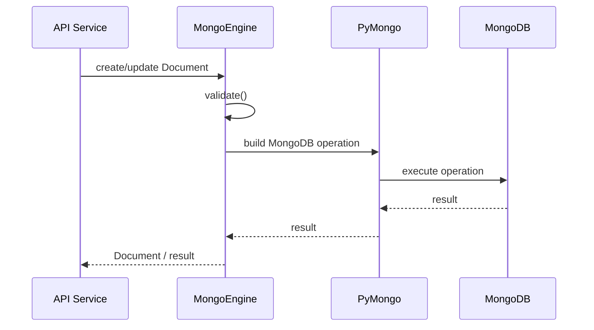
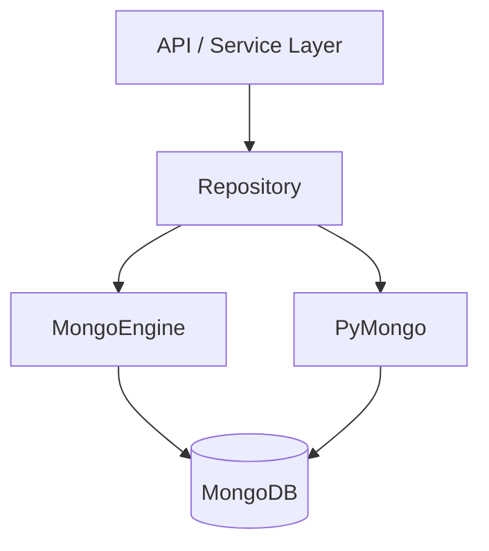

# 03- MongoEngine

## Overview

MongoEngine is a Python Object-Document Mapper (ODM) built on top of MongoDB and PyMongo. It provides Python classes and fields for modeling MongoDB documents while exposing QuerySets and document-oriented abstractions for persistence and querying. :contentReference[oaicite:0]{index=0}

The primary value of MongoEngine is reducing repetitive persistence code when an application benefits from:

- Explicit document models
- Field definitions
- Validation
- Embedded documents
- References
- QuerySets
- Index declarations
- Signals
- Document-oriented domain models

The architectural relationship is:

```text
Python Application
       ↓
MongoEngine ODM
       ↓
PyMongo Driver
       ↓
MongoDB
```

MongoEngine should not be treated as a relational ORM replacement. MongoDB remains a document database, and MongoEngine's abstractions should be used without losing awareness of MongoDB's query model, indexes, document limits, replication, transactions, and operational behavior.

## Why MongoEngine Exists

Direct PyMongo is powerful but intentionally low-level:

```python
orders.find(
    {
        "customer_id": customer_id,
        "status": "pending",
    }
)
```

With MongoEngine, the same domain can be represented through a document model:

```python
Order.objects(
    customer_id=customer_id,
    status="pending",
)
```

The ODM can provide:

- Schema definitions
- Validation
- Reusable models
- Field-level semantics
- Query abstraction
- Reference handling
- Index declarations
- Serialization helpers
- Lifecycle hooks

The trade-off is an additional abstraction layer.

```text
                 Direct Control
                       ▲
                       │
                    PyMongo
                       │
                  MongoEngine
                       │
                       ▼
              Higher-level Modeling
```

MongoEngine is most useful when the application's domain model benefits from explicit Python document classes and the team is comfortable understanding what those abstractions generate underneath.

## MongoEngine vs PyMongo

| Concern | PyMongo | MongoEngine |
|---|---|---|
| Abstraction level | Driver | ODM |
| Document model | Dictionaries / BSON | Python classes |
| Schema definition | Application-controlled | Field definitions |
| Query API | MongoDB query documents | QuerySet API |
| Validation | Application-defined | Model-level validation |
| MongoDB control | Very high | High, but abstracted |
| Learning MongoDB internals | Direct | Requires understanding generated queries |
| Boilerplate | Lower-level | Higher-level abstraction |
| Performance tuning | Direct | Requires understanding ODM behavior |
| Complex MongoDB features | Usually first-class | May require PyMongo |
| Existing MongoDB knowledge | Essential | Still essential |

A production team should choose based on application architecture rather than assuming an ODM is automatically better than the native driver.

## Installation

Install MongoEngine:

```bash
python -m pip install -U mongoengine
```

The official documentation describes MongoEngine as an ODM written in Python for MongoDB and notes that it is based on PyMongo. :contentReference[oaicite:1]{index=1}

For a production application, pin or constrain the dependency according to the application's dependency-management policy and validate upgrades against:

- Python version
- MongoDB Server version
- PyMongo version
- MongoEngine version
- Application test suite
- Production query workload

## Connection Management

MongoEngine provides connection management on top of PyMongo.

Basic connection:

```python
from mongoengine import connect

connect(
    db="orders",
    host="mongodb://localhost:27017/orders",
)
```

For production, credentials should not be hard-coded:

```python
import os

from mongoengine import connect

connect(
    db=os.environ["MONGO_DATABASE"],
    host=os.environ["MONGO_URI"],
)
```

A typical deployment flow is:

```text
Secret Manager
      ↓
Environment / Secret Injection
      ↓
Application Startup
      ↓
MongoEngine
      ↓
PyMongo
      ↓
MongoDB
```

Use the same secret-management principles as a direct PyMongo application.

## Connection Configuration

MongoEngine ultimately relies on PyMongo for MongoDB connectivity, so driver-level connection settings remain important.

Example:

```python
import os

from mongoengine import connect

connect(
    db=os.environ["MONGO_DATABASE"],
    host=os.environ["MONGO_URI"],
    alias="default",
    connect=True,
    serverSelectionTimeoutMS=5000,
    connectTimeoutMS=5000,
    socketTimeoutMS=10000,
)
```

Exact connection options should be validated against the MongoEngine and PyMongo versions used by the application.

Important operational concerns include:

- Server selection timeout
- Connection timeout
- Socket timeout
- TLS
- Authentication
- Replica-set discovery
- Connection pooling
- Read preference
- Write concern

## Multiple Connections

MongoEngine supports named connections.

```python
from mongoengine import connect

connect(
    db="orders",
    host=orders_uri,
    alias="orders",
)

connect(
    db="analytics",
    host=analytics_uri,
    alias="analytics",
)
```

A document can specify its connection:

```python
from mongoengine import Document, StringField


class Order(Document):
    order_id = StringField(required=True, unique=True)

    meta = {
        "db_alias": "orders",
    }
```

Multiple connections are useful when applications genuinely interact with separate MongoDB deployments or databases with different operational boundaries.

Do not introduce multiple connections simply to organize collections. Unnecessary connections increase operational complexity.

## Document Modeling

A MongoEngine document is represented as a Python class.

```python
from mongoengine import (
    Document,
    StringField,
    FloatField,
    DateTimeField,
)


class Order(Document):
    order_id = StringField(required=True, unique=True)
    customer_id = StringField(required=True)
    status = StringField(required=True)
    total = FloatField(required=True)
    created_at = DateTimeField(required=True)
```

MongoEngine maps the model to a MongoDB document.

Conceptually:

```text
Python Object
     ↓
MongoEngine Document
     ↓
BSON Document
     ↓
MongoDB Collection
```

The model defines application-level expectations, but MongoDB remains responsible for storing BSON documents.

## Collections

MongoEngine normally derives collection information from the document class.

Explicit collection configuration:

```python
class Order(Document):
    order_id = StringField(required=True)
    status = StringField(required=True)

    meta = {
        "collection": "orders",
    }
```

This is useful when the collection name must remain stable independently of Python naming conventions.

## Fields

MongoEngine provides field classes such as:

- `StringField`
- `IntField`
- `FloatField`
- `DecimalField`
- `BooleanField`
- `DateTimeField`
- `ListField`
- `DictField`
- `EmbeddedDocumentField`
- `ReferenceField`
- `ObjectIdField`
- `URLField`
- `EmailField`
- `BinaryField`
- `UUIDField`

Example:

```python
from mongoengine import (
    Document,
    StringField,
    BooleanField,
    ListField,
    StringField,
)


class Customer(Document):
    email = StringField(required=True)
    active = BooleanField(default=True)
    tags = ListField(StringField())
```

Field definitions provide application-level structure without turning MongoDB into a relational database.

## Required Fields

```python
class Customer(Document):
    email = StringField(required=True)
    name = StringField(required=True)
```

Attempting to save an invalid document can result in validation failure.

```python
customer = Customer(
    email="user@example.com",
)

customer.validate()
```

Required fields are useful for preventing malformed application objects from reaching the database.

They do not replace database-level controls where stronger invariants are required.

## Default Values

```python
from datetime import datetime, timezone

from mongoengine import Document, DateTimeField, StringField


class Order(Document):
    status = StringField(default="pending")

    created_at = DateTimeField(
        default=lambda: datetime.now(timezone.utc),
    )
```

Use callable defaults for values that must be generated at object creation time.

Avoid:

```python
created_at = DateTimeField(
    default=datetime.now(timezone.utc)
)
```

because that expression is evaluated when the class is defined rather than when each document is instantiated.

## Embedded Documents

MongoEngine supports embedded documents for nested MongoDB structures.

```python
from mongoengine import (
    EmbeddedDocument,
    EmbeddedDocumentField,
    StringField,
)


class Address(EmbeddedDocument):
    city = StringField(required=True)
    country = StringField(required=True)


class Customer(Document):
    email = StringField(required=True)
    address = EmbeddedDocumentField(Address)
```

Stored conceptually as:

```json
{
  "email": "user@example.com",
  "address": {
    "city": "Kolkata",
    "country": "India"
  }
}
```

Embedding is appropriate when:

- The child data belongs to the parent
- The child is normally read with the parent
- Independent lifecycle management is unnecessary
- Document growth remains bounded

## Embedded Lists

```python
class LineItem(EmbeddedDocument):
    product_id = StringField(required=True)
    quantity = IntField(required=True)


class Order(Document):
    order_id = StringField(required=True)
    items = ListField(
        EmbeddedDocumentField(LineItem)
    )
```

This is a natural representation of order line items.

The key design question is not whether MongoEngine can model the relationship. It is whether embedding matches the MongoDB access pattern.

## References

MongoEngine supports references between documents.

```python
from mongoengine import (
    Document,
    ReferenceField,
    StringField,
)


class Customer(Document):
    email = StringField(required=True)


class Order(Document):
    order_id = StringField(required=True)
    customer = ReferenceField(Customer)
```

A reference represents a relationship to another MongoDB document rather than embedding that document.

Use references when:

- The related entity has an independent lifecycle
- The referenced document is large
- The relationship is high-cardinality
- The related entity is independently queried
- Duplication would create unacceptable consistency problems

## Embedding vs Referencing

| Requirement | Embedding | Reference |
|---|---:|---:|
| Read together frequently | Strong fit | Possible |
| Independent lifecycle | Weak fit | Strong fit |
| Bounded child count | Strong fit | Optional |
| Very large child collection | Poor fit | Strong fit |
| Atomic parent-child update | Strong fit | Requires more coordination |
| Duplication acceptable | Strong fit | Less necessary |
| Independent querying | Less convenient | Strong fit |

MongoEngine's abstraction does not remove MongoDB's underlying data-modeling trade-offs.

## Dynamic Documents

MongoEngine also supports dynamic document models.

```python
from mongoengine import DynamicDocument, StringField


class Event(DynamicDocument):
    event_type = StringField(required=True)
```

Additional fields can be stored without explicitly declaring them.

This can be useful for:

- Event payloads
- Evolving metadata
- External integrations
- Heterogeneous documents

However, unrestricted dynamic schemas can become difficult to operate.

Production systems should define boundaries around:

- Allowed fields
- Payload size
- Data types
- Indexes
- Retention
- Validation

## Schema Validation

MongoEngine provides model-level validation, but it is important to distinguish:

```text
MongoEngine Validation
        +
MongoDB Schema Validation
        +
Business Validation
```

They solve different problems.

### Model Validation

```python
class Customer(Document):
    email = StringField(required=True)
    age = IntField(min_value=18)
```

### Business Validation

```python
if customer.age < minimum_customer_age:
    raise InvalidCustomer()
```

### Database Validation

MongoDB itself can enforce collection-level validation rules.

For critical invariants, do not rely exclusively on client-side validation because multiple applications, scripts, migration tools, or administrative clients may write to the same database.

## Document Lifecycle

A typical MongoEngine lifecycle is:



The ODM therefore affects application ergonomics, but MongoDB still determines the actual persistence semantics.

## Saving Documents

Create and save:

```python
customer = Customer(
    email="user@example.com",
    age=30,
)

customer.save()
```

Update and save:

```python
customer.age = 31
customer.save()
```

This style is convenient for domain-oriented code.

However, loading an entire document, changing one field, and saving it can be less efficient than issuing a targeted update for high-throughput workloads.

## Atomic Updates

Prefer atomic update operations when only a small part of a document needs changing.

```python
Customer.objects(
    email="user@example.com",
).update_one(
    set__age=31,
)
```

This avoids unnecessarily replacing or serializing the full document.

## QuerySets

MongoEngine's main query abstraction is `QuerySet`.

```python
orders = Order.objects(
    status="pending",
)
```

QuerySets can be chained:

```python
orders = (
    Order.objects(status="pending")
    .order_by("-created_at")
    .limit(50)
)
```

This resembles ORM-style querying but should not be interpreted as SQL translation.

MongoEngine constructs MongoDB queries through its PyMongo-based implementation.

## Query Operators

MongoEngine provides query operators through keyword syntax.

Equality:

```python
Order.objects(status="pending")
```

Greater than:

```python
Order.objects(total__gt=100)
```

Greater than or equal:

```python
Order.objects(total__gte=100)
```

In:

```python
Order.objects(
    status__in=["pending", "processing"]
)
```

Not equal:

```python
Order.objects(status__ne="cancelled")
```

The abstraction is convenient, but engineers should still understand the corresponding MongoDB query.

## Raw MongoDB Query

When MongoEngine's query abstraction does not express a required query cleanly, use lower-level access where appropriate.

For example, MongoEngine supports MongoDB-style query expressions through its query API and exposes underlying PyMongo capabilities through its document/collection infrastructure.

The important architectural principle is:

```text
Common Domain Queries
        ↓
MongoEngine QuerySet

Specialized MongoDB Operations
        ↓
MongoDB / PyMongo API
```

Do not force every MongoDB capability through an abstraction that makes the operation harder to understand or optimize.

## Projection

Retrieve only selected fields when the application does not need the complete document.

MongoEngine supports field selection:

```python
orders = Order.objects(
    status="pending",
).only(
    "order_id",
    "customer_id",
    "status",
)
```

This can reduce:

- network payload
- decoding work
- application memory
- serialization cost

However, projection is not a replacement for correct indexing.

## Excluding Fields

```python
orders = Order.objects(
    status="pending",
).exclude(
    "internal_notes",
)
```

Be careful with code that later assumes excluded fields are available.

Projection should be part of a deliberate repository contract.

## Pagination

Offset pagination:

```python
orders = (
    Order.objects()
    .order_by("-created_at")
    .skip(offset)
    .limit(page_size)
)
```

This is simple but becomes less attractive for large offsets.

For large datasets, prefer an indexed cursor boundary.

For example, conceptually:

```python
orders = (
    Order.objects(
        created_at__lt=last_created_at,
    )
    .order_by("-created_at")
    .limit(50)
)
```

For deterministic pagination, consider combining `created_at` with `_id`.

## Query Evaluation

QuerySets should be treated as database operations rather than ordinary Python lists.

Avoid:

```python
orders = list(
    Order.objects(status="pending")
)
```

when the collection may contain a large number of documents.

Prefer bounded queries:

```python
orders = (
    Order.objects(status="pending")
    .limit(100)
)
```

or iterate through a cursor where appropriate.

## Query Caching

MongoEngine QuerySets have behavior that can make repeated evaluation different from executing a new query each time. Do not depend on implicit caching as a substitute for deliberate application caching.

For expensive repeated reads:

```text
Application
    ↓
Redis Cache
    ↓ cache miss
MongoEngine
    ↓
MongoDB
```

Use Redis when a workload actually benefits from caching rather than caching every database query by default.

## Ordering

```python
orders = Order.objects(
    customer_id=customer_id,
).order_by(
    "-created_at",
)
```

Sorting should be backed by an appropriate MongoDB index when the dataset is large.

For example:

```text
customer_id + created_at
```

may require a compound index aligned with the query and sort pattern.

Do not assume that an ODM-level `.order_by()` makes sorting efficient.

## Indexes

MongoEngine allows indexes to be declared in document metadata.

```python
class Order(Document):
    customer_id = StringField(required=True)
    status = StringField(required=True)
    created_at = DateTimeField(required=True)

    meta = {
        "indexes": [
            "customer_id",
            "-created_at",
            {
                "fields": [
                    "customer_id",
                    "-created_at",
                ],
                "name": "customer_created_at",
            },
        ],
    }
```

Index definitions should be based on actual query patterns.

## Compound Index Design

Suppose the application frequently executes:

```python
Order.objects(
    customer_id=customer_id,
    status="confirmed",
).order_by(
    "-created_at",
)
```

A candidate index might be:

```text
customer_id
status
created_at DESC
```

But index selection should be validated using:

- query selectivity
- cardinality
- equality predicates
- sort behavior
- workload frequency
- write overhead
- actual `explain()` output

MongoEngine does not eliminate the need for MongoDB index engineering.

## Unique Indexes

```python
class Customer(Document):
    email = StringField(required=True)

    meta = {
        "indexes": [
            {
                "fields": ["email"],
                "unique": True,
            }
        ],
    }
```

Application validation alone is insufficient for uniqueness under concurrency.

A unique MongoDB index provides the database-level invariant.

Handle duplicate-key errors explicitly at the service boundary.

## TTL Indexes

TTL indexes can be useful for expiring data such as:

- sessions
- temporary events
- short-lived tokens
- cache-like records

Example:

```python
from datetime import datetime

from mongoengine import DateTimeField, Document


class TemporaryEvent(Document):
    expires_at = DateTimeField()

    meta = {
        "indexes": [
            {
                "fields": ["expires_at"],
                "expireAfterSeconds": 0,
            }
        ]
    }
```

TTL deletion is asynchronous. Do not use TTL indexes when business logic requires deletion at an exact instant.

## Index Lifecycle

Avoid treating indexes as an incidental side effect of application startup.

A production workflow is:

```text
Query Requirement
      ↓
Index Design
      ↓
Code Review
      ↓
Migration / Deployment Plan
      ↓
Index Creation
      ↓
Explain Validation
      ↓
Production Monitoring
```

This is especially important for large collections.

## Query Performance

MongoEngine can make queries concise:

```python
orders = Order.objects(
    customer_id=customer_id,
    status="confirmed",
)
```

But the important performance question is:

```text
What MongoDB query is generated?
        ↓
Which index is selected?
        ↓
How many keys are examined?
        ↓
How many documents are examined?
        ↓
How much data is returned?
```

Senior engineers should be comfortable dropping below the ODM abstraction when investigating performance.

## Explain Plans

For performance analysis, inspect the underlying MongoDB query and use MongoDB's `explain()` capabilities.

A useful workflow is:

```text
Slow MongoEngine Query
        ↓
Identify Generated Query
        ↓
Inspect MongoDB Query Shape
        ↓
Run explain()
        ↓
Check IXSCAN / COLLSCAN
        ↓
Check totalKeysExamined
        ↓
Check totalDocsExamined
        ↓
Review Index
        ↓
Benchmark Again
```

Do not conclude that a QuerySet is efficient merely because the Python code is short.

## Aggregation

MongoEngine provides aggregation support for workloads that need MongoDB's aggregation pipeline.

Conceptually:

```python
pipeline = [
    {
        "$match": {
            "status": "confirmed",
        }
    },
    {
        "$group": {
            "_id": "$customer_id",
            "total": {
                "$sum": "$total",
            },
        }
    },
]
```

When the aggregation is MongoDB-specific and complex, direct PyMongo can sometimes provide clearer control.

A practical boundary is:

```text
Simple document operations
        ↓
MongoEngine

Complex MongoDB aggregation
        ↓
Evaluate MongoEngine vs PyMongo
```

## References and Dereferencing

MongoEngine references can make domain modeling convenient:

```python
class Order(Document):
    customer = ReferenceField(Customer)
```

But references introduce additional database access patterns.

Conceptually:

```text
Load Order
   ↓
Resolve Customer
   ↓
Additional MongoDB access
```

This can become an N+1 query problem.

For example:

```python
for order in Order.objects():
    print(order.customer.email)
```

may cause repeated customer lookups depending on how the references are accessed.

Do not assume ODM references behave like an in-memory object graph.

## Lazy Loading and N+1 Queries

An application can unintentionally produce:

```text
1 query for orders
        +
N queries for customers
```

For high-volume endpoints this can become:

```text
100 orders
+
100 customer lookups
=
101 database operations
```

Mitigation strategies include:

- embedding when appropriate
- denormalization
- explicit batch loading
- aggregation with `$lookup`
- carefully designed repositories
- reducing object traversal

## Embedded Documents vs References

MongoEngine makes both models easy to express, but the underlying architectural choice remains a MongoDB design decision.

Use embedding when:

```text
Parent owns child
+
Child is bounded
+
Child is read with parent
```

Use references when:

```text
Child has independent lifecycle
+
Child is independently queried
+
Embedding would cause excessive duplication or growth
```

## Transactions

MongoEngine supports transaction-related MongoDB operations through sessions and the underlying driver.

For transaction-heavy systems, direct PyMongo can provide more explicit control over:

- sessions
- transaction options
- retry behavior
- read concern
- write concern

An ODM should not hide transaction boundaries from the service layer.

A good architecture is:

```text
Service
  ↓
Transaction Boundary
  ↓
Repository
  ↓
MongoEngine / PyMongo
  ↓
MongoDB
```

Do not place transaction semantics inside arbitrary model methods where callers cannot reason about atomicity.

## Signals

MongoEngine supports signals for lifecycle events.

Example:

```python
from mongoengine import signals


def before_save(sender, document, **kwargs):
    document.status = document.status.lower()


signals.pre_save.connect(
    before_save,
    sender=Order,
)
```

Signals can be useful for:

- local model lifecycle behavior
- auditing hooks
- derived fields
- controlled normalization

However, signals can also create invisible side effects.

Avoid using signals for critical business workflows such as:

```text
save()
  ↓
send payment
  ↓
publish Kafka event
  ↓
call external service
```

Such behavior is difficult to reason about and test.

Prefer explicit service-layer orchestration for important workflows.

## Signals and Distributed Systems

A MongoEngine signal is not a distributed transaction mechanism.

This is unsafe as a guaranteed event-delivery architecture:

```text
MongoDB save
    ↓
signal
    ↓
Kafka publish
```

If the process fails between persistence and event publication, the systems can diverge.

For reliable integration events, consider:

- transactional outbox patterns
- change streams
- explicit event persistence
- idempotent consumers

## Custom Methods

MongoEngine documents can contain domain-oriented methods.

```python
class Order(Document):
    status = StringField(required=True)

    def is_confirmable(self) -> bool:
        return self.status == "pending"

    def confirm(self) -> None:
        if not self.is_confirmable():
            raise ValueError("Order cannot be confirmed")

        self.status = "confirmed"
```

This can improve cohesion for local domain behavior.

Avoid turning document classes into large service objects containing:

- external API calls
- Kafka producers
- complex authorization
- orchestration
- unrelated business workflows

Keep architectural boundaries clear.

## Django Integration

MongoEngine has documentation for using MongoEngine with Django. :contentReference[oaicite:2]{index=2}

The architecture should be understood as:

```text
Django
  ├── Django ORM → Relational Database
  │
  └── MongoEngine → MongoDB
```

MongoEngine does not make MongoDB behave like Django's native relational ORM.

This distinction matters when an application contains both PostgreSQL and MongoDB.

## Django + MongoEngine Configuration

A MongoEngine connection can be initialized from Django settings:

```python
import os

from mongoengine import connect


connect(
    db=os.environ["MONGO_DATABASE"],
    host=os.environ["MONGO_URI"],
    alias="default",
)
```

For larger Django systems, isolate MongoDB configuration from unrelated relational database configuration.

For example:

```text
Django Settings
├── PostgreSQL configuration
└── MongoDB configuration
```

## Django REST Framework

A typical architecture is:

```text
HTTP Request
     ↓
DRF View
     ↓
Serializer
     ↓
Service
     ↓
MongoEngine Repository
     ↓
MongoDB
```

Do not place large MongoEngine queries directly inside serializers.

Bad architectural pattern:

```python
class OrderSerializer(...):
    def create(self, validated_data):
        # complex database logic
        ...
```

Prefer:

```text
Serializer
    ↓
Validated data
    ↓
Service
    ↓
Repository
```

This keeps persistence concerns separated from API representation.

## FastAPI Integration

MongoEngine is primarily synchronous.

A FastAPI application using synchronous MongoEngine must ensure database work does not unnecessarily block an event loop.

For an application designed around asynchronous I/O, PyMongo's current `AsyncMongoClient` may be a more appropriate abstraction than placing synchronous MongoEngine calls directly inside async endpoints.

Architecture:

```text
FastAPI
   ↓
Async Service
   ↓
AsyncMongoClient
   ↓
MongoDB
```

or, when the workload is intentionally synchronous:

```text
FastAPI
   ↓
Synchronous Boundary
   ↓
MongoEngine
   ↓
MongoDB
```

Do not choose an ODM solely because it offers convenient models. Match the persistence abstraction to the application's concurrency model.

## Pydantic and MongoEngine

FastAPI commonly uses Pydantic for request and response validation.

MongoEngine provides its own document model.

Therefore, a clean architecture may contain:

```text
API Schema
   ↓
Pydantic Model
   ↓
Service
   ↓
MongoEngine Document
   ↓
MongoDB
```

Avoid exposing MongoEngine documents directly as your public API contract.

This separates:

- API schema
- persistence schema
- internal domain behavior

## Serialization

A MongoEngine document is not automatically an ideal JSON API response.

For example, MongoDB identifiers may be represented as BSON `ObjectId`.

A response schema should explicitly define the external representation:

```python
from pydantic import BaseModel


class OrderResponse(BaseModel):
    id: str
    status: str
    total: float
```

Then map persistence objects into API models.

## Testing

MongoEngine applications should have multiple test layers.

### Unit Tests

Test business logic without MongoDB:

```text
Service
   ↓
Mock Repository
```

### Integration Tests

Test:

```text
MongoEngine
   ↓
PyMongo
   ↓
MongoDB
```

Integration tests should validate:

- field validation
- indexes
- references
- embedded documents
- QuerySets
- aggregation
- update semantics
- unique constraints
- transaction behavior
- serialization

### Production-Like Tests

For critical services, test against a MongoDB topology that resembles production.

For example:

```text
CI
 ↓
MongoDB Replica Set
 ↓
Integration Tests
```

This is particularly important for transaction and replica-set-dependent functionality.

## Transactions and Testing

A test that uses a standalone MongoDB instance may pass while production requires a replica set.

Therefore:

```text
Feature requires transaction
        ↓
Test deployment must support transactions
        ↓
Replica-set-based test environment
```

Do not let local-development simplicity produce false confidence.

## Migrations

MongoDB schema evolution differs from relational migration workflows.

A MongoEngine field definition changing from:

```python
status = StringField()
```

to:

```python
status = StringField(required=True)
```

does not automatically transform every existing MongoDB document.

Existing data may still contain:

- missing fields
- old field names
- old data types
- deprecated values

Production schema changes require a migration strategy.

## Schema Evolution Strategies

### Backward-Compatible Deployment

```text
Deploy reader supporting old + new
        ↓
Deploy writer producing new format
        ↓
Backfill old documents
        ↓
Remove old reader behavior
```

This is often safer than changing the application and data format simultaneously.

### Lazy Migration

Read old format and convert when accessed.

Useful when:

- dataset is large
- old documents are rarely accessed
- migration can be incremental

### Batch Migration

Explicitly transform documents:

```text
Read batch
   ↓
Transform
   ↓
Write batch
   ↓
Verify
   ↓
Continue
```

Monitor:

- throughput
- replication lag
- CPU
- storage
- errors
- application latency

## Bulk Operations

For high-volume workloads, avoid repeatedly saving individual documents:

```python
for order in orders:
    order.status = "expired"
    order.save()
```

This can generate many independent operations.

For bulk workloads, evaluate:

- MongoEngine bulk helpers
- QuerySet updates
- PyMongo `bulk_write()`

The lower-level PyMongo approach may be preferable for large migrations because it provides direct control over batching and operation types.

## Performance Considerations

MongoEngine adds abstraction overhead compared with direct PyMongo.

Potential overhead includes:

- Python object construction
- field conversion
- validation
- dereferencing
- serialization
- QuerySet abstraction

This does not make MongoEngine inherently slow.

The important question is whether the abstraction overhead is material for the workload.

For most backend systems, database query latency dominates Python object overhead. However, high-throughput data processing and bulk operations may justify direct PyMongo.

## When to Prefer MongoEngine

MongoEngine is a good fit when:

- The application has a strong document-domain model
- Developers benefit from explicit Python fields
- Validation belongs near persistence models
- QuerySets improve maintainability
- The workload is conventional CRUD
- The team understands MongoDB internals
- ODM productivity outweighs abstraction costs

## When to Prefer PyMongo

Prefer direct PyMongo when:

- MongoDB-specific features dominate
- Aggregation is complex
- Bulk operations are critical
- Maximum driver control is required
- Async workloads are important
- Low-level transaction control matters
- Query performance needs precise tuning
- The application has minimal domain-model abstraction

## MongoEngine and PyMongo Together

A mature application does not necessarily need an all-or-nothing decision.

A hybrid architecture can be practical:



For example:

```text
Standard CRUD
    → MongoEngine

Complex aggregation
    → PyMongo

Bulk migration
    → PyMongo

Domain validation
    → MongoEngine

Specialized MongoDB operation
    → PyMongo
```

The important rule is to keep the abstraction boundary explicit.

## Security

MongoEngine does not provide an independent security boundary around MongoDB.

Security still depends on:

- MongoDB authentication
- MongoDB authorization
- TLS
- Network isolation
- Secret management
- Least privilege
- MongoDB auditing
- Secure logging

The connection should use a dedicated application identity.

Do not use:

```text
MongoDB admin
     ↓
Application
```

Prefer:

```text
Application
     ↓
Least-Privilege MongoDB User
     ↓
Required Database / Collections
```

## Query Injection

Avoid constructing dynamic query expressions from untrusted user input.

Do not allow an API client to directly provide arbitrary MongoEngine lookup expressions:

```text
?field=status__ne
```

or arbitrary MongoDB query dictionaries.

Instead, explicitly map allowed filters:

```python
ALLOWED_STATUSES = {
    "pending",
    "confirmed",
    "cancelled",
}


def build_order_filters(status: str | None):
    filters = {}

    if status is not None:
        if status not in ALLOWED_STATUSES:
            raise ValueError("Invalid status")

        filters["status"] = status

    return filters
```

## Secrets

Never commit:

```python
connect(
    username="admin",
    password="production-password",
)
```

Use:

```python
connect(
    host=os.environ["MONGO_URI"],
)
```

and provide the secret through the deployment platform.

For Kubernetes:

```text
Kubernetes Secret
      ↓
Pod Environment
      ↓
MongoEngine
      ↓
MongoDB
```

For AWS:

```text
AWS Secrets Manager
      ↓
Deployment / Secret Injection
      ↓
Application
```

## Observability

MongoEngine should be observable at both application and database levels.

Application metrics:

- Query latency
- Error rate
- Timeout rate
- Request latency
- Connection failures
- Bulk-operation duration
- Transaction failures

MongoDB metrics:

- Query execution
- `COLLSCAN`
- `IXSCAN`
- Replication lag
- Connections
- CPU
- Memory
- Storage
- Lock/resource contention
- Slow operations

Do not monitor only HTTP latency. A slow API endpoint can hide a database bottleneck.

## Logging

Avoid logging complete MongoDB documents by default.

Sensitive fields can include:

- email
- access tokens
- session data
- customer metadata
- credentials
- payment-related data

Prefer:

```python
logger.info(
    "order_updated",
    extra={
        "order_id": str(order.id),
        "status": order.status,
    },
)
```

Use structured logging and consistent correlation IDs.

## Operational Debugging

When a MongoEngine query is slow:

```text
Application
    ↓
Identify slow operation
    ↓
Identify QuerySet
    ↓
Inspect MongoDB query
    ↓
Run explain()
    ↓
Inspect indexes
    ↓
Check collection statistics
    ↓
Check database resource usage
    ↓
Optimize
    ↓
Benchmark
```

Do not optimize only the Python code.

## Common Mistakes

### Treating MongoEngine Like Django ORM

MongoEngine looks familiar to Django developers:

```python
Order.objects(status="pending")
```

but MongoDB does not provide relational semantics equivalent to PostgreSQL.

Do not assume:

- joins behave like SQL joins
- transactions should surround every operation
- foreign keys enforce integrity
- ORM-style normalization is always desirable

### Ignoring MongoDB Indexes

This is one of the most serious mistakes.

An elegant QuerySet can still result in:

```text
COLLSCAN
```

on a large collection.

Always reason about query shape and indexes.

### Overusing ReferenceField

References can produce additional queries.

Use them when the data model requires independent entities, not simply because references feel familiar from relational databases.

### Excessive Dereferencing

This pattern can create N+1 behavior:

```python
for order in Order.objects():
    customer = order.customer
```

Measure the resulting database traffic.

### Saving Entire Documents for Small Changes

Prefer:

```python
Order.objects(
    id=order_id,
).update_one(
    set__status="confirmed",
)
```

when a targeted atomic update is sufficient.

### Relying Only on Model Validation

Application-level validation can be bypassed by:

- scripts
- other services
- migrations
- direct MongoDB clients

Use MongoDB schema validation where database-level enforcement is required.

### Using Signals for Critical Workflows

Signals can hide side effects and make failures harder to reason about.

Use explicit service orchestration for business-critical operations.

### Creating Indexes Without Workload Analysis

More indexes are not always better.

Every index adds:

- storage
- write overhead
- memory pressure
- maintenance cost

### Large Unbounded QuerySets

Avoid:

```python
for order in Order.objects():
    process(order)
```

when the collection can grow indefinitely.

Use:

- bounded batches
- cursor iteration
- filters
- projections
- explicit operational controls

## Production Checklist

### Connection

- [ ] Credentials are stored outside source code
- [ ] TLS is enabled where required
- [ ] Certificate validation is enabled
- [ ] Connection timeouts are configured
- [ ] Server selection timeout is bounded
- [ ] Connection pooling is understood
- [ ] Replica-set configuration is validated

### Modeling

- [ ] Access patterns drove the document design
- [ ] Embedding vs referencing is deliberate
- [ ] Document growth is bounded
- [ ] Large arrays are avoided where inappropriate
- [ ] Schema evolution is planned
- [ ] References do not create N+1 access patterns

### Queries

- [ ] Production queries are bounded
- [ ] Pagination is implemented
- [ ] Large offsets are avoided where inappropriate
- [ ] Projections are used when useful
- [ ] Queries have appropriate indexes
- [ ] Slow queries are explain-analyzed

### Indexes

- [ ] Unique constraints use unique indexes
- [ ] Compound indexes reflect real access patterns
- [ ] Unused indexes are reviewed
- [ ] Index creation is operationally planned
- [ ] Write overhead is considered

### Application Architecture

- [ ] MongoEngine is isolated behind appropriate boundaries
- [ ] Business logic is not hidden in signals
- [ ] API schemas are separate from persistence models
- [ ] Transactions have explicit ownership
- [ ] PyMongo is available when lower-level control is required

### Operations

- [ ] Database latency is monitored
- [ ] MongoDB health is monitored
- [ ] Connection failures are observable
- [ ] Replication lag is monitored
- [ ] Backups are configured
- [ ] Restore procedures are tested
- [ ] Driver and ODM upgrades are tested

## Troubleshooting Methodology

### Validation Error

```text
Symptom
↓
Document fails validation
↓
Possible causes
    - Missing required field
    - Invalid field type
    - Invalid range
    - Custom validation failure
↓
Isolation strategy
↓
Inspect document
↓
Call validate()
↓
Inspect ValidationError details
↓
Compare model definition
↓
Root cause
↓
Corrective action
↓
Prevention
    - Test fixtures
    - Contract validation
    - Schema documentation
```

### Slow QuerySet

```text
Symptom
↓
High MongoDB latency
↓
Possible causes
    - Missing index
    - Poor index ordering
    - Large result set
    - N+1 dereferencing
    - Expensive sort
    - Complex aggregation
↓
Isolation strategy
↓
Identify QuerySet
↓
Inspect generated MongoDB operation
↓
Run explain()
↓
Inspect execution statistics
↓
Root cause
↓
Corrective action
↓
Prevention
    - Query review
    - Index review
    - Performance tests
```

### Duplicate Key Error

```text
Symptom
↓
Write fails with duplicate-key error
↓
Possible causes
    - Unique index collision
    - Concurrent create
    - Upsert race
    - Incorrect business identifier
↓
Isolation strategy
↓
Inspect index definition
↓
Inspect conflicting key
↓
Determine whether conflict is expected
↓
Root cause
↓
Corrective action
    - Return conflict
    - Correct identifier
    - Adjust data model
↓
Prevention
    - Explicit unique constraints
    - Idempotent APIs
    - Integration tests
```

### N+1 Queries

```text
Symptom
↓
One API request produces many MongoDB operations
↓
Possible causes
    - Reference dereferencing
    - Per-document lookups
    - Missing batch loading
↓
Isolation strategy
↓
Measure database operation count
↓
Inspect reference access
↓
Review endpoint query path
↓
Root cause
↓
Corrective action
    - Embed
    - Batch
    - Aggregate
    - Denormalize
↓
Prevention
    - Query-count tests
    - Repository review
    - Production metrics
```

## Interview Considerations

### What is MongoEngine?

MongoEngine is a Python ODM for MongoDB. It provides document classes, fields, QuerySets, validation, references, and other abstractions while using PyMongo underneath. :contentReference[oaicite:3]{index=3}

### Is MongoEngine an ORM?

It is better described as an **ODM**, not an ORM.

The distinction matters because MongoDB stores documents rather than relational rows and MongoEngine models document-oriented structures.

### MongoEngine vs PyMongo?

PyMongo is the native Python driver and provides direct access to MongoDB operations.

MongoEngine adds an object-oriented modeling layer.

```text
PyMongo
  ↓
Direct MongoDB API

MongoEngine
  ↓
Document Model
  ↓
PyMongo
  ↓
MongoDB
```

### Does MongoEngine remove the need to understand MongoDB?

No.

Senior engineers still need to understand:

- indexes
- query plans
- aggregation
- document modeling
- replication
- transactions
- consistency
- connection pools
- MongoDB limits
- operational behavior

### When should MongoEngine be avoided?

Consider PyMongo instead when the application requires extensive:

- MongoDB-specific functionality
- complex aggregation
- bulk processing
- low-level transaction control
- asynchronous database access
- performance-sensitive database operations

### Can MongoEngine and PyMongo be used together?

Yes.

A controlled hybrid architecture can use MongoEngine for standard domain persistence and PyMongo for specialized MongoDB operations.

The important requirement is to keep the boundary explicit and avoid creating two competing persistence models for the same business logic.

### Does `ReferenceField` behave like a SQL foreign key?

No.

A `ReferenceField` represents a MongoDB reference. It does not provide relational foreign-key semantics equivalent to PostgreSQL.

It can also introduce additional database operations when referenced documents are accessed.

### Why can MongoEngine queries still be slow?

Because MongoEngine ultimately executes MongoDB operations.

A QuerySet can still suffer from:

- missing indexes
- poor query shapes
- large scans
- expensive sorts
- excessive result sizes
- N+1 reference access
- inefficient aggregation

### Should business logic be placed in signals?

Generally, no for critical workflows.

Signals can be useful for local lifecycle behavior, but important business processes should normally be explicit in a service layer.

### Should MongoEngine documents be returned directly from APIs?

Usually not.

Separate persistence models from API schemas so that MongoDB-specific details such as `ObjectId`, internal fields, and document structure do not become accidental public contracts.

## Key Takeaways

- **MongoEngine is an ODM built on PyMongo that provides Python document models, fields, QuerySets, validation, references, and indexing abstractions without changing MongoDB's underlying document semantics.**
- **Use MongoEngine when explicit document models improve application maintainability, but continue designing schemas, indexes, queries, and transactions according to MongoDB's actual behavior.**
- **Treat references, QuerySets, signals, and document saving as abstractions with performance and architectural consequences; watch for N+1 queries, hidden side effects, unbounded queries, and unnecessary full-document writes.**
- **Keep business logic and transaction boundaries in explicit service layers, and use PyMongo directly when complex aggregation, bulk operations, asynchronous workloads, or lower-level MongoDB control make the ODM abstraction less appropriate.**
- **Production MongoEngine systems require the same operational discipline as direct PyMongo systems: secure connections, bounded timeouts, deliberate indexes, observability, schema evolution, integration testing, backups, and controlled dependency upgrades.**