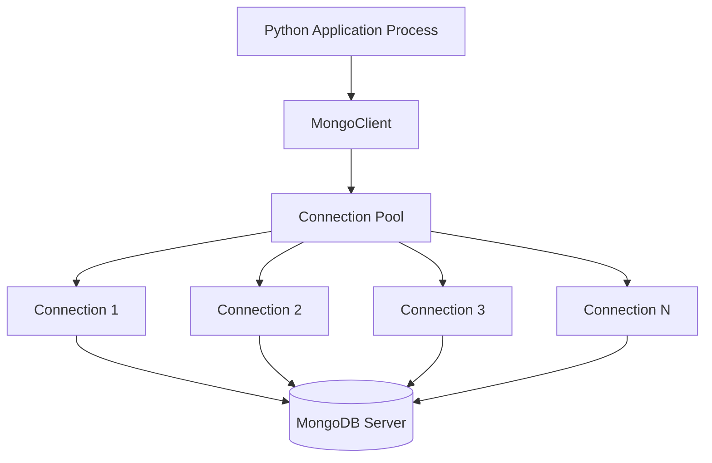
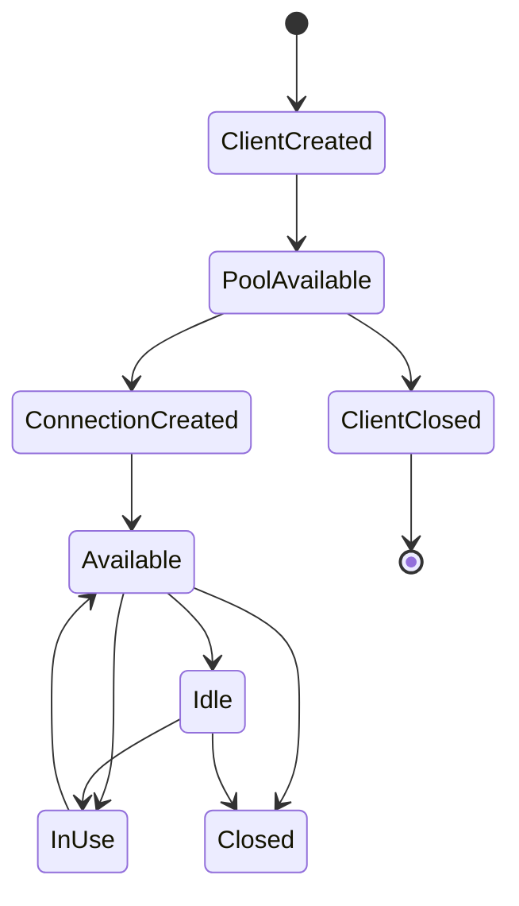
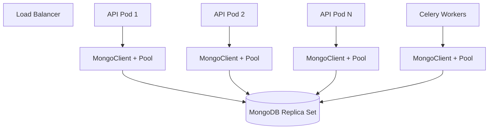

# 08- Connection Pooling

## Overview

MongoDB connection pooling allows a backend application to reuse established database connections instead of creating a new network connection for every database operation.

For production Python applications, connection pooling is a fundamental part of MongoDB client lifecycle design.

Without pooling, an API handling many requests can repeatedly perform:

```text
Request
  ↓
Create MongoClient
  ↓
Establish connection
  ↓
Execute query
  ↓
Close connection
```

This introduces unnecessary:

- TCP connection establishment
- TLS negotiation
- Authentication work
- Server selection
- Connection-management overhead
- Latency
- Resource consumption

With a properly managed pool:

```text
Application Process
       ↓
   MongoClient
       ↓
Connection Pool
 ┌─────┼─────┐
 ↓     ↓     ↓
Conn  Conn  Conn
 ↓     ↓     ↓
MongoDB Server
```

The application reuses connections across requests.

For senior backend engineers, connection pooling is not simply a configuration setting. Pool sizing must be considered together with:

- Application concurrency
- Worker count
- Async vs synchronous execution
- MongoDB topology
- Query latency
- Traffic patterns
- Server connection limits
- Kubernetes replica counts
- Deployment strategy
- Timeouts
- Failure behavior
- Connection leaks
- Observability

## Why Connection Pooling Exists

Creating a database connection is significantly more expensive than reusing an existing connection.

A connection may involve:

```text
DNS
 ↓
TCP
 ↓
TLS
 ↓
Authentication
 ↓
MongoDB server selection
 ↓
Connection ready
```

For a high-throughput backend, performing this lifecycle per request is wasteful.

Connection pooling changes the lifecycle to:

```text
Application startup
       ↓
Create MongoClient
       ↓
Pool establishes connections as required
       ↓
Request borrows connection
       ↓
Execute database operation
       ↓
Connection returned to pool
       ↓
Next request reuses connection
```

The application normally does not explicitly check out and return individual MongoDB connections when using PyMongo's standard API. PyMongo manages the pool internally.

## Connection Pool Architecture

A simplified architecture looks like:



The important architectural point is that the pool belongs to the MongoDB client instance and manages connections to MongoDB servers.

## PyMongo `MongoClient`

For synchronous Python applications, the normal pattern is to create a `MongoClient` once per process and reuse it.

```python
from pymongo import MongoClient

client = MongoClient(
    "mongodb://localhost:27017",
    serverSelectionTimeoutMS=5000,
)

db = client["orders"]
orders = db["orders"]
```

Application code can then reuse:

```python
orders.find_one(...)
orders.insert_one(...)
orders.update_one(...)
```

without constructing a new client for every request.

## The Most Important Rule

Do not create `MongoClient` inside every request.

Avoid:

```python
def get_order(order_id: str):
    client = MongoClient("mongodb://localhost:27017")
    db = client["orders"]

    return db.orders.find_one({
        "_id": order_id
    })
```

This defeats connection pooling at the application level.

Prefer:

```python
from pymongo import MongoClient

client = MongoClient("mongodb://localhost:27017")
db = client["orders"]
orders = db["orders"]


def get_order(order_id: str):
    return orders.find_one({
        "_id": order_id
    })
```

The client remains alive and its internal pool can be reused.

## Pool Per Process

Connection pools are process-local.

If a deployment has:

```text
4 Gunicorn workers
```

and each worker creates one `MongoClient`, there are effectively four independent client instances and pools.

```text
Application Pod
├── Worker 1
│   └── MongoClient
│       └── Pool
├── Worker 2
│   └── MongoClient
│       └── Pool
├── Worker 3
│   └── MongoClient
│       └── Pool
└── Worker 4
    └── MongoClient
        └── Pool
```

This matters when calculating MongoDB connection pressure.

A configuration such as:

```text
maxPoolSize = 100
```

does not necessarily mean:

```text
100 connections for the entire application
```

It can mean up to approximately 100 pooled connections per relevant server per client process, subject to the driver's topology and connection-management behavior.

## Pooling and Application Concurrency

Suppose:

```text
10 Kubernetes pods
5 worker processes per pod
maxPoolSize = 100
```

A simplistic upper-bound calculation is:

```text
10 × 5 × 100
=
5,000
```

potential pooled connections to a server.

That may be dramatically higher than the MongoDB deployment should handle.

Therefore:

```text
Pool size
    ↓
× Worker count
    ↓
× Pod count
    ↓
× Relevant MongoDB servers
    ↓
Cluster connection pressure
```

Pool sizing must be evaluated at deployment scale rather than per application instance.

## Pooling and MongoDB Topology

MongoDB clients may communicate with multiple servers depending on topology.

For a replica set:

```text
MongoClient
    ├── Pool → Primary
    ├── Pool → Secondary 1
    └── Pool → Secondary 2
```

The exact active connections depend on operations, topology discovery, read preference, and driver behavior.

For a sharded cluster:

```text
MongoClient
    ↓
mongos
    ├── Connection pool
    ├── Connection pool
    └── Connection pool
```

The effective connection footprint therefore depends on the topology rather than simply on the configured `maxPoolSize`.

## Pool Lifecycle

A connection pool generally follows this lifecycle:



The driver controls individual connection lifecycle details.

Application code should primarily control the lifecycle of the `MongoClient`.

## Pool Configuration

PyMongo exposes connection-pool-related options through `MongoClient`.

Common settings include:

| Setting | Purpose |
|---|---|
| `maxPoolSize` | Maximum number of pooled connections per server |
| `minPoolSize` | Minimum number of connections maintained in the pool |
| `maxIdleTimeMS` | Maximum idle time before an idle connection can be removed |
| `maxConnecting` | Limits concurrent connection establishment |
| `waitQueueTimeoutMS` | Maximum time an operation can wait for an available connection |
| `connectTimeoutMS` | Timeout for establishing a connection |
| `serverSelectionTimeoutMS` | Maximum time to select a suitable MongoDB server |
| `socketTimeoutMS` | Timeout for socket operations |
| `retryReads` | Controls retryable read behavior |
| `retryWrites` | Controls retryable write behavior |

These settings solve different problems and should not be treated as interchangeable.

## `maxPoolSize`

`maxPoolSize` limits the number of connections that can be checked out from a pool to a given server.

Example:

```python
from pymongo import MongoClient

client = MongoClient(
    "mongodb://mongodb:27017",
    maxPoolSize=100,
)
```

A larger pool does not automatically mean higher throughput.

If MongoDB can efficiently process only a certain amount of concurrent work, increasing the pool may simply increase:

- Contention
- Server connections
- Memory usage
- Context switching
- Queue depth
- Latency

## Default Pool Size

PyMongo's current default `maxPoolSize` is 100 connections per server.

Do not treat the default as a production recommendation.

The correct value depends on:

- Application concurrency
- Query latency
- Number of processes
- Number of replicas/pods
- MongoDB capacity
- Workload characteristics

Defaults are starting points, not capacity plans.

## `minPoolSize`

`minPoolSize` controls the minimum number of connections maintained by a pool.

Example:

```python
client = MongoClient(
    "mongodb://mongodb:27017",
    minPoolSize=10,
    maxPoolSize=100,
)
```

A minimum pool can reduce connection-establishment latency during predictable traffic.

However, excessive minimum pools create persistent connection pressure.

If:

```text
100 pods
×
minPoolSize=20
```

the deployment may attempt to maintain a substantial baseline number of connections even during low traffic.

Use `minPoolSize` carefully.

## `maxIdleTimeMS`

`maxIdleTimeMS` controls how long an idle connection can remain in the pool before being removed.

Example:

```python
client = MongoClient(
    "mongodb://mongodb:27017",
    maxIdleTimeMS=60000,
)
```

This can help reduce long-lived idle connections in environments with:

- Highly variable traffic
- Large numbers of application instances
- Autoscaling
- Bursty workloads

However, aggressively closing idle connections can increase connection establishment overhead when traffic returns.

## `maxConnecting`

`maxConnecting` limits the number of connections being established concurrently.

This helps avoid connection storms.

For example:

```python
client = MongoClient(
    "mongodb://mongodb:27017",
    maxPoolSize=100,
    maxConnecting=2,
)
```

This is particularly relevant when:

- Pods restart simultaneously
- Kubernetes scales rapidly
- MongoDB becomes temporarily unavailable
- A pool needs to grow quickly

Without appropriate controls, a fleet of application instances can simultaneously attempt to establish large numbers of connections.

## Pool Wait Queues

When all available connections are busy, additional operations may wait for a connection.

Conceptually:

```text
Requests
   ↓
┌───────────────────────┐
│ Connection Pool       │
│                       │
│ C1 → busy             │
│ C2 → busy             │
│ C3 → busy             │
└───────────────────────┘
   ↓
Waiting operations
```

If waiting continues for too long, the application may experience latency spikes.

`waitQueueTimeoutMS` controls how long an operation can wait for an available connection.

Example:

```python
client = MongoClient(
    "mongodb://mongodb:27017",
    maxPoolSize=50,
    waitQueueTimeoutMS=2000,
)
```

This is different from a MongoDB query timeout.

## Pool Timeout vs Query Timeout

These are separate failure modes.

```text
Request
  ↓
Wait for pool connection
  ↓
Connection acquired
  ↓
Execute query
```

Possible failures:

```text
Pool wait timeout
        OR
Query execution timeout
```

For example:

| Stage | Relevant configuration |
|---|---|
| Select MongoDB server | `serverSelectionTimeoutMS` |
| Establish network connection | `connectTimeoutMS` |
| Wait for pool slot | `waitQueueTimeoutMS` |
| Execute socket operation | `socketTimeoutMS` |
| Database operation semantics | MongoDB operation-specific behavior |

A senior engineer should identify which phase is actually timing out before changing configuration.

## Connection Pool Saturation

Suppose:

```text
maxPoolSize = 50
```

and 200 concurrent requests perform database work.

The first group can obtain connections while the rest wait.

```text
200 requests
     ↓
50 active connections
     ↓
150 waiting
```

If the database operations are slow, pool saturation can propagate into API latency.

The correct response is not automatically:

```text
Increase maxPoolSize to 500
```

First investigate why the connections remain busy.

Possible root causes:

- Slow queries
- Missing indexes
- Large aggregations
- Excessive transaction duration
- Network latency
- MongoDB resource pressure
- Application code holding cursors too long
- Connection leaks caused by incorrect client lifecycle

## Pool Sizing Model

A useful conceptual model is:

```text
Required pool size
≈
Concurrent database operations per process
```

but this is only a starting point.

A practical sizing process is:

```text
Measure concurrency
       ↓
Measure DB operation latency
       ↓
Measure MongoDB capacity
       ↓
Estimate required concurrency
       ↓
Configure pool
       ↓
Load test
       ↓
Observe saturation
       ↓
Adjust
```

Do not derive pool size solely from CPU count.

## Little's Law

For steady-state systems, Little's Law provides a useful reasoning tool:

```text
L = λ × W
```

Where:

- `L` = average number of concurrent operations
- `λ` = throughput
- `W` = average time spent in the system

For example, if an application generates:

```text
500 database operations/second
```

and each operation spends approximately:

```text
20 ms = 0.020 seconds
```

in database interaction:

```text
L = 500 × 0.020
  = 10
```

This suggests roughly 10 concurrent database operations on average.

Real systems require headroom for:

- Latency variance
- Bursts
- Slow queries
- Failures
- Network behavior
- Multiple operation types

Therefore, the result is not a direct `maxPoolSize` value.

## Connection Pooling and Latency

Pooling reduces connection establishment overhead.

Without reuse:

```text
TCP + TLS + Authentication
       ↓
Query
       ↓
Close
```

With pooling:

```text
Existing connection
       ↓
Query
       ↓
Return to pool
```

This can significantly improve latency, especially when TLS and network distance are involved.

## Connection Pooling and Throughput

Pooling allows multiple operations to execute concurrently.

For example:

```text
Pool
├── Connection 1 → Query A
├── Connection 2 → Query B
├── Connection 3 → Query C
└── Connection 4 → Query D
```

This increases concurrency until another bottleneck becomes dominant.

Potential bottlenecks include:

- MongoDB CPU
- Storage
- Locks/contention
- Working-set misses
- Query execution
- Network
- Application CPU

A larger pool cannot compensate for an overloaded database.

## Pooling and Slow Queries

Consider:

```text
Pool size = 20
Slow query latency = 2 seconds
```

If all 20 connections are occupied by slow operations:

```text
20 active
0 available
```

New operations wait.

This is why connection-pool tuning should usually follow query-performance tuning.

The preferred order is:

```text
Slow requests
   ↓
Inspect MongoDB query
   ↓
Explain
   ↓
Optimize query/index
   ↓
Re-measure
   ↓
Tune pool if necessary
```

## Connection Pooling and Transactions

Transactions occupy connections while operations execute.

Long-running transactions can therefore reduce pool availability.

Example:

```text
Transaction begins
      ↓
Connection occupied
      ↓
Multiple operations
      ↓
Application processing
      ↓
Commit
      ↓
Connection becomes available
```

Avoid performing unrelated slow work inside a transaction.

Bad:

```text
BEGIN
 ↓
MongoDB operation
 ↓
HTTP API call
 ↓
Business processing
 ↓
File processing
 ↓
MongoDB operation
 ↓
COMMIT
```

Prefer:

```text
Prepare external data
 ↓
Begin transaction
 ↓
MongoDB operations
 ↓
Commit
```

Keep transactional scope narrow.

## Pooling and Cursors

A cursor may require database resources while it is being consumed.

Avoid unnecessarily keeping cursors open.

Bad pattern:

```python
cursor = collection.find({})

for document in cursor:
    perform_slow_external_operation(document)
```

If each iteration performs a slow external operation, database resources may remain occupied for a long time.

Prefer batching when appropriate:

```python
cursor = collection.find({}).batch_size(500)

batch = []

for document in cursor:
    batch.append(document)

    if len(batch) == 500:
        process_batch(batch)
        batch.clear()
```

The exact pattern depends on consistency and workload requirements.

## `MongoClient` Thread Safety

PyMongo's synchronous `MongoClient` is designed to be thread-safe and to manage connection pooling internally.

Therefore, a process can normally share one `MongoClient` among multiple threads.

Example:

```python
from pymongo import MongoClient

client = MongoClient(
    "mongodb://mongodb:27017",
    maxPoolSize=100,
)

db = client["orders"]
```

Multiple request-handling threads can use the same client.

This is one of the primary reasons the client should generally be long-lived rather than recreated per request.

## Forking Considerations

A `MongoClient` should not be copied across a process fork.

This matters with process-based servers and multiprocessing.

The safe principle is:

```text
Parent process
    ↓
Fork
    ↓
Child process
    ↓
Create MongoClient
```

rather than:

```text
Create MongoClient
    ↓
Fork
    ↓
Reuse inherited client
```

Framework-specific process models should therefore be understood before initializing the client.

## Gunicorn

For a synchronous application using Gunicorn:

```text
Master
 ├── Worker 1 → MongoClient → Pool
 ├── Worker 2 → MongoClient → Pool
 ├── Worker 3 → MongoClient → Pool
 └── Worker 4 → MongoClient → Pool
```

The client should be initialized in a process-safe manner appropriate to the worker model.

Do not assume that one pool is shared by all workers.

## FastAPI and Synchronous PyMongo

A FastAPI application can use synchronous PyMongo, but blocking database calls should not be carelessly executed in an async event loop.

A synchronous client:

```python
from pymongo import MongoClient

client = MongoClient("mongodb://mongodb:27017")
```

performs blocking operations.

For an async FastAPI architecture, consider the current PyMongo asynchronous API where appropriate.

## FastAPI Lifecycle

A long-lived client should be associated with the application's lifecycle.

Conceptually:

```text
FastAPI startup
      ↓
Create MongoDB client
      ↓
Application requests
      ↓
Reuse client/pool
      ↓
FastAPI shutdown
      ↓
Close client
```

Example:

```python
from contextlib import asynccontextmanager

from fastapi import FastAPI
from pymongo import AsyncMongoClient

mongo_client: AsyncMongoClient | None = None


@asynccontextmanager
async def lifespan(app: FastAPI):
    global mongo_client

    mongo_client = AsyncMongoClient(
        "mongodb://mongodb:27017",
        maxPoolSize=100,
    )

    await mongo_client.admin.command("ping")

    try:
        yield
    finally:
        await mongo_client.close()


app = FastAPI(lifespan=lifespan)
```

The exact client type and lifecycle should match the application's concurrency model and current PyMongo version.

## Async Connection Pooling

The async PyMongo client provides asynchronous MongoDB access and its own connection-management behavior.

Do not assume synchronous and asynchronous clients are interchangeable.

Important distinction:

| Client | Typical use |
|---|---|
| `MongoClient` | Synchronous Python applications |
| `AsyncMongoClient` | Async Python applications |

For an async application, avoid wrapping blocking MongoDB operations in ad-hoc thread execution unless there is a specific architectural reason.

## Async Client Lifecycle

An async client should generally have a lifecycle similar to:

```text
Application startup
       ↓
Create AsyncMongoClient
       ↓
Use across requests/tasks
       ↓
Application shutdown
       ↓
Close client
```

Do not create a new async MongoDB client for every request.

## Django Connection Pooling

Django + MongoDB architecture depends on the integration approach.

With direct PyMongo:

```text
Django
  ↓
Repository / Service Layer
  ↓
MongoClient
  ↓
Connection Pool
  ↓
MongoDB
```

A long-lived `MongoClient` should normally be reused.

Do not instantiate a new client in every view:

```python
def order_detail(request, order_id):
    client = MongoClient(...)
    ...
```

Instead, centralize MongoDB client lifecycle.

## Celery Workers

Celery introduces another process model.

For example:

```text
Celery Worker 1
    ↓
MongoClient
    ↓
Pool

Celery Worker 2
    ↓
MongoClient
    ↓
Pool
```

Do not assume the web application's pool is shared with Celery workers.

Each worker process may have its own MongoDB client and pool.

This must be included in connection-capacity calculations.

## Kubernetes

Suppose:

```text
20 pods
4 processes per pod
maxPoolSize = 50
```

The potential connection footprint can become substantial.

A simplified calculation:

```text
20 × 4 × 50
=
4,000
```

connections per relevant server.

This is why Kubernetes autoscaling can unintentionally create database connection storms.

## Autoscaling and Connection Storms

Consider a scale-out event:

```text
10 pods
   ↓
30 pods
   ↓
Each pod initializes pool
   ↓
MongoDB receives connection burst
```

Potential consequences:

- Connection spikes
- TLS handshake load
- Authentication load
- CPU increase
- Latency increase
- Server selection failures
- Application startup failures

Mitigation strategies include:

- Reasonable `maxPoolSize`
- Appropriate `maxConnecting`
- Controlled minimum pools
- Connection reuse
- Gradual scaling where appropriate
- MongoDB capacity planning
- Monitoring connection counts

## Connection Pooling with Load Balancers

If MongoDB traffic passes through an approved network layer or service endpoint, understand whether connections are:

- Long-lived
- TCP load-balanced
- TLS terminated
- Routed to a specific MongoDB topology

MongoDB drivers perform topology discovery and expect MongoDB-compatible connection behavior.

Do not insert generic TCP/HTTP infrastructure into the path without understanding MongoDB's topology requirements.

## Timeouts

Production MongoDB clients should use deliberate timeout values.

Example:

```python
from pymongo import MongoClient

client = MongoClient(
    "mongodb://mongodb:27017",
    serverSelectionTimeoutMS=5000,
    connectTimeoutMS=5000,
    socketTimeoutMS=10000,
    waitQueueTimeoutMS=2000,
)
```

These values are examples, not universal recommendations.

Tune them against:

- API latency SLO
- Network topology
- MongoDB query latency
- Failure requirements
- Retry strategy

## Server Selection Timeout

`serverSelectionTimeoutMS` controls how long the driver waits while selecting an appropriate MongoDB server.

It is useful for failures such as:

```text
MongoDB unavailable
Replica set primary unavailable
Network partition
DNS problem
TLS failure
```

It is not the same as query execution timeout.

## Connection Timeout

`connectTimeoutMS` controls connection-establishment timing.

It addresses:

```text
Client
  ↓
TCP/TLS connection
  ↓
MongoDB
```

A connection timeout does not mean MongoDB query execution is slow.

## Socket Timeout

`socketTimeoutMS` controls socket operation timing.

Be careful with overly aggressive socket timeouts.

A timeout that is shorter than legitimate query execution time can cause unnecessary failures.

## Wait Queue Timeout

`waitQueueTimeoutMS` is particularly useful for detecting pool saturation.

If it is configured to:

```text
2000 ms
```

and requests regularly fail because they cannot obtain a pool connection within two seconds, investigate:

```text
Why are connections busy?
```

rather than simply increasing the pool.

## Retryable Operations

MongoDB drivers support retry behavior for supported operations.

Connection pooling interacts with retries because a retry may require selecting another suitable server or obtaining another usable connection.

Do not combine:

```text
Large pool
+
Aggressive retries
+
Long timeouts
```

without considering the resulting load during failures.

A database outage can otherwise turn into a retry storm.

## Retry Storms

Consider:

```text
MongoDB becomes unavailable
        ↓
Requests fail
        ↓
Every request retries
        ↓
MongoDB recovers
        ↓
Thousands of retries arrive
        ↓
MongoDB becomes overloaded again
```

Pool tuning alone cannot solve this.

Use:

- Bounded retries
- Backoff
- Jitter
- Appropriate timeouts
- Circuit-breaking where appropriate
- Load shedding

## Pooling and High Availability

In a replica set:

```text
             ┌── Secondary
             │
Application ─┼── Primary
             │
             └── Secondary
```

If the primary changes during an election, the driver can rediscover topology and select an appropriate server.

A long-lived MongoDB client is important because topology discovery and connection management are maintained by the driver.

Do not recreate clients whenever a transient database error occurs.

## Read Preference

Connection behavior also interacts with read preference.

For example:

```python
from pymongo import MongoClient, ReadPreference

client = MongoClient(
    "mongodb://mongodb-1,mongodb-2,mongodb-3/?replicaSet=rs0",
    readPreference=ReadPreference.SECONDARY_PREFERRED,
)
```

This may route eligible reads toward secondaries.

However, read preference is a consistency and topology decision, not merely a load-balancing switch.

Consider:

- Read-after-write behavior
- Replica lag
- Business consistency
- Network latency
- Secondary capacity

## Connection Pooling and Transactions

Transactions normally execute within a session and require appropriate server topology.

The application should not attempt to manually manage physical connections.

Example:

```python
from pymongo import MongoClient

client = MongoClient("mongodb://mongodb:27017")

with client.start_session() as session:
    with session.start_transaction():
        client["orders"]["orders"].update_one(
            {"_id": order_id},
            {"$set": {"status": "confirmed"}},
            session=session,
        )

        client["orders"]["audit"].insert_one(
            {
                "order_id": order_id,
                "event": "confirmed",
            },
            session=session,
        )
```

The driver handles connection/session management.

The important application-level rule is to keep the transaction short.

## Monitoring Connection Pools

Monitor at multiple levels.

### Application

Track:

- MongoDB operation latency
- Request latency
- Timeout rate
- Pool wait errors
- Connection errors
- Retry count

### MongoDB

Track:

- Current connections
- Connection creation rate
- Connection utilization
- CPU
- Memory
- Network
- Query latency
- Replication health

### Infrastructure

Track:

- Pod count
- Worker count
- Autoscaling events
- Deployment events
- Network failures

A useful correlation is:

```text
API latency ↑
     +
Pool wait timeout ↑
     +
MongoDB connections near capacity
```

This strongly suggests connection pressure.

## Connection Monitoring

Using `mongosh`, MongoDB server status can provide connection information:

```javascript
db.serverStatus().connections
```

Typical fields include information such as:

```javascript
{
  current: ...,
  available: ...,
  totalCreated: ...
}
```

The exact fields and interpretation should be checked against the MongoDB version being operated.

## Connection Metrics

A useful operational dashboard can include:

| Metric | Why it matters |
|---|---|
| Current connections | Current connection pressure |
| Available connections | Remaining server capacity |
| Connection creation rate | Detects churn/storms |
| API latency | User-visible impact |
| Pool wait time/errors | Detects client-side saturation |
| MongoDB operation latency | Database-side pressure |
| CPU | Server capacity |
| Memory | Working-set pressure |
| Replication lag | HA health |
| Pod/worker count | Explains connection multiplication |

## Detecting Pool Saturation

Possible symptoms:

```text
API latency increases
        ↓
MongoDB operation latency normal
        ↓
Pool wait time increases
        ↓
Connections remain busy
```

This suggests application-side pool saturation.

Potential causes:

- Pool too small
- Too many concurrent requests
- Long-running operations
- Slow queries
- Transactions
- Cursor misuse

## Detecting MongoDB Saturation

Another pattern:

```text
API latency increases
        ↓
Pool utilization increases
        ↓
MongoDB query latency increases
        ↓
CPU / disk / locks increase
```

Increasing the pool in this scenario may make the problem worse.

First address the MongoDB bottleneck.

## Connection Leaks

PyMongo manages pooled connections automatically, but application code can still create lifecycle problems by repeatedly creating clients and failing to close them.

Bad:

```python
def query_database():
    client = MongoClient(...)
    return client["orders"]["orders"].find_one(...)
```

Repeated invocation creates unnecessary clients and pools.

Correct:

```python
client = MongoClient(...)

def query_database():
    return client["orders"]["orders"].find_one(...)
```

Close the client when the process is intentionally shutting down.

## Closing the Client

For synchronous applications:

```python
client.close()
```

For asynchronous applications:

```python
await client.close()
```

Do not close a shared client after every request.

Correct lifecycle:

```text
Application startup
    ↓
Create client
    ↓
Requests
    ↓
Reuse client
    ↓
Application shutdown
    ↓
Close client
```

## Health Checks

A MongoDB health check should be lightweight.

Example:

```python
client.admin.command("ping")
```

For an async client:

```python
await client.admin.command("ping")
```

Do not perform expensive collection scans as health checks.

A health endpoint should distinguish between:

```text
Application process is alive
```

and:

```text
MongoDB dependency is healthy
```

These are not necessarily the same condition.

## Readiness and Kubernetes

A Kubernetes readiness check may verify MongoDB connectivity when the application genuinely cannot serve requests without MongoDB.

Conceptually:

```text
Pod starts
   ↓
MongoClient created
   ↓
MongoDB connectivity verified
   ↓
Readiness = Ready
```

Be careful not to make every transient MongoDB issue cause aggressive pod restarts.

A database outage should not automatically become:

```text
MongoDB outage
    ↓
All pods restart
    ↓
All pools reconnect
    ↓
Connection storm
```

## Graceful Shutdown

During deployment:

```text
SIGTERM
  ↓
Stop accepting traffic
  ↓
Finish active requests
  ↓
Close MongoClient
  ↓
Process exits
```

This reduces abrupt connection termination and makes deployments more predictable.

## Pooling in Serverless Environments

Serverless execution models require additional consideration.

A function instance may be reused across invocations:

```text
Invocation 1
    ↓
Create client
    ↓
Reuse during lifetime
    ↓
Invocation 2
    ↓
Reuse client
```

Therefore, placing the client outside the handler can allow connection reuse within a warm execution environment.

However, large concurrency across many function instances can still produce a substantial aggregate connection count.

Calculate:

```text
Concurrent function instances
×
Pool size
```

and validate against MongoDB capacity.

## Docker Considerations

A container should generally create its MongoDB client as part of application initialization rather than per request.

Example environment configuration:

```env
MONGODB_URI=mongodb://mongodb:27017
MONGODB_MAX_POOL_SIZE=50
MONGODB_MIN_POOL_SIZE=5
MONGODB_SERVER_SELECTION_TIMEOUT_MS=5000
MONGODB_WAIT_QUEUE_TIMEOUT_MS=2000
```

Python configuration:

```python
import os

from pymongo import MongoClient

client = MongoClient(
    os.environ["MONGODB_URI"],
    maxPoolSize=int(os.getenv("MONGODB_MAX_POOL_SIZE", "50")),
    minPoolSize=int(os.getenv("MONGODB_MIN_POOL_SIZE", "5")),
    serverSelectionTimeoutMS=int(
        os.getenv("MONGODB_SERVER_SELECTION_TIMEOUT_MS", "5000")
    ),
    waitQueueTimeoutMS=int(
        os.getenv("MONGODB_WAIT_QUEUE_TIMEOUT_MS", "2000")
    ),
)
```

Do not put passwords directly into source code.

## Configuration Management

Pool configuration should be environment-specific.

| Environment | Pool strategy |
|---|---|
| Local | Small pool |
| CI | Small pool |
| Development | Small/moderate |
| Staging | Production-like |
| Production | Load-tested and capacity-planned |

Avoid copying a production pool size into local development.

## Production Pool Sizing Example

Suppose:

```text
Kubernetes pods: 8
Worker processes per pod: 4
maxPoolSize: 25
```

Potential process-level maximum:

```text
8 × 4 × 25
=
800
```

This number should be compared with MongoDB's actual connection capacity and topology.

If autoscaling increases pods to 30:

```text
30 × 4 × 25
=
3,000
```

The database connection footprint has increased almost fourfold.

This is why pool sizing and autoscaling must be designed together.

## Pool Size Is Not Request Concurrency

A common misconception is:

```text
API concurrency = MongoDB pool size
```

They are different.

An API may have:

```text
1,000 concurrent requests
```

but only:

```text
50 concurrent database operations
```

if most requests spend time doing non-database work.

Conversely, a service with only:

```text
100 concurrent requests
```

could still overload MongoDB if each request performs expensive database operations.

Measure actual database concurrency.

## Pool Size Is Not Throughput

A pool of:

```text
100 connections
```

does not mean:

```text
100 queries per second
```

A connection can execute multiple operations over time.

Throughput depends on:

```text
Concurrency
×
Operation latency
×
Database capacity
```

For example:

```text
50 concurrent operations
×
20 ms average DB latency
```

can support substantially more than 50 operations per second under suitable conditions.

Use load testing rather than assuming a direct relationship.

## Choosing an Initial Pool Size

A practical starting process:

1. Measure peak database concurrency per process.
2. Measure average and tail database latency.
3. Identify slow queries.
4. Calculate deployment-wide process count.
5. Check MongoDB connection capacity.
6. Configure a conservative pool.
7. Load test.
8. Observe pool wait behavior.
9. Increase only when evidence supports it.

Example:

```python
client = MongoClient(
    os.environ["MONGODB_URI"],
    maxPoolSize=50,
    minPoolSize=5,
    maxConnecting=2,
    waitQueueTimeoutMS=2000,
    serverSelectionTimeoutMS=5000,
)
```

The numbers are workload-specific.

## Pooling and Microservices

In a microservice architecture:

```text
Orders Service
    ↓
MongoDB

Payments Service
    ↓
MongoDB

Catalog Service
    ↓
MongoDB
```

Each service may have its own pools.

The aggregate connection footprint becomes:

```text
Orders pools
+
Payments pools
+
Catalog pools
+
Background worker pools
+
Admin/monitoring connections
```

Capacity planning must therefore happen at the MongoDB cluster level.

## Pooling and Background Workers

Celery, Airflow, batch workers, and scheduled jobs may all create independent clients.

Example:

```text
API Pods
    ↓
MongoDB

Celery Workers
    ↓
MongoDB

Airflow Workers
    ↓
MongoDB

Migration Jobs
    ↓
MongoDB
```

A migration job can unexpectedly consume connection capacity while API traffic is high.

Treat database clients as part of the overall concurrency budget.

## Anti-Patterns

### Creating a Client Per Request

```python
def handler():
    client = MongoClient(...)
```

Problem:

- Defeats pooling
- Creates connection churn
- Increases latency
- Increases authentication/TLS overhead

### Creating Too Many Clients Per Process

Even if each client has a small pool:

```text
100 MongoClient instances
×
10 connections
=
1,000 connections
```

Centralize client ownership.

### Excessively Large Pools

```text
maxPoolSize=1000
```

does not automatically improve performance.

It can increase server pressure and hide slow-query problems.

### Excessively Large Minimum Pools

A large `minPoolSize` across many pods can create unnecessary baseline connections.

### Ignoring Worker Multiplication

Configuring:

```text
maxPoolSize=100
```

without considering:

```text
pods × workers
```

is a common production mistake.

### Closing the Client Per Request

This defeats the lifecycle model.

Close the client during application shutdown, not after every operation.

### Using Pool Size to Fix Slow Queries

If all connections are occupied by slow queries, increasing the pool may amplify database load.

Optimize the query first.

## Performance Tuning Workflow

```text
Latency problem
      ↓
Measure API latency
      ↓
Measure MongoDB operation latency
      ↓
Measure pool wait behavior
      ↓
Inspect query plans
      ↓
Inspect MongoDB resource utilization
      ↓
Identify bottleneck
      ↓
Tune query / index / pool / concurrency
      ↓
Load test
      ↓
Deploy
      ↓
Monitor
```

Do not tune connection pools in isolation.

## Production Architecture

A typical production Python deployment might look like:



Every process with its own client contributes to the total connection footprint.

## Security Considerations

Connection pooling does not change authorization semantics.

Every pooled connection still uses the MongoDB credentials associated with the client.

Use:

- TLS
- Least-privilege users
- Secret management
- Private networking
- Credential rotation
- Network restrictions
- Appropriate authentication mechanisms

Never reduce security because connection establishment is expensive.

## Cost Considerations

Connection pools consume resources on both sides.

Application side:

- File descriptors
- Memory
- CPU
- TLS state

MongoDB side:

- Connection memory
- Network resources
- Authentication/session resources
- CPU
- Monitoring overhead

A pool that is larger than necessary can therefore increase infrastructure cost without improving throughput.

## Reliability Considerations

A robust configuration should account for:

- MongoDB failover
- Network failures
- Connection establishment failures
- Pool exhaustion
- Retry behavior
- Deployment restarts
- Autoscaling
- Long-running operations

Use bounded timeouts and retries.

Avoid infinite waiting.

## Disaster Recovery

Connection pooling itself is not a disaster-recovery mechanism.

During a MongoDB failover or recovery event:

```text
MongoDB failure
    ↓
Existing connections become unusable
    ↓
Driver detects topology change
    ↓
Server selection
    ↓
New usable connections
    ↓
Application resumes
```

Recovery behavior depends on MongoDB topology, driver configuration, operation retryability, and application error handling.

Do not rely solely on pooling to make an application resilient.

## Testing Connection Pools

Load tests should include:

- Normal traffic
- Peak traffic
- Burst traffic
- MongoDB latency increase
- MongoDB temporary unavailability
- Replica-set election
- Application autoscaling
- Worker restarts
- Connection saturation

Measure:

```text
Request latency
DB latency
Pool wait time
Error rate
Connection count
MongoDB CPU
MongoDB memory
Replication lag
```

## Example Production Configuration

```python
import os

from pymongo import MongoClient


def create_mongo_client() -> MongoClient:
    return MongoClient(
        os.environ["MONGODB_URI"],
        maxPoolSize=int(os.getenv("MONGODB_MAX_POOL_SIZE", "50")),
        minPoolSize=int(os.getenv("MONGODB_MIN_POOL_SIZE", "5")),
        maxConnecting=int(os.getenv("MONGODB_MAX_CONNECTING", "2")),
        maxIdleTimeMS=int(os.getenv("MONGODB_MAX_IDLE_TIME_MS", "60000")),
        serverSelectionTimeoutMS=int(
            os.getenv("MONGODB_SERVER_SELECTION_TIMEOUT_MS", "5000")
        ),
        connectTimeoutMS=int(
            os.getenv("MONGODB_CONNECT_TIMEOUT_MS", "5000")
        ),
        socketTimeoutMS=int(
            os.getenv("MONGODB_SOCKET_TIMEOUT_MS", "10000")
        ),
        waitQueueTimeoutMS=int(
            os.getenv("MONGODB_WAIT_QUEUE_TIMEOUT_MS", "2000")
        ),
        retryReads=True,
        retryWrites=True,
    )
```

The configuration should be validated through load testing and production observability before being considered final.

## Recommended Client Ownership

Use a single owner for the MongoDB client within each application process.

A useful architecture is:

```text
Application Process
       ↓
MongoDB Client Factory
       ↓
Singleton / Application-scoped Client
       ↓
Repositories
       ↓
MongoDB Collections
```

Repositories should receive or access the application-scoped client rather than constructing their own clients.

Example:

```python
from pymongo import MongoClient


class OrderRepository:
    def __init__(self, client: MongoClient):
        self.collection = client["orders"]["orders"]

    def get_by_id(self, order_id: str):
        return self.collection.find_one({
            "_id": order_id,
        })
```

This makes connection ownership explicit and testing easier.

## Testing with Dependency Injection

A repository can accept a test database or collection:

```python
class OrderRepository:
    def __init__(self, collection):
        self.collection = collection

    def get_by_id(self, order_id: str):
        return self.collection.find_one({
            "_id": order_id,
        })
```

Production:

```python
repository = OrderRepository(
    client["orders"]["orders"]
)
```

Testing:

```python
repository = OrderRepository(
    test_client["test_orders"]["orders"]
)
```

This avoids creating hidden clients inside business logic.

## Operational Checklist

### Application Design

- [ ] Create one long-lived MongoDB client per process.
- [ ] Reuse the client across requests.
- [ ] Do not create clients inside request handlers.
- [ ] Close the client during graceful shutdown.
- [ ] Keep transactions short.
- [ ] Avoid long-lived cursors.
- [ ] Use dependency injection or application-scoped ownership.

### Pool Configuration

- [ ] Set `maxPoolSize` intentionally.
- [ ] Set `minPoolSize` only when justified.
- [ ] Evaluate `maxConnecting` for connection storms.
- [ ] Configure `waitQueueTimeoutMS`.
- [ ] Configure server-selection and connection timeouts.
- [ ] Review retry behavior.

### Deployment

- [ ] Calculate pods × workers × pool size.
- [ ] Include Celery/background workers.
- [ ] Include autoscaling behavior.
- [ ] Consider all MongoDB clients in the organization.
- [ ] Compare aggregate connections with MongoDB capacity.

### Performance

- [ ] Monitor pool saturation.
- [ ] Monitor MongoDB query latency.
- [ ] Optimize slow queries before increasing pool size.
- [ ] Load test peak concurrency.
- [ ] Test burst traffic.
- [ ] Test MongoDB failover.

### Reliability

- [ ] Use bounded timeouts.
- [ ] Use controlled retries.
- [ ] Avoid retry storms.
- [ ] Test graceful shutdown.
- [ ] Test connection recovery.
- [ ] Monitor connection creation rates.

## Troubleshooting

### Pool Exhaustion

```text
Symptom
↓
Requests experience database-related latency or wait-queue timeouts
↓
Possible causes
    - maxPoolSize too small
    - Slow queries
    - Long transactions
    - Long-lived cursors
    - Excessive application concurrency
    - Connection lifecycle problems
↓
Isolation strategy
↓
Check pool wait behavior
↓
Check MongoDB query latency
↓
Check transaction duration
↓
Check application concurrency
↓
Check MongoDB server load
↓
Root cause
↓
Corrective action
    - Optimize slow queries
    - Reduce transaction duration
    - Adjust concurrency
    - Tune pool size
↓
Prevention
    - Load testing
    - Pool monitoring
    - Query performance monitoring
```

### Too Many MongoDB Connections

```text
Symptom
↓
MongoDB reports unusually high connection counts
↓
Possible causes
    - Too many application pods
    - Too many worker processes
    - Client created multiple times
    - Excessive maxPoolSize
    - Large minPoolSize
    - Autoscaling event
↓
Isolation strategy
↓
Calculate pods × workers × clients × pool size
↓
Inspect application process model
↓
Inspect MongoDB connection metrics
↓
Root cause
↓
Corrective action
    - Reuse one client per process
    - Reduce pool size
    - Reduce unnecessary clients
    - Review autoscaling
↓
Prevention
    - Connection capacity planning
    - Deployment limits
    - Monitoring
```

### High API Latency but Low MongoDB Query Latency

```text
Symptom
↓
API latency is high
but individual MongoDB operations are fast
↓
Possible causes
    - Pool wait time
    - Application CPU
    - External service latency
    - Thread/event-loop contention
    - Serialization
↓
Isolation strategy
↓
Measure time before DB operation
↓
Measure DB operation time
↓
Measure time waiting for DB access
↓
Correlate with pool utilization
↓
Root cause
↓
Corrective action
    - Tune pool
    - Reduce application contention
    - Optimize non-DB work
↓
Prevention
    - Distributed tracing
    - Pool metrics
    - Request profiling
```

### Connection Storm After Deployment

```text
Symptom
↓
MongoDB connection count spikes during deployment
↓
Possible causes
    - Many pods restart simultaneously
    - Large minPoolSize
    - Large maxConnecting
    - Many worker processes
    - Client initialization repeated
↓
Isolation strategy
↓
Correlate deployment timeline with connection metrics
↓
Calculate expected connection footprint
↓
Inspect pod and worker counts
↓
Root cause
↓
Corrective action
    - Reduce initial pool pressure
    - Control worker count
    - Tune maxConnecting
    - Stagger deployments where appropriate
↓
Prevention
    - Capacity planning
    - Deployment testing
    - Connection monitoring
```

### Pool Configuration Does Not Improve Performance

```text
Symptom
↓
Increasing maxPoolSize does not improve throughput
↓
Possible causes
    - MongoDB CPU bottleneck
    - Slow queries
    - Disk bottleneck
    - Lock/contention
    - Network latency
    - Application bottleneck
↓
Isolation strategy
↓
Inspect Explain plans
↓
Inspect MongoDB resource metrics
↓
Inspect application profiling
↓
Measure DB latency
↓
Root cause
↓
Corrective action
    - Fix actual bottleneck
↓
Prevention
    - Performance testing
    - Capacity planning
    - Query monitoring
```

## Interview Considerations

### Why should `MongoClient` be reused?

Because it manages connection pooling and topology information. Recreating it for every operation defeats pooling and creates unnecessary connection establishment overhead.

### Should every request create a MongoDB connection?

No.

The application should normally reuse a long-lived client.

```text
Application Process
    ↓
MongoClient
    ↓
Pool
    ↓
Requests
```

### Is `maxPoolSize=100` equivalent to 100 connections for the application?

No.

Pool sizing is affected by:

- Application processes
- MongoDB topology
- Number of servers
- Number of application instances
- Client instances

The deployment-wide connection count can be much higher.

### What happens when the pool is exhausted?

Operations wait for an available connection, subject to pool wait configuration. If the wait exceeds `waitQueueTimeoutMS`, the operation can fail.

The correct response is to determine why connections are busy rather than automatically increasing the pool.

### How would you size a MongoDB connection pool?

Start with measured database concurrency and latency, then validate against MongoDB capacity and deployment topology.

Consider:

```text
pods
×
workers
×
MongoClient instances
×
pool configuration
```

Then load test under realistic traffic.

### What is the difference between pool exhaustion and MongoDB saturation?

Pool exhaustion means the application cannot obtain an available client-side connection.

MongoDB saturation means the database itself is struggling to process workload.

Increasing the pool can help the first condition but can make the second condition worse.

### Why can Kubernetes autoscaling cause MongoDB connection problems?

Each new process can create its own connection pool.

For example:

```text
10 pods × 4 workers × 50 connections
=
2,000 potential process-level connections
```

Scaling to 30 pods can increase that footprint to:

```text
30 × 4 × 50
=
6,000
```

The exact topology-dependent connection footprint must be measured, but the multiplication effect is the important architectural concept.

### Why should slow queries be fixed before increasing pool size?

A pool contains concurrent database work.

If every connection is occupied by slow queries, increasing the pool can simply send more concurrent work to an already overloaded database.

The preferred sequence is:

```text
Measure
 ↓
Explain
 ↓
Optimize query
 ↓
Load test
 ↓
Tune pool
```

### How does connection pooling interact with transactions?

Transactions occupy database resources while they execute. Long-running transactions reduce connection availability and can therefore increase pool contention.

Keep transactions short and avoid unrelated external work inside them.

### What is the difference between `waitQueueTimeoutMS` and `serverSelectionTimeoutMS`?

`waitQueueTimeoutMS` concerns waiting for an available connection from the pool.

`serverSelectionTimeoutMS` concerns selecting an appropriate MongoDB server.

They represent different stages of the request lifecycle.

## Key Takeaways

- **Create a long-lived MongoDB client per application process and reuse it; do not create or close `MongoClient` for every request.**
- **Pool sizing is a deployment-wide capacity problem: account for pods, worker processes, client instances, MongoDB topology, autoscaling, and background workers rather than looking at `maxPoolSize` in isolation.**
- **Pool exhaustion and MongoDB saturation are different problems; diagnose query latency, pool waits, and database resource utilization before increasing pool size.**
- **Use deliberate timeout, retry, and connection-establishment settings to prevent connection storms, retry storms, and indefinitely waiting requests during MongoDB failures.**
- **Treat connection pooling as part of overall backend architecture: query performance, transactions, Kubernetes scaling, FastAPI/Django lifecycle, Celery workers, observability, and MongoDB capacity must be designed together.**