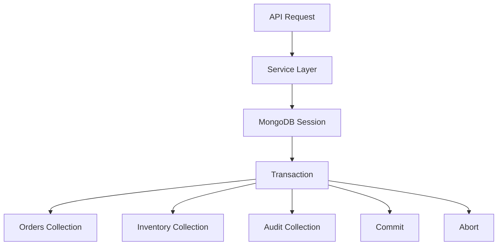
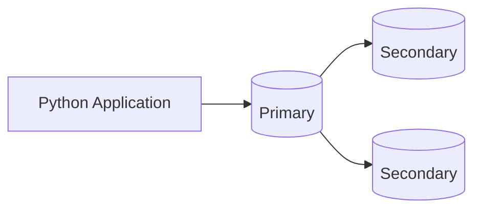

# 09- Transactions in Python

## Overview

MongoDB transactions provide atomicity across multiple documents and collections when a business operation cannot be represented safely as a single-document update.

MongoDB already provides atomicity for operations against an individual document. Multi-document transactions extend that atomicity across multiple documents, collections, and, where supported by the deployment topology, databases.

For Python backend systems, transactions should be treated as a correctness mechanism rather than a default replacement for MongoDB's document-oriented modeling approach.

A good MongoDB design often prefers:

```text
Good document model
        ↓
Single-document atomic operation
        ↓
No transaction required
```

Use a transaction when the business invariant genuinely spans multiple documents:

```text
Business operation
        ↓
Multiple MongoDB writes
        ↓
All must succeed
        ↓
Commit
```

or:

```text
Business operation
        ↓
One operation fails
        ↓
Abort
        ↓
No partial transaction result
```

Transactions are especially relevant for workflows such as:

- Order creation with separate inventory and audit documents
- Financial ledger updates
- Account transfers
- Multi-document state transitions
- Consistent metadata updates
- Cross-collection business invariants

They also introduce costs and operational complexity. Long-running transactions can increase resource usage, contention, replication pressure, and application latency.

## MongoDB Atomicity Model

MongoDB provides atomicity at the single-document level.

For example:

```javascript
db.accounts.updateOne(
  { _id: "account-123" },
  {
    $inc: { balance: -100 },
    $set: { updated_at: new Date() }
  }
)
```

The update to that document is atomic.

If the business operation can be modeled as one document, this is generally preferable to introducing a transaction.

### Single-Document Atomicity

Consider an order document:

```json
{
  "_id": "order-1001",
  "status": "confirmed",
  "payment": {
    "status": "captured",
    "amount": 4999
  },
  "updated_at": "2026-09-22T10:00:00Z"
}
```

Changing all of these fields together can be done atomically.

A transaction is unnecessary simply because the document contains multiple fields.

## When Transactions Are Required

Transactions become useful when a business operation spans multiple documents and partial completion would violate a business invariant.

Example:

```text
Create order
    +
Reserve inventory
    +
Create audit record
```

If the order is created but inventory reservation fails, the system may become inconsistent.

A transaction can provide:

```text
BEGIN
 ↓
Create order
 ↓
Reserve inventory
 ↓
Create audit record
 ↓
COMMIT
```

If any transactional operation fails:

```text
BEGIN
 ↓
Create order
 ↓
Reserve inventory
 ↓
Failure
 ↓
ABORT
```

## When Not to Use a Transaction

Do not automatically use transactions for every sequence of MongoDB operations.

A transaction may be unnecessary when:

- One document can represent the invariant
- Eventual consistency is acceptable
- Operations are naturally independent
- An asynchronous workflow is more appropriate
- A transaction would remain open while waiting for external systems

A useful decision process is:

```text
Can the invariant fit in one document?
        │
       Yes
        ↓
Use atomic document operation
        │
       No
        ↓
Can the workflow tolerate eventual consistency?
        │
     Yes ──────→ Use workflow/event pattern
        │
       No
        ↓
Use a transaction
```

## Transactions vs Relational Transactions

MongoDB transactions provide familiar ACID semantics, but MongoDB's document model changes how they should be used.

| Concern | MongoDB | Relational database |
|---|---|---|
| Single-record/document atomicity | Native | Native row-level transaction semantics |
| Multi-record transaction | Supported | Core database feature |
| Data modeling | Document-oriented | Relational |
| Preferred consistency boundary | Often document | Often transaction |
| Denormalization | Common | Less common |
| Transactions | Use when invariants cross documents | Common for multi-row operations |
| Joins | Possible through aggregation | Core relational operation |
| Schema design | Access-pattern driven | Relation/normalization driven |

MongoDB transactions should not be used to recreate a relational schema that could instead be modeled effectively as a document.

## Transaction Architecture

A Python application typically follows:



The service layer should generally own the business transaction boundary rather than individual repository methods.

## Sessions

MongoDB transactions are associated with a client session.

In PyMongo:

```python
with client.start_session() as session:
    with session.start_transaction():
        ...
```

A session provides the logical context required for transactional operations.

The session must be passed to operations that participate in the transaction.

Example:

```python
collection.update_one(
    {"_id": order_id},
    {"$set": {"status": "confirmed"}},
    session=session,
)
```

If the `session` argument is omitted, that operation does not participate in the transaction.

## Transaction Lifecycle

A transaction has a lifecycle similar to:

```text
Session created
     ↓
Transaction started
     ↓
MongoDB operations
     ↓
Commit
     │
     └── or ──→ Abort
```

Application-level transaction design should explicitly define:

- What starts the transaction
- Which operations belong to it
- What constitutes success
- What constitutes failure
- Which exceptions should trigger retry
- Which exceptions should surface to the caller

## Basic PyMongo Transaction

```python
from pymongo import MongoClient

client = MongoClient(
    "mongodb://localhost:27017",
    retryWrites=True,
)

db = client["orders"]

with client.start_session() as session:
    with session.start_transaction():
        db.orders.insert_one(
            {
                "_id": "order-1001",
                "status": "confirmed",
            },
            session=session,
        )

        db.audit.insert_one(
            {
                "order_id": "order-1001",
                "event": "order_created",
            },
            session=session,
        )
```

If the transaction block exits successfully, the transaction is committed.

If an exception causes the transaction context to exit, the transaction is aborted.

## Explicit Commit and Abort

Explicit transaction control is useful when transaction behavior must be handled carefully.

```python
with client.start_session() as session:
    session.start_transaction()

    try:
        db.orders.insert_one(
            {"_id": "order-1001"},
            session=session,
        )

        db.audit.insert_one(
            {
                "order_id": "order-1001",
                "event": "created",
            },
            session=session,
        )

        session.commit_transaction()

    except Exception:
        session.abort_transaction()
        raise
```

For most application code, the context-manager approach is simpler and less error-prone.

## Transaction Options

PyMongo allows transaction behavior to be configured using options such as:

- `read_concern`
- `write_concern`
- `read_preference`
- `max_commit_time_ms`

Example:

```python
from pymongo import ReadConcern, WriteConcern
from pymongo.read_preferences import Primary

with client.start_session() as session:
    with session.start_transaction(
        read_concern=ReadConcern("snapshot"),
        write_concern=WriteConcern("majority"),
        read_preference=Primary(),
    ):
        ...
```

The exact combination should be chosen based on consistency and durability requirements.

## Read Concern

Read concern controls the consistency characteristics of data read by MongoDB operations.

Common levels include:

| Read concern | General purpose |
|---|---|
| `local` | Read locally available data |
| `available` | Read available data with minimal consistency guarantees |
| `majority` | Read data acknowledged by a majority where supported |
| `snapshot` | Transaction-consistent snapshot reads |

Transaction design often uses `snapshot` semantics when a consistent view of transactional data is required.

## Write Concern

Write concern determines how much acknowledgment the client requires for a write.

A common production configuration is:

```python
from pymongo import WriteConcern

write_concern = WriteConcern(w="majority")
```

`majority` generally provides stronger durability guarantees than unacknowledged writes, assuming the deployment and configuration support the required semantics.

Do not choose write concern solely for performance.

Evaluate:

- Durability requirements
- Failure scenarios
- Replication topology
- Latency requirements
- Business impact of acknowledged vs unacknowledged writes

## Read Preference

Transactions generally require operations to use the primary for transactional writes.

Example:

```python
from pymongo.read_preferences import Primary

with client.start_session() as session:
    with session.start_transaction(
        read_preference=Primary(),
    ):
        ...
```

Do not attempt to design a write transaction around arbitrary secondary reads.

For transaction correctness, understand how read preference interacts with the replica-set topology.

## Transactional Read Consistency

Suppose a transaction reads:

```text
Order
Inventory
Payment
```

The transaction may require a consistent view of these documents.

Snapshot-style transactional reads prevent the transaction from observing an arbitrary mixture of database states.

This matters for business invariants such as:

```text
Available inventory >= quantity ordered
```

## Transactional Write Atomicity

Suppose a transaction performs:

```text
Update inventory
Create order
Create payment record
```

If the transaction commits:

```text
All changes visible
```

If it aborts:

```text
None of the transactional changes are committed
```

This is the key atomicity guarantee.

## Example: Inventory Reservation

A production-style workflow could look like:

```text
POST /orders
     ↓
Validate request
     ↓
Start transaction
     ↓
Check inventory
     ↓
Reserve inventory
     ↓
Create order
     ↓
Create audit record
     ↓
Commit
     ↓
Return response
```

Python example:

```python
from pymongo import ReturnDocument


class OrderService:
    def __init__(self, client):
        self.client = client
        self.db = client["commerce"]

    def create_order(self, order_id, product_id, quantity):
        with self.client.start_session() as session:
            with session.start_transaction():
                inventory = self.db.inventory.find_one_and_update(
                    {
                        "product_id": product_id,
                        "available": {"$gte": quantity},
                    },
                    {
                        "$inc": {
                            "available": -quantity,
                            "reserved": quantity,
                        }
                    },
                    return_document=ReturnDocument.AFTER,
                    session=session,
                )

                if inventory is None:
                    raise ValueError("Insufficient inventory")

                self.db.orders.insert_one(
                    {
                        "_id": order_id,
                        "product_id": product_id,
                        "quantity": quantity,
                        "status": "reserved",
                    },
                    session=session,
                )

                self.db.audit.insert_one(
                    {
                        "order_id": order_id,
                        "event": "inventory_reserved",
                    },
                    session=session,
                )
```

The inventory reservation and order creation are committed together.

## Transaction Boundary in the Service Layer

A strong architecture is:

```text
API
 ↓
Service
 ├── begin transaction
 ├── Repository A
 ├── Repository B
 ├── Repository C
 └── commit
```

Avoid this:

```text
API
 ↓
Repository A → starts transaction
Repository B → starts another transaction
Repository C → starts another transaction
```

Repositories should generally perform database operations while the service layer owns the business transaction.

## Passing Sessions Through Repositories

Example:

```python
class OrderRepository:
    def __init__(self, collection):
        self.collection = collection

    def create(self, order, session=None):
        return self.collection.insert_one(
            order,
            session=session,
        )


class InventoryRepository:
    def __init__(self, collection):
        self.collection = collection

    def reserve(self, product_id, quantity, session=None):
        return self.collection.update_one(
            {
                "product_id": product_id,
                "available": {"$gte": quantity},
            },
            {
                "$inc": {
                    "available": -quantity,
                }
            },
            session=session,
        )
```

The service coordinates them:

```python
with client.start_session() as session:
    with session.start_transaction():
        inventory_repo.reserve(
            product_id,
            quantity,
            session=session,
        )

        order_repo.create(
            order,
            session=session,
        )
```

This keeps transaction ownership explicit.

## Avoid Hidden Transactions

A repository should not silently create a transaction for every method.

Bad:

```python
class OrderRepository:
    def create(self, order):
        with client.start_session() as session:
            with session.start_transaction():
                ...
```

This makes composition difficult.

A service may need:

```text
OrderRepository
+
InventoryRepository
+
AuditRepository
```

to participate in one transaction.

The caller should therefore control the transaction boundary.

## Transactions and External Services

Do not keep a MongoDB transaction open while calling external services.

Bad:

```text
BEGIN TRANSACTION
    ↓
MongoDB write
    ↓
HTTP payment API
    ↓
Wait 2 seconds
    ↓
MongoDB write
    ↓
COMMIT
```

The external call increases transaction duration and introduces failure modes outside MongoDB's transaction.

Prefer patterns such as:

```text
Validate
 ↓
External operation
 ↓
MongoDB transaction
 ↓
Commit
```

or use an asynchronous workflow when strict atomicity across systems is impossible.

## MongoDB Transactions Are Not Distributed Transactions

Consider:

```text
MongoDB
   +
PostgreSQL
   +
Kafka
   +
External Payment API
```

A MongoDB transaction cannot make all of these systems commit atomically.

For example:

```text
MongoDB transaction COMMIT
        +
Kafka publish
```

does not automatically become one atomic operation.

For cross-system consistency, consider:

- Transactional outbox
- Idempotent consumers
- Saga patterns
- Retryable workflows
- Event-driven architecture

## Transactional Outbox

A common architecture is:

```text
MongoDB Transaction
 ├── Update business document
 └── Insert outbox event
            ↓
       Transaction commits
            ↓
     Outbox processor
            ↓
          Kafka
```

Example:

```python
with client.start_session() as session:
    with session.start_transaction():
        db.orders.update_one(
            {"_id": order_id},
            {"$set": {"status": "confirmed"}},
            session=session,
        )

        db.outbox.insert_one(
            {
                "event_type": "order.confirmed",
                "aggregate_id": order_id,
                "payload": {
                    "order_id": order_id,
                },
                "status": "pending",
            },
            session=session,
        )
```

The business state and outbox record commit together.

A separate worker publishes the event.

## Transaction Retryability

Distributed systems can experience transient failures during transaction execution or commit.

Examples:

- Primary election
- Network interruption
- Temporary server error
- Transient transaction error

Some MongoDB errors are explicitly labeled as retryable.

Application code should not blindly retry every exception.

Retry behavior must distinguish:

```text
Transient transaction error
        ↓
Potential retry
```

from:

```text
Validation error
        ↓
Do not retry
```

or:

```text
Business rule violation
        ↓
Do not retry
```

## Transaction Retry Pattern

A bounded retry loop can be implemented around the transaction.

```python
from pymongo.errors import PyMongoError


def run_transaction(client, operation, max_attempts=3):
    for attempt in range(max_attempts):
        try:
            with client.start_session() as session:
                with session.start_transaction():
                    return operation(session)

        except PyMongoError:
            if attempt == max_attempts - 1:
                raise
```

This is only a simplified structure.

Production retry handling should inspect MongoDB error labels and distinguish transient transaction errors from permanent failures.

## Retry the Whole Transaction

When a transaction must be retried, retry the transaction's logical unit rather than randomly repeating individual operations.

Conceptually:

```text
Transaction attempt
    ↓
Operation A
    ↓
Operation B
    ↓
Transient failure
    ↓
Abort
    ↓
New transaction attempt
    ↓
Operation A
    ↓
Operation B
    ↓
Commit
```

Do not independently retry individual writes without understanding their idempotency and transaction state.

## Commit Uncertainty

A particularly important distributed-systems issue is uncertain commit outcome.

Consider:

```text
Transaction
    ↓
COMMIT
    ↓
Network connection fails
```

The client may not immediately know whether MongoDB committed the transaction.

The correct recovery strategy is not necessarily to blindly execute the business operation again.

Use MongoDB driver's transaction retry mechanisms and error labels where applicable.

This is especially important for operations involving:

- Payments
- Account balances
- Inventory
- Unique business identifiers

## Idempotency

Transaction retries increase the importance of idempotent business operations.

For example, use a stable order ID:

```python
{
    "_id": "order-1001"
}
```

rather than generating a completely new business identifier on every retry.

A unique identifier can prevent accidental duplicate logical entities.

## Transaction Lifetime

Keep transactions short.

Good:

```text
BEGIN
 ↓
2-3 indexed MongoDB operations
 ↓
COMMIT
```

Risky:

```text
BEGIN
 ↓
Large aggregation
 ↓
External HTTP call
 ↓
Application processing
 ↓
Large loop
 ↓
Multiple writes
 ↓
COMMIT
```

Long transactions can:

- Increase resource usage
- Increase latency
- Increase contention
- Increase abort probability
- Complicate retry behavior
- Increase operational risk

## Transaction Size and Workload

Do not use transactions as a replacement for bulk processing.

For large workloads, consider:

- Bulk writes
- Batching
- Idempotent processing
- Change streams
- Background jobs
- Event-driven workflows

A transaction should represent a bounded business operation, not an entire ETL job.

## Indexing Inside Transactions

Indexes remain important inside transactions.

For example:

```python
db.inventory.update_one(
    {
        "product_id": product_id,
        "available": {"$gte": quantity},
    },
    {
        "$inc": {"available": -quantity},
    },
    session=session,
)
```

The filter should have an appropriate index for the workload.

Potential index:

```javascript
db.inventory.createIndex({
  product_id: 1,
  available: 1
})
```

The exact index should be selected from the actual query shape and workload.

## Transaction Performance

Transactions introduce additional coordination compared with independent document operations.

Potential costs include:

- Session management
- Snapshot/transaction semantics
- Additional server-side state
- Commit coordination
- Replication requirements
- Retry complexity

This does not mean transactions are inherently slow.

It means they should be used where their consistency guarantees justify their cost.

## Write Concern and Transactions

Transaction durability is affected by write concern.

For example:

```python
from pymongo import WriteConcern

with client.start_session() as session:
    with session.start_transaction(
        write_concern=WriteConcern(w="majority")
    ):
        ...
```

For production financial or inventory workflows, durability requirements should be explicit rather than inherited accidentally from defaults.

## Majority Write Concern

A majority write concern asks MongoDB to acknowledge writes after they have been replicated to a majority according to the deployment's voting configuration.

This can improve durability against certain failures.

Trade-off:

```text
Stronger durability
        ↓
Potentially higher write latency
```

Do not assume `majority` is universally required or universally sufficient. Evaluate it against the application's recovery requirements and deployment topology.

## Transactions and Replica Sets

MongoDB transactions depend on deployment topology and MongoDB version.

For production deployments, use a supported replica-set or sharded-cluster architecture appropriate for transactions.

A typical replica set:



The primary processes transactional writes while replication provides durability and high availability.

## Transactions During Elections

Consider:

```text
Transaction running
       ↓
Primary election
       ↓
Connection interruption
       ↓
Transaction may abort
       ↓
Driver/application handles retry where appropriate
```

A production service must therefore treat transaction failure during topology changes as an expected distributed-systems condition.

Do not assume an active transaction survives a primary election unchanged.

## Transactions and Sharding

Transactions can also be used in sharded deployments subject to MongoDB's supported topology and transaction constraints.

However, distributed transactions across shards introduce additional coordination.

Consider:

```text
Application
    ↓
mongos
    ├── Shard A
    └── Shard B
```

A transaction touching multiple shards can be more expensive than a transaction confined to one shard.

This reinforces the importance of:

- Good shard-key design
- Targeted queries
- Avoiding unnecessary cross-shard operations
- Short transaction duration

## Transaction Anti-Patterns

### Transaction for One Document

Bad:

```text
BEGIN
 ↓
Update one document
 ↓
COMMIT
```

If the operation is already atomic, the transaction adds unnecessary complexity.

### Transaction Around an External API

Bad:

```text
BEGIN
 ↓
MongoDB update
 ↓
REST API
 ↓
COMMIT
```

The external API should not be part of the MongoDB transaction boundary.

### Large Transaction

Bad:

```text
BEGIN
 ↓
Process 100,000 documents
 ↓
COMMIT
```

Use batching or an appropriate processing architecture.

### Unindexed Transaction Queries

Bad:

```text
BEGIN
 ↓
COLLSCAN
 ↓
Update
 ↓
COMMIT
```

Long-running queries make transactions longer and increase resource consumption.

### Hidden Transaction Boundaries

Repositories silently creating transactions make multi-repository business workflows difficult to compose.

### Blind Retry

Retrying every exception can cause:

- Duplicate logical operations
- Increased database load
- Retry storms
- Incorrect business outcomes

Retry only when the error is appropriate for retry.

## FastAPI Integration

A FastAPI service can place transaction coordination in its service layer.

Architecture:

```text
FastAPI endpoint
       ↓
OrderService
       ↓
MongoDB session
       ↓
Transaction
 ┌─────┼─────┐
 ↓     ↓     ↓
Order Inventory Outbox
```

Example:

```python
from fastapi import HTTPException


class OrderService:
    def __init__(self, client):
        self.client = client
        self.db = client["commerce"]

    def create_order(self, order):
        try:
            with self.client.start_session() as session:
                with session.start_transaction():
                    inventory = self.db.inventory.find_one_and_update(
                        {
                            "product_id": order["product_id"],
                            "available": {
                                "$gte": order["quantity"]
                            },
                        },
                        {
                            "$inc": {
                                "available": -order["quantity"]
                            }
                        },
                        session=session,
                    )

                    if inventory is None:
                        raise ValueError("Insufficient inventory")

                    self.db.orders.insert_one(
                        order,
                        session=session,
                    )

        except ValueError as exc:
            raise HTTPException(
                status_code=409,
                detail=str(exc),
            ) from exc
```

The API layer should translate business failures into HTTP responses rather than embedding transaction logic throughout endpoint handlers.

## Async Python Transactions

With current PyMongo async APIs, the transaction model is conceptually similar but uses asynchronous operations.

Example:

```python
from pymongo import AsyncMongoClient


async def create_order(client, order):
    db = client["commerce"]

    async with await client.start_session() as session:
        async with session.start_transaction():
            await db.orders.insert_one(
                order,
                session=session,
            )

            await db.audit.insert_one(
                {
                    "order_id": order["_id"],
                    "event": "created",
                },
                session=session,
            )
```

Use the asynchronous client when the surrounding application is genuinely asynchronous.

Do not mix synchronous blocking database operations into an async request path without a deliberate reason.

## Django Integration

Django + MongoDB transaction handling depends on the MongoDB integration approach.

When using direct PyMongo:

```text
Django View / API
      ↓
Service Layer
      ↓
MongoClient
      ↓
Session
      ↓
Transaction
```

Do not assume that Django's relational `transaction.atomic()` semantics automatically map to PyMongo transactions.

If using a MongoDB-specific Django integration, verify the supported transaction behavior of the exact backend version.

The MongoDB transaction boundary should be based on the actual database client and integration layer being used.

## Background Jobs

Celery jobs are good candidates for transaction-based MongoDB operations when a job needs to update several related documents atomically.

Example:

```text
Celery task
    ↓
Start session
    ↓
Transaction
 ├── Update job state
 ├── Update business document
 └── Write audit event
    ↓
Commit
```

Keep the transaction limited to database work.

Do not hold the transaction while waiting on another service.

## Testing Transactions

Transaction behavior should be tested against a MongoDB environment that supports the required transaction topology.

A test should verify:

```text
Successful transaction
    ↓
All changes exist
```

and:

```text
Failure during transaction
    ↓
No transactional changes remain
```

Example:

```python
def test_order_transaction_rolls_back(client, db):
    service = OrderService(client)

    try:
        service.create_order_with_failure(...)
    except RuntimeError:
        pass

    assert db.orders.find_one({
        "_id": "order-1001"
    }) is None

    assert db.audit.find_one({
        "order_id": "order-1001"
    }) is None
```

The exact test setup should use a transaction-capable MongoDB deployment rather than assuming an isolated standalone server provides equivalent behavior.

## Testing Failure Scenarios

Do not test only the happy path.

Test:

- Duplicate identifiers
- Insufficient inventory
- Validation failures
- Transient transaction errors
- Primary election
- Network interruption
- Transaction timeout
- Commit uncertainty
- Application cancellation
- Retry behavior

The goal is to verify both database correctness and application behavior.

## Observability

Transaction monitoring should include:

- Transaction duration
- Transaction abort rate
- Commit failures
- Retry count
- MongoDB operation latency
- Query latency
- Lock/contention indicators where applicable
- Connection pool saturation
- Replication lag
- Application request latency

A useful trace is:

```text
HTTP request
    ↓
Service transaction
    ├── inventory.update
    ├── orders.insert
    ├── audit.insert
    └── commit
```

Distributed tracing makes it easier to identify which transactional operation is consuming time.

## Logging

Do not log sensitive transaction payloads indiscriminately.

Prefer structured metadata:

```python
logger.info(
    "order_transaction_completed",
    extra={
        "order_id": order_id,
        "transaction_type": "create_order",
    },
)
```

Avoid logging:

- Passwords
- Tokens
- Payment credentials
- Full sensitive documents
- Connection strings

## Metrics

Useful metrics include:

| Metric | Purpose |
|---|---|
| Transaction duration | Detect long transactions |
| Transaction abort count | Detect failures |
| Commit failure count | Detect commit problems |
| Transaction retries | Detect transient failures |
| MongoDB latency | Database performance |
| Pool wait time | Connection pressure |
| Replication lag | HA health |
| API latency | User-visible impact |

## Security Considerations

Transactions do not provide authorization.

A user authorized to perform an operation should be checked before executing the transaction.

Example:

```text
HTTP request
    ↓
Authentication
    ↓
Authorization
    ↓
Validate business rules
    ↓
Start transaction
```

Do not rely on a transaction to prevent unauthorized writes.

Use:

- TLS
- Least-privilege MongoDB users
- Secret management
- Network restrictions
- Credential rotation
- Application authorization
- Input validation

## Performance Considerations

Transaction performance is affected by:

- Number of operations
- Query execution time
- Index quality
- Network latency
- Write concern
- Replication
- Transaction duration
- Number of documents
- Number of shards
- Contention

The most important optimization is often reducing the amount of work inside the transaction.

Prefer:

```text
Prepare
 ↓
Short transaction
 ↓
Commit
```

over:

```text
Long transaction
 ↓
Multiple unrelated operations
 ↓
External work
 ↓
Commit
```

## Capacity Planning

Transactions can increase database resource usage.

Monitor:

- Active connections
- Transaction counts
- Transaction duration
- Lock/contention metrics
- CPU
- Memory
- Disk
- Replication lag

If transaction volume grows significantly, re-evaluate whether the data model still represents the business invariant efficiently.

## High Availability

For high availability:

- Use a production-supported replica-set or sharded deployment.
- Configure appropriate write concern.
- Test transaction behavior during elections.
- Monitor replication lag.
- Handle transient transaction errors.
- Keep transactions short.
- Use bounded retries.

A transaction does not eliminate failure. It provides defined atomicity when failures occur within the transaction's supported semantics.

## Disaster Recovery

Transactions improve consistency during normal operations but are not a substitute for backups.

A production MongoDB system still requires:

- Backup strategy
- Restore testing
- Point-in-time recovery where required
- Defined RPO
- Defined RTO
- Disaster recovery procedures

If a transaction commits corrupted business data, the transaction itself cannot restore the previous correct state.

## Operational Troubleshooting

### Transaction Aborts Unexpectedly

```text
Symptom
↓
Transaction fails or aborts
↓
Possible causes
    - Transient transaction error
    - Write conflict
    - Primary election
    - Network interruption
    - Validation failure
    - Transaction lifetime exceeded
    - Unsupported operation
↓
Isolation strategy
↓
Inspect MongoDB error code and error labels
↓
Inspect server logs
↓
Inspect transaction duration
↓
Inspect replica-set health
↓
Root cause
↓
Corrective action
    - Retry eligible transient transactions
    - Fix conflicting writes
    - Optimize transaction
    - Correct unsupported operation
↓
Prevention
    - Bounded transaction scope
    - Proper indexes
    - Failure testing
```

### Transaction Is Too Slow

```text
Symptom
↓
Transaction duration is high
↓
Possible causes
    - Slow query
    - Missing index
    - Too many operations
    - Large document processing
    - External API inside transaction
    - Cross-shard transaction
    - Network latency
↓
Isolation strategy
↓
Measure each operation inside the transaction
↓
Run explain on representative queries
↓
Inspect database metrics
↓
Root cause
↓
Corrective action
    - Add or improve indexes
    - Reduce transaction scope
    - Move external work outside transaction
    - Split workflow
↓
Prevention
    - Transaction duration monitoring
    - Query performance testing
```

### Duplicate Results After Retry

```text
Symptom
↓
Retry appears to create duplicate business data
↓
Possible causes
    - Non-idempotent operation
    - Blind retry
    - New business ID generated per attempt
    - Commit outcome uncertainty
↓
Isolation strategy
↓
Inspect transaction retry logic
↓
Check business identifiers
↓
Check unique indexes
↓
Inspect MongoDB error labels
↓
Root cause
↓
Corrective action
    - Use stable idempotency keys
    - Retry only eligible failures
    - Add appropriate uniqueness constraints
↓
Prevention
    - Idempotent transaction design
    - Failure-injection tests
```

### Partial Data Appears After Failure

```text
Symptom
↓
Some expected transaction changes exist while others do not
↓
Possible causes
    - Operations were not part of the same session
    - Transaction was not actually started
    - One operation omitted session=session
    - Writes occurred before or after transaction
↓
Isolation strategy
↓
Review every MongoDB operation
↓
Verify session propagation
↓
Verify transaction lifecycle
↓
Root cause
↓
Corrective action
    - Pass the same session to all transactional operations
    - Move transaction ownership to service layer
↓
Prevention
    - Repository APIs accepting session
    - Transaction integration tests
```

## Common Mistakes

| Mistake | Why it happens | Better approach |
|---|---|---|
| Transaction for one document | Treating MongoDB like a relational database | Use single-document atomicity |
| Long transaction | Too much work inside transaction | Keep scope small |
| External API inside transaction | Confusing business workflow with DB atomicity | Use outbox/Saga patterns |
| Missing `session=` | Session not propagated | Make session explicit in repositories |
| Blind retries | Treating every error as transient | Inspect retryable error semantics |
| No indexes | Assuming transaction makes queries efficient | Index transactional query paths |
| Large batch transaction | Using transaction for bulk processing | Batch and process incrementally |
| Hidden transaction in repository | Poor transaction ownership | Let service layer define boundary |
| Ignoring write concern | Treating commit as equivalent to durability | Choose write concern intentionally |
| Testing only success | Missing distributed failure modes | Test aborts, elections, retries, and uncertainty |

## Production Checklist

### Transaction Design

- [ ] Prefer single-document atomicity where possible.
- [ ] Use transactions only when invariants cross documents.
- [ ] Keep transaction scope small.
- [ ] Keep transactions free of external API calls.
- [ ] Avoid large batch transactions.
- [ ] Define transaction ownership at the service layer.

### Python Implementation

- [ ] Reuse a long-lived `MongoClient`.
- [ ] Create a session for transactional work.
- [ ] Pass the same session to every transactional operation.
- [ ] Propagate exceptions correctly.
- [ ] Use bounded and error-aware retries.
- [ ] Keep repository methods transaction-aware without owning the transaction.

### Performance

- [ ] Index transactional query filters.
- [ ] Measure transaction duration.
- [ ] Monitor abort rates.
- [ ] Avoid unnecessary operations inside transactions.
- [ ] Investigate slow queries before increasing infrastructure capacity.

### Reliability

- [ ] Configure appropriate read/write concerns.
- [ ] Test primary elections.
- [ ] Test transient failures.
- [ ] Test commit uncertainty.
- [ ] Make business operations idempotent where retries are possible.
- [ ] Monitor replication health.

### Security

- [ ] Authenticate clients securely.
- [ ] Use TLS in production.
- [ ] Use least-privilege MongoDB roles.
- [ ] Validate authorization before transactional work.
- [ ] Keep credentials in secret management systems.

## Interview Considerations

### Why does MongoDB support transactions if documents are already atomic?

Single-document atomicity is sufficient when the business invariant fits inside one document. Transactions are needed when the invariant spans multiple documents or collections.

### When should you avoid a MongoDB transaction?

Avoid it when:

- A single-document atomic update is sufficient.
- Eventual consistency is acceptable.
- The workflow is naturally asynchronous.
- The transaction would remain open for external calls.
- A large batch operation can be processed more efficiently without one transaction.

### What is the role of a MongoDB session?

A session provides the logical context required to associate operations with a transaction and supports related client-side database semantics.

### Why must `session=session` be passed to every operation?

Because only operations associated with the transaction's session participate in that transaction.

For example:

```python
with client.start_session() as session:
    with session.start_transaction():
        collection_a.insert_one(doc_a, session=session)
        collection_b.insert_one(doc_b, session=session)
```

Omitting the session from `collection_b` means that operation is not part of the transaction.

### Where should the transaction boundary live?

Usually in the service layer.

The service understands the complete business operation:

```text
Service
 ├── Repository A
 ├── Repository B
 └── Repository C
```

and can coordinate all of them within one transaction.

### Can MongoDB transactions span different collections?

Yes. Transactions can atomically coordinate operations across multiple collections, subject to MongoDB's deployment and transaction constraints.

### Can a MongoDB transaction include PostgreSQL or Kafka?

No. A MongoDB transaction does not provide distributed atomicity across independent systems.

Use patterns such as:

- Transactional outbox
- Saga
- Idempotent consumers
- Retryable workflows

### What happens if the primary changes during a transaction?

The transaction may be interrupted or aborted. The driver and application must handle transient transaction errors and retry eligible transaction attempts according to MongoDB's transaction semantics.

### Why should transactions be short?

Long transactions consume resources for longer, increase contention and latency, complicate failure handling, and can increase the probability of transaction aborts.

### How would you design an order transaction?

A typical design could be:

```text
Validate request
     ↓
Start transaction
     ↓
Atomically reserve inventory
     ↓
Create order
     ↓
Create outbox event
     ↓
Commit
     ↓
Return success
```

A separate event processor can then publish the outbox event to Kafka or another messaging system.

## Key Takeaways

- **MongoDB transactions should be used when a business invariant spans multiple documents; prefer single-document atomicity whenever the data model allows it.**
- **In Python, create a session, start the transaction at the service layer, and pass the same `session` to every MongoDB operation that must participate.**
- **Keep transactions short, indexed, and free of external network calls; long transactions increase latency, contention, resource usage, and failure complexity.**
- **Transaction retries require distributed-systems thinking: distinguish transient errors from permanent failures, use bounded retries, and design business operations to be idempotent.**
- **MongoDB transactions provide atomicity inside MongoDB, not across MongoDB, PostgreSQL, Kafka, or external APIs; use patterns such as transactional outbox or Saga for cross-system workflows.**