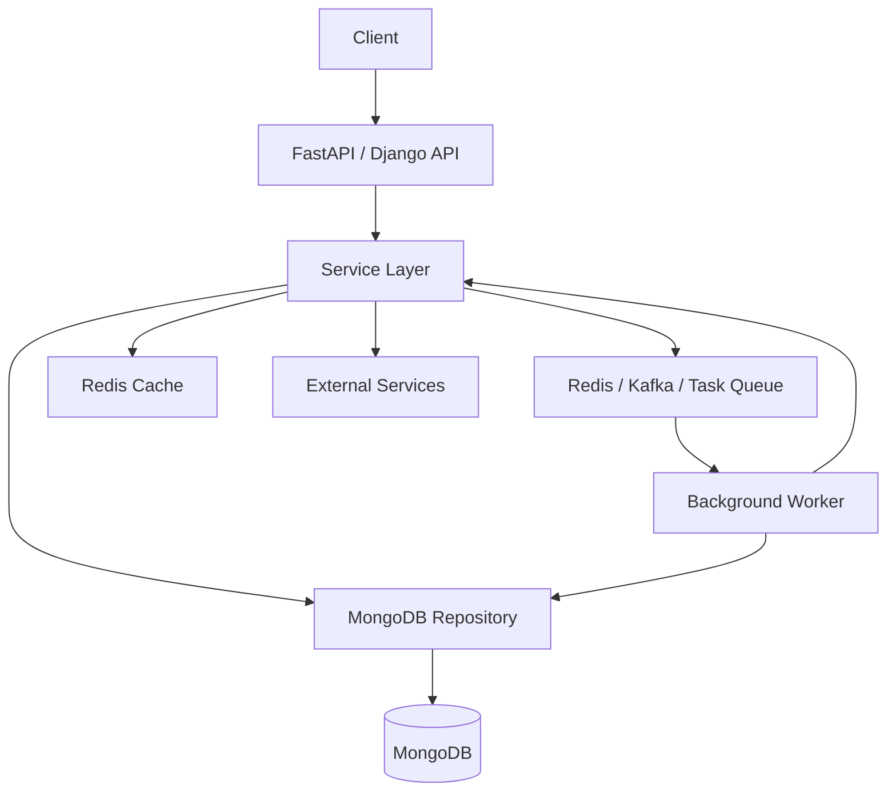
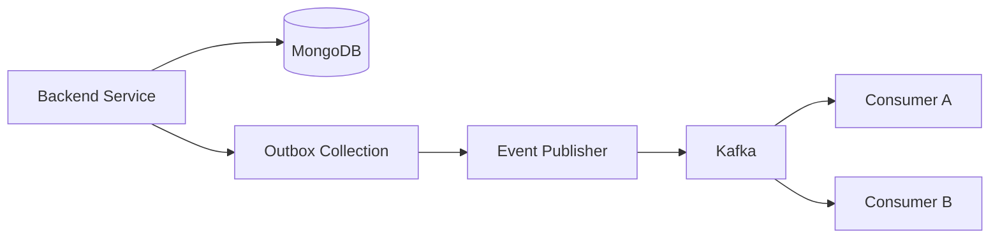
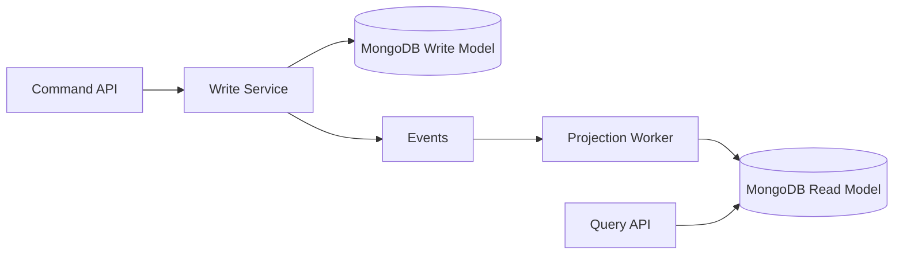
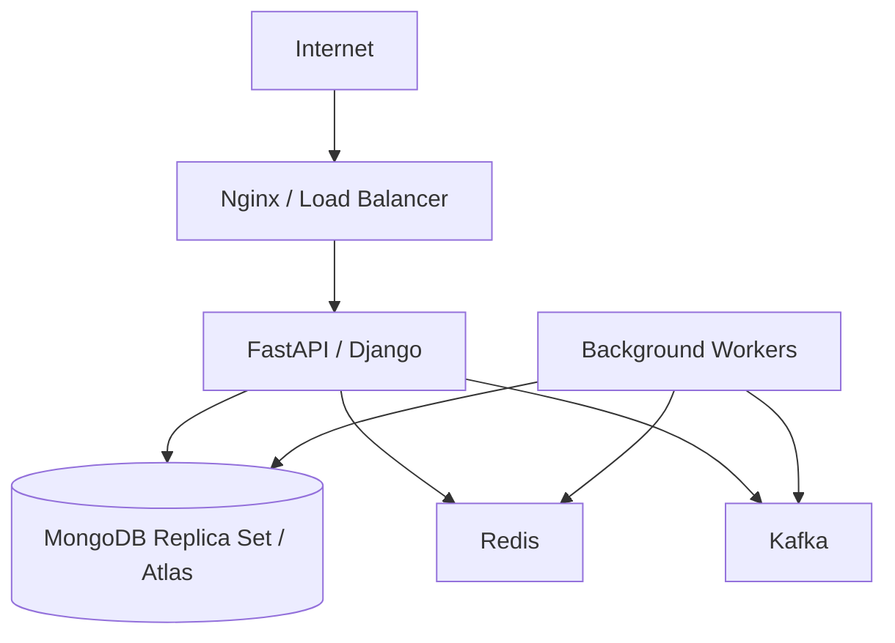

# 12- MongoDB Integration Patterns

## Overview

MongoDB integration patterns define how backend applications, services, workers, and infrastructure interact with MongoDB in production.

The important engineering question is not simply:

```text
How do I connect Python to MongoDB?
```

It is:

```text
Where should MongoDB access live?
How should connections be managed?
Who owns transactions?
How should failures be retried?
How should data access be tested?
How should MongoDB scale with the application?
```

A production MongoDB integration typically separates concerns:



The goal is to keep:

- Business logic independent from low-level MongoDB operations
- MongoDB connections efficiently managed
- Transaction boundaries explicit
- Queries testable
- Failures recoverable
- Performance measurable
- Security enforceable
- Application scaling compatible with database capacity

## Integration Patterns at a Glance

| Pattern | Primary responsibility | Typical use |
|---|---|---|
| Direct PyMongo access | Simple database integration | Small services, scripts |
| Repository pattern | Isolate persistence | Production APIs |
| Service + repository | Separate business and data logic | Complex applications |
| Unit of Work | Coordinate transaction scope | Multi-repository transactions |
| Dependency injection | Manage lifecycle and testing | FastAPI, service architectures |
| Background worker | Async processing | Celery, task queues |
| Change stream consumer | React to MongoDB changes | Event-driven systems |
| Transactional outbox | Publish reliable domain events | MongoDB + Kafka |
| CQRS/read model | Separate write and read concerns | High-scale systems |
| Cache-aside | Reduce database reads | Redis + MongoDB |
| Bulk processing | Process large datasets | ETL, migrations |
| Saga/workflow | Coordinate distributed systems | Microservices |

## Core Integration Principle

MongoDB should usually be treated as a persistence boundary rather than allowing arbitrary database calls throughout the application.

A maintainable architecture looks like:

```text
HTTP / gRPC
    ↓
Controller
    ↓
Service
    ↓
Repository
    ↓
PyMongo
    ↓
MongoDB
```

The service layer owns business decisions.

The repository owns persistence mechanics.

## Direct PyMongo Integration

For small applications, direct PyMongo access can be appropriate.

Example:

```python
from pymongo import MongoClient

client = MongoClient(
    "mongodb://localhost:27017",
)

db = client["commerce"]
orders = db["orders"]

order = orders.find_one({
    "_id": "order-1001",
})
```

This is simple and has little abstraction overhead.

### Advantages

- Minimal code
- Direct access to MongoDB features
- Easy to understand
- No unnecessary abstraction

### Limitations

As the application grows:

- Database logic spreads across the codebase
- Queries become difficult to locate
- Business logic becomes coupled to persistence
- Testing becomes harder
- Transaction boundaries become unclear

Use direct access for simple applications, utilities, administrative scripts, or isolated data-access components.

## Repository Pattern

The repository pattern encapsulates MongoDB operations.

Example:

```python
from typing import Any


class OrderRepository:
    def __init__(self, collection):
        self.collection = collection

    def get_by_id(
        self,
        order_id: str,
        *,
        session=None,
    ) -> dict[str, Any] | None:
        return self.collection.find_one(
            {"_id": order_id},
            session=session,
        )

    def create(
        self,
        order: dict[str, Any],
        *,
        session=None,
    ):
        return self.collection.insert_one(
            order,
            session=session,
        )
```

The service does not need to know how the query is implemented.

```python
class OrderService:
    def __init__(self, orders: OrderRepository):
        self.orders = orders

    def get_order(self, order_id: str):
        return self.orders.get_by_id(order_id)
```

## Why Repositories Matter

A repository provides a controlled persistence boundary:

```text
Service
   ↓
OrderRepository
   ↓
MongoDB
```

This helps with:

- Query reuse
- Testing
- Transaction propagation
- Index-aware query design
- Persistence isolation
- Refactoring

It should not become a generic wrapper around every MongoDB method.

Bad:

```python
repository.find(...)
repository.update(...)
repository.aggregate(...)
repository.delete(...)
```

This simply recreates the MongoDB API behind another API.

Prefer domain-oriented methods:

```python
orders.find_pending_for_processing()
orders.reserve_order(...)
orders.mark_confirmed(...)
```

## Service Layer

The service layer should own business logic.

Example:

```python
class OrderService:
    def __init__(
        self,
        orders,
        inventory,
        audit,
    ):
        self.orders = orders
        self.inventory = inventory
        self.audit = audit

    def confirm_order(
        self,
        order_id: str,
        *,
        session=None,
    ):
        order = self.orders.get_by_id(
            order_id,
            session=session,
        )

        if order is None:
            raise ValueError("Order not found")

        if order["status"] != "pending":
            raise ValueError("Order cannot be confirmed")

        self.inventory.reserve(
            order["product_id"],
            order["quantity"],
            session=session,
        )

        self.orders.mark_confirmed(
            order_id,
            session=session,
        )
```

The service determines what should happen.

The repository determines how MongoDB performs it.

## Repository vs Service Responsibilities

| Responsibility | Repository | Service |
|---|---:|---:|
| MongoDB query construction | Yes | No |
| Index-aware persistence | Yes | No |
| BSON handling | Yes | Sometimes |
| Business rules | No | Yes |
| Transaction boundary | Usually no | Yes |
| Workflow orchestration | No | Yes |
| External service coordination | No | Yes |
| Domain validation | Usually no | Yes |
| Persistence abstraction | Yes | Consumes it |

## MongoClient Lifecycle

A long-lived `MongoClient` is the normal production pattern.

```python
from pymongo import MongoClient

client = MongoClient(
    mongo_uri,
    maxPoolSize=100,
    minPoolSize=5,
    serverSelectionTimeoutMS=5000,
    connectTimeoutMS=5000,
)

db = client["commerce"]
```

Avoid:

```python
def get_order(order_id):
    client = MongoClient(mongo_uri)
    ...
```

Creating clients repeatedly causes connection churn and unnecessary pool creation.

## Application-Level Client Management

A typical process owns:

```text
Application process
       ↓
MongoClient
       ↓
Connection pools
       ↓
MongoDB servers
```

For multiple application processes:

```text
Process 1 → MongoClient → Pool
Process 2 → MongoClient → Pool
Process 3 → MongoClient → Pool
```

The total connection footprint must be considered during capacity planning.

## Connection Pool Configuration

Important settings include:

| Setting | Purpose |
|---|---|
| `maxPoolSize` | Maximum pooled connections |
| `minPoolSize` | Minimum maintained connections |
| `maxConnecting` | Concurrent connection establishment |
| `maxIdleTimeMS` | Maximum idle connection lifetime |
| `waitQueueTimeoutMS` | Maximum wait for an available connection |
| `serverSelectionTimeoutMS` | Server selection timeout |
| `connectTimeoutMS` | Connection establishment timeout |
| `socketTimeoutMS` | Socket operation timeout |

Do not increase `maxPoolSize` simply because requests are slow.

First determine whether the bottleneck is:

- Query execution
- Database CPU
- Disk I/O
- Network latency
- Connection establishment
- Pool contention
- Application processing

## FastAPI Integration

FastAPI is well suited to dependency injection around MongoDB repositories and services.

A process-level client can be created during application lifespan.

```python
from contextlib import asynccontextmanager

from fastapi import FastAPI
from pymongo import AsyncMongoClient


@asynccontextmanager
async def lifespan(app: FastAPI):
    client = AsyncMongoClient(
        app.state.settings.mongodb_uri,
        serverSelectionTimeoutMS=5000,
    )

    app.state.mongo_client = client
    app.state.mongo_db = client["commerce"]

    try:
        yield
    finally:
        await client.close()


app = FastAPI(lifespan=lifespan)
```

The important principle is lifecycle ownership:

```text
Application startup
    ↓
Create MongoDB client
    ↓
Serve requests
    ↓
Application shutdown
    ↓
Close client
```

## FastAPI Dependency Injection

A repository can be created from application state.

```python
from fastapi import Request


def get_order_repository(request: Request):
    collection = request.app.state.mongo_db["orders"]
    return OrderRepository(collection)
```

An endpoint can consume the repository:

```python
from fastapi import Depends, FastAPI

app = FastAPI()


@app.get("/orders/{order_id}")
async def get_order(
    order_id: str,
    repository: OrderRepository = Depends(
        get_order_repository
    ),
):
    order = repository.get_by_id(order_id)

    if order is None:
        return {"detail": "Not found"}

    return order
```

For an async application, the repository should use the async MongoDB client rather than blocking synchronous PyMongo calls.

## Synchronous vs Asynchronous PyMongo

Current PyMongo provides both synchronous and asynchronous client APIs.

| Application model | Client |
|---|---|
| Synchronous application | `MongoClient` |
| Async application | `AsyncMongoClient` |

Use the client that matches the application's concurrency model.

Do not introduce asynchronous MongoDB access simply because the framework is popular.

The important rule is:

```text
Sync application → sync MongoDB client
Async application → async MongoDB client
```

and avoid blocking the async event loop with synchronous database calls.

## Django Integration

Django applications can integrate MongoDB through:

- Direct PyMongo
- MongoEngine
- MongoDB-specific Django integrations

For direct PyMongo:

```text
Django view / DRF endpoint
        ↓
Service layer
        ↓
Repository
        ↓
PyMongo
        ↓
MongoDB
```

Do not assume Django's native relational ORM semantics automatically apply to MongoDB.

## Django Repository Example

```python
from pymongo import MongoClient


class MongoRepository:
    def __init__(self, collection):
        self.collection = collection

    def get_customer(self, customer_id):
        return self.collection.find_one({
            "_id": customer_id,
        })


client = MongoClient(mongo_uri)
db = client["commerce"]

customer_repository = MongoRepository(
    db["customers"]
)
```

For larger applications, centralize client configuration rather than creating repositories with independently created clients.

## MongoEngine

MongoEngine provides an ODM-style interface over MongoDB.

Example:

```python
from mongoengine import Document, StringField


class Customer(Document):
    name = StringField(required=True)
```

ODM-based integration can be useful when:

- The team prefers model-oriented abstractions
- Application code benefits from document models
- ODM features match the application's needs

Direct PyMongo may be preferable when:

- MongoDB-specific features are important
- Maximum query control is required
- Aggregation-heavy workloads dominate
- The application does not benefit from ODM abstractions

Do not choose an ODM merely because the application uses Django.

## Pydantic and MongoDB

FastAPI applications commonly use Pydantic for API schemas.

MongoDB documents may contain BSON-specific values such as `ObjectId`.

A common architecture is:

```text
MongoDB document
       ↓
Repository
       ↓
Domain/application representation
       ↓
Pydantic response model
       ↓
JSON
```

Do not expose raw BSON types directly without a serialization strategy.

## ObjectId Handling

A document may use:

```python
from bson import ObjectId

document = {
    "_id": ObjectId(),
    "name": "Alice",
}
```

JSON APIs cannot serialize `ObjectId` natively.

An application must define how identifiers are represented at the API boundary.

For example:

```text
MongoDB
ObjectId("...")
       ↓
API serialization
       ↓
"65f..."
```

Keep the persistence representation and API representation conceptually separate.

## Repository Serialization Boundary

A repository may convert persistence-specific values:

```python
def serialize_order(document):
    return {
        "id": str(document["_id"]),
        "status": document["status"],
    }
```

Alternatively, serialization can live in a dedicated mapper or response layer.

The important principle is avoiding BSON leakage throughout the application.

## Transactions with Repository Patterns

Transaction ownership should usually remain at the service layer.

```python
with client.start_session() as session:
    with session.start_transaction():
        orders.create(order, session=session)
        inventory.reserve(
            product_id,
            quantity,
            session=session,
        )
        audit.record(
            event,
            session=session,
        )
```

Repositories accept the session but do not normally create their own transaction.

## Unit of Work Pattern

For complex workflows, a Unit of Work can make transaction ownership explicit.

Conceptually:

```text
Unit of Work
 ├── Session
 ├── Order Repository
 ├── Inventory Repository
 └── Audit Repository
        ↓
     Commit
```

Example:

```python
class MongoUnitOfWork:
    def __init__(self, client, db):
        self.client = client
        self.db = db

    def __enter__(self):
        self.session = self.client.start_session()
        self.session.start_transaction()
        return self

    def __exit__(self, exc_type, exc, traceback):
        try:
            if exc_type is None:
                self.session.commit_transaction()
            else:
                self.session.abort_transaction()
        finally:
            self.session.end_session()
```

Usage:

```python
with MongoUnitOfWork(client, db) as uow:
    uow.db.orders.insert_one(
        order,
        session=uow.session,
    )
```

A Unit of Work can be useful for complex transactional workflows, but it is unnecessary abstraction for simple CRUD services.

## Transaction Boundary

A good transaction boundary represents one business invariant.

Example:

```text
Confirm Order
 ├── Reserve inventory
 ├── Update order
 └── Insert audit event
```

A poor transaction boundary:

```text
Entire HTTP request
    +
External API
    +
Large aggregation
    +
Multiple unrelated writes
```

Keep transactions short and focused.

## MongoDB and Redis Cache

A common integration is:

```text
API
 ↓
Service
 ├── Redis
 └── MongoDB
```

The cache-aside pattern is common:

```text
Read request
    ↓
Redis hit?
 ┌──┴──┐
Yes    No
 ↓      ↓
Return MongoDB
        ↓
      Redis
        ↓
      Return
```

Python example:

```python
def get_customer(customer_id):
    cached = redis.get(f"customer:{customer_id}")

    if cached:
        return deserialize(cached)

    customer = customers.find_one({
        "_id": customer_id,
    })

    if customer:
        redis.setex(
            f"customer:{customer_id}",
            300,
            serialize(customer),
        )

    return customer
```

## Cache Invalidation

Writes create the difficult part.

Example:

```text
Update MongoDB
     ↓
Cache still contains old value
```

Possible strategies:

- Delete cache after successful database write
- Write-through
- Short TTL
- Change stream-driven invalidation

A simple approach:

```python
customers.update_one(
    {"_id": customer_id},
    {"$set": {"name": new_name}},
)

redis.delete(f"customer:{customer_id}")
```

For critical consistency requirements, design cache invalidation carefully rather than assuming TTL alone is sufficient.

## MongoDB and Kafka

MongoDB can act as the system of record while Kafka distributes events.



For reliable domain events, the transactional outbox pattern is often preferable to publishing directly to Kafka after a MongoDB write.

## Transactional Outbox

The service writes business state and an event in one MongoDB transaction:

```python
with client.start_session() as session:
    with session.start_transaction():
        db.orders.update_one(
            {"_id": order_id},
            {"$set": {"status": "confirmed"}},
            session=session,
        )

        db.outbox.insert_one(
            {
                "event_type": "order.confirmed",
                "aggregate_id": order_id,
                "payload": {
                    "order_id": order_id,
                },
            },
            session=session,
        )
```

A separate publisher reads the outbox and publishes to Kafka.

This avoids:

```text
MongoDB commit
     ↓
Kafka publish fails
     ↓
Business state exists
Event missing
```

## Change Stream Integration

Change streams can also be used to react to MongoDB mutations:

```text
MongoDB
   ↓
Change Stream
   ↓
Python Consumer
   ↓
Kafka / Celery / Redis / Search
```

This is particularly useful when the database change itself is the source of the downstream event.

However, distinguish:

```text
MongoDB change event
```

from:

```text
Business domain event
```

A raw update such as:

```json
{
  "updatedFields": {
    "status": "confirmed"
  }
}
```

does not necessarily provide the stable semantic contract of:

```json
{
  "event_type": "order.confirmed",
  "order_id": "order-1001"
}
```

Use the outbox pattern when explicit domain-event ownership is important.

## MongoDB and Celery

Celery is appropriate for asynchronous processing.

```text
API
 ↓
Celery
 ↓
Worker
 ↓
MongoDB
```

Example:

```python
@celery_app.task(
    bind=True,
    autoretry_for=(TemporaryError,),
    retry_backoff=True,
    retry_jitter=True,
    max_retries=5,
)
def rebuild_customer_index(self, customer_id):
    customer = db.customers.find_one({
        "_id": customer_id,
    })

    if customer is None:
        return

    update_search_index(customer)
```

The task should be idempotent.

A worker may execute the task more than once.

## MongoDB and gRPC

MongoDB should generally remain behind a service boundary.

Example:

```text
Service A
   ↓ gRPC
Service B
   ↓
Service B repository
   ↓
MongoDB
```

Avoid allowing Service A to connect directly to Service B's MongoDB.

Good microservice ownership:

```text
Service A → MongoDB A
Service B → MongoDB B
```

and:

```text
Service A
   ↓ gRPC
Service B
```

This keeps data ownership explicit.

## Database-per-Service

In a microservice architecture:

```text
Order Service
    ↓
Orders MongoDB

Catalog Service
    ↓
Catalog MongoDB

Customer Service
    ↓
Customer MongoDB
```

The physical deployment does not necessarily require separate MongoDB clusters.

The important boundary is logical ownership.

A service should not directly modify another service's collections without an explicit architectural reason.

## Shared MongoDB Cluster vs Separate Clusters

| Model | Advantages | Trade-offs |
|---|---|---|
| Shared cluster | Lower infrastructure cost | Stronger operational coupling |
| Separate database | Logical isolation | Still shares infrastructure |
| Separate cluster | Strong isolation | Higher cost and operations |
| Separate deployment | Maximum independence | Highest operational complexity |

Choose based on:

- Data sensitivity
- Availability requirements
- Scaling characteristics
- Operational ownership
- Cost
- Compliance

## Read Models and CQRS

MongoDB can be used as either:

- Primary write store
- Read model
- Derived projection
- Search-oriented store

A CQRS architecture may look like:



The read model can be optimized for query patterns without forcing the write model to support every read requirement.

## Denormalized Read Models

Suppose the write model stores:

```json
{
  "_id": "order-1001",
  "customer_id": "customer-10",
  "items": [
    {
      "product_id": "product-1",
      "quantity": 2
    }
  ]
}
```

A read model may contain:

```json
{
  "_id": "order-1001",
  "customer_name": "Alice",
  "product_names": [
    "Keyboard"
  ],
  "total": 9999
}
```

This trades duplication for read performance.

The projection pipeline must handle:

- Rebuilds
- Missed events
- Ordering
- Idempotency
- Schema evolution

## MongoDB and External APIs

Avoid treating MongoDB and an external API as one atomic transaction.

Bad:

```text
MongoDB transaction
    ↓
Call payment API
    ↓
Wait
    ↓
Commit
```

Prefer:

```text
Persist workflow state
    ↓
Worker
    ↓
External API
    ↓
Persist result
```

or use an explicit Saga.

## Saga Pattern

A distributed workflow can be modeled as:

```text
Order Created
     ↓
Payment Requested
     ↓
Payment Confirmed
     ↓
Inventory Reserved
     ↓
Order Confirmed
```

MongoDB stores workflow state while each step may involve independent systems.

If a later operation fails:

```text
Inventory reservation failed
       ↓
Compensating action
       ↓
Refund payment
```

This is different from a MongoDB transaction.

## Bulk Data Processing

For ETL or migration workloads:

```text
Source
 ↓
MongoDB cursor
 ↓
Transform
 ↓
Batch
 ↓
bulk_write()
 ↓
Checkpoint
```

Use bounded batches:

```python
from pymongo import UpdateOne

batch = []

for document in source.find({}).batch_size(500):
    batch.append(
        UpdateOne(
            {"_id": document["_id"]},
            {
                "$set": {
                    "processed": True,
                }
            },
            upsert=False,
        )
    )

    if len(batch) >= 500:
        target.bulk_write(
            batch,
            ordered=False,
        )
        batch.clear()

if batch:
    target.bulk_write(
        batch,
        ordered=False,
    )
```

For large migrations, include:

- Checkpointing
- Resume capability
- Progress metrics
- Bounded batches
- Retry handling
- Validation
- Rollback/recovery strategy

## Pagination Pattern

For APIs, avoid deep `skip()` pagination on very large collections.

Instead:

```text
First request
    ↓
Sort by indexed field
    ↓
Return page
    ↓
Return cursor
    ↓
Next request uses cursor
```

Example:

```python
def list_orders(last_id=None, limit=50):
    query = {}

    if last_id is not None:
        query["_id"] = {"$gt": last_id}

    cursor = (
        db.orders
        .find(query)
        .sort("_id", 1)
        .limit(limit)
    )

    return list(cursor)
```

The exact cursor strategy should use a stable, indexed ordering key appropriate for the business query.

## Query-Specific Repository Methods

Avoid a repository with generic query leakage:

```python
repository.find(
    {"status": "pending"},
    {"customer_id": 1},
)
```

Prefer:

```python
repository.find_pending_orders_for_processing()
```

This provides a stronger boundary around:

- Query shape
- Projection
- Index assumptions
- Pagination
- Business intent

## Query and Index Coupling

A senior-level MongoDB integration treats query design and index design together.

Example query:

```python
orders.find(
    {
        "customer_id": customer_id,
        "status": "confirmed",
    }
).sort(
    "created_at",
    -1,
).limit(50)
```

Potential index:

```javascript
db.orders.createIndex({
  customer_id: 1,
  status: 1,
  created_at: -1
})
```

The exact index should be validated with:

```javascript
db.orders.find({
  customer_id: "customer-10",
  status: "confirmed"
}).sort({
  created_at: -1
}).limit(50).explain("executionStats")
```

Do not create indexes simply because a field appears frequently in code.

## Covered Queries

If a query only needs indexed fields, an index may satisfy the query without fetching complete documents.

Example:

```javascript
db.orders.find(
  {
    customer_id: "customer-10",
    status: "confirmed"
  },
  {
    _id: 1,
    created_at: 1
  }
)
```

A covered query can reduce document reads, but the exact coverage depends on the query, projection, and index.

Always verify with `explain()`.

## Error Translation

Repositories should not expose every low-level MongoDB exception directly to API clients.

Example:

```text
MongoDB DuplicateKeyError
        ↓
Repository / service
        ↓
ConflictError
        ↓
HTTP 409
```

Example:

```python
from pymongo.errors import DuplicateKeyError


def create_customer(customer):
    try:
        return customers.insert_one(customer)
    except DuplicateKeyError as exc:
        raise CustomerAlreadyExists(
            "Customer already exists"
        ) from exc
```

This keeps infrastructure-specific errors behind the application boundary.

## Error Classification

A useful hierarchy is:

```text
MongoDB error
    ↓
Infrastructure error
    ↓
Retryable?
 ┌──┴──┐
Yes    No
 ↓      ↓
Retry  Translate / Fail
```

Do not retry:

- Validation errors
- Duplicate data that represents a business conflict
- Authorization failures
- Programmer errors

Retry selectively:

- Transient connectivity failures
- Certain transaction failures
- Temporary service unavailability

## Configuration Management

Keep MongoDB configuration centralized.

Example:

```python
from dataclasses import dataclass
import os


@dataclass(frozen=True)
class MongoSettings:
    uri: str
    database: str
    max_pool_size: int = 100
    server_selection_timeout_ms: int = 5000


settings = MongoSettings(
    uri=os.environ["MONGODB_URI"],
    database=os.environ["MONGODB_DATABASE"],
)
```

This avoids configuration being scattered throughout repositories.

## Environment-Specific Configuration

Example:

```text
Development
    ↓
mongodb://localhost:27017

Staging
    ↓
MongoDB Atlas / staging replica set

Production
    ↓
Production Atlas / managed or self-managed cluster
```

Application code should not change based on environment.

Only configuration should change.

## Testing Strategy

A production MongoDB integration should use multiple testing levels.

| Test type | Purpose |
|---|---|
| Unit test | Business logic |
| Repository test | MongoDB query behavior |
| Integration test | Real MongoDB interaction |
| API test | HTTP + persistence |
| Transaction test | Commit/rollback behavior |
| Failure test | Retry and recovery |
| Performance test | Query and throughput behavior |

## Mocking MongoDB

Mocking can be useful for service-layer tests:

```python
repository = Mock()
repository.get_by_id.return_value = {
    "_id": "order-1001",
    "status": "pending",
}
```

But do not rely exclusively on mocks.

Mocks cannot reliably detect:

- Incorrect MongoDB queries
- Missing indexes
- BSON behavior
- Transaction limitations
- Aggregation errors
- Query planner behavior

Use real MongoDB integration tests for persistence behavior.

## Repository Integration Tests

Test the repository against a real MongoDB deployment:

```python
def test_find_order(mongo_db):
    mongo_db.orders.insert_one({
        "_id": "order-1001",
        "status": "pending",
    })

    repository = OrderRepository(
        mongo_db.orders
    )

    result = repository.get_by_id("order-1001")

    assert result["status"] == "pending"
```

For transaction and change-stream tests, use a MongoDB topology that supports the required functionality.

## Schema Evolution

MongoDB's flexible schema does not mean schema evolution should be uncontrolled.

A production application may evolve:

```text
v1
{
  "name": "Alice"
}

v2
{
  "name": "Alice",
  "status": "active"
}
```

The application may temporarily support both:

```python
status = document.get(
    "status",
    "active",
)
```

For larger migrations:

```text
Deploy backward-compatible reader
        ↓
Deploy writer
        ↓
Backfill
        ↓
Validate
        ↓
Remove legacy representation
```

## Backward-Compatible Deployments

During rolling deployments:

```text
Old application version
        +
New application version
        ↓
Same MongoDB
```

Both versions may access the same collection.

Avoid schema changes that immediately break older application versions.

Prefer additive changes followed by migration and cleanup.

## Security Integration

A production application should separate:

```text
Application authentication
        ↓
Authorization
        ↓
MongoDB authentication
        ↓
MongoDB authorization
```

These are different layers.

A user may be authorized by the application to access an order, while the application's MongoDB service account has broad access to the orders collection.

The application remains responsible for enforcing user-level authorization.

## Least Privilege

Different services can have different database permissions.

Example:

```text
Order API
    → read/write orders

Reporting Worker
    → read orders

Audit Worker
    → read selected collections
    → write audit collection
```

Avoid using a single unrestricted database user for every service.

## Network Security

Production MongoDB access should use controlled network paths.

Typical architecture:

```text
Internet
   ↓
Load Balancer
   ↓
Application
   ↓
Private network
   ↓
MongoDB
```

Avoid exposing MongoDB directly to the public internet.

For AWS deployments, use appropriate:

- VPC networking
- Security groups
- Private connectivity
- TLS
- Secrets Manager

## Monitoring Integration

Application metrics should complement MongoDB metrics.

Application:

```text
MongoDB query latency
Repository error rate
Connection pool wait
Transaction duration
```

Database:

```text
CPU
Memory
Connections
Replication lag
Disk
Slow queries
Operation latency
```

Correlating both sides is essential.

For example:

```text
API latency ↑
     ↓
Repository latency ↑
     ↓
MongoDB query latency ↑
     ↓
IXSCAN → COLLSCAN
```

## Performance Optimization Workflow

Use a repeatable process:

```text
Measure
   ↓
Identify slow operation
   ↓
Inspect query shape
   ↓
Run explain()
   ↓
Check indexes
   ↓
Optimize query/index
   ↓
Benchmark
   ↓
Deploy
   ↓
Monitor regression
```

Do not optimize based solely on intuition.

## Explain-Driven Repository Design

Suppose a repository method performs:

```python
def find_recent_orders(customer_id):
    return list(
        orders.find({
            "customer_id": customer_id,
            "status": "confirmed",
        })
        .sort("created_at", -1)
        .limit(50)
    )
```

Validate it with:

```javascript
db.orders.find({
  customer_id: "customer-10",
  status: "confirmed"
})
.sort({
  created_at: -1
})
.limit(50)
.explain("executionStats")
```

Look at:

- `nReturned`
- `totalKeysExamined`
- `totalDocsExamined`
- Execution time
- `COLLSCAN`
- `IXSCAN`
- Sort stages

The repository method and its index should be evaluated as one performance unit.

## Deployment Architecture

A production architecture may look like:



MongoDB should be treated as one component of the overall backend architecture rather than an isolated database.

## High Availability

Production integrations should account for MongoDB topology changes.

The application should tolerate:

- Primary elections
- Temporary connection failures
- Network interruptions
- Replica lag
- Retryable operations

Use appropriate:

- Timeouts
- Retry policies
- Write concern
- Read preference
- Connection pools

Do not hide persistent database failures behind unlimited retries.

## Retry Architecture

A useful layered model is:

```text
Application
    ↓
MongoDB operation
    ↓
Transient failure?
 ┌──┴──┐
Yes    No
 ↓      ↓
Bounded retry
         ↓
      Error handling
```

Avoid multiple independent retry layers that multiply attempts unexpectedly.

For example:

```text
HTTP retry × Celery retry × MongoDB retry
```

can create far more database traffic than expected.

## Retry Budget

Define a retry budget across the architecture.

Example:

```text
API request
 ├── MongoDB retry: 1
 └── Task retry: 3
```

rather than:

```text
API retry: 5
MongoDB retry: 5
Celery retry: 5
```

which could amplify one failure into many operations.

## Production Integration Patterns

### Simple CRUD Service

```text
FastAPI
   ↓
Service
   ↓
Repository
   ↓
MongoDB
```

Use when:

- CRUD dominates
- Domain logic is moderate
- One service owns the data

### Transactional Service

```text
API
 ↓
Service
 ↓
Unit of Work
 ├── Repository A
 ├── Repository B
 └── Repository C
 ↓
MongoDB Transaction
```

Use when multiple documents must change atomically.

### Event-Driven Service

```text
MongoDB
   ↓
Change Stream
   ↓
Consumer
   ↓
Kafka
```

Use when database changes drive downstream processing.

### Transactional Outbox

```text
Service
 ↓
MongoDB Transaction
 ├── Business State
 └── Outbox
        ↓
     Publisher
        ↓
       Kafka
```

Use when explicit domain events must be reliably published.

### Cached Read Service

```text
API
 ↓
Redis
 ├── Hit → Response
 └── Miss
      ↓
   MongoDB
      ↓
    Redis
```

Use for frequently accessed data where caching provides measurable value.

### CQRS

```text
Commands
   ↓
Write Model
   ↓
Events
   ↓
Projection
   ↓
Read Model
```

Use when read and write workloads have significantly different requirements.

## Anti-Patterns

### MongoDB Calls Everywhere

```text
View
 ├── MongoDB
 ├── MongoDB
 ├── MongoDB

Service
 ├── MongoDB
 └── MongoDB

Worker
 ├── MongoDB
 └── MongoDB
```

Problem:

- Persistence logic is scattered
- Testing becomes harder
- Transaction boundaries are unclear

Prefer controlled data-access boundaries.

### Generic Repository

```python
repository.find(...)
repository.update(...)
repository.delete(...)
```

Problem:

The repository adds little architectural value.

Prefer intent-driven methods.

### One Giant Service

A service containing:

```text
HTTP
MongoDB queries
Kafka publishing
Redis caching
Business rules
Serialization
Retries
```

becomes difficult to test and maintain.

Separate responsibilities.

### MongoDB as Universal Infrastructure

Do not use MongoDB for:

- Task delivery when a queue is more appropriate
- Event streaming when Kafka is required
- Caching when Redis is better suited
- Distributed locking without considering lock semantics
- Cross-service data ownership

Use each component for the problem it solves well.

### Unbounded Retries

Retries without limits can turn a transient failure into an outage amplifier.

### Unbounded Queries

A repository returning millions of documents can crash the application even if MongoDB handles the query successfully.

Use:

- Limits
- Cursors
- Pagination
- Streaming
- Batching

## Troubleshooting

### Application Cannot Connect

```text
Symptom
↓
MongoClient cannot establish connection
↓
Possible causes
    - Invalid URI
    - DNS failure
    - Network restriction
    - TLS mismatch
    - Authentication failure
    - MongoDB unavailable
↓
Isolation strategy
↓
Test DNS
↓
Test TCP connectivity
↓
Test with mongosh
↓
Inspect TLS and credentials
↓
Root cause
↓
Corrective action
↓
Prevention
    - Health checks
    - Secret validation
    - Network monitoring
```

### Query Is Slow

```text
Symptom
↓
Repository operation has high latency
↓
Possible causes
    - Missing index
    - Poor compound index ordering
    - Large result set
    - Inefficient aggregation
    - COLLSCAN
    - Blocking sort
↓
Isolation strategy
↓
Capture query shape
↓
Run explain("executionStats")
↓
Inspect keys/docs examined
↓
Inspect indexes
↓
Root cause
↓
Corrective action
    - Optimize query/index
    - Reduce result set
    - Improve projection
↓
Prevention
    - Query performance tests
    - Monitoring
```

### Duplicate Processing

```text
Symptom
↓
Background task or event processed twice
↓
Possible causes
    - Task redelivery
    - Change stream restart
    - Multiple consumers
    - Missing idempotency
↓
Isolation strategy
↓
Inspect event/task identifiers
↓
Inspect consumer topology
↓
Inspect retry behavior
↓
Root cause
↓
Corrective action
    - Add idempotency key
    - Use unique constraints
    - Correct consumer topology
↓
Prevention
    - Failure-injection tests
    - Idempotent handlers
```

### Transaction Is Inconsistent

```text
Symptom
↓
Expected atomic changes are partially visible
↓
Possible causes
    - Operations did not share the session
    - Transaction boundary is incorrect
    - Some writes occurred outside transaction
↓
Isolation strategy
↓
Trace session propagation
↓
Inspect service/repository boundary
↓
Verify transaction lifecycle
↓
Root cause
↓
Corrective action
    - Centralize transaction ownership
    - Pass session explicitly
↓
Prevention
    - Transaction integration tests
```

### Connection Pool Saturation

```text
Symptom
↓
Application requests wait for MongoDB connections
↓
Possible causes
    - Too many concurrent operations
    - Pool too small
    - Slow queries
    - Too many processes
    - Too many MongoClient instances
↓
Isolation strategy
↓
Measure pool wait
↓
Inspect MongoDB connections
↓
Inspect worker/API concurrency
↓
Calculate total connection footprint
↓
Root cause
↓
Corrective action
    - Optimize query
    - Tune pool
    - Reduce unnecessary concurrency
↓
Prevention
    - Capacity planning
    - Connection monitoring
```

## Common Mistakes

| Mistake | Problem | Better approach |
|---|---|---|
| Creating `MongoClient` per request | Connection churn | Reuse client |
| Creating client per task | Pool churn | Reuse process-level client |
| Generic repository | Adds abstraction without boundaries | Use domain-oriented repositories |
| Business logic in repository | Persistence and business concerns mixed | Keep business logic in services |
| Hidden transactions | Difficult composition | Service-owned transaction boundary |
| Raw `ObjectId` in API response | Serialization failures | Explicit serialization |
| Blind retries | Retry storms | Bounded, classified retries |
| MongoDB used as every infrastructure component | Poor fit for queues/cache/events | Use specialized infrastructure |
| No query/index review | Production latency | Validate with `explain()` |
| Loading huge collections | Memory exhaustion | Cursors and batches |
| Direct cross-service MongoDB access | Tight coupling | Service-owned data |
| No schema evolution strategy | Deployment incompatibility | Backward-compatible migration |
| Single MongoDB credential for everything | Excessive privileges | Service-specific least privilege |

## Production Checklist

### Architecture

- [ ] Define clear MongoDB ownership.
- [ ] Keep database access behind appropriate boundaries.
- [ ] Separate service logic from persistence logic.
- [ ] Choose integration patterns based on actual workload requirements.
- [ ] Avoid direct cross-service collection access.

### Client Management

- [ ] Reuse a long-lived MongoClient per process.
- [ ] Configure connection pools intentionally.
- [ ] Configure timeouts.
- [ ] Account for process and pod multiplication.
- [ ] Close clients during graceful shutdown.

### Data Access

- [ ] Use repositories where they provide real value.
- [ ] Keep repository methods domain-oriented.
- [ ] Validate query performance with `explain()`.
- [ ] Use appropriate projections.
- [ ] Use cursors and bounded batches for large datasets.

### Transactions

- [ ] Keep transaction boundaries in the service layer.
- [ ] Propagate sessions explicitly.
- [ ] Keep transactions short.
- [ ] Avoid external calls inside transactions.
- [ ] Combine transactions with idempotent worker design.

### Async Processing

- [ ] Make background tasks idempotent.
- [ ] Use bounded retries.
- [ ] Use exponential backoff and jitter.
- [ ] Implement dead-letter handling.
- [ ] Monitor queue depth and task latency.

### Event-Driven Architecture

- [ ] Distinguish change events from domain events.
- [ ] Use change streams when database changes are the appropriate source.
- [ ] Use transactional outbox when explicit domain events are required.
- [ ] Preserve idempotency in consumers.
- [ ] Define event recovery and replay procedures.

### Security

- [ ] Use TLS.
- [ ] Use least-privilege database users.
- [ ] Store credentials in secret management systems.
- [ ] Restrict network access.
- [ ] Avoid exposing MongoDB publicly.
- [ ] Do not log sensitive documents or credentials.

### Operations

- [ ] Monitor MongoDB and application metrics together.
- [ ] Monitor connection pool pressure.
- [ ] Monitor query latency.
- [ ] Monitor replication health.
- [ ] Test failure and recovery scenarios.
- [ ] Maintain backup and restore procedures.
- [ ] Perform reconciliation for derived data where required.

## Interview Considerations

### When would you use a repository pattern with MongoDB?

Use it when persistence logic needs to be isolated from business logic, especially in larger services with multiple data-access paths, testing requirements, and explicit transaction boundaries.

### Should every MongoDB application use a repository?

No. Small applications and simple services may benefit more from direct PyMongo access. Abstraction should solve a real maintenance or architectural problem.

### Where should a MongoDB transaction begin?

Usually at the service or Unit of Work layer because that layer understands the complete business operation.

### Why should repositories accept a session?

Because multiple repositories may need to participate in one transaction:

```text
Service
 ├── OrderRepository(session)
 ├── InventoryRepository(session)
 └── AuditRepository(session)
```

The repositories perform database operations while the service owns the transaction.

### Why shouldn't microservices access each other's MongoDB collections?

Direct database sharing couples services to another service's schema and persistence model. It makes independent deployment and schema evolution harder.

Prefer:

```text
Service A
   ↓
API / gRPC / Event
   ↓
Service B
```

### When would you choose change streams over a transactional outbox?

Use change streams when database changes themselves are an appropriate event source.

Use a transactional outbox when the application needs explicit domain events with stable business semantics and atomic persistence alongside business state.

### How would you scale MongoDB integration?

Scale the application while considering:

```text
API concurrency
+
Worker concurrency
+
MongoDB connection pools
+
Query latency
+
MongoDB capacity
```

Do not treat application replicas as independent from database capacity.

### How do you prevent duplicate background processing?

Combine:

- Stable idempotency keys
- Atomic state transitions
- Unique indexes
- Transactional updates where appropriate
- Bounded retries

### How do you optimize a slow repository method?

Start with the actual query:

```text
Repository method
      ↓
Query shape
      ↓
explain("executionStats")
      ↓
Index analysis
      ↓
Execution metrics
      ↓
Optimization
      ↓
Benchmark
```

Do not begin by blindly increasing MongoDB resources.

### How should MongoDB fit into a microservice architecture?

Each service should have clear ownership of its MongoDB data.

For example:

```text
Order Service
    ↓
Orders data

Customer Service
    ↓
Customer data

Catalog Service
    ↓
Catalog data
```

Cross-service requirements should use APIs, gRPC, events, or other explicit contracts rather than direct collection access.

## Key Takeaways

- **A production MongoDB integration should establish clear boundaries: services own business logic, repositories own persistence, and MongoClient lifecycle is managed at the process/application level.**
- **Transactions, background workers, change streams, Redis, and Kafka solve different problems; choose each integration pattern according to consistency, delivery, caching, and event-streaming requirements.**
- **Query design, indexing, connection pooling, concurrency, and application scaling must be treated as one system because increasing API or worker capacity directly affects MongoDB resource consumption.**
- **Reliable asynchronous MongoDB workflows require idempotency, bounded retries, atomic state transitions, checkpointing where appropriate, and explicit recovery strategies.**
- **Senior-level MongoDB integration is primarily about ownership, failure handling, performance, and operational boundaries rather than simply knowing how to execute CRUD operations.**