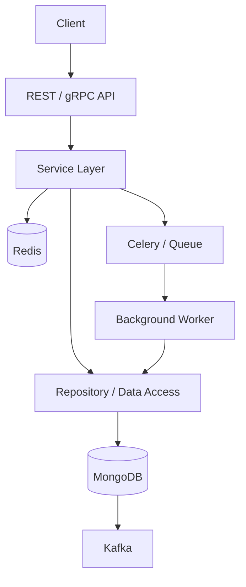
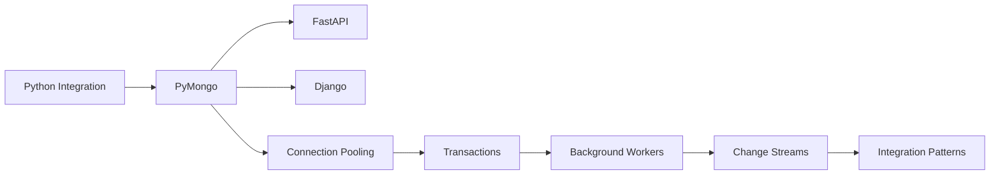

# README

## Overview

This directory contains the MongoDB integration layer of the backend engineering playbook.

The focus is on integrating MongoDB into production backend systems rather than treating MongoDB as an isolated database technology. The documentation progresses from Python database access and application architecture to transactions, connection management, background processing, change streams, framework integration, operational tooling, and broader integration patterns.

The material assumes familiarity with backend development, APIs, Python, and basic database concepts.

## Navigation

| # | File | Description |
|---|---|---|
| 01 | [01- Python and MongoDB Integration](./01-%20Python%20and%20MongoDB%20Integration.md) | Production Python integration architecture, PyMongo usage, configuration, CRUD, repositories, and application integration |
| 02 | [02- PyMongo](./02-%20PyMongo.md) | PyMongo client architecture, CRUD, BSON, aggregation, indexes, transactions, pooling, and operational concerns |
| 03 | [03- MongoEngine](./03-%20MongoEngine.md) | MongoEngine ODM, document modeling, querying, and Django integration |
| 04 | [04- FastAPI and MongoDB](./04-%20FastAPI%20and%20MongoDB.md) | FastAPI lifecycle, dependency injection, Pydantic, repositories, CRUD, pagination, and production configuration |
| 05 | [05- Django and MongoDB](./05-%20Django%20and%20MongoDB.md) | Django integration approaches, PyMongo, MongoEngine, service/repository architecture, and testing |
| 06 | [06- MongoDB Compass](./06-%20MongoDB%20Compass.md) | Compass workflows, document inspection, queries, aggregation, indexes, schema analysis, and troubleshooting |
| 07 | [07- JSON and CSV Import Export](./07-%20JSON%20and%20CSV%20Import%20Export.md) | JSON/CSV import and export, mongoimport, mongoexport, batching, validation, and migration workflows |
| 08 | [08- Connection Pooling](./08-%20Connection%20Pooling.md) | MongoClient lifecycle, pool configuration, concurrency, timeouts, and application scaling |
| 09 | [09- Transactions in Python](./09-%20Transactions%20in%20Python.md) | Sessions, transaction lifecycle, read/write concerns, retries, and transactional workflows |
| 10 | [10- Change Streams in Python](./10-%20Change%20Streams%20in%20Python.md) | Change streams, event types, resume tokens, consumers, idempotency, and event-driven architecture |
| 11 | [11- MongoDB in Background Workers](./11-%20MongoDB%20in%20Background%20Workers.md) | MongoDB access from Celery and other workers, task retries, idempotency, and worker architecture |
| 12 | [12- MongoDB Integration Patterns](./12-%20MongoDB%20Integration%20Patterns.md) | Production integration patterns across APIs, services, workers, Redis, Kafka, and microservices |

## Integration Architecture

A production MongoDB integration typically separates application concerns:



The central architectural principle is:

```text
API / Worker
     ↓
Application / Service Layer
     ↓
Persistence Boundary
     ↓
PyMongo
     ↓
MongoDB
```

Additional infrastructure such as Redis, Kafka, and Celery should be introduced for specific requirements rather than as generic layers around MongoDB.

## Learning Path

The recommended progression is:



### Recommended Order

1. **Python and MongoDB Integration** — Establish the basic application-to-database architecture.
2. **PyMongo** — Understand the primary Python driver and its runtime behavior.
3. **FastAPI and MongoDB** — Apply MongoDB to modern asynchronous APIs.
4. **Django and MongoDB** — Understand Django-specific integration approaches and limitations.
5. **MongoDB Compass** — Develop practical database inspection and debugging skills.
6. **JSON and CSV Import Export** — Learn operational data movement and migration workflows.
7. **Connection Pooling** — Understand connection lifecycle and application/database scaling.
8. **Transactions in Python** — Introduce multi-document consistency and transaction boundaries.
9. **MongoDB in Background Workers** — Apply MongoDB safely to asynchronous workloads.
10. **Change Streams in Python** — Build database-driven event processing.
11. **MongoDB Integration Patterns** — Consolidate these techniques into production architecture patterns.

## Integration Responsibilities

A production application should maintain clear ownership between layers.

| Layer | Responsibility |
|---|---|
| API | HTTP/gRPC contract, authentication, request/response handling |
| Service | Business rules, orchestration, transaction boundaries |
| Repository | MongoDB queries, persistence, projections, aggregation |
| Driver | Connection management, BSON encoding, protocol communication |
| MongoDB | Persistence, indexing, transactions, replication, durability |
| Worker | Asynchronous processing and retryable workflows |
| Redis | Caching and short-lived coordination where appropriate |
| Kafka | Durable event streaming where appropriate |

Avoid allowing every application component to directly execute arbitrary MongoDB operations.

## Core Integration Patterns

### Repository Pattern

```text
Service
   ↓
Repository
   ↓
PyMongo
   ↓
MongoDB
```

Useful when:

- Persistence logic is substantial.
- Queries need to be reused.
- MongoDB access must be tested independently.
- Business logic should remain database-agnostic.

Avoid creating a repository that simply mirrors every PyMongo method.

### Service Layer

```text
API
 ↓
Service
 ├── Repository
 ├── Repository
 └── External Service
```

The service layer should own business workflows rather than embedding business rules inside database queries.

### Transaction Boundary

```text
Service
   ↓
Transaction
 ├── Repository A
 ├── Repository B
 └── Repository C
   ↓
Commit / Abort
```

Repositories should normally receive a session when participating in an existing transaction instead of independently starting transactions.

### Background Processing

```text
API
 ↓
Queue
 ↓
Worker
 ↓
MongoDB
```

Background operations should be:

- Idempotent
- Retryable
- Observable
- Bounded
- Safe against duplicate execution

### Change Stream Processing

```text
MongoDB
   ↓
Change Stream
   ↓
Consumer
   ↓
Kafka / Celery / Search / Cache
```

Change streams are appropriate when database changes themselves are the event source.

### Transactional Outbox

```text
Application
    ↓
MongoDB Transaction
 ┌───────────────┐
 │ Business Data │
 │ Outbox Event  │
 └───────────────┘
        ↓
    Publisher
        ↓
      Kafka
```

Use an outbox when a business state change and its corresponding domain event must be persisted atomically.

## Framework Integration

### FastAPI

Typical architecture:

```text
FastAPI
   ↓
Dependency Injection
   ↓
Service
   ↓
Repository
   ↓
AsyncMongoClient
   ↓
MongoDB
```

Key concerns:

- Application lifespan
- Client reuse
- Async database access
- Pydantic serialization
- ObjectId handling
- Dependency injection
- Request timeouts
- Error translation

### Django

Typical architecture:

```text
Django / DRF
     ↓
Service
     ↓
Repository
     ↓
PyMongo / MongoEngine / Django MongoDB Backend
     ↓
MongoDB
```

MongoDB should not be assumed to behave like Django's native relational ORM.

Choose the integration approach according to:

- Query requirements
- MongoDB-specific feature requirements
- Existing Django architecture
- Team familiarity
- Transaction requirements
- Long-term maintenance

## Operational Integration

MongoDB integration extends beyond application code.

Production systems should account for:

```text
Application
    ↓
Connection Pool
    ↓
Network
    ↓
MongoDB Topology
    ↓
Storage / Replication
```

Monitor the entire path.

### Application Metrics

Track:

- MongoDB operation latency
- Repository latency
- Connection pool utilization
- Pool wait time
- Error rates
- Transaction duration
- Retry counts
- Background task failures

### Database Metrics

Track:

- CPU
- Memory
- Connections
- Storage
- Query latency
- Replication lag
- Oplog health
- Slow operations
- Index usage

Application and database metrics should be correlated during incidents.

## Security Considerations

MongoDB integration should enforce security at multiple layers:

```text
Application Authentication
        ↓
Application Authorization
        ↓
Network Access
        ↓
TLS
        ↓
MongoDB Authentication
        ↓
MongoDB Authorization
```

Production integrations should use:

- TLS
- Least-privilege database users
- Secret management
- Private network connectivity
- Credential rotation
- Auditing where required
- Restricted network access
- Safe logging practices

Never place MongoDB credentials directly in source code or container images.

## Performance Considerations

MongoDB performance depends on the complete integration path.

```text
API concurrency
      +
Worker concurrency
      +
Connection pools
      +
Query shape
      +
Indexes
      +
MongoDB resources
```

Important areas include:

- Query and index alignment
- Compound index design
- Connection pool sizing
- Large result sets
- Aggregation workloads
- Pagination
- Bulk operations
- Working-set size
- Document growth
- Hot documents
- Transaction duration

The first response to a slow query should usually be measurement rather than blindly increasing infrastructure capacity.

## Scalability Considerations

Application scaling multiplies database pressure.

For example:

```text
10 API pods
×
100 maximum pooled connections
=
Potentially large connection footprint
```

The exact active connection count depends on workload and topology, but the architectural relationship is important.

Before increasing replicas, evaluate:

- MongoDB connection capacity
- Query latency
- Database CPU
- Memory pressure
- Storage throughput
- Replication lag
- Pool contention

## Reliability Patterns

Reliable MongoDB integrations commonly use:

| Requirement | Pattern |
|---|---|
| Temporary failure | Bounded retry |
| Duplicate task execution | Idempotency |
| Atomic multi-document update | Transaction |
| Reliable event publication | Transactional outbox |
| Database-driven events | Change streams |
| High read volume | Cache-aside |
| Large data processing | Cursor + batching |
| Long-running workflow | Saga/state machine |
| Cross-service communication | API/gRPC/events |

No single pattern solves every reliability problem.

## Common Anti-Patterns

### Client Per Request

```python
def handler():
    client = MongoClient(uri)
```

Problem:

- Connection churn
- Pool creation overhead
- Resource waste

Prefer a long-lived client per process.

### Database Access Everywhere

```text
View → MongoDB
Service → MongoDB
Serializer → MongoDB
Worker → MongoDB
Utility → MongoDB
```

Problem:

- Hidden persistence dependencies
- Difficult testing
- Poor transaction boundaries
- Difficult query ownership

### Direct Cross-Service Database Access

```text
Order Service ──→ Customer Service MongoDB
```

This couples services to another service's persistence model.

Prefer:

```text
Order Service
     ↓
Customer API / gRPC / Event
     ↓
Customer Service
```

### Unlimited Retries

Retries can amplify an outage.

Use:

- Retry classification
- Exponential backoff
- Jitter
- Maximum attempts
- Dead-letter handling where applicable

### Unbounded Reads

Avoid returning entire collections to application memory.

Prefer:

- Pagination
- Cursors
- Projections
- Bounded batches
- Streaming processing

## Troubleshooting Workflow

Use a consistent diagnostic process:

```text
Symptom
↓
Possible causes
↓
Isolation strategy
↓
Diagnostic commands / metrics
↓
Root cause
↓
Corrective action
↓
Prevention
```

Typical problem categories include:

| Problem | First investigation |
|---|---|
| Connection failure | URI, DNS, network, TLS, authentication |
| Slow query | `explain("executionStats")`, indexes, query shape |
| Pool exhaustion | Pool settings, concurrency, query latency |
| Transaction failure | Session propagation, topology, transaction lifecycle |
| Duplicate processing | Retry behavior, idempotency, consumer state |
| Replication problems | Replica-set health and lag |
| High memory | Working set, aggregation, large documents |
| High storage | Collection growth, indexes, retention |
| Event gaps | Resume tokens, consumer checkpoints, failure handling |

## Testing Strategy

Use different testing levels for different concerns.

| Test | Primary purpose |
|---|---|
| Unit tests | Business logic |
| Repository integration tests | MongoDB queries and persistence |
| API tests | Endpoint + service integration |
| Transaction tests | Commit and rollback behavior |
| Worker tests | Idempotency and retries |
| Change-stream tests | Event processing and recovery |
| Performance tests | Query and throughput behavior |
| Failure tests | Resilience and recovery |

Do not mock MongoDB for every test.

Mocks are useful for isolated service tests, but real MongoDB integration tests are necessary to validate:

- Query behavior
- BSON handling
- Index assumptions
- Aggregation
- Transactions
- MongoDB-specific semantics

## Production Checklist

### Application

- [ ] MongoDB client lifecycle is centralized.
- [ ] Connection pools are intentionally configured.
- [ ] Timeouts are configured.
- [ ] Database access has clear ownership.
- [ ] BSON values are handled explicitly.
- [ ] Errors are translated appropriately.

### Data Access

- [ ] Repository methods represent meaningful access patterns.
- [ ] Query shapes are documented where important.
- [ ] Indexes support production queries.
- [ ] Large reads use pagination or cursors.
- [ ] Aggregations are measured and optimized.

### Reliability

- [ ] Retryable and non-retryable errors are distinguished.
- [ ] Retries are bounded.
- [ ] Background processing is idempotent.
- [ ] Transactions have explicit boundaries.
- [ ] Event consumers support recovery.

### Security

- [ ] TLS is enabled.
- [ ] Credentials are stored in a secret manager.
- [ ] Database users use least privilege.
- [ ] MongoDB is not unnecessarily exposed publicly.
- [ ] Sensitive data is excluded from logs.

### Operations

- [ ] Query latency is monitored.
- [ ] Connection usage is monitored.
- [ ] Replica-set health is monitored.
- [ ] Replication lag is monitored.
- [ ] Backups are tested.
- [ ] Restore procedures are documented.
- [ ] Capacity is reviewed before scaling application replicas.

## Interview Focus

Senior backend interviews commonly test MongoDB integration through architecture rather than isolated syntax.

Be prepared to explain:

- Why a MongoClient should be reused.
- How connection pooling interacts with application concurrency.
- When to use repositories.
- Where transaction boundaries should live.
- How to make MongoDB workers idempotent.
- How to diagnose a slow query.
- How indexes relate to query patterns.
- When to use change streams.
- When to use a transactional outbox.
- How MongoDB fits into a microservice architecture.
- How to handle ObjectId at an API boundary.
- How to scale application replicas without exhausting database capacity.
- How MongoDB transactions differ from distributed transactions.
- How to design reliable MongoDB + Kafka workflows.
- How to test MongoDB-specific behavior.

## Quick Navigation

| Area | Start Here |
|---|---|
| Python integration | [01- Python and MongoDB Integration.md](01-%20Python%20and%20MongoDB%20Integration.md) |
| PyMongo | [02- PyMongo.md](02-%20PyMongo.md) |
| Integration architecture | [03- MongoDB Integration Patterns.md](03-%20MongoDB%20Integration%20Patterns.md) |
| FastAPI | [04- FastAPI and MongoDB.md](04-%20FastAPI%20and%20MongoDB.md) |
| Django | [05- Django and MongoDB.md](05-%20Django%20and%20MongoDB.md) |
| MongoDB Compass | [06- MongoDB Compass.md](06-%20MongoDB%20Compass.md) |
| Data import/export | [07- JSON and CSV Import Export.md](07-%20JSON%20and%20CSV%20Import%20Export.md) |
| Connection management | [08- Connection Pooling.md](08-%20Connection%20Pooling.md) |
| Transactions | [09- Transactions in Python.md](09-%20Transactions%20in%20Python.md) |
| Change streams | [10- Change Streams in Python.md](10-%20Change%20Streams%20in%20Python.md) |
| Background workers | [11- MongoDB in Background Workers.md](11-%20MongoDB%20in%20Background%20Workers.md) |
| Advanced integration patterns | [12- MongoDB Integration Patterns.md](12-%20MongoDB%20Integration%20Patterns.md) |

## Key Takeaways

- **MongoDB integration should have explicit application, service, repository, and database responsibilities rather than scattering database calls throughout the codebase.**
- **Connection lifecycle, query design, indexing, concurrency, and application scaling must be considered together because application capacity directly affects MongoDB resource consumption.**
- **Transactions, change streams, background workers, caching, and Kafka solve different integration problems and should be selected according to consistency and delivery requirements.**
- **Production reliability depends on bounded retries, idempotency, observability, tested recovery procedures, and clear ownership of MongoDB data.**
- **The senior-level focus is not merely knowing PyMongo APIs; it is designing a MongoDB integration that remains correct, observable, scalable, and operable under failure.**