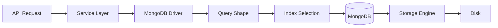
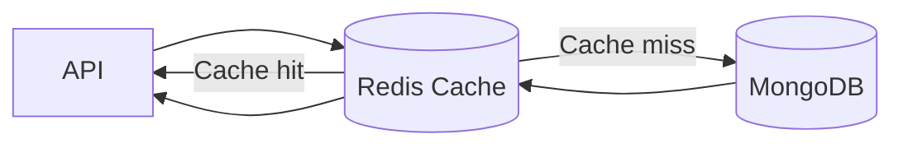

# 01- MongoDB Performance Fundamentals

## Overview

MongoDB performance is primarily a function of **data modeling, query shape, indexing, working-set behavior, concurrency, and workload characteristics**.

A fast MongoDB deployment is not created by adding indexes after queries become slow. Performance should be designed into the application architecture:



For backend systems, MongoDB performance should be evaluated across several layers:

| Layer | Primary concern |
|---|---|
| Data model | Document shape, cardinality, growth |
| Query | Selectivity, filtering, projection, sorting |
| Index | Access path, selectivity, sort support |
| Driver | Connection pooling, timeouts, concurrency |
| MongoDB | CPU, memory, cache, locking/contention |
| Storage | I/O latency, throughput, disk capacity |
| Architecture | Replication, sharding, workload isolation |
| Application | Request rate, concurrency, payload size |
| Observability | Latency, errors, slow queries, resource metrics |

The most important performance principle is:

> Optimize the complete access path, not an isolated query or isolated database metric.

## Performance Model

A simplified request path is:

```text
Client
  ↓
Nginx / Load Balancer
  ↓
FastAPI / Django
  ↓
Service Layer
  ↓
PyMongo
  ↓
Connection Pool
  ↓
MongoDB
  ↓
Query Planner
  ↓
Index / Collection Scan
  ↓
Storage Engine
  ↓
Disk / Memory
```

Latency can therefore originate from several places.

```text
Total request latency
    =
Application processing
+
Network latency
+
Connection acquisition
+
MongoDB execution
+
Storage I/O
+
Response serialization
```

If an API endpoint takes 500 ms, MongoDB is not necessarily responsible for all 500 ms.

## What MongoDB Performance Means

MongoDB performance normally involves several measurable dimensions:

- Query latency
- Throughput
- CPU utilization
- Memory utilization
- Storage latency
- Disk throughput
- Connection utilization
- Replication lag
- Lock/contention behavior
- Working-set efficiency
- Index efficiency
- Aggregation execution time
- Write throughput

A useful performance target should therefore be expressed in terms of workload behavior.

For example:

```text
Target:
p95 database latency < 50 ms
at 2,000 reads/second
and 500 writes/second
with replication lag < 1 second
```

This is more meaningful than:

```text
MongoDB should be fast.
```

## Read Latency vs Throughput

Latency and throughput are different.

| Metric | Meaning |
|---|---|
| Latency | Time required to complete an operation |
| Throughput | Operations processed per unit of time |
| Concurrency | Operations executing simultaneously |
| Utilization | Resource consumption relative to capacity |

A system can have:

```text
Low latency + low throughput
```

or:

```text
Low latency + high throughput
```

depending on workload and capacity.

Performance engineering should define acceptable values for all relevant dimensions.

## Data Modeling Is a Performance Decision

MongoDB data modeling directly affects query performance.

Suppose an order frequently needs:

```text
Order
+
Customer summary
+
Recent line items
```

An embedded model might avoid multiple database round trips:

```javascript
{
  _id: ObjectId("..."),
  customer: {
    id: ObjectId("..."),
    name: "Alice"
  },
  items: [
    {
      product_id: ObjectId("..."),
      quantity: 2,
      price: 49.99
    }
  ]
}
```

A referenced model may instead require:

```text
orders
customers
products
```

and potentially multiple queries or an aggregation with `$lookup`.

Neither design is universally faster.

The correct design depends on:

- Read frequency
- Write frequency
- Cardinality
- Document growth
- Consistency requirements
- Query patterns
- Update patterns

## Access Patterns First

A senior MongoDB design process starts with access patterns.

Example:

```text
GET /orders/{id}
GET /customers/{id}/orders
GET /orders?status=pending
GET /orders?customer_id=...
GET /orders?created_after=...
```

Translate these into MongoDB query shapes before designing indexes.

```text
Access pattern
      ↓
Query shape
      ↓
Required filtering
      ↓
Required sorting
      ↓
Required projection
      ↓
Index candidate
```

## Query Selectivity

Selectivity describes how effectively a predicate narrows the candidate dataset.

Suppose:

```javascript
db.orders.find({
  status: "pending"
})
```

and 60% of all documents are pending.

The predicate has relatively low selectivity.

Compare:

```javascript
db.orders.find({
  customer_id: ObjectId("...")
})
```

where each customer has only a small number of orders.

That predicate is generally more selective.

High selectivity can allow indexes to eliminate a large portion of the collection from consideration.

## Collection Scan

A collection scan examines documents directly.

The query plan commonly appears as:

```text
COLLSCAN
```

Example:

```javascript
db.orders.find({
  customer_id: ObjectId("...")
}).explain("executionStats")
```

If the winning plan contains:

```text
COLLSCAN
```

MongoDB may be examining a large portion of the collection.

A collection scan is not automatically bad.

It can be reasonable when:

- The collection is small.
- The query returns a large percentage of documents.
- An index would not materially reduce work.
- The operation is an intentional analytical workload.

The problem is an unexpected collection scan on a large, latency-sensitive collection.

## Index Scan

An index can provide a more selective access path.

A typical query plan may contain:

```text
IXSCAN
```

Conceptually:

```text
Query
  ↓
Index
  ↓
Candidate document locations
  ↓
Documents
```

An index does not automatically guarantee good performance.

A poorly designed index may still examine many keys or require expensive document fetches.

## Query Execution Metrics

Use:

```javascript
db.orders.find({
  customer_id: ObjectId("...")
}).explain("executionStats")
```

Important fields include:

| Metric | Meaning |
|---|---|
| `nReturned` | Number of documents returned |
| `totalKeysExamined` | Index keys examined |
| `totalDocsExamined` | Documents examined |
| `executionTimeMillis` | Measured execution time |
| `winningPlan` | Selected execution plan |

A useful first approximation is:

```text
totalDocsExamined ≫ nReturned
```

which may indicate inefficient filtering.

Likewise:

```text
totalKeysExamined ≫ nReturned
```

can indicate that the index is scanning a much larger range than necessary.

These metrics must be interpreted in context rather than through a single universal threshold.

## Query Shape

A query shape is the structural form of a query independent of its specific literal values.

For example:

```javascript
db.orders.find({
  customer_id: ObjectId("...")
})
```

and:

```javascript
db.orders.find({
  customer_id: ObjectId("...")
})
```

have the same general query shape even though the values differ.

Query-shape thinking is important because production optimization should target recurring workload patterns rather than one isolated request.

## Query Shape and Index Design

Suppose the application repeatedly performs:

```javascript
db.orders.find({
  customer_id: customerId,
  status: "pending"
}).sort({
  created_at: -1
})
```

A compound index candidate is:

```javascript
db.orders.createIndex({
  customer_id: 1,
  status: 1,
  created_at: -1
})
```

The exact index should be validated with `explain()` and actual workload characteristics.

Do not create indexes purely from intuition.

## Projection

Returning only required fields can reduce:

- Network transfer
- BSON decoding
- Application memory
- Serialization overhead
- API response size

Example:

```javascript
db.orders.find(
  { customer_id: ObjectId("...") },
  {
    _id: 1,
    status: 1,
    total: 1,
    created_at: 1
  }
)
```

Projection is especially useful when documents contain large embedded structures.

## Large Documents

Large documents increase the amount of data that may need to be:

- Read
- Copied
- Decoded
- Transferred
- Serialized
- Updated
- Replicated

A query returning ten small documents can be cheaper than returning one extremely large document.

Performance therefore depends on both:

```text
Number of documents
+
Size of documents
```

## Large Arrays

Large arrays are a common MongoDB modeling risk.

Example:

```javascript
{
  _id: ObjectId("..."),
  events: [
    // potentially millions of elements
  ]
}
```

Potential problems include:

- Document growth
- Large update operations
- Large reads
- Replication overhead
- Memory pressure
- Hot-document contention

A better design may be to move high-cardinality or unbounded data into a separate collection.

## Hot Documents

A hot document is a document that is accessed or modified disproportionately often.

Example:

```text
Global counter document
        ↑
10,000 updates/sec
```

Even though MongoDB provides atomic document updates, the workload can create a contention hotspot.

Possible alternatives include:

- Sharded counters
- Time-bucketed documents
- Append-oriented models
- Redis counters
- Kafka-based aggregation
- Periodic batch consolidation

The correct solution depends on consistency and durability requirements.

## Index Fundamentals

Indexes provide alternate access paths into collection data.

Without a useful index:

```text
Query
 ↓
Collection scan
 ↓
Many documents examined
```

With a suitable index:

```text
Query
 ↓
Index lookup
 ↓
Smaller candidate set
 ↓
Document fetch
```

Indexes improve reads at the cost of:

- Storage
- Memory
- Write work
- Index maintenance
- Build time

## The `_id` Index

MongoDB automatically maintains an index for `_id`.

It supports efficient lookup by document identifier.

Example:

```javascript
db.orders.find({
  _id: ObjectId("...")
})
```

Applications should not assume that the `_id` index supports arbitrary query patterns.

A query such as:

```javascript
db.orders.find({
  customer_id: ObjectId("...")
})
```

still requires an appropriate index if it is latency-sensitive and the collection is large.

## Compound Indexes

Compound indexes contain multiple fields.

Example:

```javascript
db.orders.createIndex({
  customer_id: 1,
  status: 1,
  created_at: -1
})
```

They are useful when query patterns consistently filter and sort across multiple fields.

Field order matters.

An index:

```text
{ customer_id: 1, status: 1 }
```

is not equivalent to:

```text
{ status: 1, customer_id: 1 }
```

for all workloads.

## ESR Guideline

A common MongoDB index-design heuristic is:

```text
E → Equality
S → Sort
R → Range
```

For example:

```javascript
db.orders.find({
  customer_id: ObjectId("..."),
  status: "pending",
  created_at: { $gte: ISODate("2026-01-01") }
}).sort({
  priority: -1
})
```

Index design requires examining:

- Equality fields
- Sort fields
- Range fields

The ESR guideline is a heuristic, not a universal mechanical rule. Actual query plans should validate the design.

## Index Selectivity

A useful index should narrow the candidate set effectively.

For example:

```text
1,000,000 documents
        ↓
customer_id predicate
        ↓
20 candidate documents
```

is typically much more useful than:

```text
1,000,000 documents
        ↓
status = "active"
        ↓
700,000 candidates
```

However, low-cardinality fields can still be valuable as part of compound indexes when combined with other predicates.

## Covered Queries

A query can potentially be satisfied entirely from an index when the required fields are available in the index.

Example:

```javascript
db.orders.find(
  {
    customer_id: ObjectId("...")
  },
  {
    customer_id: 1,
    created_at: 1,
    _id: 0
  }
)
```

with:

```javascript
db.orders.createIndex({
  customer_id: 1,
  created_at: -1
})
```

A covered query can avoid document fetches.

Verify actual behavior with:

```javascript
.explain("executionStats")
```

Do not create wide indexes solely to force coverage without measuring the storage and write costs.

## Sort Performance

Sorting can be expensive when MongoDB cannot use an appropriate index.

Example:

```javascript
db.orders.find({
  customer_id: ObjectId("...")
}).sort({
  created_at: -1
})
```

An appropriate index can support both filtering and ordering:

```javascript
db.orders.createIndex({
  customer_id: 1,
  created_at: -1
})
```

Without suitable index support, a query plan may contain a blocking:

```text
SORT
```

stage.

## Skip-Based Pagination

A common pattern is:

```javascript
db.orders.find({
  customer_id: ObjectId("...")
})
.sort({
  created_at: -1
})
.skip(100000)
.limit(50)
```

Large offsets can become inefficient because the database still needs to advance through earlier results.

This becomes increasingly problematic for deep pagination.

## Cursor Pagination

For large datasets, range-based pagination is generally preferable.

Example:

```javascript
db.orders.find({
  customer_id: ObjectId("..."),
  created_at: {
    $lt: ISODate("2026-09-01T12:00:00Z")
  }
})
.sort({
  created_at: -1
})
.limit(50)
```

The next request uses the last seen cursor value.

A stable pagination design should include a deterministic tie-breaker when timestamps are not unique.

For example:

```text
created_at + _id
```

## Connection Pooling

MongoDB drivers maintain connection pools to avoid establishing a new network connection for every operation.

For Python applications, a common pattern is to create one `MongoClient` per process and reuse it.

Example:

```python
from pymongo import MongoClient

client = MongoClient(
    "mongodb://localhost:27017",
    maxPoolSize=100,
    serverSelectionTimeoutMS=3000,
)
```

Do not create a new client for every request:

```python
# Avoid
def get_order(order_id):
    client = MongoClient(MONGODB_URI)
    return client.db.orders.find_one({"_id": order_id})
```

Prefer a long-lived client:

```python
client = MongoClient(MONGODB_URI)

def get_order(order_id):
    return client.db.orders.find_one({"_id": order_id})
```

## Connection Pool Sizing

Pool size should be based on actual concurrency.

A simplistic calculation such as:

```text
application instances × maxPoolSize
```

is useful for understanding the potential connection footprint, but actual behavior depends on driver topology and workload.

Do not assume that increasing `maxPoolSize` always increases throughput.

If MongoDB or storage is already saturated, larger pools can increase contention instead of improving performance.

## Timeouts

Production MongoDB clients should use explicit timeout policies.

For example:

```python
from pymongo import MongoClient

client = MongoClient(
    MONGODB_URI,
    serverSelectionTimeoutMS=3000,
    connectTimeoutMS=3000,
    socketTimeoutMS=5000,
)
```

Timeouts serve different purposes.

| Timeout | Purpose |
|---|---|
| `serverSelectionTimeoutMS` | Time allowed to select a suitable server |
| `connectTimeoutMS` | Time allowed to establish a network connection |
| `socketTimeoutMS` | Time allowed for socket operations |

Timeout values should be aligned with application SLAs.

## Working Set

The working set is the subset of data and indexes that the workload accesses frequently enough to benefit from being resident in memory/cache.

Conceptually:

```text
Entire database
┌──────────────────────────────┐
│                              │
│    Less frequently used      │
│                              │
│     ┌──────────────────┐     │
│     │   Working Set    │     │
│     │                  │     │
│     │ hot data/indexes │     │
│     └──────────────────┘     │
│                              │
└──────────────────────────────┘
```

If the working set fits comfortably within available effective memory, many operations can avoid repeated storage reads.

If it does not, disk I/O can become a major latency contributor.

## Memory and Performance

Memory pressure can increase:

- Storage reads
- Query latency
- Cache churn
- CPU overhead
- Tail latency

A performance investigation should therefore compare:

```text
Working-set characteristics
+
Memory availability
+
Disk latency
+
Query latency
```

Do not assume that high memory utilization by itself indicates a problem.

Database caching is expected behavior.

## Storage Performance

Storage latency can dominate database performance when working data is not cached.

Monitor:

- IOPS
- Throughput
- Read latency
- Write latency
- Queue depth
- Filesystem utilization

On AWS, storage architecture should consider the characteristics of the underlying EBS configuration when self-hosting MongoDB.

For MongoDB Atlas, the managed storage configuration and instance class should be evaluated together.

## Read Performance

Read performance depends on:

```text
Query shape
+
Index
+
Document size
+
Working set
+
Concurrency
+
Storage
```

A read optimization workflow is:

```text
Identify slow read
      ↓
Measure actual latency
      ↓
Run explain()
      ↓
Inspect index usage
      ↓
Inspect documents examined
      ↓
Inspect returned payload
      ↓
Check memory/storage
      ↓
Optimize
      ↓
Benchmark again
```

## Write Performance

Writes are affected by:

- Document size
- Number of indexes
- Write concern
- Replication
- Storage latency
- Update pattern
- Contention
- Batch size

Every additional index can add write-maintenance work.

For write-heavy collections, avoid creating indexes that do not support important workload requirements.

## Bulk Writes

Batching related writes can reduce application-to-database round trips.

Example:

```python
from pymongo import UpdateOne

operations = [
    UpdateOne(
        {"order_id": order_id},
        {"$set": {"status": "processed"}},
    )
    for order_id in order_ids
]

if operations:
    collection.bulk_write(
        operations,
        ordered=False,
    )
```

`ordered=False` can allow independent operations to proceed without waiting for earlier operations in the batch.

Use it when operation ordering is not semantically required.

## Batch Size

Larger batches can improve throughput but increase:

- Memory usage
- Individual operation duration
- Failure scope
- Retry complexity

Avoid treating maximum batch size as automatically optimal.

Benchmark against realistic production workloads.

## Aggregation Performance

Aggregation pipelines should reduce the dataset as early as practical.

Prefer:

```javascript
db.orders.aggregate([
  {
    $match: {
      status: "completed",
      created_at: {
        $gte: ISODate("2026-09-01")
      }
    }
  },
  {
    $group: {
      _id: "$customer_id",
      total: { $sum: "$amount" }
    }
  }
])
```

over processing an unnecessarily large collection before applying selective filters.

## `$match` Early

An early `$match` can reduce the number of documents entering subsequent stages.

```text
1,000,000 documents
        ↓
$match
        ↓
20,000 documents
        ↓
$group
        ↓
1,000 results
```

This can significantly reduce CPU and memory requirements.

## `$lookup` Performance

`$lookup` can be useful but should not become a substitute for thoughtful data modeling.

Before using `$lookup`, evaluate:

- Join cardinality
- Foreign collection indexes
- Number of documents entering the lookup
- Returned document size
- Frequency of the query

A frequently executed high-cardinality join may indicate that the data model or read model should be reconsidered.

## Aggregation Memory

Large `$group`, `$sort`, and similar stages can require substantial memory.

For large workloads:

- Filter early.
- Project only required fields.
- Avoid unnecessary `$unwind`.
- Use indexes where applicable.
- Consider pre-aggregation.
- Consider asynchronous processing.
- Consider materialized read models.

For analytics workloads, a separate analytical system may be more appropriate than forcing MongoDB to execute continuously expensive reporting queries.

## Before and After: Query Optimization

Suppose the original query is:

```javascript
db.orders.find({
  customer_id: ObjectId("...")
}).sort({
  created_at: -1
})
```

with no suitable index.

Potential behavior:

```text
COLLSCAN
+
SORT
```

A candidate index:

```javascript
db.orders.createIndex({
  customer_id: 1,
  created_at: -1
})
```

can provide a more efficient access path.

Afterward:

```javascript
db.orders.find({
  customer_id: ObjectId("...")
}).sort({
  created_at: -1
}).explain("executionStats")
```

Compare:

```text
executionTimeMillis
totalDocsExamined
totalKeysExamined
winningPlan
```

The optimization is successful only if the measured workload improves without unacceptable write or storage costs.

## Before and After: Projection

Original:

```javascript
db.orders.find({
  customer_id: ObjectId("...")
})
```

Suppose each order contains a large embedded audit history.

If the endpoint needs only:

```text
_id
status
total
created_at
```

use:

```javascript
db.orders.find(
  {
    customer_id: ObjectId("...")
  },
  {
    status: 1,
    total: 1,
    created_at: 1
  }
)
```

This can reduce network and application processing even when query execution itself is already efficient.

## Performance Regression

A query can become slower without the query code changing.

Possible causes include:

- Data growth
- Index growth
- Changed data distribution
- Working-set growth
- New application workload
- More concurrent requests
- Changed query parameters
- New indexes
- Storage degradation
- Replica-set workload changes

Therefore performance monitoring must be continuous.

## Query Performance Monitoring

Useful application-level metrics include:

```text
MongoDB operation count
MongoDB latency
MongoDB error rate
MongoDB timeout count
Connection pool wait time
Database command latency
p50 latency
p95 latency
p99 latency
```

Database-level metrics should include:

```text
CPU
Memory
Disk latency
Disk utilization
Connections
Operation rates
Replication lag
Cache behavior
Storage growth
```

## Percentiles Matter

Average latency can hide tail latency.

Example:

```text
Average: 25 ms
p95:     80 ms
p99:     800 ms
```

The average looks healthy while a meaningful percentage of requests experience severe latency.

For user-facing APIs, monitor at least:

- p50
- p95
- p99

and align alerting with actual service-level objectives.

## MongoDB and API Performance

Suppose a FastAPI endpoint performs:

```text
HTTP request
   ↓
Authentication
   ↓
Business logic
   ↓
MongoDB query
   ↓
Pydantic serialization
   ↓
HTTP response
```

An optimization should identify where the time is actually spent.

For example:

```text
500 ms total
├── 50 ms application logic
├── 20 ms MongoDB query
├── 350 ms serialization
└── 80 ms network
```

Adding a MongoDB index would not solve the primary latency problem.

## Python Driver Considerations

PyMongo is synchronous.

For synchronous applications or workloads where database calls are isolated appropriately, `MongoClient` can be reused across requests.

For asynchronous applications, current PyMongo versions provide an asynchronous API through `AsyncMongoClient`.

The application architecture should avoid blocking the event loop with synchronous database operations.

Conceptually:

```text
FastAPI async endpoint
        ↓
AsyncMongoClient
        ↓
MongoDB
```

rather than:

```text
FastAPI async endpoint
        ↓
Blocking synchronous MongoDB call
        ↓
Event loop contention
```

## Django Considerations

MongoDB should not be treated as if it were PostgreSQL behind Django's native ORM.

Performance depends on the MongoDB integration being used, such as:

- Direct PyMongo
- MongoEngine
- MongoDB's Django MongoDB Backend

The repository or service layer should make query behavior explicit rather than hiding important MongoDB-specific performance decisions behind an abstraction that behaves like a relational ORM.

## Redis as a Performance Layer

Redis can sometimes reduce MongoDB read load.

Example architecture:



Caching is useful when:

- Data is frequently read.
- Data can tolerate controlled staleness.
- Cache invalidation is manageable.
- MongoDB is under meaningful read pressure.

Do not add Redis simply because a MongoDB query is slow.

First determine whether the query, index, model, or infrastructure is the actual bottleneck.

## Caching Trade-offs

| Approach | Benefit | Risk |
|---|---|---|
| MongoDB optimization | Fixes underlying access path | Requires query/index work |
| Redis cache | Reduces repeated reads | Invalidation complexity |
| Denormalization | Faster reads | Consistency complexity |
| Read replica | Distributes reads | Replica lag |
| Sharding | Horizontal scale | Operational complexity |
| Precomputed read model | Fast complex reads | Data freshness complexity |

## Replication and Performance

Replica sets provide high availability but replication adds workload.

Writes on the primary are replicated through the oplog.

```text
Application
    ↓
Primary
    ↓
Oplog
    ↓
Secondary members
```

Performance considerations include:

- Write rate
- Oplog activity
- Network bandwidth
- Secondary storage latency
- Replication lag
- Read preference

A secondary used for analytics can affect replication performance if it consumes significant resources.

## Read Preference

Read preference controls where reads are directed in a replica-set topology.

Common modes include:

| Mode | General behavior |
|---|---|
| `primary` | Read from primary |
| `primaryPreferred` | Prefer primary |
| `secondary` | Read from secondary |
| `secondaryPreferred` | Prefer secondary |
| `nearest` | Select suitable low-latency member |

Moving reads to secondaries can increase read capacity, but it introduces potential consistency and replication-lag considerations.

Do not use secondary reads blindly for strongly consistent workflows.

## Write Concern and Performance

Write concern influences how much acknowledgment MongoDB requires before reporting success.

For example:

```python
from pymongo import WriteConcern

collection = db.get_collection(
    "orders",
    write_concern=WriteConcern(w="majority"),
)
```

Stronger durability requirements can increase write latency.

The correct setting depends on business requirements.

Do not optimize write latency by weakening durability without explicitly understanding the failure model.

## Transactions and Performance

Transactions provide multi-document atomicity but have additional coordination and resource costs.

Prefer single-document atomic updates when the business invariant can be represented inside one document.

Use transactions when a business operation genuinely requires atomic changes across multiple documents or collections.

Avoid turning every write sequence into a transaction.

## Sharding and Performance

Sharding provides horizontal scaling, but the shard key determines whether the workload scales effectively.

A poor shard key can cause:

```text
High traffic
    ↓
Single shard
    ↓
Hot shard
    ↓
Limited scaling
```

A good shard-key design distributes workload while maintaining useful query targeting.

Evaluate:

- Cardinality
- Frequency
- Monotonicity
- Query patterns
- Write distribution
- Data distribution

## Scatter-Gather Queries

A query that cannot be targeted to a specific shard may execute across multiple shards.

Conceptually:

```text
mongos
  ↓
 ┌───────┬───────┬───────┐
 ↓       ↓       ↓
Shard 1 Shard 2 Shard 3
 └───────┴───────┴───────┘
          ↓
       Merge result
```

Scatter-gather queries can be appropriate for some workloads but may become expensive at scale.

Query patterns should therefore influence shard-key design from the beginning.

## Performance Testing

Performance testing should resemble production behavior.

Test:

- Realistic document sizes
- Realistic data distribution
- Expected concurrency
- Representative query shapes
- Read/write ratios
- Index configuration
- Replication topology
- Failure scenarios

Avoid benchmarking against:

```text
10,000 documents
```

when production will contain:

```text
500 million documents
```

A benchmark that does not reproduce the production bottleneck can create false confidence.

## Benchmark Methodology

A useful workflow:

```text
Define workload
      ↓
Generate realistic dataset
      ↓
Create production-like indexes
      ↓
Warm up workload
      ↓
Measure baseline
      ↓
Apply one optimization
      ↓
Repeat workload
      ↓
Compare latency / throughput / resources
      ↓
Validate correctness
```

Change one important variable at a time when possible.

## Performance Test Data

Production-like test data should reproduce:

- Cardinality
- Field distributions
- Document sizes
- Hot keys
- Null/missing fields
- Array sizes
- Index selectivity
- Read/write ratios

Uniform random data can hide real-world performance problems.

## Performance Anti-Patterns

### Index Everything

More indexes do not automatically mean better performance.

Every index has costs:

```text
More indexes
    ↓
More storage
    ↓
More write work
    ↓
More cache pressure
```

### Optimize Without `explain()`

Guessing about query performance is unreliable.

Measure the actual plan.

### Use Huge `skip()` Values

Deep offset pagination can become increasingly expensive.

Use range-based pagination for large datasets.

### Return Entire Documents

Large payloads increase network and serialization costs.

Use projection when the endpoint does not require the full document.

### Perform Unbounded Aggregations

Aggregating an entire large collection for every API request is usually a design smell.

Consider:

- Pre-aggregation
- Materialized views/read models
- Background jobs
- Analytics systems

### Create a New MongoClient per Request

This creates unnecessary connection-management overhead.

Reuse the client appropriately.

### Increase Connection Pool Size Indiscriminately

More connections do not necessarily produce more throughput.

They can increase contention and resource consumption.

### Cache Every Query

Caching adds:

- Memory cost
- Invalidation complexity
- Staleness
- Operational complexity

Optimize the underlying database path first.

## Performance Troubleshooting Methodology

### Slow API Endpoint

```text
Symptom
↓
API latency increased
↓
Possible causes
    - MongoDB query
    - Connection acquisition
    - Serialization
    - Network
    - Application processing
↓
Isolation strategy
↓
Measure application spans
↓
Measure MongoDB command latency
↓
Run explain()
↓
Inspect connection pool
↓
Inspect MongoDB resources
↓
Root cause
↓
Corrective action
↓
Prevention
    - Latency metrics
    - Query monitoring
    - Performance tests
```

### Slow MongoDB Query

```text
Symptom
↓
Query latency increased
↓
Possible causes
    - Missing index
    - Poor index order
    - Data growth
    - Low selectivity
    - Large documents
    - Sort stage
    - Storage latency
↓
Isolation strategy
↓
Run explain("executionStats")
↓
Inspect totalDocsExamined
↓
Inspect totalKeysExamined
↓
Inspect winningPlan
↓
Inspect resource metrics
↓
Root cause
↓
Corrective action
↓
Prevention
    - Query-shape monitoring
    - Index review
    - Regression testing
```

### High Database CPU

```text
Symptom
↓
MongoDB CPU is high
↓
Possible causes
    - Expensive queries
    - Large aggregations
    - Excessive concurrency
    - Index builds
    - High write rate
    - Inefficient query plans
↓
Isolation strategy
↓
Inspect current operations
↓
Inspect query metrics
↓
Run explain() on affected queries
↓
Inspect aggregation workloads
↓
Correlate with deployment / traffic changes
↓
Root cause
↓
Corrective action
↓
Prevention
    - Query optimization
    - Capacity planning
    - Workload isolation
```

### High Disk I/O

```text
Symptom
↓
Disk latency or I/O is high
↓
Possible causes
    - Working set exceeds effective cache
    - Large scans
    - Large aggregations
    - Heavy writes
    - Index maintenance
    - Storage capacity pressure
↓
Isolation strategy
↓
Inspect query plans
↓
Inspect memory
↓
Inspect collection / index sizes
↓
Inspect disk metrics
↓
Root cause
↓
Corrective action
↓
Prevention
    - Better indexing
    - Data lifecycle management
    - Capacity planning
    - Working-set analysis
```

## Production Performance Checklist

### Query Design

- [ ] Query patterns are documented.
- [ ] High-frequency queries have been measured.
- [ ] Large collection scans are intentional.
- [ ] Projection is used where appropriate.
- [ ] Pagination is designed for large datasets.
- [ ] Query latency is measured using percentiles.

### Indexing

- [ ] Indexes support actual access patterns.
- [ ] Compound index ordering has been validated.
- [ ] ESR considerations have been evaluated.
- [ ] Unnecessary indexes are reviewed.
- [ ] Index storage is monitored.
- [ ] Index write overhead is understood.

### Application

- [ ] MongoDB clients are reused appropriately.
- [ ] Connection pools are sized from measured concurrency.
- [ ] Timeouts are configured.
- [ ] MongoDB calls do not unnecessarily block async event loops.
- [ ] Database errors and timeouts are observable.

### Infrastructure

- [ ] CPU is monitored.
- [ ] Memory and working-set behavior are monitored.
- [ ] Disk latency is monitored.
- [ ] Storage growth is tracked.
- [ ] Replica-set health is monitored.
- [ ] Replication lag is monitored.

### Performance Validation

- [ ] Benchmarks use production-like data.
- [ ] Read/write ratios are realistic.
- [ ] Query shapes are representative.
- [ ] Performance regressions are tested.
- [ ] Optimizations are validated with measurements.

## Senior-Level Performance Principles

### Optimize the Access Pattern

Do not begin with:

```text
Which index should I create?
```

Begin with:

```text
What does the application need to retrieve?
How often?
With what latency?
From how much data?
```

Then design the data model and indexes around that requirement.

### Optimize Tail Latency

Average latency is not sufficient for production systems.

Monitor:

```text
p50
p95
p99
```

A database optimization that improves average latency but worsens p99 may be unacceptable for a latency-sensitive API.

### Optimize the Whole System

MongoDB performance is not isolated from:

- FastAPI
- Django
- PyMongo
- Redis
- Kafka
- Nginx
- Kubernetes
- AWS
- Network architecture

A database optimization is useful only when it improves the behavior of the complete system.

### Measure Before and After

The correct optimization workflow is:

```text
Baseline
   ↓
Hypothesis
   ↓
Change
   ↓
Benchmark
   ↓
Compare
   ↓
Validate
```

Never assume an optimization worked simply because the query or architecture looks cleaner.

## Interview Considerations

### What are the main factors affecting MongoDB performance?

The most important factors are:

- Data modeling
- Query shape
- Index design
- Document size
- Working set
- Memory
- Storage latency
- Connection pooling
- Concurrency
- Replication
- Aggregation workload
- Shard-key design

### Why can an index make writes slower?

Every affected index must be maintained when indexed fields change or new documents are inserted.

Therefore:

```text
More indexes
    ↓
More write maintenance
```

### How do you diagnose a slow query?

Start with:

```javascript
db.collection.find({...}).explain("executionStats")
```

Then inspect:

```text
winningPlan
nReturned
totalKeysExamined
totalDocsExamined
executionTimeMillis
```

Correlate the query result with resource metrics and the application's actual workload.

### Why is `totalDocsExamined` important?

It indicates how many documents MongoDB examined during execution.

If:

```text
nReturned = 10
totalDocsExamined = 1,000,000
```

the query may be doing substantially more work than necessary.

### Why is a collection scan not always bad?

A collection scan can be appropriate when:

- The collection is small.
- The query intentionally reads a large fraction of the data.
- An index would not provide meaningful selectivity.
- The workload is analytical rather than latency-sensitive.

### Why can a large working set hurt performance?

When frequently accessed data and indexes cannot remain efficiently cached, MongoDB may require more storage I/O, increasing latency and potentially reducing throughput.

### Why is `skip()` problematic for deep pagination?

MongoDB may need to advance through a large number of preceding results before returning the requested page.

Range-based pagination can use indexed values to continue directly from the previous position.

### When should Redis be used instead of further MongoDB optimization?

Redis is appropriate when repeated reads can benefit from caching and controlled staleness is acceptable. It should not be used as a substitute for fixing an inefficient query, poor index, or inappropriate data model.

## Key Takeaways

- **MongoDB performance starts with access-pattern-driven data modeling and query design; indexes are an optimization mechanism, not a substitute for a poor model.**
- **Use `explain("executionStats")` and metrics such as `nReturned`, `totalKeysExamined`, `totalDocsExamined`, and execution time to diagnose real query behavior.**
- **Performance depends on the entire stack: document size, indexes, working set, storage, connection pools, replication, application concurrency, and network behavior.**
- **Optimize for production workload characteristics, especially p95/p99 latency, realistic data volume, concurrency, and read/write ratios rather than small synthetic benchmarks.**
- **Measure before and after every meaningful optimization; a performance change is successful only when production-relevant latency, throughput, resource usage, and correctness improve together.**