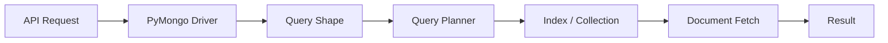
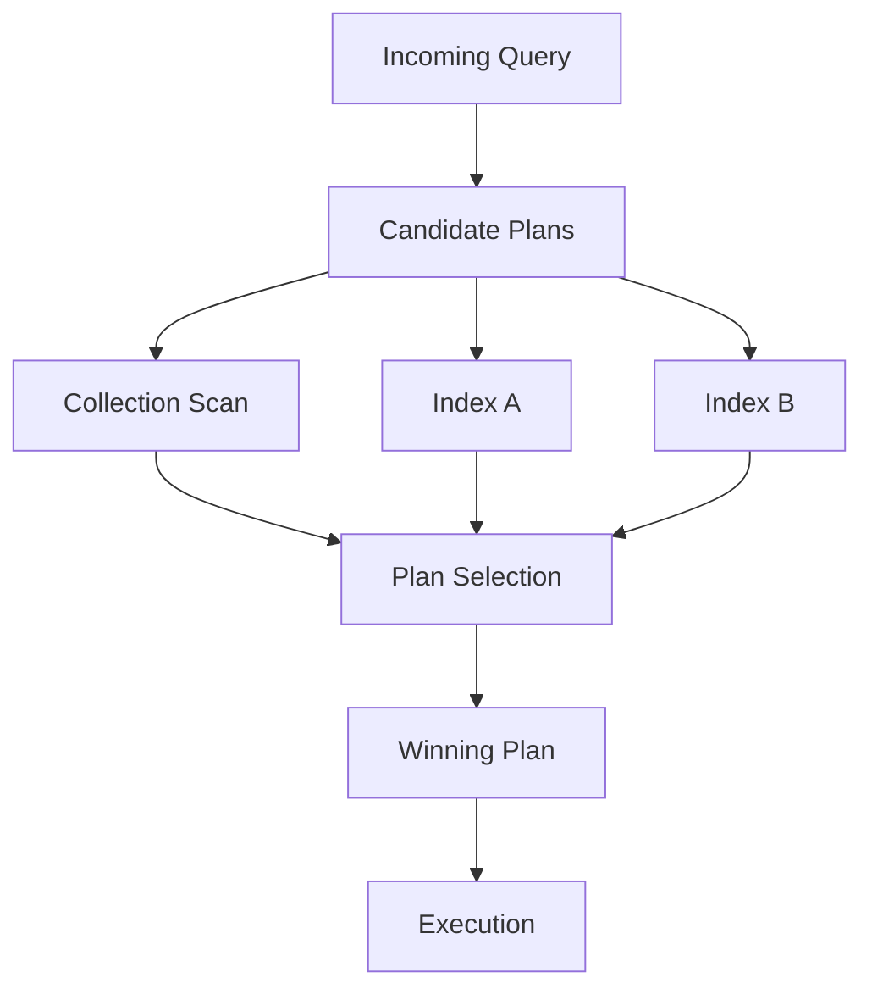
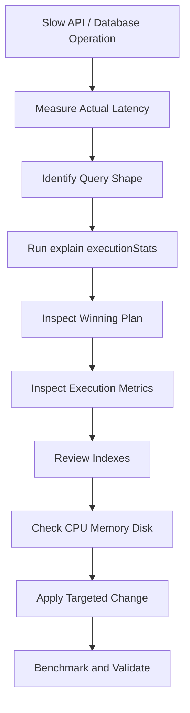

# 02- Query Performance

## Overview

MongoDB query performance is primarily determined by how efficiently a query can identify, read, and return the required documents.

For production systems, query optimization should be treated as a measurable engineering process:

```text
Application requirement
        ↓
Query shape
        ↓
Data distribution
        ↓
Index selection
        ↓
Query planner
        ↓
Execution plan
        ↓
Documents / index keys examined
        ↓
Storage and memory behavior
        ↓
Observed latency
```

A query that returns only 20 documents may still be expensive if MongoDB examines hundreds of thousands of documents to find them.

The core performance question is therefore not:

> "Does this query return the correct result?"

It is:

> "How much work does MongoDB perform to produce that result?"

## Query Performance Model

A MongoDB query typically passes through several stages:



The actual path can differ depending on the query and available indexes.

For example:

```text
Query
  ↓
IXSCAN
  ↓
FETCH
  ↓
Result
```

or:

```text
Query
  ↓
COLLSCAN
  ↓
Filter documents
  ↓
Result
```

or, when the index fully covers the query:

```text
Query
  ↓
IXSCAN
  ↓
Result
```

## What Makes a Query Expensive?

Common contributors include:

| Factor | Performance impact |
|---|---|
| Collection scan | Potentially examines many documents |
| Poor index | Large index range must be scanned |
| Low selectivity | Many candidate documents remain |
| Large documents | More data must be read and transferred |
| Blocking sort | Additional CPU and memory |
| Large aggregation | High CPU/memory requirements |
| `$lookup` | Potentially expensive cross-collection processing |
| Large `skip()` | Increasing work for deep pagination |
| High concurrency | More contention and resource consumption |
| Storage latency | Slower document and index reads |
| Working-set pressure | More storage I/O |
| Excessive projection | Larger network/application payload |
| Poor shard targeting | Scatter-gather execution |

## Query Shape

A query shape describes the structure of a query independently of its literal values.

For example:

```javascript
db.orders.find({
  customer_id: ObjectId("..."),
  status: "pending"
})
```

and:

```javascript
db.orders.find({
  customer_id: ObjectId("..."),
  status: "completed"
})
```

represent the same general access pattern.

Query-shape thinking matters because production optimization should target recurring workload patterns.

A senior engineer should ask:

```text
Which queries execute most frequently?
Which queries consume the most latency?
Which queries examine the most data?
Which queries create the most database load?
```

## Query Selectivity

Selectivity describes how effectively a predicate reduces the candidate dataset.

Suppose:

```text
1,000,000 orders
```

and:

```javascript
{ status: "completed" }
```

matches:

```text
700,000 documents
```

The predicate has relatively low selectivity.

By contrast:

```javascript
{ customer_id: ObjectId("...") }
```

might match only:

```text
25 documents
```

That predicate is much more selective.

High selectivity generally gives an index more opportunity to reduce work.

## Cardinality

Cardinality describes the number of distinct values in a field.

Examples:

| Field | Typical cardinality |
|---|---|
| `country` | Low |
| `status` | Low |
| `customer_id` | High |
| `order_id` | Very high |
| `_id` | Very high |

Cardinality influences index usefulness but should not be evaluated independently of the complete query shape.

A low-cardinality field can still be valuable in a compound index.

## Equality, Range, and Sort

A query commonly contains three important categories:

```text
Equality
Range
Sort
```

Example:

```javascript
db.orders.find({
  customer_id: ObjectId("..."),
  status: "pending",
  created_at: {
    $gte: ISODate("2026-09-01")
  }
}).sort({
  priority: -1
})
```

Here:

```text
Equality → customer_id, status
Range    → created_at
Sort     → priority
```

Understanding these requirements is central to compound-index design.

## Query Planner

MongoDB's query planner evaluates possible execution strategies and selects a winning plan.

Conceptually:



The planner may consider:

- Available indexes
- Query predicates
- Sort requirements
- Index ordering
- Data characteristics
- Query shape
- Estimated execution cost

Do not assume that the index you created is necessarily the index MongoDB will use.

## Winning Plan

Inspect the winning plan:

```javascript
db.orders.find({
  customer_id: ObjectId("...")
}).explain("executionStats")
```

The result contains a `winningPlan`.

Common stages include:

- `COLLSCAN`
- `IXSCAN`
- `FETCH`
- `SORT`
- `LIMIT`

The plan should be interpreted together with execution statistics.

## Rejected Plans

`explain()` can also expose candidate plans that were considered but not selected.

This is useful when investigating:

- Competing indexes
- Poor compound-index design
- Unexpected planner behavior
- Multiple candidate access paths

A rejected plan is not necessarily a bad index.

It simply was not selected for that query execution analysis.

## `explain()` Modes

MongoDB supports several explain verbosity levels.

### `queryPlanner`

```javascript
db.orders.find({
  customer_id: ObjectId("...")
}).explain("queryPlanner")
```

Useful for understanding:

- Candidate plans
- Winning plan
- Query planning structure

### `executionStats`

```javascript
db.orders.find({
  customer_id: ObjectId("...")
}).explain("executionStats")
```

Useful for performance analysis because it includes execution statistics.

### `allPlansExecution`

```javascript
db.orders.find({
  customer_id: ObjectId("...")
}).explain("allPlansExecution")
```

Useful when deeper comparison of candidate plans is required.

For most application performance investigations, start with:

```text
executionStats
```

## Key Execution Metrics

### `nReturned`

Number of documents returned by the operation.

Example:

```text
nReturned: 20
```

This tells you how much data the query ultimately produced.

It does not tell you how much work was required.

### `totalDocsExamined`

Number of documents examined.

Example:

```text
nReturned: 20
totalDocsExamined: 500000
```

This is a strong signal that the query may be doing excessive document work.

### `totalKeysExamined`

Number of index keys examined.

Example:

```text
nReturned: 20
totalKeysExamined: 500000
```

This indicates that an index is being used, but the index range may still be much larger than necessary.

### `executionTimeMillis`

Measured execution time for the explain execution.

Use it as one signal rather than an absolute production latency measurement.

Application latency also includes:

- Connection acquisition
- Network
- Serialization
- Application processing
- Driver behavior

## Efficiency Ratio

A useful diagnostic heuristic is:

```text
documents examined / documents returned
```

For example:

```text
20 returned
20 examined
```

is very different from:

```text
20 returned
500,000 examined
```

Similarly:

```text
20 returned
25 keys examined
```

is generally more efficient than:

```text
20 returned
500,000 keys examined
```

These are diagnostic signals, not universal pass/fail thresholds.

## `COLLSCAN`

`COLLSCAN` means MongoDB is scanning the collection.

Example plan:

```text
COLLSCAN
```

A collection scan can be appropriate for:

- Small collections
- Queries returning most documents
- Analytical workloads
- Queries where an index would provide little benefit

It becomes concerning when a large, latency-sensitive collection is scanned for a highly selective query.

## `IXSCAN`

`IXSCAN` indicates that MongoDB is scanning an index.

Example:

```text
IXSCAN
```

An index scan can dramatically reduce the number of documents examined.

However:

```text
IXSCAN ≠ automatically fast
```

A poorly selective index may still require scanning a large portion of the index.

## `FETCH`

`FETCH` indicates that MongoDB must retrieve documents after obtaining candidate document locations from an index.

Conceptually:

```text
IXSCAN
   ↓
Document identifiers
   ↓
FETCH
   ↓
Documents
```

A covered query may avoid the document fetch when all required information can be obtained directly from the index.

## `SORT`

A `SORT` stage can indicate that MongoDB needs to perform an explicit sort rather than obtaining results in the required order from an index.

Example:

```javascript
db.orders.find({
  customer_id: ObjectId("...")
}).sort({
  created_at: -1
})
```

Potential index:

```javascript
db.orders.createIndex({
  customer_id: 1,
  created_at: -1
})
```

The actual plan should be verified with `explain()`.

## `LIMIT`

A `LIMIT` stage restricts the number of results returned.

Example:

```javascript
db.orders.find({
  status: "pending"
}).limit(50)
```

A small limit can reduce work when the execution plan can stop early.

For example, an appropriate index can allow MongoDB to locate the first required results without scanning the entire matching dataset.

## Query Planner and Index Selection

Consider:

```javascript
db.orders.find({
  customer_id: ObjectId("..."),
  status: "pending"
}).sort({
  created_at: -1
})
```

Potential indexes:

```javascript
{ customer_id: 1 }
```

```javascript
{ status: 1 }
```

```javascript
{ customer_id: 1, status: 1, created_at: -1 }
```

The compound index may provide a more direct access path for this query shape.

Do not assume the largest index is automatically the best index.

## Compound Index Ordering

Consider:

```javascript
db.orders.createIndex({
  customer_id: 1,
  status: 1,
  created_at: -1
})
```

This index is designed around a specific query pattern.

The order affects:

- Equality matching
- Range traversal
- Sorting
- Index prefix usability

A query that uses only fields that do not form a useful prefix may not benefit from the index as expected.

## ESR Guideline

The Equality-Sort-Range guideline is a useful starting point for compound indexes.

```text
E → Equality
S → Sort
R → Range
```

For example:

```javascript
db.orders.find({
  customer_id: ObjectId("..."),
  status: "pending",
  amount: {
    $gte: 100
  }
}).sort({
  created_at: -1
})
```

Potential index design should be evaluated against the actual workload and query plan.

ESR is a design heuristic, not a replacement for measurement.

## Prefix Behavior

For:

```javascript
db.orders.createIndex({
  customer_id: 1,
  status: 1,
  created_at: -1
})
```

the index has a prefix beginning with:

```text
customer_id
```

and:

```text
customer_id + status
```

A query that filters on `customer_id` can potentially use the index effectively.

A query that filters only on `status` generally cannot use the index as efficiently because `status` is not the leading field.

## Index Intersection

MongoDB can sometimes combine multiple indexes to answer a query.

For example:

```text
Index A → customer_id
Index B → status
```

may potentially be combined.

However, designing a dedicated compound index for an important recurring query is often preferable when the workload justifies it.

Do not rely on index intersection as a substitute for thoughtful compound-index design.

## Query and Sort Interaction

Suppose:

```javascript
db.orders.find({
  customer_id: ObjectId("...")
}).sort({
  created_at: -1
})
```

An index such as:

```javascript
{
  customer_id: 1,
  created_at: -1
}
```

can potentially support both filtering and sorting.

Without appropriate index support, MongoDB may need:

```text
Filter
 ↓
Collect results
 ↓
Sort
 ↓
Return
```

This can consume additional CPU and memory.

## Covered Queries

A query can be covered when MongoDB can satisfy its required fields directly from an index.

Example:

```javascript
db.orders.createIndex({
  customer_id: 1,
  status: 1
})
```

Query:

```javascript
db.orders.find(
  {
    customer_id: ObjectId("..."),
    status: "pending"
  },
  {
    customer_id: 1,
    status: 1,
    _id: 0
  }
)
```

Verify coverage with `explain()` rather than assuming it occurred.

Covered queries can reduce document fetches, but overly wide indexes increase storage and write costs.

## Regex Queries

Regex performance depends heavily on the pattern.

A prefix expression such as:

```javascript
db.users.find({
  username: /^alex/
})
```

may be able to use an appropriate index more effectively than:

```javascript
db.users.find({
  username: /alex/
})
```

The second pattern may require examining many values.

Avoid unbounded regex searches on large collections in latency-sensitive API paths.

For user-facing search, consider whether a dedicated search technology is more appropriate.

## Case-Insensitive Search

Case-insensitive matching can have significant index implications depending on the query and collation configuration.

Do not assume that wrapping a field in an application-side transformation automatically produces an efficient database query.

Design the search requirement explicitly and validate the resulting plan.

## `$in` Queries

Example:

```javascript
db.orders.find({
  customer_id: {
    $in: [
      ObjectId("..."),
      ObjectId("..."),
      ObjectId("...")
    ]
  }
})
```

`$in` can use an appropriate index.

However, extremely large `$in` arrays can increase:

- Query planning work
- Index traversal
- Memory usage
- Network payload
- Execution time

Avoid turning a single query into an unbounded list-processing mechanism.

## `$or` Queries

Example:

```javascript
db.orders.find({
  $or: [
    { customer_id: ObjectId("...") },
    { external_id: "ORD-123" }
  ]
})
```

Each branch should be evaluated for index support.

Potential indexes:

```javascript
db.orders.createIndex({ customer_id: 1 })
db.orders.createIndex({ external_id: 1 })
```

Always validate the actual execution plan.

## Array Query Performance

Queries against arrays can use multikey indexes.

Example:

```javascript
db.products.find({
  tags: "database"
})
```

Potential index:

```javascript
db.products.createIndex({
  tags: 1
})
```

Array cardinality matters.

Documents containing extremely large arrays can increase index size and write overhead.

## Embedded Document Queries

Example:

```javascript
db.orders.find({
  "shipping.address.country": "IN"
})
```

An index can target the nested field:

```javascript
db.orders.createIndex({
  "shipping.address.country": 1
})
```

Nested-field indexing should be driven by actual query patterns.

## Querying by `_id`

The default `_id` index makes direct identifier lookups efficient:

```javascript
db.orders.findOne({
  _id: ObjectId("...")
})
```

This is a common high-performance access pattern for REST APIs:

```text
GET /orders/{order_id}
        ↓
ObjectId conversion
        ↓
_id lookup
        ↓
MongoDB
```

The application should validate identifier format before issuing the query.

## Pagination Performance

### Offset Pagination

```javascript
db.orders.find({
  status: "pending"
})
.sort({
  created_at: -1
})
.skip(10000)
.limit(50)
```

Large offsets can require MongoDB to advance through many preceding results.

### Range Pagination

Prefer an indexed continuation key:

```javascript
db.orders.find({
  status: "pending",
  created_at: {
    $lt: ISODate("2026-09-01T12:00:00Z")
  }
})
.sort({
  created_at: -1
})
.limit(50)
```

For deterministic ordering, use a unique tie-breaker such as `_id` when timestamps can collide.

## Cursor Behavior

MongoDB drivers return cursors for query results.

In Python:

```python
cursor = collection.find(
    {"status": "pending"},
    {"_id": 1, "total": 1},
).sort(
    "created_at",
    -1,
).limit(100)

for document in cursor:
    process(document)
```

Avoid unnecessarily converting large result sets into a list:

```python
# Potentially expensive for large results
documents = list(collection.find({...}))
```

Streaming through a cursor can reduce application memory usage.

## Batch Size

MongoDB drivers retrieve query results in batches.

Batching affects:

- Network round trips
- Memory consumption
- Time to first result
- Total query processing behavior

Tune batch size only when there is a measured reason.

Large batch sizes are not universally faster.

## Projection and Query Performance

Projection reduces returned data:

```javascript
db.orders.find(
  {
    customer_id: ObjectId("...")
  },
  {
    _id: 1,
    status: 1,
    total: 1
  }
)
```

Benefits can include:

- Smaller network payload
- Lower driver decoding work
- Lower application memory
- Faster API serialization

Projection does not automatically make the underlying query selective.

You still need an efficient access path.

## Large Document Performance

Consider:

```javascript
{
  _id: ObjectId("..."),
  order_id: "ORD-1001",
  audit_history: [
    // thousands of entries
  ]
}
```

A query retrieving the order may force MongoDB and the driver to process a much larger document than the endpoint actually needs.

Consider separating:

```text
orders
order_audit_events
```

when an embedded array becomes large or unbounded.

## Querying Large Collections

For a large collection, performance depends heavily on avoiding unnecessary work.

A query such as:

```javascript
db.events.find({
  service: "payments"
})
```

can become expensive if:

```text
events = 500 million documents
service = "payments" matches 30%
```

A senior engineer should ask:

- Is this query latency-sensitive?
- Is the predicate selective?
- Is an index appropriate?
- Does the endpoint really need all matching events?
- Should data be partitioned by time or tenant?
- Should historical data be archived?

## Query Performance and Data Growth

A query can be fast today and slow six months later.

Example:

```text
10 million documents
    ↓
Query = 10 ms

500 million documents
    ↓
Same query = 2 seconds
```

Possible reasons include:

- Collection growth
- Index growth
- Working-set changes
- Changed data distribution
- Increased concurrency

Performance tests should therefore include projected dataset sizes.

## Query Performance in Multi-Tenant Systems

Suppose every document contains:

```javascript
{
  tenant_id: ObjectId("..."),
  ...
}
```

Most queries should include tenant isolation:

```javascript
db.orders.find({
  tenant_id: tenantId,
  customer_id: customerId
})
```

A compound index may be:

```javascript
db.orders.createIndex({
  tenant_id: 1,
  customer_id: 1,
  created_at: -1
})
```

Tenant-aware indexing can improve both performance and operational isolation.

Do not optimize tenant queries without also enforcing tenant authorization in the application.

## Query Performance and Security

Performance optimization must not bypass authorization.

Avoid patterns where an application:

```text
Fetch broad dataset
    ↓
Filter unauthorized documents in Python
```

Prefer:

```text
Authorization constraints
        ↓
MongoDB query filter
        ↓
Indexed access
        ↓
Authorized result
```

This reduces both security risk and database/application work.

## Query Performance in FastAPI

A repository method should expose intentional query behavior.

```python
from pymongo.collection import Collection


class OrderRepository:
    def __init__(self, collection: Collection):
        self.collection = collection

    def list_pending_orders(self, customer_id, limit: int = 50):
        return self.collection.find(
            {
                "customer_id": customer_id,
                "status": "pending",
            },
            {
                "_id": 1,
                "status": 1,
                "total": 1,
                "created_at": 1,
            },
        ).sort(
            "created_at",
            -1,
        ).limit(limit)
```

This keeps:

- Filtering
- Projection
- Sorting
- Pagination

explicit at the repository boundary.

## Query Performance in Django

When MongoDB is used with Django, avoid assuming that relational ORM patterns translate directly to MongoDB.

For performance-sensitive operations, the integration layer should make MongoDB behavior explicit.

Important considerations include:

- Generated queries
- Projection
- Indexes
- Query count
- Lazy evaluation
- Document size
- Serialization
- Connection management

If direct PyMongo is used, repository/service-layer boundaries can make query behavior easier to inspect and optimize.

## Aggregation Query Performance

Aggregation queries should be analyzed with:

```javascript
db.orders.aggregate([
  {
    $match: {
      status: "completed"
    }
  },
  {
    $group: {
      _id: "$customer_id",
      total: {
        $sum: "$amount"
      }
    }
  }
]).explain("executionStats")
```

The optimization process should examine:

- Initial filtering
- Index usage
- Number of documents entering each stage
- `$sort`
- `$group`
- `$lookup`
- `$unwind`
- Final result size

## `$match` Early

Prefer:

```javascript
[
  {
    $match: {
      status: "completed"
    }
  },
  {
    $group: {
      _id: "$customer_id",
      total: { $sum: "$amount" }
    }
  }
]
```

rather than processing unrelated documents before filtering.

Early reduction decreases downstream work.

## `$sort` Performance

Sorting large datasets can be expensive.

If the workload requires:

```javascript
.sort({
  created_at: -1
})
```

design an index that can support the relevant filter and sort combination where practical.

A blocking sort may consume substantial resources for large result sets.

## `$group` Performance

`$group` can become expensive when processing a large number of input documents.

Consider:

```text
500 million events
        ↓
$group by customer_id
        ↓
Millions of groups
```

Possible alternatives include:

- Early filtering
- Time windows
- Pre-aggregation
- Materialized read models
- Background aggregation
- Dedicated analytical infrastructure

## Query Performance and `$lookup`

A `$lookup` can be appropriate for occasional or bounded joins.

It becomes problematic when:

```text
High request rate
+
Large local collection
+
Large foreign collection
+
High-cardinality lookup
```

Use `explain()` and realistic workloads before deciding whether the join is acceptable.

## Query Performance in Sharded Clusters

A query should ideally target only the shards that contain relevant data.

```text
Targeted query
    ↓
mongos
    ↓
Shard 2
```

is generally more efficient than:

```text
Scatter-gather
    ↓
Shard 1
Shard 2
Shard 3
Shard 4
    ↓
Merge
```

Query targeting depends heavily on shard-key design.

## Performance and Read Preference

Reading from secondaries can distribute read workload:

```text
Application
    ↓
Driver
    ├── Primary
    ├── Secondary
    └── Secondary
```

But secondary reads can observe replicated data that is behind the primary.

For workflows requiring strong read-after-write semantics, blindly routing reads to secondaries can introduce correctness problems.

## Query Performance and Write Concern

A stronger write concern can increase write latency because more acknowledgment may be required.

For example:

```python
collection.with_options(
    write_concern=WriteConcern(w="majority")
).insert_one(document)
```

The correct choice depends on durability requirements.

Performance optimization should never weaken durability requirements without an explicit business decision.

## Slow Query Investigation Workflow

A production investigation should follow a repeatable process:



Do not skip the baseline.

## Slow Query Diagnostic Checklist

For a slow query, inspect:

```text
Query shape
↓
Returned documents
↓
totalDocsExamined
↓
totalKeysExamined
↓
Winning plan
↓
Rejected plans
↓
Sort stage
↓
Index coverage
↓
Document size
↓
Current server load
↓
Storage latency
↓
Concurrency
```

## Example: Diagnosing an Inefficient Query

Query:

```javascript
db.orders.find({
  customer_id: ObjectId("...")
}).sort({
  created_at: -1
}).limit(50)
```

Initial analysis:

```javascript
db.orders.find({
  customer_id: ObjectId("...")
}).sort({
  created_at: -1
}).limit(50).explain("executionStats")
```

Suppose the result indicates:

```text
nReturned: 50
totalDocsExamined: 800000
totalKeysExamined: 0
winningPlan: COLLSCAN
```

This suggests MongoDB is scanning the collection.

A candidate index:

```javascript
db.orders.createIndex({
  customer_id: 1,
  created_at: -1
})
```

Then rerun:

```javascript
db.orders.find({
  customer_id: ObjectId("...")
}).sort({
  created_at: -1
}).limit(50).explain("executionStats")
```

The important question is not whether `IXSCAN` appears.

Compare:

```text
Execution time
Documents examined
Keys examined
Returned documents
Resource utilization
```

## Query Optimization Is a Trade-off

Suppose adding an index changes:

```text
Read latency:
80 ms → 8 ms
```

but also:

```text
Write latency:
5 ms → 12 ms
```

and:

```text
Index storage:
2 GB → 12 GB
```

The change is not automatically correct.

Evaluate:

- Read/write ratio
- Storage budget
- Latency requirements
- Query frequency
- Business importance
- Operational cost

## Index Lifecycle

Indexes should be treated as production assets.

Track:

```text
Why does this index exist?
Which query supports it?
How often is it used?
How large is it?
What write overhead does it create?
Can another index replace it?
```

Do not accumulate indexes indefinitely.

## Detecting Unused Indexes

Index statistics can be inspected using:

```javascript
db.orders.aggregate([
  { $indexStats: {} }
])
```

An index with low or zero observed usage should trigger investigation, not immediate deletion.

Consider:

- Observation period
- Scheduled jobs
- Rare administrative queries
- Uniqueness constraints
- TTL requirements
- Deployment changes

## Production Performance Monitoring

Monitor query behavior continuously.

Important metrics include:

| Metric | Why it matters |
|---|---|
| p50 latency | Typical performance |
| p95 latency | Tail behavior |
| p99 latency | Severe tail behavior |
| Query rate | Workload volume |
| Timeout rate | Reliability |
| Documents examined | Query efficiency |
| Keys examined | Index efficiency |
| CPU | Compute pressure |
| Memory | Working-set pressure |
| Disk latency | Storage bottleneck |
| Connections | Driver/application pressure |
| Replication lag | HA/read consistency |
| Index size | Storage and memory impact |

## Performance Regression Detection

A query can regress after:

- Dataset growth
- Application deployment
- Index changes
- MongoDB upgrade
- Driver upgrade
- Traffic increase
- Data-distribution change
- Infrastructure changes

Track important query shapes over time.

A useful regression process is:

```text
Baseline
↓
Deploy change
↓
Measure query latency
↓
Compare p95 / p99
↓
Compare execution metrics
↓
Compare resource utilization
↓
Detect regression
↓
Rollback or optimize
```

## Common Mistakes

### Looking Only at `executionTimeMillis`

Execution time from `explain()` is useful, but it is not equivalent to end-to-end production latency.

Consider:

- Network
- Driver
- Connection acquisition
- Serialization
- Application processing

### Assuming `IXSCAN` Means the Query Is Fast

An index can still scan a large number of keys.

Always inspect:

```text
totalKeysExamined
totalDocsExamined
nReturned
```

### Creating an Index for Every Query

This creates:

- Storage overhead
- Write overhead
- Memory pressure
- Index-maintenance complexity

Design indexes around important query patterns.

### Ignoring Data Distribution

An index that works well on one dataset can behave differently when values become less selective.

Performance testing must use representative distributions.

### Using Large `skip()` Values

Deep offset pagination can become expensive.

Use range-based pagination for large collections.

### Returning Entire Documents

Large documents increase network and serialization cost.

Use projection when appropriate.

### Running Expensive Queries in Request Paths

A reporting aggregation that scans millions of documents should generally not execute synchronously on every API request.

Consider:

- Precomputation
- Background processing
- Caching
- Read models
- Analytics infrastructure

## Production Pitfalls

| Pitfall | Result | Prevention |
|---|---|---|
| Missing compound index | Large scans | Design indexes from access patterns |
| Wrong index order | Poor filtering/sorting | Validate with `explain()` |
| Large document payload | High network/serialization cost | Projection |
| Deep `skip()` | Increasing pagination latency | Range pagination |
| Unbounded regex | Large scans | Prefix search or search system |
| Excessive indexes | Write/storage overhead | Index lifecycle management |
| Large `$lookup` | High CPU/memory | Bound joins and review model |
| Large aggregation | High resource usage | Early filtering/pre-aggregation |
| Large connection pool | DB contention | Measure concurrency |
| No regression testing | Performance degradation | Production-like benchmarks |

## Security Considerations

Query performance and security should be designed together.

For multi-tenant applications:

```javascript
db.orders.find({
  tenant_id: tenantId,
  customer_id: customerId
})
```

The tenant filter should be part of the database query rather than applied after retrieving data.

This provides:

- Better performance
- Smaller result sets
- Reduced data exposure
- Stronger defense in depth

Avoid constructing MongoDB queries from untrusted user input without validation.

## Operational Best Practices

- Start with the application access pattern.
- Capture real query shapes.
- Use `explain("executionStats")` for diagnosis.
- Inspect `nReturned`, `totalKeysExamined`, and `totalDocsExamined`.
- Treat `COLLSCAN` as a signal to investigate, not an automatic failure.
- Design compound indexes around actual filtering and sorting requirements.
- Validate index changes against realistic workloads.
- Use projection for large documents.
- Prefer range-based pagination for large datasets.
- Avoid unbounded regex and aggregation workloads in latency-sensitive endpoints.
- Monitor p95 and p99 latency.
- Track query performance over time.
- Reevaluate indexes as data distribution changes.
- Correlate database metrics with application and infrastructure telemetry.

## Interview Considerations

### How do you diagnose a slow MongoDB query?

Start with:

```javascript
db.collection.find({...}).explain("executionStats")
```

Then inspect:

```text
winningPlan
nReturned
totalKeysExamined
totalDocsExamined
executionTimeMillis
```

Next, evaluate indexes, data distribution, document size, CPU, memory, storage latency, and application concurrency.

### What is the difference between `COLLSCAN` and `IXSCAN`?

`COLLSCAN` scans collection documents, while `IXSCAN` traverses an index to identify candidate records.

`IXSCAN` is not automatically faster; index selectivity and subsequent document fetches matter.

### What does `totalDocsExamined` tell you?

It tells you how many documents MongoDB examined during query execution.

A large ratio between:

```text
totalDocsExamined
```

and:

```text
nReturned
```

can indicate inefficient filtering or indexing.

### What does `totalKeysExamined` tell you?

It indicates how many index keys MongoDB examined.

A high value relative to returned results can indicate that the selected index is scanning a broad range.

### How do you optimize sorting?

First determine whether the query can use an index that supports both the filter and sort.

Then validate the plan using:

```javascript
explain("executionStats")
```

### Why can adding an index make a system slower?

Indexes improve some reads but add:

- Write-maintenance work
- Storage consumption
- Memory pressure
- Index build cost

The correct index set balances read performance against these costs.

### Why is query performance different in development and production?

Production differs in:

- Dataset size
- Data distribution
- Concurrency
- Index size
- Working-set size
- Network conditions
- Replication
- Storage load

A query that is fast on 10,000 documents may behave very differently on hundreds of millions of documents.

### Why should you not rely only on MongoDB execution time?

An API request includes more than database execution:

```text
Connection acquisition
+
Network
+
MongoDB execution
+
Driver decoding
+
Application processing
+
Serialization
```

Database query time is only one component of end-to-end latency.

## Key Takeaways

- **Query performance is determined by how much work MongoDB performs, not simply whether the query returns the correct result.**
- **Use `explain("executionStats")` to analyze the winning plan and compare `nReturned`, `totalKeysExamined`, `totalDocsExamined`, and execution time.**
- **Design indexes from real query shapes, filtering, sorting, and data distribution; validate the design against production-like workloads rather than assuming an index is beneficial.**
- **For large datasets, prefer selective queries, projection, indexed range pagination, bounded aggregations, and controlled document sizes over broad scans and deep offsets.**
- **Treat query optimization as a continuous production process involving measurement, workload monitoring, index lifecycle management, regression detection, and end-to-end application telemetry.**