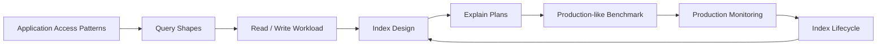

# 03- Indexing Strategies

## Overview

MongoDB indexes are data structures that reduce the amount of work required to locate documents. They are one of the primary mechanisms for making high-volume queries predictable as collections grow.

An index is not simply a performance switch. Every index introduces storage, memory, write-maintenance, and operational costs. Production indexing therefore requires balancing:

```text
Read performance
      +
Sort performance
      +
Query selectivity
      +
Data distribution
      +
Write overhead
      +
Storage cost
      +
Operational complexity
```

A good indexing strategy starts from application access patterns rather than from individual document fields.



## Why Indexes Exist

Without an appropriate index, MongoDB may need to inspect a large portion of a collection:

```text
Query
  ↓
COLLSCAN
  ↓
Document 1
Document 2
Document 3
...
Document N
  ↓
Filter matching documents
```

With an appropriate index:

```text
Query
  ↓
IXSCAN
  ↓
Relevant index entries
  ↓
FETCH matching documents
  ↓
Result
```

For a collection containing millions of documents, reducing the search space from millions of documents to a small index range can dramatically reduce latency and resource consumption.

## Index Costs

Indexes are not free.

| Benefit | Cost |
|---|---|
| Faster reads | Additional storage |
| Faster filtering | Additional write work |
| Faster sorting | Index maintenance |
| Potential covered queries | Memory consumption |
| Better predictable latency | Index build cost |
| Better query scalability | Operational complexity |

A senior engineer should ask both:

> "Will this index make the query faster?"

and:

> "What will this index cost the rest of the system?"

## Default `_id` Index

MongoDB automatically creates an index on `_id`.

Example:

```javascript
db.orders.getIndexes()
```

Typical result includes:

```javascript
{
  key: {
    _id: 1
  },
  name: "_id_"
}
```

This supports efficient lookups such as:

```javascript
db.orders.findOne({
  _id: ObjectId("64f000000000000000000001")
})
```

The `_id` index cannot be removed from a normal collection.

## Index Types

MongoDB provides several index types for different access patterns.

| Index type | Typical use |
|---|---|
| Single-field | Simple equality/range queries |
| Compound | Multiple predicates and/or sorting |
| Multikey | Array fields |
| Unique | Enforce uniqueness |
| Partial | Index only documents satisfying a filter |
| Sparse | Index documents where a field exists |
| TTL | Automatically expire documents |
| Text | Text-search-oriented workloads |
| Geospatial | Location-based queries |
| Hashed | Hash-based shard-key patterns |

Index selection should be driven by query requirements rather than by trying to use every available index type.

## Single-Field Indexes

Example:

```javascript
db.users.createIndex({
  email: 1
})
```

Useful for:

```javascript
db.users.findOne({
  email: "alice@example.com"
})
```

The index creates an ordered structure based on `email`.

### Advantages

- Simple
- Small compared with many compound indexes
- Easy to reason about
- Effective for direct access patterns

### Limitations

A single-field index may not efficiently support a query requiring multiple fields and a sort.

For example:

```javascript
db.orders.find({
  tenant_id: ObjectId("..."),
  status: "pending"
}).sort({
  created_at: -1
})
```

A compound index may be more appropriate.

## Compound Indexes

A compound index contains multiple fields:

```javascript
db.orders.createIndex({
  tenant_id: 1,
  status: 1,
  created_at: -1
})
```

Compound indexes are especially important for backend APIs because real queries commonly combine:

- Tenant filtering
- Authentication/authorization constraints
- Status filtering
- Date ranges
- Sorting
- Pagination

## Compound Index Ordering

Field order matters.

Consider:

```javascript
{
  tenant_id: 1,
  status: 1,
  created_at: -1
}
```

The index is ordered approximately as:

```text
tenant_id
    ↓
status
    ↓
created_at
```

Changing it to:

```javascript
{
  created_at: -1,
  tenant_id: 1,
  status: 1
}
```

creates a materially different access path.

Do not treat compound-index fields as an unordered set.

## Equality, Sort, Range

A practical way to reason about compound indexes is the Equality-Sort-Range guideline:

```text
Equality → Sort → Range
```

Consider:

```javascript
db.orders.find({
  tenant_id: tenantId,
  status: "pending",
  created_at: {
    $gte: startDate,
    $lt: endDate
  }
}).sort({
  priority: -1
})
```

The index design should be evaluated against:

- Equality predicates
- Sort requirements
- Range predicates
- Actual cardinality
- Query frequency
- Data distribution

ESR is a guideline rather than a mechanical rule. Validate the resulting design using `explain()` and representative workloads.

## Prefix Behavior

Given:

```javascript
db.orders.createIndex({
  tenant_id: 1,
  status: 1,
  created_at: -1
})
```

the index has useful prefixes such as:

```text
tenant_id
tenant_id + status
tenant_id + status + created_at
```

A query on:

```javascript
{
  tenant_id: tenantId
}
```

can potentially use the index efficiently.

A query only on:

```javascript
{
  status: "pending"
}
```

does not have the same useful leading-prefix access.

This is one reason index design must start from actual query patterns.

## Multikey Indexes

Multikey indexes support array fields.

Example document:

```javascript
{
  product_id: "P100",
  tags: [
    "database",
    "mongodb",
    "backend"
  ]
}
```

Index:

```javascript
db.products.createIndex({
  tags: 1
})
```

Query:

```javascript
db.products.find({
  tags: "mongodb"
})
```

MongoDB can index array elements individually.

### Production Considerations

Large arrays can create substantial index entries.

Be careful with:

- Unbounded arrays
- High-cardinality arrays
- Frequently modified arrays
- Large nested arrays

A document with thousands of frequently changing array elements can become expensive to maintain.

## Unique Indexes

Unique indexes enforce uniqueness.

Example:

```javascript
db.users.createIndex(
  {
    email: 1
  },
  {
    unique: true
  }
)
```

This prevents multiple documents from having the same indexed value.

Typical use cases:

- Email addresses
- External identifiers
- Idempotency keys
- Tenant-scoped identifiers with compound uniqueness

Example:

```javascript
db.api_keys.createIndex(
  {
    tenant_id: 1,
    key_id: 1
  },
  {
    unique: true
  }
)
```

This allows the same `key_id` across different tenants while preventing duplicates within a tenant.

## Partial Indexes

A partial index contains only documents satisfying a filter.

Example:

```javascript
db.orders.createIndex(
  {
    customer_id: 1,
    created_at: -1
  },
  {
    partialFilterExpression: {
      status: "active"
    }
  }
)
```

This can reduce:

- Index size
- Memory requirements
- Write-maintenance overhead

It is useful when queries repeatedly target a well-defined subset of documents.

The query must be compatible with the partial-index predicate for MongoDB to safely use the index.

## Sparse Indexes

A sparse index contains entries only for documents where the indexed field exists.

Example:

```javascript
db.users.createIndex(
  {
    secondary_email: 1
  },
  {
    sparse: true
  }
)
```

Sparse indexes can be useful for optional fields.

However, partial indexes are often more expressive because they allow explicit filtering conditions.

Do not choose sparse indexes merely because a field is nullable. Model the intended query semantics first.

## TTL Indexes

TTL indexes automatically remove documents after a configured period.

Example:

```javascript
db.sessions.createIndex(
  {
    expires_at: 1
  },
  {
    expireAfterSeconds: 0
  }
)
```

Documents can then contain:

```javascript
{
  session_id: "...",
  expires_at: ISODate("2026-09-22T18:00:00Z")
}
```

TTL indexes are useful for:

- Temporary sessions
- Short-lived tokens
- Ephemeral cache-like data
- Temporary processing records
- Retention-controlled event data

TTL deletion is asynchronous. Do not design business logic that requires deletion to occur at an exact instant.

## Text Indexes

Text indexes support text-search-oriented queries.

Example:

```javascript
db.products.createIndex({
  description: "text"
})
```

Query:

```javascript
db.products.find({
  $text: {
    $search: "mongodb database"
  }
})
```

Text indexes are appropriate only when their capabilities match the application's search requirements.

For sophisticated:

- Relevance ranking
- Autocomplete
- Fuzzy matching
- Search analytics
- Faceted search

consider whether a dedicated search capability is more appropriate.

## Geospatial Indexes

Geospatial indexes support location-oriented queries.

Example:

```javascript
db.stores.createIndex({
  location: "2dsphere"
})
```

Document:

```javascript
{
  name: "Store A",
  location: {
    type: "Point",
    coordinates: [88.3639, 22.5726]
  }
}
```

The index supports geospatial query patterns such as proximity searches.

Validate geospatial workloads with realistic geographic distributions because spatial selectivity varies significantly by dataset.

## Hashed Indexes

Hashed indexes transform indexed values into hash values.

Example:

```javascript
db.users.createIndex({
  user_id: "hashed"
})
```

They are particularly relevant to certain sharding strategies.

A hashed index should not be selected merely because it sounds evenly distributed. It changes range-query characteristics and should be used when the access pattern and architecture require it.

## Index Selectivity

Selectivity measures how effectively an index narrows candidate records.

Suppose:

```text
10,000,000 documents
```

and:

```javascript
status = "active"
```

matches:

```text
8,000,000 documents
```

The predicate is not very selective.

By contrast:

```javascript
user_id = ObjectId("...")
```

might match:

```text
1 document
```

The second predicate is highly selective.

High selectivity often makes index access much more effective.

## Cardinality

Cardinality is the number of distinct values in a field.

Example:

| Field | Approximate cardinality |
|---|---:|
| `country` | Low |
| `status` | Very low |
| `plan` | Low |
| `tenant_id` | Medium to high |
| `customer_id` | High |
| `_id` | Very high |

Cardinality alone does not determine whether an index is useful.

A low-cardinality field can be valuable as part of a compound index when combined with other predicates.

## Index Design from Query Patterns

Start with the query, not the collection.

Suppose an API repeatedly executes:

```javascript
db.orders.find({
  tenant_id: tenantId,
  status: "pending"
}).sort({
  created_at: -1
}).limit(50)
```

Candidate index:

```javascript
db.orders.createIndex({
  tenant_id: 1,
  status: 1,
  created_at: -1
})
```

Then verify:

```javascript
db.orders.find({
  tenant_id: tenantId,
  status: "pending"
}).sort({
  created_at: -1
}).limit(50).explain("executionStats")
```

The optimization loop is:

```text
Query pattern
    ↓
Candidate index
    ↓
Explain
    ↓
Benchmark
    ↓
Production monitoring
    ↓
Retain / modify / remove
```

## Indexing for REST APIs

Consider:

```text
GET /tenants/{tenant_id}/orders?status=pending
```

The database query might be:

```javascript
db.orders.find({
  tenant_id: tenantId,
  status: "pending"
}).sort({
  created_at: -1
}).limit(50)
```

A useful index should reflect the actual API access pattern.

The database should not first retrieve:

```text
all tenant orders
```

and then filter them in Python.

Prefer:

```text
HTTP request
    ↓
Authorization
    ↓
Indexed MongoDB query
    ↓
Small result set
    ↓
Serialization
    ↓
HTTP response
```

## Indexing for Multi-Tenant Applications

Multi-tenant systems frequently require tenant-aware indexes.

Example:

```javascript
db.orders.createIndex({
  tenant_id: 1,
  customer_id: 1,
  created_at: -1
})
```

This can support:

```javascript
db.orders.find({
  tenant_id: tenantId,
  customer_id: customerId
}).sort({
  created_at: -1
})
```

The tenant predicate should normally be included directly in the database query for both:

- Performance
- Authorization defense in depth

Do not rely on application-side filtering after retrieving cross-tenant data.

## Indexing for Pagination

For large collections, cursor/range pagination generally scales better than large offsets.

Example query:

```javascript
db.orders.find({
  tenant_id: tenantId,
  created_at: {
    $lt: lastCreatedAt
  }
}).sort({
  created_at: -1
}).limit(50)
```

Potential index:

```javascript
db.orders.createIndex({
  tenant_id: 1,
  created_at: -1
})
```

For deterministic ordering where timestamps can collide, use a unique tie-breaker such as `_id` and design the query/index accordingly.

## Covered Queries

A covered query can obtain the required information directly from an index without fetching the full document.

Example:

```javascript
db.orders.createIndex({
  tenant_id: 1,
  status: 1,
  order_number: 1
})
```

Query:

```javascript
db.orders.find(
  {
    tenant_id: tenantId,
    status: "pending"
  },
  {
    _id: 0,
    order_number: 1
  }
)
```

Verify coverage using:

```javascript
db.orders.find(
  {
    tenant_id: tenantId,
    status: "pending"
  },
  {
    _id: 0,
    order_number: 1
  }
).explain("executionStats")
```

Covered queries can reduce document fetches, but adding many fields to indexes increases index size and write cost.

## Index Intersection

MongoDB may use multiple indexes for a query.

For example:

```javascript
db.orders.createIndex({
  customer_id: 1
})

db.orders.createIndex({
  status: 1
})
```

A query such as:

```javascript
db.orders.find({
  customer_id: customerId,
  status: "pending"
})
```

may have multiple possible access strategies.

However, do not use index intersection as a substitute for a compound index when a high-frequency query has a stable and well-understood access pattern.

A purpose-built compound index may provide:

- Better filtering
- Better sort support
- More predictable execution
- Fewer index structures

## Indexes and Sorting

Consider:

```javascript
db.orders.find({
  tenant_id: tenantId
}).sort({
  created_at: -1
})
```

An index such as:

```javascript
{
  tenant_id: 1,
  created_at: -1
}
```

can potentially support both operations.

Without suitable index ordering, MongoDB may need a blocking sort:

```text
Read matching documents
        ↓
Build sort state
        ↓
Sort
        ↓
Return results
```

For large result sets, this can increase CPU and memory consumption.

## Indexes and Range Queries

Example:

```javascript
db.orders.find({
  customer_id: customerId,
  created_at: {
    $gte: startDate,
    $lt: endDate
  }
})
```

Potential index:

```javascript
{
  customer_id: 1,
  created_at: 1
}
```

The equality predicate narrows the index region before MongoDB traverses the date range.

Range selectivity should be considered against the expected time window.

## Indexing Aggregation Pipelines

Aggregation performance often depends on indexes on the early filtering stages.

Example:

```javascript
db.orders.aggregate([
  {
    $match: {
      tenant_id: tenantId,
      status: "completed"
    }
  },
  {
    $group: {
      _id: "$customer_id",
      total: {
        $sum: "$amount"
      }
    }
  }
])
```

Potential index:

```javascript
db.orders.createIndex({
  tenant_id: 1,
  status: 1
})
```

Early `$match` reduces the number of documents entering subsequent pipeline stages.

## Partial Indexes for Operational Workloads

Suppose only active jobs are queried frequently:

```javascript
{
  status: "pending"
}
```

and the collection contains millions of historical records.

A partial index can target the active workload:

```javascript
db.jobs.createIndex(
  {
    queue: 1,
    priority: -1,
    created_at: 1
  },
  {
    partialFilterExpression: {
      status: {
        $in: ["pending", "running"]
      }
    }
  }
)
```

This can significantly reduce the amount of historical data represented in the index.

## Indexing Time-Series Workloads

Time-oriented data often has access patterns such as:

```javascript
{
  tenant_id: tenantId,
  service: "payments",
  timestamp: {
    $gte: start,
    $lt: end
  }
}
```

Index design should reflect:

- Tenant or partition boundary
- Frequently filtered dimensions
- Time range
- Retention requirements

For very large event workloads, also evaluate MongoDB's time-series collection capabilities rather than treating every event workload as a generic collection.

## Index Size and Working Set

Indexes consume memory and storage.

Suppose:

```text
Collection data:
400 GB

Indexes:
250 GB
```

The system has a large amount of index data competing for memory and storage resources.

Frequently used indexes should ideally remain available in memory where possible, but MongoDB and the operating environment determine the actual cache behavior.

Do not assume:

```text
RAM > collection size
```

is the only relevant condition.

The working set includes the portions of data and indexes that the workload actively accesses.

## Index Maintenance Cost

Every insert or update affecting indexed fields may require index maintenance.

Consider a collection with:

```text
1 primary index
+
12 secondary indexes
```

A write may need to maintain multiple index structures.

As write throughput increases, excessive indexes can become a significant performance cost.

This is especially important for:

- Event ingestion
- Logging systems
- Kafka consumers
- Bulk imports
- High-volume APIs
- Background workers

## Read-Heavy vs Write-Heavy Workloads

### Read-Heavy

Example:

```text
100,000 reads/sec
5,000 writes/sec
```

Additional indexes may be justified if they materially reduce read latency.

### Write-Heavy

Example:

```text
5,000 reads/sec
100,000 writes/sec
```

Aggressive indexing can become expensive.

A senior engineer should evaluate:

```text
Read latency improvement
vs
Write amplification
```

## Index Lifecycle

Indexes should have ownership and justification.

For every production index, document:

| Question | Example |
|---|---|
| Which query needs it? | Pending order API |
| What is the query frequency? | 20,000 requests/min |
| Why this field order? | Equality + sort |
| What is its size? | 8 GB |
| How often is it used? | High |
| What writes maintain it? | Every order update |
| Can another index replace it? | No |

This prevents uncontrolled index accumulation.

## Creating Indexes Safely

Example:

```javascript
db.orders.createIndex(
  {
    tenant_id: 1,
    status: 1,
    created_at: -1
  },
  {
    name: "tenant_status_created_at"
  }
)
```

Always use explicit names for important production indexes.

This makes operational tasks easier:

```javascript
db.orders.dropIndex("tenant_status_created_at")
```

## Inspecting Indexes

List indexes:

```javascript
db.orders.getIndexes()
```

Inspect index statistics:

```javascript
db.orders.aggregate([
  {
    $indexStats: {}
  }
])
```

Use these statistics as evidence when evaluating index usage.

Do not remove an index solely because it appears unused during a short observation window.

## Dropping an Index

Example:

```javascript
db.orders.dropIndex(
  "tenant_status_created_at"
)
```

Before removal:

1. Identify dependent query patterns.
2. Check index usage over a meaningful period.
3. Verify no uniqueness or TTL semantics depend on it.
4. Evaluate production traffic patterns.
5. Remove it during an appropriate operational window.
6. Monitor query latency afterward.

## Index Builds

Index creation can consume substantial resources depending on:

- Collection size
- Index complexity
- Hardware
- Concurrent workload
- Deployment topology

Large production index changes should be treated as operational changes rather than casual shell commands.

For managed environments, understand the provider's supported index-build behavior and operational safeguards.

## Indexing During Deployments

Application deployments frequently introduce new query patterns.

A safer deployment sequence is:

```text
Design query
    ↓
Create index
    ↓
Validate index
    ↓
Deploy application code
    ↓
Monitor query behavior
```

Do not deploy an application that immediately depends on a missing large-collection index unless the workload is known to be safe.

## Indexes and Rolling Deployments

In a replica set, operational index changes should be planned with awareness of:

- Primary/secondary behavior
- Replication
- Resource consumption
- Application traffic
- Failover
- Index build duration

Managed MongoDB services may provide safer workflows than manually executing operational changes on production nodes.

## Python Index Management

Indexes can be defined programmatically when appropriate.

```python
from pymongo import ASCENDING, DESCENDING

collection.create_index(
    [
        ("tenant_id", ASCENDING),
        ("status", ASCENDING),
        ("created_at", DESCENDING),
    ],
    name="tenant_status_created_at",
)
```

However, index creation should generally be treated as a deployment or migration concern rather than something every application process performs at startup.

Avoid having every Kubernetes pod attempt to create large indexes during startup.

## FastAPI and Indexing

A FastAPI repository should expose query patterns that correspond to intentional indexes.

```python
class OrderRepository:
    def __init__(self, collection):
        self.collection = collection

    def get_pending_orders(self, tenant_id, limit=50):
        return self.collection.find(
            {
                "tenant_id": tenant_id,
                "status": "pending",
            },
            {
                "_id": 1,
                "order_number": 1,
                "created_at": 1,
                "total": 1,
            },
        ).sort(
            "created_at",
            -1,
        ).limit(limit)
```

The repository query should have an associated index strategy.

This makes performance behavior easier to reason about during code review.

## Indexing and Schema Design

Index design and schema design are coupled.

Suppose an order contains:

```javascript
{
  customer: {
    id: ObjectId("..."),
    name: "Alice"
  }
}
```

A query:

```javascript
{
  "customer.id": ObjectId("...")
}
```

may require:

```javascript
db.orders.createIndex({
  "customer.id": 1
})
```

If the application instead models:

```javascript
{
  customer_id: ObjectId("...")
}
```

the indexing strategy becomes simpler.

This does not mean flattened schemas are always better. Schema design should reflect access patterns, document ownership, update behavior, and domain semantics.

## Indexing Large Arrays

Avoid blindly indexing large unbounded arrays.

Example:

```javascript
{
  order_id: "...",
  events: [
    // potentially millions of entries
  ]
}
```

A multikey index over such a structure can become very large.

If the array represents an unbounded event history, consider:

```text
orders
order_events
```

instead.

This can improve:

- Index size
- Write behavior
- Document growth
- Query predictability

## Indexing Hot Documents

A hot document is a document accessed or modified at unusually high frequency.

Example:

```javascript
{
  _id: "...",
  inventory: 1000
}
```

If thousands of concurrent requests repeatedly update the same document, indexing alone does not solve the contention.

Consider:

- Data partitioning
- Atomic update design
- Workload distribution
- Queuing
- Sharding strategy
- Counter decomposition

Indexes optimize access paths; they do not eliminate document-level contention.

## Indexes in Sharded Clusters

Index strategy in a sharded cluster must consider:

- Shard key
- Query targeting
- Local indexes
- Query routing
- Scatter-gather operations

A query that does not include an appropriate shard-key predicate may be routed to multiple shards.

```text
Application
    ↓
mongos
    ↓
Shard 1 ─┐
Shard 2 ─┼─> Query results
Shard 3 ─┘
```

A good local index does not automatically make a scatter-gather query cheap.

## Indexes and Read Preference

Indexes exist independently on replica-set members.

When reading from secondaries, the relevant secondary must have the appropriate index state.

Operational index changes should therefore be planned with replication and member state in mind.

Do not assume that changing indexes on one server instantly means every member has completed the same operational work.

## Common Indexing Mistakes

### Indexing Every Field

Bad strategy:

```text
email
name
status
country
city
created_at
updated_at
...
```

without considering actual query patterns.

This creates unnecessary storage and write overhead.

### Wrong Compound Index Order

Creating:

```javascript
{
  created_at: -1,
  tenant_id: 1
}
```

when the dominant workload is:

```javascript
{
  tenant_id: tenantId
}
.sort({
  created_at: -1
})
```

may not provide the intended access path.

Design from the query shape.

### Ignoring Sort Requirements

A query can filter efficiently but still perform an expensive sort.

Always evaluate:

```text
Filter
+
Sort
+
Limit
```

as one access pattern.

### Ignoring Write Costs

An index that reduces read latency from:

```text
100 ms → 5 ms
```

may still be a poor choice if it causes unacceptable write amplification in a write-heavy workload.

### Assuming More Indexes Means More Performance

More indexes can produce:

- Higher storage usage
- More memory pressure
- More write work
- More index-build operations
- More complex query planning

The goal is an effective index set, not a maximum index count.

## Performance Investigation

When an index appears ineffective, follow a structured process:

```text
Symptom
↓
Identify query shape
↓
Inspect existing indexes
↓
Run explain("executionStats")
↓
Inspect winning plan
↓
Compare keys examined
↓
Compare documents examined
↓
Review selectivity and cardinality
↓
Check data distribution
↓
Evaluate alternative index
↓
Benchmark
↓
Monitor production
```

## Before-and-After Example

Suppose the application executes:

```javascript
db.orders.find({
  tenant_id: tenantId,
  status: "pending"
}).sort({
  created_at: -1
}).limit(50)
```

Before:

```text
winningPlan: COLLSCAN
nReturned: 50
totalDocsExamined: 750000
```

Candidate index:

```javascript
db.orders.createIndex({
  tenant_id: 1,
  status: 1,
  created_at: -1
})
```

After:

```javascript
db.orders.find({
  tenant_id: tenantId,
  status: "pending"
}).sort({
  created_at: -1
}).limit(50).explain("executionStats")
```

The desired outcome is not merely:

```text
COLLSCAN → IXSCAN
```

Evaluate whether the change also produces:

```text
Lower documents examined
Lower keys examined
Lower execution latency
Lower CPU consumption
Stable behavior under concurrency
```

## Benchmarking Index Changes

Index benchmarks should use representative:

- Dataset size
- Document sizes
- Value distribution
- Query frequency
- Concurrent users
- Read/write ratio

Example workload:

```text
10 million orders
60% pending
20% completed
20% cancelled

1000 requests/sec
70% reads
30% writes
```

A benchmark on:

```text
1,000 documents
```

does not establish production suitability.

## Monitoring Index Health

Monitor:

- Index size
- Index usage
- Query latency
- Query execution frequency
- Write throughput
- Storage growth
- Memory pressure
- CPU utilization
- Disk latency
- Replication health

Correlate index changes with application metrics.

For example:

```text
Deploy index
   ↓
Read latency decreases
   ↓
Write latency increases
   ↓
Storage increases
   ↓
Evaluate workload trade-off
```

## Security Considerations

Index design must not weaken authorization boundaries.

For multi-tenant applications:

```javascript
db.orders.find({
  tenant_id: authenticatedTenantId,
  order_id: requestedOrderId
})
```

A suitable index might be:

```javascript
db.orders.createIndex({
  tenant_id: 1,
  order_id: 1
})
```

This improves both access efficiency and the database's ability to enforce the intended query boundary.

Never expose administrative index-management operations through an untrusted application endpoint.

## Cost Considerations

Indexes consume:

- Disk
- Memory
- Compute
- Backup storage
- Replication bandwidth during operational changes
- Maintenance resources

In managed MongoDB environments, larger storage and infrastructure footprints can increase operational cost.

Before creating a large index, estimate:

```text
Expected query benefit
vs
Storage cost
+
Write overhead
+
Operational impact
```

## Production Best Practices

- Design indexes from real application query shapes.
- Treat compound index field order as a deliberate design decision.
- Use ESR as a guideline and verify with `explain()`.
- Consider filtering, sorting, and pagination together.
- Prefer selective access paths for latency-sensitive queries.
- Use partial indexes when only a subset of documents requires fast access.
- Use TTL indexes for retention-driven expiration rather than application cleanup loops where appropriate.
- Avoid indexing unbounded arrays without understanding multikey growth.
- Measure index usage before removing indexes.
- Reevaluate indexes as datasets and workloads change.
- Keep index creation and removal under deployment or migration control.
- Do not create indexes from every application process during startup.
- Monitor both read improvements and write overhead.
- Test indexes against production-like data distributions.
- Treat indexes as part of the application's architecture, not as an afterthought.

## Interview Considerations

### Why are compound indexes important?

They allow MongoDB to optimize common multi-field access patterns involving:

- Multiple equality predicates
- Range conditions
- Sorting
- Pagination

Their field order determines which query patterns can efficiently use the index.

### What is the ESR guideline?

ESR means:

```text
Equality
Sort
Range
```

It provides a practical starting point for compound-index ordering. Actual query behavior, data distribution, and execution plans should determine the final design.

### Does an index always improve performance?

No.

Indexes introduce:

- Storage overhead
- Write-maintenance overhead
- Memory consumption
- Operational complexity

An index is useful when its workload benefit outweighs those costs.

### What is a covered query?

A covered query can obtain the required query and result fields directly from an index without fetching the full documents.

The actual execution plan should be inspected to verify coverage.

### Why can a low-cardinality field still be useful in a compound index?

Although a field such as `status` may have few distinct values, it can become useful when combined with more selective fields and the required sort pattern.

Index usefulness depends on the complete query shape, not one field in isolation.

### Why should indexes be designed from queries rather than fields?

MongoDB indexes optimize access patterns.

The important question is:

```text
How does the application retrieve data?
```

not:

```text
Which fields exist in the document?
```

### Why can excessive indexing hurt a write-heavy system?

Each relevant write may require maintaining multiple index structures.

As index count and size increase, write throughput can decrease and storage/memory requirements can increase.

## Key Takeaways

- **Design MongoDB indexes from real query shapes, considering equality predicates, sorting, ranges, pagination, selectivity, and data distribution together.**
- **Compound-index field order is critical; use ESR as a starting guideline, then validate the design with `explain("executionStats")` and representative workloads.**
- **Indexes improve reads at a cost: every additional index consumes storage and memory and can increase write-maintenance overhead.**
- **Treat indexes as production-managed assets with explicit ownership, usage monitoring, lifecycle management, and workload-based justification.**
- **The correct index strategy is the smallest effective index set that provides predictable query performance without imposing unacceptable write, storage, memory, or operational costs.**