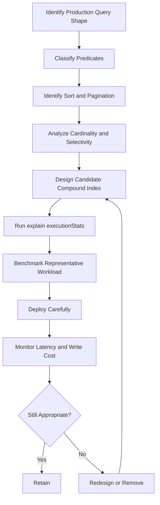

# 04- Compound Indexes

## Overview

Compound indexes are indexes built from two or more fields. They are one of the most important MongoDB performance mechanisms for production backend systems because real application queries rarely filter on a single field.

A compound index can support combinations of:

- Multiple equality predicates
- Equality plus sorting
- Equality plus range queries
- Filtering plus pagination
- Filtering plus projection
- Multi-tenant access patterns
- Aggregation pipelines
- Covered queries

The key property is that **field order matters**.

Given:

```javascript
{
  tenant_id: 1,
  status: 1,
  created_at: -1
}
```

MongoDB does not treat this as an unordered collection of fields. The index has a defined ordering:

```text
tenant_id
    ↓
status
    ↓
created_at
```

Compound-index design is therefore primarily an exercise in matching index ordering to application access patterns.

## Why Compound Indexes Matter

Consider an API that frequently executes:

```javascript
db.orders.find({
  tenant_id: tenantId,
  status: "pending"
}).sort({
  created_at: -1
}).limit(50)
```

A single-field index on `tenant_id` may help filter documents, but MongoDB may still need additional work for:

- Filtering by `status`
- Sorting by `created_at`
- Limiting the result set

A compound index can encode the complete access pattern:

```javascript
db.orders.createIndex({
  tenant_id: 1,
  status: 1,
  created_at: -1
})
```

The intended execution path becomes:

```text
API request
    ↓
tenant_id equality
    ↓
status equality
    ↓
created_at ordering
    ↓
first 50 matching entries
    ↓
documents
```

This can substantially reduce:

- Documents examined
- Keys examined
- CPU usage
- Memory used for sorting
- Query latency

## How Compound Indexes Work

MongoDB maintains index entries according to the ordered fields.

For:

```javascript
{
  tenant_id: 1,
  status: 1,
  created_at: -1
}
```

the logical ordering resembles:

```text
tenant-A
  ├── active
  │    ├── newest
  │    ├── ...
  │    └── oldest
  └── pending
       ├── newest
       ├── ...
       └── oldest

tenant-B
  ├── active
  └── pending
```

The exact internal representation is implementation-dependent, but the important engineering property is the ordered prefix structure.

This allows MongoDB to efficiently locate a region of the index rather than scanning unrelated entries.

## Prefixes and Compound Indexes

Given:

```javascript
db.orders.createIndex({
  tenant_id: 1,
  status: 1,
  created_at: -1
})
```

the index has useful prefixes corresponding to:

```text
tenant_id
tenant_id + status
tenant_id + status + created_at
```

For example:

```javascript
db.orders.find({
  tenant_id: tenantId
})
```

can potentially use the index efficiently.

Likewise:

```javascript
db.orders.find({
  tenant_id: tenantId,
  status: "pending"
})
```

can use a longer prefix.

But a query that only specifies:

```javascript
{
  status: "pending"
}
```

does not have the same direct access to the index because `status` is not the leading field.

This is one of the most important compound-index concepts:

> An index containing the right fields can still be the wrong index if the field ordering does not match the workload.

## Equality, Sort, Range

A practical compound-index design heuristic is the ESR guideline:

```text
Equality → Sort → Range
```

It is a guideline, not a rigid mathematical rule.

Suppose the application executes:

```javascript
db.orders.find({
  tenant_id: tenantId,
  status: "pending",
  created_at: {
    $gte: startDate,
    $lt: endDate
  }
}).sort({
  priority: -1
})
```

The relevant query components are:

```text
Equality:
tenant_id
status

Sort:
priority

Range:
created_at
```

A candidate index might therefore be evaluated as:

```javascript
{
  tenant_id: 1,
  status: 1,
  priority: -1,
  created_at: 1
}
```

However, index ordering should not be derived mechanically from ESR. The actual workload, cardinality, selectivity, sort requirements, and explain plans must determine the final design.

## Equality Fields

Equality predicates identify exact values.

Example:

```javascript
{
  tenant_id: tenantId,
  status: "pending"
}
```

These are strong candidates for leading positions in many compound indexes.

A common backend access pattern is:

```javascript
{
  tenant_id: 1,
  user_id: 1
}
```

for a query such as:

```javascript
db.orders.find({
  tenant_id: tenantId,
  user_id: userId
})
```

The exact ordering between equality fields can sometimes be flexible from a filtering perspective, but cardinality, workload distribution, sorting, and additional query shapes may make one ordering more useful than another.

## Sort Fields

Sorting can become expensive when MongoDB cannot obtain the required order directly from an index.

Query:

```javascript
db.orders.find({
  tenant_id: tenantId,
  status: "pending"
}).sort({
  created_at: -1
})
```

Candidate index:

```javascript
db.orders.createIndex({
  tenant_id: 1,
  status: 1,
  created_at: -1
})
```

The index can potentially provide documents in the required order after narrowing the relevant prefix.

Without a suitable index, MongoDB may need a sort stage:

```text
Find candidate documents
        ↓
Materialize candidate set
        ↓
SORT
        ↓
Return results
```

For large result sets, this can increase CPU and memory usage.

## Range Fields

Range predicates include operators such as:

```javascript
$gt
$gte
$lt
$lte
```

Example:

```javascript
{
  created_at: {
    $gte: startDate,
    $lt: endDate
  }
}
```

A compound index might be:

```javascript
{
  tenant_id: 1,
  created_at: 1
}
```

This allows MongoDB to first identify the tenant region and then traverse the relevant date range.

Range predicates can reduce the effectiveness of fields positioned after the range field for some query patterns, which is one reason ESR analysis is important.

## Equality + Sort Example

Consider:

```javascript
db.products.find({
  category_id: categoryId,
  active: true
}).sort({
  popularity_score: -1
}).limit(20)
```

Candidate index:

```javascript
db.products.createIndex({
  category_id: 1,
  active: 1,
  popularity_score: -1
})
```

This index reflects:

```text
category_id = equality
active = equality
popularity_score = sort
```

The application can retrieve the highest-ranked products without first sorting a large candidate set.

## Equality + Range Example

Consider:

```javascript
db.payments.find({
  merchant_id: merchantId,
  created_at: {
    $gte: startDate,
    $lt: endDate
  }
})
```

Candidate index:

```javascript
db.payments.createIndex({
  merchant_id: 1,
  created_at: 1
})
```

The index narrows the search to one merchant and then traverses the requested time range.

## Equality + Sort + Range Example

Suppose an API executes:

```javascript
db.events.find({
  tenant_id: tenantId,
  event_type: "payment",
  timestamp: {
    $gte: start,
    $lt: end
  }
}).sort({
  priority: -1
}).limit(100)
```

A candidate index could be:

```javascript
db.events.createIndex({
  tenant_id: 1,
  event_type: 1,
  priority: -1,
  timestamp: 1
})
```

But this is exactly the type of query where the candidate should be tested with `explain()`.

Do not assume that an index matching a conceptual ESR arrangement will always produce the best execution plan.

## Compound Index Direction

Consider:

```javascript
db.orders.createIndex({
  tenant_id: 1,
  created_at: -1
})
```

and:

```javascript
db.orders.find({
  tenant_id: tenantId
}).sort({
  created_at: -1
})
```

This is a natural match.

MongoDB can also use index traversal in reverse in many situations, meaning index direction does not always need to exactly match the requested sort direction.

For example, an index:

```javascript
{
  tenant_id: 1,
  created_at: 1
}
```

may also support the corresponding reverse ordering for compatible query shapes.

However, mixed sort directions matter.

An index such as:

```javascript
{
  tenant_id: 1,
  created_at: -1,
  priority: 1
}
```

has a specific compound ordering. A query requesting:

```javascript
{
  created_at: -1,
  priority: 1
}
```

is different from:

```javascript
{
  created_at: 1,
  priority: 1
}
```

Always validate complex sort requirements with `explain()`.

## Prefix Rule in Practice

Given:

```javascript
db.orders.createIndex({
  tenant_id: 1,
  status: 1,
  created_at: -1
})
```

These query shapes have different compatibility:

| Query | Index usefulness |
|---|---|
| `tenant_id` | Strong candidate |
| `tenant_id + status` | Strong candidate |
| `tenant_id + status + created_at` | Strong candidate |
| `tenant_id + created_at` | Potentially useful, but depends on query shape |
| `status` only | Poor prefix match |
| `created_at` only | Poor prefix match |

The exact winning plan depends on the optimizer, data distribution, and query shape.

## Selectivity and Cardinality

Compound indexes should be evaluated using actual data distribution.

Suppose:

```text
10 million orders
```

with:

```text
status = "completed" → 8 million
status = "pending"   → 1 million
status = "failed"    → 1 million
```

`status` has low cardinality.

An index beginning with:

```javascript
{
  status: 1
}
```

may not be especially selective.

However:

```javascript
{
  tenant_id: 1,
  status: 1,
  created_at: -1
}
```

can be highly useful if `tenant_id` substantially narrows the search.

### Important Principle

Do not judge a compound index from the cardinality of one field in isolation.

Evaluate the complete predicate and distribution.

## Multi-Tenant Compound Indexes

Multi-tenant applications are a common compound-index use case.

Query:

```javascript
db.orders.find({
  tenant_id: tenantId,
  customer_id: customerId
}).sort({
  created_at: -1
}).limit(50)
```

Index:

```javascript
db.orders.createIndex({
  tenant_id: 1,
  customer_id: 1,
  created_at: -1
})
```

This supports the access path:

```text
Tenant
  ↓
Customer
  ↓
Newest orders
  ↓
First page
```

The tenant condition should generally be part of the database query itself rather than applied after fetching documents.

This provides both:

- Efficient access
- Stronger authorization boundaries

## Pagination with Compound Indexes

Offset pagination:

```javascript
db.orders.find({
  tenant_id: tenantId
})
.skip(100000)
.limit(50)
```

can become increasingly expensive as the offset grows.

A compound index can support range-based pagination:

```javascript
db.orders.createIndex({
  tenant_id: 1,
  created_at: -1,
  _id: -1
})
```

A conceptual cursor query can then use the last item from the previous page as a boundary.

For deterministic pagination, use a unique tie-breaker when the primary sort field can contain duplicate values.

Example ordering:

```text
created_at DESC
_id DESC
```

The application should construct the corresponding boundary condition carefully.

## Covered Queries with Compound Indexes

Compound indexes can support covered queries.

Index:

```javascript
db.users.createIndex({
  tenant_id: 1,
  status: 1,
  email: 1
})
```

Query:

```javascript
db.users.find(
  {
    tenant_id: tenantId,
    status: "active"
  },
  {
    _id: 0,
    email: 1
  }
)
```

If all required query and projection fields are available from the index, MongoDB may avoid fetching the full documents.

Verify with:

```javascript
db.users.find(
  {
    tenant_id: tenantId,
    status: "active"
  },
  {
    _id: 0,
    email: 1
  }
).explain("executionStats")
```

Covered queries can be valuable for high-frequency read paths, but adding projection fields solely to obtain coverage can make indexes substantially larger.

## Compound Indexes and Aggregation

Suppose:

```javascript
db.orders.aggregate([
  {
    $match: {
      tenant_id: tenantId,
      status: "completed"
    }
  },
  {
    $group: {
      _id: "$customer_id",
      total: {
        $sum: "$amount"
      }
    }
  }
])
```

A compound index:

```javascript
db.orders.createIndex({
  tenant_id: 1,
  status: 1
})
```

can potentially reduce the number of documents entering the `$group` stage.

A common production pattern is:

```text
Indexed $match
      ↓
Small candidate set
      ↓
Aggregation
      ↓
Group / sort / transform
```

Early filtering is usually more valuable than indexing fields used only after a large aggregation stage.

## Compound Indexes and `$lookup`

Consider:

```javascript
db.orders.aggregate([
  {
    $match: {
      tenant_id: tenantId
    }
  },
  {
    $lookup: {
      from: "customers",
      localField: "customer_id",
      foreignField: "_id",
      as: "customer"
    }
  }
])
```

The relevant index strategy must consider both sides of the operation.

The foreign collection needs an appropriate access path for the lookup predicate. `_id` is already indexed, but custom `$lookup` pipelines may require additional indexes.

Do not optimize only the first collection while ignoring the access pattern on the joined collection.

## Compound Indexes and Regex

Regex behavior depends heavily on the pattern.

A prefix-oriented regex such as:

```javascript
{
  username: /^alice/
}
```

can have different index characteristics from:

```javascript
{
  username: /alice/
}
```

The second pattern can require examining a much larger portion of the indexed values.

Do not assume that adding a compound index automatically makes arbitrary regex searches efficient.

For search-heavy workloads, evaluate dedicated search capabilities where appropriate.

## Compound Indexes with Optional Fields

Suppose:

```javascript
{
  tenant_id: 1,
  deleted_at: 1,
  created_at: -1
}
```

and most documents have:

```javascript
deleted_at: null
```

The usefulness of this index depends on the actual query and data distribution.

A partial index may be more appropriate when the workload consistently targets a subset:

```javascript
db.orders.createIndex(
  {
    tenant_id: 1,
    created_at: -1
  },
  {
    partialFilterExpression: {
      deleted_at: null
    }
  }
)
```

Partial-index semantics must be evaluated carefully against the exact application query.

## Multiple Compound Indexes

A production collection may require several indexes.

Example workload:

```text
Query A:
tenant + status + created_at

Query B:
tenant + customer + created_at

Query C:
tenant + external_order_id
```

Possible indexes:

```javascript
db.orders.createIndex({
  tenant_id: 1,
  status: 1,
  created_at: -1
})

db.orders.createIndex({
  tenant_id: 1,
  customer_id: 1,
  created_at: -1
})

db.orders.createIndex({
  tenant_id: 1,
  external_order_id: 1
}, {
  unique: true
})
```

Do not automatically combine everything into one massive index.

A large compound index may support one query well while providing poor support for other query shapes and increasing write overhead.

## Redundant Compound Indexes

Suppose the collection has:

```javascript
{
  tenant_id: 1,
  status: 1,
  created_at: -1
}
```

and also:

```javascript
{
  tenant_id: 1,
  status: 1
}
```

The shorter index may be redundant if the longer index adequately serves all workloads that require the shorter prefix.

However, do not remove it automatically.

Evaluate:

- Query performance
- Index size
- Cache behavior
- Query frequency
- Write overhead
- Actual index usage

Sometimes the smaller index is still valuable because it consumes less memory and can provide a cheaper access path.

## Index Intersection vs Compound Index

MongoDB can sometimes combine multiple indexes.

Suppose:

```javascript
db.orders.createIndex({
  tenant_id: 1
})

db.orders.createIndex({
  status: 1
})
```

for:

```javascript
db.orders.find({
  tenant_id: tenantId,
  status: "pending"
})
```

MongoDB may consider combining indexes.

However, for a high-frequency query with predictable requirements, a dedicated compound index is often easier to reason about:

```javascript
db.orders.createIndex({
  tenant_id: 1,
  status: 1
})
```

The goal is not to maximize the number of possible indexes. It is to provide efficient and predictable access paths.

## Query Planner and Compound Indexes

MongoDB's query planner evaluates candidate plans.

Inspect a query with:

```javascript
db.orders.find({
  tenant_id: tenantId,
  status: "pending"
}).sort({
  created_at: -1
}).limit(50).explain("executionStats")
```

Important fields include:

```text
winningPlan
rejectedPlans
nReturned
totalKeysExamined
totalDocsExamined
executionTimeMillis
```

A useful plan might contain stages such as:

```text
IXSCAN
  ↓
FETCH
  ↓
LIMIT
```

An undesirable plan for a selective query may contain:

```text
COLLSCAN
  ↓
SORT
  ↓
LIMIT
```

The exact stage tree varies by MongoDB version and query.

## `COLLSCAN`

`COLLSCAN` means MongoDB scans collection documents.

Example:

```text
COLLSCAN
    ↓
750,000 documents examined
    ↓
50 documents returned
```

This can be acceptable for:

- Very small collections
- Queries returning a large fraction of the collection
- Administrative operations
- Workloads where an index genuinely provides no benefit

It is not automatically a bug.

For a selective, high-frequency production query, however, a collection scan deserves investigation.

## `IXSCAN`

`IXSCAN` indicates index traversal.

Example:

```text
IXSCAN
  ↓
Relevant index range
  ↓
FETCH
  ↓
Documents
```

`IXSCAN` alone does not prove that the query is efficient.

A query can still examine a very large number of index keys.

Always compare:

```text
nReturned
totalKeysExamined
totalDocsExamined
```

## `FETCH`

`FETCH` means MongoDB retrieves the underlying documents referenced by index entries.

For many normal indexed queries:

```text
IXSCAN → FETCH
```

is expected.

A covered query may avoid the document-fetch stage.

Do not attempt to eliminate every `FETCH` at the expense of enormous indexes.

## `SORT`

A `SORT` stage indicates sorting work that is not entirely satisfied by the access path.

Example:

```text
IXSCAN
  ↓
FETCH
  ↓
SORT
  ↓
LIMIT
```

If a high-volume API performs an expensive sort repeatedly, evaluate whether the index should encode the required ordering.

## Measuring Index Efficiency

Suppose:

```text
nReturned = 50
totalKeysExamined = 60
totalDocsExamined = 50
```

This is generally a strong signal for a selective query.

Compare:

```text
nReturned = 50
totalKeysExamined = 500,000
totalDocsExamined = 500,000
```

The query may technically use an index while still doing excessive work.

The important question is:

> How much database work was required to produce the requested result?

## Compound Index Design Workflow

Use a repeatable process:



## Step: Identify the Query Shape

Capture the actual query:

```javascript
db.orders.find({
  tenant_id: tenantId,
  status: "pending"
}).sort({
  created_at: -1
}).limit(50)
```

Do not design the index from an abstract schema such as:

```text
orders has tenant_id, status, created_at
```

The query is the requirement.

## Step: Classify Predicates

Separate fields into:

```text
Equality
Sort
Range
Projection
```

For example:

```text
tenant_id   → Equality
status      → Equality
created_at  → Sort
```

This provides the basis for candidate ordering.

## Step: Analyze Data Distribution

Check whether:

```text
tenant_id
```

is highly selective.

Also consider:

```text
status
```

distribution.

A query that works well for:

```text
tenant A → 1,000 documents
```

may behave differently for:

```text
tenant B → 50 million documents
```

Multi-tenant systems can have severe tenant-size skew.

## Step: Build a Candidate Index

Example:

```javascript
db.orders.createIndex(
  {
    tenant_id: 1,
    status: 1,
    created_at: -1
  },
  {
    name: "tenant_status_created_at"
  }
)
```

Use explicit names so indexes can be managed operationally.

## Step: Validate with `explain()`

```javascript
db.orders.find({
  tenant_id: tenantId,
  status: "pending"
}).sort({
  created_at: -1
}).limit(50).explain("executionStats")
```

Compare:

```text
nReturned
totalKeysExamined
totalDocsExamined
executionTimeMillis
winningPlan
rejectedPlans
```

## Step: Benchmark Under Realistic Load

Do not stop at a single `mongosh` query.

Test with:

- Production-like dataset size
- Realistic data distribution
- Representative document sizes
- Concurrent requests
- Normal read/write ratios

An index that looks excellent at low concurrency can behave differently under production load.

## Step: Monitor After Deployment

Monitor:

```text
Application latency
MongoDB query latency
CPU
Memory
Disk
Write throughput
Index size
Replication lag
Connection usage
```

An index change should be evaluated as a system-level change.

## Before-and-After Example

Initial query:

```javascript
db.orders.find({
  tenant_id: tenantId,
  status: "pending"
}).sort({
  created_at: -1
}).limit(50)
```

Initial execution:

```text
nReturned: 50
totalDocsExamined: 800000
executionTimeMillis: 420
```

Candidate index:

```javascript
db.orders.createIndex({
  tenant_id: 1,
  status: 1,
  created_at: -1
})
```

After optimization:

```text
nReturned: 50
totalDocsExamined: 50
executionTimeMillis: 8
```

The exact numbers are workload-dependent, but the important improvement is the reduction in work.

Do not optimize based only on execution time from one run. Validate under concurrency and representative production conditions.

## Python and Compound Indexes

Application repositories should make query/index relationships explicit.

```python
from datetime import datetime

from pymongo import ASCENDING, DESCENDING


class OrderRepository:
    def __init__(self, collection):
        self.collection = collection

    def list_pending(
        self,
        tenant_id,
        limit: int = 50,
    ):
        return self.collection.find(
            {
                "tenant_id": tenant_id,
                "status": "pending",
            },
            {
                "_id": 1,
                "order_number": 1,
                "created_at": 1,
                "total": 1,
            },
        ).sort(
            "created_at",
            DESCENDING,
        ).limit(limit)
```

The associated index might be:

```python
self.collection.create_index(
    [
        ("tenant_id", ASCENDING),
        ("status", ASCENDING),
        ("created_at", DESCENDING),
    ],
    name="tenant_status_created_at",
)
```

In production, index creation should generally be handled by controlled deployment or migration processes rather than every application startup.

## FastAPI Example

Consider:

```text
GET /orders?status=pending&limit=50
```

The request flow can be:

```text
FastAPI
   ↓
Authentication
   ↓
Tenant resolution
   ↓
Repository
   ↓
MongoDB compound index
   ↓
Limited result set
   ↓
Pydantic serialization
```

The query should preserve the tenant boundary:

```python
def get_pending_orders(collection, tenant_id, limit: int = 50):
    return collection.find(
        {
            "tenant_id": tenant_id,
            "status": "pending",
        }
    ).sort(
        "created_at",
        -1,
    ).limit(limit)
```

The compound index should be designed around this actual access pattern.

## Django Integration

When MongoDB is used with Django, compound indexes should be considered independently from Django's traditional relational-database indexing assumptions.

Depending on the integration approach, indexes may be defined through:

- MongoDB commands
- PyMongo
- MongoDB-specific Django backend configuration
- MongoEngine metadata

The important engineering rule is:

> Do not assume a MongoDB compound index behaves like a PostgreSQL B-tree index simply because both systems expose an index abstraction.

The actual MongoDB query shape and MongoDB execution plan remain authoritative.

## Compound Indexes and Transactions

Transactions do not remove the need for proper indexing.

Consider:

```python
with client.start_session() as session:
    with session.start_transaction():
        orders.update_one(
            {
                "tenant_id": tenant_id,
                "order_id": order_id,
            },
            {
                "$set": {
                    "status": "completed",
                }
            },
            session=session,
        )
```

An appropriate compound index can help locate the target document efficiently.

Poorly indexed transactional operations can increase:

- Transaction duration
- Lock/contention exposure
- Resource consumption
- Retry probability
- Application latency

Keep transactions short and make their database operations efficient.

## Compound Indexes and Write Performance

Consider a write-heavy collection:

```text
100,000 writes/sec
```

with:

```text
15 secondary indexes
```

Every write may require multiple index updates.

Adding another compound index can therefore have measurable consequences.

Evaluate:

```text
Read latency improvement
vs
Write throughput reduction
```

For ingestion-heavy systems such as Kafka consumers or Celery workers, this trade-off is especially important.

## Compound Indexes and Large Documents

An index stores indexed field values rather than entire documents, but large indexed values can still increase index size.

Avoid indexing unnecessarily large fields such as:

```javascript
description
raw_payload
large_metadata
```

when they are not required for the access pattern.

For example, prefer:

```javascript
{
  tenant_id: 1,
  event_type: 1,
  created_at: -1
}
```

over indexing a large payload field simply because it exists in the document.

## Compound Indexes and Multikey Fields

Compound indexes involving array fields require additional care.

Example:

```javascript
{
  tenant_id: 1,
  tags: 1,
  created_at: -1
}
```

If `tags` is an array, the index becomes multikey.

Before using such an index, evaluate:

- Array size
- Array cardinality
- Update frequency
- Query patterns
- Index size
- Document growth

Do not assume a compound index involving an array behaves exactly like one involving scalar fields.

## Compound Indexes and Sharding

In a sharded MongoDB deployment, compound indexes must be considered together with the shard key.

For example:

```text
Shard key:
tenant_id

Query:
tenant_id + status + created_at
```

A local index such as:

```javascript
{
  tenant_id: 1,
  status: 1,
  created_at: -1
}
```

may support the query efficiently within targeted shards.

But a query such as:

```javascript
{
  status: "pending"
}
```

without the shard-key predicate may require broader routing.

Therefore:

```text
Shard-key design
+
Compound-index design
+
Query targeting
```

must be considered together.

## Index Size

Compound indexes generally consume more storage as fields are added.

Consider:

```javascript
{
  tenant_id: 1,
  status: 1
}
```

versus:

```javascript
{
  tenant_id: 1,
  status: 1,
  created_at: -1,
  customer_id: 1,
  priority: 1
}
```

The second index may support more query requirements, but it is also larger and more expensive to maintain.

A useful principle is:

> Prefer the smallest index that efficiently satisfies a meaningful production workload.

## Index Prefixes and Redundant Indexes

Suppose the collection contains:

```javascript
{
  tenant_id: 1,
  status: 1,
  created_at: -1
}
```

and:

```javascript
{
  tenant_id: 1
}
```

The shorter index may be redundant from a pure prefix perspective.

However, the longer index consumes more memory.

The decision should consider:

- Index size
- Query frequency
- Cache pressure
- Actual query latency
- Index usage
- Write cost

A redundant index should be removed only after evidence shows that it is unnecessary.

## Query Plan Stability

Query behavior can change as data grows.

A query that performs well today may later become inefficient because:

- Cardinality changes
- Data distribution changes
- One tenant becomes much larger
- Indexes change
- Working set exceeds available memory
- Query shapes evolve

Therefore, compound-index design is not a one-time task.

Monitor important query shapes over time.

## Index Statistics

Inspect indexes:

```javascript
db.orders.getIndexes()
```

Inspect index usage:

```javascript
db.orders.aggregate([
  {
    $indexStats: {}
  }
])
```

Index usage statistics should be interpreted over an appropriate observation period.

A rarely used index may still be required for:

- Monthly reports
- Disaster-recovery procedures
- Administrative workloads
- Compliance operations
- Seasonal traffic

Do not remove indexes solely because they were not used during a short measurement period.

## Production Index Lifecycle

A production lifecycle can be:

```text
Query identified
      ↓
Workload measured
      ↓
Candidate index designed
      ↓
Explain / benchmark
      ↓
Index created
      ↓
Application deployed
      ↓
Production monitored
      ↓
Usage reviewed
      ↓
Index retained / redesigned / removed
```

Index changes should be reviewed like schema changes.

## Operational Naming

Prefer explicit names:

```javascript
db.orders.createIndex(
  {
    tenant_id: 1,
    status: 1,
    created_at: -1
  },
  {
    name: "tenant_status_created_at"
  }
)
```

This is easier to reference in:

```text
Runbooks
Deployments
Migrations
Monitoring
Incident response
```

than relying on automatically generated names.

## Security Considerations

Compound indexes should reinforce, not bypass, security boundaries.

For a tenant-scoped application:

```javascript
db.documents.findOne({
  tenant_id: authenticatedTenantId,
  document_id: requestedDocumentId
})
```

is preferable to:

```javascript
db.documents.findOne({
  document_id: requestedDocumentId
})
```

followed by an application-side tenant check when the query itself can enforce the tenant boundary.

A suitable index:

```javascript
db.documents.createIndex({
  tenant_id: 1,
  document_id: 1
})
```

can make the secure access pattern efficient.

Indexes themselves can also contain sensitive values. Consider data exposure implications when:

- Accessing database files
- Creating backups
- Exporting databases
- Sharing diagnostics
- Inspecting production metadata

## Monitoring Considerations

Monitor compound-index impact through both database and application metrics.

Important signals include:

| Metric | What it indicates |
|---|---|
| Query latency | User-visible performance |
| `totalDocsExamined` | Document scanning work |
| `totalKeysExamined` | Index traversal work |
| Index size | Storage and cache pressure |
| Index usage | Whether an index is actually needed |
| Write latency | Index maintenance cost |
| CPU | Query and index processing |
| Memory | Working-set pressure |
| Disk latency | Storage bottlenecks |
| Replication lag | Operational impact |

The most useful measurement is rarely one metric in isolation.

## Common Mistakes

### Putting the Most Selective Field First Automatically

A common rule of thumb is:

> Put the most selective field first.

This is incomplete.

Compound-index ordering must consider:

- Equality
- Sort
- Range
- Cardinality
- Data distribution
- Query frequency
- Pagination
- Other query shapes

Do not use selectivity as the only ordering rule.

### Applying ESR Mechanically

ESR is a design heuristic.

It does not replace:

```text
explain()
+
benchmarking
+
production observation
```

### Creating One Giant Index

Example:

```javascript
{
  tenant_id: 1,
  status: 1,
  customer_id: 1,
  created_at: -1,
  priority: 1,
  region: 1,
  category: 1,
  source: 1
}
```

This may look flexible but can create:

- Large index size
- Higher write overhead
- Poorer cache efficiency
- Increased operational complexity

Design indexes around actual query families.

### Ignoring Query Frequency

An index supporting:

```text
10 queries/day
```

has a different business value from one supporting:

```text
50,000 queries/sec
```

Index decisions should consider workload importance.

### Ignoring Sort

A query may have an excellent filter index and still perform an expensive sort.

Always inspect the complete execution plan.

### Ignoring Data Skew

A query can perform well for small tenants and poorly for a tenant containing most of the data.

Test representative distributions.

### Creating Indexes at Application Startup

Avoid:

```python
def startup():
    collection.create_index(...)
```

on every Kubernetes pod when indexes are large or numerous.

Use controlled migration/deployment processes instead.

### Assuming `IXSCAN` Means the Query Is Fast

This is incorrect.

A query can use an index and still examine millions of keys.

Always inspect:

```text
nReturned
totalKeysExamined
totalDocsExamined
executionTimeMillis
```

## Production Troubleshooting

### Slow Query

```text
Symptom
↓
API latency increased
↓
Capture exact MongoDB query shape
↓
Run explain("executionStats")
↓
Inspect winningPlan
↓
Check totalKeysExamined and totalDocsExamined
↓
Check for COLLSCAN / unnecessary SORT
↓
Review compound-index ordering
↓
Check cardinality and data distribution
↓
Benchmark candidate index
↓
Deploy controlled change
↓
Monitor latency and write impact
↓
Document root cause and prevention
```

### Unexpected `COLLSCAN`

Possible causes:

- No suitable index
- Wrong compound-index prefix
- Query shape differs from expected
- Predicate is not selective
- Index cannot support the required operation
- Planner selected another strategy
- Query was changed after the index was created

Diagnostic:

```javascript
db.orders.find({
  tenant_id: tenantId,
  status: "pending"
}).explain("executionStats")
```

Then inspect:

```text
winningPlan
rejectedPlans
totalDocsExamined
totalKeysExamined
```

### Expensive `SORT`

Possible causes:

- Index does not provide the requested ordering
- Compound-index field order is incorrect
- Query contains a range that limits sort support
- Sort is performed after a large intermediate result

Isolation:

```text
Filter only
    ↓
Filter + sort
    ↓
Filter + sort + limit
```

Compare each execution plan.

### High Write Latency After Adding an Index

Possible causes:

- Index is large
- Write rate is high
- Indexed fields are frequently modified
- Too many indexes already exist
- Storage is under pressure

Diagnostic workflow:

```text
Write latency increase
↓
Compare before/after deployment
↓
Measure index size
↓
Review index usage
↓
Measure write throughput
↓
Check CPU / disk / memory
↓
Determine whether index benefit justifies cost
```

## Production Recommendations

- Start from real query shapes.
- Design compound indexes around complete access patterns.
- Use equality, sort, and range analysis.
- Treat ESR as a guideline rather than a rule.
- Validate every important index with `explain("executionStats")`.
- Test with production-like data distributions.
- Consider multi-tenant skew explicitly.
- Include pagination requirements in index design.
- Avoid unnecessarily wide indexes.
- Monitor index usage and write overhead.
- Review indexes as application query patterns evolve.
- Treat index changes as operational changes.
- Document why each important compound index exists.
- Remove redundant indexes only after evidence-based analysis.
- Coordinate compound-index strategy with sharding and schema design.

## Interview Considerations

### Why does field order matter in a compound index?

Because MongoDB maintains an ordered index structure. Queries can efficiently use leading index prefixes, so changing:

```javascript
{
  tenant_id: 1,
  status: 1,
  created_at: -1
}
```

to:

```javascript
{
  created_at: -1,
  tenant_id: 1,
  status: 1
}
```

creates a different access structure.

### What is ESR?

ESR stands for:

```text
Equality
Sort
Range
```

It is a practical heuristic for designing compound indexes. Actual workload characteristics and execution plans determine the final index.

### Is the most selective field always the first field?

No.

Selectivity is important, but compound-index ordering must also account for equality predicates, sorting, ranges, pagination, query frequency, cardinality, and data distribution.

### Why might an index be used but still be inefficient?

Because an `IXSCAN` can still examine a very large number of index keys.

For example:

```text
nReturned = 50
totalKeysExamined = 1,000,000
```

indicates significant index traversal work despite using an index.

### Why can a compound index be better than two single-field indexes?

A compound index can encode the complete access pattern, including:

- Multiple predicates
- Sort ordering
- Pagination
- Potential coverage

Two single-field indexes may require a less efficient plan or may not support the required sort.

### Can one compound index replace multiple indexes?

Sometimes, but not always.

A compound index supports its useful prefixes, but unrelated query patterns may still require different indexes.

The goal is to minimize the total effective index set, not to force every workload into one index.

### Why should compound indexes be tested with realistic data?

Because query performance depends on:

- Cardinality
- Selectivity
- Data distribution
- Tenant size
- Result-set size
- Concurrent workload

A query tested against a small synthetic dataset can produce a misleadingly good execution plan.

## Key Takeaways

- **Compound indexes are ordered access structures; field order must be designed around actual query shapes rather than treated as an unordered list of fields.**
- **Use Equality-Sort-Range as a practical starting point, then validate the candidate index using execution statistics, realistic data, and production-like workloads.**
- **Evaluate filtering, sorting, pagination, cardinality, and multi-tenant data distribution together when designing compound indexes.**
- **Avoid oversized or redundant indexes because every additional index increases storage, memory pressure, and write-maintenance cost.**
- **Treat compound-index design as a lifecycle: measure the workload, design, explain, benchmark, deploy, monitor, and periodically reassess.**