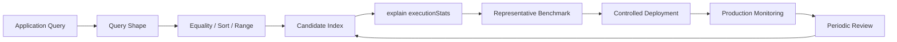

# 05- Index Selection and ESR Rule

## Overview

MongoDB index selection is the process of choosing an index structure that matches the application's actual query workload. The goal is not to create the maximum number of indexes, but to provide efficient and predictable access paths while controlling storage, memory, write, and operational costs.

For compound indexes, the Equality-Sort-Range (ESR) guideline provides a useful starting point:

```text
Equality → Sort → Range
```

ESR is a design heuristic, not a rule that should be applied mechanically. A production index must ultimately be validated against:

- Actual query shapes
- Cardinality
- Selectivity
- Data distribution
- Sort requirements
- Range width
- Pagination strategy
- Read/write workload
- Index size
- Query planner behavior
- Production latency

A strong MongoDB engineer therefore treats index selection as an iterative engineering process:



## Why Index Selection Matters

A query can return only a few documents while requiring MongoDB to examine hundreds of thousands of documents or index keys.

Consider:

```text
nReturned = 50
totalDocsExamined = 800000
```

The application receives only 50 documents, but MongoDB performed substantial work to produce them.

A well-designed index can reduce this to something closer to:

```text
nReturned = 50
totalDocsExamined = 50
```

The exact values depend on the workload, but the engineering objective is to minimize unnecessary database work.

## Index Selection Is Query-Driven

MongoDB schema design starts with access patterns, and index design continues the same principle.

Do not start with:

```text
orders collection has:
- tenant_id
- customer_id
- status
- created_at
- priority
```

and conclude that every field should receive an index.

Start with the actual workload:

```javascript
db.orders.find({
  tenant_id: tenantId,
  status: "pending"
}).sort({
  created_at: -1
}).limit(50)
```

Then design an index around that access pattern.

Candidate:

```javascript
db.orders.createIndex({
  tenant_id: 1,
  status: 1,
  created_at: -1
})
```

## What ESR Means

ESR stands for:

| Component | Meaning | Typical examples |
|---|---|---|
| E | Equality | `tenant_id`, `status`, `customer_id` |
| S | Sort | `created_at`, `priority`, `score` |
| R | Range | `$gt`, `$gte`, `$lt`, `$lte` |

The basic heuristic is:

```text
Equality fields
      ↓
Sort fields
      ↓
Range fields
```

For example:

```javascript
db.orders.find({
  tenant_id: tenantId,
  status: "pending",
  created_at: {
    $gte: startDate,
    $lt: endDate
  }
}).sort({
  priority: -1
})
```

A candidate ESR-oriented index might be:

```javascript
{
  tenant_id: 1,
  status: 1,
  priority: -1,
  created_at: 1
}
```

This is a candidate, not an automatically correct answer.

## Equality

Equality predicates identify specific values.

Examples:

```javascript
{
  tenant_id: tenantId
}
```

```javascript
{
  customer_id: customerId,
  status: "active"
}
```

```javascript
{
  organization_id: organizationId,
  region: "ap-south-1"
}
```

Equality fields are commonly placed toward the beginning of a compound index.

Example:

```javascript
db.orders.createIndex({
  tenant_id: 1,
  status: 1
})
```

for:

```javascript
db.orders.find({
  tenant_id: tenantId,
  status: "pending"
})
```

## Multiple Equality Fields

Suppose:

```javascript
db.orders.find({
  tenant_id: tenantId,
  customer_id: customerId,
  status: "pending"
})
```

A candidate index is:

```javascript
{
  tenant_id: 1,
  customer_id: 1,
  status: 1
}
```

When multiple predicates are equality conditions, several orderings may be capable of supporting the query.

The final choice should consider:

- Which fields are present in other query shapes
- Cardinality
- Data distribution
- Sort requirements
- Multi-tenant behavior
- Index reuse
- Index size

Do not reduce compound-index ordering to "put the highest-cardinality field first."

## Equality and Multi-Tenancy

Multi-tenant applications commonly have a query boundary such as:

```javascript
{
  tenant_id: tenantId
}
```

A typical query might be:

```javascript
db.orders.find({
  tenant_id: tenantId,
  status: "pending"
}).sort({
  created_at: -1
})
```

Candidate index:

```javascript
{
  tenant_id: 1,
  status: 1,
  created_at: -1
}
```

Including `tenant_id` can provide an efficient tenant-scoped access path.

It also makes the intended authorization boundary explicit in the database query.

## Sort

A sort predicate controls result ordering.

Example:

```javascript
.sort({
  created_at: -1
})
```

If MongoDB cannot obtain the required order from the index, it may need a `SORT` stage.

Conceptually:

```text
COLLSCAN / IXSCAN
       ↓
Candidate documents
       ↓
SORT
       ↓
LIMIT
```

A suitable compound index can instead provide an ordered access path:

```text
IXSCAN
   ↓
Already ordered entries
   ↓
LIMIT
```

This can reduce CPU and memory consumption.

## Range

Range predicates include:

```javascript
$gt
$gte
$lt
$lte
```

Example:

```javascript
{
  created_at: {
    $gte: startDate,
    $lt: endDate
  }
}
```

Range queries are different from equality predicates because they can cover a potentially large portion of the index.

For example:

```javascript
{
  tenant_id: 1,
  created_at: 1
}
```

can provide an efficient tenant-specific date range:

```javascript
db.orders.find({
  tenant_id: tenantId,
  created_at: {
    $gte: startDate,
    $lt: endDate
  }
})
```

## Basic ESR Example

Query:

```javascript
db.orders.find({
  tenant_id: tenantId,
  status: "pending",
  created_at: {
    $gte: startDate,
    $lt: endDate
  }
}).sort({
  priority: -1
}).limit(50)
```

Classify the fields:

```text
Equality:
tenant_id
status

Sort:
priority

Range:
created_at
```

Candidate:

```javascript
db.orders.createIndex({
  tenant_id: 1,
  status: 1,
  priority: -1,
  created_at: 1
})
```

Then validate:

```javascript
db.orders.find({
  tenant_id: tenantId,
  status: "pending",
  created_at: {
    $gte: startDate,
    $lt: endDate
  }
}).sort({
  priority: -1
}).limit(50).explain("executionStats")
```

The index is not considered successful merely because MongoDB uses it.

Inspect:

```text
winningPlan
nReturned
totalKeysExamined
totalDocsExamined
executionTimeMillis
```

## ESR Is a Guideline, Not a Law

One of the most important senior-level concepts is that ESR should not be applied mechanically.

Consider:

```javascript
{
  tenant_id: tenantId,
  status: "active",
  created_at: {
    $gte: startDate
  }
}
```

If `created_at` has an extremely selective range while `status` matches nearly every document, the practical behavior may differ from what a simplistic field-ordering rule suggests.

MongoDB's query planner, index structure, data distribution, and workload all matter.

Use ESR to generate candidate designs.

Use evidence to select the final design.

## Selectivity

Selectivity describes how effectively a predicate reduces the candidate set.

Suppose:

```text
10,000,000 documents
```

and:

```text
status = "active"
```

matches:

```text
9,500,000 documents
```

The predicate is poorly selective.

Now consider:

```text
customer_id = ObjectId(...)
```

matching:

```text
3 documents
```

This predicate is highly selective.

However, selectivity must be evaluated in context.

A low-selectivity field such as:

```text
status
```

can still be valuable in:

```javascript
{
  tenant_id: 1,
  status: 1,
  created_at: -1
}
```

when `tenant_id` significantly reduces the candidate set and the index also satisfies the required sort.

## Cardinality

Cardinality is the number of distinct values in a field.

Example:

| Field | Typical cardinality |
|---|---:|
| `status` | Low |
| `country` | Low |
| `plan` | Low |
| `tenant_id` | Medium/high |
| `customer_id` | High |
| `_id` | Very high |

High cardinality often improves selectivity, but cardinality alone does not determine index ordering.

A field can have high cardinality but still be a poor leading field if the application's dominant query shape does not use it.

## Equality Field Ordering

Suppose:

```javascript
db.orders.find({
  tenant_id: tenantId,
  customer_id: customerId,
  status: "pending"
})
```

Possible indexes include:

```javascript
{
  tenant_id: 1,
  customer_id: 1,
  status: 1
}
```

or:

```javascript
{
  customer_id: 1,
  tenant_id: 1,
  status: 1
}
```

If the application always scopes queries by tenant, the first ordering may be preferable because it aligns with the dominant access boundary.

If another high-frequency workload starts with `customer_id` independently, a different index may be required.

The correct answer depends on the workload, not on a universal ordering rule.

## Sort Direction

Consider:

```javascript
db.orders.createIndex({
  tenant_id: 1,
  created_at: -1
})
```

for:

```javascript
db.orders.find({
  tenant_id: tenantId
}).sort({
  created_at: -1
})
```

The index provides the required ordering.

MongoDB can often traverse a compatible index in reverse, so index direction should not be interpreted as simply "ascending index only supports ascending queries."

Mixed sort directions require more careful analysis.

For example:

```javascript
{
  created_at: -1,
  priority: 1
}
```

has a different ordering requirement from:

```javascript
{
  created_at: 1,
  priority: 1
}
```

Validate complex sort patterns with `explain()`.

## Equality + Sort Without Range

Query:

```javascript
db.products.find({
  category_id: categoryId,
  active: true
}).sort({
  popularity_score: -1
}).limit(20)
```

Candidate:

```javascript
db.products.createIndex({
  category_id: 1,
  active: 1,
  popularity_score: -1
})
```

Classification:

```text
category_id        → Equality
active             → Equality
popularity_score   → Sort
```

This is one of the cleanest ESR scenarios.

## Equality + Range Without Sort

Query:

```javascript
db.payments.find({
  merchant_id: merchantId,
  created_at: {
    $gte: startDate,
    $lt: endDate
  }
})
```

Candidate:

```javascript
db.payments.createIndex({
  merchant_id: 1,
  created_at: 1
})
```

Classification:

```text
merchant_id → Equality
created_at  → Range
```

The index narrows to the merchant and then traverses the relevant date range.

## Equality + Sort + Range

Consider:

```javascript
db.events.find({
  tenant_id: tenantId,
  event_type: "payment",
  timestamp: {
    $gte: start,
    $lt: end
  }
}).sort({
  priority: -1
}).limit(100)
```

Candidate:

```javascript
db.events.createIndex({
  tenant_id: 1,
  event_type: 1,
  priority: -1,
  timestamp: 1
})
```

Classification:

```text
Equality:
tenant_id
event_type

Sort:
priority

Range:
timestamp
```

But this should be tested rather than accepted automatically.

## When ESR May Need Careful Reassessment

ESR becomes more nuanced when queries contain:

- Very wide ranges
- Low-selectivity equality predicates
- Large sorts
- Multiple sort fields
- Multikey indexes
- `$in`
- `$or`
- Regex predicates
- Geospatial operators
- Large tenant skew
- Sharding
- Highly variable query shapes

These workloads require execution-plan analysis rather than relying solely on a mnemonic.

## `$in` and ESR

`$in` deserves special consideration.

Example:

```javascript
{
  status: {
    $in: ["pending", "processing"]
  }
}
```

This is not equivalent to a simple equality predicate in every execution context.

Its behavior depends on:

- Number of values
- Other predicates
- Sort requirements
- Query planner behavior
- MongoDB version

For performance-sensitive queries involving `$in`, inspect the actual execution plan.

## `$or` and Compound Indexes

Consider:

```javascript
db.orders.find({
  $or: [
    {
      customer_id: customerId
    },
    {
      external_order_id: externalId
    }
  ]
})
```

A single compound index such as:

```javascript
{
  customer_id: 1,
  external_order_id: 1
}
```

is not equivalent to having separate access paths for both branches.

Often the query requires indexes appropriate to the individual `$or` branches.

The important principle is:

> Compound indexes optimize ordered field combinations; they do not automatically optimize arbitrary logical combinations.

## Query Shape vs Query Value

These queries have the same basic shape:

```javascript
{
  tenant_id: ObjectId("..."),
  status: "pending"
}
```

and:

```javascript
{
  tenant_id: ObjectId("..."),
  status: "completed"
}
```

The actual values differ, but the access pattern is similar.

Index design should generally focus on the query shape rather than individual values.

However, data distribution can make some values behave very differently.

For example:

```text
tenant-A → 1,000 documents
tenant-B → 100,000,000 documents
```

The query shape is the same, but the workload characteristics are not.

## Data Skew

Data skew is a major production concern.

Suppose a multi-tenant system contains:

```text
Tenant A → 1,000 orders
Tenant B → 500,000 orders
Tenant C → 100,000,000 orders
```

An index that appears efficient for Tenant A may behave differently for Tenant C.

Performance testing should therefore include:

- Small tenants
- Typical tenants
- Largest tenants
- High-volume tenants

Do not benchmark only average-sized data.

## Compound Index Prefixes

Given:

```javascript
{
  tenant_id: 1,
  status: 1,
  created_at: -1
}
```

the useful ordered prefixes include:

```text
tenant_id
tenant_id + status
tenant_id + status + created_at
```

This means one index can sometimes support multiple related query shapes.

For example:

```javascript
{
  tenant_id: tenantId
}
```

and:

```javascript
{
  tenant_id: tenantId,
  status: "pending"
}
```

may both benefit from the same index.

This is one reason compound indexes can sometimes replace several single-field indexes.

## When Prefix Coverage Is Not Enough

Suppose:

```javascript
{
  tenant_id: 1,
  status: 1,
  created_at: -1
}
```

exists.

A query such as:

```javascript
{
  status: "pending"
}
```

does not have the same direct prefix access because the leading field is missing.

Adding an index:

```javascript
{
  status: 1
}
```

may be justified if this is a frequent, important workload.

Do not add it automatically. Measure the workload first.

## Covered Queries and ESR

A compound index can sometimes satisfy:

```text
Filter
+
Sort
+
Projection
```

Example:

```javascript
db.orders.createIndex({
  tenant_id: 1,
  status: 1,
  created_at: -1,
  order_number: 1
})
```

Query:

```javascript
db.orders.find(
  {
    tenant_id: tenantId,
    status: "pending"
  },
  {
    _id: 0,
    order_number: 1,
    created_at: 1
  }
).sort({
  created_at: -1
})
```

The query may be eligible for coverage because the required fields exist in the index.

However, do not enlarge an index solely for coverage without measuring the trade-off.

## Index Selection with `explain()`

The primary validation tool is:

```javascript
.explain("executionStats")
```

Example:

```javascript
db.orders.find({
  tenant_id: tenantId,
  status: "pending"
}).sort({
  created_at: -1
}).limit(50).explain("executionStats")
```

Important values include:

| Field | Meaning |
|---|---|
| `winningPlan` | Plan selected by the optimizer |
| `rejectedPlans` | Alternative plans considered |
| `nReturned` | Documents returned |
| `totalKeysExamined` | Index entries examined |
| `totalDocsExamined` | Documents examined |
| `executionTimeMillis` | Measured execution time |

## Reading `winningPlan`

A plan might resemble:

```text
IXSCAN
  ↓
FETCH
  ↓
LIMIT
```

This can be a healthy pattern for a selective indexed query.

Another query might show:

```text
COLLSCAN
  ↓
SORT
  ↓
LIMIT
```

For a high-frequency selective API query, this deserves investigation.

Do not judge plans solely by the presence or absence of one stage. Examine the complete plan and workload.

## `COLLSCAN` Is Not Automatically Bad

A collection scan can be appropriate when:

- The collection is small
- Most documents must be returned
- The predicate is not selective
- An index would not materially reduce work
- The operation is administrative

The question is not:

> "Does this query use an index?"

The better question is:

> "Is the selected access path efficient for this workload?"

## `IXSCAN` Is Not Automatically Good

Consider:

```text
nReturned = 10
totalKeysExamined = 900000
```

The query uses an index but still performs substantial work.

A good index should reduce unnecessary traversal.

Always compare:

```text
Returned
vs
Keys examined
vs
Documents examined
```

## Detecting an Unnecessary Sort

Suppose:

```text
IXSCAN
  ↓
FETCH
  ↓
SORT
  ↓
LIMIT
```

The index may help filtering but not satisfy the requested order.

If the query is:

```javascript
db.orders.find({
  tenant_id: tenantId,
  status: "pending"
}).sort({
  created_at: -1
})
```

evaluate:

```javascript
{
  tenant_id: 1,
  status: 1,
  created_at: -1
}
```

as a candidate index.

## Detecting Excessive Document Examination

Suppose:

```text
nReturned = 50
totalDocsExamined = 500000
```

Possible causes include:

- Poor selectivity
- Wrong index
- Missing index
- Query shape mismatch
- Large range
- Data skew
- Planner choosing a different plan

Do not immediately add another index.

First understand why the existing access path is inefficient.

## Candidate Index Comparison

Suppose a query is:

```javascript
db.orders.find({
  tenant_id: tenantId,
  status: "pending"
}).sort({
  created_at: -1
}).limit(50)
```

Candidates:

### Candidate A

```javascript
{
  tenant_id: 1
}
```

Potentially supports:

```text
tenant filtering
```

but may leave:

```text
status filtering
sorting
```

to additional processing.

### Candidate B

```javascript
{
  tenant_id: 1,
  status: 1
}
```

Improves filtering but may still require sorting.

### Candidate C

```javascript
{
  tenant_id: 1,
  status: 1,
  created_at: -1
}
```

Potentially supports:

```text
tenant filtering
status filtering
created_at ordering
```

Candidate C is often the strongest starting point for this query shape, but production selection still requires validation.

## Index Selection for Pagination

Cursor pagination commonly looks like:

```javascript
db.orders.find({
  tenant_id: tenantId,
  created_at: {
    $lt: lastCreatedAt
  }
}).sort({
  created_at: -1
}).limit(50)
```

Candidate:

```javascript
{
  tenant_id: 1,
  created_at: -1
}
```

If `created_at` is not unique, use a deterministic tie-breaker such as `_id`.

For example:

```text
ORDER BY created_at DESC, _id DESC
```

The boundary condition then needs to account for both values.

This provides more predictable pagination than:

```javascript
.skip(100000)
.limit(50)
```

for large datasets.

## Range Width Matters

Consider:

```javascript
{
  created_at: {
    $gte: "2026-01-01",
    $lt: "2026-09-01"
  }
}
```

This may match a large portion of a collection.

Compare with:

```javascript
{
  created_at: {
    $gte: "2026-09-22T10:00:00Z",
    $lt: "2026-09-22T10:05:00Z"
  }
}
```

The second range may be dramatically smaller.

Therefore, index effectiveness cannot be judged without considering the typical range width.

## Index Selection for Time-Series Data

For event or telemetry workloads, common queries include:

```javascript
{
  tenant_id: tenantId,
  service: "payments",
  timestamp: {
    $gte: start,
    $lt: end
  }
}
```

A candidate index may be:

```javascript
{
  tenant_id: 1,
  service: 1,
  timestamp: 1
}
```

Classification:

```text
tenant_id → Equality
service   → Equality
timestamp → Range
```

For very large event workloads, also evaluate MongoDB time-series collections and their workload-specific behavior rather than treating every time-series workload as a generic collection.

## Index Selection for REST APIs

Suppose:

```text
GET /tenants/{tenant_id}/orders
    ?status=pending
    &sort=-created_at
    &limit=50
```

The database query is:

```javascript
db.orders.find({
  tenant_id: tenantId,
  status: "pending"
}).sort({
  created_at: -1
}).limit(50)
```

Index:

```javascript
{
  tenant_id: 1,
  status: 1,
  created_at: -1
}
```

The API, repository, and index now represent the same access pattern:

```text
HTTP request
    ↓
Authentication
    ↓
Tenant authorization
    ↓
Repository query
    ↓
Compound index
    ↓
50 documents
    ↓
Serialization
```

This alignment is preferable to designing the database index independently from application behavior.

## Index Selection for FastAPI

A repository might implement:

```python
from pymongo.collection import Collection


class OrderRepository:
    def __init__(self, collection: Collection):
        self.collection = collection

    def list_pending_orders(
        self,
        tenant_id,
        limit: int = 50,
    ):
        return self.collection.find(
            {
                "tenant_id": tenant_id,
                "status": "pending",
            },
            {
                "_id": 1,
                "order_number": 1,
                "created_at": 1,
                "total": 1,
            },
        ).sort(
            "created_at",
            -1,
        ).limit(limit)
```

The index should correspond to the repository's dominant query:

```javascript
db.orders.createIndex({
  tenant_id: 1,
  status: 1,
  created_at: -1
})
```

This makes query/index coupling visible during code review.

## Index Selection for Background Workers

Consider a Celery or Kafka consumer that polls pending jobs:

```javascript
db.jobs.find({
  queue: "payments",
  status: "pending"
}).sort({
  priority: -1,
  created_at: 1
}).limit(100)
```

A candidate index:

```javascript
db.jobs.createIndex({
  queue: 1,
  status: 1,
  priority: -1,
  created_at: 1
})
```

This is a production-critical access path because poor indexing can cause workers to repeatedly scan large job collections.

For high-throughput worker systems, also consider:

- Claiming/locking strategy
- Hot documents
- Atomic state transitions
- Batch size
- Concurrency
- Write contention

An index solves lookup efficiency; it does not solve worker coordination.

## Index Selection for Aggregation

Query:

```javascript
db.orders.aggregate([
  {
    $match: {
      tenant_id: tenantId,
      status: "completed"
    }
  },
  {
    $group: {
      _id: "$customer_id",
      total: {
        $sum: "$amount"
      }
    }
  }
])
```

Candidate:

```javascript
{
  tenant_id: 1,
  status: 1
}
```

The index can reduce the input entering `$group`.

The principle is:

```text
Filter early
    ↓
Reduce documents
    ↓
Perform expensive aggregation
```

Indexes are generally most useful for stages that can use an index, especially early filtering.

## Index Selection and `$lookup`

Consider:

```javascript
db.orders.aggregate([
  {
    $match: {
      tenant_id: tenantId
    }
  },
  {
    $lookup: {
      from: "customers",
      localField: "customer_id",
      foreignField: "_id",
      as: "customer"
    }
  }
])
```

The foreign collection's access pattern must also be considered.

`_id` already has an index, but a more complex `$lookup` pipeline may require additional indexes.

Optimizing only the first collection can leave the overall aggregation inefficient.

## Index Selection and Partial Indexes

Suppose the application frequently queries active jobs:

```javascript
{
  queue: "payments",
  status: "pending"
}
```

but millions of historical jobs exist.

A partial index can reduce index size:

```javascript
db.jobs.createIndex(
  {
    queue: 1,
    priority: -1,
    created_at: 1
  },
  {
    partialFilterExpression: {
      status: {
        $in: ["pending", "running"]
      }
    }
  }
)
```

This can be preferable to indexing every historical document when the application only needs an active subset.

The query must remain compatible with the partial-index predicate for the index to be considered.

## Index Selection and Multikey Fields

Suppose:

```javascript
{
  tenant_id: 1,
  tags: 1,
  created_at: -1
}
```

where `tags` is an array.

The index becomes multikey.

Before using such an index, consider:

- Number of array elements
- Array update frequency
- Number of distinct values
- Index size
- Query frequency
- Document growth

Large unbounded arrays can make indexing expensive.

## Index Selection and Sharding

In a sharded cluster, index selection must be considered together with shard-key selection.

Example:

```text
Shard key:
tenant_id

Query:
tenant_id + status + created_at
```

A local compound index:

```javascript
{
  tenant_id: 1,
  status: 1,
  created_at: -1
}
```

can support the query within targeted shards.

But:

```javascript
{
  status: "pending"
}
```

without the shard-key predicate can result in broader routing.

The architecture therefore involves:

```text
Shard key
    +
Query shape
    +
Compound index
    +
Query targeting
```

## Index Intersection

MongoDB can sometimes use multiple indexes for a query.

For example:

```javascript
db.orders.createIndex({
  tenant_id: 1
})

db.orders.createIndex({
  status: 1
})
```

for:

```javascript
db.orders.find({
  tenant_id: tenantId,
  status: "pending"
})
```

However, for a stable high-frequency query, a purpose-built compound index:

```javascript
{
  tenant_id: 1,
  status: 1
}
```

may provide a more predictable access path.

Do not design an application around the assumption that index intersection will always replace a compound index.

## Avoiding the "Most Selective First" Trap

A common indexing rule is:

> Put the most selective field first.

This is incomplete.

Suppose:

```javascript
db.orders.find({
  tenant_id: tenantId,
  status: "pending"
}).sort({
  created_at: -1
})
```

Even if `status` is more selective than `tenant_id` for a particular dataset, the application may always operate inside a tenant boundary.

A candidate:

```javascript
{
  tenant_id: 1,
  status: 1,
  created_at: -1
}
```

may be more useful across the application's workload.

Index ordering is about the complete workload, not a single cardinality calculation.

## Avoiding the "ESR Always Wins" Trap

Another common mistake is:

```text
Equality
→ Sort
→ Range
```

without measuring the result.

ESR is a starting point.

The final decision must account for:

```text
Query planner
+
Data distribution
+
Range selectivity
+
Sort behavior
+
Query frequency
+
Index size
+
Write overhead
```

If two candidate indexes are plausible, benchmark both.

## Comparing Candidate Indexes

Suppose:

```javascript
db.orders.find({
  tenant_id: tenantId,
  status: "pending",
  created_at: {
    $gte: startDate,
    $lt: endDate
  }
}).sort({
  priority: -1
})
```

Candidate A:

```javascript
{
  tenant_id: 1,
  status: 1,
  priority: -1,
  created_at: 1
}
```

Candidate B:

```javascript
{
  tenant_id: 1,
  status: 1,
  created_at: 1,
  priority: -1
}
```

Do not choose solely from the index definition.

Compare:

```javascript
db.orders.find(...).explain("executionStats")
```

for representative values and workloads.

The relevant question is:

```text
Which index produces the lowest sustainable system cost
for the important query workload?
```

## Index Size as a Selection Criterion

Suppose two candidate indexes produce similar latency:

```text
Index A:
6 GB

Index B:
22 GB
```

Index B may not be justified if the performance difference is negligible.

Smaller indexes can provide advantages in:

- Storage
- Memory pressure
- Cache efficiency
- Backup size
- Operational cost
- Index build time

Do not optimize only for query latency.

## Write Cost

Every additional index can increase write work.

Consider:

```text
50,000 inserts/sec
```

Adding a wide compound index may increase:

- CPU usage
- Storage writes
- Index maintenance
- Replication workload

An index that improves a 10 ms read to 5 ms may not justify a significant write-throughput regression in a write-heavy system.

## Index Selection for Read-Heavy Workloads

Read-heavy systems can justify more specialized indexes.

Example:

```text
500,000 reads/sec
10,000 writes/sec
```

A compound index optimized for a high-frequency API endpoint may provide substantial value.

Still evaluate:

```text
Index size
Cache pressure
Write amplification
Backup footprint
```

## Index Selection for Write-Heavy Workloads

Write-heavy systems require more conservative indexing.

Example:

```text
10,000 reads/sec
500,000 writes/sec
```

An index supporting a low-frequency query may not justify its maintenance cost.

Possible approaches include:

- Fewer indexes
- Partial indexes
- Query-specific indexes for high-value workloads
- Archiving old data
- Separate analytical workloads

## Compound Indexes and Cache Pressure

Large indexes compete for available memory.

Suppose:

```text
Collection:
300 GB

Indexes:
180 GB
```

A workload that frequently accesses a small subset may still perform well, but large indexes can increase memory pressure and storage I/O.

Index design should therefore be evaluated alongside:

- Working set
- Memory
- Storage engine behavior
- Query locality
- Collection size

## Production Index Selection Workflow

A robust workflow is:

```text
Identify high-value query
        ↓
Capture exact query shape
        ↓
Classify predicates
        ↓
Identify sorting and pagination
        ↓
Analyze cardinality
        ↓
Analyze data distribution
        ↓
Generate candidate indexes
        ↓
Run explain("executionStats")
        ↓
Compare candidate plans
        ↓
Benchmark realistic workload
        ↓
Estimate storage/write cost
        ↓
Deploy safely
        ↓
Monitor
        ↓
Reassess
```

## Practical Decision Matrix

| Situation | Initial approach |
|---|---|
| Equality-only query | Index equality fields |
| Equality + sort | Equality fields followed by sort fields |
| Equality + range | Equality fields followed by range field |
| Equality + sort + range | Start with ESR and validate |
| Large pagination | Prefer range/cursor pagination |
| Multi-tenant API | Include tenant boundary where appropriate |
| High-cardinality lookup | Consider selective equality index |
| Active subset only | Consider partial index |
| Array query | Evaluate multikey implications |
| High-write workload | Minimize unnecessary indexes |
| Sharded workload | Coordinate index with shard key |
| Complex query | Validate with `explain()` |

## Production Monitoring

Index selection does not end when the index is created.

Monitor:

- Query latency
- Query throughput
- `totalDocsExamined`
- `totalKeysExamined`
- Index usage
- Index size
- CPU
- Memory
- Disk latency
- Write latency
- Replication lag
- Storage growth

Inspect index usage with:

```javascript
db.orders.aggregate([
  {
    $indexStats: {}
  }
])
```

Review the observation period before concluding that an index is unused.

## Detecting Index Regressions

A query can regress even when the index definition has not changed.

Possible causes:

```text
Dataset growth
    ↓
Data distribution changes
    ↓
Selectivity changes
    ↓
Working set changes
    ↓
Planner chooses different strategy
    ↓
Latency increases
```

This is why production performance monitoring is required.

## Slow Query Troubleshooting

Use the following workflow:

```text
Symptom
↓
API / worker latency increased
↓
Capture exact MongoDB query shape
↓
Run explain("executionStats")
↓
Inspect winningPlan
↓
Check rejectedPlans
↓
Compare nReturned
↓
Compare totalKeysExamined
↓
Compare totalDocsExamined
↓
Check for COLLSCAN
↓
Check for unnecessary SORT
↓
Analyze equality / sort / range fields
↓
Review cardinality and data skew
↓
Compare candidate indexes
↓
Benchmark representative workload
↓
Deploy controlled change
↓
Monitor production
↓
Document root cause
↓
Prevention
```

## Common Index Selection Mistakes

### Mistake: Indexing Every Query Field

Adding:

```javascript
{
  tenant_id: 1
}

{
  status: 1
}

{
  created_at: -1
}
```

does not necessarily provide the same benefits as:

```javascript
{
  tenant_id: 1,
  status: 1,
  created_at: -1
}
```

for a query requiring all three fields.

Design around query shapes.

### Mistake: Following ESR Mechanically

ESR is not a substitute for:

```text
explain()
+
benchmarking
+
production monitoring
```

### Mistake: Ignoring Sort

A filter may use an index efficiently while a large sort remains expensive.

Inspect the complete plan.

### Mistake: Assuming `IXSCAN` Means Optimal

`IXSCAN` only proves that an index traversal is involved.

It does not prove that the traversal is selective.

### Mistake: Ignoring Range Width

A range covering 80% of a collection can still require substantial work even with an excellent index.

### Mistake: Testing Only Small Datasets

Index behavior can change significantly as:

```text
1,000 documents
→
10 million documents
→
1 billion documents
```

Test realistic scale.

### Mistake: Ignoring Tenant Skew

Average tenant size can hide pathological behavior for the largest tenant.

Test large tenants explicitly.

### Mistake: Creating Indexes During Every Pod Startup

Avoid having every Kubernetes pod independently attempt production index creation.

Use controlled schema/index deployment workflows.

### Mistake: Keeping Redundant Indexes Forever

Indexes accumulate as applications evolve.

Periodically inspect:

```javascript
db.collection.aggregate([
  {
    $indexStats: {}
  }
])
```

and review whether each index still has a justified workload.

## Security Considerations

Index selection should preserve application authorization boundaries.

For tenant-scoped data:

```javascript
db.documents.findOne({
  tenant_id: authenticatedTenantId,
  document_id: requestedDocumentId
})
```

A matching index:

```javascript
db.documents.createIndex({
  tenant_id: 1,
  document_id: 1
})
```

can make the secure query efficient.

Do not retrieve potentially cross-tenant documents and rely exclusively on application-side filtering.

Also consider that index metadata, diagnostics, backups, and database files can expose operational or sensitive information.

## Reliability and High Availability

Index changes are production operations.

Consider:

- Index build duration
- CPU impact
- Disk utilization
- Replica-set health
- Replication lag
- Application traffic
- Failover behavior
- Managed-service operational controls

For large collections, plan index changes during controlled operational windows where appropriate.

Do not assume that adding an index is a zero-risk metadata operation.

## Cost Considerations

An index can affect:

```text
Storage cost
+
Compute cost
+
Memory pressure
+
Write cost
+
Backup size
+
Operational effort
```

A good index selection therefore minimizes the total system cost rather than optimizing a single query in isolation.

## Interview Considerations

### What does ESR stand for?

```text
Equality
Sort
Range
```

It is a practical guideline for compound-index design.

### Is ESR a strict rule?

No.

It is a starting heuristic. The final index should be validated against the actual query planner, data distribution, workload, and production requirements.

### Should the most selective field always come first?

No.

Selectivity matters, but so do:

- Equality predicates
- Sort requirements
- Range predicates
- Query frequency
- Data distribution
- Pagination
- Multi-tenant boundaries

### What should you inspect in `explain("executionStats")`?

At minimum:

```text
winningPlan
rejectedPlans
nReturned
totalKeysExamined
totalDocsExamined
executionTimeMillis
```

### Is `COLLSCAN` always bad?

No.

It can be reasonable for small collections or queries that intentionally examine a large fraction of the collection.

For a high-frequency selective production query, however, it is a strong signal that the access path should be investigated.

### Is `IXSCAN` always good?

No.

A query can use an index while examining a very large number of keys.

For example:

```text
nReturned = 20
totalKeysExamined = 2,000,000
```

still represents substantial work.

### Why is query shape more important than individual fields?

MongoDB indexes optimize access paths.

The correct question is:

```text
How does the application retrieve the data?
```

not:

```text
Which fields exist in the document?
```

### Why can a compound index be better than multiple single-field indexes?

A compound index can encode:

```text
filtering
+
sorting
+
pagination
+
potential coverage
```

in one ordered structure.

Multiple single-field indexes may not provide the same access path.

### When should you create a separate index instead of extending an existing compound index?

Consider a separate index when:

- The query has a fundamentally different shape
- It cannot use an existing prefix
- The existing index is too large for the workload
- A smaller index would provide better cache behavior
- The query is sufficiently important to justify additional maintenance cost

Validate the decision with real workload measurements.

## Key Takeaways

- **ESR—Equality, Sort, Range—is a practical starting heuristic for compound-index design, not an absolute rule.**
- **Index selection must consider query shape, cardinality, selectivity, sort requirements, range width, pagination, and real data distribution together.**
- **Use `explain("executionStats")` to validate candidate indexes; `IXSCAN` alone does not prove that a query is efficient.**
- **Optimize for total system cost, balancing query latency against index size, memory pressure, write amplification, storage, replication, and operational complexity.**
- **Treat index selection as an iterative production lifecycle: design from queries, measure, benchmark, deploy safely, monitor, and reassess as workloads evolve.**