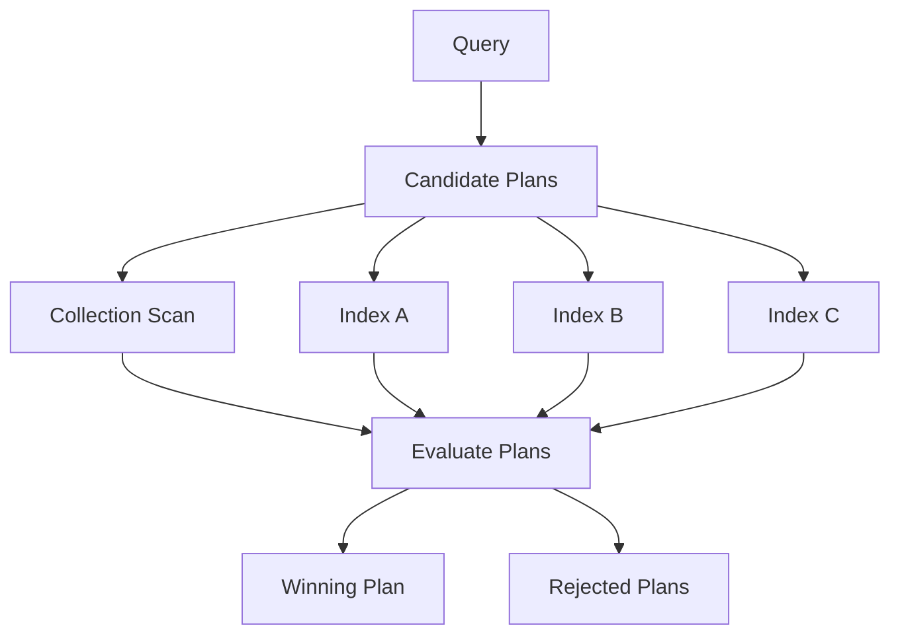

# 06- Explain Plans

## Overview

MongoDB's `explain()` facility is the primary diagnostic tool for understanding how the database executes a query or aggregation pipeline.

It answers questions such as:

- Which index did MongoDB choose?
- Did MongoDB perform a collection scan?
- How many index keys were examined?
- How many documents were examined?
- Was a sort performed?
- How much execution work was required?
- Which alternative plans were considered?
- Is the current index actually helping?

For senior backend engineering, `explain()` should be part of the normal query-optimization workflow rather than something used only during incidents.

The basic workflow is:

```text
Application Query
      ↓
Capture Exact Query Shape
      ↓
Run explain()
      ↓
Inspect Winning Plan
      ↓
Measure Execution Statistics
      ↓
Identify Excessive Work
      ↓
Change Query / Index
      ↓
Re-run explain()
      ↓
Benchmark
      ↓
Monitor Production
```

## Why Explain Plans Matter

A query returning 20 documents does not necessarily mean MongoDB performed only 20 units of work.

For example:

```text
nReturned: 20
totalKeysExamined: 1,500,000
totalDocsExamined: 900,000
```

The result is small, but the execution work is large.

A better execution might look like:

```text
nReturned: 20
totalKeysExamined: 24
totalDocsExamined: 20
```

The purpose of query optimization is therefore not simply:

```text
Use an index
```

but:

```text
Minimize unnecessary database work for the target workload.
```

## `explain()` Modes

MongoDB provides three commonly used verbosity modes:

| Mode | Purpose | Executes query? |
|---|---|---|
| `queryPlanner` | Shows candidate and selected plans | No execution statistics |
| `executionStats` | Shows actual execution statistics for the winning plan | Yes |
| `allPlansExecution` | Shows execution information for candidate plans | Yes |

### `queryPlanner`

```javascript
db.orders.find({
  tenant_id: tenantId,
  status: "pending"
}).explain("queryPlanner")
```

Useful for understanding:

- Available indexes
- Winning plan
- Rejected plans
- Query planner decisions

Use this when you want to inspect planning behavior without focusing on actual execution metrics.

### `executionStats`

```javascript
db.orders.find({
  tenant_id: tenantId,
  status: "pending"
}).explain("executionStats")
```

This is usually the most useful mode for performance analysis.

It provides metrics such as:

```text
nReturned
totalKeysExamined
totalDocsExamined
executionTimeMillis
```

### `allPlansExecution`

```javascript
db.orders.find({
  tenant_id: tenantId,
  status: "pending"
}).explain("allPlansExecution")
```

This provides additional information about candidate plans considered by the optimizer.

It can be useful when:

- Several indexes compete
- The planner's decision is surprising
- You are investigating plan selection
- A query behaves differently after index changes

Because it executes the query and collects additional information, use it deliberately on production systems.

## Basic Explain Workflow

Example query:

```javascript
db.orders.find({
  tenant_id: ObjectId("64f000000000000000000001"),
  status: "pending"
}).sort({
  created_at: -1
}).limit(50)
```

Run:

```javascript
db.orders.find({
  tenant_id: ObjectId("64f000000000000000000001"),
  status: "pending"
}).sort({
  created_at: -1
}).limit(50).explain("executionStats")
```

Then inspect:

```text
queryPlanner
executionStats
serverInfo
command
```

The exact response structure can vary by MongoDB version and execution engine, so focus on the relevant planning and execution fields rather than hard-coding a single plan tree.

## Query Planner

The MongoDB query planner evaluates possible ways to execute a query.

Conceptually:



Candidate plans may involve:

- Collection scans
- Single-field indexes
- Compound indexes
- Multiple indexes
- Sort operations
- Fetch operations

MongoDB selects a winning plan based on its query-planning mechanisms and observed planning behavior.

## Winning Plan

The `winningPlan` represents the plan selected by the query planner.

Example conceptual plan:

```text
IXSCAN
  ↓
FETCH
  ↓
LIMIT
```

This might indicate:

1. Traverse an index.
2. Fetch matching documents.
3. Stop after the required limit.

Another plan might look like:

```text
COLLSCAN
  ↓
SORT
  ↓
LIMIT
```

For a highly selective, high-frequency query, this may deserve investigation.

Do not determine whether a plan is good or bad from one stage alone.

## Rejected Plans

`rejectedPlans` contains alternative candidate plans considered by the optimizer.

Example conceptual candidates:

```text
Candidate A
  tenant_id + status + created_at

Candidate B
  tenant_id + status

Candidate C
  status
```

The planner selects one plan and rejects the alternatives.

Rejected plans are useful when diagnosing why MongoDB selected an unexpected index.

## Query Planner vs Execution Statistics

Separate these two questions:

```text
What plan did MongoDB choose?
```

and:

```text
How much work did the chosen plan actually perform?
```

`queryPlanner` primarily answers the first.

`executionStats` answers both planning and actual execution questions.

For performance work, `executionStats` is usually the more valuable starting point.

## Important Execution Metrics

### `nReturned`

Number of documents returned by the operation.

Example:

```text
nReturned: 50
```

This is the output size, not the amount of work performed.

A query can return 50 documents after examining millions.

## `totalKeysExamined`

Number of index keys examined.

Example:

```text
totalKeysExamined: 1250
```

This indicates how much index traversal occurred.

A query can use an index and still have:

```text
totalKeysExamined: 2,000,000
```

which may indicate inefficient filtering or a broad index range.

## `totalDocsExamined`

Number of documents examined.

Example:

```text
totalDocsExamined: 50
```

For a highly selective query returning 50 documents, this can be a strong signal.

Compare:

```text
nReturned: 50
totalDocsExamined: 500000
```

This indicates substantial document examination.

## `executionTimeMillis`

Approximate execution time reported by the explain operation.

Example:

```text
executionTimeMillis: 8
```

Treat this as diagnostic evidence, not as a substitute for production latency measurements.

Execution time can vary because of:

- Cache state
- Data distribution
- Server load
- Concurrency
- Storage performance
- Network latency
- Warm vs cold execution

Application-level latency should be measured separately.

## Selectivity Ratio

A useful diagnostic technique is to compare:

```text
nReturned
vs
totalDocsExamined
```

Example:

```text
nReturned = 50
totalDocsExamined = 50
```

versus:

```text
nReturned = 50
totalDocsExamined = 500000
```

The second query performs substantially more document work.

Similarly, compare:

```text
nReturned
vs
totalKeysExamined
```

when an index is involved.

These ratios are not universal correctness thresholds, but they are useful diagnostic signals.

## `COLLSCAN`

`COLLSCAN` indicates a collection scan.

Conceptually:

```text
Collection
    ↓
Document 1
Document 2
Document 3
...
Document N
    ↓
Evaluate predicate
```

Example:

```javascript
db.orders.find({
  status: "pending"
}).explain("executionStats")
```

Possible result:

```text
COLLSCAN
nReturned: 100
totalDocsExamined: 10000000
```

This means MongoDB examined a large number of documents to return a small result.

## Is `COLLSCAN` Always Bad?

No.

A collection scan can be appropriate when:

- The collection is very small
- The query returns most documents
- The predicate has poor selectivity
- An index would not materially reduce work
- The operation is administrative

For example, scanning a collection containing 100 documents may be cheaper than maintaining an additional index.

The correct question is:

> Is the selected access path appropriate for the workload?

## `IXSCAN`

`IXSCAN` indicates index traversal.

Conceptually:

```text
Query
  ↓
Index
  ↓
Relevant key range
  ↓
Document references
```

Example:

```text
IXSCAN
  ↓
FETCH
```

is common for an indexed query.

However:

```text
IXSCAN ≠ automatically efficient
```

A query can scan millions of keys and still use an index.

## `FETCH`

`FETCH` means MongoDB retrieves the actual documents referenced by index entries.

Typical plan:

```text
IXSCAN
  ↓
FETCH
```

This is normal when the query needs fields that are not available entirely from the index.

For example:

```javascript
db.orders.find({
  tenant_id: tenantId
})
```

might use:

```javascript
{
  tenant_id: 1
}
```

but still fetch the matching documents to return additional fields.

## Covered Queries

A covered query can obtain required query and result information directly from the index without fetching full documents.

Example index:

```javascript
db.orders.createIndex({
  tenant_id: 1,
  status: 1,
  order_number: 1
})
```

Query:

```javascript
db.orders.find(
  {
    tenant_id: tenantId,
    status: "pending"
  },
  {
    _id: 0,
    order_number: 1
  }
).explain("executionStats")
```

If the query is covered, the execution plan can avoid fetching the documents.

Covered queries can reduce document I/O, but adding fields solely for coverage increases index size and write-maintenance cost.

## `SORT`

A `SORT` stage indicates sorting work performed during execution.

Example:

```text
IXSCAN
  ↓
FETCH
  ↓
SORT
  ↓
LIMIT
```

If a high-frequency API query repeatedly performs an expensive sort, evaluate whether a compound index can provide the required order.

Query:

```javascript
db.orders.find({
  tenant_id: tenantId,
  status: "pending"
}).sort({
  created_at: -1
})
```

Candidate:

```javascript
db.orders.createIndex({
  tenant_id: 1,
  status: 1,
  created_at: -1
})
```

Always validate the actual execution plan.

## `LIMIT`

`LIMIT` restricts the number of results returned.

Example:

```javascript
db.orders.find({
  tenant_id: tenantId
}).sort({
  created_at: -1
}).limit(50)
```

A useful index can allow MongoDB to find the first 50 relevant entries without processing a large candidate set.

This is particularly important for APIs.

```text
Indexed query
    ↓
Correct ordering
    ↓
First 50 entries
    ↓
Stop
```

The practical benefit of `LIMIT` depends heavily on whether the preceding access path is efficient.

## `SKIP`

Example:

```javascript
db.orders.find({
  tenant_id: tenantId
}).sort({
  created_at: -1
}).skip(100000).limit(50)
```

Large offsets can require MongoDB to traverse or process many earlier results before returning the requested page.

Explain can reveal the resulting work.

For large collections, cursor/range pagination is often preferable:

```javascript
db.orders.find({
  tenant_id: tenantId,
  created_at: {
    $lt: lastCreatedAt
  }
}).sort({
  created_at: -1
}).limit(50)
```

## Explain and Compound Indexes

Suppose:

```javascript
db.orders.find({
  tenant_id: tenantId,
  status: "pending"
}).sort({
  created_at: -1
}).limit(50)
```

Candidate:

```javascript
db.orders.createIndex({
  tenant_id: 1,
  status: 1,
  created_at: -1
})
```

Run:

```javascript
db.orders.find({
  tenant_id: tenantId,
  status: "pending"
}).sort({
  created_at: -1
}).limit(50).explain("executionStats")
```

Look for:

```text
IXSCAN
```

and evaluate:

```text
nReturned
totalKeysExamined
totalDocsExamined
executionTimeMillis
```

A useful result might conceptually resemble:

```text
nReturned: 50
totalKeysExamined: 50
totalDocsExamined: 50
```

An inefficient result might resemble:

```text
nReturned: 50
totalKeysExamined: 700000
totalDocsExamined: 650000
```

The second query is using an index but still doing substantial work.

## Explain and Query Selectivity

Consider:

```javascript
db.users.find({
  country: "IN"
})
```

If 40% of the collection contains:

```text
country = IN
```

then an index on `country` may not provide the same benefit as an index on a highly selective field.

Explain can reveal whether the index actually reduces work.

Do not assume:

```text
index exists → index should be used
```

## Explain and Cardinality

Suppose:

```text
status:
active     → 90%
pending    → 5%
cancelled  → 5%
```

A query for:

```javascript
{
  status: "active"
}
```

has different selectivity from:

```javascript
{
  status: "pending"
}
```

The same query shape can behave differently depending on the actual value distribution.

This is especially important for:

- Status fields
- Feature flags
- Boolean fields
- Region fields
- Tenant identifiers

## Explain and Data Skew

Multi-tenant systems can have highly uneven data distribution.

Example:

```text
Tenant A → 1,000 documents
Tenant B → 1,000,000 documents
Tenant C → 100,000,000 documents
```

The query:

```javascript
{
  tenant_id: tenantId,
  status: "pending"
}
```

has the same shape for every tenant, but the execution characteristics may differ.

Run explain against representative values where practical.

## Explain and Query Planner Choices

Suppose these indexes exist:

```javascript
{
  tenant_id: 1
}
```

and:

```javascript
{
  tenant_id: 1,
  status: 1,
  created_at: -1
}
```

The query planner may consider both.

Use:

```javascript
.explain("allPlansExecution")
```

when you need additional insight into candidate-plan behavior.

This can help answer:

```text
Why did MongoDB choose this index?
```

rather than only:

```text
Which index was selected?
```

## Aggregation Explain Plans

`explain()` also applies to aggregation pipelines.

Example:

```javascript
db.orders.explain("executionStats").aggregate([
  {
    $match: {
      tenant_id: tenantId,
      status: "completed"
    }
  },
  {
    $group: {
      _id: "$customer_id",
      total: {
        $sum: "$amount"
      }
    }
  }
])
```

This helps determine whether the early pipeline stages are efficiently accessing the collection.

## Aggregation and `$match`

A common optimization pattern is:

```javascript
[
  {
    $match: {
      tenant_id: tenantId,
      status: "completed"
    }
  },
  {
    $group: {
      _id: "$customer_id",
      total: {
        $sum: "$amount"
      }
    }
  }
]
```

rather than processing the entire collection before filtering.

The early `$match` can potentially use an appropriate index.

Candidate:

```javascript
{
  tenant_id: 1,
  status: 1
}
```

Use explain to verify actual behavior.

## Aggregation and `$sort`

Consider:

```javascript
[
  {
    $match: {
      tenant_id: tenantId
    }
  },
  {
    $sort: {
      created_at: -1
    }
  },
  {
    $limit: 50
  }
]
```

Candidate index:

```javascript
{
  tenant_id: 1,
  created_at: -1
}
```

The explain plan helps determine whether MongoDB can use the index to provide both filtering and ordering.

## Explain from Python

PyMongo supports explain through command execution or cursor APIs depending on the operation and driver version.

A practical pattern is to inspect the query from `mongosh` first because it makes the complete database command easy to reproduce.

For application diagnostics, the query itself should be captured without exposing secrets or sensitive data.

Example query representation:

```python
query = {
    "tenant_id": tenant_id,
    "status": "pending",
}

projection = {
    "_id": 1,
    "order_number": 1,
    "created_at": 1,
}
```

The production application should not routinely execute `explain()` for every request.

## FastAPI Performance Workflow

A slow FastAPI endpoint might produce:

```text
GET /orders
      ↓
FastAPI
      ↓
Repository
      ↓
MongoDB
      ↓
Query latency = 450 ms
```

The investigation should separate:

```text
HTTP latency
    ↓
Application processing
    ↓
MongoDB network time
    ↓
MongoDB execution time
```

Run the exact database query through `explain()`.

This avoids incorrectly blaming MongoDB when the actual problem is:

- Serialization
- Network latency
- Python processing
- External service calls
- Connection pool contention

## Application Latency vs Explain Latency

Suppose:

```text
API latency = 300 ms
MongoDB explain execution = 10 ms
```

MongoDB is unlikely to explain the entire 300 ms.

Possible remaining latency:

```text
HTTP
↓
Authentication
↓
Python processing
↓
Connection checkout
↓
MongoDB network
↓
Serialization
↓
Response
```

Conversely:

```text
API latency = 500 ms
MongoDB execution = 450 ms
```

MongoDB execution is likely a major contributor.

Always correlate explain results with application telemetry.

## Explain and Index Design Workflow

Use:

```text
Slow Query
   ↓
Capture Exact Query
   ↓
Run queryPlanner
   ↓
Inspect winningPlan
   ↓
Run executionStats
   ↓
Measure keys/docs examined
   ↓
Check COLLSCAN / SORT
   ↓
Inspect indexes
   ↓
Design candidate index
   ↓
Run explain again
   ↓
Benchmark
   ↓
Deploy
   ↓
Monitor
```

## Before-and-After Example

Initial query:

```javascript
db.orders.find({
  tenant_id: tenantId,
  status: "pending"
}).sort({
  created_at: -1
}).limit(50)
```

Initial conceptual result:

```text
COLLSCAN
    ↓
SORT
    ↓
LIMIT

nReturned: 50
totalDocsExamined: 800000
executionTimeMillis: 420
```

Candidate index:

```javascript
db.orders.createIndex({
  tenant_id: 1,
  status: 1,
  created_at: -1
})
```

Re-run:

```javascript
db.orders.find({
  tenant_id: tenantId,
  status: "pending"
}).sort({
  created_at: -1
}).limit(50).explain("executionStats")
```

Potential improved result:

```text
IXSCAN
    ↓
FETCH
    ↓
LIMIT

nReturned: 50
totalDocsExamined: 50
executionTimeMillis: 8
```

The values are illustrative. Production conclusions require representative workloads and repeated measurements.

## Query Optimization Metrics

A practical comparison table:

| Metric | Before | After | Interpretation |
|---|---:|---:|---|
| `nReturned` | 50 | 50 | Same result size |
| `totalKeysExamined` | 800,000 | 50 | Less index traversal |
| `totalDocsExamined` | 800,000 | 50 | Less document work |
| `executionTimeMillis` | 420 | 8 | Lower database execution time |

The result count should generally remain equivalent when comparing the same query.

## Explain and Covered Queries

Example:

```javascript
db.users.createIndex({
  tenant_id: 1,
  status: 1,
  email: 1
})
```

Query:

```javascript
db.users.find(
  {
    tenant_id: tenantId,
    status: "active"
  },
  {
    _id: 0,
    email: 1
  }
).explain("executionStats")
```

If covered, the execution plan can avoid fetching the underlying documents.

This can reduce document access but should not be treated as a reason to create extremely wide indexes.

## Explain and Pagination

Offset pagination:

```javascript
db.orders.find({
  tenant_id: tenantId
}).sort({
  created_at: -1
}).skip(100000).limit(50)
```

Use explain to observe the work involved.

Cursor-based pagination:

```javascript
db.orders.find({
  tenant_id: tenantId,
  created_at: {
    $lt: lastCreatedAt
  }
}).sort({
  created_at: -1
}).limit(50)
```

Candidate index:

```javascript
{
  tenant_id: 1,
  created_at: -1
}
```

Explain should show whether the second approach significantly reduces examined entries.

## Explain and Large Collections

As collections grow, an index that was adequate at:

```text
100,000 documents
```

may behave differently at:

```text
100 million documents
```

Performance investigations should consider:

- Collection size
- Index size
- Working set
- Data distribution
- Query frequency
- Cache behavior
- Storage performance

Do not rely on development-environment explain results for production capacity decisions.

## Explain and Large Documents

`totalDocsExamined` counts documents examined, but the cost of fetching each document depends partly on document size and access patterns.

A query examining:

```text
10,000 large documents
```

can be substantially more expensive than one examining:

```text
10,000 small documents
```

This is another reason projection and schema design matter.

## Explain and Read Preference

In replica-set deployments, application reads may use different read preferences.

The explain environment should reflect the relevant deployment context where possible.

Performance can differ because of:

- Primary vs secondary reads
- Secondary load
- Replication lag
- Network location
- Read preference
- Working-set differences

Do not assume that an explain result from one node perfectly represents every production read path.

## Explain and Write Operations

Explain is primarily associated with query execution and aggregation analysis, but update/delete performance also depends on the underlying query predicate.

For example:

```javascript
db.orders.updateMany(
  {
    tenant_id: tenantId,
    status: "pending"
  },
  {
    $set: {
      status: "expired"
    }
  }
)
```

The filter:

```javascript
{
  tenant_id: tenantId,
  status: "pending"
}
```

still requires an efficient access path.

An appropriate index may reduce the work needed to identify documents to update.

Do not assume that only read operations need indexes.

## Explain and Transactions

Poorly indexed operations inside transactions can increase transaction duration.

For example:

```text
Transaction begins
    ↓
Slow query
    ↓
Document updates
    ↓
Additional queries
    ↓
Commit
```

A slow query extends the transaction lifetime.

Longer transactions can increase:

- Resource usage
- Contention
- Retry probability
- Application latency

Use explain during transaction design to validate the underlying query patterns outside the transaction when appropriate.

## Query Planner Cache and Plan Behavior

MongoDB may retain planning information for recurring query shapes.

This means a query's behavior can sometimes depend on previously observed planning decisions and workload conditions.

When investigating unexpected plan behavior:

- Capture the exact query shape
- Inspect current indexes
- Inspect the winning plan
- Inspect rejected plans
- Consider recent index changes
- Consider data distribution changes
- Avoid assuming the plan is determined only by field names

Do not treat query planning as a static mapping:

```text
query → permanently fixed plan
```

Production workloads evolve.

## Comparing Plans Safely

When evaluating an index change, compare:

```text
Same query
Same projection
Same sort
Same limit
Same representative values
Same dataset
```

Otherwise the comparison can be misleading.

Bad comparison:

```text
Before:
tenant A

After:
tenant B
```

if tenant sizes are radically different.

Better:

```text
Before:
representative tenant A

After:
same tenant A
```

with the same workload characteristics.

## Explain Plan Red Flags

Common signals requiring investigation:

| Signal | Possible concern |
|---|---|
| `COLLSCAN` | Missing or unsuitable index |
| Large `totalDocsExamined` | Poor selectivity |
| Large `totalKeysExamined` | Inefficient index traversal |
| Large `SORT` work | Index does not satisfy ordering |
| Low `nReturned` vs huge examination | Excessive database work |
| Unexpected winning index | Competing index or query-shape issue |
| Large execution time | Query or infrastructure bottleneck |
| Different plans for similar workloads | Data distribution or planning behavior |

These are investigation signals, not automatic proof of a defect.

## Common Explain Mistakes

### Mistake: Looking Only at `executionTimeMillis`

A single execution time can be noisy.

Also inspect:

```text
nReturned
totalKeysExamined
totalDocsExamined
winningPlan
```

and correlate with production metrics.

### Mistake: Looking Only for `IXSCAN`

Seeing:

```text
IXSCAN
```

does not prove the query is efficient.

Measure how much of the index was traversed.

### Mistake: Assuming `COLLSCAN` Is Always Wrong

Small collections and low-selectivity workloads may legitimately use collection scans.

### Mistake: Testing Only One Value

A query for:

```text
tenant A
```

may behave differently from:

```text
tenant B
```

because of data skew.

### Mistake: Ignoring Projection

The query:

```javascript
find(filter)
```

and:

```javascript
find(filter, projection)
```

can have different execution characteristics.

### Mistake: Ignoring Sort

A filter can use an index while a separate sort remains expensive.

### Mistake: Running Explain on Every Production Request

`explain("executionStats")` performs diagnostic work.

It should be used selectively, not as routine request processing.

### Mistake: Treating Explain as the Entire Performance Investigation

Explain describes database execution.

It does not directly measure:

- HTTP latency
- Python processing
- Network latency
- Connection-pool wait time
- Serialization
- External service latency

Use application and infrastructure telemetry alongside explain.

## Production Troubleshooting

### Slow API Endpoint

```text
Symptom
↓
API latency increased
↓
Capture request and exact database query
↓
Separate application latency from MongoDB execution
↓
Run explain("executionStats")
↓
Inspect winningPlan
↓
Check nReturned
↓
Check totalKeysExamined
↓
Check totalDocsExamined
↓
Check for COLLSCAN / SORT
↓
Inspect indexes
↓
Evaluate query shape
↓
Test candidate index
↓
Benchmark
↓
Deploy controlled change
↓
Monitor
↓
Document root cause
↓
Prevention
```

### Unexpected `COLLSCAN`

```text
Symptom
↓
Query performs collection scan
↓
Check existing indexes
↓
Verify exact query shape
↓
Check predicate selectivity
↓
Check whether index prefix matches query
↓
Run queryPlanner
↓
Run executionStats
↓
Test candidate index
↓
Compare work
↓
Deploy if justified
```

### Excessive `totalDocsExamined`

```text
Symptom
↓
Few documents returned
↓
Many documents examined
↓
Check index selectivity
↓
Check compound-index ordering
↓
Check data skew
↓
Check range width
↓
Check projection
↓
Evaluate alternative index
↓
Benchmark
```

### Unexpected Index Choice

```text
Symptom
↓
MongoDB chooses unexpected index
↓
Inspect winningPlan
↓
Inspect rejectedPlans
↓
List current indexes
↓
Check query shape
↓
Check data distribution
↓
Run allPlansExecution when appropriate
↓
Evaluate candidate indexes
↓
Remove redundant indexes or redesign
↓
Monitor
```

## Security Considerations

Explain output can contain information about:

- Collection names
- Index names
- Query predicates
- Field names
- Database structure
- Operational metadata

Do not blindly expose raw explain output through public APIs.

For production diagnostics:

- Restrict database diagnostic permissions
- Redact sensitive values
- Avoid logging credentials
- Avoid logging personally identifiable query parameters unnecessarily
- Control access to diagnostic tooling

A useful operational pattern is to log a sanitized query shape rather than sensitive query values.

## Performance and Cost Considerations

Explain analysis should lead to a system-level decision.

For example:

```text
Candidate index
    ↓
Query latency: -90%
    ↓
Write latency: +8%
    ↓
Storage: +15 GB
    ↓
Backup footprint: increased
```

The index may still be worthwhile, but the decision should be based on workload importance.

A query optimization that reduces one endpoint's latency while significantly degrading a high-volume ingestion path may be a poor system-level trade-off.

## Production Best Practices

- Use `explain("executionStats")` for serious query-performance analysis.
- Start with the exact production query shape.
- Inspect `winningPlan` and `rejectedPlans`.
- Always examine `nReturned`, `totalKeysExamined`, and `totalDocsExamined`.
- Do not equate `IXSCAN` with optimal performance.
- Do not equate `COLLSCAN` with automatic failure.
- Investigate expensive `SORT` stages.
- Validate compound-index changes with realistic data.
- Test representative tenant and data distributions.
- Compare the same query before and after changes.
- Correlate explain results with application and infrastructure metrics.
- Treat explain output as diagnostic information, not as a replacement for production monitoring.
- Revisit plans when data volume, distribution, or query patterns change.

## Interview Considerations

### What is `explain()`?

`explain()` shows how MongoDB plans and, depending on verbosity, executes a query or aggregation.

It is used to diagnose:

- Index usage
- Collection scans
- Sorts
- Documents examined
- Index keys examined
- Execution time
- Candidate plans

### What is the difference between `queryPlanner` and `executionStats`?

`queryPlanner` focuses on the selected and candidate plans.

`executionStats` executes the winning plan and provides actual execution metrics such as:

```text
nReturned
totalKeysExamined
totalDocsExamined
executionTimeMillis
```

### What does `COLLSCAN` mean?

MongoDB scans collection documents rather than using an index access path.

It is not automatically a problem; its suitability depends on collection size, selectivity, and workload.

### What does `IXSCAN` mean?

MongoDB traverses an index.

It indicates index usage but does not guarantee efficiency.

### What is the difference between `totalKeysExamined` and `totalDocsExamined`?

`totalKeysExamined` measures index entries examined.

`totalDocsExamined` measures documents examined.

A query may examine many keys but few documents, or many documents after traversing an index.

### What does `nReturned` tell you?

It tells you how many documents the operation returned.

It does not tell you how much work MongoDB performed.

Always compare it with the examination metrics.

### Why can a query using an index still be slow?

Possible reasons include:

- Poor selectivity
- Large index range
- Large number of keys examined
- Many documents fetched
- Expensive sorting
- Large documents
- High server load
- Data skew
- Poor query shape

### Why is `executionTimeMillis` not enough?

Because one execution can be affected by:

- Cache state
- Server load
- Storage
- Data distribution
- Concurrency

It should be combined with execution statistics and production telemetry.

### How would you troubleshoot a slow MongoDB query?

A senior-level workflow is:

```text
Capture exact query
↓
Run explain("executionStats")
↓
Inspect winningPlan
↓
Check keys examined
↓
Check documents examined
↓
Check COLLSCAN / SORT
↓
Inspect indexes
↓
Evaluate query shape and selectivity
↓
Design candidate index
↓
Benchmark
↓
Deploy
↓
Monitor
```

### How do you know whether a new index actually helped?

Compare the same workload before and after the change using:

```text
nReturned
totalKeysExamined
totalDocsExamined
executionTimeMillis
application latency
CPU
write latency
```

Then validate under realistic concurrency and data distribution.

## Key Takeaways

- **Use `explain()` to understand MongoDB's actual access path, not merely whether an index exists.**
- **`nReturned`, `totalKeysExamined`, and `totalDocsExamined` together reveal how much work MongoDB performed to produce the result.**
- **`IXSCAN` does not automatically mean an efficient query, and `COLLSCAN` is not automatically a defect; both must be evaluated against the workload.**
- **Use `executionStats` for practical performance analysis, and correlate explain results with application latency, infrastructure metrics, and production data distribution.**
- **Treat explain analysis as an iterative optimization workflow: diagnose, design, measure, benchmark, deploy, monitor, and reassess.**