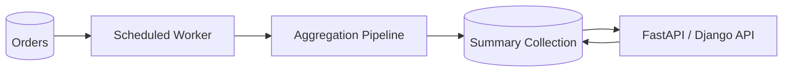

# 07- Aggregation Performance

## Overview

MongoDB aggregation pipelines are powerful because they allow filtering, transformation, joining, grouping, sorting, and materialization to be performed close to the data. That flexibility also makes aggregation one of the easiest areas to introduce expensive database workloads.

Aggregation performance depends on more than individual pipeline stages. The important factors are:

- How many documents enter the pipeline
- Whether early stages can use indexes
- How much data each stage carries forward
- Whether `$sort`, `$group`, `$unwind`, or `$lookup` expands the workload
- Whether intermediate results fit efficiently in memory
- Whether the workload is interactive or batch-oriented
- How frequently the pipeline executes
- Whether the aggregation competes with latency-sensitive CRUD operations

A production optimization strategy should therefore focus on reducing unnecessary work as early as possible.

```text
Application
    ↓
Aggregation Request
    ↓
$match / Indexed Access
    ↓
Reduce Documents
    ↓
Reduce Fields
    ↓
Transform / Join / Group
    ↓
Sort / Limit
    ↓
Return or Materialize
```

## Aggregation Execution Model

An aggregation pipeline processes documents through a sequence of stages.

Example:

```javascript
db.orders.aggregate([
  {
    $match: {
      tenant_id: ObjectId("64f000000000000000000001"),
      status: "completed"
    }
  },
  {
    $group: {
      _id: "$customer_id",
      total_amount: {
        $sum: "$amount"
      }
    }
  },
  {
    $sort: {
      total_amount: -1
    }
  },
  {
    $limit: 20
  }
])
```

Conceptually:

```text
Collection
    ↓
$match
    ↓
Reduced document set
    ↓
$group
    ↓
Customer aggregates
    ↓
$sort
    ↓
Top 20
```

The most important performance principle is:

> Reduce the amount of data flowing through expensive stages.

## Cost Model of an Aggregation

Not all stages have the same cost characteristics.

| Stage | Typical concern | Optimization focus |
|---|---|---|
| `$match` | Documents scanned | Index and early filtering |
| `$project` | Large documents carried forward | Remove unnecessary fields |
| `$set` / `$addFields` | CPU per document | Avoid unnecessary expressions |
| `$unwind` | Document multiplication | Filter before expansion |
| `$lookup` | Join work | Index foreign collection and reduce input |
| `$group` | Memory and CPU | Reduce input cardinality |
| `$sort` | Memory and CPU | Use index when applicable, reduce input |
| `$skip` | Increasing traversal/work | Prefer range pagination |
| `$facet` | Multiple pipelines over same input | Reduce input before `$facet` |
| `$merge` | Write workload | Batch and control frequency |
| `$out` | Materialization and replacement | Use deliberately for batch workloads |

## The Core Optimization Principle

A useful mental model is:

```text
Aggregation Cost
≈
Input Documents
×
Per-Document Work
×
Pipeline Expansion
×
Execution Frequency
```

For example:

```text
1,000,000 documents
×
10 CPU-heavy expressions
×
5x expansion from $unwind
×
100 requests/minute
```

can become an expensive production workload.

The goal is usually to reduce one or more of these dimensions before optimizing individual expressions.

## `$match` Early

Early filtering is one of the highest-value aggregation optimizations.

Prefer:

```javascript
db.orders.aggregate([
  {
    $match: {
      tenant_id: tenantId,
      status: "completed",
      created_at: {
        $gte: ISODate("2026-09-01T00:00:00Z")
      }
    }
  },
  {
    $group: {
      _id: "$customer_id",
      total: {
        $sum: "$amount"
      }
    }
  }
])
```

over processing unrelated documents first.

The objective is:

```text
Large collection
      ↓
Early filtering
      ↓
Small working set
      ↓
Expensive stages
```

## `$match` and Indexes

An index can reduce the amount of collection data entering the pipeline when the initial filtering stage is compatible with the index.

Example:

```javascript
db.orders.createIndex({
  tenant_id: 1,
  status: 1,
  created_at: -1
})
```

Pipeline:

```javascript
db.orders.aggregate([
  {
    $match: {
      tenant_id: tenantId,
      status: "completed",
      created_at: {
        $gte: ISODate("2026-09-01T00:00:00Z")
      }
    }
  },
  {
    $group: {
      _id: "$customer_id",
      total: {
        $sum: "$amount"
      }
    }
  }
])
```

The actual index usage should be verified with `explain()` rather than assumed.

## Aggregation `explain()`

Use:

```javascript
db.orders.explain("executionStats").aggregate([
  {
    $match: {
      tenant_id: tenantId,
      status: "completed"
    }
  },
  {
    $group: {
      _id: "$customer_id",
      total: {
        $sum: "$amount"
      }
    }
  }
])
```

Inspect:

- Winning execution plan
- Index usage
- Documents examined
- Execution time
- Stage-specific execution information
- Sort and group behavior where exposed by the plan

For production troubleshooting, compare explain output with:

- Application latency
- Query frequency
- CPU utilization
- Memory pressure
- Disk I/O
- Connection utilization

## `$project` and Data Reduction

Carrying unnecessary fields through a pipeline increases the amount of data that subsequent stages must process.

For example:

```javascript
{
  $project: {
    customer_id: 1,
    amount: 1,
    created_at: 1
  }
}
```

can remove fields that are not required downstream.

However, do not blindly add `$project` stages everywhere.

MongoDB can perform internal projection optimization in many situations. Explicit projection is most useful when:

- Documents contain large fields
- The pipeline genuinely benefits from reducing document size
- You are intentionally defining the data contract between stages
- Sensitive fields should not enter downstream processing

The optimization should be validated rather than assumed.

## Large Documents and Aggregation

Large documents increase the cost of:

- Reading data
- Transferring data internally
- Sorting
- Grouping
- `$unwind`
- Serialization

For example, an order document containing a large audit history may be unnecessarily expensive for a customer-revenue aggregation that only needs:

```text
customer_id
amount
created_at
```

Schema design therefore affects aggregation performance directly.

## `$group` Performance

`$group` is often computationally expensive because MongoDB must maintain aggregation state for groups.

Example:

```javascript
{
  $group: {
    _id: "$customer_id",
    order_count: {
      $sum: 1
    },
    revenue: {
      $sum: "$amount"
    }
  }
}
```

If the input contains:

```text
50 million orders
```

the aggregation may need to process a very large number of records.

The best optimization is often to reduce the input before `$group`:

```javascript
[
  {
    $match: {
      tenant_id: tenantId,
      created_at: {
        $gte: startDate,
        $lt: endDate
      },
      status: "completed"
    }
  },
  {
    $group: {
      _id: "$customer_id",
      revenue: {
        $sum: "$amount"
      }
    }
  }
]
```

## Group Cardinality

Group cardinality matters.

Consider:

```javascript
{
  $group: {
    _id: "$customer_id"
  }
}
```

If there are:

```text
10 million orders
1,000 customers
```

the group state is much smaller than:

```text
10 million orders
9 million customers
```

High group cardinality can increase memory consumption and processing cost.

This matters particularly for analytics workloads with high-cardinality dimensions such as:

- Request IDs
- Event IDs
- Device IDs
- Unique timestamps
- Transaction IDs

## `$sort` Performance

Sorting large datasets can be expensive.

Example:

```javascript
[
  {
    $match: {
      tenant_id: tenantId
    }
  },
  {
    $sort: {
      created_at: -1
    }
  }
]
```

If the filtered set is large, MongoDB may need substantial processing to produce the ordering.

Prefer an index that can support the filtering and ordering when the query pattern allows it:

```javascript
db.orders.createIndex({
  tenant_id: 1,
  created_at: -1
})
```

Then verify with `explain()`.

## Sort Before vs After Group

Consider:

```javascript
[
  {
    $sort: {
      created_at: -1
    }
  },
  {
    $group: {
      _id: "$customer_id",
      total: {
        $sum: "$amount"
      }
    }
  }
]
```

The sort may process a huge number of documents before grouping.

If the ordering is only needed after aggregation, move it later:

```javascript
[
  {
    $group: {
      _id: "$customer_id",
      total: {
        $sum: "$amount"
      }
    }
  },
  {
    $sort: {
      total: -1
    }
  }
]
```

The second sort operates on groups rather than the original documents.

This can dramatically reduce the number of items being sorted.

## `$limit` as a Work Reduction Tool

A `$limit` can reduce downstream work when it is logically valid to apply it early.

Example:

```javascript
[
  {
    $sort: {
      created_at: -1
    }
  },
  {
    $limit: 100
  },
  {
    $project: {
      _id: 1,
      customer_id: 1,
      amount: 1
    }
  }
]
```

The limit can prevent unnecessary processing after the top records have been identified.

However, moving `$limit` before a stage can change semantics.

For example:

```text
group all documents → top 10 groups
```

is not equivalent to:

```text
take first 10 documents → group them
```

Optimization must preserve the query's intended result.

## `$unwind` Performance

`$unwind` expands array elements into separate pipeline documents.

Example document:

```json
{
  "order_id": "ORD-1001",
  "items": [
    {"sku": "A", "quantity": 2},
    {"sku": "B", "quantity": 1},
    {"sku": "C", "quantity": 4}
  ]
}
```

After:

```javascript
{
  $unwind: "$items"
}
```

one document becomes three pipeline documents.

Large arrays can cause significant expansion.

```text
100,000 documents
×
20 array elements
=
up to 2,000,000 pipeline documents
```

## Optimize Before `$unwind`

Prefer:

```javascript
[
  {
    $match: {
      tenant_id: tenantId,
      status: "completed"
    }
  },
  {
    $unwind: "$items"
  }
]
```

over:

```javascript
[
  {
    $unwind: "$items"
  },
  {
    $match: {
      tenant_id: tenantId,
      status: "completed"
    }
  }
]
```

when the match can be applied before the array expansion.

This reduces the number of documents that reach `$unwind`.

## `$lookup` Performance

`$lookup` performs a join-like operation between collections.

Example:

```javascript
{
  $lookup: {
    from: "customers",
    localField: "customer_id",
    foreignField: "_id",
    as: "customer"
  }
}
```

Performance depends heavily on:

- Number of source documents
- Join cardinality
- Foreign collection size
- Foreign-side indexes
- Amount of data returned
- Subsequent processing

The foreign field used for matching should generally have an appropriate index for the access pattern.

For example:

```javascript
db.customers.createIndex({
  _id: 1
})
```

The `_id` index already exists by default.

## Reduce Input Before `$lookup`

Prefer:

```javascript
[
  {
    $match: {
      tenant_id: tenantId,
      status: "completed"
    }
  },
  {
    $lookup: {
      from: "customers",
      localField: "customer_id",
      foreignField: "_id",
      as: "customer"
    }
  }
]
```

over joining every document in the collection and filtering afterward.

The general principle is:

```text
Filter source
    ↓
Reduce source
    ↓
Join
```

not:

```text
Join entire source
    ↓
Filter
```

## `$lookup` with a Pipeline

For more complex joins, a pipeline can constrain the foreign side.

Example:

```javascript
{
  $lookup: {
    from: "customers",
    let: {
      customerId: "$customer_id"
    },
    pipeline: [
      {
        $match: {
          $expr: {
            $eq: ["$_id", "$$customerId"]
          }
        }
      },
      {
        $project: {
          _id: 1,
          name: 1,
          tier: 1
        }
      }
    ],
    as: "customer"
  }
}
```

Use this carefully. Complex `$expr` predicates can affect index usability depending on the expression and values involved.

Always validate with explain.

## `$facet` Performance

`$facet` allows multiple pipelines to operate on the same input.

Example:

```javascript
{
  $facet: {
    results: [
      {
        $sort: {
          created_at: -1
        }
      },
      {
        $limit: 50
      }
    ],
    statistics: [
      {
        $count: "total"
      }
    ]
  }
}
```

A common production use case is an API response containing:

```text
results
total_count
aggregations
```

The important optimization is to reduce the common input before entering `$facet`.

```javascript
[
  {
    $match: {
      tenant_id: tenantId,
      status: "active"
    }
  },
  {
    $facet: {
      results: [...],
      statistics: [...]
    }
  }
]
```

## `$facet` Anti-Pattern

Avoid:

```javascript
[
  {
    $facet: {
      branchA: [...],
      branchB: [...],
      branchC: [...]
    }
  },
  {
    $match: {
      tenant_id: tenantId
    }
  }
]
```

when the match can safely be applied before `$facet`.

Each facet branch can otherwise operate on a much larger input than necessary.

## `$skip` in Aggregation

Large `$skip` values can become increasingly expensive.

Example:

```javascript
[
  {
    $sort: {
      created_at: -1
    }
  },
  {
    $skip: 500000
  },
  {
    $limit: 50
  }
]
```

For large APIs, prefer cursor or range-based pagination.

Example:

```javascript
[
  {
    $match: {
      tenant_id: tenantId,
      created_at: {
        $lt: lastSeenCreatedAt
      }
    }
  },
  {
    $sort: {
      created_at: -1
    }
  },
  {
    $limit: 50
  }
]
```

Candidate index:

```javascript
{
  tenant_id: 1,
  created_at: -1
}
```

## Pipeline Ordering

Pipeline order can have a significant effect on performance.

A useful default strategy is:

```text
$match
↓
$project / field reduction where useful
↓
$set / transformations
↓
$unwind
↓
$lookup
↓
$group
↓
$sort
↓
$limit
```

This is not a universal ordering rule. Pipeline semantics must be preserved, and MongoDB can optimize certain pipelines internally.

The correct approach is:

1. Write the semantically correct pipeline.
2. Identify expensive stages.
3. Push selective operations earlier when valid.
4. Verify with explain.
5. Benchmark with representative data.

## Expression Cost

Aggregation expressions can become expensive when applied to millions of documents.

Examples include:

- String transformations
- Regular expressions
- Date conversions
- Complex conditional expressions
- Array manipulation
- `$function` where applicable

For example:

```javascript
{
  $set: {
    normalized_email: {
      $toLower: "$email"
    }
  }
}
```

is reasonable when required, but repeatedly normalizing a large dataset for every request may indicate a schema-design problem.

If a derived value is queried frequently, consider storing a normalized form at write time.

## Regex in Aggregation

Regex processing can be expensive.

Example:

```javascript
{
  $match: {
    email: {
      $regex: /example\.com$/i
    }
  }
}
```

A regex that cannot efficiently constrain an indexed prefix may require substantial scanning.

For high-frequency search workloads, consider:

- Normalized fields
- Prefix-friendly patterns
- Dedicated search capabilities
- Search indexes
- Application-level search architecture

Do not use regex as a general-purpose replacement for a search system.

## Date Expressions

Date transformations are common in analytics.

Example:

```javascript
{
  $group: {
    _id: {
      year: {
        $year: "$created_at"
      },
      month: {
        $month: "$created_at"
      }
    },
    total: {
      $sum: "$amount"
    }
  }
}
```

For high-volume recurring reports, repeatedly computing the same time buckets can become expensive.

Depending on workload requirements, consider:

- Precomputed dimensions
- Materialized aggregates
- Scheduled rollups
- Time-based collection design
- Dedicated analytics infrastructure

## String Expressions

Operations such as:

```javascript
$toLower
$trim
$substr
$regexFind
```

can consume CPU across large datasets.

Avoid repeatedly transforming the same value at query time if the transformation is deterministic and heavily used.

For example, store:

```json
{
  "email": "User@Example.com",
  "email_normalized": "user@example.com"
}
```

when normalized lookup is a frequent access pattern.

## Array Expressions

Array operations can be expensive when arrays are large.

Examples:

```javascript
$filter
$map
$reduce
$arrayElemAt
```

Before applying them to every document, ask:

- Can the array be bounded?
- Can the query filter documents earlier?
- Can the required value be stored separately?
- Is the aggregation request better handled asynchronously?

Large unbounded arrays are both a schema-design and performance concern.

## `$merge` for Materialized Results

`$merge` can write aggregation results into another collection.

Example:

```javascript
db.orders.aggregate([
  {
    $match: {
      status: "completed"
    }
  },
  {
    $group: {
      _id: "$customer_id",
      total: {
        $sum: "$amount"
      }
    }
  },
  {
    $merge: {
      into: "customer_sales_summary",
      on: "_id",
      whenMatched: "replace",
      whenNotMatched: "insert"
    }
  }
])
```

This can be useful for:

- Reporting
- Dashboards
- Precomputed metrics
- Read-heavy APIs

Instead of calculating expensive aggregations on every request:

```text
Raw Data
   ↓
Scheduled Aggregation
   ↓
Summary Collection
   ↓
Fast API Reads
```

## Materialized Aggregation Architecture

For expensive reports:



A worker could be implemented using:

- Celery
- Kubernetes CronJob
- Airflow
- AWS scheduled workloads

The key trade-off is:

```text
More write/processing complexity
        vs
Lower interactive query latency
```

## When to Materialize Aggregations

Materialization is appropriate when:

- The same aggregation is requested frequently
- Source data changes less frequently than it is queried
- Interactive latency matters
- The aggregation is computationally expensive
- Slightly stale data is acceptable

It is less suitable when:

- Results must always be transactionally current
- Query dimensions are highly dynamic
- The aggregation is rarely executed

## `$out` vs `$merge`

| Feature | `$merge` | `$out` |
|---|---|---|
| Writes aggregation results | Yes | Yes |
| Can merge into existing collection | Yes | No, replaces collection semantics |
| Suitable for incremental materialization | Yes | Less suitable |
| Flexible write behavior | High | Lower |
| Operational risk | Requires careful write semantics | Can replace target data |

Choose based on the materialization lifecycle rather than simply which operator is easier to write.

## Large Aggregations

A large aggregation should be classified before implementation.

### Interactive

Example:

```text
API request
↓
Aggregation
↓
< 1 second target
↓
HTTP response
```

These workloads require strict control over:

- Input size
- Pipeline complexity
- Query frequency
- Concurrency

### Batch

Example:

```text
Daily job
↓
Process millions of documents
↓
Generate report
↓
Store result
```

Batch workloads can tolerate longer execution but should still be isolated from latency-sensitive workloads where possible.

### Streaming/Event-Driven

Example:

```text
MongoDB Change Stream
↓
Event Consumer
↓
Incremental Aggregate
↓
Summary Collection
```

This can avoid repeatedly scanning historical data.

## Avoid Recomputing Historical Data

Suppose an API calculates:

```text
Customer revenue for all orders
```

on every request.

If:

```text
10 million orders
×
10,000 requests/day
```

are repeatedly scanned, the architecture is inefficient.

Instead:

```text
Orders
   ↓
Incremental aggregation
   ↓
Customer summary
   ↓
API
```

can shift cost from request time to controlled background processing.

## Connection Pool Considerations

Aggregation performance can be affected by application-side concurrency.

For example:

```text
100 API workers
    ↓
100 concurrent aggregations
    ↓
MongoDB
```

Even an individually efficient pipeline can become expensive when multiplied by concurrency.

Monitor:

- Connection pool usage
- Request queueing
- MongoDB CPU
- Memory
- Disk I/O
- Query latency
- Concurrent operations

Do not optimize only the single-query case.

## FastAPI Integration

A FastAPI endpoint might expose an aggregation:

```python
from fastapi import APIRouter, Depends

router = APIRouter()


@router.get("/reports/customer-revenue")
async def customer_revenue(
    tenant_id: str,
    repository=Depends(get_report_repository),
):
    return await repository.customer_revenue(tenant_id)
```

The repository should contain the database-specific pipeline rather than embedding it throughout route handlers.

Conceptually:

```text
FastAPI
   ↓
Route
   ↓
Service
   ↓
Repository
   ↓
MongoDB Aggregation
```

This makes performance testing and query optimization easier to isolate.

## Python Aggregation Example

A repository can define a controlled pipeline:

```python
from datetime import datetime
from bson import ObjectId


async def customer_revenue(
    collection,
    tenant_id: ObjectId,
    start_date: datetime,
    end_date: datetime,
) -> list[dict]:
    pipeline = [
        {
            "$match": {
                "tenant_id": tenant_id,
                "status": "completed",
                "created_at": {
                    "$gte": start_date,
                    "$lt": end_date,
                },
            }
        },
        {
            "$group": {
                "_id": "$customer_id",
                "order_count": {"$sum": 1},
                "revenue": {"$sum": "$amount"},
            }
        },
        {
            "$sort": {
                "revenue": -1,
            }
        },
        {
            "$limit": 100,
        },
    ]

    return await collection.aggregate(pipeline).to_list(length=100)
```

For an asynchronous application, use the current PyMongo async API or another supported async MongoDB driver appropriate to the deployment. Do not mix synchronous database calls into an async request path without understanding the blocking behavior.

## Django Integration

For Django applications using MongoDB, keep aggregation logic behind a service or repository boundary rather than assuming Django's relational ORM semantics apply.

Example architecture:

```text
Django View / DRF ViewSet
        ↓
Service Layer
        ↓
MongoDB Repository
        ↓
Aggregation Pipeline
```

This makes it easier to:

- Test pipelines
- Measure performance
- Change MongoDB-specific implementation
- Keep request handlers small
- Avoid coupling business logic to database syntax

## Aggregation and Multi-Tenancy

Multi-tenant systems should generally constrain tenant scope as early as possible.

Prefer:

```javascript
[
  {
    $match: {
      tenant_id: tenantId,
      status: "completed"
    }
  },
  ...
]
```

over loading cross-tenant data and filtering later.

This is both:

- A performance optimization
- A security boundary

Candidate indexes should reflect the tenant-scoped access pattern.

For example:

```javascript
{
  tenant_id: 1,
  status: 1,
  created_at: -1
}
```

## Security Considerations

Aggregation pipelines should be treated as database operations with potentially significant data-access and resource implications.

Production applications should:

- Validate user-controlled filter parameters
- Restrict fields that can be queried
- Avoid exposing arbitrary pipeline execution endpoints
- Enforce tenant boundaries
- Apply authorization before constructing the pipeline
- Avoid logging sensitive documents
- Limit result sizes
- Set appropriate application timeouts
- Protect expensive reporting endpoints from uncontrolled concurrency

Do not expose an endpoint such as:

```http
POST /admin/run-aggregation
```

that accepts an arbitrary MongoDB pipeline from untrusted clients.

## Aggregation Resource Isolation

A reporting workload can compete with transactional traffic.

Example:

```text
                    MongoDB
                       │
          ┌────────────┴────────────┐
          │                         │
    API CRUD traffic          Analytics
          │                         │
   Low-latency queries        Large aggregation
          │                         │
          └────────────┬────────────┘
                       ↓
                  Shared resources
```

Large aggregations can consume CPU, memory, I/O, and connections needed by latency-sensitive operations.

For heavy workloads, consider:

- Scheduled execution
- Materialized summaries
- Dedicated analytics infrastructure
- Read-oriented replica architecture where appropriate
- Workload isolation

## Monitoring Aggregation Workloads

Monitor aggregation performance at both application and database levels.

Useful metrics include:

| Metric | Why it matters |
|---|---|
| Aggregation latency | User-facing performance |
| Query frequency | Workload volume |
| CPU | Expression/group/sort cost |
| Memory | Working-set and aggregation pressure |
| Disk I/O | Storage pressure |
| Documents examined | Input efficiency |
| Connections | Concurrency pressure |
| Replication lag | Secondary workload impact |
| Error rate | Reliability |
| Timeouts | Resource saturation |

Slow-query monitoring can identify aggregation pipelines that exceed operational thresholds.

## Performance Regression

Aggregation performance can regress without code changes.

Possible causes:

- Collection growth
- Data distribution changes
- New tenants
- Larger arrays
- Increased group cardinality
- Index changes
- Increased concurrency
- Working-set growth
- Infrastructure changes

For example:

```text
January:
10M documents
Aggregation: 250 ms

June:
80M documents
Aggregation: 2.5 s
```

The pipeline did not change, but its workload did.

Performance testing should therefore consider data growth.

## Benchmarking Aggregations

A meaningful benchmark should use:

- Production-like document counts
- Representative document sizes
- Representative cardinality
- Realistic data distribution
- Realistic indexes
- Representative concurrency

Compare:

```text
Baseline
↓
Candidate pipeline
↓
Candidate index
↓
Representative workload
↓
Repeated measurements
```

Do not optimize against a tiny local dataset.

## Common Aggregation Performance Mistakes

### Filtering Too Late

Bad:

```javascript
[
  { $group: ... },
  { $match: ... }
]
```

when the filter can safely be applied first.

Better:

```javascript
[
  { $match: ... },
  { $group: ... }
]
```

### Unbounded `$unwind`

Large arrays can multiply the workload dramatically.

Control array growth at the schema-design level where possible.

### Sorting Huge Intermediate Results

Sorting before filtering or grouping can create unnecessary work.

Ask whether the ordering is actually required at that stage.

### Joining Too Early

A `$lookup` against millions of source documents can be expensive.

Filter the source first.

### Using Large `skip` Values

Offset pagination becomes increasingly expensive for large result sets.

Prefer range-based pagination for high-volume APIs.

### Returning Huge Aggregation Results

An aggregation returning millions of documents can overload:

- MongoDB
- Network
- Python
- API serialization
- Client memory

Use:

- `$limit`
- Pagination
- Batch processing
- Materialization
- Background jobs

### Running Heavy Reports Synchronously

A user-facing HTTP request is usually a poor place for a multi-minute report.

Use:

```text
HTTP request
    ↓
Create report job
    ↓
Celery / Airflow / worker
    ↓
Aggregation
    ↓
Store result
    ↓
Client retrieves result
```

## Production Troubleshooting

### Slow Aggregation

```text
Symptom
↓
Aggregation latency increased
↓
Capture exact pipeline
↓
Run explain("executionStats")
↓
Identify expensive stages
↓
Check initial $match
↓
Check index usage
↓
Measure documents entering expensive stages
↓
Inspect $sort / $group / $unwind / $lookup
↓
Check data growth and cardinality
↓
Test pipeline optimization
↓
Benchmark with production-like data
↓
Deploy
↓
Monitor
↓
Prevention through performance regression testing
```

### High CPU

```text
Symptom
↓
MongoDB CPU increases
↓
Identify expensive aggregation workloads
↓
Inspect execution plans
↓
Check expression-heavy stages
↓
Check $group / $sort / $lookup
↓
Measure query frequency
↓
Reduce input or precompute results
↓
Control concurrency
↓
Monitor CPU and latency
```

### High Memory Usage

```text
Symptom
↓
MongoDB memory pressure increases
↓
Identify large aggregations
↓
Check $group / $sort / $facet
↓
Check document size
↓
Check intermediate result size
↓
Reduce input earlier
↓
Reduce fields where useful
↓
Materialize expensive reports
↓
Validate memory behavior
↓
Monitor
```

### Aggregation Suddenly Becomes Slow

```text
Symptom
↓
Pipeline code unchanged
↓
Compare collection size
↓
Compare data distribution
↓
Compare index state
↓
Compare working set
↓
Compare concurrency
↓
Run explain
↓
Identify changed execution characteristics
↓
Optimize or redesign workload
↓
Add regression monitoring
```

## Operational Best Practices

- Filter as early as semantics allow.
- Design indexes around actual aggregation entry points.
- Verify index usage with `explain()`.
- Reduce the number of documents entering expensive stages.
- Avoid unnecessary `$unwind`.
- Avoid large intermediate `$sort` and `$group` operations.
- Reduce join input before `$lookup`.
- Ensure foreign collections support join access patterns.
- Avoid unbounded aggregation results.
- Prefer cursor-based pagination for large APIs.
- Materialize expensive, frequently reused analytics.
- Move long-running reports to background workers.
- Monitor aggregation frequency as well as individual latency.
- Test performance with production-like data volumes.
- Treat data growth as a performance requirement.
- Separate analytical workloads from latency-sensitive traffic when necessary.
- Reassess aggregation pipelines after major schema, index, or workload changes.

## Interview Considerations

### How do you optimize a slow aggregation?

Start with:

```text
explain("executionStats")
```

Then inspect:

- Initial filtering
- Index usage
- Documents examined
- Expensive stages
- `$sort`
- `$group`
- `$unwind`
- `$lookup`
- Data volume
- Cardinality

Then reduce the input to expensive stages and validate candidate indexes or pipeline changes with representative data.

### Why should `$match` usually appear early?

It reduces the number of documents entering later stages.

If one million documents enter a `$group`, but only ten thousand are relevant, filtering first can dramatically reduce the work performed by `$group`.

### Does `$match` always need an index?

No.

Indexes are useful when they meaningfully reduce the amount of data MongoDB must process. A low-selectivity predicate or small collection may not benefit significantly.

Use explain to validate.

### Why can `$group` be expensive?

Because MongoDB must process all input documents reaching the stage and maintain state for each group.

High input volume and high group cardinality can increase CPU and memory consumption.

### Why can `$unwind` be dangerous?

It expands arrays into multiple pipeline documents.

A collection with:

```text
1 million documents
×
20 array elements
```

can produce roughly:

```text
20 million pipeline documents
```

before subsequent filtering or grouping.

### How would you optimize `$lookup`?

Typical steps:

1. Reduce the source documents before the lookup.
2. Ensure the foreign-side access pattern is indexed.
3. Return only required foreign fields.
4. Avoid unnecessary many-to-many expansion.
5. Inspect the execution plan.
6. Consider denormalization or materialized data when the join is extremely frequent.

### When should an aggregation be moved to a background worker?

When it is:

- Long-running
- Resource-intensive
- Infrequently interactive
- Suitable for asynchronous results
- Better represented as a scheduled report

Workers such as Celery or Airflow can execute these workloads outside latency-sensitive HTTP requests.

### When should aggregation results be materialized?

When expensive results are repeatedly requested and can tolerate controlled staleness.

A materialized collection can convert:

```text
expensive computation per request
```

into:

```text
periodic computation
+
fast reads
```

## Key Takeaways

- **Aggregation performance is primarily about reducing the amount of data entering expensive stages such as `$group`, `$sort`, `$unwind`, and `$lookup`.**
- **Use early, selective `$match` stages and indexes to minimize the working set, then verify the actual execution plan with `explain("executionStats")`.**
- **Large arrays, high group cardinality, expensive joins, and large intermediate sorts are common sources of CPU and memory pressure.**
- **For frequently requested or expensive analytics, materialized summaries and background processing can provide better production behavior than synchronous request-time aggregation.**
- **Optimize against realistic data volume, distribution, and concurrency; aggregation performance can regress substantially as production datasets grow.**