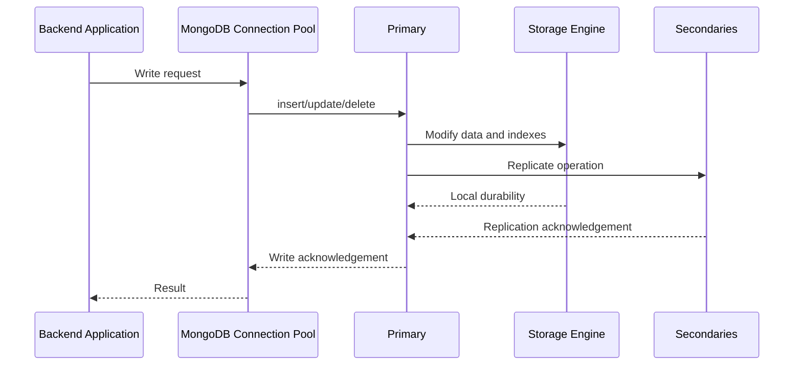
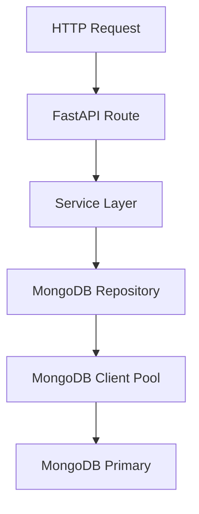

# 08- Write Performance

## Overview

MongoDB write performance is determined by more than the speed of an individual `insertOne()` or `updateOne()` operation. Production write throughput depends on document design, indexes, write concern, replication, journaling, storage latency, connection pooling, concurrency, batch size, contention, and application behavior.

A useful mental model is:

```text
Application
    ↓
Connection Pool
    ↓
MongoDB Write
    ↓
Document / Index Updates
    ↓
Journal / Storage
    ↓
Replication
    ↓
Write Acknowledgement
    ↓
Application
```

Every additional requirement on this path can affect write latency.

For example:

```text
More indexes
    ↓
More index maintenance per write
    ↓
Higher write cost
```

Similarly:

```text
writeConcern: "majority"
    ↓
Wait for majority acknowledgement
    ↓
Higher durability / consistency guarantees
    ↓
Potentially higher latency
```

Write optimization therefore requires balancing:

- Throughput
- Latency
- Durability
- Consistency
- Availability
- Replication
- Storage cost
- Operational complexity

## MongoDB Write Path

A simplified write path is:



The exact internal implementation depends on MongoDB version, storage engine, topology, and write concern, but the architecture illustrates the main sources of write latency.

## Single-Document Atomicity

MongoDB provides atomicity for operations affecting a single document.

For example:

```javascript
db.accounts.updateOne(
  { _id: accountId },
  {
    $inc: {
      balance: -100
    }
  }
)
```

The update is atomic for that document.

This is important for write performance because many application workflows can be designed around atomic document updates instead of multi-document transactions.

Prefer:

```javascript
{
  $inc: {
    stock: -1
  }
}
```

over:

```text
Read stock
↓
Modify in application
↓
Write stock
```

when an atomic update can express the operation safely.

## Atomic Update Operators

Use MongoDB update operators to perform changes server-side.

Common operators include:

| Operator | Typical use |
|---|---|
| `$set` | Set fields |
| `$unset` | Remove fields |
| `$inc` | Atomic counters |
| `$min` | Keep smaller value |
| `$max` | Keep larger value |
| `$mul` | Multiply numeric value |
| `$push` | Append to arrays |
| `$addToSet` | Add unique array element |
| `$pull` | Remove matching array elements |
| `$pop` | Remove array element |
| `$currentDate` | Update timestamps |

Example:

```javascript
db.orders.updateOne(
  {
    _id: orderId,
    status: "pending"
  },
  {
    $set: {
      status: "confirmed",
      confirmed_at: new Date()
    },
    $inc: {
      version: 1
    }
  }
)
```

This avoids a separate read-modify-write cycle.

## Read-Modify-Write Anti-Pattern

A common inefficient pattern is:

```text
Application
    ↓
find document
    ↓
modify in Python
    ↓
update document
```

This can create:

- Additional network round trips
- Race conditions
- Higher latency
- Higher connection usage
- More application CPU

Prefer atomic server-side updates where possible.

Python example:

```python
result = collection.update_one(
    {
        "_id": order_id,
        "status": "pending",
    },
    {
        "$set": {
            "status": "confirmed",
            "confirmed_at": datetime.now(timezone.utc),
        },
        "$inc": {
            "version": 1,
        },
    },
)
```

## Insert Performance

MongoDB supports both individual and bulk insertion.

Single document:

```javascript
db.events.insertOne({
  event_type: "payment.completed",
  customer_id: customerId,
  created_at: new Date()
})
```

Multiple documents:

```javascript
db.events.insertMany([
  {
    event_type: "payment.completed",
    customer_id: customerId,
    created_at: new Date()
  },
  {
    event_type: "invoice.created",
    customer_id: customerId,
    created_at: new Date()
  }
])
```

For high-throughput workloads, batching multiple writes can reduce:

- Network round trips
- Per-operation protocol overhead
- Application overhead

However, extremely large batches can increase:

- Memory usage
- Request latency
- Failure impact
- Replication pressure

Batch size should therefore be benchmarked rather than maximized blindly.

## Bulk Writes

For heterogeneous write operations, use bulk writes.

Python example:

```python
from pymongo import UpdateOne, InsertOne

operations = [
    InsertOne({
        "event_id": "evt-1001",
        "type": "payment.completed",
    }),
    UpdateOne(
        {"event_id": "evt-1002"},
        {
            "$set": {
                "processed": True,
            }
        },
        upsert=True,
    ),
]

result = collection.bulk_write(
    operations,
    ordered=False,
)
```

Bulk operations are particularly useful for:

- ETL pipelines
- Batch imports
- Data synchronization
- Event processing
- Backfills
- Scheduled jobs

## Ordered vs Unordered Bulk Writes

```python
collection.bulk_write(
    operations,
    ordered=False,
)
```

With unordered execution, MongoDB can process operations without requiring the sequence semantics of an ordered batch.

| Mode | Characteristics |
|---|---|
| `ordered=True` | Preserves operation order and stops according to ordered semantics when an error occurs |
| `ordered=False` | Allows operations to proceed independently where possible |

Use unordered writes when:

- Operations are independent
- Maximum throughput is important
- Operation ordering is not required

Do not use unordered execution when application correctness depends on a specific write sequence.

## Upsert Performance

An upsert performs an update when a matching document exists and inserts when it does not.

```javascript
db.users.updateOne(
  {
    external_id: "user-1001"
  },
  {
    $set: {
      name: "Aranya"
    }
  },
  {
    upsert: true
  }
)
```

The lookup predicate should be indexed when upserts are frequent.

For example:

```javascript
db.users.createIndex(
  { external_id: 1 },
  { unique: true }
)
```

A unique index also protects against duplicate logical identities under concurrency.

## Upsert Without an Appropriate Index

Consider:

```text
100 concurrent upserts
        ↓
Search external_id
        ↓
Large collection scan
        ↓
High CPU / I/O
        ↓
Increased latency
```

A lookup-heavy upsert without an appropriate index can become a significant write bottleneck.

The general rule is:

> Index the fields used to identify the logical document in high-volume upserts.

## Index Maintenance Cost

Every write potentially updates multiple indexes.

Suppose a document has:

```text
1 collection record
+
6 secondary indexes
```

An insert may require maintaining the document plus corresponding index entries.

Conceptually:

```text
One write
   ├── Document update
   ├── Index 1 update
   ├── Index 2 update
   ├── Index 3 update
   ├── Index 4 update
   ├── Index 5 update
   └── Index 6 update
```

Indexes improve reads but impose:

- Write CPU
- Additional storage
- Cache pressure
- Write amplification
- Index build/maintenance cost

## Over-Indexing

A common production mistake is creating indexes for every query without considering write volume.

For a write-heavy collection:

```text
100 writes/sec
×
10 indexes
```

can produce substantially more index maintenance than:

```text
100 writes/sec
×
3 carefully selected indexes
```

The correct target is not:

> Maximum number of indexes.

It is:

> Sufficient indexes for important access patterns with acceptable write cost.

## Index Selection for Write-Heavy Workloads

For a write-heavy collection:

```javascript
db.events.createIndex({
  tenant_id: 1,
  created_at: -1
})
```

may be valuable if the application frequently reads:

```javascript
{
  tenant_id: tenantId,
  created_at: {
    $gte: startDate
  }
}
```

But adding several overlapping indexes such as:

```text
{ tenant_id: 1 }
{ tenant_id: 1, created_at: -1 }
{ tenant_id: 1, status: 1 }
{ tenant_id: 1, status: 1, created_at: -1 }
```

should be justified by actual query patterns.

## Index Lifecycle

Indexes should be treated as production resources.

Before adding an index:

1. Identify the query pattern.
2. Estimate query frequency.
3. Measure current performance.
4. Design the candidate index.
5. Measure write impact.
6. Validate against realistic data.
7. Monitor after deployment.

Before removing an index:

1. Confirm it is not required by important workloads.
2. Review index usage statistics.
3. Check scheduled or infrequent jobs.
4. Validate against production query patterns.
5. Remove it safely.
6. Monitor read performance afterward.

## Compound Indexes and Write Cost

Compound indexes can support multiple access patterns, but every indexed field increases index entry size.

Example:

```javascript
db.orders.createIndex({
  tenant_id: 1,
  status: 1,
  created_at: -1
})
```

This can support useful tenant-scoped queries, but it also creates maintenance overhead for every matching write.

When designing indexes for write-heavy systems, consider:

- Query frequency
- Selectivity
- Sort requirements
- Index size
- Write frequency
- Document update frequency
- Field volatility

## Updating Indexed Fields

Updating a field that participates in an index can require index maintenance.

For example:

```javascript
db.users.updateOne(
  { _id: userId },
  {
    $set: {
      email: "new@example.com"
    }
  }
)
```

If `email` is indexed, MongoDB must maintain the corresponding index entry.

Frequently changing indexed fields therefore have a greater write-maintenance cost than non-indexed fields.

This does not mean volatile fields should never be indexed. It means the read benefit must justify the write cost.

## Partial Indexes for Write-Heavy Systems

A partial index can limit index entries to documents that satisfy a filter.

Example:

```javascript
db.orders.createIndex(
  {
    tenant_id: 1,
    created_at: -1
  },
  {
    partialFilterExpression: {
      status: "active"
    }
  }
)
```

This can reduce index size when only a subset of documents participates in an important access pattern.

It can be particularly useful for:

- Active records
- Unprocessed jobs
- Pending transactions
- Non-archived data

The application query must be compatible with the partial-index predicate for the index to be useful.

## Unique Indexes and Write Performance

Unique indexes enforce data integrity.

Example:

```javascript
db.users.createIndex(
  { email_normalized: 1 },
  { unique: true }
)
```

Advantages:

- Prevents duplicates
- Provides indexed lookup
- Moves uniqueness enforcement into the database

Costs:

- Index maintenance
- Duplicate-key handling
- Potential contention around heavily reused keys

Database-level uniqueness is generally preferable to relying only on application-side checks.

## Document Growth

MongoDB documents can grow as updates add data.

Example:

```javascript
db.users.updateOne(
  { _id: userId },
  {
    $push: {
      notifications: notification
    }
  }
)
```

If `notifications` grows without bounds, the document becomes increasingly expensive to update and read.

Large or continuously growing arrays can cause:

- Larger documents
- More I/O
- More memory pressure
- Larger network payloads
- Hot-document contention
- Difficult document lifecycle management

## Unbounded Arrays

Avoid modeling unlimited historical data as an ever-growing embedded array.

Instead of:

```json
{
  "_id": "user-1001",
  "notifications": [
    {},
    {},
    {},
    "..."
  ]
}
```

consider:

```text
users
notifications
```

with:

```json
{
  "user_id": "user-1001",
  "created_at": "...",
  "message": "..."
}
```

This distributes writes across documents and makes retention and pagination easier.

## Hot Documents

A hot document is a document that receives a disproportionate number of writes.

Example:

```javascript
db.counters.updateOne(
  { _id: "global" },
  {
    $inc: {
      count: 1
    }
  }
)
```

If thousands of workers update the same document continuously, that document becomes a write hotspot.

Typical examples include:

- Global counters
- Popular inventory records
- Shared job state
- Global statistics
- Frequently updated configuration

## Hot Document Mitigation

Possible approaches include:

### Sharded Counters

Instead of:

```text
counter
```

use:

```text
counter-0
counter-1
counter-2
...
counter-N
```

Workers distribute increments across shards.

The total can then be calculated by aggregating the shards.

### Event-Based Counting

Instead of synchronously updating a shared counter:

```text
Request
  ↓
Update global counter
```

consider:

```text
Request
  ↓
Write event
  ↓
Async consumer
  ↓
Update summary
```

This trades immediate consistency for reduced write contention.

## Write Contention

MongoDB supports concurrent writes, but application-level access patterns can still create contention.

Examples:

```text
Many workers
     ↓
Same document
     ↓
Frequent updates
```

or:

```text
Many writes
     ↓
Same narrow key range
     ↓
Concentrated workload
```

When diagnosing contention, inspect:

- Write frequency
- Document access distribution
- Index distribution
- Locking/resource metrics
- Storage latency
- Replication behavior
- Application concurrency

## Large Documents

Large documents increase the cost of:

- Insert
- Update
- Read
- Replication
- Backup
- Serialization

A frequently updated large document is particularly problematic.

Prefer splitting independently changing data when:

```text
Document becomes large
+
Different parts change at different frequencies
```

This can reduce write amplification and contention.

## Write Amplification

Write amplification occurs when one logical application operation causes significantly more physical database work.

Example:

```text
Application update
        ↓
Document modification
        ↓
5 index updates
        ↓
Journal/storage work
        ↓
Replication
        ↓
Secondary index maintenance
```

A high write amplification workload may show:

- High disk utilization
- High CPU
- Low write throughput
- Increased latency
- Replication lag

Reducing unnecessary indexes and unnecessary document changes can reduce amplification.

## Avoid Rewriting Entire Documents

Prefer targeted updates:

```javascript
db.users.updateOne(
  { _id: userId },
  {
    $set: {
      last_login_at: new Date()
    }
  }
)
```

instead of replacing the entire document when only one field changed:

```javascript
db.users.replaceOne(
  { _id: userId },
  completeUserDocument
)
```

Targeted updates reduce application payloads and make update intent explicit.

Replacement writes can still be appropriate when the application owns the complete document representation.

## Write Frequency and Schema Design

Schema design should consider write frequency.

Suppose:

```text
User profile:
name
email
preferences
login_count
last_login_at
```

If `login_count` and `last_login_at` change thousands of times while profile fields rarely change, embedding everything into one hot document may create unnecessary contention.

Separate documents can sometimes isolate high-frequency state:

```text
users
user_activity
```

This is an access-pattern decision, not a universal normalization rule.

## Write Concern

Write concern determines how strongly MongoDB must acknowledge a write.

Example:

```javascript
db.orders.insertOne(
  {
    order_id: "ORD-1001",
    amount: 1250
  },
  {
    writeConcern: {
      w: "majority"
    }
  }
)
```

Higher durability requirements can increase acknowledgement latency.

Common considerations include:

| Configuration | Typical trade-off |
|---|---|
| `w: 0` | Lower acknowledgement overhead, weaker application-level confirmation |
| `w: 1` | Primary acknowledgement |
| `w: "majority"` | Stronger durability/replication acknowledgement |
| `j: true` | Requires journal acknowledgement under applicable deployment semantics |

Use the durability guarantees required by the business operation rather than selecting the fastest setting universally.

## Majority Writes

For important business data, majority acknowledgement is commonly considered when the application requires stronger durability across replica-set members.

Conceptually:

```text
Application
    ↓
Primary write
    ↓
Replication
    ↓
Majority acknowledgement
    ↓
Application response
```

The trade-off is potentially higher latency than acknowledging only after the primary accepts the write.

## Unacknowledged Writes

Unacknowledged writes can reduce acknowledgement overhead:

```javascript
{
  writeConcern: {
    w: 0
  }
}
```

But the application does not receive normal write acknowledgement.

This may be inappropriate for:

- Financial records
- Orders
- Authentication state
- Inventory
- Critical business events

It may be considered for specific telemetry or best-effort workloads where lost writes are acceptable.

## Write Concern and Latency

Write latency can be influenced by:

```text
Application network latency
+
Primary processing
+
Storage durability
+
Replication
+
Write concern
```

Therefore:

```text
w: "majority"
```

does not automatically mean a fixed latency. Actual latency depends on topology and infrastructure.

Measure it in the target environment.

## Journaling and Durability

MongoDB uses journaling to support durable recovery.

A production write path can therefore involve:

```text
Application
    ↓
Primary
    ↓
Storage Engine
    ↓
Journal / durable storage
```

Storage latency is important.

Slow disks can increase write latency even when:

- CPU is low
- Network is healthy
- Query filters are efficient

For production systems, use storage appropriate to the write workload and monitor I/O latency.

## Storage Selection

Write-heavy workloads should pay attention to:

- IOPS
- Throughput
- Latency
- Storage capacity
- Burst behavior
- Cloud volume characteristics

On AWS, for example, the storage configuration should be selected according to the actual workload rather than assuming a generic disk configuration is sufficient.

Monitor:

```text
Write latency
IOPS
Throughput
Queue depth
Disk utilization
```

## Replication and Write Performance

In a replica set:

```text
Primary
  ├── Secondary
  └── Secondary
```

writes originate at the primary and are replicated.

Replication adds work to secondaries:

- Apply operations
- Maintain data
- Maintain indexes
- Persist changes

A high write rate can therefore produce secondary lag.

## Secondary Lag

If:

```text
Primary write rate
>
Secondary apply capacity
```

then:

```text
Secondary lag increases
```

This can affect:

- Read-after-write behavior
- Read preference
- Backup freshness
- Failover readiness
- Operational safety

Monitor replication lag continuously for production replica sets.

## Write-Heavy Replica Sets

For write-heavy workloads:

- Keep secondary hardware capable of matching write throughput.
- Monitor replication lag.
- Avoid treating secondaries as free storage.
- Consider read workloads placed on secondaries.
- Validate failover behavior.
- Monitor disk and CPU independently on each member.

A secondary overloaded by analytics queries may fall behind even when the primary is healthy.

## Sharding and Write Scaling

Sharding can distribute writes across multiple shards when the shard key distributes workload effectively.

Example:

```text
Application
    ↓
mongos
    ↓
Shard Key Routing
    ├── Shard A
    ├── Shard B
    └── Shard C
```

However, sharding does not automatically increase write throughput.

A poor shard key can create a hot shard.

## Monotonically Increasing Keys

A shard key with monotonically increasing values can concentrate new writes toward a single shard depending on the sharding strategy and configuration.

Examples include:

- Sequential timestamps
- Auto-increment-like IDs
- Strictly increasing counters

For high-volume distributed writes, evaluate:

- Cardinality
- Frequency
- Distribution
- Query targeting
- Write distribution

A hashed shard key can distribute values more evenly, but it may reduce the efficiency of range-based queries.

## Shard Key and Write Performance

Consider an event collection:

```json
{
  "tenant_id": "...",
  "event_id": "...",
  "created_at": "...",
  "type": "payment.completed"
}
```

A shard key such as:

```text
tenant_id
```

may create a hotspot if one tenant produces a disproportionate amount of traffic.

A high-cardinality compound strategy may distribute writes better, but the correct design depends on query patterns and workload distribution.

## Transactions and Write Performance

Transactions provide multi-document atomicity but introduce additional coordination and overhead compared with simple single-document operations.

Use transactions when the business invariant genuinely spans multiple documents.

Example:

```text
Transfer
├── Debit account
└── Credit account
```

A transaction can maintain the invariant that both changes succeed or fail together.

Do not use transactions merely because the application performs multiple writes.

If the data can be modeled into one document and updated atomically, that can be simpler and faster.

## Transaction Anti-Pattern

Avoid:

```text
Start transaction
↓
HTTP request
↓
External API
↓
Kafka publish
↓
Complex application processing
↓
Database updates
↓
Commit
```

Long-running transactions increase resource usage and contention.

Prefer keeping transaction scopes focused on database operations.

## Transaction Performance

Transactions can increase:

- Execution overhead
- Lock/resource duration
- Conflict probability
- Retry complexity
- Application latency

Design transactions to be:

- Short
- Deterministic
- Focused
- Retry-safe

## Retryable Writes

Distributed systems can experience transient network failures.

A client may need to determine whether:

```text
write failed
```

means:

```text
operation never reached MongoDB
```

or:

```text
MongoDB processed it but acknowledgement was lost
```

Retryable write support can help with supported operations and configurations.

Applications should still design operations to be safe under retries.

## Idempotent Writes

For event processing:

```python
result = collection.update_one(
    {
        "event_id": event_id,
    },
    {
        "$setOnInsert": {
            "processed_at": datetime.now(timezone.utc),
            "payload": payload,
        }
    },
    upsert=True,
)
```

A unique index on `event_id` can enforce uniqueness:

```javascript
db.processed_events.createIndex(
  { event_id: 1 },
  { unique: true }
)
```

This is useful when Kafka, Celery, or other distributed systems may redeliver messages.

## Connection Pooling

Applications should normally reuse MongoDB clients rather than creating a new client for every request.

Bad:

```python
async def create_order(order):
    client = AsyncMongoClient(MONGO_URI)
    ...
```

Better architecture:

```text
Application Process
       │
       └── MongoDB Client
              │
              └── Connection Pool
                    ├── Connection
                    ├── Connection
                    └── Connection
```

A shared client per process allows connection pooling and avoids repeated connection establishment.

## Pool Sizing

Increasing pool size does not automatically increase write throughput.

Too few connections can cause application-side waiting.

Too many connections can increase:

- MongoDB connection overhead
- Memory usage
- Context switching
- Concurrent write pressure
- Storage contention

Tune based on:

```text
Application concurrency
+
MongoDB capacity
+
Observed pool wait
+
Observed database latency
```

rather than choosing a large number arbitrarily.

## Timeouts

Production applications should configure appropriate MongoDB timeouts.

Relevant settings include:

- `serverSelectionTimeoutMS`
- `connectTimeoutMS`
- `socketTimeoutMS`
- `waitQueueTimeoutMS`

The exact values depend on application SLOs.

For example:

```python
from pymongo import MongoClient

client = MongoClient(
    mongo_uri,
    serverSelectionTimeoutMS=5000,
    connectTimeoutMS=5000,
    socketTimeoutMS=10000,
    waitQueueTimeoutMS=5000,
)
```

Timeouts should prevent indefinitely waiting for an unhealthy dependency while allowing legitimate operations to complete.

## Python Bulk Write Pattern

For ingestion workloads:

```python
from pymongo import InsertOne

def insert_events(collection, events, batch_size=1000):
    for offset in range(0, len(events), batch_size):
        batch = events[offset:offset + batch_size]

        operations = [
            InsertOne(event)
            for event in batch
        ]

        collection.bulk_write(
            operations,
            ordered=False,
        )
```

The appropriate batch size depends on:

- Document size
- Network latency
- MongoDB capacity
- Error rate
- Application memory
- Target throughput

Benchmark multiple batch sizes instead of assuming `1000` is optimal.

## FastAPI Write Architecture

A production FastAPI application should avoid creating MongoDB clients inside request handlers.



The repository owns database-specific write operations.

The service layer owns business rules.

The API layer owns HTTP concerns.

This separation makes write performance testing easier.

## Background Write Workloads

High-volume writes often originate from:

- Celery workers
- Kafka consumers
- Airflow tasks
- ETL pipelines
- Kubernetes Jobs
- Scheduled synchronization

A typical architecture is:

```text
Kafka
  ↓
Consumer
  ↓
Batch
  ↓
MongoDB bulk_write()
  ↓
Result
```

Batching is particularly valuable for ingestion workloads because it reduces per-message network overhead.

## Kafka and MongoDB

For Kafka consumers, avoid:

```text
Kafka message
↓
MongoDB write
↓
Kafka commit
```

for every event when throughput requirements are high.

A batch-oriented approach can be:

```text
Kafka messages
      ↓
Consumer batch
      ↓
Validate
      ↓
Bulk write
      ↓
Commit offsets
```

The exact offset/acknowledgement strategy must account for failure and duplicate-processing semantics.

Do not trade correctness for throughput.

## Redis and Write Optimization

Redis can reduce read pressure, but it does not automatically solve MongoDB write bottlenecks.

For example:

```text
API
 ├── Redis → frequently read state
 └── MongoDB → durable writes
```

If the workload is:

```text
10,000 MongoDB writes/sec
```

adding Redis for reads does not remove the database's write workload.

For write optimization, focus on:

- Batch writes
- Index reduction
- Document design
- Contention
- Storage
- Sharding
- Write concern
- Application concurrency

## Write Performance and Schema Validation

Schema validation can protect data quality but adds validation work to writes.

Example:

```javascript
db.createCollection("users", {
  validator: {
    $jsonSchema: {
      bsonType: "object",
      required: ["email"],
      properties: {
        email: {
          bsonType: "string"
        }
      }
    }
  }
})
```

Validation overhead is usually a secondary concern compared with poor schema or index design, but extremely high-throughput workloads should measure it.

Do not disable important validation solely for theoretical performance gains without benchmarking.

## Write Performance and Document Size

Document size should be monitored as part of capacity planning.

Larger documents can increase:

- Storage consumption
- Replication bandwidth
- Backup size
- Network payload
- Update cost

The MongoDB BSON document size limit is a hard architectural constraint, but production systems should avoid approaching that limit as a normal design strategy.

## Monitoring Write Performance

Important production metrics include:

| Metric | Interpretation |
|---|---|
| Insert latency | Insert responsiveness |
| Update latency | Update responsiveness |
| Delete latency | Delete responsiveness |
| Operations/sec | Throughput |
| Write queueing | Saturation |
| CPU | Processing pressure |
| Disk latency | Storage bottleneck |
| Disk IOPS | Storage capacity |
| Replication lag | Secondary capacity |
| Connections | Pool/concurrency pressure |
| Index size | Write-maintenance footprint |
| Cache/working set | Memory efficiency |
| Error rate | Reliability |
| Timeout rate | Saturation or dependency issues |

Measure both:

```text
Average latency
```

and:

```text
p95 / p99 latency
```

because tail latency often exposes production saturation earlier than averages.

## Detecting a Write Bottleneck

Use a structured process:

```text
Symptom
↓
Write latency / throughput degradation
↓
Determine affected operation
↓
Check application connection pool
↓
Check MongoDB CPU and memory
↓
Check storage latency and I/O
↓
Check index count and size
↓
Check replication lag
↓
Check document size and update pattern
↓
Check hot documents
↓
Check write concern
↓
Check transaction usage
↓
Identify root cause
↓
Apply targeted optimization
↓
Benchmark
↓
Monitor production
```

## Before-and-After Example

Suppose a workload processes:

```text
50,000 events/minute
```

with:

```text
One MongoDB request per event
+
8 secondary indexes
```

Observed:

```text
p95 write latency: 120 ms
MongoDB CPU: 85%
```

Optimization:

```text
Individual writes
        ↓
Bulk writes
```

and removal of two unused indexes:

```text
8 indexes
   ↓
6 required indexes
```

After benchmarking, suppose:

```text
p95 write latency: 45 ms
MongoDB CPU: 62%
```

The important engineering lesson is not the specific numbers. It is the methodology:

```text
Measure
↓
Identify bottleneck
↓
Change one major variable
↓
Benchmark
↓
Validate correctness
↓
Monitor
```

## Performance Regression Testing

Write performance can degrade as the dataset grows.

Track:

- Documents per collection
- Average document size
- Index size
- Writes/sec
- Batch size
- p50/p95/p99 latency
- Replication lag
- Storage utilization

A performance test should resemble the production workload:

```text
Representative data
+
Representative indexes
+
Representative write distribution
+
Representative concurrency
```

A benchmark against 10,000 documents does not validate a design intended for 500 million documents.

## Capacity Planning

A production write-capacity model should consider:

```text
Peak writes/sec
×
Average document size
×
Replication factor
×
Index overhead
×
Retention period
```

For example, increasing:

```text
10k writes/sec
→
50k writes/sec
```

can affect much more than CPU.

It may also increase:

- Storage growth
- Replication bandwidth
- Backup volume
- Index maintenance
- Network traffic
- Recovery time

## Write Scaling Strategy

A typical progression is:

```text
Optimize document updates
        ↓
Optimize indexes
        ↓
Batch writes
        ↓
Tune connection pools
        ↓
Tune storage
        ↓
Tune write concern
        ↓
Control application concurrency
        ↓
Separate workloads
        ↓
Shard when justified
```

Sharding should not be the first response to an inefficient write path.

## Security Considerations

Write performance optimizations must not weaken security or correctness.

Avoid:

- Disabling authentication
- Disabling authorization
- Removing validation without evidence
- Using weak write guarantees for critical data
- Accepting arbitrary update operators from clients
- Allowing clients to modify protected fields
- Logging sensitive documents during performance debugging

For API-driven updates, explicitly map allowed fields.

Bad:

```python
collection.update_one(
    {"_id": object_id},
    {"$set": request_payload},
)
```

Better:

```python
allowed_update = {
    "display_name": request_payload["display_name"],
    "timezone": request_payload["timezone"],
}

collection.update_one(
    {"_id": object_id},
    {"$set": allowed_update},
)
```

## Reliability Considerations

Write optimization should preserve failure semantics.

For critical writes:

- Use appropriate write concern.
- Handle duplicate-key errors.
- Handle transient failures.
- Use retryable operations where supported.
- Make consumers idempotent.
- Monitor replication lag.
- Test primary failover.
- Validate recovery procedures.

Fast writes that silently lose business-critical data are not a successful optimization.

## Cost Considerations

Write throughput can increase infrastructure cost through:

- More CPU
- More storage IOPS
- More storage capacity
- Larger indexes
- More replicas
- More network traffic
- More backup storage

A performance optimization should therefore evaluate:

```text
Latency improvement
+
Throughput improvement
+
Reliability
+
Infrastructure cost
```

For example, adding more replicas may improve read capacity and availability but does not necessarily solve a primary write bottleneck.

## Common Mistakes

### Creating an Index for Every Query

**Why it happens:** Engineers optimize reads independently.

**Problem:** Every additional index increases write maintenance.

**Better approach:** Design indexes from the complete workload.

### Updating Documents in a Read-Modify-Write Loop

**Why it happens:** Application code is easier to write this way.

**Problem:** Extra network round trips and race conditions.

**Better approach:** Use atomic MongoDB update operators.

### Creating a New Client Per Request

**Why it happens:** Developers treat MongoDB connections like stateless HTTP clients.

**Problem:** Connection establishment overhead and poor pooling.

**Better approach:** Reuse one client per process.

### Using Huge Bulk Batches

**Why it happens:** Bigger batches appear to maximize throughput.

**Problem:** Larger memory use, higher latency, and larger failure units.

**Better approach:** Benchmark bounded batch sizes.

### Using Transactions for Every Write

**Why it happens:** Transactions are familiar from relational databases.

**Problem:** Additional coordination and overhead.

**Better approach:** Prefer single-document atomicity when the model supports it.

### Ignoring Secondary Lag

**Why it happens:** Primary write latency looks healthy.

**Problem:** Secondaries may not keep up.

**Better approach:** Monitor replication lag as part of write capacity.

### Using a Hot Global Document

**Why it happens:** Counters and shared state are easy to model as one document.

**Problem:** High-frequency updates concentrate workload.

**Better approach:** Use sharded counters, event-based aggregation, or redesigned data ownership.

### Ignoring Index Growth

**Why it happens:** Indexes are treated as metadata rather than stored data.

**Problem:** Large indexes consume memory, storage, and write resources.

**Better approach:** Monitor index size and usage.

## Production Write Checklist

Before deploying a write-heavy MongoDB workload, verify:

### Data Model

- Updates affect appropriately sized documents.
- Large unbounded arrays are avoided.
- Hot documents are identified.
- Frequently changing state is modeled appropriately.

### Indexes

- Every index has a known workload justification.
- High-frequency lookup predicates are indexed.
- Unused indexes have been reviewed.
- Index count and size are monitored.

### Application

- MongoDB clients are reused.
- Connection pools are appropriately sized.
- Bulk writes are used for suitable workloads.
- Batch sizes are benchmarked.
- Retry behavior is understood.
- Timeouts are configured.

### Durability

- Write concern matches business requirements.
- Transactions are used only where necessary.
- Retryable operations are handled correctly.
- Idempotency exists where duplicate processing is possible.

### Infrastructure

- Storage latency is appropriate.
- CPU and memory have sufficient headroom.
- Replication lag is monitored.
- Backup capacity accounts for write volume.

### Operations

- p95/p99 latency is monitored.
- Write throughput is monitored.
- Error and timeout rates are monitored.
- Performance regression tests use realistic data.
- Failover and recovery procedures are tested.

## Interview Considerations

### What makes MongoDB writes slow?

Common causes include:

- Too many indexes
- Large documents
- Large document updates
- Hot documents
- Storage latency
- High concurrency
- Strong write concern
- Replication pressure
- Transactions
- Inefficient bulk sizing
- Network latency
- Connection pool exhaustion

### Why do indexes hurt write performance?

Because writes may need to maintain affected index entries in addition to modifying the document itself.

More indexes generally mean more write-maintenance work.

### How would you optimize 100,000 writes per second?

Start by identifying the actual bottleneck rather than immediately adding hardware.

Evaluate:

1. Document model.
2. Index count and size.
3. Batch/bulk writes.
4. Connection pooling.
5. Write concern.
6. Storage performance.
7. Replication capacity.
8. Hot-document patterns.
9. Data distribution.
10. Sharding requirements.

### Why are bulk writes faster?

They can reduce per-operation network and protocol overhead by sending multiple operations together.

They are not inherently faster for every workload; batch size, operation type, ordering, document size, and server capacity still matter.

### Does sharding always improve write performance?

No.

A poorly selected shard key can create a hot shard and concentrate writes.

Sharding improves distributed write capacity only when workload distribution and shard-key design support it.

### Why can a single counter become a bottleneck?

Because many concurrent operations repeatedly modify the same document, concentrating the workload.

Sharded counters or asynchronous aggregation can distribute the work.

### When should you use a transaction instead of a single-document update?

Use a transaction when correctness requires atomicity across multiple documents or collections.

If the invariant can be represented within one document, a single atomic document update is often simpler and cheaper.

## Key Takeaways

- **Write performance is a system-level concern involving document design, indexes, batching, connection pools, storage, replication, and write concern—not just the database operation itself.**
- **Use atomic update operators and bulk writes to reduce network round trips and unnecessary application-side read-modify-write cycles.**
- **Every secondary index has a write-maintenance cost, so write-heavy collections require deliberate index selection and lifecycle management.**
- **Hot documents, unbounded arrays, large updates, and poorly distributed shard keys are common architectural causes of write bottlenecks.**
- **Optimize with measured workloads: track throughput, p95/p99 latency, storage pressure, replication lag, connection utilization, and index growth while preserving durability and correctness.**