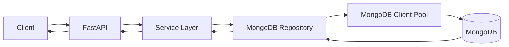

# 09- Read Performance

## Overview

MongoDB read performance is primarily determined by how efficiently a query identifies, retrieves, and returns the required data. The most important factors are:

- Query selectivity
- Index design
- Query planner behavior
- Projection
- Sorting
- Pagination strategy
- Document size
- Working-set size
- Connection pooling
- Read preference
- Replication topology
- Aggregation complexity
- Application concurrency

A useful mental model is:

```text
Application Request
        ↓
Connection Pool
        ↓
MongoDB Query
        ↓
Query Planner
        ↓
Index / Collection Access
        ↓
Document Fetch
        ↓
Projection / Transformation
        ↓
Result
        ↓
Application
```

A fast MongoDB query is not simply one that returns quickly on a small dataset. A production-quality read path should remain predictable as:

```text
Data volume ↑
Concurrency ↑
Document size ↑
Index size ↑
Traffic ↑
```

Read optimization should therefore focus on reducing unnecessary work rather than merely increasing database hardware.

## Read Performance Fundamentals

The basic relationship is:

```text
Read latency
≈
Query planning
+
Index traversal
+
Document reads
+
Sorting / processing
+
Network transfer
+
Application processing
```

For a simple indexed query:

```text
Query
  ↓
Index
  ↓
Document location
  ↓
Document fetch
  ↓
Result
```

For an inefficient query:

```text
Query
  ↓
Collection scan
  ↓
Millions of documents examined
  ↓
Filtering
  ↓
Sorting
  ↓
Result
```

The second pattern may work during development and fail under production load.

## Selectivity

Selectivity describes how effectively a predicate narrows the candidate dataset.

Suppose:

```text
10,000,000 documents
```

and:

```text
status = "completed"
```

matches:

```text
9,000,000 documents
```

The predicate has low selectivity.

A predicate such as:

```text
order_id = "ORD-2026-000001"
```

may identify one document and therefore be highly selective.

High selectivity often makes indexes more useful, although index selection also depends on:

- Sort requirements
- Query shape
- Compound indexes
- Data distribution
- Cardinality
- Projection
- Workload frequency

## Cardinality

Cardinality is the number or distribution of distinct values in a field.

Examples:

| Field | Typical cardinality |
|---|---|
| Gender | Very low |
| Status | Low |
| Country | Low/medium |
| Tenant ID | Medium/high |
| Customer ID | High |
| UUID | Very high |

Low-cardinality fields are not automatically bad index candidates, but indexing only a low-cardinality field may provide limited filtering benefit.

For example:

```javascript
db.orders.createIndex({
  status: 1
})
```

may provide less benefit when:

```text
95% of documents = "completed"
```

A compound access pattern may be more useful:

```javascript
db.orders.createIndex({
  tenant_id: 1,
  status: 1,
  created_at: -1
})
```

## Query Shape

A query shape represents the structural pattern of a query.

Examples:

```javascript
{
  tenant_id: tenantId,
  status: "completed"
}
```

and:

```javascript
{
  tenant_id: anotherTenantId,
  status: "pending"
}
```

have the same basic shape.

Monitoring query shapes helps identify frequently executed workloads and prioritize optimization.

## Indexes and Read Performance

Indexes provide an alternate access path to data.

Without a suitable index:

```text
Collection
   ↓
Scan documents
   ↓
Evaluate predicate
   ↓
Return matches
```

With an index:

```text
Query
   ↓
Index
   ↓
Candidate document locations
   ↓
Fetch documents
   ↓
Return results
```

The benefit depends on whether the index meaningfully reduces work.

## Collection Scan

A collection scan appears as:

```text
COLLSCAN
```

It means MongoDB is scanning collection documents to evaluate the query.

Example:

```javascript
db.orders.find({
  external_reference: "ORD-1001"
})
```

If `external_reference` is not indexed, MongoDB may need to inspect many documents.

For large frequently queried collections, this can become expensive.

A collection scan is not automatically wrong.

It may be reasonable when:

- The collection is small.
- Most documents are expected to match.
- The query is intentionally processing the entire dataset.
- An index would not provide meaningful benefit.

## Index Scan

An index scan appears as:

```text
IXSCAN
```

MongoDB traverses an index to identify matching records.

Example:

```javascript
db.orders.createIndex({
  external_reference: 1
})
```

Then:

```javascript
db.orders.find({
  external_reference: "ORD-1001"
})
```

can use the index.

The actual execution plan should be verified with `explain()`.

## Query Planner

MongoDB's query planner evaluates available execution strategies and selects a plan.

Conceptually:

```text
Query
  ↓
Available indexes
  ↓
Candidate plans
  ├── COLLSCAN
  ├── IXSCAN A
  ├── IXSCAN B
  └── Compound IXSCAN
        ↓
Plan evaluation
        ↓
Winning plan
        ↓
Execution
```

The winning plan can depend on:

- Query shape
- Available indexes
- Data distribution
- Sort requirements
- Collection statistics
- Planner behavior

Do not assume that an index exists means MongoDB will always use it.

## `explain()`

Use:

```javascript
db.orders.explain("executionStats").find({
  tenant_id: tenantId,
  status: "completed"
})
```

For aggregation:

```javascript
db.orders.explain("executionStats").aggregate([
  {
    $match: {
      tenant_id: tenantId,
      status: "completed"
    }
  }
])
```

Important values include:

| Metric | Meaning |
|---|---|
| `nReturned` | Documents returned |
| `totalKeysExamined` | Index keys examined |
| `totalDocsExamined` | Documents examined |
| `executionTimeMillis` | Execution duration |
| `winningPlan` | Selected execution plan |
| `rejectedPlans` | Candidate plans not selected |

## Keys Examined vs Documents Returned

Consider:

```text
nReturned = 20
totalKeysExamined = 25
totalDocsExamined = 20
```

This is generally efficient.

Compare:

```text
nReturned = 20
totalKeysExamined = 500,000
totalDocsExamined = 500,000
```

The query is doing substantially more work than the result size suggests.

A useful diagnostic ratio is:

```text
totalDocsExamined / nReturned
```

A very high ratio can indicate poor selectivity or an unsuitable access path.

This is a diagnostic signal rather than a universal pass/fail threshold.

## Covered Queries

A covered query can be satisfied entirely from an index without fetching the full documents.

Example index:

```javascript
db.users.createIndex({
  email: 1,
  status: 1
})
```

Query:

```javascript
db.users.find(
  {
    email: "user@example.com",
    status: "active"
  },
  {
    _id: 0,
    email: 1,
    status: 1
  }
)
```

If the query and projection are compatible with the index, MongoDB may avoid fetching the underlying documents.

Conceptually:

```text
Query
  ↓
Index
  ↓
Required fields already available
  ↓
Result
```

Covered queries can reduce document I/O, but designing indexes purely to cover every query can create excessive index overhead.

## Projection

Projection limits fields returned to the application.

Example:

```javascript
db.users.find(
  {
    tenant_id: tenantId,
    status: "active"
  },
  {
    _id: 1,
    name: 1,
    email: 1
  }
)
```

Projection is useful when:

- Documents contain large fields.
- APIs require only a subset of data.
- Sensitive fields should not be returned.
- Network payload size matters.
- Application serialization is expensive.

Projection does not automatically make every query faster. The biggest benefits occur when it reduces document transfer, processing, or enables a covered query.

## Large Documents

Large documents increase read cost.

A query returning:

```json
{
  "customer_id": "...",
  "profile": {},
  "preferences": {},
  "audit_history": [],
  "large_metadata": {},
  "..."
}
```

may transfer substantially more data than necessary if the API needs only:

```json
{
  "customer_id": "...",
  "name": "..."
}
```

For read-heavy workloads, schema design and projection should be considered together.

## Large Embedded Arrays

Embedded arrays can make reads expensive when only one element is required.

Example:

```json
{
  "customer_id": "C-1001",
  "orders": [
    {},
    {},
    {},
    "..."
  ]
}
```

If the array grows to thousands of elements, retrieving the parent document becomes increasingly expensive.

For unbounded historical data, consider a separate collection:

```text
customers
orders
```

with an index such as:

```javascript
db.orders.createIndex({
  customer_id: 1,
  created_at: -1
})
```

## Sorting

Sorting can become expensive when MongoDB cannot use an appropriate index.

Example:

```javascript
db.orders.find({
  tenant_id: tenantId
}).sort({
  created_at: -1
})
```

A useful index may be:

```javascript
db.orders.createIndex({
  tenant_id: 1,
  created_at: -1
})
```

This can support both filtering and ordering for the access pattern.

Always validate with `explain()`.

## Index Ordering and Sort

For:

```javascript
{
  tenant_id: tenantId,
  status: "completed"
}
```

with:

```javascript
.sort({
  created_at: -1
})
```

a candidate index is:

```javascript
{
  tenant_id: 1,
  status: 1,
  created_at: -1
}
```

The exact index depends on the complete workload and ESR considerations.

Do not select index ordering based solely on the number of fields.

## Skip-Based Pagination

Traditional pagination often uses:

```javascript
db.orders.find({
  tenant_id: tenantId
})
.sort({
  created_at: -1
})
.skip(100000)
.limit(50)
```

Large offsets can require MongoDB to traverse many preceding records before returning the requested page.

This makes latency increasingly sensitive to page depth.

## Range Pagination

For high-volume APIs, range pagination is usually more scalable.

Suppose the last item returned has:

```text
created_at = 2026-09-20T10:00:00Z
```

The next query can use:

```javascript
db.orders.find({
  tenant_id: tenantId,
  created_at: {
    $lt: lastCreatedAt
  }
})
.sort({
  created_at: -1
})
.limit(50)
```

With:

```javascript
db.orders.createIndex({
  tenant_id: 1,
  created_at: -1
})
```

This avoids increasingly large offsets.

## Stable Cursor Pagination

Timestamps may not be unique.

A more robust cursor can include:

```text
created_at
+
_id
```

Example sort:

```javascript
{
  created_at: -1,
  _id: -1
}
```

and an appropriate compound index:

```javascript
db.orders.createIndex({
  tenant_id: 1,
  created_at: -1,
  _id: -1
})
```

The cursor should encode enough information to uniquely identify the position in the ordered result set.

## Querying Arrays

Array queries require careful consideration.

Example:

```javascript
db.products.find({
  tags: "database"
})
```

MongoDB can match an array containing the value.

For multiple conditions:

```javascript
db.products.find({
  tags: {
    $all: ["database", "backend"]
  }
})
```

Array indexes are multikey indexes.

Example:

```javascript
db.products.createIndex({
  tags: 1
})
```

Multikey indexes are powerful but have specific indexing behavior and limitations. Avoid assuming that adding indexes to deeply nested arrays will provide unlimited performance improvements.

## Embedded Documents

Querying nested fields:

```javascript
db.users.find({
  "address.country": "IN",
  "address.city": "Kolkata"
})
```

can be supported by a compound index such as:

```javascript
db.users.createIndex({
  "address.country": 1,
  "address.city": 1
})
```

Index design should follow actual query patterns rather than the document hierarchy alone.

## Regex Queries

Regex queries can be expensive.

Potentially efficient:

```javascript
db.users.find({
  username: /^aranya/
})
```

Potentially expensive:

```javascript
db.users.find({
  username: /anya/
})
```

A prefix-anchored expression can be more compatible with index-assisted matching than a regex that requires arbitrary substring search.

For high-scale search requirements, consider dedicated search capabilities rather than relying on arbitrary regex queries.

## Case-Insensitive Search

Avoid repeatedly performing expensive transformations during reads when normalization can happen during writes.

Instead of repeatedly applying:

```javascript
{
  $expr: {
    $eq: [
      { $toLower: "$email" },
      inputEmail
    ]
  }
}
```

consider storing:

```json
{
  "email": "User@Example.com",
  "email_normalized": "user@example.com"
}
```

with an index:

```javascript
db.users.createIndex({
  email_normalized: 1
})
```

This converts repeated read-time computation into controlled write-time normalization.

## Read Concern

Read concern determines consistency characteristics for reads.

The appropriate setting depends on:

- Data criticality
- Replica-set topology
- Read-after-write requirements
- Availability requirements
- Latency objectives

Do not choose read concern solely based on maximum read speed.

## Read Preference

Replica sets can support different read preferences.

Common modes include:

| Read preference | Typical behavior |
|---|---|
| `primary` | Reads from primary |
| `primaryPreferred` | Prefer primary, allow secondary |
| `secondary` | Read from secondary |
| `secondaryPreferred` | Prefer secondary |
| `nearest` | Choose suitable low-latency member |

Example:

```python
from pymongo import MongoClient, ReadPreference

client = MongoClient(
    mongo_uri,
    read_preference=ReadPreference.SECONDARY_PREFERRED,
)
```

Read preference can distribute read traffic, but it changes consistency and topology behavior.

## Primary Reads

For strongly consistent application workflows, primary reads are often the simplest model:

```text
Write → Primary
Read  → Primary
```

This avoids many stale-read scenarios.

However, all read traffic may then compete with primary writes.

## Secondary Reads

Secondary reads can distribute read workload:

```text
                 ┌── Primary
Application ─────┤
                 ├── Secondary
                 └── Secondary
```

Potential use cases include:

- Analytics
- Reporting
- Read-heavy workloads
- Non-critical dashboards

Potential problems include:

- Replication lag
- Stale reads
- Additional secondary resource pressure
- More complex failure behavior

Do not route latency-sensitive reads to secondaries without understanding the consistency requirements.

## Working Set

The working set is the portion of data and indexes accessed frequently enough to benefit from memory residency.

Conceptually:

```text
Total Dataset
┌──────────────────────────────┐
│                              │
│       Cold Data              │
│                              │
│    ┌──────────────────┐      │
│    │   Working Set    │      │
│    │                  │      │
│    └──────────────────┘      │
│                              │
└──────────────────────────────┘
```

When the working set fits efficiently in available memory, reads can often avoid excessive storage I/O.

When it does not:

```text
Working Set > Effective Memory
        ↓
More storage reads
        ↓
Higher latency
        ↓
Lower throughput
```

## Working Set and Indexes

Indexes are part of the memory equation.

A workload with:

```text
500 GB data
+
200 GB indexes
```

does not have the same memory requirements as:

```text
500 GB data
+
20 GB indexes
```

Even when the application reads only a subset of documents, large indexes can compete for memory with frequently accessed data.

## Cache Pressure

Read-heavy workloads can create cache pressure.

Symptoms may include:

- Increased disk I/O
- Increased query latency
- Higher latency variance
- Reduced throughput

Investigate:

- Working-set size
- Index size
- Access patterns
- Large documents
- Cold data scans
- Analytical queries

## Large Collection Scans

A collection scan over a small collection may be harmless.

A collection scan over billions of documents is a fundamentally different workload.

Before optimizing a query, ask:

```text
How large is the collection?
How often does the query execute?
How many documents does it return?
How many documents does it examine?
```

A query taking:

```text
500 ms
```

once per hour may be acceptable.

The same query taking:

```text
500 ms
×
20,000 requests/sec
```

is not.

## Read Amplification

Read amplification occurs when a request causes significantly more database work than the amount of data ultimately returned.

Example:

```text
Return 20 documents
↓
Examine 500,000 documents
```

This is high read amplification.

Common causes include:

- Poor indexes
- Low-selectivity predicates
- Large offsets
- Inefficient joins
- Unbounded scans
- Large intermediate aggregation stages

Reducing read amplification is a core performance objective.

## Application-Level Read Amplification

The database may be efficient while the application still performs unnecessary reads.

Bad:

```text
GET /users
  ↓
Query users
  ↓
For each user:
    query orders
```

This creates an N+1 pattern.

```text
1 user query
+
N order queries
```

For 1,000 users:

```text
1 + 1,000 database requests
```

Possible alternatives include:

- `$lookup`
- Batched `$in` queries
- Precomputed summaries
- Better API boundaries
- Embedded data where appropriate

## `$lookup` vs Application Joins

MongoDB `$lookup` can reduce application-side round trips.

Example:

```javascript
db.orders.aggregate([
  {
    $match: {
      tenant_id: tenantId
    }
  },
  {
    $lookup: {
      from: "customers",
      localField: "customer_id",
      foreignField: "_id",
      as: "customer"
    }
  }
])
```

But `$lookup` is not automatically faster.

Compare:

```text
Application N+1 queries
```

against:

```text
Single complex aggregation
```

using:

- Data volume
- Join cardinality
- Indexes
- Frequency
- Latency
- Memory
- Concurrency

## Aggregation Reads

Aggregation performance depends on:

- Input size
- `$match` selectivity
- `$sort`
- `$group`
- `$unwind`
- `$lookup`
- Expression complexity
- Result size

A useful pattern is:

```javascript
[
  {
    $match: {
      tenant_id: tenantId,
      status: "active"
    }
  },
  {
    $project: {
      customer_id: 1,
      amount: 1
    }
  },
  {
    $group: {
      _id: "$customer_id",
      total: {
        $sum: "$amount"
      }
    }
  }
]
```

The goal is to reduce unnecessary work before expensive stages.

## Read Performance and API Design

API design directly influences database read behavior.

A response such as:

```http
GET /orders
```

should not automatically return:

- Full audit history
- Large embedded documents
- Internal metadata
- Large arrays
- Unbounded result sets

Prefer explicit response shapes:

```http
GET /orders?limit=50&cursor=...
```

and projection appropriate to the endpoint.

## FastAPI Read Architecture

A production FastAPI application can structure reads as:



The repository can own:

- Query filters
- Projection
- Sort
- Pagination
- Aggregation
- Database-specific optimization

The service layer can enforce:

- Authorization
- Business rules
- Tenant boundaries

## Python Read Example

```python
from bson import ObjectId


async def list_orders(
    collection,
    tenant_id: ObjectId,
    limit: int,
    cursor_created_at,
):
    query = {
        "tenant_id": tenant_id,
    }

    if cursor_created_at is not None:
        query["created_at"] = {
            "$lt": cursor_created_at,
        }

    cursor = (
        collection.find(
            query,
            {
                "_id": 1,
                "customer_id": 1,
                "status": 1,
                "amount": 1,
                "created_at": 1,
            },
        )
        .sort("created_at", -1)
        .limit(limit)
    )

    return await cursor.to_list(length=limit)
```

The production implementation should also define a stable cursor strategy when timestamps are not unique.

## Connection Pooling

Read performance can degrade when the application repeatedly establishes connections.

Prefer:

```text
Application Process
       ↓
Shared MongoDB Client
       ↓
Connection Pool
       ├── Connection
       ├── Connection
       ├── Connection
       └── ...
```

Do not create a MongoDB client for every HTTP request.

Connection pool configuration should be based on:

- Worker count
- Concurrent requests
- Query latency
- MongoDB capacity
- Observed wait time

Increasing pool size without increasing database capacity can simply increase concurrent pressure.

## Async Python Considerations

For asynchronous FastAPI workloads, blocking database operations can reduce application concurrency.

Use the current PyMongo async API or another supported async MongoDB driver when the application architecture requires asynchronous database operations.

The important distinction is:

```text
Async application
+
Blocking database operation
=
Event-loop blocking risk
```

Measure end-to-end latency rather than assuming async automatically means faster database queries.

## Django Read Architecture

For Django applications using MongoDB, keep MongoDB-specific queries behind an explicit data-access boundary where appropriate.

```text
DRF ViewSet
    ↓
Service
    ↓
Repository
    ↓
MongoDB
```

This avoids assuming that MongoDB has the same query semantics or transaction model as Django's traditional relational ORM.

Read performance should be evaluated using actual MongoDB queries and execution plans.

## Redis as a Read Optimization

Redis can reduce repeated database reads for highly cacheable data.

Example:

```text
Client
  ↓
API
  ↓
Redis
  ├── HIT → Return
  └── MISS
        ↓
     MongoDB
        ↓
     Redis SET
        ↓
     Return
```

A typical cache-aside pattern:

```python
cached = await redis.get(cache_key)

if cached is not None:
    return deserialize(cached)

result = await repository.get_customer(customer_id)

await redis.set(
    cache_key,
    serialize(result),
    ex=300,
)

return result
```

Caching is useful when:

- Reads are frequent.
- Data is reused.
- Slight staleness is acceptable.
- Invalidation can be controlled.

Caching is not a substitute for fixing an inefficient MongoDB query.

## Cache Invalidation

Read caching introduces consistency concerns.

A write path may need:

```text
MongoDB write
    ↓
Invalidate cache
```

or:

```text
MongoDB write
    ↓
Update cache
```

The correct strategy depends on the data.

For critical consistency requirements, avoid assuming that a cache always reflects MongoDB immediately.

## Read-Heavy Architecture

A read-heavy production system may look like:

```text
                         ┌── Redis
                         │
Clients → API → Service ─┤
                         │
                         └── MongoDB
                              ├── Primary
                              ├── Secondary
                              └── Secondary
```

Possible strategies include:

- Redis for hot data
- Secondary reads for appropriate workloads
- Index optimization
- Materialized summaries
- Query-specific projections
- API pagination

Each introduces its own consistency and operational trade-offs.

## Security and Read Performance

Security controls should be applied without unnecessarily exposing large datasets.

Important practices include:

- Enforce tenant filters.
- Apply authorization before querying.
- Use projection to avoid returning sensitive fields.
- Avoid arbitrary client-controlled MongoDB operators.
- Limit result sizes.
- Rate-limit expensive endpoints.
- Avoid exposing raw database errors.
- Do not log sensitive query values unnecessarily.

Example:

```python
query = {
    "tenant_id": current_tenant_id,
    "status": requested_status,
}
```

The tenant ID should come from trusted authentication context rather than from an unrestricted client parameter.

## Read Performance and Multi-Tenancy

Multi-tenant systems should design indexes around tenant-scoped access patterns.

Example:

```javascript
db.orders.createIndex({
  tenant_id: 1,
  status: 1,
  created_at: -1
})
```

This can support:

```javascript
db.orders.find({
  tenant_id: tenantId,
  status: "completed"
}).sort({
  created_at: -1
})
```

The exact index should be validated against the complete workload.

Tenant isolation also reduces accidental cross-tenant scans when queries are correctly constrained.

## Monitoring Read Performance

Monitor both database and application metrics.

| Metric | Why it matters |
|---|---|
| Query latency | User-facing performance |
| p95/p99 latency | Tail behavior |
| Queries/sec | Workload volume |
| `nReturned` | Result size |
| `totalDocsExamined` | Read amplification |
| `totalKeysExamined` | Index efficiency |
| COLLSCAN frequency | Potential inefficient access |
| CPU | Query processing pressure |
| Disk I/O | Cache/working-set pressure |
| Connections | Pool pressure |
| Cache hit rate | Effectiveness of caching |
| Replication lag | Secondary read freshness |
| Error rate | Reliability |
| Timeout rate | Saturation/dependency issues |

## Slow Query Investigation

Use a structured workflow:

```text
Symptom
↓
Identify slow endpoint/query
↓
Capture exact query shape
↓
Run explain("executionStats")
↓
Inspect winning plan
↓
Check nReturned
↓
Check totalKeysExamined
↓
Check totalDocsExamined
↓
Check SORT / COLLSCAN / FETCH
↓
Review indexes
↓
Review document size and data distribution
↓
Check application connection pool
↓
Check CPU / memory / disk I/O
↓
Optimize
↓
Benchmark
↓
Deploy gradually
↓
Monitor
```

## High Latency but Low Database Time

Sometimes MongoDB is not the bottleneck.

Consider:

```text
Client
 ↓
Nginx
 ↓
FastAPI
 ↓
Service logic
 ↓
MongoDB
 ↓
Serialization
 ↓
Network
 ↓
Client
```

If MongoDB reports:

```text
query execution = 10 ms
```

but the API takes:

```text
500 ms
```

investigate:

- Connection pool wait
- Application CPU
- Serialization
- Network latency
- Redis
- External services
- Thread/event-loop blocking
- Large response payloads

Do not optimize MongoDB when the database is already fast.

## Read Performance Regression

Read performance can degrade even without query code changes.

Possible causes include:

- Collection growth
- Index growth
- Working-set growth
- Changed data distribution
- Increased document size
- New tenants
- Increased query frequency
- Increased concurrency
- Cache eviction
- Replication lag

Example:

```text
10M documents
    ↓
500 ms query

100M documents
    ↓
3 seconds
```

The query did not change, but the workload did.

## Performance Testing

Use production-like data.

A realistic read benchmark should include:

```text
Representative document count
+
Representative document sizes
+
Realistic indexes
+
Realistic cardinality
+
Realistic concurrency
+
Realistic query distribution
```

Measure:

- p50
- p95
- p99
- Throughput
- CPU
- Memory
- Disk I/O
- Connection usage

Avoid benchmarking only one query in isolation.

## Before-and-After Optimization

Suppose:

```text
Query:
Find active orders for tenant

Before:
nReturned = 50
totalDocsExamined = 1,500,000
executionTimeMillis = 1200
```

Candidate index:

```javascript
db.orders.createIndex({
  tenant_id: 1,
  status: 1,
  created_at: -1
})
```

After benchmarking:

```text
nReturned = 50
totalDocsExamined = 50
executionTimeMillis = 8
```

The important evidence is the reduction in examined documents and measured latency.

Do not assume an index helped merely because the query became faster on a local development dataset.

## Read Capacity Planning

A read-capacity model should consider:

```text
Peak requests/sec
×
Database queries/request
×
Average documents examined/query
×
Average document size
```

For example, reducing:

```text
1,000 documents examined
→
20 documents examined
```

can be more valuable than simply adding database capacity.

This is why query efficiency should precede horizontal scaling where practical.

## High Availability and Read Scaling

Replica sets provide multiple members, but secondaries should not automatically be treated as read replicas for every workload.

Consider:

```text
Primary
 ├── Critical reads
 ├── Writes
 └── Strong consistency workloads

Secondary
 └── Suitable read workloads
```

Secondary read scaling requires understanding:

- Read preference
- Replication lag
- Read concern
- Failure behavior
- Workload isolation

A secondary overloaded by reporting queries may compromise replication health.

## Cost Optimization

Read optimization can reduce infrastructure cost by lowering:

- CPU usage
- Storage I/O
- Instance requirements
- Network traffic
- Cache infrastructure pressure
- Replica workload

A useful optimization sequence is:

```text
Fix inefficient queries
        ↓
Fix indexes
        ↓
Reduce payloads
        ↓
Optimize pagination
        ↓
Optimize application access patterns
        ↓
Add caching where justified
        ↓
Scale infrastructure
```

Scaling before fixing read amplification can simply make an inefficient system more expensive.

## Common Mistakes

### Indexing Every Query

**Why it happens:** Engineers treat indexes as free performance improvements.

**Problem:** Indexes consume storage, memory, and write resources.

**Better approach:** Create indexes around important query patterns and validate them with explain and workload metrics.

### Returning Entire Documents

**Why it happens:** `find()` without projection is convenient.

**Problem:** Large documents increase network, serialization, and memory costs.

**Better approach:** Return only fields required by the endpoint.

### Using Large `skip` Values

**Why it happens:** Offset pagination is familiar.

**Problem:** Deep pages can require increasingly large amounts of work.

**Better approach:** Use range/cursor pagination for large datasets.

### Ignoring `totalDocsExamined`

**Why it happens:** Engineers look only at execution time.

**Problem:** A query may appear fast on a small dataset while examining huge numbers of documents.

**Better approach:** Analyze `nReturned`, `totalKeysExamined`, and `totalDocsExamined` together.

### Reading Everything from Secondaries

**Why it happens:** Secondaries appear to be free read capacity.

**Problem:** Reads can be stale and can overload replication members.

**Better approach:** Route only workloads that tolerate the consistency and operational trade-offs.

### Solving Every Read Problem with Redis

**Why it happens:** Caching is an easy optimization to describe.

**Problem:** It introduces invalidation and consistency complexity while leaving the underlying query inefficient.

**Better approach:** Optimize MongoDB access first, then cache genuinely hot and reusable data.

### Ignoring the Application Layer

**Why it happens:** Database metrics are easier to inspect.

**Problem:** N+1 queries, serialization, and connection pool waits can dominate latency.

**Better approach:** Measure end-to-end request latency.

### Optimizing Against Tiny Datasets

**Why it happens:** Local development environments are small.

**Problem:** Query behavior can change dramatically with production-scale data.

**Better approach:** Benchmark using representative data volume and distribution.

## Production Read Checklist

### Query Design

- Queries are based on explicit access patterns.
- Filters are selective where possible.
- Unbounded scans are identified.
- Large result sets are paginated.
- Cursor pagination is used for large datasets where appropriate.

### Indexes

- Important query patterns have suitable indexes.
- Compound indexes support filtering and sorting where appropriate.
- Indexes are validated using `explain()`.
- Index size is monitored.
- Unused indexes are reviewed.

### Documents

- Frequently returned documents are appropriately sized.
- Unbounded arrays are avoided.
- Large fields are excluded from API responses when unnecessary.
- Frequently accessed data is modeled for the read path.

### Application

- MongoDB clients are reused.
- Connection pools are appropriately configured.
- N+1 query patterns are avoided.
- Async applications do not perform unintended blocking database operations.
- API payloads are bounded.

### Consistency

- Read preference matches business requirements.
- Read concern is deliberate.
- Secondary reads account for replication lag.
- Cache consistency is understood.

### Monitoring

- p95/p99 latency is monitored.
- Query throughput is monitored.
- Documents examined are monitored.
- Slow queries are investigated.
- CPU, memory, disk, and connections are monitored.
- Performance regression is tested as data grows.

## Interview Considerations

### How would you diagnose a slow MongoDB query?

Start with:

```javascript
db.collection.explain("executionStats").find(query)
```

Then inspect:

- Winning plan
- `nReturned`
- `totalKeysExamined`
- `totalDocsExamined`
- Execution time
- `COLLSCAN`
- `IXSCAN`
- `SORT`
- Index suitability

Then correlate the result with application latency and infrastructure metrics.

### What is a good sign in `explain()`?

For a highly selective indexed query, a desirable pattern may be:

```text
nReturned ≈ totalDocsExamined
```

and:

```text
totalDocsExamined << collection size
```

But there is no universal numerical threshold. Query behavior must be evaluated against its workload.

### Why is `COLLSCAN` not always bad?

A collection scan can be appropriate for:

- Small collections
- Queries matching most documents
- Intentional full-data processing

The issue is an inefficient collection scan relative to the workload, not the existence of `COLLSCAN` itself.

### What is a covered query?

A query whose required predicate and returned fields can be satisfied entirely from an index, allowing MongoDB to avoid fetching the full documents.

### Why is cursor pagination better than large `skip()`?

Large offsets can require MongoDB to traverse many preceding records.

Range pagination allows the query to continue from a known indexed position.

### How do you optimize a read-heavy MongoDB application?

A practical sequence is:

1. Identify the highest-volume queries.
2. Measure with `explain("executionStats")`.
3. Reduce documents examined.
4. Design appropriate indexes.
5. Reduce returned fields.
6. Use efficient pagination.
7. Eliminate N+1 access patterns.
8. Optimize connection pooling.
9. Add caching where justified.
10. Scale reads with appropriate replica topology if necessary.

### When would you use secondary reads?

When the workload can tolerate the consistency implications and the secondary has sufficient capacity.

Examples may include:

- Analytics
- Reporting
- Non-critical dashboards

Critical read-after-write workflows often require a different strategy.

### Does adding an index always improve read performance?

No.

An index may be ineffective when:

- Selectivity is poor.
- The query returns most documents.
- The query pattern does not match the index.
- The collection is small.
- Another access path is better.

Indexes also have write and storage costs.

## Key Takeaways

- **Read performance is fundamentally about minimizing unnecessary work: reduce documents examined, use appropriate indexes, control result sizes, and avoid inefficient access patterns.**
- **Use `explain("executionStats")` to evaluate real query behavior through `nReturned`, `totalKeysExamined`, `totalDocsExamined`, execution stages, and latency.**
- **Compound indexes, covered queries, projection, and cursor-based pagination can substantially improve high-volume read paths when designed around actual access patterns.**
- **Working-set size, document size, connection pooling, replication lag, and application-level patterns such as N+1 queries can be just as important as the database query itself.**
- **Optimize and benchmark against production-like data and concurrency before adding caching, replicas, or larger infrastructure.**