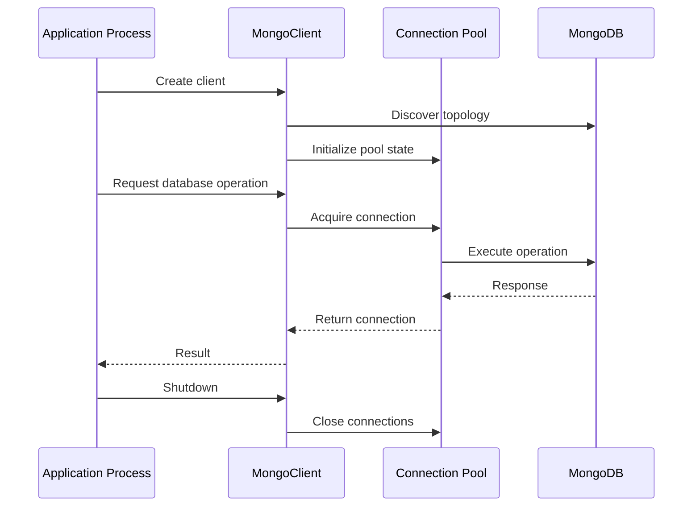

# 10- Connection Pool Performance

## Overview

MongoDB connection pooling is a critical part of backend performance because database operations are executed through client-managed connections. Poor connection lifecycle management can create unnecessary connection establishment overhead, exhaust server connection capacity, increase request latency, or create unstable behavior under concurrency.

For a production backend, the expected architecture is generally:

```text
Application Process
        │
        ▼
   MongoDB Client
        │
        ▼
 Connection Pool
   ┌────┼────┬────┐
   ▼    ▼    ▼    ▼
 Conn  Conn Conn Conn
   │    │    │    │
   └────┴────┴────┘
          │
          ▼
      MongoDB
```

The core rule is:

> Create a MongoDB client at the appropriate application-process lifecycle boundary and reuse it rather than creating a new client for every request.

Connection pooling matters particularly in:

- FastAPI and asynchronous services
- Django applications
- REST APIs
- gRPC services
- Celery workers
- Kafka consumers
- Kubernetes deployments
- High-concurrency microservices

Connection pooling is not primarily about making MongoDB itself execute a query faster. It reduces connection-management overhead and controls how application concurrency reaches MongoDB.

## Why Connection Pooling Exists

Establishing a database connection can involve:

```text
DNS / address resolution
        ↓
TCP connection
        ↓
TLS negotiation
        ↓
MongoDB server selection
        ↓
Authentication
        ↓
Connection ready
```

Doing this for every request is inefficient.

Without pooling:

```text
Request 1 → Connect → Query → Close
Request 2 → Connect → Query → Close
Request 3 → Connect → Query → Close
```

With pooling:

```text
Application startup
       ↓
MongoDB Client
       ↓
Connection Pool
       ├── Connection A
       ├── Connection B
       ├── Connection C
       └── ...
              ↓
Requests reuse available connections
```

The pool allows established connections to be reused across database operations.

## MongoClient Lifecycle

A production application should normally maintain a long-lived MongoDB client per application process.

Typical lifecycle:



The client should generally be created once per process and closed during application shutdown.

## Connection Pool Internals

A MongoDB client manages connections to servers in the topology.

Conceptually:

```text
MongoClient
    │
    ├── Server A
    │     └── Connection Pool
    │
    ├── Server B
    │     └── Connection Pool
    │
    └── Server C
          └── Connection Pool
```

The exact pool topology and behavior depend on the MongoDB deployment and driver.

This distinction matters because a pool configuration does not necessarily represent one global collection of connections across every MongoDB server.

## One Client per Process

For most backend services:

```text
Process
  ↓
One MongoClient
  ↓
Pool
  ↓
MongoDB
```

is preferable to:

```text
Request
  ↓
New MongoClient
  ↓
MongoDB
```

The first approach provides:

- Connection reuse
- Lower connection establishment overhead
- Stable topology monitoring
- Predictable resource usage
- Better application performance

## Why Creating a Client per Request Is a Mistake

Bad:

```python
from pymongo import MongoClient

def get_user(user_id):
    client = MongoClient(MONGO_URI)

    try:
        return client.app.users.find_one({"_id": user_id})
    finally:
        client.close()
```

This repeatedly creates and destroys clients.

Under high traffic:

```text
1,000 requests/sec
        ↓
Potentially massive client churn
        ↓
Connection establishment
        ↓
Authentication/topology work
        ↓
Resource pressure
```

Better:

```python
from pymongo import MongoClient

client = MongoClient(MONGO_URI)
db = client.get_database("app")


def get_user(user_id):
    return db.users.find_one({"_id": user_id})
```

The exact lifecycle should be adapted to the framework and process model.

## Connection Pool vs Connection

These concepts are different.

| Concept | Meaning |
|---|---|
| MongoDB client | Driver object managing topology and connections |
| Connection | Network connection to a MongoDB server |
| Connection pool | Reusable set of connections managed by the client |
| Database | Logical database selected through the client |
| Collection | Logical MongoDB collection selected through the database |

A common mistake is to think:

```text
MongoClient = one TCP connection
```

In practice, a client manages connections and pooling.

## Pool Acquisition

When an application performs a database operation:

```text
Request
   ↓
MongoDB client
   ↓
Acquire available connection
   ↓
Execute operation
   ↓
Release connection to pool
```

The connection normally remains available for reuse rather than being destroyed after the operation.

If all suitable connections are busy:

```text
Request
   ↓
Pool
   ↓
No available connection
   ↓
Wait
```

Excessive waiting can become an application latency bottleneck.

## Pool Size

MongoDB drivers expose pool configuration such as:

```python
MongoClient(
    MONGO_URI,
    maxPoolSize=100,
)
```

The exact defaults and supported behavior depend on the driver version.

The important concept is that `maxPoolSize` limits concurrent pooled connections for a given server pool rather than being a universal global concurrency limit for the entire deployment.

## What `maxPoolSize` Controls

Conceptually:

```text
maxPoolSize = maximum number of in-use pooled connections
                         for a server pool
```

It does not mean:

```text
maxPoolSize = requests/sec
```

and it does not mean:

```text
maxPoolSize = maximum application requests
```

One connection can execute operations sequentially, while many application requests may wait for available connections.

## Too Small a Pool

Suppose:

```text
Application concurrency = 500
maxPoolSize = 20
```

and each database operation takes:

```text
50 ms
```

Many requests may wait for connections.

The result can be:

```text
HTTP concurrency
      ↓
MongoDB pool
      ↓
20 active connections
      ↓
Large wait queue
      ↓
Higher API latency
```

Symptoms may include:

- Increased request latency
- Connection wait time
- Lower throughput
- Timeout errors
- Poor p95/p99 latency

## Too Large a Pool

Increasing the pool indefinitely is also a mistake.

Suppose:

```text
20 Kubernetes pods
×
maxPoolSize = 500
```

A naive capacity calculation already implies a potential connection footprint of:

```text
20 × 500 = 10,000
```

connections per relevant server pool.

This can overwhelm:

- MongoDB
- Network infrastructure
- Application memory
- CPU
- Authentication/topology management
- Monitoring systems

The right pool size depends on workload and database capacity.

## Pool Size Is a Capacity Planning Problem

A useful model is:

```text
Total potential connections
≈
Application processes
×
Pool size
×
Relevant server pools
```

For Kubernetes:

```text
Deployment
    │
    ├── Pod 1 → Client → Pool
    ├── Pod 2 → Client → Pool
    ├── Pod 3 → Client → Pool
    └── Pod N → Client → Pool
```

Scaling pods can therefore multiply database connections.

This is one of the most important production implications of connection pooling.

## Kubernetes Example

Suppose:

```text
Pods = 30
maxPoolSize = 100
```

The application could potentially create a substantial connection footprint across the deployment.

If an autoscaler increases:

```text
30 pods → 100 pods
```

the MongoDB connection demand can increase dramatically even if request traffic grows only moderately.

Pool sizing must therefore be coordinated with:

- Horizontal Pod Autoscaling
- MongoDB connection limits
- Application concurrency
- Deployment topology

## `minPoolSize`

Drivers can also expose:

```python
MongoClient(
    MONGO_URI,
    minPoolSize=10,
)
```

A minimum pool size can keep connections available rather than allowing the pool to remain entirely idle.

Potential advantages:

- Lower latency for recurring traffic
- Reduced connection establishment during bursts
- More predictable warm behavior

Potential disadvantages:

- More persistent connections
- Higher idle resource consumption
- More connections across many application instances

Do not set a large minimum pool simply because traffic might increase.

## `maxConnecting`

Modern MongoDB drivers can limit how many connections are being established concurrently.

Conceptually:

```text
Request burst
    ↓
Pool needs more connections
    ↓
maxConnecting
    ↓
Controlled connection creation
```

This prevents a traffic spike from causing uncontrolled simultaneous connection establishment.

This is especially relevant during:

- Application startup
- Traffic spikes
- Autoscaling
- Failover
- Pool replenishment

## Pool Wait Time

When the pool is exhausted, application operations may wait for a connection.

A driver setting such as:

```python
waitQueueTimeoutMS=5000
```

can bound how long an operation waits for an available connection.

A pool wait timeout should be aligned with the application's latency requirements.

For example:

```text
HTTP timeout = 3 seconds
MongoDB pool wait timeout = 10 seconds
```

can create poor behavior because the database operation may wait longer than the request itself can survive.

## Timeout Hierarchy

Production timeout design should consider the entire request path:

```text
Client timeout
      ↓
Nginx / Load Balancer timeout
      ↓
Application timeout
      ↓
Pool wait timeout
      ↓
Server selection timeout
      ↓
Socket timeout
      ↓
MongoDB operation
```

Timeout values should be designed intentionally.

Important MongoDB driver settings include:

| Setting | Purpose |
|---|---|
| `waitQueueTimeoutMS` | Maximum time waiting for a pool connection |
| `serverSelectionTimeoutMS` | Maximum time selecting a suitable MongoDB server |
| `connectTimeoutMS` | Connection establishment timeout |
| `socketTimeoutMS` | Socket operation timeout |

The exact configuration should reflect application SLOs and workload characteristics.

## Connection Pool and Latency

End-to-end latency can be represented as:

```text
Request latency
=
Pool wait
+
Server selection
+
Network
+
Database execution
+
Response transfer
+
Application processing
```

For example:

```text
Pool wait:       80 ms
MongoDB query:   10 ms
Network:          5 ms
Serialization:    5 ms
----------------------
Total:           100 ms
```

Optimizing the MongoDB query from:

```text
10 ms → 5 ms
```

does not solve an:

```text
80 ms pool wait
```

This is why senior-level performance analysis separates database execution time from connection acquisition time.

## Detecting Pool Exhaustion

Common symptoms include:

- Increasing application latency
- Requests waiting for database connections
- `waitQueueTimeoutMS` errors
- High application concurrency
- MongoDB connection count approaching capacity
- Database query latency remaining relatively low while API latency increases

The important distinction is:

```text
MongoDB query is fast
+
Connection acquisition is slow
=
Application is pool-bound
```

## Pool Monitoring

Monitor at least:

- Connection pool utilization
- Pool wait time
- Active connections
- Idle connections
- Connection creation rate
- Connection failures
- Application concurrency
- MongoDB connection count
- Request latency

The exact driver metrics and monitoring APIs vary by driver version.

Application telemetry should make connection acquisition distinguishable from database execution when possible.

## MongoDB Connection Count

MongoDB provides server-side information through administrative commands and monitoring tools.

For example:

```javascript
db.serverStatus().connections
```

may expose connection statistics such as:

```text
current
available
totalCreated
```

These values should be interpreted in the context of the entire deployment.

A high connection count is not automatically a problem.

The important questions are:

- Is it increasing unexpectedly?
- Is capacity being exhausted?
- Are connections idle?
- Is the application scaling rapidly?
- Is pool wait time increasing?
- Are connections distributed as expected?

## Connection Churn

Connection churn occurs when connections are repeatedly created and destroyed.

Potential causes include:

- Client creation per request
- Aggressive pool configuration
- Short-lived worker processes
- Frequent container restarts
- Network instability
- TLS/authentication churn
- Server topology changes

Connection churn can increase:

- CPU
- Network traffic
- Authentication overhead
- Latency
- Resource consumption

A stable long-lived client generally reduces unnecessary churn.

## Connection Pooling in FastAPI

FastAPI applications commonly use application lifespan to manage the MongoDB client.

Example:

```python
from contextlib import asynccontextmanager

from fastapi import FastAPI
from pymongo import AsyncMongoClient


@asynccontextmanager
async def lifespan(app: FastAPI):
    client = AsyncMongoClient(
        MONGO_URI,
        maxPoolSize=100,
        minPoolSize=10,
        serverSelectionTimeoutMS=5000,
        connectTimeoutMS=5000,
        socketTimeoutMS=10000,
        waitQueueTimeoutMS=5000,
    )

    app.state.mongo_client = client
    app.state.mongo_db = client.get_database("application")

    try:
        yield
    finally:
        await client.close()


app = FastAPI(lifespan=lifespan)
```

The important lifecycle is:

```text
FastAPI startup
      ↓
Create client
      ↓
Application serves requests
      ↓
Reuse client/pool
      ↓
FastAPI shutdown
      ↓
Close client
```

Use the current PyMongo async API when building asynchronous applications. Avoid sharing an async client across incompatible event loops or threads.

## FastAPI Dependency Pattern

A dependency can expose a database handle without creating a client per request.

```python
from fastapi import Request


def get_database(request: Request):
    return request.app.state.mongo_db
```

Then:

```python
from fastapi import APIRouter, Depends

router = APIRouter()


@router.get("/users/{user_id}")
async def get_user(
    user_id: str,
    db=Depends(get_database),
):
    return await db.users.find_one({
        "_id": user_id,
    })
```

The database handle is lightweight; the long-lived client owns the underlying connection management.

## FastAPI Workers

Suppose Uvicorn runs:

```text
4 worker processes
```

The correct mental model is:

```text
Worker 1 → MongoDB client → Pool
Worker 2 → MongoDB client → Pool
Worker 3 → MongoDB client → Pool
Worker 4 → MongoDB client → Pool
```

Do not assume one pool exists for the entire machine.

Each process has its own client and pool.

Therefore:

```text
4 workers × maxPoolSize 100
```

can represent a much larger potential connection footprint than:

```text
1 worker × maxPoolSize 100
```

## Gunicorn and FastAPI

With multiple Gunicorn/Uvicorn workers:

```text
Gunicorn
 ├── Worker 1 → Client → Pool
 ├── Worker 2 → Client → Pool
 ├── Worker 3 → Client → Pool
 └── Worker 4 → Client → Pool
```

Pool configuration must account for worker count.

Do not configure:

```text
maxPoolSize = 500
```

without considering:

```text
workers × pods × pool size
```

## Forking Considerations

MongoDB clients should not be casually shared across forked processes.

The safe architecture is:

```text
Master
  │
  ├── Worker 1 → create client
  ├── Worker 2 → create client
  └── Worker 3 → create client
```

rather than:

```text
Create MongoClient
      ↓
Fork
 ├── Worker 1
 ├── Worker 2
 └── Worker 3
```

Each child process should create its own client after process creation where the process model involves forking.

## Django Connection Pooling

Django deployments using MongoDB should follow the MongoDB integration mechanism being used rather than assuming relational Django connection semantics apply unchanged.

When using PyMongo directly, a long-lived client can be managed at the application or repository boundary.

Conceptually:

```text
Django Process
      ↓
MongoDB Client
      ↓
Connection Pool
      ↓
MongoDB
```

The lifecycle must account for:

- Development autoreload
- Worker processes
- Gunicorn/uWSGI deployment
- Management commands
- Background workers

Avoid creating a MongoDB client repeatedly inside Django views.

## Celery Workers

Celery changes the connection-pooling model because each worker process may have its own MongoDB client.

Example:

```text
Celery
 ├── Worker Process 1 → MongoClient → Pool
 ├── Worker Process 2 → MongoClient → Pool
 ├── Worker Process 3 → MongoClient → Pool
 └── Worker Process 4 → MongoClient → Pool
```

If:

```text
8 worker processes
×
maxPoolSize = 100
```

the potential connection footprint is much larger than 100.

Tune pool sizes according to actual task concurrency.

## Kafka Consumers

Kafka consumers have a similar relationship.

If multiple consumer processes each create their own MongoDB client:

```text
Consumer 1 → Pool
Consumer 2 → Pool
Consumer 3 → Pool
...
```

connection demand grows with consumer concurrency.

For high-throughput ingestion, combine:

- Batch processing
- Bulk writes
- Appropriate pool sizing
- Controlled consumer concurrency
- MongoDB capacity planning

## gRPC Services

gRPC services often support high concurrency and long-lived processes, making connection pooling particularly important.

```text
gRPC Requests
      ↓
Service Process
      ↓
MongoDB Client
      ↓
Connection Pool
      ↓
MongoDB
```

Avoid mapping:

```text
one gRPC request
=
one MongoDB client
```

Instead:

```text
many requests
=
shared client
+
pooled connections
```

## Connection Pool and Concurrency

A useful model is:

```text
Application concurrency
        ↓
Database operations
        ↓
Pool capacity
        ↓
MongoDB capacity
```

If:

```text
HTTP concurrency = 1,000
pool = 50
```

the application can still handle 1,000 requests, but many requests may wait for database connections.

If:

```text
HTTP concurrency = 1,000
pool = 1,000
```

the application can potentially push much more simultaneous database work into MongoDB.

The second configuration is not automatically better.

## Database Capacity Is the Upper Bound

Suppose MongoDB can efficiently process:

```text
200 concurrent operations
```

but the application allows:

```text
2,000 simultaneous database connections
```

Increasing the pool can turn:

```text
controlled queueing
```

into:

```text
database saturation
```

which can increase:

- CPU
- Storage pressure
- Lock/resource contention
- Query latency
- Tail latency
- Timeouts

Connection pools should regulate concurrency, not eliminate it.

## Pool Size and Little's Law

For approximate capacity reasoning:

```text
Concurrency ≈ Throughput × Latency
```

If the database workload is:

```text
2,000 operations/sec
```

and average database execution time is:

```text
10 ms
```

then approximate database concurrency is:

```text
2,000 × 0.010
=
20 concurrent operations
```

This does not directly determine the correct pool size, because real workloads include:

- Latency variance
- Bursts
- Network delay
- Multiple operations per request
- Connection wait
- Topology behavior

But it provides a useful starting point for capacity analysis.

## Pool Sizing Methodology

Use a measured process:

```text
Measure database latency
        ↓
Measure application concurrency
        ↓
Measure operations/sec
        ↓
Measure pool wait time
        ↓
Measure MongoDB resource utilization
        ↓
Increase pool gradually
        ↓
Benchmark
        ↓
Stop when database saturation increases
```

The objective is not:

```text
Maximum pool size
```

The objective is:

```text
Required throughput
+
acceptable latency
+
safe database utilization
```

## Connection Pool and Tail Latency

Pool exhaustion often appears first in p95/p99 latency.

Example:

```text
p50 = 15 ms
p95 = 25 ms
p99 = 400 ms
```

Possible cause:

```text
Most requests acquire connections immediately
+
A small percentage wait during bursts
```

Average latency may therefore look healthy while tail latency is poor.

Monitor percentiles.

## Bursty Traffic

Consider:

```text
Normal:
100 requests/sec

Burst:
2,000 requests/sec
```

A pool sized only for average traffic may temporarily become saturated.

Possible responses include:

- Appropriate pool sizing
- Request rate limiting
- Queueing
- Backpressure
- Autoscaling
- Caching
- Workload smoothing

Do not solve every traffic burst by setting a huge pool.

## Backpressure

Connection pools naturally provide a form of resource control.

```text
High request rate
       ↓
Pool reaches capacity
       ↓
Requests wait
       ↓
System applies backpressure
```

If wait times become excessive, the application should fail predictably rather than allowing unlimited queue growth.

For example:

```python
MongoClient(
    MONGO_URI,
    waitQueueTimeoutMS=2000,
)
```

can bound connection acquisition waiting.

The appropriate value depends on the API's latency budget.

## Connection Pool and API Timeouts

Consider:

```text
Nginx timeout       = 10s
FastAPI timeout     = 5s
Pool wait timeout   = 2s
MongoDB socket      = 3s
```

This creates a more predictable failure hierarchy than allowing an operation to wait indefinitely.

The timeout hierarchy should be designed so that lower-level operations do not unexpectedly outlive the request that initiated them.

## Connection Pool and Transactions

Transactions can hold database resources for longer than ordinary operations.

For example:

```text
Acquire connection
   ↓
Start transaction
   ↓
Read
   ↓
Write
   ↓
Read
   ↓
Commit
   ↓
Release
```

A long-running transaction can therefore reduce effective pool capacity.

If:

```text
pool = 50
```

and many transactions hold connections for long periods, other requests may wait.

Keep transactions:

- Short
- Focused
- Predictable

## Connection Pool and Slow Queries

A single slow query consumes a connection for longer.

Suppose:

```text
Pool = 20
```

and:

```text
Normal query = 20 ms
```

20 concurrent operations can turn over quickly.

If queries become:

```text
2 seconds
```

the same pool supports substantially less throughput.

This means connection-pool problems are often downstream symptoms of slow queries.

Always investigate:

```text
Pool wait
+
Query execution
```

together.

## Pool Performance Troubleshooting

### High API Latency

```text
Symptom
↓
API latency increased
↓
Measure MongoDB query latency
↓
Measure pool acquisition/wait time
↓
Check pool utilization
↓
Check MongoDB connections
↓
Check CPU / memory / I/O
↓
Check slow queries
↓
Determine pool bottleneck vs database bottleneck
↓
Tune pool or database workload
↓
Benchmark
↓
Monitor
```

### Pool Timeout Errors

```text
Symptom
↓
waitQueueTimeoutMS errors
↓
Check pool size
↓
Check process/worker count
↓
Check application concurrency
↓
Check query latency
↓
Check long transactions
↓
Check MongoDB resource saturation
↓
Determine root cause
↓
Tune pool or reduce database work
↓
Validate under load
```

### Too Many MongoDB Connections

```text
Symptom
↓
MongoDB connection count unexpectedly high
↓
Count application processes
↓
Count pods / containers
↓
Inspect pool configuration
↓
Inspect worker concurrency
↓
Check for client creation per request
↓
Check connection churn
↓
Calculate potential connection footprint
↓
Correct lifecycle or pool sizing
↓
Monitor
```

## Production Configuration Example

A synchronous PyMongo service might use:

```python
from pymongo import MongoClient

client = MongoClient(
    MONGO_URI,
    maxPoolSize=100,
    minPoolSize=10,
    maxConnecting=2,
    waitQueueTimeoutMS=5000,
    serverSelectionTimeoutMS=5000,
    connectTimeoutMS=5000,
    socketTimeoutMS=10000,
    retryWrites=True,
)
```

These values are examples, not universal production defaults.

They should be validated against:

- Request timeout
- Database latency
- Application concurrency
- Number of processes
- Number of pods
- MongoDB topology
- MongoDB connection capacity

## Environment-Based Configuration

Avoid hardcoding pool settings.

For example:

```python
import os

client = MongoClient(
    os.environ["MONGODB_URI"],
    maxPoolSize=int(os.getenv("MONGODB_MAX_POOL_SIZE", "100")),
    minPoolSize=int(os.getenv("MONGODB_MIN_POOL_SIZE", "10")),
    waitQueueTimeoutMS=int(
        os.getenv("MONGODB_WAIT_QUEUE_TIMEOUT_MS", "5000")
    ),
    serverSelectionTimeoutMS=int(
        os.getenv("MONGODB_SERVER_SELECTION_TIMEOUT_MS", "5000")
    ),
)
```

Production configuration should be managed through the deployment environment or secret/configuration management system.

## Pool Configuration by Workload

| Workload | Main consideration |
|---|---|
| Low-traffic API | Avoid excessive idle connections |
| High-concurrency API | Avoid pool starvation |
| Fast CRUD service | Match pool to database concurrency |
| Analytics API | Prevent long queries from consuming the pool |
| Celery | Account for worker process concurrency |
| Kafka consumer | Account for consumer concurrency and batching |
| Batch jobs | Use bounded concurrency |
| gRPC | Account for high request concurrency |
| Kubernetes | Multiply pool capacity by pod count |

## Multiple MongoDB Clients

Applications may have legitimate reasons for more than one client.

Examples:

```text
Client A → Operational MongoDB
Client B → Analytics MongoDB
```

or:

```text
Client A → Different security credentials
Client B → Separate deployment
```

However, creating multiple clients unnecessarily multiplies:

- Connection pools
- Connections
- Topology monitoring
- Memory usage
- Operational complexity

Prefer a shared client when the workloads can safely share the same configuration and security context.

## Multiple Databases

Selecting different databases from the same client does not require a new connection pool.

Example:

```python
client = MongoClient(MONGO_URI)

orders_db = client["orders"]
analytics_db = client["analytics"]
```

The client manages the underlying connections.

Do not create:

```python
orders_client = MongoClient(MONGO_URI)
analytics_client = MongoClient(MONGO_URI)
```

unless there is a specific architectural reason.

## Connection Pool and Read/Write Workloads

If the same client serves:

```text
Fast CRUD
+
Slow reporting
```

slow reporting queries can occupy connections and affect other requests.

Possible strategies include:

- Optimize reporting queries
- Move reporting to background jobs
- Use a separate read topology where appropriate
- Use separate clients only when justified
- Limit reporting concurrency

Connection pooling is therefore also a workload-isolation concern.

## Security Considerations

Connection pooling does not remove authentication or authorization requirements.

Production applications should:

- Use TLS where required.
- Store credentials in a secret-management system.
- Avoid logging connection strings.
- Avoid embedding credentials in source code.
- Use least-privilege database users.
- Rotate credentials according to organizational policy.
- Restrict network access to MongoDB.
- Monitor unexpected connection sources.

A MongoDB URI can contain credentials and must be treated as sensitive configuration.

## High Availability Considerations

A connection pool must react to MongoDB topology changes.

In a replica set:

```text
Application
    ↓
MongoClient
    ↓
Topology discovery
    ├── Primary
    ├── Secondary
    └── Secondary
```

If the primary changes:

```text
Old Primary
    ↓
Election
    ↓
New Primary
    ↓
Driver topology update
    ↓
Subsequent operations routed appropriately
```

Applications should therefore use a MongoDB driver with proper topology monitoring and avoid hardcoding a single primary address when the deployment requires replica-set failover.

## Connection Pool and Failover

During failover:

```text
Primary failure
      ↓
Election
      ↓
Temporary write interruption
      ↓
New primary
      ↓
Client topology update
      ↓
Writes resume
```

During this period:

- Some operations may fail or time out.
- Connection selection may temporarily be unavailable.
- Retry behavior matters.
- Application idempotency matters.

Connection pooling does not eliminate failover latency.

## Docker Considerations

A Dockerized backend typically has:

```text
Container
   ↓
Application Process
   ↓
MongoDB Client
   ↓
Connection Pool
   ↓
MongoDB
```

Avoid placing MongoClient creation inside request handlers simply because containers are ephemeral.

The application process should still maintain a reusable client during its lifetime.

## Kubernetes Scaling Considerations

Before increasing replicas:

```text
kubectl scale deployment api --replicas=20
```

consider:

```text
20 pods
×
worker processes
×
pool size
```

A scaling event can therefore become a MongoDB connection storm.

Use:

- Conservative pool sizing
- Controlled autoscaling
- Startup staggering where appropriate
- Connection monitoring
- MongoDB capacity planning

## Cost Considerations

Excessive connections can increase infrastructure requirements even when database throughput does not increase.

A large pool can create:

```text
More connections
      ↓
More server resource consumption
      ↓
Higher infrastructure requirements
```

The goal is not to maximize connection count.

The goal is to keep enough connections available to satisfy application concurrency without overloading MongoDB.

## Common Mistakes

### Creating a MongoClient Per Request

**Problem:** Connection churn and unnecessary overhead.

**Fix:** Reuse a long-lived client.

### Setting `maxPoolSize` Extremely High

**Problem:** More connections can saturate MongoDB rather than increase throughput.

**Fix:** Benchmark and size according to database capacity.

### Ignoring Worker Count

**Problem:** Four application workers each with a 100-connection pool do not equal a 100-connection deployment.

**Fix:** Calculate pool capacity per process and deployment.

### Ignoring Kubernetes Pod Count

**Problem:** Autoscaling multiplies connection capacity.

**Fix:** Include maximum pod count in capacity planning.

### Treating Pool Size as Requests Per Second

**Problem:** Connections represent concurrent database operations, not throughput.

**Fix:** Reason about latency, concurrency, and throughput together.

### Ignoring Pool Wait Time

**Problem:** Database queries may be fast while requests wait for connections.

**Fix:** Separate pool acquisition latency from MongoDB execution latency.

### Increasing Pool Size to Fix Slow Queries

**Problem:** More concurrent slow queries can increase database saturation.

**Fix:** Optimize the query first.

### Sharing Clients Across Forked Processes

**Problem:** A client created before process forking can result in unsafe resource sharing.

**Fix:** Create process-local clients after worker creation when using fork-based process models.

### Creating Multiple Clients Unnecessarily

**Problem:** Each client can maintain its own pool.

**Fix:** Reuse a client when configuration and security requirements permit.

### Ignoring Transactions

**Problem:** Long transactions can hold connections longer and reduce effective pool capacity.

**Fix:** Keep transactions short and measure their impact.

## Production Troubleshooting Checklist

When diagnosing connection-pool performance:

### Application

- How many processes are running?
- How many pods are running?
- How many workers exist per pod?
- Is a client created once per process?
- Is a client created per request?
- How many database operations does each request perform?

### Pool

- What is `maxPoolSize`?
- What is `minPoolSize`?
- Is `maxConnecting` configured?
- Is `waitQueueTimeoutMS` configured?
- Is pool wait time increasing?
- Is connection churn occurring?

### MongoDB

- What is the current connection count?
- Is CPU saturated?
- Is memory under pressure?
- Is disk I/O saturated?
- Are queries slow?
- Is replication lag increasing?

### Workload

- Are there long-running queries?
- Are there long transactions?
- Are bulk workloads competing with APIs?
- Is traffic bursty?
- Did application concurrency recently increase?

### Deployment

- Did Kubernetes scale the application?
- Did worker count change?
- Did a new service release create additional clients?
- Did MongoDB topology change?

## Performance Optimization Workflow

Use a measured process:

```text
Measure
  ↓
Identify pool wait vs database execution
  ↓
Calculate process/pod/worker connection footprint
  ↓
Inspect query latency
  ↓
Inspect MongoDB capacity
  ↓
Tune pool size
  ↓
Tune concurrency
  ↓
Validate timeout hierarchy
  ↓
Load test
  ↓
Deploy gradually
  ↓
Monitor p95/p99
```

Avoid changing multiple pool settings simultaneously without measurement.

## Interview Considerations

### What is a MongoDB connection pool?

A connection pool is a set of reusable network connections managed by the MongoDB client so application operations do not need to establish a new connection for every database operation.

### Should you create one MongoClient per request?

No.

A long-lived client per application process is generally the appropriate pattern.

### Does `maxPoolSize=100` mean the application can handle only 100 requests?

No.

It limits the number of pooled database connections for a server pool. Requests beyond available database connections may wait, assuming the application itself allows that concurrency.

### What happens when the pool is exhausted?

Operations that require a connection may wait for an available connection. If the wait exceeds the configured pool wait timeout, the operation can fail.

### Why not set the pool size to 10,000?

Because the database may not benefit from that level of concurrency.

A larger pool can cause:

- More database connections
- Higher CPU
- More memory usage
- More contention
- Higher tail latency

### How do Kubernetes replicas affect MongoDB connections?

Each application process generally has its own client and pool.

Therefore:

```text
Pods
×
Workers per pod
×
Pool capacity
```

can produce a much larger total connection footprint.

### How do you determine whether the pool or MongoDB is the bottleneck?

Compare:

```text
Pool acquisition/wait time
```

against:

```text
MongoDB execution time
```

If queries execute quickly but requests spend significant time waiting for connections, the application may be pool-bound.

If connections are available but query execution is slow, investigate MongoDB query and infrastructure performance.

### Why can increasing the pool make performance worse?

It can increase the number of concurrent operations reaching MongoDB.

If MongoDB is already saturated, additional concurrency can increase queueing and contention rather than throughput.

### Why are p95 and p99 important for connection pools?

Pool exhaustion often affects only a subset of requests during traffic bursts.

Average latency may remain acceptable while tail latency becomes very high.

## Key Takeaways

- **Use a long-lived MongoDB client per application process and let the client manage reusable connection pools; avoid creating clients per request.**
- **Pool size controls database concurrency, not requests per second, and must be sized against application processes, workers, pods, MongoDB capacity, and workload latency.**
- **A larger pool is not automatically faster; excessive concurrency can saturate MongoDB and increase p95/p99 latency.**
- **Separate connection-pool wait time from MongoDB query execution time when diagnosing latency, and investigate slow queries before blindly increasing pool capacity.**
- **Treat connection pooling as part of production capacity planning, especially with Kubernetes autoscaling, Celery workers, Kafka consumers, gRPC services, transactions, and replica-set failover.**