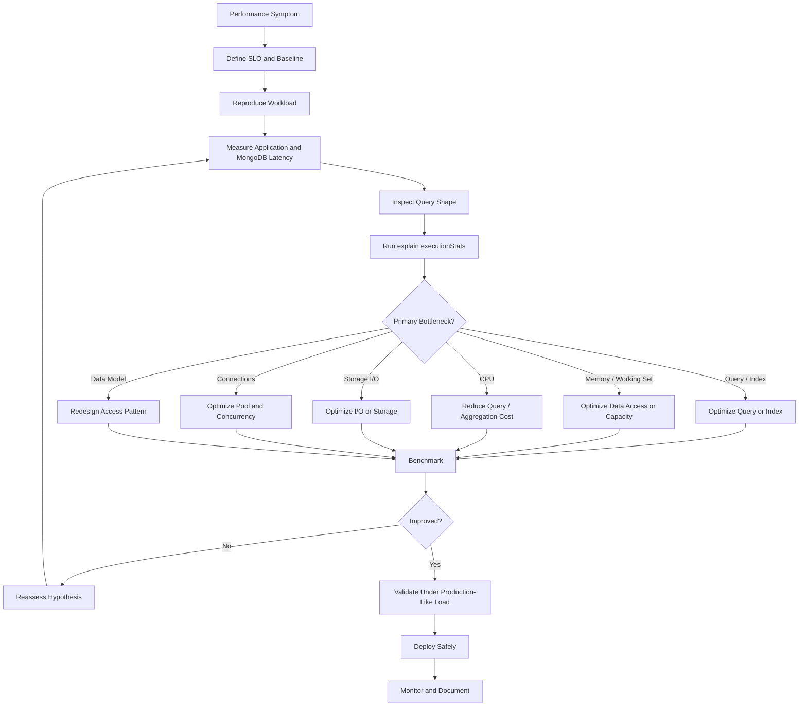
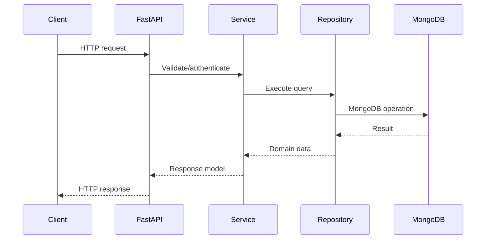

# 12- Performance Optimization Workflow

## Overview

MongoDB performance optimization should be treated as a measurement-driven engineering process rather than a sequence of ad-hoc index additions or infrastructure upgrades.

A slow request can originate from several layers:

```text
Client
  ↓
Nginx / Load Balancer
  ↓
FastAPI / Django / Service
  ↓
Repository / Driver
  ↓
Connection Pool
  ↓
MongoDB Query
  ↓
Query Planner
  ↓
Indexes
  ↓
Working Set / Memory
  ↓
Storage
```

Optimizing MongoDB effectively requires identifying the actual bottleneck before changing the system.

A useful optimization loop is:

```text
Measure
  ↓
Reproduce
  ↓
Isolate
  ↓
Inspect
  ↓
Hypothesize
  ↓
Change
  ↓
Benchmark
  ↓
Validate
  ↓
Monitor
```

The objective is not simply to reduce one query's execution time. Production optimization should improve latency, throughput, resource efficiency, reliability, and scalability without introducing unacceptable complexity or correctness problems.

## Performance Optimization Principles

A senior-level MongoDB optimization process follows several principles.

| Principle | Engineering meaning |
|---|---|
| Measure first | Establish evidence before changing the system |
| Optimize the bottleneck | Do not optimize components that are already healthy |
| Optimize query shape | Fix inefficient access patterns before scaling hardware |
| Design indexes around workload | Index actual production queries |
| Minimize data processed | Filter, project, paginate, and aggregate efficiently |
| Validate with `explain()` | Confirm that the database executes the intended plan |
| Benchmark changes | Compare before and after under representative load |
| Monitor production behavior | Confirm that improvements persist at real traffic |
| Preserve correctness | Never trade data correctness for latency without explicit requirements |
| Optimize incrementally | Make changes that can be measured and rolled back |

## The Optimization Workflow

A practical workflow is:



## Define the Performance Problem

Do not begin with:

> "MongoDB is slow."

Define the exact symptom.

Examples:

```text
GET /orders
p95 = 420 ms
p99 = 1.2 s
MongoDB query p95 = 280 ms
```

or:

```text
Aggregation job:
Current runtime = 18 minutes
Target runtime  = < 5 minutes
```

or:

```text
MongoDB CPU = 85%
Storage latency = normal
Query latency = increasing with traffic
```

A useful performance statement contains:

- Workload
- Query or endpoint
- Traffic volume
- Latency target
- Current latency
- Resource behavior
- Time period
- Recent changes

## Establish a Baseline

Before optimization, record the current state.

| Metric | Example baseline |
|---|---:|
| Requests/sec | 1,500 |
| p50 latency | 42 ms |
| p95 latency | 180 ms |
| p99 latency | 650 ms |
| MongoDB query p95 | 110 ms |
| CPU | 62% |
| Memory | 78% |
| Storage latency | 4 ms |
| Connections | 320 |
| Cache hit behavior | Stable |
| Error rate | 0.2% |

The baseline allows you to determine whether an optimization actually helped.

Without a baseline, statements such as:

> "The new index made it faster."

are difficult to validate objectively.

## Define the SLO

Optimization should be connected to a measurable target.

Example:

```text
Endpoint:
GET /api/orders

Target:
p95 < 150 ms
p99 < 300 ms

Traffic:
2,000 requests/sec

Error rate:
< 0.1%
```

For batch workloads, use throughput or completion-time targets:

```text
10 million records
Target processing time < 10 minutes
```

The optimization target determines what should be measured.

## Separate Application Latency from MongoDB Latency

A request can be slow even when MongoDB is fast.

For example:

```text
HTTP request
   │
   ├── Authentication = 20 ms
   ├── Business logic = 30 ms
   ├── MongoDB query = 15 ms
   ├── Serialization = 40 ms
   └── Network = 25 ms
                 │
                 ▼
             Total = 130 ms
```

MongoDB optimization would not meaningfully improve a serialization bottleneck.

Instrument application code so that MongoDB latency can be isolated.

## Request-Level Performance Analysis

For a FastAPI service:

```text
HTTP request
    ↓
Middleware
    ↓
Authentication
    ↓
Service
    ↓
Repository
    ↓
MongoDB
    ↓
Repository
    ↓
Serialization
    ↓
HTTP response
```

Measure each major stage.

A useful trace might show:

```text
request.total       = 185 ms
service.logic       = 25 ms
mongo.wait_for_pool = 5 ms
mongo.execution     = 110 ms
serialization       = 20 ms
network              = 25 ms
```

This immediately narrows the optimization target.

## Identify the Query Shape

A query shape describes the structural pattern of a query.

For example:

```javascript
db.orders.find({
    tenant_id: "<value>",
    status: "<value>"
}).sort({
    created_at: -1
}).limit(50)
```

The actual values may change:

```text
tenant-1
tenant-2
tenant-3
```

but the structural access pattern remains the same.

Optimization should focus on recurring query shapes rather than one isolated query containing one specific value.

## Query Optimization Decision Tree

```text
Slow query
   ↓
Is the application waiting for a connection?
   ├── Yes → Inspect connection pool
   └── No
        ↓
Is execution time high?
   ├── No → Inspect application/network/serialization
   └── Yes
        ↓
Is COLLSCAN occurring?
   ├── Yes → Evaluate indexes/query
   └── No
        ↓
Are too many keys examined?
   ├── Yes → Improve index selectivity/order
   └── No
        ↓
Are too many documents examined?
   ├── Yes → Improve filtering/index/data model
   └── No
        ↓
Is SORT expensive?
   ├── Yes → Evaluate sort-supporting index
   └── No
        ↓
Is aggregation processing too much data?
   ├── Yes → Filter/project earlier
   └── No
        ↓
Inspect CPU / memory / storage / concurrency
```

## Use `explain()` Before Changing an Index

A common mistake is creating an index immediately after observing a slow query.

First inspect the execution plan.

Example:

```javascript
db.orders.find({
    tenant_id: "tenant-42",
    status: "pending"
}).sort({
    created_at: -1
}).limit(50).explain("executionStats")
```

Important metrics include:

- `nReturned`
- `totalKeysExamined`
- `totalDocsExamined`
- `executionTimeMillis`

Conceptually:

```text
Returned documents       = 50
Index keys examined      = 52
Documents examined       = 50
Execution time           = 8 ms
```

is very different from:

```text
Returned documents       = 50
Index keys examined      = 850,000
Documents examined       = 850,000
Execution time           = 900 ms
```

The second query has substantially more work.

## Interpreting `COLLSCAN`

`COLLSCAN` indicates that MongoDB is scanning collection documents rather than efficiently using an index for the relevant query path.

Example:

```text
COLLSCAN
  ↓
Large collection
  ↓
Many documents examined
  ↓
High CPU / I/O
  ↓
Higher latency
```

A `COLLSCAN` is not automatically wrong.

It can be reasonable when:

- The collection is small.
- The query intentionally reads most documents.
- An index would not improve selectivity.
- A full scan is cheaper for the workload.

The important question is:

> Is the scan appropriate for this query and workload?

## Interpreting `IXSCAN`

`IXSCAN` indicates index scanning.

For example:

```text
IXSCAN
  ↓
Index keys
  ↓
FETCH
  ↓
Documents
```

An `IXSCAN` does not automatically mean the query is efficient.

A query may still scan a large portion of an index.

Always compare:

```text
nReturned
totalKeysExamined
totalDocsExamined
executionTimeMillis
```

## Keys Examined vs Documents Examined

A useful diagnostic ratio is:

```text
keys examined / documents returned
documents examined / documents returned
```

Suppose:

```text
nReturned = 100
totalKeysExamined = 120
totalDocsExamined = 100
```

This is generally efficient.

Compare:

```text
nReturned = 100
totalKeysExamined = 1,000,000
totalDocsExamined = 800,000
```

The query is doing far more work than the result size suggests.

This can indicate:

- Poor index ordering
- Low selectivity
- Missing predicates
- Poor query shape
- Data skew

## Optimize Query Selectivity

Suppose:

```javascript
db.orders.find({
    status: "pending"
})
```

matches 40% of the collection.

Adding a highly selective tenant predicate may significantly reduce the working set:

```javascript
db.orders.find({
    tenant_id: "tenant-42",
    status: "pending"
})
```

This is particularly important in multi-tenant systems.

## Compound Index Optimization

Consider the query:

```javascript
db.orders.find({
    tenant_id: "tenant-42",
    status: "pending"
}).sort({
    created_at: -1
}).limit(50)
```

A candidate index is:

```javascript
db.orders.createIndex({
    tenant_id: 1,
    status: 1,
    created_at: -1
})
```

The index aligns with:

```text
Equality
   ↓
Equality
   ↓
Sort
```

Index selection should be validated against actual query plans rather than applying ESR mechanically.

## ESR as a Guideline

The Equality-Sort-Range guideline is useful when designing compound indexes.

For:

```javascript
db.orders.find({
    tenant_id: "tenant-42",
    status: "pending",
    created_at: {
        $gte: ISODate("2026-09-01T00:00:00Z")
    }
}).sort({
    priority: -1
})
```

the candidate index might require careful evaluation because multiple equality, range, and sort requirements interact.

Do not treat ESR as:

> Equality, then sort, then range, always.

It is a practical index-design heuristic, not a substitute for query-plan validation.

## Covered Query Optimization

A query may avoid fetching documents when the filter and projection can be satisfied by an index.

Example index:

```javascript
db.users.createIndex({
    tenant_id: 1,
    email: 1
})
```

Query:

```javascript
db.users.find(
    { tenant_id: "tenant-42" },
    {
        _id: 0,
        email: 1
    }
).explain("executionStats")
```

A covered query can reduce:

- Document reads
- Storage access
- Memory pressure
- Network transfer

Do not create large indexes solely to force coverage. The index maintenance and memory costs must also be justified.

## Projection Optimization

Avoid returning large documents when only a few fields are required.

Prefer:

```javascript
db.orders.find(
    {
        tenant_id: "tenant-42",
        status: "pending"
    },
    {
        _id: 1,
        order_id: 1,
        status: 1,
        created_at: 1
    }
)
```

over fetching an entire document containing:

```text
Large metadata
Historical events
Embedded payloads
Audit information
Large arrays
```

Projection is particularly important for API endpoints returning many documents.

## Pagination Optimization

Avoid large offsets:

```javascript
db.orders.find({
    tenant_id: "tenant-42"
})
.sort({
    created_at: -1
})
.skip(500000)
.limit(50)
```

For large datasets, prefer cursor-based pagination.

Example:

```javascript
db.orders.find({
    tenant_id: "tenant-42",
    created_at: {
        $lt: ISODate("2026-09-20T10:00:00Z")
    }
})
.sort({
    created_at: -1
})
.limit(50)
```

Use a stable sort key and an appropriate compound index.

For high-throughput APIs, cursor pagination usually scales better than large offsets.

## Optimize Aggregation Pipelines

Aggregation optimization starts with reducing the number of documents entering expensive stages.

Prefer:

```javascript
db.orders.aggregate([
    {
        $match: {
            tenant_id: "tenant-42",
            status: "completed"
        }
    },
    {
        $project: {
            customer_id: 1,
            amount: 1,
            created_at: 1
        }
    },
    {
        $group: {
            _id: "$customer_id",
            total: { $sum: "$amount" }
        }
    },
    {
        $sort: {
            total: -1
        }
    },
    {
        $limit: 20
    }
])
```

over processing the entire collection before filtering.

General rule:

```text
Reduce early
   ↓
Process less data
   ↓
Consume less CPU/memory/I/O
   ↓
Reduce latency
```

## `$match` Early

When possible, filter early.

```javascript
{
    $match: {
        tenant_id: "tenant-42",
        created_at: {
            $gte: ISODate("2026-09-01T00:00:00Z")
        }
    }
}
```

This can reduce the input to subsequent stages.

Early filtering is particularly important before:

- `$group`
- `$sort`
- `$unwind`
- `$lookup`
- `$facet`

## Optimize `$lookup`

A `$lookup` can become a major performance bottleneck.

Before optimizing, inspect:

- Number of local documents
- Foreign collection size
- Foreign indexes
- Join selectivity
- Number of returned joined documents

A common pattern is:

```text
Large local input
       ↓
$lookup
       ↓
Large foreign scan
       ↓
Huge intermediate result
```

A better design is:

```text
Selective $match
       ↓
Small local input
       ↓
Indexed foreign lookup
       ↓
Required fields only
```

If the relationship is accessed constantly, reconsider whether the data model should use controlled denormalization instead.

## Optimize `$sort`

Sorting is expensive when MongoDB must process a large result set without an appropriate index path.

For:

```javascript
db.orders.find({
    tenant_id: "tenant-42"
}).sort({
    created_at: -1
}).limit(50)
```

a supporting index might be:

```javascript
db.orders.createIndex({
    tenant_id: 1,
    created_at: -1
})
```

Validate with `explain()`.

Do not assume every sort requires an index; the appropriate strategy depends on result size and workload.

## Optimize `$group`

Large cardinality groups can consume substantial memory and CPU.

For:

```javascript
{
    $group: {
        _id: "$customer_id",
        total: { $sum: "$amount" }
    }
}
```

consider:

- Filtering before grouping
- Grouping only required fields
- Reducing historical input
- Pre-aggregation for frequently requested metrics
- Batch processing for expensive analytics

For high-frequency API requests, repeatedly computing the same large aggregation may be a data-modeling problem rather than merely a query problem.

## Data Modeling Optimization

Some MongoDB performance problems cannot be fixed effectively with indexes.

Consider:

```json
{
  "_id": "customer-42",
  "orders": [
    "... thousands of orders ..."
  ]
}
```

If the application frequently queries individual orders, embedding all orders may create:

- Large documents
- Large reads
- Large updates
- Hot documents
- Working-set pressure

A separate `orders` collection may be more appropriate.

Performance optimization can therefore require changing the schema.

## Embedding vs Referencing

Use embedding when:

- Data is accessed together.
- Child data is bounded.
- Updates are usually atomic within the parent.
- The combined document remains reasonably sized.

Use references when:

- Child data grows without bound.
- Child entities are independently queried.
- Child data has a different lifecycle.
- Independent updates are frequent.

Performance should be evaluated through access patterns rather than a universal embedding rule.

## Working Set Optimization

If frequently accessed data exceeds available effective memory, investigate:

```text
Working-set growth
       ↓
Index growth
       ↓
Document size
       ↓
Query locality
       ↓
Storage latency
```

Possible optimizations include:

- Remove unnecessary indexes.
- Reduce document size.
- Archive cold data.
- Improve query selectivity.
- Use projection.
- Introduce Redis for genuinely hot application data.
- Increase memory when justified.
- Improve storage performance.
- Revisit data distribution.

Do not immediately assume that the solution is a larger server.

## Connection Pool Optimization

A query can appear slow because the application waits for a MongoDB connection.

Conceptually:

```text
Request
  ↓
Acquire MongoDB connection
  ↓
[Pool exhausted]
  ↓
Wait
  ↓
Execute query
```

Measure separately:

```text
Pool wait time
+
MongoDB execution time
+
Application processing
```

If pool wait is high but query execution is low, optimizing indexes will not solve the primary bottleneck.

## Python Repository Instrumentation

A repository layer should make database timing observable.

Example:

```python
from time import perf_counter
from pymongo.collection import Collection


class OrderRepository:
    def __init__(self, collection: Collection) -> None:
        self.collection = collection

    def find_pending_orders(
        self,
        tenant_id: str,
        limit: int = 50,
    ) -> list[dict]:
        started = perf_counter()

        cursor = (
            self.collection
            .find(
                {
                    "tenant_id": tenant_id,
                    "status": "pending",
                },
                {
                    "_id": 1,
                    "order_id": 1,
                    "status": 1,
                    "created_at": 1,
                },
            )
            .sort("created_at", -1)
            .limit(limit)
        )

        documents = list(cursor)

        elapsed_ms = (perf_counter() - started) * 1000

        # Send elapsed_ms to application metrics/logging.
        return documents
```

In production, prefer structured metrics and tracing over logging every successful query.

## Avoid Logging Sensitive Query Data

Performance debugging should not expose:

- Passwords
- Access tokens
- Personal data
- Payment information
- Secrets
- Entire production documents

Prefer logging query metadata:

```text
query_shape = orders_by_tenant_status
duration_ms = 42
returned = 50
```

rather than:

```text
filter = {
    email: "customer@example.com",
    token: "..."
}
```

## Query Comments

Where supported by the driver and MongoDB deployment, query comments can help correlate database operations with application operations.

Example:

```python
cursor = collection.find(
    {
        "tenant_id": tenant_id,
        "status": "pending",
    },
    comment="orders.pending.list",
)
```

This can improve observability by associating database activity with a logical application operation.

Use stable operation identifiers rather than high-cardinality values.

## Performance Regression Testing

Optimization is incomplete without regression testing.

A useful test process is:

```text
Baseline
   ↓
Run representative workload
   ↓
Record latency/resource metrics
   ↓
Apply change
   ↓
Run identical workload
   ↓
Compare
   ↓
Accept / reject
```

Compare more than average latency.

Use:

- p50
- p95
- p99
- Throughput
- CPU
- Memory
- Storage I/O
- Network
- Error rate

## Benchmark Design

A benchmark should resemble production.

Include:

- Realistic document sizes
- Representative cardinality
- Realistic indexes
- Production-like query distributions
- Concurrent clients
- Read/write ratios
- Tenant distribution
- Data volume

Avoid benchmarking:

```text
1,000 documents
```

and extrapolating directly to:

```text
500 million documents
```

MongoDB behavior can change substantially with scale and data distribution.

## Warm vs Cold Cache

Performance testing should distinguish:

### Warm Cache

Frequently accessed data is already cached.

```text
Benchmark
→ repeated workload
→ cache remains warm
```

### Cold Cache

Cache state is not representative of steady-state workload.

```text
Restart
→ benchmark immediately
→ storage reads dominate
```

Both can matter.

For API SLOs, warm-cache behavior may represent normal operation, while cold-cache testing is useful for restart, failover, and recovery scenarios.

## Load Testing

For a backend service:

```text
Load generator
      ↓
Nginx / Load Balancer
      ↓
FastAPI / Django
      ↓
MongoDB
```

Measure:

```text
Requests/sec
p50
p95
p99
Error rate
MongoDB query latency
CPU
Memory
Storage I/O
Connections
```

Increase concurrency gradually.

Do not jump immediately to extreme load because the resulting failure can obscure the actual bottleneck.

## Before-and-After Optimization Example

### Before

Query:

```javascript
db.orders.find({
    status: "pending"
}).sort({
    created_at: -1
}).skip(100000).limit(50)
```

Observed:

```text
nReturned          = 50
totalDocsExamined  = 1,200,000
executionTime      = 780 ms
```

### Investigation

Problems:

- Low-selectivity filter
- Large offset
- Potentially inefficient sort path
- Large number of documents examined

### Optimization

Change the API to use:

```text
tenant_id
+
cursor-based pagination
```

Candidate index:

```javascript
db.orders.createIndex({
    tenant_id: 1,
    status: 1,
    created_at: -1
})
```

Query:

```javascript
db.orders.find({
    tenant_id: "tenant-42",
    status: "pending",
    created_at: {
        $lt: ISODate("2026-09-20T10:00:00Z")
    }
})
.sort({
    created_at: -1
})
.limit(50)
```

### After

Example result:

```text
nReturned          = 50
totalDocsExamined  = 50
executionTime      = 8 ms
```

The important engineering lesson is not the specific `8 ms` result. It is the optimization chain:

```text
Access pattern
    ↓
Query shape
    ↓
Pagination strategy
    ↓
Index design
    ↓
Execution-plan validation
    ↓
Benchmark
```

## Optimize Write Performance

Write optimization should consider:

- Number of indexes
- Document size
- Update frequency
- Write concern
- Batch size
- Storage latency
- Replication
- Transaction usage

For multiple independent writes, bulk operations can reduce application-to-database round trips.

Example:

```python
from pymongo import InsertOne, UpdateOne

operations = [
    InsertOne(
        {
            "order_id": "ORD-1001",
            "status": "pending",
        }
    ),
    UpdateOne(
        {"order_id": "ORD-1002"},
        {"$set": {"status": "completed"}},
    ),
]

result = collection.bulk_write(
    operations,
    ordered=False,
)
```

`ordered=False` can allow independent operations to proceed without preserving input order, but application correctness must permit that behavior.

## Write Concern and Performance

Write concern affects durability and latency.

For example, stronger acknowledgment requirements can increase write latency because the client may wait for replication or other confirmation.

Do not optimize by weakening write concern unless the application's durability requirements explicitly allow it.

The correct question is:

> What durability guarantee does this workload require?

not:

> Which write concern is fastest?

## Transaction Performance

Transactions introduce coordination overhead.

Use transactions when multiple operations genuinely require atomic multi-document semantics.

Avoid wrapping unrelated independent writes in one large transaction.

A long transaction can:

- Increase resource usage
- Increase contention
- Increase latency
- Complicate failure handling
- Increase operational risk

Prefer single-document atomic operations when they satisfy the business invariant.

## Read Concern and Read Preference

Consistency settings can affect latency and workload distribution.

Before changing them, establish:

- Required consistency
- Acceptable staleness
- Failover behavior
- Read distribution requirements

A performance optimization that changes consistency semantics is a behavioral change, not merely a performance tuning change.

## Sharding Optimization

For sharded deployments, inspect:

- Shard-key distribution
- Query targeting
- Scatter-gather frequency
- Hot shards
- Data distribution
- Chunk/balancing behavior
- Per-shard resource utilization

A query that targets one shard:

```text
mongos
  ↓
Shard B
```

is generally very different from:

```text
mongos
  ├── Shard A
  ├── Shard B
  ├── Shard C
  └── Shard D
       ↓
   Merge results
```

Avoid treating sharding as a replacement for query optimization.

## Performance Optimization in FastAPI

A typical architecture is:



Measure latency at each boundary.

Common FastAPI-side performance problems include:

- Creating `MongoClient` per request
- Blocking the event loop with inappropriate synchronous workloads
- Excessive serialization
- N+1 database queries
- Fetching unnecessary fields
- Inefficient pagination
- Poor connection-pool configuration

## Performance Optimization in Django

For Django services using MongoDB through a supported integration or a direct repository layer, avoid assuming relational ORM optimization techniques map directly to MongoDB.

Separate concerns:

```text
Django view
    ↓
Service layer
    ↓
Repository
    ↓
MongoDB
```

This makes query patterns easier to inspect and optimize.

Avoid hiding expensive database operations behind abstractions that make query behavior difficult to observe.

## N+1 Query Detection

A common application-level problem is:

```text
1 request
  ↓
1 query for orders
  ↓
N queries for customers
```

For:

```text
100 orders
```

this can become:

```text
101 database operations
```

The solution may involve:

- Better data modeling
- Controlled embedding
- Batch queries
- `$lookup`
- Application-side batching
- Precomputed views

Do not automatically replace every N+1 problem with `$lookup`; evaluate the resulting workload.

## Redis as a Performance Layer

Redis can be useful for high-frequency, relatively stable reads.

Example:

```text
API
 ↓
Redis
 ├── HIT → response
 │
 └── MISS
      ↓
   MongoDB
      ↓
   Redis
```

Evaluate:

- Cache hit rate
- Data staleness
- Invalidation complexity
- Memory cost
- Failure behavior

Caching should target measured hot paths.

## Background Workloads

Celery, Kafka consumers, scheduled jobs, and ETL workloads can compete with API traffic.

Example:

```text
                    MongoDB
                       ▲
          ┌────────────┼────────────┐
          │            │            │
       FastAPI      Celery       Kafka
        reads        jobs       consumers
```

A batch aggregation consuming large amounts of CPU or storage I/O can increase API latency.

Mitigation strategies include:

- Scheduling heavy jobs appropriately
- Limiting concurrency
- Query optimization
- Workload isolation
- Separate clusters where justified
- Read replicas where appropriate

## Monitoring After Deployment

Optimization does not end when the code or index is deployed.

Monitor:

```text
Before deployment
      ↓
Deploy
      ↓
Observe
      ↓
Compare baseline
      ↓
Check p95/p99
      ↓
Check MongoDB metrics
      ↓
Check errors
      ↓
Confirm sustained improvement
```

Watch for regressions several hours or days later because traffic distribution and cache state can change.

## Query Performance Monitoring

Track query-level metrics where available:

- Execution duration
- Query frequency
- Returned document count
- Examined documents
- Examined keys
- Query shape
- Error rate

A query that takes:

```text
500 ms × 2 requests/day
```

is operationally different from:

```text
50 ms × 10,000 requests/sec
```

Optimization priority should account for both latency and workload volume.

## Cost Optimization

Performance and cost are connected.

An inefficient query can force:

```text
More CPU
+
More storage I/O
+
More replicas
+
Larger instances
+
Higher cloud cost
```

Before increasing infrastructure:

1. Validate the query.
2. Validate indexes.
3. Validate data access patterns.
4. Measure working-set behavior.
5. Measure storage requirements.
6. Then evaluate infrastructure scaling.

A query optimization that reduces CPU by 50% may be more valuable than doubling instance capacity.

## Horizontal vs Vertical Scaling

### Vertical Scaling

Increase:

```text
CPU
RAM
Storage performance
```

Useful when:

- The workload fits a larger node.
- The bottleneck is resource capacity.
- Operational simplicity is important.

### Horizontal Scaling

Use:

```text
Replica sets
Read distribution
Sharding
```

Useful when:

- Workload exceeds a single node's practical capacity.
- Read scaling is required.
- Dataset or write workload requires distribution.

Neither should be used to hide fundamentally inefficient query patterns.

## Safe Index Deployment

Before adding an index:

1. Identify the query shape.
2. Estimate query frequency.
3. Inspect existing indexes.
4. Design the candidate index.
5. Test against representative data.
6. Measure query performance.
7. Measure write impact.
8. Measure index size.
9. Deploy safely.
10. Monitor production behavior.

Index creation itself can have operational implications, particularly for large collections.

## Index Lifecycle

Indexes should be periodically reviewed.

Ask:

```text
Why does this index exist?
Which query uses it?
How frequently is that query executed?
What is the index size?
What write cost does it introduce?
Can another index satisfy the same workload?
```

An index that once supported a removed feature may now be pure overhead.

## Common Mistakes

### Adding an Index Without `explain()`

**Problem:** The index may not improve the actual query shape.

**Fix:** Inspect the execution plan before and after.

### Optimizing Average Latency Only

**Problem:** p50 can look healthy while p99 is unacceptable.

**Fix:** Track p50, p95, and p99.

### Increasing RAM Before Inspecting Queries

**Problem:** Poor queries continue to consume excessive resources.

**Fix:** Diagnose query and index behavior first.

### Treating `IXSCAN` as Automatically Fast

**Problem:** An index scan can still examine millions of keys.

**Fix:** Compare `totalKeysExamined` with `nReturned`.

### Using `skip()` for Deep Pagination

**Problem:** Large offsets increase work.

**Fix:** Use cursor-based pagination.

### Fetching Entire Documents

**Problem:** Large documents increase I/O and network costs.

**Fix:** Use projection.

### Ignoring Aggregation Intermediate Results

**Problem:** `$group`, `$sort`, `$unwind`, `$lookup`, and `$facet` can process large datasets.

**Fix:** Reduce input early and inspect the pipeline.

### Creating Too Many Indexes

**Problem:** Indexes increase storage and write costs.

**Fix:** Maintain indexes based on actual query patterns.

### Benchmarking Unrealistic Data

**Problem:** Small datasets do not represent production behavior.

**Fix:** Use production-like cardinality, distribution, document size, and concurrency.

### Changing Consistency for Speed

**Problem:** Lowering read/write guarantees may violate application requirements.

**Fix:** Treat consistency changes as architectural decisions.

## Production Pitfalls

| Pitfall | Why it happens | Prevention |
|---|---|---|
| Random index creation | Developers react to slow queries | Use `explain()` and query-shape analysis |
| RAM-first optimization | Infrastructure scaling is easy | Diagnose query/resource bottleneck first |
| p50-only monitoring | Average behavior looks healthy | Monitor p95/p99 |
| Query optimization in isolation | Application overhead is ignored | Trace full request lifecycle |
| Benchmark on tiny data | Test setup is convenient | Use production-like datasets |
| Ignoring write overhead | Only read latency is measured | Measure write throughput and index cost |
| Large aggregation in request path | Easy to implement | Precompute or optimize expensive analytics |
| Ignoring cold cache | Warm benchmarks are easier | Test restart/failover scenarios |
| Ignoring workload skew | Average traffic hides hotspots | Measure tenant and key distribution |
| Permanent diagnostic logging | Useful during debugging | Use sampling and structured metrics |

## Troubleshooting Methodology

### Slow API Endpoint

```text
Symptom
↓
API p95/p99 latency increased
↓
Possible causes
↓
MongoDB query / connection pool / application logic / serialization / network
↓
Isolation strategy
↓
Trace request and isolate MongoDB duration
↓
Diagnostic commands
↓
explain("executionStats"), server metrics, pool metrics
↓
Root cause
↓
Identify actual bottleneck
↓
Corrective action
↓
Optimize query, index, pool, application, or infrastructure
↓
Prevention
↓
Add latency metrics, query monitoring, and regression tests
```

### High MongoDB CPU

```text
Symptom
↓
MongoDB CPU is consistently high
↓
Possible causes
↓
COLLSCAN / inefficient indexes / aggregation / high concurrency / excessive writes
↓
Isolation strategy
↓
Identify top CPU-consuming operations
↓
Diagnostic commands
↓
explain(), profiler/monitoring data, serverStatus()
↓
Root cause
↓
Determine dominant workload
↓
Corrective action
↓
Optimize query/index/data model or scale resources
↓
Prevention
↓
Query monitoring + capacity planning
```

### High Storage I/O

```text
Symptom
↓
Storage latency or IOPS is high
↓
Possible causes
↓
Working-set pressure / large documents / scans / heavy writes / large indexes
↓
Isolation strategy
↓
Correlate MongoDB operations with storage metrics
↓
Diagnostic commands
↓
db.stats(), collection.stats(), explain(), server metrics
↓
Root cause
↓
Identify read or write I/O source
↓
Corrective action
↓
Reduce data processed, improve indexes, archive data, or improve storage
↓
Prevention
↓
Storage monitoring + working-set capacity planning
```

### Connection Pool Saturation

```text
Symptom
↓
Application requests wait for MongoDB connections
↓
Possible causes
↓
Small pool / excessive concurrency / slow queries / leaked resources
↓
Isolation strategy
↓
Measure pool wait separately from query execution
↓
Diagnostic commands
↓
Driver metrics + MongoDB connection metrics + traces
↓
Root cause
↓
Determine whether pool or query capacity is limiting throughput
↓
Corrective action
↓
Optimize query, concurrency, or pool configuration
↓
Prevention
↓
Load testing + pool monitoring
```

## Operational Checklist

Before declaring a MongoDB performance issue resolved, verify:

### Query

- Query shape identified
- Query execution measured
- `explain("executionStats")` inspected
- `COLLSCAN` evaluated
- Keys examined evaluated
- Documents examined evaluated
- Sorting behavior evaluated
- Pagination strategy evaluated

### Index

- Existing indexes reviewed
- Candidate index justified
- Index selectivity evaluated
- Index size measured
- Write overhead considered
- Production query patterns validated

### Data Model

- Document size evaluated
- Array growth evaluated
- Hot documents identified
- Access patterns reviewed
- Historical data lifecycle considered

### Infrastructure

- CPU checked
- Memory checked
- Working-set behavior checked
- Storage latency checked
- IOPS checked
- Network checked
- Connection pool checked

### Application

- End-to-end latency measured
- N+1 operations checked
- Projection reviewed
- Serialization cost measured
- Cache behavior evaluated
- Background workloads considered

### Validation

- Baseline captured
- Representative benchmark executed
- Before/after metrics compared
- Production rollout monitored
- Rollback strategy available

## Senior-Level Optimization Strategy

A mature MongoDB optimization process follows this priority:

```text
1. Correctness
      ↓
2. Measure the real bottleneck
      ↓
3. Fix query/data-access design
      ↓
4. Fix indexing
      ↓
5. Fix data modeling
      ↓
6. Reduce unnecessary data processing
      ↓
7. Optimize connection/concurrency behavior
      ↓
8. Add application caching where justified
      ↓
9. Optimize infrastructure
      ↓
10. Scale horizontally when required
```

The exact order can change depending on the bottleneck, but the principle remains:

> Do not scale an inefficient workload before understanding why it is inefficient.

## Key Takeaways

- **MongoDB performance optimization should follow a measurable loop: baseline, reproduce, isolate, inspect, change, benchmark, validate, and monitor.**
- **Use query shapes and `explain("executionStats")` to identify excessive document scans, index scans, sorting, and other database work before changing indexes or infrastructure.**
- **Optimize the full access path: data model, query, indexes, working set, aggregation, connection pool, application code, and storage can all influence endpoint latency.**
- **Validate optimizations with production-like data volume, cardinality, concurrency, cache state, and read/write distribution rather than relying on small synthetic benchmarks.**
- **Treat performance as a production lifecycle concern: monitor p95/p99 latency, resource utilization, query behavior, index growth, and workload changes after every significant optimization.**