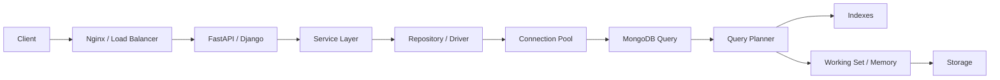

# README

## Overview

The MongoDB Performance section focuses on diagnosing, measuring, and improving database performance in production backend systems.

The material progresses from performance fundamentals through query analysis, index design, execution plans, read/write optimization, connection pooling, working-set behavior, and systematic performance optimization.

The emphasis is on **workload-driven optimization** rather than isolated MongoDB commands. Each topic connects database behavior with application latency, resource utilization, scalability, and production operations.

## Navigation

| # | File | Description |
|---|---|---|
| 01 | [01- MongoDB Performance Fundamentals](./01-%20MongoDB%20Performance%20Fundamentals.md) | MongoDB performance model, bottlenecks, workload characteristics, and core optimization principles |
| 02 | [02- Query Performance](./02-%20Query%20Performance.md) | Query execution, selectivity, query shapes, indexes, pagination, aggregation, and slow-query diagnosis |
| 03 | [03- Indexing Strategies](./03-%20Indexing%20Strategies.md) | Index strategy design, index types, selection, maintenance, and production trade-offs |
| 04 | [04- Compound Indexes](./04-%20Compound%20Indexes.md) | Compound index design, field ordering, sorting, filtering, and production trade-offs |
| 05 | [05- Index Selection and ESR Rule](./05-%20Index%20Selection%20and%20ESR%20Rule.md) | Query-driven index design, Equality-Sort-Range guideline, selectivity, and index validation |
| 06 | [06- Explain Plans](./06-%20Explain%20Plans.md) | Query planner behavior, execution stages, execution statistics, and performance diagnosis |
| 07 | [07- Aggregation Performance](./07-%20Aggregation%20Performance.md) | Aggregation pipeline performance, stage optimization, memory, and index usage |
| 08 | [08- Write Performance](./08-%20Write%20Performance.md) | Insert/update workloads, write amplification, indexes, bulk operations, and write scaling |
| 09 | [09- Read Performance](./09-%20Read%20Performance.md) | Read optimization, projection, pagination, caching, query locality, and read-heavy workloads |
| 10 | [10- Connection Pool Performance](./10-%20Connection%20Pool%20Performance.md) | Connection lifecycle, pool sizing, concurrency, timeouts, and pool saturation |
| 11 | [11- Working Set and Memory](./11-%20Working%20Set%20and%20Memory.md) | Working-set behavior, memory pressure, WiredTiger cache, indexes, storage I/O, and capacity planning |
| 12 | [12- Performance Optimization Workflow](./12-%20Performance%20Optimization%20Workflow.md) | End-to-end performance investigation, measurement, optimization, benchmarking, and production validation |

## Performance Engineering Model

MongoDB performance should be analyzed as a complete request path rather than as an isolated database operation.



A performance issue can originate at any layer:

- Application processing
- Serialization
- Connection-pool contention
- Query design
- Index selection
- Aggregation
- Working-set pressure
- CPU saturation
- Storage latency
- Network overhead
- Data-model design
- Workload distribution

The correct optimization depends on identifying the actual bottleneck.

## Recommended Learning Path

### Performance Fundamentals

Start with:

1. MongoDB Performance Fundamentals
2. Query Performance
3. Compound Indexes
4. Index Selection and ESR Rule
5. Explain Plans

These establish the core mental model required to reason about MongoDB performance.

### Query and Access-Pattern Optimization

Continue with:

1. Read Performance
2. Write Performance
3. Working Set and Memory
4. Connection Pool Performance

These topics connect query behavior with application workloads and infrastructure resources.

### Production Optimization

Finish with:

1. Performance Monitoring
2. Performance Optimization Workflow

These topics bring the individual techniques together into a repeatable production engineering process.

## Core Performance Concepts

| Concept | Primary question |
|---|---|
| Query shape | What access pattern is the application actually using? |
| Selectivity | How effectively does the query reduce the search space? |
| Index | Can MongoDB locate the required data efficiently? |
| Query planner | Which execution strategy did MongoDB choose? |
| `explain()` | How much work did the query actually perform? |
| Working set | Which data and indexes are frequently accessed? |
| Connection pool | Is the application waiting for a database connection? |
| Aggregation | How much data is processed through the pipeline? |
| Read performance | How efficiently can frequently requested data be retrieved? |
| Write performance | What is the cost of inserts, updates, indexes, and durability? |
| Monitoring | How does performance behave under production traffic? |
| Optimization workflow | How do we systematically identify and fix bottlenecks? |

## Performance Investigation Flow

A senior engineer should generally follow this sequence:

```text
Performance symptom
        ↓
Define SLO / target
        ↓
Capture baseline
        ↓
Measure end-to-end latency
        ↓
Separate application latency from MongoDB latency
        ↓
Identify query shape
        ↓
Inspect execution plan
        ↓
Analyze indexes
        ↓
Analyze working set and memory
        ↓
Analyze CPU / storage / connections
        ↓
Form optimization hypothesis
        ↓
Make one controlled change
        ↓
Benchmark
        ↓
Validate production behavior
        ↓
Monitor for regression
```

Avoid making multiple unrelated changes simultaneously because it becomes difficult to determine which change produced the result.

## Key Performance Metrics

Important metrics include:

| Category | Metrics |
|---|---|
| Application | p50, p95, p99 latency, throughput, error rate |
| Query | Execution time, `nReturned`, `totalKeysExamined`, `totalDocsExamined` |
| CPU | MongoDB CPU utilization, query CPU cost |
| Memory | Working-set behavior, cache pressure, resident memory |
| Storage | IOPS, throughput, latency |
| Connections | Active connections, pool wait, pool utilization |
| Replication | Replication lag, member health |
| Indexes | Index size, usage, maintenance cost |
| Aggregation | Input documents, intermediate result size, execution time |

Average latency alone is insufficient for production performance analysis.

## Core Optimization Principles

### Optimize the Workload Before the Infrastructure

Before increasing instance size:

- Inspect the query.
- Inspect indexes.
- Inspect the data model.
- Inspect document size.
- Inspect pagination.
- Inspect aggregation.
- Inspect connection behavior.

Infrastructure scaling should follow measurement.

### Optimize Access Patterns

MongoDB performance is strongly influenced by how the application accesses data.

Examples include:

- Query-driven schema design
- Selective filters
- Cursor pagination
- Projection
- Appropriate compound indexes
- Bounded documents
- Controlled denormalization

### Minimize Unnecessary Work

The most useful optimization is often eliminating work entirely.

```text
Less data scanned
       ↓
Less CPU
       ↓
Less memory pressure
       ↓
Less storage I/O
       ↓
Lower latency
```

## Production Considerations

Performance optimization should preserve:

- Data correctness
- Required consistency guarantees
- Durability requirements
- High availability
- Security
- Observability
- Disaster recovery behavior

A faster query is not necessarily a successful optimization if it introduces stale data, weakens durability, increases failure risk, or creates an operational dependency that the system cannot reliably support.

## Common Performance Mistakes

| Mistake | Better approach |
|---|---|
| Adding indexes reactively | Analyze query shape and `explain()` first |
| Assuming `IXSCAN` means fast | Compare keys examined with documents returned |
| Optimizing average latency | Track p95 and p99 |
| Increasing RAM immediately | Identify the actual bottleneck |
| Using large `skip()` values | Prefer cursor pagination |
| Returning entire documents | Use projection |
| Ignoring index size | Include indexes in working-set analysis |
| Ignoring aggregation cost | Analyze intermediate data volume |
| Benchmarking tiny datasets | Use production-like data distributions |
| Creating many indexes | Keep indexes tied to real workloads |
| Ignoring connection-pool waits | Separate pool wait from query execution |
| Optimizing only MongoDB | Trace the complete application request |

## Production Optimization Checklist

Before shipping a significant MongoDB performance change:

- [ ] Performance problem is clearly defined.
- [ ] Baseline metrics are captured.
- [ ] Query shape is identified.
- [ ] `explain("executionStats")` has been reviewed where applicable.
- [ ] Existing indexes have been evaluated.
- [ ] Data-model implications have been considered.
- [ ] Working-set and memory behavior has been evaluated.
- [ ] CPU and storage behavior has been checked.
- [ ] Connection-pool behavior has been checked.
- [ ] Read/write workload impact has been considered.
- [ ] Representative load testing has been performed.
- [ ] p95 and p99 latency have been compared.
- [ ] Error rate has been checked.
- [ ] Rollback or removal strategy exists.
- [ ] Production monitoring is ready.

## Key Takeaways

- **MongoDB performance is a workload and access-pattern problem, not simply an infrastructure-sizing problem.**
- **Use query shapes, indexes, `explain()`, working-set behavior, and resource metrics together to identify the real bottleneck.**
- **The performance topics in this section should be studied as a progression from fundamentals and query analysis to resource behavior and systematic optimization.**
- **Production optimization requires measurement before and after every significant change, with particular attention to p95/p99 latency, throughput, resource utilization, and correctness.**
- **The goal is predictable, scalable, and operationally safe performance rather than simply making an individual query faster.**