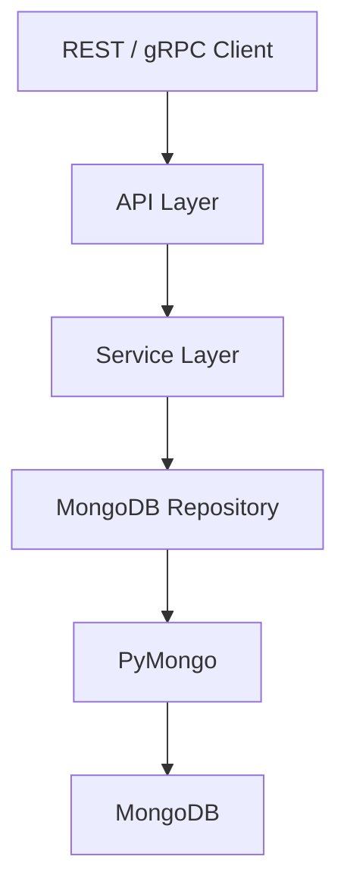

# 02- CRUD and Query Questions

## Overview

MongoDB CRUD and query questions are common in backend interviews because they reveal whether an engineer understands more than basic syntax.

A strong answer should connect:

```text
Query requirement
    ↓
Filter design
    ↓
Projection / sorting
    ↓
Index selection
    ↓
Execution plan
    ↓
Pagination / result handling
    ↓
Consistency and concurrency
    ↓
Production behavior
```

The questions below progress from basic CRUD operations to query planning, pagination, bulk operations, concurrency, and production optimization.

---

## CRUD Fundamentals

### What does CRUD mean in MongoDB?

CRUD represents:

| Operation | MongoDB operations |
|---|---|
| Create | `insertOne()`, `insertMany()` |
| Read | `find()`, `findOne()` |
| Update | `updateOne()`, `updateMany()`, `replaceOne()` |
| Delete | `deleteOne()`, `deleteMany()` |

The important distinction is that MongoDB operations act on **documents**, not relational rows.

---

### How do you insert a document?

Using `mongosh`:

```javascript
db.users.insertOne({
  name: "Alice",
  email: "alice@example.com",
  status: "active"
})
```

Python:

```python
result = collection.insert_one({
    "name": "Alice",
    "email": "alice@example.com",
    "status": "active",
})

print(result.inserted_id)
```

MongoDB automatically generates an `_id` if one is not supplied.

A production application may instead generate identifiers explicitly when integration with other systems requires stable IDs such as UUIDs.

---

### What is the difference between `insertOne()` and `insertMany()`?

`insertOne()` writes one document:

```javascript
db.users.insertOne({
  name: "Alice"
})
```

`insertMany()` writes multiple documents:

```javascript
db.users.insertMany([
  {name: "Alice"},
  {name: "Bob"},
  {name: "Charlie"}
])
```

`insertMany()` is useful for:

- Batch imports.
- ETL pipelines.
- Data migrations.
- Bulk ingestion.

For mixed operations, use `bulkWrite()`.

---

### What happens if two documents have the same `_id`?

MongoDB requires `_id` values to be unique within a collection.

Attempting to insert a duplicate `_id` produces a duplicate-key error.

```javascript
db.users.insertOne({
  _id: "user-001",
  name: "Alice"
})
```

A second document with the same `_id` will fail.

The `_id` uniqueness constraint is backed by the default `_id` index.

---

## Find and Read Operations

### How do you find all documents?

```javascript
db.users.find({})
```

The empty filter matches all documents.

In Python:

```python
cursor = collection.find({})

for document in cursor:
    process(document)
```

Avoid converting very large result sets directly into a list:

```python
documents = list(collection.find({}))
```

because this can consume significant application memory.

---

### What is the difference between `find()` and `findOne()`?

`find()` returns a cursor representing potentially multiple documents.

```python
cursor = collection.find({"status": "active"})
```

`find_one()` returns one matching document or `None`.

```python
document = collection.find_one({
    "email": "alice@example.com"
})
```

Use `find_one()` when the application expects a single logical result.

---

### Does `find_one()` guarantee which document is returned?

Not unless the query uniquely identifies a document or an explicit sort is provided.

If multiple documents match:

```python
collection.find_one({"status": "active"})
```

you should not build business logic around an assumed ordering.

If a particular document must be selected according to ordering, use a sort.

```python
collection.find_one(
    {"status": "active"},
    sort=[("created_at", -1)],
)
```

---

### How do you filter documents?

```javascript
db.users.find({
  status: "active",
  age: {$gte: 18}
})
```

This means:

```text
status == "active"
AND
age >= 18
```

MongoDB supports implicit AND semantics for multiple fields in the same filter document.

---

## Comparison Operators

### What are the most common comparison operators?

| Operator | Meaning |
|---|---|
| `$eq` | Equal |
| `$ne` | Not equal |
| `$gt` | Greater than |
| `$gte` | Greater than or equal |
| `$lt` | Less than |
| `$lte` | Less than or equal |
| `$in` | Matches any value in an array |
| `$nin` | Does not match values in an array |

Example:

```javascript
db.orders.find({
  total: {$gte: 1000},
  status: {$in: ["pending", "processing"]}
})
```

---

### What is `$in` used for?

`$in` matches a field against multiple possible values.

```javascript
db.users.find({
  role: {
    $in: ["admin", "manager"]
  }
})
```

This is useful when the application has a finite set of acceptable values.

For large dynamic lists, consider the size of the query and whether the associated index remains effective.

---

### What is the difference between `$in` and `$or`?

These are often equivalent for simple equality checks:

```javascript
{
  status: {
    $in: ["pending", "processing"]
  }
}
```

versus:

```javascript
{
  $or: [
    {status: "pending"},
    {status: "processing"}
  ]
}
```

`$in` is generally clearer when testing one field against multiple values.

`$or` is useful when the conditions involve different fields or different query structures.

---

## Logical Operators

### How does `$and` work?

```javascript
db.orders.find({
  $and: [
    {status: "completed"},
    {total: {$gte: 1000}}
  ]
})
```

In many cases, MongoDB's implicit AND is simpler:

```javascript
db.orders.find({
  status: "completed",
  total: {$gte: 1000}
})
```

Use explicit `$and` when necessary to express conditions that cannot be represented cleanly as a single field mapping.

---

### How does `$or` work?

```javascript
db.users.find({
  $or: [
    {role: "admin"},
    {permissions: "billing"}
  ]
})
```

This matches documents satisfying at least one condition.

Index design for `$or` queries should be validated with `explain()` because different branches can produce different execution strategies.

---

### What is `$nor`?

`$nor` matches documents that fail all supplied conditions.

```javascript
db.users.find({
  $nor: [
    {status: "inactive"},
    {role: "guest"}
  ]
})
```

It is less commonly used than `$and` and `$or`.

---

## Element Operators

### What does `$exists` do?

It checks whether a field exists.

```javascript
db.users.find({
  phone: {$exists: true}
})
```

This is different from checking whether the value is non-null.

A field can exist with a `null` value.

---

### What does `$type` do?

`$type` filters based on BSON type.

```javascript
db.products.find({
  price: {
    $type: "decimal"
  }
})
```

This can be useful when dealing with legacy collections where documents have inconsistent field types.

In a well-controlled production schema, inconsistent types should generally be prevented rather than repeatedly handled through queries.

---

## Array Queries

### How do you query an array field?

Given:

```json
{
  "name": "MongoDB Course",
  "tags": ["mongodb", "python", "backend"]
}
```

You can query:

```javascript
db.courses.find({
  tags: "mongodb"
})
```

MongoDB matches the array if it contains the specified value.

---

### What is `$all`?

`$all` requires an array to contain all specified values.

```javascript
db.courses.find({
  tags: {
    $all: ["mongodb", "python"]
  }
})
```

---

### What is `$elemMatch`?

`$elemMatch` is useful when multiple conditions must apply to the **same array element**.

Example:

```json
{
  "items": [
    {
      "product": "laptop",
      "price": 80000
    },
    {
      "product": "phone",
      "price": 50000
    }
  ]
}
```

Query:

```javascript
db.orders.find({
  items: {
    $elemMatch: {
      product: "laptop",
      price: {$gte: 70000}
    }
  }
})
```

The conditions apply to the same element.

This is an important interview distinction.

---

## Nested Documents

### How do you query an embedded document?

Given:

```json
{
  "name": "Alice",
  "address": {
    "city": "Kolkata",
    "country": "India"
  }
}
```

Use dot notation:

```javascript
db.users.find({
  "address.city": "Kolkata"
})
```

Nested fields can also be indexed:

```javascript
db.users.createIndex({
  "address.city": 1
})
```

---

### What is the difference between querying an embedded document and using dot notation?

Consider:

```json
{
  "profile": {
    "city": "Kolkata",
    "country": "India"
  }
}
```

An exact embedded-document comparison:

```javascript
{
  profile: {
    city: "Kolkata",
    country: "India"
  }
}
```

is different from:

```javascript
{
  "profile.city": "Kolkata"
}
```

The latter specifically targets the nested field and is generally more flexible.

---

## Projection

### What is projection?

Projection controls which fields are returned.

```javascript
db.users.find(
  {status: "active"},
  {
    name: 1,
    email: 1
  }
)
```

Projection can reduce:

- Network traffic.
- BSON decoding.
- Application memory usage.
- Serialization overhead.

It does not replace proper indexing.

---

### Can you mix inclusion and exclusion projection?

Generally, MongoDB projection uses either inclusion or exclusion semantics, with `_id` being a special exception.

Valid:

```javascript
{
  name: 1,
  email: 1,
  _id: 0
}
```

Valid exclusion:

```javascript
{
  password: 0,
  internal_notes: 0
}
```

Avoid mixing unrelated inclusion and exclusion fields.

---

## Sorting

### How do you sort query results?

Ascending:

```javascript
db.orders.find({})
  .sort({created_at: 1})
```

Descending:

```javascript
db.orders.find({})
  .sort({created_at: -1})
```

Python:

```python
cursor = (
    collection
    .find({"status": "completed"})
    .sort("created_at", -1)
)
```

Sorting can become expensive if MongoDB cannot use an appropriate index.

---

### How do indexes interact with sorting?

Suppose the query is:

```javascript
db.orders.find({
  customer_id: "customer-001"
}).sort({
  created_at: -1
})
```

A suitable compound index may be:

```javascript
db.orders.createIndex({
  customer_id: 1,
  created_at: -1
})
```

The index can support both filtering and ordering.

Without an appropriate index, MongoDB may require an explicit sort stage.

---

## Limit and Skip

### What does `limit()` do?

It restricts the number of returned documents.

```javascript
db.orders.find({
  status: "pending"
}).limit(50)
```

It is useful for:

- APIs.
- Dashboards.
- Worker batches.
- Administrative queries.

Never expose unbounded database reads through an API.

---

### What does `skip()` do?

`skip()` skips a number of results:

```javascript
db.orders.find({})
  .sort({_id: 1})
  .skip(100)
  .limit(50)
```

It is simple but can become inefficient for deep pagination.

---

### Why is large `skip()` pagination problematic?

Consider:

```javascript
skip(500000)
```

MongoDB may need to walk through many preceding results before producing the requested page.

For large collections, use range-based pagination.

```javascript
db.orders.find({
  _id: {$gt: last_seen_id}
})
.sort({_id: 1})
.limit(50)
```

This allows the index to seek from the last known position.

---

## Cursor-Based Pagination

### How would you implement production pagination?

Assume the API returns:

```json
{
  "items": [],
  "next_cursor": "..."
}
```

The cursor should encode the last position in the ordering.

For a simple `_id` ordering:

```python
query = {}

if after_id:
    query["_id"] = {"$gt": after_id}

cursor = (
    collection
    .find(query)
    .sort("_id", 1)
    .limit(50)
)
```

For a compound sort such as:

```text
created_at DESC
_id ASC
```

the cursor must preserve both values to maintain deterministic ordering.

---

### Why should pagination have a deterministic sort?

Without deterministic ordering, documents can appear on multiple pages or be skipped when records are inserted between requests.

A common production pattern is:

```text
Primary sort key
+
Unique tie-breaker
```

For example:

```javascript
.sort({
  created_at: -1,
  _id: 1
})
```

The `_id` provides deterministic ordering when timestamps are equal.

---

## Update Operations

### How do you update one document?

```javascript
db.users.updateOne(
  {_id: "user-001"},
  {
    $set: {
      status: "active"
    }
  }
)
```

The filter identifies the document.

The update document describes the mutation.

---

### What is `$set`?

`$set` creates or replaces the value of a field.

```javascript
{
  $set: {
    "profile.city": "Kolkata"
  }
}
```

It can also create a nested field if the path does not exist.

---

### What is `$unset`?

`$unset` removes a field.

```javascript
db.users.updateOne(
  {_id: "user-001"},
  {
    $unset: {
      temporary_token: ""
    }
  }
)
```

This is preferable to setting the field to `null` when the field should no longer exist.

---

### What is `$inc`?

`$inc` atomically increments a numeric field.

```javascript
db.products.updateOne(
  {_id: "product-001"},
  {
    $inc: {
      stock_quantity: -1
    }
  }
)
```

This is especially useful for counters because the update occurs atomically at the document level.

---

### How would you safely decrement inventory?

A naive update:

```javascript
db.products.updateOne(
  {_id: "product-001"},
  {$inc: {stock: -1}}
)
```

could potentially allow stock to become negative.

A safer conditional update:

```javascript
db.products.updateOne(
  {
    _id: "product-001",
    stock: {$gte: 1}
  },
  {
    $inc: {stock: -1}
  }
)
```

Then inspect `matched_count` or the equivalent write result.

The condition and update are evaluated atomically for the document.

---

### What is `$push`?

`$push` adds an element to an array.

```javascript
db.users.updateOne(
  {_id: "user-001"},
  {
    $push: {
      tags: "mongodb"
    }
  }
)
```

For bounded arrays this can be useful.

For unbounded arrays, consider document growth and alternative modeling.

---

### What is `$addToSet`?

`$addToSet` adds a value only if it is not already present.

```javascript
db.users.updateOne(
  {_id: "user-001"},
  {
    $addToSet: {
      tags: "mongodb"
    }
  }
)
```

It is useful for maintaining uniqueness inside an array.

---

### What is the difference between `$push` and `$addToSet`?

| Operator | Behavior |
|---|---|
| `$push` | Always adds the value |
| `$addToSet` | Adds only if the value is not already present |

Neither should be treated as a general-purpose solution for an unbounded relationship.

---

## Replace Operations

### What does `replaceOne()` do?

`replaceOne()` replaces the complete document matching the filter.

```javascript
db.users.replaceOne(
  {_id: "user-001"},
  {
    _id: "user-001",
    name: "Alice",
    status: "active"
  }
)
```

Fields omitted from the replacement document are removed.

This makes `replaceOne()` substantially different from `$set`.

---

### When is `replaceOne()` dangerous?

Suppose the current document contains:

```json
{
  "_id": "user-001",
  "name": "Alice",
  "email": "alice@example.com",
  "preferences": {
    "theme": "dark"
  }
}
```

Replacing it with:

```json
{
  "_id": "user-001",
  "name": "Alice Updated"
}
```

removes `email` and `preferences`.

Use replacement only when the application owns the complete representation.

---

## Delete Operations

### How do you delete one document?

```javascript
db.users.deleteOne({
  _id: "user-001"
})
```

---

### How do you delete multiple documents?

```javascript
db.users.deleteMany({
  status: "inactive"
})
```

Be extremely careful with `deleteMany()` filters.

Before destructive operations, validate the filter:

```javascript
db.users.countDocuments({
  status: "inactive"
})
```

Then execute the deletion if the result is expected.

---

### What is a dangerous MongoDB mistake?

Running:

```javascript
db.users.deleteMany({})
```

The empty filter matches all documents.

For destructive production operations:

- Verify the environment.
- Validate the filter.
- Use backups and recovery procedures.
- Prefer controlled administrative tooling.
- Require explicit confirmation for high-risk operations.

---

## Upserts

### How does an upsert work?

```javascript
db.users.updateOne(
  {email: "alice@example.com"},
  {
    $set: {
      name: "Alice"
    }
  },
  {
    upsert: true
  }
)
```

If a matching document exists, it is updated.

Otherwise, MongoDB creates a new document based on the operation.

---

### When are upserts useful?

Common use cases include:

- Synchronizing external systems.
- Idempotent event consumers.
- Periodic reconciliation.
- Materialized views.
- Cache/database synchronization.

The filter should represent the true identity of the record.

For example:

```text
external_system + external_id
```

may be more appropriate than:

```text
name
```

because names are often not unique.

---

## Bulk Writes

### What is `bulkWrite()`?

`bulkWrite()` allows multiple write operations to be submitted together.

Python:

```python
from pymongo import (
    DeleteOne,
    InsertOne,
    UpdateOne,
)

operations = [
    InsertOne({
        "_id": "user-001",
        "name": "Alice",
    }),
    UpdateOne(
        {"_id": "user-002"},
        {"$set": {"status": "active"}},
    ),
    DeleteOne({
        "_id": "user-003",
    }),
]

result = collection.bulk_write(operations)
```

It is useful for batch processing and migrations.

---

### What is ordered vs unordered bulk execution?

Ordered execution processes operations in sequence and may stop after an error depending on the operation and error behavior.

Unordered execution allows MongoDB to process operations without preserving the order:

```python
collection.bulk_write(
    operations,
    ordered=False,
)
```

Unordered writes can improve throughput when operations are independent.

Do not use unordered execution when operation ordering is a business requirement.

---

## Write Results

### What information do MongoDB write results provide?

Depending on the operation, results can provide information such as:

- Inserted IDs.
- Number of matched documents.
- Number of modified documents.
- Number of deleted documents.
- Upserted ID.

For example:

```python
result = collection.update_one(
    {"_id": "user-001"},
    {"$set": {"status": "active"}},
)

print(result.matched_count)
print(result.modified_count)
```

A common interview trap is assuming:

```text
matched_count == modified_count
```

They can differ.

A document can match the filter while already containing the requested value.

---

## Query Operators

### What is `$regex`?

`$regex` performs regular-expression matching.

```javascript
db.users.find({
  email: {
    $regex: "@example\\.com$"
  }
})
```

Regex queries require careful performance analysis.

Prefix-anchored patterns may be more index-friendly than arbitrary substring searches.

For example:

```text
^alice
```

is fundamentally different from:

```text
alice
```

when considering index usage.

---

### What is `$expr`?

`$expr` allows aggregation expressions inside a query predicate.

For example, compare two fields:

```javascript
db.orders.find({
  $expr: {
    $gt: ["$paid_amount", "$total"]
  }
})
```

`$expr` is powerful but can make query optimization more complicated. Validate important queries with `explain()`.

---

### How do you query documents based on array size?

Use `$size`:

```javascript
db.users.find({
  tags: {
    $size: 3
  }
})
```

This is useful for exact array length checks.

If the requirement is simply to find documents containing at least one array element, use a more appropriate existence/value predicate rather than `$size`.

---

## Query Composition

### How would you query active customers from Kolkata with an order total above ₹10,000?

Example:

```javascript
db.orders.find({
  status: "active",
  "customer.address.city": "Kolkata",
  total: {$gt: 10000}
})
```

A senior engineer should immediately ask:

- How frequently is this query executed?
- How many documents exist?
- What is the cardinality of each field?
- Is sorting required?
- What projection is required?
- What index supports the actual access pattern?
- What does `explain("executionStats")` show?

The query itself is only part of the design.

---

## Query and Index Design

### How would you choose an index for this query?

```javascript
db.orders.find({
  customer_id: "customer-001",
  status: "completed"
}).sort({
  created_at: -1
})
```

A candidate compound index is:

```javascript
db.orders.createIndex({
  customer_id: 1,
  status: 1,
  created_at: -1
})
```

The reasoning is:

```text
Equality
customer_id
status
    ↓
Sort
created_at
```

But this should be validated against:

- Other query patterns.
- Selectivity.
- Write workload.
- Existing indexes.
- Index size.
- Actual execution plans.

---

### Can one index support multiple queries?

Yes, depending on the query shapes and index prefix.

For:

```javascript
{
  customer_id: 1,
  status: 1,
  created_at: -1
}
```

queries using the leading fields can often benefit.

A query relying only on a field deep inside the compound index may not receive the same benefit.

This is why compound index order matters.

---

### What is the ESR guideline in query design?

ESR stands for:

```text
Equality
Sort
Range
```

For example:

```javascript
db.orders.find({
  customer_id: "customer-001",
  status: "completed",
  created_at: {$gte: start_date}
}).sort({
  total: -1
})
```

Index design should be evaluated against the complete query shape rather than mechanically applying ESR.

The exact optimal ordering can depend on selectivity, sort requirements, and workload characteristics.

---

## Explain and Query Planning

### How do you use `explain()`?

```javascript
db.orders.find({
  customer_id: "customer-001"
}).explain("executionStats")
```

Look at:

```text
nReturned
totalKeysExamined
totalDocsExamined
executionTimeMillis
winningPlan
```

A useful investigation is:

```text
nReturned = 50
totalDocsExamined = 2,000,000
```

This indicates substantial unnecessary document examination.

---

### What does `totalKeysExamined` tell you?

It represents how many index keys MongoDB examined.

A query can have:

```text
totalKeysExamined = 1,000,000
nReturned = 10
```

which suggests the index is not narrowing the candidate set efficiently.

A good query plan should be evaluated relative to:

- Dataset size.
- Selectivity.
- Query frequency.
- Latency requirements.

---

### What does `totalDocsExamined` tell you?

It indicates how many documents MongoDB examined.

Compare:

```text
nReturned
totalDocsExamined
```

For example:

```text
nReturned: 100
totalDocsExamined: 100
```

is generally much more efficient than:

```text
nReturned: 100
totalDocsExamined: 1,000,000
```

The numbers alone are not sufficient for every workload, but the ratio is an important diagnostic signal.

---

### What is a covered query?

A query is covered when MongoDB can satisfy the filter and projection using only index data without fetching documents.

For example, an index:

```javascript
db.users.createIndex({
  email: 1,
  status: 1
})
```

can potentially support:

```javascript
db.users.find(
  {email: "alice@example.com"},
  {_id: 0, email: 1, status: 1}
)
```

The actual execution plan should be verified with `explain()`.

---

## Pagination Interview Scenario

### Design pagination for 100 million orders.

Avoid:

```javascript
skip(50000000)
```

Prefer a stable sort and cursor.

Example:

```javascript
db.orders.find({
  created_at: {$lt: last_created_at}
})
.sort({
  created_at: -1,
  _id: -1
})
.limit(100)
```

For this pattern, an appropriate compound index may be:

```javascript
db.orders.createIndex({
  created_at: -1,
  _id: -1
})
```

The cursor should contain both:

```text
last_created_at
last_id
```

because timestamps alone may not be unique.

---

## Concurrency Questions

### How would you atomically claim a pending job?

A common pattern is `findOneAndUpdate()`:

```python
from pymongo import ReturnDocument

job = collection.find_one_and_update(
    {"status": "pending"},
    {
        "$set": {
            "status": "processing",
            "worker_id": worker_id,
        },
        "$inc": {
            "attempts": 1,
        },
    },
    sort=[("created_at", 1)],
    return_document=ReturnDocument.AFTER,
)
```

The important property is that selecting and transitioning the document happen as one atomic document operation.

This prevents multiple workers from simply performing:

```text
find pending
    ↓
update pending
```

as two independent operations.

---

### Why is this pattern unsafe?

```python
job = collection.find_one({
    "status": "pending"
})

collection.update_one(
    {"_id": job["_id"]},
    {"$set": {"status": "processing"}},
)
```

Two workers can execute the `find_one()` concurrently and observe the same pending job.

This creates a race condition.

Use an atomic claim operation instead.

---

## Data Consistency Questions

### How do you prevent inventory from becoming negative?

Use a conditional atomic update:

```javascript
db.products.updateOne(
  {
    _id: "product-001",
    stock: {$gte: 1}
  },
  {
    $inc: {
      stock: -1
    }
  }
)
```

Then verify that the update matched a document.

This is usually preferable to:

```text
Read stock
    ↓
Check stock in application
    ↓
Write new stock
```

because the latter introduces a race between the read and write.

---

### How would you implement an atomic counter?

Use `$inc`:

```javascript
db.counters.updateOne(
  {_id: "orders"},
  {$inc: {value: 1}},
  {upsert: true}
)
```

This provides atomicity for the document update.

For extremely high-contention counters, however, the single document can become a hot document. The architecture may need counter partitioning or another strategy.

---

## Query Performance Troubleshooting

### A query suddenly became slow. What do you check?

Use this sequence:

```text
Slow query
    ↓
Capture exact query shape
    ↓
Run explain("executionStats")
    ↓
Inspect winning plan
    ↓
Check COLLSCAN / IXSCAN
    ↓
Compare nReturned
with totalDocsExamined
    ↓
Check totalKeysExamined
    ↓
Check sorting
    ↓
Check index selectivity
    ↓
Check collection growth
    ↓
Check working set / memory
    ↓
Measure again
```

Do not blindly add indexes.

---

### What can cause a previously fast query to become slow?

Possible causes include:

- Collection growth.
- Data distribution changes.
- Index changes.
- Increased cardinality.
- Working-set growth.
- Memory pressure.
- Query-shape changes.
- Sort behavior.
- Increased concurrency.
- Replication or infrastructure pressure.

A query that was fast on one million documents may not remain fast at one hundred million documents.

---

## Common Query Mistakes

### Returning entire documents unnecessarily

Poor:

```javascript
db.users.find({
  status: "active"
})
```

when the API only needs:

```text
_id
name
email
```

Better:

```javascript
db.users.find(
  {status: "active"},
  {
    name: 1,
    email: 1
  }
)
```

Projection can reduce response size and application work.

---

### Unbounded queries

Avoid API endpoints that effectively execute:

```javascript
db.orders.find({})
```

and return every order.

Use:

- Filters.
- Pagination.
- Maximum limits.
- Appropriate projections.

---

### Regex without understanding index behavior

This can be expensive:

```javascript
{
  name: {
    $regex: "abc"
  }
}
```

If substring search is a major requirement, consider whether MongoDB's available indexing/search capabilities are appropriate rather than forcing a regex-based design.

---

### Large `$in` lists

A query such as:

```javascript
{
  user_id: {
    $in: [/* tens of thousands of values */]
  }
}
```

may become expensive.

Possible alternatives include:

- Batch the request.
- Store the values temporarily.
- Use a different data model.
- Use aggregation or staging collections where appropriate.
- Reconsider the upstream access pattern.

---

## Python Query Design

### How do you construct a safe PyMongo query?

Use structured Python dictionaries rather than manually concatenating query strings.

```python
query = {
    "status": "active",
    "age": {"$gte": 18},
}

projection = {
    "_id": 1,
    "name": 1,
    "email": 1,
}

cursor = collection.find(
    query,
    projection,
).sort(
    "created_at",
    -1,
).limit(50)
```

This makes query construction explicit and easier to validate.

---

### How should API filters be handled?

Do not blindly pass request JSON into MongoDB:

```python
collection.find(request.json)
```

This can expose unintended query operators and database fields.

Instead, map allowed API fields explicitly:

```python
query = {}

if status in {"active", "inactive"}:
    query["status"] = status

if min_age is not None:
    query["age"] = {"$gte": min_age}
```

This provides:

- Input validation.
- Query-shape control.
- Security boundaries.
- Better index predictability.

---

## Production CRUD Architecture

A typical backend implementation is:



The responsibilities should remain clear:

| Layer | Responsibility |
|---|---|
| API | Request/response validation |
| Service | Business rules and transactions |
| Repository | MongoDB queries and persistence |
| PyMongo | Driver behavior and connection management |
| MongoDB | Persistence, indexing, concurrency, replication |

This separation prevents MongoDB-specific query code from spreading throughout the application.

---

## Security Considerations

### Can user input be passed directly into a MongoDB filter?

It should not be trusted blindly.

For example, an API accepting arbitrary JSON filters can expose unintended operators or fields.

Instead:

```text
HTTP input
    ↓
Schema validation
    ↓
Allowed fields/operators
    ↓
MongoDB query
```

For authentication and authorization, ensure users can only query documents they are allowed to access.

Database query correctness does not replace application authorization.

---

## Interview Scenario: Build a Search API

Suppose the API is:

```text
GET /users?status=active&role=admin&limit=50
```

A production design should define:

- Allowed filters.
- Maximum page size.
- Stable sorting.
- Cursor format.
- Projection.
- Indexes.
- Authorization constraints.
- Query timeouts.
- Observability.

Example query:

```python
query = {
    "status": "active",
    "role": "admin",
}

cursor = (
    collection
    .find(
        query,
        {
            "_id": 1,
            "name": 1,
            "email": 1,
        },
    )
    .sort("_id", 1)
    .limit(50)
)
```

Candidate index:

```javascript
db.users.createIndex({
  status: 1,
  role: 1,
  _id: 1
})
```

The index must be validated against actual query patterns and workload.

---

## Interview Scenario: Update-or-Create Synchronization

Suppose an external CRM sends customer updates.

A good pattern is:

```python
collection.update_one(
    {
        "source": "crm",
        "external_id": customer_id,
    },
    {
        "$set": {
            "name": name,
            "email": email,
            "updated_at": updated_at,
        },
    },
    upsert=True,
)
```

The identity should be based on a stable external identifier.

A unique compound index can enforce the intended identity:

```javascript
db.customers.createIndex(
  {
    source: 1,
    external_id: 1
  },
  {
    unique: true
  }
)
```

This is stronger than relying solely on application-level duplicate checks.

---

## Interview Scenario: Delete Old Records

Suppose audit records should expire automatically.

A TTL index may be appropriate:

```javascript
db.audit_events.createIndex(
  {
    created_at: 1
  },
  {
    expireAfterSeconds: 2592000
  }
)
```

This expresses retention at the database level.

However, TTL deletion is not an exact-time scheduler. Applications requiring precise workflow execution should use a dedicated mechanism.

---

## Interview Scenario: Batch Update Millions of Documents

Avoid loading all documents into Python:

```python
documents = list(collection.find({}))
```

Instead, process in bounded batches or use MongoDB-native update operations where possible.

For a simple server-side update:

```javascript
db.users.updateMany(
  {
    status: "legacy"
  },
  {
    $set: {
      status: "inactive"
    }
  }
)
```

For complex transformations:

```text
Read bounded batch
    ↓
Transform
    ↓
Bulk write
    ↓
Record progress
    ↓
Continue
```

Production migrations should consider:

- Batch size.
- Runtime duration.
- Replication load.
- Lock/resource impact.
- Retry behavior.
- Resume capability.
- Monitoring.
- Rollback strategy.

---

## Interview Traps

### Does `find()` load every document into memory?

No.

It returns a cursor.

The application can iterate over the cursor incrementally.

---

### Does `limit()` guarantee a deterministic result?

No.

Without a stable sort, the selected documents should not be treated as a deterministic page.

Use:

```javascript
.sort({
  created_at: -1,
  _id: -1
})
.limit(50)
```

when deterministic ordering is required.

---

### Does an index always make a query faster?

No.

Indexes have maintenance and memory costs, and an index may have poor selectivity for a particular query.

Use `explain()` and actual workload measurements.

---

### Is `updateOne()` always atomic?

A single-document update is atomic at the document level.

That does not mean a workflow involving multiple documents is atomic.

For example:

```text
Update document A
+
Update document B
```

requires a transaction or a data model that makes the invariant achievable within a single document.

---

### Can two workers safely use `find()` followed by `updateOne()` to claim the same job?

Not without additional concurrency control.

Use an atomic selection-and-update operation such as `findOneAndUpdate()`.

---

### Does `$set` replace the entire document?

No.

`$set` modifies specified fields.

`replaceOne()` replaces the document.

---

### Does deleting a document automatically delete referenced documents?

No.

MongoDB does not automatically perform relational-style cascading deletes for application references.

The application must implement the required lifecycle behavior.

---

## Senior-Level Query Design Checklist

Before shipping a MongoDB query, ask:

| Question | Why it matters |
|---|---|
| What is the exact access pattern? | Drives schema and index design |
| Is the filter selective? | Determines query efficiency |
| Is sorting required? | May require compound index support |
| Is projection necessary? | Reduces payload and memory |
| Is pagination bounded? | Prevents unbounded reads |
| Can `skip()` become large? | May cause deep-pagination costs |
| What is the index? | Determines lookup strategy |
| What does `explain()` show? | Validates assumptions |
| How many documents are examined? | Detects inefficient scans |
| Is the operation atomic? | Determines concurrency safety |
| Can the operation be retried? | Determines idempotency requirements |
| What happens at 100x scale? | Tests long-term viability |

## Key Takeaways

- MongoDB CRUD operations are simple syntactically, but production correctness depends on **filter design, atomicity, indexing, pagination, and concurrency behavior**.
- Prefer **bounded queries, explicit projections, deterministic sorting, and cursor-based pagination** for large production datasets.
- Design indexes from actual query patterns and validate them with **`explain("executionStats")`**, especially `nReturned`, `totalKeysExamined`, and `totalDocsExamined`.
- Use atomic MongoDB operations such as conditional updates and `findOneAndUpdate()` to prevent race conditions in counters, inventory, and worker job claiming.
- Strong MongoDB interview answers connect CRUD syntax to **data modeling, performance, consistency, idempotency, security, and production scale**.