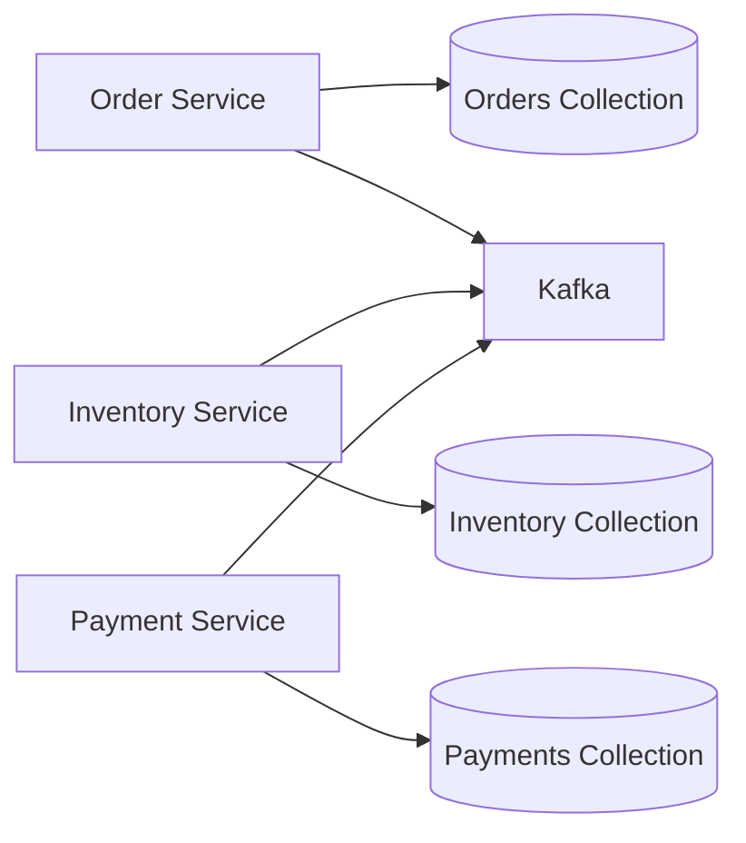

# 03- Data Modeling Questions

## Overview

MongoDB data modeling is primarily about designing documents around **how the application reads, writes, updates, and evolves data**.

Unlike a relational model where normalization and relationships are usually the starting point, MongoDB encourages engineers to begin with access patterns:

```text
Business requirements
        ↓
Access patterns
        ↓
Document boundaries
        ↓
Embedding / referencing
        ↓
Indexes
        ↓
Consistency requirements
        ↓
Operational characteristics
```

A strong interview answer should therefore avoid statements such as "MongoDB is schema-less, so we can store anything." Production MongoDB systems still require deliberate schema design, validation, indexing, lifecycle management, and consistency rules.

The core modeling decision is usually:

> **Should related data live inside the same document, or should it be stored separately and referenced?**

That decision affects query latency, write amplification, document growth, concurrency, transaction requirements, index design, and operational complexity.

---

## MongoDB Data Modeling vs Relational Modeling

A relational design commonly starts with:

```text
Entities
    ↓
Tables
    ↓
Primary / foreign keys
    ↓
Normalization
    ↓
JOINs
```

MongoDB modeling commonly starts with:

```text
Access patterns
    ↓
Aggregate boundaries
    ↓
Documents
    ↓
Embedding / referencing
    ↓
Indexes
```

Neither approach is universally better.

The appropriate model depends on:

- Read patterns.
- Write patterns.
- Relationship cardinality.
- Data growth.
- Consistency requirements.
- Transaction requirements.
- Query frequency.
- Document size.
- Operational scale.

---

## What Is an Aggregate in MongoDB?

An aggregate is a group of related data that is normally accessed and updated together.

For example, an e-commerce order can contain:

```json
{
  "_id": "order-001",
  "customer_id": "customer-001",
  "status": "confirmed",
  "items": [
    {
      "product_id": "product-100",
      "name": "Mechanical Keyboard",
      "quantity": 1,
      "unit_price": 120
    },
    {
      "product_id": "product-200",
      "name": "Mouse",
      "quantity": 2,
      "unit_price": 50
    }
  ],
  "total": 220
}
```

The order and its line items naturally form a unit that is often:

- Created together.
- Read together.
- Updated together.
- Owned by the same business transaction.

This makes embedding a strong candidate.

---

## Query-Driven Data Modeling

### Why should MongoDB schemas start with access patterns?

MongoDB can efficiently retrieve a document as a unit.

Therefore, the schema should reflect how the application actually consumes data.

Suppose an API frequently performs:

```text
GET /orders/{order_id}
```

and always needs:

```text
Order
+
Line items
+
Shipping address
```

Embedding those values may allow one document read.

If the application instead frequently asks:

```text
Find all orders containing product X
```

then product-related data may need a different access strategy and appropriate indexes.

The key question is not:

> "What are my entities?"

It is:

> "What queries and updates does the application need to perform?"

---

## Access Pattern Analysis

Before designing collections, document:

| Access pattern | Frequency | Data needed | Write frequency |
|---|---:|---|---:|
| Get order by ID | Very high | Order + items | Medium |
| List customer orders | High | Order summary | High |
| Search products | Very high | Product metadata | Medium |
| Get product reviews | High | Reviews | Very high |
| Update order status | High | Order status | High |

This immediately reveals potential aggregate boundaries.

For each important operation, determine:

- Filter.
- Sort.
- Projection.
- Expected result size.
- Read frequency.
- Write frequency.
- Consistency requirement.
- Latency requirement.

---

## Embedding

### What is embedding?

Embedding stores related information directly inside a document.

Example:

```json
{
  "_id": "customer-001",
  "name": "Alice",
  "address": {
    "street": "MG Road",
    "city": "Kolkata",
    "country": "India"
  }
}
```

Instead of storing the address separately, it is part of the customer document.

---

### Why use embedding?

Embedding is useful when related data:

- Is normally accessed together.
- Has a bounded size.
- Has the same lifecycle.
- Does not need independent querying frequently.
- Benefits from atomic document updates.

For example:

```text
Order
├── Customer snapshot
├── Shipping address
├── Billing address
└── Items
```

can often be represented as one aggregate.

---

### Advantages of embedding

- One database read can retrieve the aggregate.
- Related data can be updated atomically within one document.
- Fewer application-side joins.
- Simpler API responses.
- Lower query coordination overhead.
- Natural document representation.

---

### Limitations of embedding

Embedding becomes problematic when:

- Arrays grow without bounds.
- Embedded data is independently queried frequently.
- The same embedded data must be updated in many documents.
- The document approaches MongoDB's BSON document size limit.
- Frequent updates create a hot document.
- Duplication becomes operationally expensive.

---

## Referencing

### What is referencing?

Referencing stores related data separately and connects documents using identifiers.

Customer:

```json
{
  "_id": "customer-001",
  "name": "Alice"
}
```

Order:

```json
{
  "_id": "order-001",
  "customer_id": "customer-001",
  "total": 220
}
```

The application can retrieve the customer separately when required.

---

### When should data be referenced?

Referencing is appropriate when:

- Related data has an independent lifecycle.
- Related data is large.
- Related data is shared by many documents.
- Relationships are high-cardinality.
- The embedded array could grow indefinitely.
- Independent querying is common.
- Duplication would become expensive.

---

## Embedding vs Referencing

| Consideration | Embedding | Referencing |
|---|---|---|
| Read related data together | Excellent | Requires additional query |
| Atomic update | Strong for one document | May require transaction |
| Data duplication | Possible | Lower |
| Large relationships | Poor fit | Better |
| Unbounded relationships | Poor fit | Better |
| Independent lifecycle | Poor fit | Better |
| Read latency | Often lower | Can require multiple reads |
| Write amplification | Can be high with duplication | Usually lower |
| Schema simplicity | Often simpler | More application logic |
| Cross-document consistency | Not applicable within one document | Must be designed |

The correct choice depends on workload rather than a universal rule.

---

## One-to-One Relationships

### Example: User and Profile

Suppose every user has exactly one profile and the profile is always returned with the user.

Embedding:

```json
{
  "_id": "user-001",
  "email": "alice@example.com",
  "profile": {
    "display_name": "Alice",
    "timezone": "Asia/Kolkata"
  }
}
```

This is usually appropriate when the profile:

- Has a bounded size.
- Has the same lifecycle.
- Is frequently read with the user.

---

### When should a one-to-one relationship be referenced?

Suppose the profile contains large or independently managed information:

```text
User
+
Large compliance record
+
Large audit history
+
Large preferences document
```

Separating those documents may prevent unnecessary reads and document growth.

---

## One-to-Many Relationships

Consider:

```text
Customer
    ↓
Orders
```

The critical question is **how large the relationship can become**.

### Small bounded relationship

Embedding can work:

```json
{
  "_id": "customer-001",
  "name": "Alice",
  "addresses": [
    {
      "type": "home",
      "city": "Kolkata"
    },
    {
      "type": "office",
      "city": "Bengaluru"
    }
  ]
}
```

The array is naturally bounded.

---

### Large or unbounded relationship

Avoid embedding thousands or millions of orders:

```json
{
  "_id": "customer-001",
  "orders": [
    "... potentially millions of entries ..."
  ]
}
```

Instead:

```text
customers
    ↓
customer document

orders
    ↓
customer_id
```

Example:

```json
{
  "_id": "order-001",
  "customer_id": "customer-001",
  "total": 220
}
```

The order collection can grow independently.

---

## Many-to-Many Relationships

Consider:

```text
Users ↔ Roles
```

A simple design can embed role IDs:

```json
{
  "_id": "user-001",
  "roles": [
    "admin",
    "billing"
  ]
}
```

This is appropriate when the number of roles per user is bounded.

For a high-cardinality relationship:

```text
Users
    ↕
Memberships
    ↕
Organizations
```

a separate membership collection may be more appropriate:

```json
{
  "_id": "membership-001",
  "user_id": "user-001",
  "organization_id": "org-001",
  "role": "admin"
}
```

This allows independent querying and indexing.

---

## Parent-Child Modeling

Suppose an organization contains departments.

If departments are small and bounded:

```json
{
  "_id": "org-001",
  "name": "Acme",
  "departments": [
    {
      "name": "Engineering",
      "head": "user-001"
    },
    {
      "name": "Finance",
      "head": "user-002"
    }
  ]
}
```

If departments have independent workloads, employees, permissions, and lifecycle:

```text
organizations
departments
employees
```

may be more appropriate.

The relationship itself does not determine the schema. The access pattern does.

---

## Controlled Denormalization

MongoDB frequently benefits from controlled duplication.

For example, an order can store a product snapshot:

```json
{
  "_id": "order-001",
  "items": [
    {
      "product_id": "product-001",
      "name": "Mechanical Keyboard",
      "unit_price": 120
    }
  ]
}
```

The product collection may separately contain:

```json
{
  "_id": "product-001",
  "name": "Mechanical Keyboard",
  "current_price": 150
}
```

The order intentionally retains:

```text
name = value at purchase time
unit_price = value at purchase time
```

This is not accidental duplication.

It represents historical state.

---

## Duplication Is Not Automatically Bad

In relational systems, duplication is often minimized through normalization.

In MongoDB, duplication can be deliberate when it improves access patterns.

The important question is:

> Which copy is authoritative, and when is synchronization required?

For example:

```text
Product
  └── current_price

Order
  └── purchase_price
```

These values have different meanings and should not be synchronized.

---

## Duplication Synchronization Problem

Suppose a customer name is duplicated into:

```text
orders
invoices
shipments
support_tickets
```

Changing the customer's name now requires updating multiple documents if all copies are expected to remain current.

This introduces:

- Write amplification.
- Synchronization complexity.
- Partial update risk.
- Retry requirements.
- Event-driven consistency concerns.

If the duplicated value does not have independent business meaning, referencing may be safer.

---

## Document Growth

Document growth is a major modeling concern.

A document that starts as:

```json
{
  "_id": "user-001",
  "events": []
}
```

may eventually become:

```text
user
 └── millions of events
```

This creates problems with:

- Document size.
- Memory usage.
- Update cost.
- Indexing.
- Network transfer.
- Concurrency.
- Hot-document contention.

Large unbounded arrays are one of the most common MongoDB modeling anti-patterns.

---

## Bounded vs Unbounded Arrays

| Relationship | Modeling tendency |
|---|---|
| User → 3 addresses | Embed |
| Order → 10 line items | Embed |
| Product → 50 tags | Embed |
| User → 50,000 notifications | Usually reference |
| Customer → millions of orders | Reference |
| Post → bounded metadata | Embed |
| Post → millions of comments | Reference |

The exact threshold is workload-dependent.

The important distinction is whether the array is **bounded and operationally predictable**.

---

## Hot Documents

### What is a hot document?

A hot document is a document that receives a disproportionately high amount of concurrent reads or writes.

Example:

```json
{
  "_id": "global-counter",
  "value": 184739293
}
```

If thousands of workers constantly update this document:

```javascript
db.counters.updateOne(
  {_id: "global-counter"},
  {$inc: {value: 1}}
)
```

the document can become a contention point.

---

### How can hot documents be mitigated?

Depending on the workload:

- Partition counters.
- Use multiple documents.
- Aggregate counters asynchronously.
- Reduce write frequency.
- Buffer updates.
- Use event streams.
- Reconsider whether the exact counter is required synchronously.

The correct solution depends on consistency requirements.

---

## Large Documents

Large documents can cause:

- Higher network transfer.
- Higher deserialization cost.
- Increased memory pressure.
- Larger replication traffic.
- More expensive updates.
- Larger working-set requirements.

If an API needs only:

```text
name
email
status
```

it should not retrieve a huge embedded document containing unrelated historical data.

Use projection:

```javascript
db.users.find(
  {_id: "user-001"},
  {
    name: 1,
    email: 1,
    status: 1
  }
)
```

---

## Schema Design for Read-Heavy Workloads

Consider a product catalog:

```text
Product
├── name
├── category
├── price
├── availability
├── rating
└── tags
```

If the primary workload is:

```text
Search products
Filter category
Filter availability
Sort price
```

the schema and indexes should directly support those operations.

For example:

```javascript
db.products.createIndex({
  category: 1,
  availability: 1,
  price: 1
})
```

The exact index should be validated against actual query shapes.

---

## Schema Design for Write-Heavy Workloads

Suppose millions of telemetry events arrive continuously.

A document like:

```json
{
  "_id": "device-001",
  "events": [
    {}
  ]
}
```

can create a hot document.

Instead, independent event documents can be written:

```json
{
  "device_id": "device-001",
  "timestamp": "2026-09-25T10:00:00Z",
  "temperature": 31.4
}
```

This allows writes to distribute across many documents.

For high-volume time-series workloads, MongoDB's time-series capabilities should also be evaluated rather than manually constructing an unsuitable document model.

---

## Modeling the Same Business Domain in Different Ways

Consider an e-commerce order.

### Design A: Fully embedded

```json
{
  "_id": "order-001",
  "customer": {
    "id": "customer-001",
    "name": "Alice"
  },
  "shipping_address": {
    "city": "Kolkata"
  },
  "items": [
    {
      "product_id": "product-001",
      "name": "Keyboard",
      "price": 120
    }
  ]
}
```

Advantages:

- One read.
- Historical snapshots.
- Simple API response.
- Strong aggregate boundary.

Limitations:

- Customer data is duplicated.
- Product updates do not automatically propagate.
- Large order documents can become expensive.

---

### Design B: Referenced

```json
{
  "_id": "order-001",
  "customer_id": "customer-001",
  "item_ids": [
    "product-001"
  ]
}
```

Advantages:

- Less duplication.
- Independent entity updates.
- Smaller order document.

Limitations:

- Additional reads.
- More application logic.
- Potential consistency complexity.

---

### Design C: Hybrid

A production system often uses a hybrid:

```json
{
  "_id": "order-001",
  "customer_id": "customer-001",
  "customer_name_snapshot": "Alice",
  "shipping_address": {
    "city": "Kolkata"
  },
  "items": [
    {
      "product_id": "product-001",
      "name": "Keyboard",
      "price": 120
    }
  ]
}
```

The customer ID provides identity.

The customer name is a historical snapshot.

The shipping address belongs to the order aggregate.

The product reference identifies the product while the item snapshot preserves purchase-time information.

This is often closer to real production modeling.

---

## Query-Driven Modeling Example

Suppose the application needs:

```text
Get order by ID
List orders for customer
Search orders by status
Find recent orders
```

Possible indexes:

```javascript
db.orders.createIndex({
  customer_id: 1,
  created_at: -1
})

db.orders.createIndex({
  status: 1,
  created_at: -1
})
```

The model and indexes are designed together.

A common mistake is designing the schema first and adding indexes later without examining actual access patterns.

---

## Modeling for Pagination

Suppose an API returns customer orders:

```text
GET /customers/{id}/orders
```

A useful model:

```json
{
  "_id": "order-001",
  "customer_id": "customer-001",
  "created_at": "2026-09-25T10:00:00Z",
  "status": "completed"
}
```

Index:

```javascript
db.orders.createIndex({
  customer_id: 1,
  created_at: -1,
  _id: -1
})
```

The model supports:

```text
customer_id equality
        ↓
created_at ordering
        ↓
_id deterministic tie-breaker
```

This makes the data model, query, and index work as one design.

---

## Schema Evolution

MongoDB's flexible schema does not mean schema evolution is unnecessary.

Suppose version 1 documents contain:

```json
{
  "name": "Alice"
}
```

Version 2 requires:

```json
{
  "name": "Alice",
  "status": "active"
}
```

Possible strategies include:

### Lazy migration

New application code handles both:

```text
status exists
    ↓
use it

status missing
    ↓
use default
```

Existing documents are migrated gradually.

---

### Eager migration

A migration updates all existing documents:

```javascript
db.users.updateMany(
  {
    status: {$exists: false}
  },
  {
    $set: {
      status: "active"
    }
  }
)
```

This is appropriate when the new schema must be guaranteed.

---

### Versioned documents

For more complex changes:

```json
{
  "schema_version": 2,
  "name": "Alice",
  "profile": {
    "timezone": "Asia/Kolkata"
  }
}
```

Application code can explicitly handle schema versions.

---

## Schema Versioning Trade-offs

| Strategy | Advantages | Limitations |
|---|---|---|
| Lazy migration | Low migration risk | Application handles multiple versions |
| Eager migration | Clean final state | Potentially expensive migration |
| Version field | Explicit compatibility | More application complexity |
| Dual-read / dual-write | Useful for large transitions | High operational complexity |

For large production migrations, use controlled rollout, observability, resumability, and rollback planning.

---

## Schema Validation

MongoDB's flexible document model can still enforce structure.

Example:

```javascript
db.createCollection("users", {
  validator: {
    $jsonSchema: {
      bsonType: "object",
      required: [
        "email",
        "status"
      ],
      properties: {
        email: {
          bsonType: "string"
        },
        status: {
          enum: [
            "active",
            "inactive"
          ]
        }
      }
    }
  }
})
```

This provides database-level protection against malformed documents.

---

## Application Validation vs Database Validation

A production system commonly uses both.

```text
HTTP Request
    ↓
Pydantic / Django validation
    ↓
Service layer
    ↓
Repository
    ↓
MongoDB schema validation
```

Application validation provides:

- User-friendly errors.
- API-specific rules.
- Business validation.

Database validation provides:

- Persistence-level protection.
- Defense against other writers.
- Protection during migrations or administrative operations.

Neither layer should be considered a replacement for the other.

---

## Validation Levels

MongoDB validation can be configured with validation levels such as:

- `strict`
- `moderate`

Conceptually:

```text
strict
  ↓
Validation applies broadly to writes

moderate
  ↓
Validation behavior is more permissive for some existing invalid documents
```

The appropriate configuration depends on migration requirements.

---

## Validation Actions

Validation actions determine how invalid writes are handled.

A production system should generally reject invalid data rather than silently allowing malformed documents.

Validation rules should be introduced carefully when existing collections contain legacy data.

---

## Validation Limitations

Database schema validation does not replace:

- Authorization.
- Business workflows.
- Cross-document invariants.
- Complex application rules.
- External service validation.

For example:

```text
"customer must have enough credit for this order"
```

is a business rule, not merely a BSON schema constraint.

---

## Relationships and `$lookup`

MongoDB supports joining collections through aggregation using `$lookup`.

Example:

```javascript
db.orders.aggregate([
  {
    $lookup: {
      from: "customers",
      localField: "customer_id",
      foreignField: "_id",
      as: "customer"
    }
  }
])
```

`$lookup` is useful, but it should not automatically be treated as a replacement for every relational join.

Repeatedly joining large collections at request time can create:

- Higher latency.
- Larger resource consumption.
- Complex query plans.
- Increased operational cost.

If the application always needs the related data, embedding or controlled denormalization may be more appropriate.

---

## When `$lookup` Is Reasonable

Good candidates include:

- Reporting.
- Administrative queries.
- Analytics.
- Occasional cross-collection queries.
- Data reconciliation.

For high-frequency latency-sensitive API endpoints, evaluate whether the same requirement can be satisfied through a better aggregate design.

---

## Modeling for Transactions

A good MongoDB model often minimizes multi-document transactions.

Suppose an order requires:

```text
Order
+
Order items
+
Shipping address
```

If these belong to one business aggregate, embedding them allows the entire order state to be updated atomically as one document.

If the design requires:

```text
Order
+
Inventory
+
Payment
+
Customer balance
```

the workflow crosses multiple aggregates.

At that point, options include:

- Transactions.
- Event-driven workflows.
- Sagas.
- Idempotent operations.
- Compensating actions.

The model should not be designed around transactions as the first solution.

---

## Data Modeling and Microservices

A microservice should generally own its MongoDB data model.

For example:



Avoid creating a shared MongoDB schema where multiple services directly mutate each other's collections.

A service boundary should include:

- Data ownership.
- Validation ownership.
- Business rules.
- Change ownership.
- Migration ownership.

---

## Event-Driven Denormalization

Suppose the Order Service needs a customer display name.

Instead of synchronously querying the Customer Service for every request, it may maintain a read model:

```text
Customer Service
      ↓
customer.updated
      ↓
Kafka
      ↓
Order Service
      ↓
Local customer snapshot
```

The trade-off is:

```text
Lower request latency
        +
Service independence
        ↓
Eventual consistency
```

This is a deliberate architectural choice.

---

## Data Modeling with Redis

MongoDB and Redis may serve different access patterns.

For example:

```text
MongoDB
    ↓
System of record

Redis
    ↓
Frequently accessed derived state
```

Do not redesign MongoDB around Redis cache behavior.

Instead:

```text
API
 ↓
Redis cache
 ↓ cache miss
MongoDB
```

The MongoDB schema should remain correct without the cache.

---

## Data Modeling with Kafka

Kafka can be used to propagate changes between independently owned MongoDB models.

Example:

```text
MongoDB
    ↓
Change Stream
    ↓
Kafka
    ↓
Consumer
    ↓
Derived MongoDB Collection
```

The consumer should be idempotent.

A useful pattern is:

```javascript
db.customer_search.updateOne(
  {
    customer_id: "customer-001"
  },
  {
    $set: {
      name: "Alice",
      email: "alice@example.com"
    }
  },
  {
    upsert: true
  }
)
```

This allows replaying events without blindly creating duplicate documents.

---

## Data Modeling for FastAPI

A FastAPI service should typically separate:

```text
Pydantic request model
        ↓
Service
        ↓
Repository
        ↓
MongoDB document
```

The API representation does not necessarily need to match the persistence representation exactly.

For example:

```python
from pydantic import BaseModel, Field


class CreateUserRequest(BaseModel):
    email: str
    display_name: str = Field(min_length=1, max_length=100)
```

The database document may additionally contain:

```text
_id
created_at
updated_at
schema_version
status
```

This separation allows the persistence schema to evolve independently of the public API.

---

## Data Modeling for Django

MongoDB should not be treated as though it were Django's native relational database.

A Django application may use:

```text
Django
  ↓
Service Layer
  ↓
Repository
  ↓
PyMongo
  ↓
MongoDB
```

rather than pretending that Django's relational ORM semantics automatically apply to MongoDB.

MongoEngine can provide a document-oriented abstraction where appropriate, but teams should understand its behavior and limitations before making it the foundation of a large system.

---

## Repository Pattern

A repository can isolate persistence concerns:

```python
from typing import Any


class UserRepository:
    def __init__(self, collection: Any) -> None:
        self._collection = collection

    def find_by_id(self, user_id: str) -> dict | None:
        return self._collection.find_one({
            "_id": user_id
        })

    def create(self, document: dict) -> Any:
        return self._collection.insert_one(document)

    def update_status(
        self,
        user_id: str,
        status: str,
    ) -> Any:
        return self._collection.update_one(
            {"_id": user_id},
            {"$set": {"status": status}},
        )
```

The service layer can then focus on business behavior instead of MongoDB query syntax.

---

## Anti-Pattern: Designing MongoDB Like PostgreSQL

A common mistake is mechanically translating:

```text
users
orders
order_items
products
```

into MongoDB collections and then recreating every relational join at runtime.

This may work, but it can miss MongoDB's document model.

Instead, analyze:

```text
What does the API need to read?
What does it update together?
What grows independently?
What needs independent lifecycle?
What must remain consistent?
```

Then decide the document boundaries.

---

## Anti-Pattern: Embedding Everything

Example:

```json
{
  "_id": "customer-001",
  "orders": [
    {},
    {},
    {},
    {}
  ],
  "support_tickets": [
    {},
    {}
  ],
  "notifications": [
    {},
    {}
  ],
  "audit_events": [
    {}
  ]
}
```

This looks convenient initially.

At scale it can create:

- Large documents.
- Unbounded arrays.
- Expensive updates.
- Hot documents.
- Difficult indexing.
- Large replication payloads.
- Poor operational characteristics.

Embedding should be intentional, not automatic.

---

## Anti-Pattern: Referencing Everything

The opposite mistake is:

```text
Every entity
    ↓
Separate collection
    ↓
Application performs many queries
```

This can turn one API request into:

```text
Order query
    ↓
Customer query
    ↓
Product query
    ↓
Address query
    ↓
Payment query
```

This creates application-side join complexity and potentially high latency.

MongoDB's document model exists partly to avoid unnecessary query coordination.

---

## Anti-Pattern: Unbounded Arrays

Avoid:

```json
{
  "_id": "user-001",
  "notifications": [
    "... forever ..."
  ]
}
```

Instead:

```json
{
  "_id": "notification-001",
  "user_id": "user-001",
  "created_at": "2026-09-25T10:00:00Z"
}
```

Then index:

```javascript
db.notifications.createIndex({
  user_id: 1,
  created_at: -1
})
```

The relationship can grow independently.

---

## Anti-Pattern: Modeling for One Query Only

Suppose the only current query is:

```text
Get user by email
```

and the schema is optimized around it.

Later the product requires:

```text
List users by organization
Find users by status
Sort users by created_at
Search users by role
```

The model may require major changes.

A production design should consider the important access-pattern set rather than one isolated endpoint.

---

## Anti-Pattern: Over-Denormalization

Suppose the customer's current address is copied into millions of orders and every order must reflect the current address.

Updating the customer then becomes a large fan-out operation.

Instead, distinguish:

```text
Current customer address
```

from:

```text
Shipping address at purchase time
```

The order should usually preserve the historical address rather than pretending it is a live reference.

---

## Cardinality

Cardinality describes how many related records can exist.

Examples:

| Relationship | Cardinality |
|---|---|
| User → Primary profile | One-to-one |
| Order → Line items | Small one-to-many |
| Customer → Orders | Potentially large one-to-many |
| Product → Categories | Small many-to-many |
| User → Organizations | Potentially many-to-many |

Cardinality is one of the most important factors when deciding whether to embed.

---

## Frequency and Distribution

When modeling a relationship, consider:

```text
Cardinality
+
Frequency
+
Distribution
```

For example:

```text
Customer A → 5 orders
Customer B → 20 orders
Enterprise Customer → 50 million orders
```

A design that works for normal customers may behave badly for a highly active tenant.

This is particularly important in multi-tenant systems.

---

## Multi-Tenant Modeling

A common model is:

```json
{
  "_id": "order-001",
  "tenant_id": "tenant-001",
  "customer_id": "customer-001",
  "status": "completed",
  "created_at": "2026-09-25T10:00:00Z"
}
```

A common access pattern:

```javascript
db.orders.find({
  tenant_id: "tenant-001",
  status: "completed"
})
```

Potential index:

```javascript
db.orders.createIndex({
  tenant_id: 1,
  status: 1,
  created_at: -1
})
```

The tenant identifier often becomes an important part of query and indexing strategy.

For very large multi-tenant systems, tenant distribution should also be considered when selecting shard keys.

---

## Shard-Aware Data Modeling

Data modeling and sharding cannot be treated as completely separate.

A field considered suitable for a normal index may be unsuitable as a shard key.

A good shard-key candidate generally needs appropriate:

- Cardinality.
- Distribution.
- Query targeting characteristics.
- Write distribution.
- Stability.

Avoid choosing a monotonically increasing field without considering whether it can concentrate writes on a subset of shards.

---

## Schema Design and Shard Keys

Suppose all queries contain:

```javascript
{
  tenant_id: "tenant-001"
}
```

and tenants are distributed reasonably.

A tenant-oriented shard key may provide query targeting.

But if one tenant generates most traffic:

```text
tenant-A → 90% traffic
tenant-B → 2%
tenant-C → 1%
...
```

the tenant field alone may create a hot shard.

Shard-key design must therefore consider both query targeting and workload distribution.

---

## Modeling for High Availability

MongoDB replica sets replicate complete documents.

Therefore, document size and update frequency affect replication traffic.

A large frequently updated document can create more replication work than many smaller independently updated documents.

For high-throughput systems:

```text
Large hot document
        ↓
Frequent updates
        ↓
Replication + contention + cache pressure
```

may be worse than:

```text
Many bounded documents
        ↓
Independent updates
        ↓
Better distribution
```

---

## Modeling and Change Streams

Change streams expose document changes to consumers.

A document model with frequent large updates may generate larger change events or require more downstream processing.

For event-driven architectures, consider:

- Event size.
- Update frequency.
- Consumer idempotency.
- Resume behavior.
- Full-document lookup requirements.
- Downstream fan-out.

The persistence model affects the event model.

---

## Modeling Audit Data

Do not place an unlimited audit history inside the primary business document.

Avoid:

```json
{
  "_id": "user-001",
  "audit_log": [
    {}
  ]
}
```

Prefer a dedicated collection:

```json
{
  "_id": "event-001",
  "entity_type": "user",
  "entity_id": "user-001",
  "action": "status_changed",
  "timestamp": "2026-09-25T10:00:00Z",
  "actor_id": "admin-001"
}
```

Index:

```javascript
db.audit_events.createIndex({
  entity_id: 1,
  timestamp: -1
})
```

This provides bounded business documents and independently scalable audit storage.

---

## Modeling Logs and Events

High-volume event collections should usually use a bounded document structure:

```json
{
  "service": "order-service",
  "event_type": "order.created",
  "event_id": "event-001",
  "timestamp": "2026-09-25T10:00:00Z",
  "payload": {
    "order_id": "order-001"
  }
}
```

Important fields include:

- Event ID.
- Timestamp.
- Event type.
- Source.
- Aggregate identifier.
- Correlation identifier.

This supports:

- Idempotency.
- Debugging.
- Replay.
- Observability.
- Event-driven processing.

---

## Modeling for Idempotency

Suppose Kafka or a change-stream consumer may process the same event more than once.

A collection can enforce uniqueness:

```javascript
db.processed_events.createIndex(
  {
    event_id: 1
  },
  {
    unique: true
  }
)
```

The consumer can then use an idempotent persistence strategy.

The data model becomes part of the reliability mechanism.

---

## Data Modeling and Security

Schema design can affect authorization.

For multi-tenant documents:

```json
{
  "_id": "order-001",
  "tenant_id": "tenant-001"
}
```

the service should ensure every query includes the appropriate tenant boundary.

Do not rely solely on developers remembering:

```python
{"tenant_id": tenant_id}
```

in every query.

A repository or service abstraction can enforce tenant scoping consistently.

---

## Production Modeling Checklist

Before approving a MongoDB schema, review:

### Access patterns

- What are the top read queries?
- What are the top write queries?
- Which queries require sorting?
- Which queries require pagination?
- Which queries are latency-sensitive?

### Document boundaries

- What should be embedded?
- What should be referenced?
- Which arrays are bounded?
- Which relationships grow independently?

### Consistency

- Which values must be atomic?
- Can the invariant fit inside one document?
- Are transactions required?
- Is eventual consistency acceptable?

### Performance

- What indexes support the access patterns?
- How large can documents become?
- Which documents can become hot?
- What is the expected working set?

### Scale

- How many documents?
- How fast will the collection grow?
- What is the largest tenant?
- Could the workload require sharding?

### Operations

- How will the schema evolve?
- How will migrations be performed?
- How will old documents be handled?
- How will backups and restores behave?

---

## Senior-Level Interview Framework

When asked:

> "How would you model this MongoDB schema?"

Use this reasoning sequence:

```text
1. Identify entities
        ↓
2. Identify access patterns
        ↓
3. Identify aggregate boundaries
        ↓
4. Determine cardinality
        ↓
5. Decide embedding vs referencing
        ↓
6. Identify duplication requirements
        ↓
7. Analyze document growth
        ↓
8. Define consistency requirements
        ↓
9. Design indexes
        ↓
10. Consider transactions
        ↓
11. Consider tenant distribution
        ↓
12. Consider future scale and sharding
```

This demonstrates engineering reasoning rather than memorized MongoDB terminology.

---

## Interview Question: When Should You Embed vs Reference?

A strong answer:

> Embed data when it is bounded, naturally belongs to the same aggregate, is frequently read together, and benefits from atomic document updates. Reference data when it has an independent lifecycle, can grow without a predictable bound, is shared across many documents, or needs independent querying and scaling.

Then discuss:

- Cardinality.
- Update frequency.
- Document size.
- Consistency.
- Query patterns.
- Duplication cost.

---

## Interview Question: Why Does MongoDB Encourage Denormalization?

MongoDB documents are designed to represent data that is commonly accessed together.

Denormalization can reduce:

- Application-side joins.
- Database round trips.
- Query coordination.
- Latency.

However, it introduces:

- Duplication.
- Synchronization complexity.
- Write amplification.

Therefore, denormalization should be **controlled and intentional**.

---

## Interview Question: Is MongoDB Schema-Less?

A better answer is:

> MongoDB supports flexible document schemas, but production applications still have schemas in practice. The schema may be enforced through application models, database validation, repository contracts, migrations, and versioning rather than through a rigid relational table definition.

This distinction is important.

Flexible schema does not mean:

```text
No design
No validation
No contracts
```

---

## Interview Question: What Is the Biggest MongoDB Modeling Mistake?

There is no single universal mistake, but common failures include:

- Modeling entities without considering access patterns.
- Embedding unbounded arrays.
- Treating MongoDB like a relational database.
- Referencing everything.
- Over-denormalizing frequently changing data.
- Ignoring document growth.
- Ignoring hot documents.
- Designing indexes after the schema rather than with it.
- Ignoring tenant distribution.
- Using transactions to compensate for poor aggregate boundaries.

---

## Interview Scenario: Social Media Post

Suppose:

```text
Post
 ├── author
 ├── content
 ├── comments
 └── likes
```

A naive model:

```json
{
  "_id": "post-001",
  "comments": [],
  "likes": []
}
```

can become problematic if the post becomes viral.

A more scalable model may be:

```text
posts
comments
post_likes
```

with indexes such as:

```javascript
db.comments.createIndex({
  post_id: 1,
  created_at: -1
})

db.post_likes.createIndex({
  post_id: 1,
  user_id: 1
}, {
  unique: true
})
```

The design allows comments and likes to grow independently.

---

## Interview Scenario: E-Commerce Order

A strong design might be:

```json
{
  "_id": "order-001",
  "tenant_id": "tenant-001",
  "customer_id": "customer-001",
  "customer_name": "Alice",
  "status": "confirmed",
  "shipping_address": {
    "line1": "MG Road",
    "city": "Kolkata",
    "country": "India"
  },
  "items": [
    {
      "product_id": "product-001",
      "name": "Keyboard",
      "unit_price": 120,
      "quantity": 1
    }
  ],
  "total": 120,
  "created_at": "2026-09-25T10:00:00Z"
}
```

Reasoning:

- Order items belong to the order aggregate.
- Shipping address is historical order state.
- Product ID preserves identity.
- Product name and price can be snapshots.
- Customer ID preserves identity.
- Customer name can be a display snapshot.
- Order state can be updated atomically.

---

## Interview Scenario: Notification System

Avoid:

```json
{
  "_id": "user-001",
  "notifications": [
    {}
  ]
}
```

for users with potentially millions of notifications.

Prefer:

```json
{
  "_id": "notification-001",
  "user_id": "user-001",
  "type": "invoice_ready",
  "read": false,
  "created_at": "2026-09-25T10:00:00Z"
}
```

Index:

```javascript
db.notifications.createIndex({
  user_id: 1,
  read: 1,
  created_at: -1
})
```

This supports a common query:

```javascript
db.notifications.find({
  user_id: "user-001",
  read: false
})
.sort({
  created_at: -1
})
.limit(50)
```

---

## Interview Scenario: Multi-Tenant SaaS

Suppose the application has:

```text
10,000 tenants
```

with highly different workloads.

A document might contain:

```json
{
  "_id": "order-001",
  "tenant_id": "tenant-001",
  "customer_id": "customer-001",
  "status": "completed",
  "created_at": "2026-09-25T10:00:00Z"
}
```

Questions to ask:

- Are all queries tenant-scoped?
- What is the largest tenant?
- Is tenant distribution uniform?
- Can one tenant dominate writes?
- Will the collection require sharding?
- What shard-key options provide both query targeting and distribution?

This demonstrates senior-level modeling reasoning.

---

## Troubleshooting Data Modeling Problems

Use a structured process:

```text
Symptom
↓
Possible causes
↓
Isolation strategy
↓
Diagnostic commands
↓
Root cause
↓
Corrective action
↓
Prevention
```

### Problem: Documents are becoming very large

Possible causes:

- Unbounded arrays.
- Excessive embedding.
- Historical data stored in the primary document.
- Large nested payloads.

Isolation:

```javascript
db.collection.stats()
```

Inspect representative documents and measure their BSON size.

Corrective action:

- Split unbounded relationships.
- Move historical data to another collection.
- Use projection.
- Redesign aggregate boundaries.

Prevention:

- Establish document-growth expectations.
- Monitor collection statistics.
- Review schema changes before deployment.

---

### Problem: Writes are slow

Possible causes:

- Too many indexes.
- Hot documents.
- Large documents.
- High write contention.
- Replication pressure.

Isolation:

```javascript
db.collection.getIndexes()
```

and inspect workload metrics and document access patterns.

Corrective action:

- Remove unnecessary indexes.
- Split hot documents.
- Reduce write amplification.
- Reconsider denormalization.

---

### Problem: API requests require many MongoDB queries

Possible causes:

- Over-referencing.
- Poor aggregate boundaries.
- Missing denormalized read models.
- Incorrect service boundaries.

Isolation:

```text
API request
    ↓
Trace
    ↓
MongoDB operations
    ↓
Identify repeated lookups
```

Corrective action:

- Embed bounded data.
- Introduce controlled denormalization.
- Add purpose-built read models where justified.
- Reconsider service ownership.

---

### Problem: Updates affect millions of documents

Possible causes:

- Excessive duplication.
- Incorrect lifecycle boundaries.
- Data modeled as current state when it should be historical state.

Corrective action:

- Separate mutable source-of-truth data from immutable snapshots.
- Reduce fan-out updates.
- Use events for asynchronous derived-state updates.
- Revisit the aggregate boundary.

---

## Key Takeaways

- MongoDB data modeling should start with **access patterns, aggregate boundaries, cardinality, and lifecycle**, not simply with entities and relationships.
- Use **embedding for bounded data that is read and updated together**, and referencing for independently growing, independently managed, or high-cardinality data.
- Treat **unbounded arrays, large documents, hot documents, excessive duplication, and excessive references** as major production modeling risks.
- Design the **schema, indexes, consistency model, pagination strategy, and future scaling approach together** rather than treating them as independent decisions.
- Flexible MongoDB schemas still require strong production contracts through **validation, application models, migrations, ownership boundaries, and controlled schema evolution**.