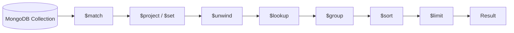
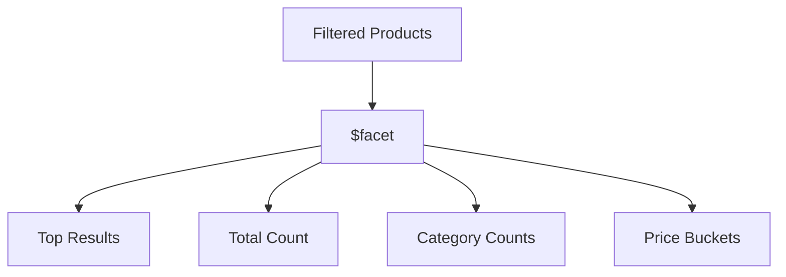
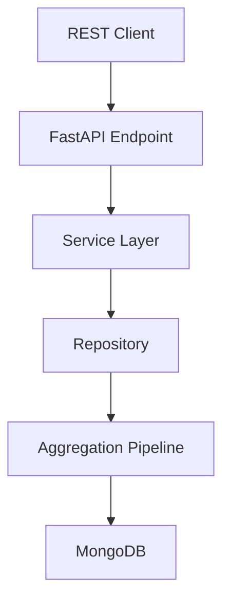
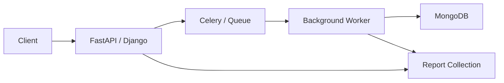
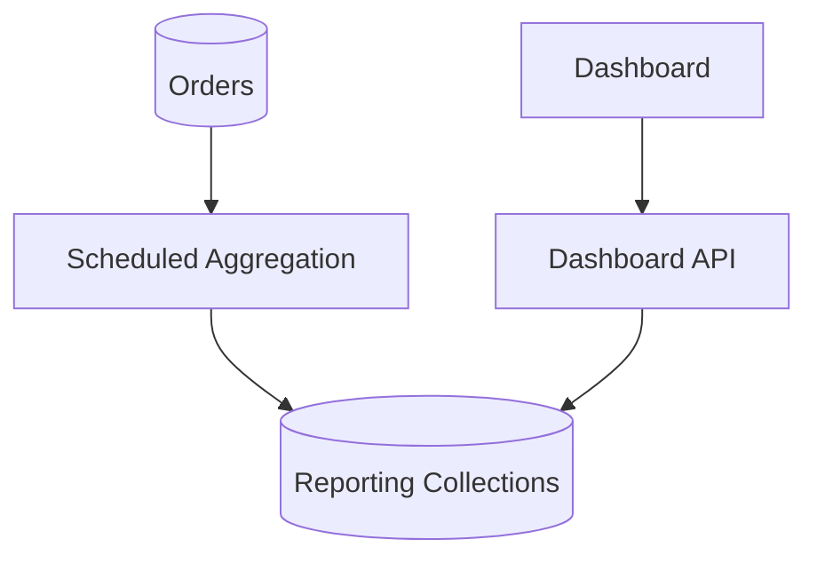

# 04- Aggregation Questions

## Overview

MongoDB aggregation is the primary mechanism for transforming, filtering, grouping, joining, and summarizing documents inside the database.

For backend engineers, aggregation questions are rarely about memorizing individual stages. Interviewers typically want to understand whether you can:

- Translate a business requirement into a pipeline.
- Control the number of documents flowing through the pipeline.
- Use indexes effectively.
- Choose between aggregation and application-side processing.
- Handle large datasets safely.
- Reason about `$lookup`, `$unwind`, `$group`, and `$facet`.
- Diagnose expensive aggregation pipelines.
- Build aggregations from Python.
- Design aggregation workloads for production.

A useful mental model is:

```text
Collection
    ↓
Filter
    ↓
Transform
    ↓
Join / Expand
    ↓
Group
    ↓
Sort
    ↓
Project
    ↓
Result
```

An aggregation pipeline is a sequence of stages where the output of one stage becomes the input to the next stage.

---

## What Is MongoDB Aggregation?

Aggregation processes documents through a pipeline of transformations.

Example:

```javascript
db.orders.aggregate([
  {
    $match: {
      status: "completed"
    }
  },
  {
    $group: {
      _id: "$customer_id",
      total_spend: {
        $sum: "$total"
      }
    }
  }
])
```

This pipeline:

1. Selects completed orders.
2. Groups them by customer.
3. Calculates total spending per customer.

Aggregation is useful for:

- Reporting.
- Dashboards.
- Analytics.
- Data transformation.
- Materialized views.
- Data reconciliation.
- API-specific read models.
- Operational queries.

---

## Why Use Aggregation Instead of Python Processing?

Consider one million orders.

A poor approach is:

```text
MongoDB
    ↓
Transfer 1,000,000 documents
    ↓
Python
    ↓
Group and calculate
```

A better approach may be:

```text
MongoDB
    ↓
$match
    ↓
$group
    ↓
$sort
    ↓
Small result set
    ↓
Python
```

Advantages include:

- Less network traffic.
- Less application memory.
- Less Python CPU usage.
- Reduced serialization overhead.
- Better database-side execution.

However, moving every computation into MongoDB is not automatically correct. Complex business logic may be easier to maintain in application code.

---

## Aggregation Pipeline Execution

A pipeline can be visualized as:



The order of stages matters.

A pipeline that reduces the dataset early will often perform significantly better than one that carries unnecessary documents through many stages.

---

## What Is `$match`?

`$match` filters documents.

```javascript
{
  $match: {
    status: "completed"
  }
}
```

It is conceptually similar to a query filter.

For example:

```javascript
db.orders.aggregate([
  {
    $match: {
      status: "completed",
      total: {
        $gte: 1000
      }
    }
  }
])
```

---

## Why Should `$match` Usually Appear Early?

Suppose a collection contains:

```text
100,000,000 documents
```

but only:

```text
500,000 documents
```

are relevant.

Filtering early can reduce the amount of data subsequent stages must process.

Prefer:

```javascript
[
  {
    $match: {
      tenant_id: "tenant-001",
      status: "completed"
    }
  },
  {
    $group: {
      _id: "$customer_id",
      total: {
        $sum: "$total"
      }
    }
  }
]
```

over unnecessarily transforming all documents first.

---

## Can `$match` Use an Index?

Yes, when the pipeline structure allows the query planner to use an appropriate index.

For example:

```javascript
db.orders.createIndex({
  tenant_id: 1,
  status: 1,
  created_at: -1
})
```

can support a pipeline beginning with:

```javascript
{
  $match: {
    tenant_id: "tenant-001",
    status: "completed"
  }
}
```

Validate actual behavior using:

```javascript
db.orders.explain("executionStats").aggregate([
  {
    $match: {
      tenant_id: "tenant-001",
      status: "completed"
    }
  }
])
```

---

## What Is `$project`?

`$project` controls the fields that appear in the pipeline output.

```javascript
{
  $project: {
    _id: 1,
    customer_id: 1,
    total: 1
  }
}
```

It can also compute fields:

```javascript
{
  $project: {
    customer_id: 1,
    total_with_tax: {
      $multiply: [
        "$total",
        1.18
      ]
    }
  }
}
```

Use projection to shape data intentionally.

Do not assume that manually projecting every field early always improves performance. Pipeline optimization is more nuanced, and MongoDB can optimize some projections internally.

---

## What Is `$set`?

`$set` adds or modifies fields.

```javascript
{
  $set: {
    total_with_tax: {
      $multiply: [
        "$total",
        1.18
      ]
    }
  }
}
```

`$set` is often easier to read than using `$project` when the goal is to preserve the existing document while adding derived fields.

---

## What Is `$unset`?

`$unset` removes fields from the pipeline document.

```javascript
{
  $unset: [
    "internal_notes",
    "debug_data"
  ]
}
```

It is useful when the pipeline needs to remove fields before producing an API or export representation.

---

## What Is `$group`?

`$group` combines documents based on a grouping key.

Example:

```javascript
{
  $group: {
    _id: "$customer_id",
    order_count: {
      $sum: 1
    },
    total_spend: {
      $sum: "$total"
    }
  }
}
```

Input:

```text
customer A → 100
customer A → 200
customer B → 50
```

Output:

```text
customer A → count 2, total 300
customer B → count 1, total 50
```

---

## What Is the Difference Between `$group` and SQL `GROUP BY`?

Conceptually:

```text
MongoDB                 SQL

$group                  GROUP BY
$sum                    SUM
$avg                    AVG
$min                    MIN
$max                    MAX
$count / $sum: 1        COUNT
```

The syntax and execution model differ, but the analytical concept is similar.

A MongoDB pipeline may combine grouping with document-oriented expressions that do not map directly to relational SQL.

---

## Common `$group` Accumulators

Common accumulators include:

| Accumulator | Purpose |
|---|---|
| `$sum` | Sum values |
| `$avg` | Average |
| `$min` | Minimum |
| `$max` | Maximum |
| `$count` | Count |
| `$first` | First value |
| `$last` | Last value |
| `$push` | Build an array |
| `$addToSet` | Build a unique-value array |

Example:

```javascript
{
  $group: {
    _id: "$category",
    total_sales: {
      $sum: "$amount"
    },
    average_sale: {
      $avg: "$amount"
    },
    maximum_sale: {
      $max: "$amount"
    }
  }
}
```

---

## What Is a Grouping Key?

The `_id` field inside `$group` defines the grouping key.

Group by one field:

```javascript
{
  $group: {
    _id: "$customer_id",
    total: {
      $sum: "$total"
    }
  }
}
```

Group by multiple fields:

```javascript
{
  $group: {
    _id: {
      customer_id: "$customer_id",
      status: "$status"
    },
    count: {
      $sum: 1
    }
  }
}
```

This is useful for multidimensional reporting.

---

## What Is `$unwind`?

`$unwind` expands an array into separate pipeline documents.

Input:

```json
{
  "_id": "order-001",
  "items": [
    {
      "product": "keyboard",
      "quantity": 1
    },
    {
      "product": "mouse",
      "quantity": 2
    }
  ]
}
```

Pipeline:

```javascript
{
  $unwind: "$items"
}
```

Produces conceptually:

```text
order-001 + keyboard
order-001 + mouse
```

---

## Why Is `$unwind` Powerful?

It allows operations on individual array elements.

Example:

```javascript
db.orders.aggregate([
  {
    $unwind: "$items"
  },
  {
    $group: {
      _id: "$items.product",
      quantity_sold: {
        $sum: "$items.quantity"
      }
    }
  }
])
```

This can calculate product-level sales from embedded order items.

---

## What Is the Risk of `$unwind`?

`$unwind` can multiply the number of documents flowing through the pipeline.

If:

```text
1,000,000 orders
```

each contain:

```text
20 items
```

then `$unwind` may produce approximately:

```text
20,000,000 pipeline documents
```

before subsequent stages.

Therefore, filter before `$unwind` whenever possible.

---

## What Is `$lookup`?

`$lookup` performs a left outer join-like operation between collections.

Example:

```javascript
{
  $lookup: {
    from: "customers",
    localField: "customer_id",
    foreignField: "_id",
    as: "customer"
  }
}
```

The result contains an array named `customer`.

---

## Why Does `$lookup` Return an Array?

Even if one document is expected, `$lookup` represents matching documents as an array.

For a one-to-one relationship, you can subsequently use:

```javascript
{
  $unwind: "$customer"
}
```

if the application requires a single embedded customer object.

---

## How Can `$lookup` Be Optimized?

Prefer:

```text
$match
    ↓
$lookup
```

over:

```text
$lookup
    ↓
$match
```

when the filter can reduce the number of documents entering the join.

Also ensure the foreign-side lookup field is appropriately indexed.

For example:

```javascript
db.customers.createIndex({
  _id: 1
})
```

The exact optimization depends on the lookup shape and MongoDB version.

---

## `$lookup` with a Pipeline

A more expressive lookup can use a pipeline:

```javascript
{
  $lookup: {
    from: "payments",
    let: {
      order_id: "$_id"
    },
    pipeline: [
      {
        $match: {
          $expr: {
            $eq: [
              "$order_id",
              "$$order_id"
            ]
          }
        }
      },
      {
        $project: {
          _id: 0,
          status: 1,
          amount: 1
        }
      }
    ],
    as: "payments"
  }
}
```

This is useful when the joined collection needs:

- Filtering.
- Projection.
- Additional transformation.
- More complex matching.

---

## When Should `$lookup` Be Avoided?

Do not automatically use `$lookup` for every relationship.

If a high-frequency API endpoint performs:

```text
Order
 ↓
Customer
 ↓
Product
 ↓
Payment
 ↓
Shipping
```

on every request, the aggregation may become expensive and difficult to operate.

Consider:

- Embedding.
- Controlled denormalization.
- Read models.
- Materialized views.
- Service-level caching.

The best choice depends on consistency and workload requirements.

---

## What Is `$sort`?

`$sort` orders pipeline documents.

```javascript
{
  $sort: {
    created_at: -1
  }
}
```

Sorts can be expensive, especially after stages that produce large intermediate result sets.

---

## How Can `$sort` Use an Index?

A suitable index can sometimes provide the required order.

For example:

```javascript
db.orders.createIndex({
  customer_id: 1,
  created_at: -1
})
```

supports a pattern such as:

```javascript
{
  $match: {
    customer_id: "customer-001"
  }
},
{
  $sort: {
    created_at: -1
  }
}
```

The exact plan should be verified with `explain()`.

---

## What Is `$limit`?

`$limit` restricts the number of documents passing through the pipeline.

```javascript
{
  $limit: 50
}
```

It is useful for:

- Top-N queries.
- API pagination.
- Administrative views.
- Bounding intermediate work when placed appropriately.

---

## Why Does `$limit` Placement Matter?

Consider:

```javascript
[
  {$sort: {created_at: -1}},
  {$limit: 10}
]
```

This asks for the top ten documents.

But:

```javascript
[
  {$limit: 10},
  {$sort: {created_at: -1}}
]
```

sorts only the first ten incoming documents.

These pipelines produce different results.

---

## What Is `$skip`?

`$skip` discards the first N pipeline documents.

```javascript
{
  $skip: 100
}
```

It is useful for small administrative or conventional pagination workloads.

For large offsets, cursor-based pagination is generally preferable.

---

## What Is `$count`?

`$count` returns the number of documents reaching that stage.

```javascript
{
  $count: "total"
}
```

Result:

```json
{
  "total": 15234
}
```

It is commonly used for pagination metadata and reporting.

---

## What Is `$facet`?

`$facet` allows multiple pipelines to operate on the same input.

Example:

```javascript
db.products.aggregate([
  {
    $match: {
      category: "electronics"
    }
  },
  {
    $facet: {
      results: [
        {
          $sort: {
            price: 1
          }
        },
        {
          $limit: 20
        }
      ],
      total_count: [
        {
          $count: "count"
        }
      ]
    }
  }
])
```

The result can contain both:

```text
results
+
total_count
```

---

## When Is `$facet` Useful?

Common API use cases:

```text
Search results
+
Total count
+
Category counts
+
Price ranges
```

For example:



However, `$facet` can become expensive if the input set is very large and multiple sub-pipelines perform substantial work.

---

## What Is `$bucket`?

`$bucket` groups documents into predefined ranges.

Example:

```javascript
{
  $bucket: {
    groupBy: "$price",
    boundaries: [
      0,
      100,
      500,
      1000,
      5000
    ],
    default: "5000+",
    output: {
      count: {
        $sum: 1
      }
    }
  }
}
```

This can produce price distribution buckets.

---

## What Is `$bucketAuto`?

`$bucketAuto` automatically attempts to distribute documents into a requested number of buckets.

```javascript
{
  $bucketAuto: {
    groupBy: "$price",
    buckets: 5
  }
}
```

It is useful for exploratory analytics when explicit boundaries are not known.

For business-critical reporting, explicit business ranges may be preferable because they provide deterministic semantics.

---

## What Are `$replaceRoot` and `$replaceWith`?

These stages replace the current document structure.

Example:

```javascript
{
  $replaceWith: "$profile"
}
```

If the input is:

```json
{
  "_id": "user-001",
  "profile": {
    "name": "Alice",
    "city": "Kolkata"
  }
}
```

the resulting document is based on the `profile` object.

`$replaceWith` is the newer, more expressive form for many use cases previously handled with `$replaceRoot`.

---

## What Is `$unionWith`?

`$unionWith` combines results from another collection or pipeline.

Example:

```javascript
db.current_orders.aggregate([
  {
    $unionWith: "archived_orders"
  }
])
```

This is useful when related data is physically separated but needs to be queried together.

Be careful with large collections because the combined result set can become expensive.

---

## What Is `$merge`?

`$merge` writes aggregation results into a collection.

Example:

```javascript
db.orders.aggregate([
  {
    $group: {
      _id: "$customer_id",
      total_spend: {
        $sum: "$total"
      }
    }
  },
  {
    $merge: {
      into: "customer_metrics",
      on: "_id",
      whenMatched: "replace",
      whenNotMatched: "insert"
    }
  }
])
```

This can implement a materialized or derived collection.

---

## `$merge` vs `$out`

Both can write aggregation results to collections, but their semantics differ.

| Feature | `$merge` | `$out` |
|---|---|---|
| Merge into existing collection | Yes | Different replacement-oriented behavior |
| Upsert-style behavior | Yes | No |
| Flexible matching | Yes | More limited |
| Materialized view patterns | Excellent | Useful |
| Fine-grained update behavior | Yes | Less flexible |

Use `$merge` when you need controlled integration with an existing target collection.

---

## Aggregation Expressions

Aggregation expressions compute values from document fields.

Example:

```javascript
{
  $set: {
    total_with_tax: {
      $multiply: [
        "$total",
        1.18
      ]
    }
  }
}
```

Expressions can be nested:

```javascript
{
  $set: {
    final_total: {
      $add: [
        "$subtotal",
        "$shipping",
        "$tax"
      ]
    }
  }
}
```

---

## Conditional Expressions

`$cond` implements conditional logic.

```javascript
{
  $set: {
    customer_type: {
      $cond: {
        if: {
          $gte: ["$total_spend", 100000]
        },
        then: "premium",
        else: "standard"
      }
    }
  }
}
```

`$switch` is useful when there are multiple branches.

```javascript
{
  $set: {
    tier: {
      $switch: {
        branches: [
          {
            case: {$gte: ["$score", 90]},
            then: "gold"
          },
          {
            case: {$gte: ["$score", 70]},
            then: "silver"
          }
        ],
        default: "bronze"
      }
    }
  }
}
```

---

## Array Expressions

Aggregation supports expressions for manipulating arrays.

Common examples include:

- `$filter`
- `$map`
- `$reduce`
- `$size`
- `$arrayElemAt`
- `$concatArrays`

Example:

```javascript
{
  $set: {
    expensive_items: {
      $filter: {
        input: "$items",
        as: "item",
        cond: {
          $gte: [
            "$$item.price",
            1000
          ]
        }
      }
    }
  }
}
```

This can sometimes avoid an expensive `$unwind` when the requirement only concerns filtering array elements.

---

## Date Expressions

MongoDB provides expressions for date manipulation.

Example:

```javascript
{
  $set: {
    order_month: {
      $dateToString: {
        format: "%Y-%m",
        date: "$created_at"
      }
    }
  }
}
```

Date expressions are useful for:

- Daily metrics.
- Monthly reports.
- Time-window grouping.
- Retention analysis.
- Operational dashboards.

Be explicit about timezone requirements.

---

## String Expressions

Examples include:

- `$concat`
- `$toLower`
- `$toUpper`
- `$trim`
- `$substrBytes`
- `$split`

Example:

```javascript
{
  $set: {
    normalized_email: {
      $toLower: "$email"
    }
  }
}
```

For high-frequency search requirements, normalization should often happen during writes rather than repeatedly during queries.

---

## Aggregation Example: Revenue by Customer

```javascript
db.orders.aggregate([
  {
    $match: {
      status: "completed"
    }
  },
  {
    $group: {
      _id: "$customer_id",
      order_count: {
        $sum: 1
      },
      total_revenue: {
        $sum: "$total"
      }
    }
  },
  {
    $sort: {
      total_revenue: -1
    }
  },
  {
    $limit: 100
  }
])
```

The pipeline follows:

```text
Filter
 ↓
Group
 ↓
Sort
 ↓
Limit
```

This is a common interview pattern.

---

## Aggregation Example: Monthly Revenue

```javascript
db.orders.aggregate([
  {
    $match: {
      status: "completed"
    }
  },
  {
    $group: {
      _id: {
        year: {
          $year: "$created_at"
        },
        month: {
          $month: "$created_at"
        }
      },
      revenue: {
        $sum: "$total"
      },
      orders: {
        $sum: 1
      }
    }
  },
  {
    $sort: {
      "_id.year": 1,
      "_id.month": 1
    }
  }
])
```

This is useful for dashboards and business reporting.

For production workloads, consider whether the aggregation should run synchronously on an API request or be materialized asynchronously.

---

## Aggregation Example: Average Order Value

```javascript
db.orders.aggregate([
  {
    $match: {
      status: "completed"
    }
  },
  {
    $group: {
      _id: null,
      average_order_value: {
        $avg: "$total"
      },
      order_count: {
        $sum: 1
      }
    }
  }
])
```

Using:

```javascript
_id: null
```

creates one global group.

---

## Aggregation Example: Top Products

Suppose orders contain embedded items:

```json
{
  "items": [
    {
      "product_id": "product-001",
      "quantity": 2,
      "unit_price": 100
    }
  ]
}
```

Pipeline:

```javascript
db.orders.aggregate([
  {
    $match: {
      status: "completed"
    }
  },
  {
    $unwind: "$items"
  },
  {
    $group: {
      _id: "$items.product_id",
      quantity_sold: {
        $sum: "$items.quantity"
      },
      revenue: {
        $sum: {
          $multiply: [
            "$items.quantity",
            "$items.unit_price"
          ]
        }
      }
    }
  },
  {
    $sort: {
      revenue: -1
    }
  },
  {
    $limit: 20
  }
])
```

The critical performance consideration is that `$unwind` expands the number of intermediate documents.

---

## Aggregation Example: Customer and Order Data

```javascript
db.orders.aggregate([
  {
    $match: {
      status: "completed"
    }
  },
  {
    $lookup: {
      from: "customers",
      localField: "customer_id",
      foreignField: "_id",
      as: "customer"
    }
  },
  {
    $unwind: "$customer"
  },
  {
    $project: {
      _id: 1,
      customer_name: "$customer.name",
      total: 1
    }
  }
])
```

This is appropriate when the customer information genuinely needs to be joined at query time.

---

## Aggregation from Python

PyMongo accepts aggregation pipelines as Python lists and dictionaries.

```python
pipeline = [
    {
        "$match": {
            "status": "completed",
        }
    },
    {
        "$group": {
            "_id": "$customer_id",
            "total_revenue": {
                "$sum": "$total",
            },
        }
    },
    {
        "$sort": {
            "total_revenue": -1,
        }
    },
    {
        "$limit": 100,
    },
]

cursor = collection.aggregate(pipeline)

for document in cursor:
    process(document)
```

Keep pipeline construction separate from business orchestration when pipelines become complex.

---

## Aggregation in a Repository

A repository method can encapsulate the query:

```python
class OrderRepository:
    def __init__(self, collection):
        self._collection = collection

    def top_customers(self, limit: int = 100):
        pipeline = [
            {
                "$match": {
                    "status": "completed",
                }
            },
            {
                "$group": {
                    "_id": "$customer_id",
                    "total_revenue": {
                        "$sum": "$total",
                    },
                }
            },
            {
                "$sort": {
                    "total_revenue": -1,
                }
            },
            {
                "$limit": limit,
            },
        ]

        return self._collection.aggregate(pipeline)
```

The service layer can then apply business policies without knowing MongoDB pipeline details.

---

## Aggregation with FastAPI

A typical architecture is:



The endpoint should not construct large MongoDB pipelines directly from arbitrary request input.

Validate:

- Allowed filters.
- Date ranges.
- Maximum limits.
- Sort fields.
- Aggregation dimensions.

---

## Aggregation and Django

For Django applications using PyMongo, aggregation belongs naturally in a repository or service layer.

Avoid embedding raw MongoDB aggregation logic throughout views.

Prefer:

```text
Django View
    ↓
Service
    ↓
Repository
    ↓
PyMongo aggregate()
```

This makes aggregation pipelines easier to:

- Test.
- Review.
- Optimize.
- Reuse.
- Instrument.

---

## Aggregation and API Pagination

A common API requirement is:

```json
{
  "items": [],
  "total": 12345
}
```

A `$facet` can calculate both result data and metadata:

```javascript
db.orders.aggregate([
  {
    $match: {
      customer_id: "customer-001"
    }
  },
  {
    $facet: {
      items: [
        {
          $sort: {
            created_at: -1,
            _id: -1
          }
        },
        {
          $limit: 50
        }
      ],
      metadata: [
        {
          $count: "total"
        }
      ]
    }
  }
])
```

For very large datasets, counting the entire result set can itself be expensive. The API should determine whether an exact total is genuinely required.

---

## Aggregation and Indexes

Indexes are especially important for the beginning of an aggregation pipeline.

Example:

```javascript
db.orders.createIndex({
  tenant_id: 1,
  status: 1,
  created_at: -1
})
```

Pipeline:

```javascript
[
  {
    $match: {
      tenant_id: "tenant-001",
      status: "completed"
    }
  },
  {
    $sort: {
      created_at: -1
    }
  },
  {
    $limit: 50
  }
]
```

This can allow MongoDB to efficiently locate and order the relevant documents.

---

## Aggregation Optimization Workflow

Use:

```text
Business requirement
        ↓
Build correct pipeline
        ↓
Measure baseline
        ↓
Run explain()
        ↓
Check initial filtering
        ↓
Check index usage
        ↓
Inspect intermediate expansion
        ↓
Inspect sorting/grouping
        ↓
Reduce data early
        ↓
Re-measure
```

Do not optimize based only on intuition.

---

## `explain()` for Aggregation

Use:

```javascript
db.orders.explain("executionStats").aggregate([
  {
    $match: {
      status: "completed"
    }
  },
  {
    $group: {
      _id: "$customer_id",
      total: {
        $sum: "$total"
      }
    }
  }
])
```

Important signals include:

- Execution time.
- Documents examined.
- Index keys examined.
- Winning plan.
- Collection scans.
- Index scans.
- Expensive sorting.
- Large intermediate processing.

The exact explain structure varies by MongoDB version and execution engine, so focus on the actual plan rather than memorizing a fixed output shape.

---

## `COLLSCAN` in Aggregation

A `COLLSCAN` indicates a collection scan.

A collection scan is not automatically wrong.

For example:

```text
Small collection
+
Query reads most documents
```

may legitimately perform well with a collection scan.

The question is:

> Is the observed plan appropriate for the workload?

For large selective queries, an unexpected collection scan deserves investigation.

---

## `IXSCAN` in Aggregation

`IXSCAN` indicates index scanning.

For example:

```text
IXSCAN
  ↓
FETCH
```

can indicate that MongoDB is using an index to identify candidate documents and then fetching documents.

A strong interview answer should explain that seeing `IXSCAN` alone does not prove the query is optimal.

Examine:

```text
nReturned
totalKeysExamined
totalDocsExamined
execution time
```

---

## Aggregation Sort Performance

Sorting can become expensive when:

- The input set is large.
- No suitable index supports the ordering.
- A previous stage generates many documents.
- The sort occurs after `$unwind`.
- The sort key has low selectivity.

A common optimization is to filter before sorting:

```javascript
[
  {
    $match: {
      tenant_id: "tenant-001"
    }
  },
  {
    $sort: {
      created_at: -1
    }
  }
]
```

and support the pattern with an appropriate compound index.

---

## Aggregation Memory

Aggregation stages can require substantial memory, particularly:

- `$group`
- `$sort`
- `$setWindowFields`
- `$lookup`
- `$facet`

Large intermediate results can create memory pressure.

Do not treat `allowDiskUse` as a universal performance fix.

Disk spilling can allow certain operations to proceed but may increase latency and I/O.

The first optimization should usually be reducing the amount of data processed.

---

## Aggregation Anti-Pattern: `$group` Too Early

Poor:

```javascript
[
  {
    $group: {
      _id: "$customer_id",
      total: {
        $sum: "$total"
      }
    }
  },
  {
    $match: {
      _id: "customer-001"
    }
  }
]
```

If only one customer is required, filter first:

```javascript
[
  {
    $match: {
      customer_id: "customer-001"
    }
  },
  {
    $group: {
      _id: "$customer_id",
      total: {
        $sum: "$total"
      }
    }
  }
]
```

This can drastically reduce work.

---

## Aggregation Anti-Pattern: `$lookup` Too Early

Poor:

```text
Millions of orders
    ↓
$lookup customers
    ↓
$match one tenant
```

Better:

```text
Millions of orders
    ↓
$match tenant
    ↓
$lookup customers
```

Filter the driving collection as early as practical.

---

## Aggregation Anti-Pattern: `$unwind` Before Filtering

Poor:

```javascript
[
  {$unwind: "$items"},
  {$match: {"tenant_id": "tenant-001"}}
]
```

Better:

```javascript
[
  {$match: {"tenant_id": "tenant-001"}},
  {$unwind: "$items"}
]
```

The second pipeline reduces the number of documents entering `$unwind`.

---

## Aggregation Anti-Pattern: Returning Massive Results

Avoid:

```javascript
db.orders.aggregate([
  {
    $group: {
      _id: "$customer_id",
      orders: {
        $push: "$$ROOT"
      }
    }
  }
])
```

for a collection where each customer can have hundreds of thousands of orders.

Building enormous arrays can create memory and document-size problems.

Ask whether the consumer actually needs every document.

---

## Aggregation Anti-Pattern: Application-Side Aggregation

Poor:

```python
orders = list(collection.find({
    "status": "completed",
}))

totals = {}

for order in orders:
    customer_id = order["customer_id"]
    totals[customer_id] = (
        totals.get(customer_id, 0)
        + order["total"]
    )
```

This transfers all matching data to the application.

Prefer database-side aggregation when the operation maps naturally to MongoDB:

```python
pipeline = [
    {
        "$match": {
            "status": "completed",
        }
    },
    {
        "$group": {
            "_id": "$customer_id",
            "total": {
                "$sum": "$total",
            },
        }
    },
]
```

---

## When Should Aggregation Stay in Python?

Not every computation belongs in MongoDB.

Application-side processing may be appropriate when:

- Business logic is highly complex.
- The transformation depends on external APIs.
- The computation requires application libraries.
- The result is already a small dataset.
- The logic is easier to test and maintain outside the database.

A useful boundary is:

```text
Database
    ↓
Data reduction and relational/document transformation

Application
    ↓
Business orchestration and external dependencies
```

---

## Aggregation and Materialized Views

For expensive recurring reports:

```text
Raw collections
      ↓
Aggregation
      ↓
Derived collection
      ↓
API
```

The derived collection can be updated using `$merge`.

Example:

```javascript
db.orders.aggregate([
  {
    $group: {
      _id: "$customer_id",
      total_spend: {
        $sum: "$total"
      }
    }
  },
  {
    $merge: {
      into: "customer_metrics",
      on: "_id",
      whenMatched: "replace",
      whenNotMatched: "insert"
    }
  }
])
```

This trades:

```text
Freshness
```

for:

```text
Lower query latency
+
Lower repeated computation
```

---

## Aggregation and Celery

A large aggregation should not necessarily run synchronously inside an HTTP request.

A production architecture may be:



This is appropriate for reports that take seconds or minutes rather than milliseconds.

---

## Aggregation and Kafka

Aggregation can also be used to generate derived data consumed by downstream systems.

For example:

```text
MongoDB
    ↓
Change Stream
    ↓
Kafka
    ↓
Consumer
    ↓
Derived Collection
```

The consumer can use aggregation periodically to reconcile or rebuild the derived state.

This is useful because event-driven systems should have a recovery mechanism rather than assuming every event was processed perfectly.

---

## Aggregation Security

Never allow an API client to submit arbitrary aggregation pipelines unless the system is explicitly designed for trusted users.

A dangerous design is:

```json
{
  "pipeline": [
    "arbitrary MongoDB stages"
  ]
}
```

A safer design exposes controlled parameters:

```text
GET /reports/revenue
    ?tenant_id=...
    &start_date=...
    &end_date=...
```

The service constructs the pipeline internally.

Validate:

- Tenant scope.
- Allowed fields.
- Allowed operators.
- Date ranges.
- Result limits.
- Sort fields.
- Authorization.

---

## Aggregation and Multi-Tenant Security

A tenant-scoped pipeline should establish tenant filtering as early as possible.

Example:

```javascript
[
  {
    $match: {
      tenant_id: "tenant-001",
      status: "completed"
    }
  },
  {
    $group: {
      _id: "$customer_id",
      revenue: {
        $sum: "$total"
      }
    }
  }
]
```

The application must not rely on a later stage to enforce authorization.

A missing tenant filter can become a cross-tenant data exposure vulnerability.

---

## Aggregation Testing

Important test categories include:

- Correct results.
- Empty input.
- Missing fields.
- Null values.
- Duplicate values.
- Large arrays.
- Multiple matching documents.
- Date boundaries.
- Pagination.
- Authorization boundaries.
- Large datasets.

Example:

```python
def test_revenue_pipeline_filters_completed_orders(
    collection,
):
    pipeline = build_revenue_pipeline(
        tenant_id="tenant-001",
    )

    result = list(
        collection.aggregate(pipeline)
    )

    assert result == [
        {
            "_id": "customer-001",
            "revenue": 300,
        }
    ]
```

For critical pipelines, integration tests against a real MongoDB instance provide stronger confidence than mocking aggregation behavior.

---

## Aggregation Performance Testing

Do not test only:

```text
10 documents
```

for a production aggregation.

Performance tests should consider:

```text
Small dataset
Medium dataset
Production-scale dataset
Worst-case tenant
Large arrays
High-cardinality groups
```

Measure:

- Latency.
- CPU.
- Memory.
- Documents examined.
- Index keys examined.
- Result size.
- Concurrent execution behavior.

---

## Aggregation Troubleshooting

Use:

```text
Symptom
↓
Possible causes
↓
Isolation strategy
↓
Diagnostic commands
↓
Root cause
↓
Corrective action
↓
Prevention
```

### Symptom: Aggregation is slow

Possible causes:

- Large collection scan.
- Poor initial filter.
- Missing index.
- Expensive `$sort`.
- `$unwind` explosion.
- Large `$lookup`.
- High-cardinality `$group`.
- Large `$facet`.
- Large intermediate results.

Isolation:

```javascript
db.collection.explain("executionStats").aggregate([
  // pipeline
])
```

Check:

```text
execution time
documents examined
index keys examined
winning plan
```

Corrective actions may include:

- Move selective `$match` earlier.
- Add or redesign an index.
- Reduce projection.
- Avoid unnecessary `$unwind`.
- Reduce `$lookup` input.
- Materialize recurring reports.
- Move long-running work to a background worker.

---

## Troubleshooting: `$lookup` Is Slow

```text
Symptom
↓
$lookup has high latency
↓
Possible causes
    ├── Large input set
    ├── Poor foreign-field access
    ├── Large joined documents
    └── Unnecessary join
↓
Isolation
    ↓
Run pipeline with and without $lookup
    ↓
Inspect execution statistics
↓
Root cause
↓
Filter earlier / optimize join / redesign model
↓
Monitor latency and workload
```

---

## Troubleshooting: `$group` Consumes Excessive Resources

Possible causes:

- High-cardinality grouping key.
- Huge input set.
- Large accumulator arrays.
- Missing initial filtering.

Example risk:

```javascript
{
  $group: {
    _id: "$unique_event_id",
    events: {
      $push: "$$ROOT"
    }
  }
}
```

If every event has a unique ID, the grouping may provide little reduction while creating substantial intermediate state.

---

## Troubleshooting: Aggregation Produces Wrong Results

Check the pipeline stage by stage.

For example:

```text
$match
 ↓
Inspect result
 ↓
$unwind
 ↓
Inspect result
 ↓
$group
 ↓
Inspect result
```

A common mistake is debugging the complete pipeline without determining where the result first becomes incorrect.

For critical pipelines, temporarily replace later stages with:

```javascript
{
  $limit: 20
}
```

or:

```javascript
{
  $project: {
    _id: 1,
    relevant_field: 1
  }
}
```

to inspect intermediate data.

---

## Senior-Level Aggregation Design Checklist

Before deploying an aggregation, ask:

| Question | Reason |
|---|---|
| What is the expected input cardinality? | Determines workload |
| Can `$match` reduce input early? | Reduces downstream work |
| Is an index available? | Improves initial access |
| Does `$unwind` multiply documents significantly? | Controls intermediate size |
| Is `$lookup` really necessary? | Avoids expensive joins |
| Is `$group` high-cardinality? | Controls memory usage |
| Does `$sort` have index support? | Controls sorting cost |
| Is `$facet` processing too much data? | Controls repeated work |
| Is the result bounded? | Prevents large responses |
| Is the aggregation synchronous? | Determines API reliability |
| Should results be materialized? | Avoids repeated expensive computation |
| Is tenant filtering enforced? | Prevents data leakage |
| Has `explain()` been reviewed? | Validates assumptions |

---

## Interview Question: What Is an Aggregation Pipeline?

A strong answer:

> An aggregation pipeline is a sequence of stages that processes MongoDB documents through filtering, transformation, grouping, joining, sorting, and other operations. Each stage receives the output of the previous stage. The pipeline allows MongoDB to perform data reduction and transformation close to the data rather than transferring large datasets to the application.

---

## Interview Question: Why Should `$match` Usually Come First?

A strong answer:

> `$match` can reduce the number of documents entering subsequent stages. When the predicate is indexable and positioned appropriately, MongoDB may also use an index to reduce the initial scan. Reducing the working set early improves the cost of later stages such as `$sort`, `$group`, `$lookup`, and `$unwind`.

---

## Interview Question: `$match` vs `$project` — Which Comes First?

There is no universal rule that `$project` must always come before `$match`.

Usually:

```text
Selective $match
    ↓
Transformation
```

is preferred when the filter can reduce the dataset.

Modern MongoDB query optimization can move or optimize certain operations internally, so the actual execution plan should be validated rather than relying on simplistic stage-order rules.

---

## Interview Question: Why Is `$unwind` Expensive?

A strong answer:

> `$unwind` converts array elements into separate pipeline documents. If the input contains one million documents with ten array elements each, subsequent stages may process roughly ten million intermediate documents. Therefore, filtering before `$unwind` and avoiding unnecessary array expansion are important for large workloads.

---

## Interview Question: When Would You Use `$lookup`?

Use `$lookup` when related data must be joined at query time and the access pattern does not justify embedding or a derived read model.

Discuss:

- Input cardinality.
- Foreign collection indexes.
- Join frequency.
- Result size.
- Latency requirements.
- Consistency requirements.

Do not answer simply:

> `$lookup` is MongoDB's JOIN.

That is technically incomplete from an engineering perspective.

---

## Interview Question: When Should You Use `$facet`?

Use `$facet` when multiple independent result computations need to operate on the same filtered input.

A common example is:

```text
Search results
+
Total count
+
Aggregated filters
```

However, `$facet` can be expensive if the input set is large and every branch performs substantial processing.

---

## Interview Question: What Happens If You `$sort` Before `$match`?

Conceptually, MongoDB may need to sort a larger set of documents than necessary.

Prefer:

```javascript
[
  {
    $match: {
      status: "completed"
    }
  },
  {
    $sort: {
      created_at: -1
    }
  }
]
```

when the operations can be reordered without changing semantics.

However, MongoDB's optimizer may perform certain transformations automatically. The execution plan is the authoritative source for performance diagnosis.

---

## Interview Question: How Do You Optimize a Slow Aggregation?

Use this process:

```text
Capture exact pipeline
        ↓
Run explain("executionStats")
        ↓
Inspect initial scan
        ↓
Check indexes
        ↓
Check documents examined
        ↓
Check intermediate expansion
        ↓
Review $unwind / $lookup
        ↓
Review $group / $sort
        ↓
Reduce input
        ↓
Re-measure
```

Do not start by randomly adding indexes.

---

## Interview Question: When Should Aggregation Move to a Background Worker?

Move aggregation work out of the synchronous API path when:

- Execution is predictably long.
- Results can be generated asynchronously.
- The user can poll for status.
- Reports are expensive to compute.
- Multiple users request the same report.
- Results can be materialized.

A common backend architecture is:

```text
API
 ↓
Create report job
 ↓
Celery / Queue
 ↓
Worker
 ↓
MongoDB aggregation
 ↓
Report collection / object storage
 ↓
API retrieves result
```

---

## Interview Question: Aggregation or SQL?

The answer depends on the data model and workload.

| Requirement | MongoDB Aggregation | SQL |
|---|---|---|
| Document-oriented data | Strong fit | Possible but less natural |
| Embedded arrays | Strong fit | Requires relational representation |
| Complex relational joins | Possible | Often strong fit |
| Operational document transformations | Strong fit | Strong |
| Existing relational data | Depends | Natural |
| Analytics | Strong | Strong |
| Cross-table relational constraints | Limited compared with relational systems | Strong |

Do not select a database based on aggregation syntax alone.

---

## Interview Scenario: Build a Revenue Dashboard

Requirements:

```text
- Total revenue
- Number of orders
- Average order value
- Revenue by month
- Top 10 customers
```

A single massive aggregation is not necessarily the best production design.

Possible architecture:



For frequently requested dashboards, precomputed metrics can reduce request latency and database load.

---

## Interview Scenario: Large Reporting Query

Suppose:

```text
500 million orders
```

and a report scans the entire collection every time.

Questions to ask:

- Is the report generated frequently?
- Is real-time accuracy required?
- Can data be partitioned by time?
- Can `$match` restrict the date range?
- Can indexes reduce the initial scan?
- Can results be materialized?
- Can the report run asynchronously?
- Can old data be archived?
- What is the acceptable RPO/RTO for reporting data?

The solution is an architecture decision, not just a pipeline optimization.

---

## Production Aggregation Guidelines

### Prefer

- Filter early.
- Use appropriate indexes.
- Keep result sets bounded.
- Project only required fields.
- Avoid unnecessary `$unwind`.
- Avoid unnecessary `$lookup`.
- Monitor high-cardinality `$group`.
- Use `explain()` for important pipelines.
- Materialize expensive recurring computations.
- Run long reports asynchronously.
- Enforce tenant boundaries.
- Test with realistic data volumes.

### Avoid

- Arbitrary client-provided pipelines.
- Full collection transfers to Python.
- Unbounded API results.
- Huge `$push` arrays.
- Repeated expensive reports on every request.
- Assuming every `IXSCAN` is efficient.
- Treating `allowDiskUse` as the first optimization.
- Ignoring worst-case tenants or datasets.

---

## Key Takeaways

- MongoDB aggregation is a **data-processing pipeline**, and strong designs minimize the number and size of documents flowing through expensive stages.
- Use **early filtering, appropriate indexes, bounded results, and careful `$unwind`, `$lookup`, `$group`, `$sort`, and `$facet` usage** to control performance.
- Treat `explain("executionStats")` as the primary tool for validating aggregation assumptions rather than optimizing from syntax alone.
- For expensive recurring workloads, consider **materialized results, `$merge`, background workers, Celery, or event-driven read models** instead of executing large aggregations synchronously.
- Senior-level aggregation design connects the pipeline to **data modeling, indexing, security, multi-tenancy, consistency, scalability, and operational architecture**.