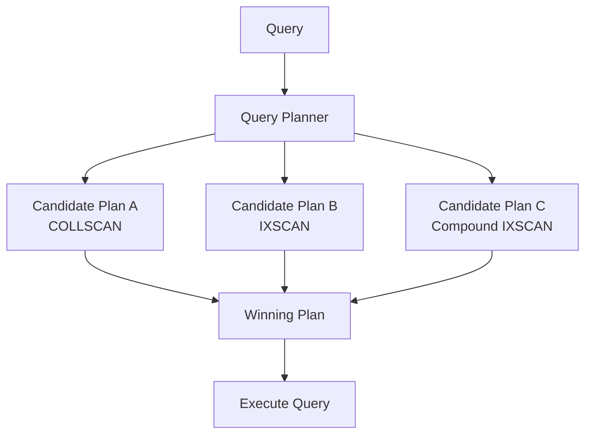
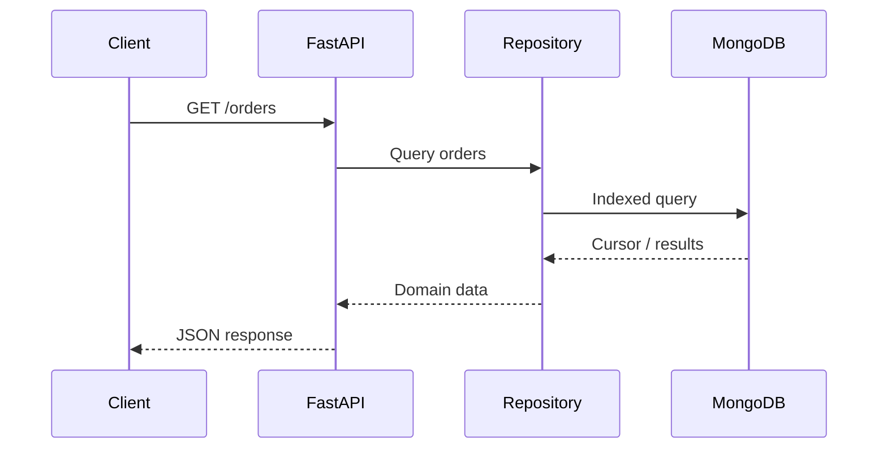
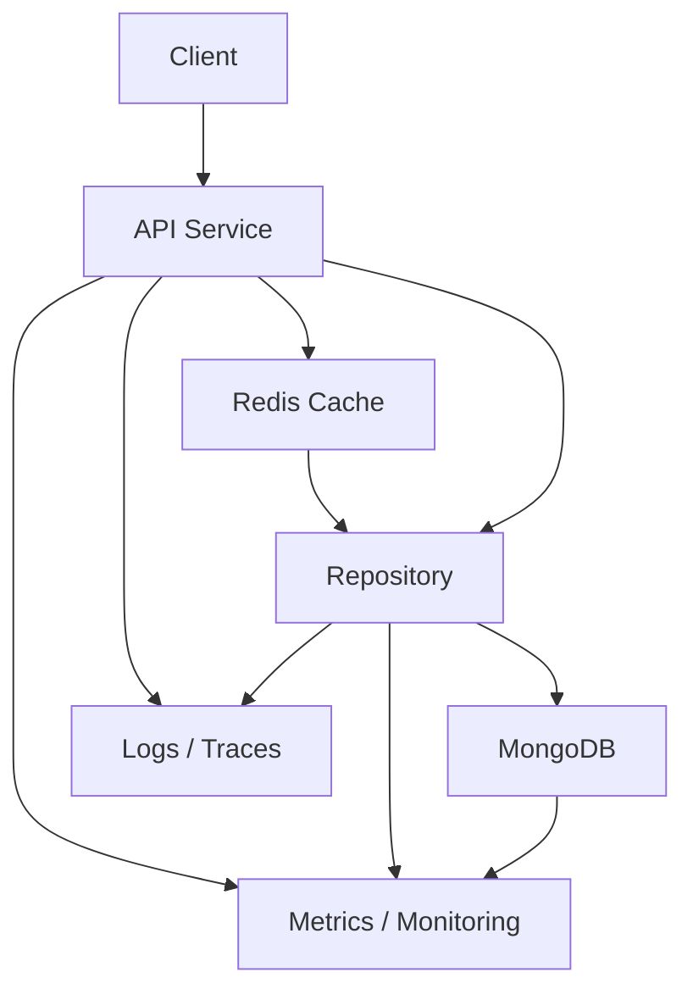

# 05- Indexing and Query Performance Questions

## Overview

MongoDB performance is strongly influenced by data modeling, query shape, index design, document size, working-set size, and workload characteristics.

For senior backend interviews, indexing questions are usually not about remembering `createIndex()` syntax. The important part is explaining **why a particular index supports a particular query**, how MongoDB's query planner evaluates plans, and how you would diagnose a slow query in production.

A useful performance model is:

```text
Application Request
        ↓
Query Shape
        ↓
Query Planner
        ↓
Index Selection
        ↓
Document / Index Scan
        ↓
Filtering / Sorting / Fetching
        ↓
Result
```

The core questions to answer when investigating MongoDB performance are:

- What query is actually running?
- How frequently does it run?
- How selective is the filter?
- Which index supports the query?
- How many index keys are examined?
- How many documents are examined?
- How many documents are returned?
- Is sorting performed in memory or supported by an index?
- Is the working set larger than available memory?
- Is the query pattern stable enough to justify an index?
- What write overhead does the index introduce?

---

## What Is a MongoDB Index?

An index is a data structure that allows MongoDB to locate documents without scanning every document in a collection.

Without an appropriate index:

```text
Query
  ↓
COLLSCAN
  ↓
Document 1
Document 2
Document 3
...
Document N
```

With an appropriate index:

```text
Query
  ↓
Index
  ↓
Matching keys
  ↓
Matching documents
```

MongoDB indexes are generally implemented using B-tree-family structures and maintain ordered access paths over indexed fields.

The important engineering principle is:

> An index should be designed around real query patterns, not around individual fields in isolation.

---

## Why Do Indexes Matter?

Suppose a collection contains:

```text
50,000,000 orders
```

and the application frequently executes:

```javascript
db.orders.find({
  customer_id: "customer-001"
})
```

If `customer_id` is not indexed, MongoDB may need to scan a large portion of the collection.

An index:

```javascript
db.orders.createIndex({
  customer_id: 1
})
```

can provide a direct access path.

The performance difference can be substantial, but an index does not automatically guarantee a fast query. Selectivity, sort requirements, result size, data distribution, and index design all matter.

---

## The Default `_id` Index

MongoDB automatically creates a unique index on `_id` for normal collections.

Example:

```javascript
db.orders.getIndexes()
```

may include:

```json
{
  "name": "_id_",
  "key": {
    "_id": 1
  },
  "unique": true
}
```

This index supports efficient lookup by `_id` and enforces uniqueness.

Do not create another ordinary index on `_id`; the default index already serves that purpose.

---

## Single-Field Indexes

A single-field index indexes one field.

```javascript
db.users.createIndex({
  email: 1
})
```

Useful for queries such as:

```javascript
db.users.find({
  email: "alice@example.com"
})
```

The direction is:

```text
1  → ascending
-1 → descending
```

For a single equality lookup, the direction often does not matter. Direction becomes more important when index ordering participates in sorting or compound query patterns.

---

## Compound Indexes

A compound index contains multiple fields.

```javascript
db.orders.createIndex({
  tenant_id: 1,
  status: 1,
  created_at: -1
})
```

This can support query patterns involving:

```text
tenant_id
status
created_at
```

The order is significant.

A compound index is not equivalent to three independent indexes.

---

## Why Does Compound Index Order Matter?

Consider:

```javascript
{
  tenant_id: 1,
  status: 1,
  created_at: -1
}
```

The index is ordered conceptually as:

```text
tenant_id
    ↓
status
    ↓
created_at
```

MongoDB can efficiently navigate the index based on its prefix structure.

For example:

```javascript
{
  tenant_id: "tenant-001",
  status: "completed"
}
```

is a strong match.

A query filtering only on `created_at` generally cannot use the compound index as efficiently because `created_at` is not a leading field.

---

## Compound Index Prefix Rule

Given:

```javascript
{
  tenant_id: 1,
  status: 1,
  created_at: -1
}
```

the useful prefixes are conceptually:

```text
tenant_id
tenant_id + status
tenant_id + status + created_at
```

This does not mean every query containing a prefix is automatically optimal. Query shape, sorting, ranges, selectivity, and index bounds matter.

---

## What Is Index Selectivity?

Selectivity describes how effectively a predicate narrows the candidate dataset.

Suppose:

```text
100 million documents
```

and:

```text
status = "active"
```

matches:

```text
80 million documents
```

That predicate has relatively poor selectivity.

Now:

```text
email = "alice@example.com"
```

may match one document.

That is highly selective.

High-selectivity predicates are often valuable for reducing the number of candidate documents, although compound index design must consider the entire query pattern rather than simply putting the most selective field first.

---

## Selectivity vs Cardinality

These terms are related but not identical.

| Concept | Meaning |
|---|---|
| Cardinality | Number of distinct values |
| Selectivity | How much a predicate narrows results |
| High cardinality | Many distinct values |
| Low cardinality | Few distinct values |

Example:

```text
gender
```

may have low cardinality.

```text
email
```

usually has high cardinality.

A high-cardinality field can often provide selective lookups, but the best index order depends on the query's equality, sort, and range requirements.

---

## ESR Guideline

A common MongoDB index-design heuristic is **ESR**:

```text
Equality
Sort
Range
```

For example:

```javascript
db.orders.createIndex({
  tenant_id: 1,
  status: 1,
  created_at: -1,
  total: 1
})
```

for a query such as:

```javascript
db.orders.find({
  tenant_id: "tenant-001",
  status: "completed",
  total: {
    $gte: 1000
  }
}).sort({
  created_at: -1
})
```

ESR is a useful starting heuristic, not a universal law.

Actual index design should be validated using the query planner and real workload.

---

## Equality, Sort, and Range

Consider:

```javascript
db.orders.find({
  tenant_id: "tenant-001",
  status: "completed",
  created_at: {
    $gte: ISODate("2026-01-01")
  }
}).sort({
  priority: -1
})
```

The important dimensions are:

```text
Equality:
tenant_id
status

Sort:
priority

Range:
created_at
```

An index needs to balance all three requirements.

A senior engineer should reason from the actual query shape rather than mechanically applying a memorized ordering.

---

## Why Does Sort Direction Matter?

Consider:

```javascript
db.orders.createIndex({
  tenant_id: 1,
  created_at: -1
})
```

This supports an ordering based on:

```javascript
{
  tenant_id: 1
}
```

followed by:

```javascript
{
  created_at: -1
}
```

MongoDB indexes can also support reverse traversal in many cases, but mixed sort directions in compound indexes require more careful reasoning.

For example:

```javascript
{
  tenant_id: 1,
  created_at: -1
}
```

and:

```javascript
{
  tenant_id: -1,
  created_at: 1
}
```

are equivalent in ordering capability when the entire pattern is reversed, while:

```javascript
{
  tenant_id: 1,
  created_at: 1
}
```

has different mixed-direction behavior.

---

## Covered Queries

A covered query can be answered using only index keys without fetching the full documents.

Example index:

```javascript
db.users.createIndex({
  tenant_id: 1,
  email: 1,
  name: 1
})
```

Query:

```javascript
db.users.find(
  {
    tenant_id: "tenant-001",
    email: "alice@example.com"
  },
  {
    _id: 0,
    name: 1,
    email: 1
  }
)
```

If the required fields and predicates are supported by the index, MongoDB may avoid fetching full documents.

Benefits:

- Less document I/O.
- Lower memory pressure.
- Potentially lower latency.

However, adding fields purely to create covered queries increases index size and write overhead.

---

## Index Write Overhead

Indexes improve reads but make writes more expensive.

For an insert:

```text
Insert document
      ↓
Update collection
      ↓
Update every relevant index
```

If a collection has many indexes:

```text
1 write
  ↓
collection update
  ↓
index A
index B
index C
index D
...
```

This can increase:

- Write latency.
- CPU usage.
- Memory consumption.
- Storage usage.
- Background index maintenance cost.

The correct goal is not:

> Create as many indexes as possible.

It is:

> Create the smallest useful index set that supports important workload patterns.

---

## Over-Indexing

Over-indexing occurs when a collection has indexes that provide little value but impose ongoing cost.

Common causes:

- Creating an index for every field.
- Adding indexes without measuring queries.
- Keeping obsolete indexes after application changes.
- Creating redundant compound indexes.
- Creating both single-field and compound indexes unnecessarily.

A production index should have a reason to exist.

---

## Index Redundancy

Suppose you have:

```javascript
{ customer_id: 1 }
```

and:

```javascript
{ customer_id: 1, created_at: -1 }
```

The compound index has the single-field index as a prefix.

The single-field index may therefore be redundant depending on the workload.

Do not remove it blindly.

Check:

- Query patterns.
- Index usage.
- Sort requirements.
- Index size.
- Production workload.

---

## How Do You List Indexes?

Using `mongosh`:

```javascript
db.orders.getIndexes()
```

Example output:

```json
[
  {
    "name": "_id_",
    "key": {
      "_id": 1
    }
  },
  {
    "name": "tenant_status_created_at",
    "key": {
      "tenant_id": 1,
      "status": 1,
      "created_at": -1
    }
  }
]
```

---

## How Do You Create an Index?

```javascript
db.orders.createIndex(
  {
    tenant_id: 1,
    status: 1,
    created_at: -1
  },
  {
    name: "tenant_status_created_at"
  }
)
```

Explicit names are useful for operations and troubleshooting.

---

## How Do You Drop an Index?

```javascript
db.orders.dropIndex(
  "tenant_status_created_at"
)
```

Do not remove production indexes casually.

Before removal:

1. Identify affected query patterns.
2. Review index usage.
3. Confirm replacement indexes.
4. Test against representative workloads.
5. Monitor after deployment.

---

## Unique Indexes

A unique index prevents duplicate indexed values.

```javascript
db.users.createIndex(
  {
    email: 1
  },
  {
    unique: true
  }
)
```

This is appropriate when uniqueness is a database invariant.

A common mistake is relying only on application code:

```python
if not user_exists(email):
    insert_user(email)
```

Two concurrent requests can both observe that the user does not exist.

A unique database index provides the authoritative constraint.

---

## Partial Indexes

A partial index only indexes documents satisfying a filter.

Example:

```javascript
db.orders.createIndex(
  {
    customer_id: 1,
    created_at: -1
  },
  {
    partialFilterExpression: {
      status: "active"
    }
  }
)
```

Useful when:

- Only a subset of documents is queried frequently.
- The indexed subset is significantly smaller.
- The query workload consistently includes the partial predicate.

Partial indexes can reduce:

- Index size.
- Write overhead.
- Memory consumption.

---

## Sparse Indexes

A sparse index only contains documents where the indexed field exists.

Example:

```javascript
db.users.createIndex(
  {
    secondary_email: 1
  },
  {
    sparse: true
  }
)
```

Sparse and partial indexes solve related but different problems.

For new designs, partial indexes are often more expressive because the inclusion condition can explicitly define the desired document subset.

---

## TTL Indexes

A TTL index automatically removes documents after a configured period.

Example:

```javascript
db.sessions.createIndex(
  {
    created_at: 1
  },
  {
    expireAfterSeconds: 3600
  }
)
```

Potential use cases:

- Temporary sessions.
- Ephemeral tokens.
- Short-lived logs.
- Temporary processing records.

Important:

> TTL deletion is asynchronous. It should not be treated as an exact-time deletion mechanism.

Do not use TTL when business logic requires deletion at an exact second.

---

## Multikey Indexes

When an indexed field contains an array, MongoDB can create a multikey index.

Example:

```json
{
  "name": "Alice",
  "roles": [
    "admin",
    "reporting"
  ]
}
```

Index:

```javascript
db.users.createIndex({
  roles: 1
})
```

Query:

```javascript
db.users.find({
  roles: "admin"
})
```

MongoDB can index array elements.

---

## Multikey Index Considerations

Arrays can significantly increase index entries.

If documents contain large arrays:

```text
1 document
+
1,000 array elements
```

the corresponding multikey index can create many index entries.

This can increase:

- Index size.
- Write cost.
- Query complexity.
- Memory pressure.

Large unbounded arrays are therefore both a data-modeling and indexing concern.

---

## Text Indexes

MongoDB supports text indexes for text-search use cases.

Example:

```javascript
db.products.createIndex({
  description: "text"
})
```

However, application requirements should determine whether MongoDB text search is sufficient.

For advanced search requirements, a dedicated search capability may be more appropriate.

Do not automatically use a regex scan when the requirement is actually full-text search.

---

## Geospatial Indexes

MongoDB supports geospatial indexing for location-based queries.

For GeoJSON data:

```javascript
db.locations.createIndex({
  location: "2dsphere"
})
```

This can support queries such as:

```javascript
db.locations.find({
  location: {
    $near: {
      $geometry: {
        type: "Point",
        coordinates: [
          88.3639,
          22.5726
        ]
      },
      $maxDistance: 5000
    }
  }
})
```

Use geospatial indexes when location is part of the actual access pattern.

---

## Index Intersection

MongoDB can sometimes use multiple indexes for a query.

For example:

```text
Index A → status
Index B → created_at
```

may potentially be combined.

However, relying on index intersection as the primary indexing strategy is usually weaker than designing an index that directly supports an important query shape.

For critical queries, prefer purpose-built indexes when justified.

---

## Query Planner

MongoDB's query planner evaluates possible execution strategies.

Conceptually:



The planner considers available indexes and query shape when determining an execution strategy.

---

## Winning Plan and Rejected Plans

`explain()` can show the selected execution plan and, depending on the explain verbosity and server behavior, rejected candidate plans.

The important interview point is:

> MongoDB does not simply choose an index because one exists. The query planner evaluates possible strategies.

A query can have an index and still perform poorly.

---

## What Is `COLLSCAN`?

`COLLSCAN` means collection scan.

Example:

```text
COLLSCAN
  ↓
Read documents from collection
  ↓
Apply filter
```

A `COLLSCAN` is not automatically a defect.

It may be appropriate when:

- The collection is small.
- Most documents match.
- The query is intentionally scanning the collection.
- An index would not provide meaningful selectivity.

The correct question is:

> Is the collection scan appropriate for the workload?

---

## What Is `IXSCAN`?

`IXSCAN` indicates that MongoDB is scanning an index.

Conceptually:

```text
Query
 ↓
IXSCAN
 ↓
Matching index keys
 ↓
FETCH
 ↓
Documents
```

An `IXSCAN` is usually a positive signal, but it does not guarantee optimal performance.

For example:

```text
IXSCAN
100,000,000 keys examined
1 document returned
```

is still a poor query plan.

---

## What Is `FETCH`?

`FETCH` means MongoDB needs to retrieve full documents after finding candidate records through an index.

Conceptually:

```text
IXSCAN
   ↓
Record identifiers
   ↓
FETCH
   ↓
Documents
```

Covered queries can sometimes avoid document fetching.

---

## Important `explain()` Metrics

For query diagnosis, pay particular attention to:

| Metric | Meaning |
|---|---|
| `nReturned` | Documents returned |
| `totalKeysExamined` | Index entries examined |
| `totalDocsExamined` | Documents examined |
| Execution time | Time spent executing |
| `COLLSCAN` | Collection scan |
| `IXSCAN` | Index scan |
| `FETCH` | Document retrieval |
| `SORT` | Explicit sort stage |

A useful efficiency signal is:

```text
documents examined / documents returned
```

If:

```text
totalDocsExamined = 1,000,000
nReturned = 10
```

the query deserves investigation.

---

## `explain("executionStats")`

Example:

```javascript
db.orders.explain(
  "executionStats"
).find({
  tenant_id: "tenant-001",
  status: "completed"
})
```

For aggregation:

```javascript
db.orders.explain(
  "executionStats"
).aggregate([
  {
    $match: {
      tenant_id: "tenant-001"
    }
  },
  {
    $group: {
      _id: "$customer_id",
      total: {
        $sum: "$total"
      }
    }
  }
])
```

Use `executionStats` when you need actual execution information rather than only the planner's theoretical information.

---

## Query Optimization Example

Suppose:

```javascript
db.orders.find({
  tenant_id: "tenant-001",
  status: "completed"
})
```

produces:

```text
nReturned: 50
totalDocsExamined: 8,000,000
```

This indicates that a large number of documents are being examined relative to the result.

Potential index:

```javascript
db.orders.createIndex({
  tenant_id: 1,
  status: 1
})
```

Re-run:

```javascript
db.orders.explain(
  "executionStats"
).find({
  tenant_id: "tenant-001",
  status: "completed"
})
```

Then compare:

```text
Before
8,000,000 documents examined

After
50 documents examined
```

The actual numbers depend on data distribution and query planner behavior; the important engineering practice is measuring before and after.

---

## Query Optimization Is Not Just Indexing

A slow query can result from:

```text
Poor index
+
Poor data model
+
Large documents
+
Large result set
+
Unbounded pagination
+
Expensive regex
+
Large array
+
$lookup
+
$unwind
+
High contention
+
Memory pressure
+
Working-set misses
```

Adding an index is only one possible corrective action.

---

## Query Shape

Query shape describes the structural characteristics of a query.

For example:

```javascript
{
  tenant_id: "...",
  status: "...",
  created_at: {
    $gte: "..."
  }
}
```

is structurally different from:

```javascript
{
  customer_id: "..."
}
```

Stable high-frequency query shapes are strong candidates for deliberate index design.

---

## Query Selectivity

Consider:

```javascript
db.orders.find({
  status: "completed"
})
```

If 95% of orders are completed, the index:

```javascript
{
  status: 1
}
```

may provide limited benefit.

Now consider:

```javascript
db.orders.find({
  order_id: "ORD-123456"
})
```

An index on:

```javascript
{
  order_id: 1
}
```

is highly selective.

This is why field cardinality and actual data distribution matter.

---

## Equality Query Example

Query:

```javascript
db.users.find({
  email: "alice@example.com"
})
```

Index:

```javascript
db.users.createIndex({
  email: 1
})
```

If email is unique:

```javascript
db.users.createIndex(
  {
    email: 1
  },
  {
    unique: true
  }
)
```

This provides both lookup performance and data integrity.

---

## Equality + Sort Example

Query:

```javascript
db.orders.find({
  customer_id: "customer-001"
}).sort({
  created_at: -1
}).limit(50)
```

A natural index candidate is:

```javascript
db.orders.createIndex({
  customer_id: 1,
  created_at: -1
})
```

This aligns the access pattern:

```text
Equality
customer_id

Sort
created_at
```

---

## Equality + Range Example

Query:

```javascript
db.orders.find({
  customer_id: "customer-001",
  total: {
    $gte: 1000
  }
})
```

Potential index:

```javascript
db.orders.createIndex({
  customer_id: 1,
  total: 1
})
```

The equality field precedes the range field.

---

## Multi-Tenant Index Design

For a multi-tenant system, tenant isolation often belongs directly in the query and index design.

Query:

```javascript
db.orders.find({
  tenant_id: "tenant-001",
  status: "pending"
}).sort({
  created_at: 1
})
```

Possible index:

```javascript
db.orders.createIndex({
  tenant_id: 1,
  status: 1,
  created_at: 1
})
```

This supports a common tenant-scoped access pattern.

It also makes accidental cross-tenant queries easier to identify during code review because tenant scope becomes an explicit part of the repository contract.

---

## Regex Queries and Indexes

A prefix regex may be able to use an index more effectively than an arbitrary substring search.

Potentially index-friendly:

```javascript
{
  name: /^alice/
}
```

Potentially expensive:

```javascript
{
  name: /alice/
}
```

The second pattern may require scanning many index entries or documents depending on the query and index.

Do not expose unrestricted regex search directly to public APIs.

---

## Case-Insensitive Search

Do not assume:

```javascript
{
  email: /alice/i
}
```

will provide efficient indexed behavior for every workload.

For high-volume search:

- Normalize data during writes.
- Use appropriate indexes.
- Consider collation requirements.
- Consider a dedicated search solution when search complexity grows.

For example, storing normalized email:

```json
{
  "email": "Alice@Example.com",
  "email_normalized": "alice@example.com"
}
```

can simplify exact lookups.

---

## Pagination Performance

Offset pagination:

```javascript
db.orders.find({
  tenant_id: "tenant-001"
})
.sort({
  created_at: -1
})
.skip(100000)
.limit(50)
```

can become increasingly expensive as the offset grows.

A cursor-based approach is usually better for large datasets.

---

## Cursor-Based Pagination

Suppose the ordering is:

```text
created_at DESC
_id DESC
```

Use the last item from the previous page as the cursor.

Conceptually:

```javascript
db.orders.find({
  tenant_id: "tenant-001",
  $or: [
    {
      created_at: {
        $lt: last_created_at
      }
    },
    {
      created_at: last_created_at,
      _id: {
        $lt: last_id
      }
    }
  ]
})
.sort({
  created_at: -1,
  _id: -1
})
.limit(50)
```

Index:

```javascript
db.orders.createIndex({
  tenant_id: 1,
  created_at: -1,
  _id: -1
})
```

This pattern scales much better than deep offsets when designed correctly.

---

## Why Include `_id` in Pagination Ordering?

If multiple documents share the same `created_at`, sorting only by:

```javascript
{
  created_at: -1
}
```

does not provide a deterministic unique ordering.

Adding:

```javascript
{
  _id: -1
}
```

provides a tie-breaker.

This is important for reliable cursor pagination.

---

## Large Documents and Performance

Indexes do not eliminate the cost of retrieving large documents.

Consider:

```json
{
  "_id": "...",
  "metadata": "...",
  "large_payload": "...",
  "audit_history": [...]
}
```

If the query returns the complete document, MongoDB still needs to fetch it.

Potential solutions:

- Projection.
- Smaller documents.
- Separate collections.
- Controlled embedding.
- Archive large historical data.

---

## Hot Documents

A hot document is a document that receives frequent reads or writes.

Example:

```text
Global counter
Global configuration document
Popular product
Shared job state
```

If thousands of workers repeatedly update one document:

```text
Worker 1 ─┐
Worker 2 ─┤
Worker 3 ─┤
Worker 4 ─┤──> Same document
Worker N ─┘
```

the workload can become a contention hotspot.

Indexes cannot solve every performance problem.

Possible solutions include:

- Sharded counters.
- Bucketing.
- Append-oriented writes.
- Redis for transient counters.
- Event aggregation.
- Data-model redesign.

---

## Working Set

The working set is the subset of data and indexes that the workload accesses frequently.

Ideally:

```text
Working Set
     ↓
Available memory
```

If the active working set exceeds available memory, the database may experience increased storage I/O and latency.

Performance analysis should therefore include:

- Dataset size.
- Index size.
- Active working set.
- Memory.
- Storage latency.
- Query concurrency.

---

## Index Size Matters

An index consumes storage and memory.

Consider:

```text
Collection:
500 GB

Indexes:
300 GB
```

Even if the collection itself is rarely scanned, indexes can significantly affect resource requirements.

For large deployments, monitor:

- Total index size.
- Per-index size.
- Memory utilization.
- Cache behavior.
- Index growth.

---

## Index Lifecycle

Indexes should be treated as production artifacts.

A lifecycle may look like:

```text
Query requirement
      ↓
Index proposal
      ↓
Test with representative data
      ↓
Benchmark
      ↓
Production rollout
      ↓
Monitor usage
      ↓
Review periodically
      ↓
Remove obsolete index
```

Do not treat indexes as permanent simply because they were once useful.

---

## Index Usage Statistics

MongoDB provides index statistics that can help identify unused indexes.

For example:

```javascript
db.orders.aggregate([
  {
    $indexStats: {}
  }
])
```

Use this as one signal, not as the sole basis for deleting an index.

An index may be used rarely but still be important for:

- Monthly reports.
- Incident recovery.
- Administrative operations.
- Compliance workflows.

---

## Query Performance Monitoring

Production monitoring should track:

```text
Query latency
Query frequency
Error rate
Documents examined
Keys examined
Connection usage
CPU
Memory
Storage latency
Replication lag
```

For important APIs, correlate:

```text
HTTP endpoint
    ↓
Repository method
    ↓
MongoDB query shape
    ↓
Database latency
```

This makes it easier to determine whether latency originates in the application or database.

---

## Slow Query Investigation

A senior engineer should use a repeatable process.

```text
Slow endpoint
    ↓
Identify MongoDB operation
    ↓
Capture exact query shape
    ↓
Run explain()
    ↓
Check index usage
    ↓
Check documents examined
    ↓
Check result cardinality
    ↓
Check sorting / lookup / unwind
    ↓
Check data distribution
    ↓
Change one variable
    ↓
Benchmark
    ↓
Deploy carefully
    ↓
Monitor regression
```

Avoid making several unrelated changes at once because you lose the ability to identify which change produced the improvement.

---

## Production Query Optimization Example

Suppose an API:

```text
GET /orders?tenant_id=tenant-001&status=pending
```

takes:

```text
1.8 seconds
```

Investigation shows:

```text
nReturned: 50
totalDocsExamined: 4,500,000
```

The query is:

```javascript
db.orders.find({
  tenant_id: "tenant-001",
  status: "pending"
}).sort({
  created_at: 1
}).limit(50)
```

A candidate index:

```javascript
db.orders.createIndex({
  tenant_id: 1,
  status: 1,
  created_at: 1
})
```

After testing, suppose the query changes to:

```text
nReturned: 50
totalDocsExamined: 50
```

The important lesson is not the specific index.

It is the process:

```text
Query shape
+
Access pattern
+
Explain
+
Index design
+
Measurement
```

---

## Indexing and Write-Heavy Systems

Suppose an event collection receives:

```text
100,000 writes/second
```

Adding ten indexes means every write may require significant additional index maintenance.

For write-heavy systems:

- Index only critical query paths.
- Avoid redundant indexes.
- Monitor index growth.
- Review write latency.
- Consider time-based data lifecycle strategies.
- Separate operational and analytical workloads where appropriate.

Sometimes an additional read replica or derived collection is a better architectural solution than continuously adding indexes to the write path.

---

## Indexing and Read-Heavy Systems

For read-heavy systems:

```text
1 write
+
1000 reads
```

additional indexes can be highly valuable.

But the index still needs to support actual query patterns.

A read-heavy workload may justify:

- Compound indexes.
- Covered queries.
- Partial indexes.
- Read-optimized document models.
- Materialized collections.

---

## Indexing and Aggregation

Aggregation pipelines can benefit from indexes, especially at the beginning of a pipeline.

Example:

```javascript
db.orders.createIndex({
  tenant_id: 1,
  status: 1,
  created_at: -1
})
```

Pipeline:

```javascript
[
  {
    $match: {
      tenant_id: "tenant-001",
      status: "completed"
    }
  },
  {
    $sort: {
      created_at: -1
    }
  },
  {
    $limit: 100
  }
]
```

Always validate with `explain()`.

---

## Indexing and `$lookup`

Suppose:

```javascript
{
  $lookup: {
    from: "customers",
    localField: "customer_id",
    foreignField: "_id",
    as: "customer"
  }
}
```

The foreign collection's lookup field should have appropriate indexing.

For `_id`, MongoDB already provides the default index.

For another field:

```javascript
foreignField: "external_customer_id"
```

a suitable index may be required:

```javascript
db.customers.createIndex({
  external_customer_id: 1
})
```

---

## Indexing and `$sort`

A common pattern is:

```javascript
db.orders.find({
  tenant_id: "tenant-001"
}).sort({
  created_at: -1
})
```

Candidate index:

```javascript
{
  tenant_id: 1,
  created_at: -1
}
```

This can potentially avoid a separate sort stage.

A senior engineer should inspect `explain()` rather than assuming that the index is being used as intended.

---

## Indexing and `$group`

Indexes generally help the stages that can use ordered or selective access, but `$group` itself can still require processing a large number of documents.

Example:

```javascript
[
  {
    $match: {
      tenant_id: "tenant-001"
    }
  },
  {
    $group: {
      _id: "$customer_id",
      total: {
        $sum: "$total"
      }
    }
  }
]
```

The index may efficiently narrow the input:

```text
tenant_id
```

but the database still needs to process the matching documents to compute the groups.

---

## Indexing Anti-Patterns

### Index Every Field

Why it happens:

> "Indexes make queries fast."

Why it is wrong:

- Increases storage.
- Increases write cost.
- Consumes memory.
- Creates maintenance overhead.
- Can make index selection more complex.

---

### Create an Index Without a Query

Bad:

```javascript
db.orders.createIndex({
  customer_name: 1
})
```

when there is no meaningful workload using it.

Indexes should be driven by access patterns.

---

### Create Separate Indexes for Every Filter

Suppose queries commonly filter:

```text
tenant_id
status
created_at
```

Creating:

```text
tenant_id
status
created_at
```

as three separate indexes may be inferior to a carefully designed compound index for the dominant query shapes.

---

### Ignore Sort Requirements

An index that supports filtering but not sorting may still require an expensive sort.

Always analyze:

```text
filter
+
sort
+
projection
+
limit
```

together.

---

### Ignore Data Distribution

An index can look correct on development data but perform poorly in production.

Example:

```text
Development:
1,000 documents

Production:
500,000,000 documents
```

Always benchmark with representative distributions.

---

### Rely Only on Development Queries

Production traffic may contain:

- Different tenants.
- Different result sizes.
- Different cardinalities.
- Different date ranges.
- Different concurrency.
- Different document sizes.

Production query behavior should be monitored continuously.

---

## Interview Question: What Is an Index?

A strong answer:

> An index is a data structure that provides an alternate access path to documents so MongoDB can locate matching records without scanning the entire collection. Indexes improve read performance but consume storage and memory and add write-maintenance overhead. Therefore, indexes should be designed around real query patterns.

---

## Interview Question: Why Is a Compound Index Better Than Multiple Single-Field Indexes?

A compound index can directly represent a common multi-field access pattern.

For example:

```javascript
{
  tenant_id: 1,
  status: 1,
  created_at: -1
}
```

can support filtering and ordering together.

Multiple single-field indexes may sometimes be combined, but a purpose-built compound index can provide a more direct access path and better control over sorting.

The correct answer depends on the workload.

---

## Interview Question: How Do You Choose Compound Index Order?

Discuss:

- Equality predicates.
- Sort requirements.
- Range predicates.
- Selectivity.
- Query frequency.
- Result cardinality.
- ESR as a starting heuristic.
- Actual `explain()` results.

Do not answer:

> Always put the most selective field first.

That is an oversimplification.

---

## Interview Question: What Is ESR?

ESR stands for:

```text
Equality
Sort
Range
```

It is a MongoDB index-design guideline.

Example:

```javascript
{
  tenant_id: 1,
  status: 1,
  created_at: -1,
  total: 1
}
```

might support a query involving:

```text
tenant_id = ...
status = ...
sort created_at
range total
```

The exact order should be validated against the actual workload and MongoDB query planner.

---

## Interview Question: What Is a Covered Query?

A covered query can be answered using index data without fetching the full documents.

The benefit is reduced document I/O.

However, adding many fields to an index solely to achieve coverage can make indexes large and expensive to maintain.

---

## Interview Question: What Is a Multikey Index?

A multikey index is an index used when the indexed field contains an array.

For:

```json
{
  "tags": [
    "mongodb",
    "backend"
  ]
}
```

an index on:

```javascript
{
  tags: 1
}
```

can support queries for individual array elements.

Large arrays can significantly increase index size and write overhead.

---

## Interview Question: What Is a Partial Index?

A partial index contains only documents matching a specified filter.

Example:

```javascript
db.orders.createIndex(
  {
    customer_id: 1
  },
  {
    partialFilterExpression: {
      status: "active"
    }
  }
)
```

It is useful when only a subset of documents participates in a frequent query workload.

---

## Interview Question: What Is the Difference Between Sparse and Partial Indexes?

A sparse index excludes documents where the indexed field is missing.

A partial index allows an explicit filter expression defining which documents are indexed.

Partial indexes are more expressive because the condition can involve document properties beyond simple field existence.

---

## Interview Question: What Is a TTL Index?

A TTL index automatically removes documents after a configured period.

Typical use cases include:

- Temporary sessions.
- Expiring tokens.
- Temporary data.
- Retention-controlled documents.

TTL deletion is asynchronous, so it should not be used as an exact-time scheduling mechanism.

---

## Interview Question: What Does `COLLSCAN` Mean?

`COLLSCAN` means MongoDB is scanning the collection.

It is not automatically bad.

The correct interview answer is:

> I would compare the scan cost with the number of documents returned, the query selectivity, the collection size, and the expected workload. For a highly selective query over a large collection, an unexpected `COLLSCAN` is usually a reason to investigate indexing or query shape.

---

## Interview Question: What Does `IXSCAN` Mean?

`IXSCAN` means MongoDB is scanning an index.

It is generally preferable for selective indexed queries, but the presence of `IXSCAN` does not prove the query is efficient.

For example:

```text
totalKeysExamined = 10,000,000
nReturned = 10
```

may still indicate a poor index or query pattern.

---

## Interview Question: What Are `nReturned`, `totalKeysExamined`, and `totalDocsExamined`?

| Metric | Meaning |
|---|---|
| `nReturned` | Number of result documents |
| `totalKeysExamined` | Number of index entries inspected |
| `totalDocsExamined` | Number of documents inspected |

A highly efficient selective query often has values close to:

```text
nReturned ≈ totalDocsExamined
```

and potentially:

```text
nReturned ≈ totalKeysExamined
```

depending on the query and projection.

---

## Interview Question: How Would You Diagnose a Slow MongoDB Query?

Answer with a structured workflow:

```text
Identify exact query
        ↓
Measure latency
        ↓
Run explain("executionStats")
        ↓
Inspect winning plan
        ↓
Check COLLSCAN / IXSCAN
        ↓
Compare keys examined
        ↓
Compare documents examined
        ↓
Check sort / fetch stages
        ↓
Review index design
        ↓
Check data distribution
        ↓
Benchmark candidate fix
        ↓
Deploy gradually
        ↓
Monitor
```

This is stronger than simply saying:

> I would add an index.

---

## Interview Scenario: Query Returns 10 Documents but Examines 10 Million

Possible causes:

- Missing index.
- Wrong index.
- Poor compound-index order.
- Low-selectivity leading field.
- Query shape does not match available indexes.
- Data distribution differs from development.
- Sort or range predicate limits index usefulness.

Investigation:

```javascript
db.orders.explain(
  "executionStats"
).find({
  // exact production query
})
```

Then inspect:

```text
winningPlan
nReturned
totalKeysExamined
totalDocsExamined
executionTimeMillis
```

Do not add multiple indexes simultaneously without measuring.

---

## Interview Scenario: Index Exists but Query Uses `COLLSCAN`

Investigate:

1. Is the index applicable to the query shape?
2. Is the indexed field selective?
3. Is the query using a type or value that prevents efficient index use?
4. Is the collection small enough that a scan is cheaper?
5. Is the index hidden or unavailable?
6. Is the index multikey or otherwise subject to query restrictions?
7. Is the query planner choosing another plan?
8. Is the observed plan from a different query shape?

Use:

```javascript
db.collection.explain(
  "executionStats"
).find({
  // query
})
```

Do not assume the planner is wrong before understanding the workload.

---

## Interview Scenario: Adding an Index Makes Writes Slower

This is expected when additional index maintenance becomes significant.

Explain the trade-off:

```text
More indexes
    ↓
Faster supported reads
    +
More storage
    +
More memory
    +
Higher write maintenance
```

Possible actions:

- Remove redundant indexes.
- Replace several indexes with a better compound index.
- Review query frequency.
- Separate workloads.
- Reconsider the data model.

---

## Interview Scenario: A Query Is Fast in Development but Slow in Production

Investigate:

```text
Data volume
Data distribution
Index availability
Index size
Working set
Memory
Document size
Concurrency
Query frequency
Replica topology
Storage performance
```

Development may have:

```text
10,000 documents
```

while production has:

```text
1 billion documents
```

An index that looks unnecessary in development may be essential in production, while another index that looks useful on synthetic data may provide little benefit with real distributions.

---

## Interview Scenario: API Pagination Becomes Slow at Page 10,000

Likely cause:

```javascript
.skip(500000)
```

The database still has to advance through a large number of records.

A better design is cursor-based pagination using a stable ordering:

```text
created_at
+
_id
```

with a matching compound index.

---

## Interview Scenario: Query Uses Regex and Becomes Slow

Determine whether the requirement is:

```text
Exact match
Prefix search
Substring search
Full-text search
Fuzzy search
```

For exact normalized values, use an equality query.

For prefix search, an appropriate indexed pattern may work.

For general text search, consider whether MongoDB's text/search capabilities or a dedicated search platform is more appropriate.

Do not expose arbitrary regex queries to untrusted clients without controls.

---

## Interview Scenario: A Large Array Query Is Slow

Investigate:

- Array size.
- Multikey index.
- Number of matching array elements.
- Document size.
- Query selectivity.
- `$unwind` usage.
- Array growth over time.

If arrays are unbounded, revisit the data model.

A common production rule is:

> Model arrays according to bounded access patterns rather than allowing unlimited historical growth inside a single document.

---

## Query Performance and Python

PyMongo does not eliminate database-side performance concerns.

This code:

```python
documents = list(
    collection.find({
        "status": "completed",
    })
)
```

can be dangerous if millions of documents match.

Potential problems:

- Large application memory usage.
- Network transfer.
- Serialization overhead.
- Long request latency.

Prefer:

```python
cursor = collection.find(
    {"status": "completed"},
    {"_id": 1, "customer_id": 1},
).limit(100)
```

when only a bounded subset is required.

---

## Cursor Batch Size

MongoDB returns query results through cursors.

PyMongo:

```python
cursor = collection.find(
    {"status": "pending"},
    batch_size=500,
)
```

Batch size can influence network behavior and memory usage.

It is not a replacement for:

- Proper filtering.
- Proper indexing.
- Bounded result sets.

Tune it only after understanding the workload.

---

## Projection and Performance

Use projection when large documents contain fields that are not required.

Example:

```python
cursor = collection.find(
    {"tenant_id": tenant_id},
    {
        "_id": 1,
        "status": 1,
        "created_at": 1,
    },
)
```

Projection reduces the amount of document data returned to the application.

However, do not assume projection alone will fix a query that scans millions of documents.

---

## Query Timeouts

Production applications should use appropriate MongoDB client timeouts.

Example:

```python
from pymongo import MongoClient

client = MongoClient(
    mongodb_uri,
    serverSelectionTimeoutMS=5000,
    connectTimeoutMS=5000,
    socketTimeoutMS=30000,
)
```

Timeout values should reflect service-level requirements.

Do not use extremely large timeouts to hide slow queries.

A database operation that normally takes 100 ms should not have a 10-minute timeout simply because the application does not know how to diagnose latency.

---

## Connection Pooling

A `MongoClient` maintains connection pools.

Production applications should generally create and reuse a client rather than creating a new client for every request.

Poor:

```python
def get_user(user_id):
    client = MongoClient(uri)
    ...
    client.close()
```

Better:

```python
client = MongoClient(uri)

def get_user(user_id):
    return database.users.find_one({
        "_id": user_id
    })
```

In FastAPI or similar frameworks, initialize the client with the application lifecycle and close it during shutdown.

---

## Query Performance and FastAPI

Typical request path:



The database query should be bounded by:

- Validated filters.
- Maximum page size.
- Appropriate sort.
- Appropriate index.
- Request timeout.

---

## Query Performance and Django

For Django applications using PyMongo, keep database access behind a repository or service layer.

For example:

```text
Django View
    ↓
Service
    ↓
Repository
    ↓
PyMongo
    ↓
MongoDB
```

This makes it easier to:

- Centralize query patterns.
- Review indexes.
- Add instrumentation.
- Test query construction.
- Change data-access strategy.

MongoDB should not be treated as if it were Django's native relational ORM.

---

## Query Performance and Redis

Redis can reduce repeated database reads, but caching should not be the first response to an inefficient MongoDB query.

Bad sequence:

```text
Slow query
 ↓
Add Redis
```

Better:

```text
Slow query
 ↓
Understand query
 ↓
Optimize index / data model
 ↓
Measure
 ↓
Add cache if repeated reads justify it
```

Caching an inefficient query can hide a database problem while introducing cache invalidation complexity.

---

## Query Performance and Kubernetes

In Kubernetes, database latency may be influenced by:

- Network latency.
- Connection pool configuration.
- Pod concurrency.
- CPU limits.
- Memory limits.
- Connection storms during scaling.
- DNS behavior.
- Deployment churn.

Do not diagnose MongoDB latency entirely from inside MongoDB.

Measure:

```text
Client-side latency
+
Network latency
+
MongoDB execution time
```

---

## Query Performance and AWS

For MongoDB deployments on AWS or managed MongoDB platforms, monitor:

- CPU.
- Memory.
- Storage I/O.
- Network throughput.
- Connection count.
- Query latency.
- Replication lag.
- Storage growth.

The exact metrics depend on the deployment platform.

A slow query can be caused by either:

```text
Bad query
```

or:

```text
Resource saturation
```

or both.

---

## Indexing and Security

Indexes themselves are not generally an authorization boundary.

A query must still enforce:

```text
tenant_id
user_id
organization_id
access scope
```

Example:

```javascript
db.documents.find({
  tenant_id: authenticatedTenantId,
  status: "active"
})
```

An index can support this access pattern:

```javascript
db.documents.createIndex({
  tenant_id: 1,
  status: 1
})
```

But the index does not prevent an application bug from querying another tenant.

Authorization remains an application and database-security concern.

---

## Indexing and Data Privacy

Be careful when indexing sensitive fields.

Indexes can contain values derived from sensitive data and therefore become part of the database's stored data footprint.

Review:

- Encryption.
- Access control.
- Backup handling.
- Diagnostic output.
- Query logging.
- Operational tooling.

Do not expose raw query parameters or sensitive indexed values through application logs unnecessarily.

---

## Index Deployment Strategy

For production systems, index creation should be treated as an operational change.

Before deployment:

```text
Identify query
      ↓
Design index
      ↓
Test on representative data
      ↓
Estimate storage impact
      ↓
Review write impact
      ↓
Deploy
      ↓
Monitor
```

For large production collections, index creation can consume significant resources and should be scheduled and monitored according to the deployment environment and MongoDB operational guidance.

---

## Production Index Review

A periodic index review should ask:

| Question | Reason |
|---|---|
| Is this index still used? | Remove obsolete indexes |
| Is it redundant? | Reduce maintenance |
| Does it support a critical query? | Protect availability |
| How large is it? | Capacity planning |
| Does it increase write latency? | Protect write throughput |
| Is the query shape still current? | Application evolution |
| Is there a better compound index? | Simplify index set |

---

## Performance Regression Testing

Query performance can regress after:

- Data growth.
- Application changes.
- New indexes.
- Removed indexes.
- Data distribution changes.
- Schema changes.
- Query changes.
- Deployment topology changes.

For critical workloads, maintain representative performance tests.

Track:

```text
Query latency
Documents examined
Keys examined
Result count
CPU
Memory
```

Do not use only average latency. Tail latency such as p95 and p99 can reveal production problems hidden by averages.

---

## Before-and-After Performance Analysis

A useful benchmark table:

| Metric | Before | After |
|---|---:|---:|
| Latency | 1,800 ms | 35 ms |
| Documents examined | 4,500,000 | 50 |
| Keys examined | 0 | 50 |
| Returned | 50 | 50 |
| Plan | COLLSCAN | IXSCAN |
| Sort | Explicit | Index-supported |

The important practice is measuring the same query shape under comparable conditions.

---

## Senior-Level Index Design Checklist

Before adding an index, ask:

- What exact query does it support?
- How frequently is that query executed?
- What is the expected result cardinality?
- What is the selectivity of each predicate?
- Does the query sort?
- Does the query use equality and range predicates?
- Can a compound index support multiple important query shapes?
- Does the index create redundancy?
- How much storage will it consume?
- What write overhead will it introduce?
- Does the production dataset differ significantly from development?
- Has the query been measured with `explain()`?
- How will the index be monitored after deployment?

---

## Senior-Level Slow Query Checklist

When a production query is slow:

```text
Identify exact operation
        ↓
Capture query shape
        ↓
Measure application latency
        ↓
Measure database execution
        ↓
Run explain("executionStats")
        ↓
Check COLLSCAN / IXSCAN
        ↓
Check keys examined
        ↓
Check documents examined
        ↓
Check result cardinality
        ↓
Check sorting
        ↓
Check $lookup / $unwind / $group
        ↓
Check document size
        ↓
Check working set / memory
        ↓
Review index
        ↓
Benchmark fix
        ↓
Deploy safely
        ↓
Monitor regression
```

---

## Common Interview Traps

### "An Index Always Makes Queries Faster"

Incorrect.

Indexes can:

- Improve selective reads.
- Increase write cost.
- Consume memory.
- Increase storage.
- Be ignored by the planner.
- Provide little benefit for low-selectivity queries.

---

### "COLLSCAN Always Means a Bad Query"

Incorrect.

A collection scan can be appropriate for small collections or queries that intentionally read most documents.

---

### "IXSCAN Means the Query Is Optimized"

Incorrect.

A query can scan millions of index entries and return a handful of documents.

---

### "The Most Selective Field Must Always Be First"

Oversimplified.

Compound index design must consider:

- Equality.
- Sort.
- Range.
- Query shape.
- Data distribution.
- Index bounds.
- Workload frequency.

ESR is a useful heuristic, not an unconditional rule.

---

### "More Indexes Mean Better Performance"

Incorrect.

More indexes improve more potential read patterns but increase:

- Storage.
- Memory usage.
- Write overhead.
- Operational complexity.

---

### "Skip Is Fine for Any Pagination"

Incorrect.

Deep offset pagination can become increasingly expensive.

Cursor-based pagination is generally more appropriate for large ordered datasets.

---

### "Adding Redis Fixes a Slow Query"

Not necessarily.

First understand and optimize the database query. Use caching when repeated access patterns justify it.

---

### "Projection Fixes Slow Queries"

Projection can reduce transferred document size and sometimes support covered queries, but it does not automatically solve an inefficient scan.

---

### "Aggregation Performance Is Only About Indexes"

Incorrect.

Aggregation performance also depends on:

- Input cardinality.
- `$unwind`.
- `$lookup`.
- `$group`.
- `$sort`.
- Intermediate result size.
- Document size.
- Memory.
- Working set.
- Data model.

---

## Practical Command Reference

| Goal | Command |
|---|---|
| List indexes | `db.collection.getIndexes()` |
| Create index | `db.collection.createIndex({...})` |
| Drop index | `db.collection.dropIndex("name")` |
| Query explain | `db.collection.explain("executionStats").find({...})` |
| Aggregation explain | `db.collection.explain("executionStats").aggregate([...])` |
| Index statistics | `db.collection.aggregate([{$indexStats:{}}])` |
| Collection statistics | `db.collection.stats()` |
| Database statistics | `db.stats()` |

---

## Interview Scenario: Design Indexes for an Order API

Suppose the API supports:

```text
GET /orders/{id}

GET /customers/{customer_id}/orders

GET /tenants/{tenant_id}/orders?status=pending

GET /tenants/{tenant_id}/orders?status=pending&sort=created_at
```

Potential index strategy:

```javascript
db.orders.createIndex({
  customer_id: 1,
  created_at: -1
})

db.orders.createIndex({
  tenant_id: 1,
  status: 1,
  created_at: -1
})
```

The `_id` index already supports:

```text
GET /orders/{id}
```

The important interview discussion is not the exact indexes.

Discuss:

- Query frequency.
- Tenant isolation.
- Sort requirements.
- Result size.
- Pagination.
- Data distribution.
- Write overhead.
- Index redundancy.

---

## Interview Scenario: One Index Must Support Multiple Query Patterns

Suppose queries are:

```text
tenant_id + status
tenant_id + status + created_at sort
tenant_id + created_at range
```

Do not automatically create three indexes.

First identify the dominant access patterns.

Then determine whether a compound index can support multiple workloads.

The trade-off is:

```text
Fewer indexes
    ↓
Lower write/storage cost

but

Potentially weaker support for less-common queries
```

Index design is therefore workload optimization rather than a purely syntactic exercise.

---

## Interview Scenario: A New Index Improves Reads but Increases CPU

Possible reasons:

- Index maintenance on writes.
- Increased index memory usage.
- More complex query planning.
- Higher cache pressure.
- More indexes competing for resources.

Investigate:

```text
Read latency
Write latency
CPU
Memory
Index size
Write throughput
Query frequency
```

A read improvement is not automatically a net system improvement.

---

## Production Performance Architecture

A mature MongoDB application should treat performance as a system-level concern:



The goal is not simply to maximize MongoDB query speed.

The goal is to maintain predictable end-to-end latency while controlling:

- Database load.
- Application resources.
- Cache behavior.
- Connection usage.
- Failure modes.
- Operational cost.

---

## Key Takeaways

- **Index design must start from real query shapes**, considering equality, sorting, ranges, selectivity, cardinality, result size, and workload frequency rather than individual fields alone.
- Use `explain("executionStats")` to reason from evidence, especially `nReturned`, `totalKeysExamined`, `totalDocsExamined`, execution time, and the winning execution plan.
- Indexes improve reads but introduce **storage, memory, and write-maintenance costs**; redundant and unused indexes should be identified and reviewed continuously.
- Senior-level query optimization considers the **data model, pagination strategy, document size, aggregation stages, working set, concurrency, and infrastructure**, not just whether an index exists.
- Production MongoDB performance requires a continuous loop of **measure → explain → optimize → benchmark → deploy → monitor**, with tail latency and real production data distributions included in the analysis.