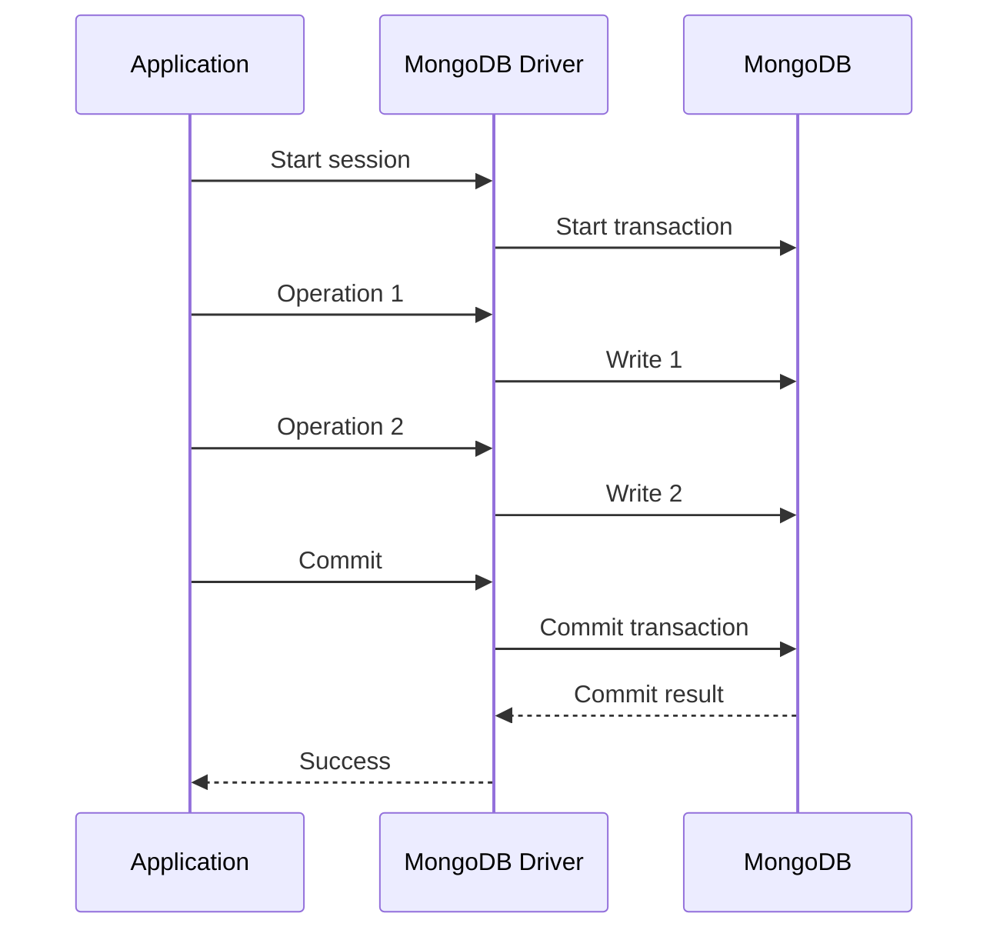
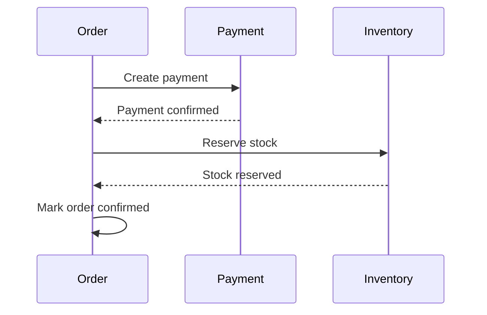
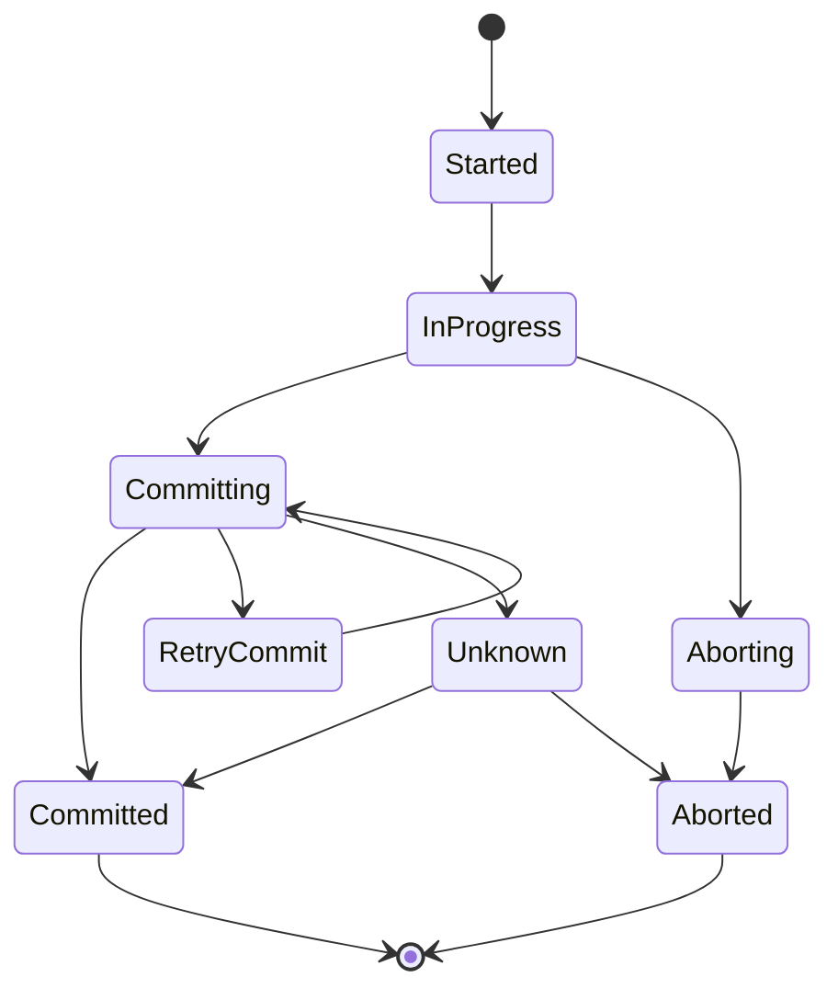

# 06- Transactions Questions

## Overview

MongoDB provides atomicity at the single-document level by default and supports multi-document transactions when a business operation must update multiple documents or collections atomically.

The senior-level question is not simply:

> How do I start a MongoDB transaction?

It is:

> Does this operation actually require a transaction, and what consistency, availability, latency, and failure guarantees should the system provide?

MongoDB transactions are useful, but they introduce coordination, resource usage, and operational complexity. Many MongoDB data models can avoid transactions by keeping related state inside a single document and using atomic single-document updates.

A useful decision model is:

```text
Business Operation
       ↓
Can all required state fit in one document?
       │
   ┌───┴───┐
  Yes      No
   │        │
Atomic      ↓
document   Are multiple documents required
operation  to change atomically?
            │
        ┌───┴───┐
       No       Yes
        │         │
Redesign /       Transaction
eventual          required
consistency
```

---

## What Is a MongoDB Transaction?

A transaction groups multiple database operations into a single atomic unit.

Conceptually:

```text
Transaction
    ├── Operation A
    ├── Operation B
    ├── Operation C
    └── Commit
```

If the transaction commits successfully, the changes become durable according to the configured write concern.

If the transaction aborts:

```text
Operation A ──┐
Operation B ──┤
Operation C ──┤
              ↓
            ABORT
              ↓
        No committed changes
```

Transactions are particularly useful when an invariant spans multiple documents or collections.

---

## Why Does MongoDB Need Transactions?

MongoDB's document model encourages embedding related state inside a single document.

For example:

```json
{
  "_id": "order-123",
  "status": "confirmed",
  "payment": {
    "status": "paid",
    "transaction_id": "txn-456"
  }
}
```

A single-document update is atomic.

However, some business operations naturally span multiple documents:

```text
orders
payments
inventory
ledger
```

For example:

```text
Create order
+
Reserve inventory
+
Create payment record
```

If these operations must succeed or fail together, a multi-document transaction may be appropriate.

---

## Single-Document Atomicity

MongoDB guarantees atomicity for writes to a single document.

Example:

```javascript
db.accounts.updateOne(
  {
    _id: "account-001",
    balance: {
      $gte: 500
    }
  },
  {
    $inc: {
      balance: -500
    }
  }
)
```

The filter and update are part of the same atomic document operation.

This is safer than:

```text
Read balance
    ↓
Check balance
    ↓
Calculate new balance
    ↓
Write balance
```

because concurrent requests could otherwise operate on stale state.

---

## Atomic Update Pattern

Prefer:

```javascript
db.inventory.updateOne(
  {
    _id: "product-123",
    available: {
      $gte: 1
    }
  },
  {
    $inc: {
      available: -1
    }
  }
)
```

over:

```text
find product
     ↓
check available
     ↓
application calculates value
     ↓
update product
```

The first pattern allows MongoDB to evaluate the condition and update atomically.

This often eliminates the need for a transaction.

---

## When Should You Use a Transaction?

Use a multi-document transaction when:

- Multiple documents must change atomically.
- A business invariant spans multiple documents.
- Partial completion would leave invalid business state.
- Compensation is not sufficient.
- The operation genuinely requires ACID behavior across documents.

Examples:

```text
Transfer money between accounts
Create order + payment record
Update multiple inventory records atomically
Maintain related financial ledger state
```

The exact suitability depends on the business invariant and architecture.

---

## When Should You Avoid a Transaction?

Avoid transactions when:

- A single atomic document update is sufficient.
- Eventual consistency is acceptable.
- The workflow can use idempotent operations.
- A transaction would span unrelated services.
- The transaction would remain open while waiting on external systems.
- The operation is a large batch better handled asynchronously.

For example, do not hold a database transaction open while calling:

```text
Payment provider
     ↓
HTTP API
     ↓
External service
```

A database transaction should not be used as a distributed transaction across arbitrary external systems.

---

## Transaction vs Single-Document Atomicity

| Property | Single Document | Multi-Document Transaction |
|---|---|---|
| Atomicity | Yes | Yes |
| Complexity | Low | Higher |
| Performance overhead | Lower | Higher |
| Scope | One document | Multiple documents |
| Typical use | State updates | Cross-document invariants |
| Failure handling | Simpler | More complex |
| Scaling | Easier | Requires more coordination |
| Preferred default | Yes | Only when required |

---

## MongoDB Transactions vs Relational Transactions

MongoDB transactions provide ACID semantics across multiple documents and collections.

Relational databases traditionally center transaction boundaries around rows and tables.

The architectural difference is important:

```text
Relational modeling
Tables
   ↓
JOINs
   ↓
Transaction

MongoDB modeling
Aggregate document
   ↓
Atomic document operation
```

MongoDB encourages modeling related state so that common operations can be completed atomically within one document.

Transactions should therefore complement good document modeling rather than compensate for a relational schema copied directly into MongoDB.

---

## Transaction Architecture

A typical transaction lifecycle is:



If an error occurs:

```text
Operation 1
    ↓
Operation 2
    ↓
Error
    ↓
Abort transaction
    ↓
Rollback uncommitted changes
```

---

## MongoDB Sessions

Transactions are associated with client sessions.

In PyMongo:

```python
session = client.start_session()
```

The session provides the context in which transaction operations occur.

A transaction should not be thought of as simply:

```python
client.transaction(...)
```

The application must establish a session and execute the operations within that transaction context.

---

## Transaction Lifecycle

A simplified lifecycle is:

```text
Start session
    ↓
Start transaction
    ↓
Execute operations
    ↓
Commit
    │
    ├── Success → Transaction committed
    │
    └── Failure → Abort / retry according to error
```

The application must correctly handle:

- Operation errors.
- Commit errors.
- Transient transaction errors.
- Network failures.
- Retryable conditions.
- Application exceptions.

---

## Python Transaction Example

Using PyMongo:

```python
from pymongo import MongoClient

client = MongoClient(
    mongodb_uri,
    serverSelectionTimeoutMS=5000,
)

db = client["payments"]
accounts = db["accounts"]


def transfer(
    from_account: str,
    to_account: str,
    amount: int,
) -> None:
    with client.start_session() as session:
        with session.start_transaction():
            debit = accounts.update_one(
                {
                    "_id": from_account,
                    "balance": {"$gte": amount},
                },
                {
                    "$inc": {"balance": -amount},
                },
                session=session,
            )

            if debit.modified_count != 1:
                raise ValueError("Insufficient funds or source account missing")

            credit = accounts.update_one(
                {
                    "_id": to_account,
                },
                {
                    "$inc": {"balance": amount},
                },
                session=session,
            )

            if credit.modified_count != 1:
                raise ValueError("Destination account missing")
```

The important detail is that each database operation receives:

```python
session=session
```

Without associating operations with the session, they are not part of the transaction.

---

## Transaction Context Manager

Using:

```python
with session.start_transaction():
```

allows exceptions raised inside the block to abort the transaction.

Conceptually:

```python
with session.start_transaction():
    operation_a()
    operation_b()
    operation_c()
```

If all operations succeed:

```text
COMMIT
```

If an exception escapes:

```text
ABORT
```

This pattern is generally easier to reason about than manually managing every transaction state.

---

## Transaction Commit

A transaction is not complete merely because all individual operations succeeded.

The application must successfully commit it.

Conceptually:

```text
Operation A → success
Operation B → success
Operation C → success
                ↓
             COMMIT
                ↓
             success
```

The commit itself can encounter transient errors.

Therefore, production transaction handling must distinguish between:

```text
Operation failure
```

and:

```text
Commit uncertainty / transient failure
```

---

## Transaction Abort

A transaction can be explicitly aborted:

```python
session.abort_transaction()
```

or aborted because an exception escapes the transaction context.

Use explicit abort logic when manually managing transaction lifecycles.

For most application code, context managers reduce accidental transaction leaks.

---

## Transaction Error Handling

A robust transaction implementation should account for MongoDB's transaction error labels and retry semantics.

Conceptually:

```text
Transaction
    ↓
Operation error?
    ├── Yes → Determine whether retry is safe
    └── No
         ↓
      Commit
         ↓
Commit error?
    ├── Retryable commit error → retry commit
    └── Non-retryable → fail
```

Do not blindly retry every exception.

Retries must preserve business correctness.

---

## Transient Transaction Errors

Distributed systems can experience temporary conditions such as:

- Primary elections.
- Network interruptions.
- Transient server errors.
- Replica-set topology changes.

Some transaction errors can be retried safely.

Drivers provide transaction-related error labels that applications can use to distinguish retryable conditions.

---

## Retryable Writes vs Transaction Retries

These are related but different concepts.

| Mechanism | Purpose |
|---|---|
| Retryable write | Retry certain individual write operations |
| Transaction retry | Retry an entire transaction when appropriate |
| Commit retry | Retry transaction commit in supported scenarios |

Do not assume that enabling retryable writes means your entire business transaction is automatically safe to retry.

---

## Idempotency and Transactions

Transactions do not remove the need for idempotency.

Suppose an API:

```text
POST /payments
```

creates a payment transaction.

The client may retry because of a network timeout.

The server may receive the request twice.

A transaction alone does not automatically guarantee that the business operation happens only once.

Use an idempotency key:

```json
{
  "idempotency_key": "req-123",
  "amount": 500
}
```

and enforce uniqueness:

```javascript
db.payments.createIndex(
  {
    idempotency_key: 1
  },
  {
    unique: true
  }
)
```

Transactions and idempotency solve different problems.

---

## Read Concern

Read concern determines the consistency characteristics of reads.

Common levels include:

```text
local
available
majority
linearizable
snapshot
```

The appropriate level depends on workload requirements and deployment topology.

The key interview point is:

> Read concern controls what level of committed or durable data a read is allowed to observe.

Do not choose a stronger level simply because it sounds safer. Stronger consistency can introduce latency or availability trade-offs.

---

## `local` Read Concern

`local` generally allows reads to return the most recent data available to the node serving the read.

It does not provide the same guarantees as majority-committed reads.

Useful when:

- Low latency matters.
- Some weaker consistency is acceptable.
- The application does not require majority-committed visibility.

---

## `majority` Read Concern

`majority` provides stronger guarantees around data acknowledged as committed by a majority of voting members.

It is useful when applications need stronger consistency semantics than simply reading whatever is locally available.

The exact behavior depends on deployment topology and transaction context.

---

## `snapshot` Read Concern

Snapshot reads provide a consistent view across the operations in a transaction under supported configurations.

This is particularly useful when a transaction needs to reason about multiple reads against a consistent snapshot.

---

## `linearizable` Read Concern

Linearizable reads provide very strong consistency semantics for eligible single-document reads from the primary.

They are useful only when the application genuinely requires such strong guarantees.

They can have higher latency and availability implications than weaker read concerns.

---

## Write Concern

Write concern controls how much acknowledgment MongoDB requires before reporting a write as successful.

Examples:

```javascript
{
  w: 1
}
```

and:

```javascript
{
  w: "majority"
}
```

Conceptually:

```text
Application
    ↓
MongoDB Primary
    ↓
Replication
    ↓
Acknowledgment
```

The acknowledgment point depends on the selected write concern.

---

## `w: 1`

A write with:

```javascript
{
  w: 1
}
```

generally waits for acknowledgment from the primary.

It does not provide the same durability guarantee as waiting for majority acknowledgment.

It may be suitable for workloads where lower latency is prioritized and the application can tolerate weaker durability semantics.

---

## `w: "majority"`

Majority write concern waits for acknowledgment from a majority of voting members, subject to the deployment and configuration.

It is commonly used when stronger durability guarantees are important.

Typical production workloads involving important business state often favor majority acknowledgment, but the final setting should reflect actual durability requirements.

---

## Unacknowledged Writes

Unacknowledged writes use:

```javascript
{
  w: 0
}
```

The client does not wait for normal write acknowledgment.

This can reduce client-side waiting but weakens error detection.

For critical business operations, unacknowledged writes are generally inappropriate because the application cannot reliably know whether the operation succeeded.

---

## Read Preference

Read preference controls which replica-set members can serve reads.

Common modes include:

```text
primary
primaryPreferred
secondary
secondaryPreferred
nearest
```

Examples:

```text
primary
    ↓
Strong primary-oriented reads
```

versus:

```text
secondaryPreferred
    ↓
Potentially lower primary read load
    +
Possible replication lag
```

Read preference should be chosen based on consistency requirements.

---

## Read Preference and Transactions

Transactions have stricter requirements than ordinary reads.

A transaction must execute against the appropriate replica-set topology and transaction rules. It should not be designed around arbitrary secondary reads.

For transactional workflows, use the supported primary-oriented transaction behavior and explicit consistency requirements rather than attempting to distribute transaction operations across unrelated members.

---

## Transaction and Replica Sets

Multi-document transactions require an appropriate MongoDB deployment configuration.

Production transactions are commonly used with:

```text
Replica Set
```

or:

```text
Sharded Cluster
```

A standalone development MongoDB instance does not provide the same transaction environment as a production replica-set deployment.

This is an important local-development trap.

---

## Transactions and Sharding

Transactions can operate across multiple shards in supported MongoDB deployments.

However, distributed transactions can introduce additional coordination and latency.

Therefore:

```text
Single shard transaction
```

is generally simpler than:

```text
Cross-shard transaction
```

This is one reason shard-key design matters.

A schema that naturally routes related transactional operations to the same shard can reduce distributed coordination.

---

## Transaction Performance

Transactions have overhead.

Potential costs include:

- Session management.
- Snapshot/transaction state.
- Locking and concurrency effects.
- Replication coordination.
- Additional network round trips.
- Larger resource usage.
- Longer-lived transaction state.

A transaction containing:

```text
2 operations
```

is very different operationally from one containing:

```text
200 operations
```

Keep transactions small and focused.

---

## Transaction Duration

Long-running transactions are dangerous.

Avoid:

```text
Start transaction
    ↓
Call external API
    ↓
Wait 10 seconds
    ↓
Process large dataset
    ↓
Call another service
    ↓
Commit
```

Prefer:

```text
Prepare external state
        ↓
Short database transaction
        ↓
Commit
        ↓
Publish / continue workflow
```

Transactions should normally contain only the database operations required to preserve the business invariant.

---

## Transaction Boundaries

A transaction boundary should represent a business atomicity boundary.

Good:

```text
Debit account
+
Credit account
```

Questionable:

```text
Create user
+
Send email
+
Call CRM
+
Update analytics
+
Publish marketing event
```

The latter crosses multiple external systems and should generally use an orchestration or event-driven design rather than keeping a database transaction open.

---

## Transactions and Microservices

A common anti-pattern is attempting to use one database transaction across multiple microservices.

Example:

```text
Order Service
     ↓
Payment Service
     ↓
Inventory Service
```

Do not assume MongoDB transactions provide distributed atomicity across independent services and their databases.

Instead consider:

```text
Saga
+
Events
+
Idempotency
+
Compensation
```

For example:



Failure handling can use compensating operations where necessary.

---

## Transactions and Kafka

Kafka can be used for event-driven workflows around MongoDB transactions.

A common architecture is:

```text
MongoDB Transaction
        ↓
Business State + Outbox Event
        ↓
Outbox Processor
        ↓
Kafka
        ↓
Consumers
```

The database transaction can atomically persist:

```text
business state
+
outbox event
```

The event is then published asynchronously.

This avoids trying to make MongoDB and Kafka participate in one distributed transaction.

---

## Transactional Outbox Pattern

Example:

```javascript
db.orders.insertOne({
  _id: "order-123",
  status: "confirmed"
})

db.outbox.insertOne({
  event_id: "event-123",
  type: "OrderConfirmed",
  aggregate_id: "order-123",
  status: "pending"
})
```

Both operations can occur in the same MongoDB transaction.

Then a worker publishes the outbox event to Kafka.

```text
MongoDB
   │
   ├── orders
   └── outbox
          ↓
      Worker
          ↓
        Kafka
```

Consumers should still be idempotent.

---

## Transaction Design for Inventory

Suppose an order requires three inventory updates:

```text
Product A: -2
Product B: -1
Product C: -5
```

If all inventory documents must change atomically:

```text
Start transaction
    ↓
Reserve A
    ↓
Reserve B
    ↓
Reserve C
    ↓
Commit
```

If any reservation fails:

```text
Abort
```

However, if inventory reservation can be modeled as independent idempotent operations with compensation, a transaction may not be necessary.

The business invariant determines the correct architecture.

---

## Transaction Design for Money Transfer

A classic example:

```text
Account A: -500
Account B: +500
```

A transaction is appropriate if the system requires:

```text
Either both balances change
or neither changes
```

Example:

```python
with client.start_session() as session:
    with session.start_transaction():
        debit_account(session, "A", 500)
        credit_account(session, "B", 500)
```

The application should also enforce:

- Sufficient funds.
- Valid accounts.
- Idempotency.
- Correct currency.
- Auditability.
- Retry-safe behavior.

The transaction is only one part of the financial correctness model.

---

## Transaction Design for Order Creation

Consider:

```text
orders
payments
```

The application may require:

```text
Create order
+
Create initial payment state
```

If both records must be committed atomically:

```text
Transaction
    ├── Insert order
    └── Insert payment
```

But an actual external payment capture should normally happen outside the database transaction:

```text
Create order/payment intent
        ↓
Commit
        ↓
Call payment provider
        ↓
Update payment result
```

This avoids holding database resources while waiting on an external service.

---

## Transaction Design and Schema Modeling

Good MongoDB modeling can eliminate many transactions.

Instead of:

```text
orders
order_items
shipping_address
payment_summary
```

consider embedding data that belongs naturally to the order:

```json
{
  "_id": "order-123",
  "items": [
    {
      "product_id": "product-1",
      "quantity": 2
    }
  ],
  "shipping_address": {
    "city": "Kolkata",
    "country": "IN"
  },
  "payment": {
    "status": "pending"
  }
}
```

Then a status change may require only one atomic update.

---

## Transaction Anti-Pattern: Relational Schema in MongoDB

A common mistake is modeling:

```text
users
addresses
orders
order_items
payments
shipments
```

as if MongoDB were PostgreSQL and then using transactions for every operation.

The better question is:

> Which data belongs to the same aggregate and changes together?

If data naturally belongs together, embedding can reduce transaction requirements.

---

## Transaction Anti-Pattern: Huge Batch Transaction

Bad:

```text
Start transaction
    ↓
Process 1,000,000 documents
    ↓
Commit
```

Potential problems:

- Long transaction lifetime.
- Increased resource usage.
- Larger rollback scope.
- More contention.
- Higher failure cost.
- Operational difficulty.

Prefer bounded batches or asynchronous processing when business requirements allow it.

---

## Transaction Anti-Pattern: External API Inside Transaction

Bad:

```python
with session.start_transaction():
    update_database()
    payment_client.charge()
    update_database_again()
```

If the payment service takes 10 seconds, the database transaction remains open.

Better:

```text
Create local intent
      ↓
Commit
      ↓
Call payment provider
      ↓
Persist result
```

Use idempotency and state transitions to handle retries and failures.

---

## Transaction Anti-Pattern: Assuming Commit Failure Means Rollback

A network failure during commit can create uncertainty from the application's perspective.

The client may not know whether the server committed the transaction.

Therefore, transaction retry logic must follow MongoDB's documented error-label semantics rather than assuming:

```text
Commit error
    =
Definitely rolled back
```

This is a critical distributed-systems concept.

---

## Transaction State Machine

A useful mental model:



The important point is that a network error can sometimes leave the client uncertain about the final commit state.

---

## Transaction Isolation

MongoDB transactions provide isolation semantics appropriate to their configured read concern and deployment.

Applications should not assume that transaction behavior is identical to every relational database isolation mode.

The exact guarantee depends on:

- Read concern.
- Write concern.
- Transaction boundaries.
- Replica-set topology.
- Sharded topology.
- Operation ordering.

Senior engineers should specify the required consistency behavior instead of simply saying:

> MongoDB transactions are ACID.

---

## Consistency Trade-Offs

Transaction-related configuration affects:

```text
Consistency
     ↕
Latency
     ↕
Availability
     ↕
Durability
```

For example:

```text
Majority write concern
+
Strong read semantics
```

may provide stronger guarantees but can require more coordination than weaker settings.

Configuration should follow business requirements.

---

## Transaction Options in PyMongo

PyMongo supports transaction options through `start_transaction()`.

Example:

```python
from pymongo import ReadConcern, WriteConcern

with client.start_session() as session:
    with session.start_transaction(
        read_concern=ReadConcern("snapshot"),
        write_concern=WriteConcern("majority"),
    ):
        collection.update_one(
            {"_id": "order-123"},
            {"$set": {"status": "confirmed"}},
            session=session,
        )
```

The correct options depend on the consistency and durability requirements of the workload.

---

## Production Transaction Configuration

Important configuration dimensions include:

| Concern | Question |
|---|---|
| Read concern | What data visibility is required? |
| Write concern | What acknowledgment is required? |
| Read preference | Which members may serve reads? |
| Timeout | How long can an operation wait? |
| Retry | Which failures are retryable? |
| Idempotency | Can the business operation safely repeat? |
| Transaction size | How much work is inside one transaction? |
| Duration | How long can the transaction remain open? |

---

## Transaction Timeouts

Applications should bound transaction execution.

A transaction that waits indefinitely is dangerous.

Timeouts should reflect:

```text
Expected DB latency
+
Network latency
+
Application SLA
```

Do not simply increase timeout values when transactions become slow.

Investigate why the transaction is slow.

---

## Connection Pooling and Transactions

Transactions consume connections and session resources.

In a high-concurrency API:

```text
1,000 requests
    ↓
many concurrent transactions
    ↓
connection pressure
```

Monitor:

- Connection pool utilization.
- Operation latency.
- Transaction duration.
- Request concurrency.
- Database resource utilization.

Connection pool settings should be aligned with actual application concurrency and MongoDB capacity.

---

## Transactions and Connection Management in FastAPI

A FastAPI service should normally reuse a process-level `MongoClient`.

Conceptually:

```python
from contextlib import asynccontextmanager

from fastapi import FastAPI
from pymongo import MongoClient

client = MongoClient(mongodb_uri)


@asynccontextmanager
async def lifespan(app: FastAPI):
    app.state.mongo_client = client
    yield
    client.close()


app = FastAPI(lifespan=lifespan)
```

A synchronous PyMongo client performs blocking database operations.

For an async FastAPI application, choose the current MongoDB-supported async driver approach appropriate to the application's dependency and MongoDB version rather than arbitrarily running blocking PyMongo operations directly on the event loop.

---

## Transactions in a Repository Layer

A repository can accept a session:

```python
from pymongo.client_session import ClientSession


class AccountRepository:
    def __init__(self, collection):
        self.collection = collection

    def debit(
        self,
        account_id: str,
        amount: int,
        *,
        session: ClientSession,
    ):
        return self.collection.update_one(
            {
                "_id": account_id,
                "balance": {"$gte": amount},
            },
            {
                "$inc": {"balance": -amount},
            },
            session=session,
        )
```

The service layer controls the transaction boundary:

```python
with client.start_session() as session:
    with session.start_transaction():
        accounts.debit(
            account_id,
            amount,
            session=session,
        )
        accounts.credit(
            destination_id,
            amount,
            session=session,
        )
```

This keeps transaction orchestration separate from individual repository operations.

---

## Why the Service Layer Should Own the Transaction

A repository should generally answer:

> How do I perform this database operation?

The service should answer:

> Which operations form one business transaction?

For example:

```text
Service
  ├── begin transaction
  ├── repository.debit()
  ├── repository.credit()
  └── commit
```

This makes transaction boundaries visible and testable.

---

## Transaction Testing

Transaction tests should verify:

- All operations commit together.
- Any required failure aborts the transaction.
- Retry behavior is correct.
- Duplicate requests are safe.
- Idempotency constraints work.
- Transaction boundaries are correct.
- External calls are not unintentionally performed inside transactions.

Example scenario:

```text
Debit succeeds
Credit fails
    ↓
Transaction aborts
    ↓
Debit is not committed
```

Do not test only the successful path.

---

## Failure Injection Testing

Production transaction behavior should be tested against failures such as:

```text
Primary election
Network interruption
Timeout
Duplicate request
Write conflict
Application exception
Commit uncertainty
```

Failure testing is especially important for financial, inventory, and workflow systems.

---

## Transactions and Change Streams

A committed transaction can produce multiple change events.

Consumers may observe transaction-related changes with transaction metadata.

Event-driven systems should therefore avoid assuming:

```text
One business transaction
=
One MongoDB change event
```

If consumers need a single business event, use an explicit outbox/event model.

---

## Transactions and Change Streams with Kafka

A robust pattern is:

```text
MongoDB Transaction
       │
       ├── Business state
       └── Outbox event
                │
                ↓
          Change Stream
                │
                ↓
          Event Processor
                │
                ↓
              Kafka
```

This gives the application a durable boundary between state mutation and event publication.

Consumers should use:

- Idempotency.
- Resume tokens.
- Retry handling.
- Dead-letter handling where appropriate.

---

## Transactions and Security

Transactions do not bypass authorization.

Every operation inside a transaction must still respect:

- Authentication.
- Authorization.
- Tenant boundaries.
- Least privilege.
- Field-level data access rules at the application layer where required.

A transaction containing:

```javascript
updateOne({
  _id: account_id
})
```

must still verify that the authenticated principal is allowed to modify that account.

---

## Transactions and Multi-Tenancy

Tenant-scoped systems should include tenant identity in transactional operations.

For example:

```javascript
db.orders.updateOne(
  {
    _id: order_id,
    tenant_id: tenant_id
  },
  {
    $set: {
      status: "confirmed"
    }
  },
  {
    session: session
  }
)
```

Do not assume that starting a transaction automatically provides tenant isolation.

Authorization and tenant scoping remain explicit application concerns.

---

## Transaction Monitoring

Monitor:

```text
Transaction count
Transaction duration
Transaction aborts
Transaction retries
Commit latency
Write conflicts
Connection pool utilization
Replication lag
CPU
Memory
Storage latency
```

High transaction duration is often a signal that the transaction boundary is too broad or the underlying workload needs optimization.

---

## Transaction Performance Investigation

When transactions become slow:

```text
Slow transaction
      ↓
Measure transaction duration
      ↓
Identify operations inside transaction
      ↓
Measure each operation
      ↓
Run explain() where appropriate
      ↓
Check indexes
      ↓
Check document contention
      ↓
Check connection pressure
      ↓
Check replication / topology
      ↓
Reduce transaction scope
      ↓
Benchmark
```

Do not immediately increase transaction timeouts.

---

## Transaction Troubleshooting Methodology

### Symptom

```text
Transactions frequently abort.
```

### Possible Causes

- Write conflicts.
- Primary election.
- Network interruption.
- Transaction timeout.
- Invalid transaction usage.
- Resource pressure.
- Long-running transaction.
- Application exception.

### Isolation Strategy

Determine whether failures correlate with:

```text
specific operation
+
specific collection
+
specific deployment event
+
specific traffic pattern
```

### Diagnostic Commands

Inspect replica-set status:

```javascript
rs.status()
```

Inspect server status:

```javascript
db.serverStatus()
```

Inspect collection and index behavior:

```javascript
db.collection.stats()
```

Analyze individual queries:

```javascript
db.collection.explain(
  "executionStats"
).find({
  // transaction query
})
```

### Root Cause

Classify the issue:

```text
Application
Database query
Data model
Topology
Resource saturation
Transient infrastructure failure
```

### Corrective Action

Possible actions:

- Reduce transaction scope.
- Add or correct an index.
- Reduce contention.
- Fix retry handling.
- Correct write concern.
- Improve connection management.
- Redesign the workflow.

### Prevention

Add:

- Metrics.
- Alerts.
- Retry tests.
- Failure injection tests.
- Query performance tests.
- Transaction duration monitoring.

---

## Common Transaction Mistakes

### Using Transactions for Every Write

Why it happens:

> Transactions are safer.

Why it is wrong:

Single-document atomic operations are simpler and usually cheaper.

Use transactions when the business invariant actually spans multiple documents.

---

### Holding Transactions Open During HTTP Calls

Why it happens:

> The developer wants the entire workflow to be atomic.

Why it is dangerous:

- Long transaction lifetime.
- Increased resource usage.
- External service latency.
- Higher failure probability.

Use durable state transitions and idempotent workflows instead.

---

### Forgetting the Session

Incorrect:

```python
with session.start_transaction():
    collection.update_one(
        {"_id": "123"},
        {"$set": {"status": "done"}},
    )
```

Correct:

```python
with session.start_transaction():
    collection.update_one(
        {"_id": "123"},
        {"$set": {"status": "done"}},
        session=session,
    )
```

Every operation intended to participate in the transaction must use the transaction session.

---

### Retrying a Transaction Without Idempotency

A retry may repeat application-level work.

For example:

```text
Create payment
    ↓
Timeout
    ↓
Retry
    ↓
Create payment again
```

Use idempotency keys and database constraints where the operation must be logically unique.

---

### Assuming Network Failure Means Rollback

A client-side network failure does not necessarily tell the application the final state of the server-side transaction.

Commit handling must follow the driver's transaction error semantics.

---

### Creating Huge Transactions

Large transactions increase:

- Resource usage.
- Duration.
- Failure scope.
- Operational complexity.

Keep transactions small and focused.

---

### Using a Transaction Instead of Better Modeling

If:

```text
Order
+
Order items
+
Shipping address
```

always change together, embedding some of this state may be better than maintaining multiple documents through transactions.

---

## Interview Question: Are MongoDB Operations Atomic?

A strong answer:

> Single-document writes are atomic. MongoDB also supports multi-document transactions when atomicity must span multiple documents or collections. The preferred design is usually to model related state within one document when practical, because single-document atomic operations have lower complexity and overhead.

---

## Interview Question: When Would You Use a MongoDB Transaction?

Use one when:

- Multiple documents must change atomically.
- Partial completion violates a business invariant.
- A single-document atomic update cannot represent the required operation.
- Compensation or eventual consistency is insufficient.

Examples include certain account transfers and multi-document inventory or order state changes.

---

## Interview Question: When Should You Avoid Transactions?

Avoid them when:

- One document can represent the operation.
- Eventual consistency is acceptable.
- The operation is naturally asynchronous.
- The workflow calls external services.
- A saga or outbox pattern is more appropriate.
- The transaction would become large or long-running.

---

## Interview Question: What Is a Session?

A session provides execution context for operations and is required for MongoDB multi-document transactions.

In PyMongo:

```python
with client.start_session() as session:
    ...
```

Operations participating in the transaction use:

```python
session=session
```

---

## Interview Question: What Happens If a Transaction Operation Fails?

The transaction can be aborted, and uncommitted changes are not committed as part of that transaction.

The application must distinguish between:

- Validation/application failures.
- Transient transaction errors.
- Retryable errors.
- Commit uncertainty.

A robust implementation follows MongoDB driver's documented retry semantics.

---

## Interview Question: Are Transactions ACID?

MongoDB supports ACID transactions across multiple documents and collections.

But an interview-quality answer should explain:

```text
Atomicity
Consistency
Isolation
Durability
```

in the context of:

- Read concern.
- Write concern.
- Replica-set topology.
- Transaction lifecycle.
- Application retry behavior.

Simply saying "MongoDB supports ACID" is incomplete.

---

## Interview Question: What Is the Difference Between Read Concern and Write Concern?

**Read concern** controls the consistency/visibility characteristics of data returned by reads.

**Write concern** controls how much acknowledgment is required before a write is considered successful.

For example:

```text
Read concern
→ What data can I observe?

Write concern
→ When can MongoDB tell me the write succeeded?
```

They address different sides of database consistency and durability.

---

## Interview Question: What Is the Difference Between a Transaction and Idempotency?

A transaction controls atomicity across database operations.

Idempotency controls the effect of repeated execution of a logical operation.

They solve different problems:

```text
Transaction
→ Atomicity

Idempotency
→ Safe retry / duplicate prevention
```

Production systems often need both.

---

## Interview Question: Can a MongoDB Transaction Include External API Calls?

The application can technically make an external call while a transaction is open, but this is generally a poor design.

Do not keep transactions open while waiting for:

```text
HTTP
Payment provider
Kafka
gRPC
Another microservice
Human action
```

Use state transitions, outbox patterns, sagas, or compensating actions instead.

---

## Interview Question: How Would You Design an Order Workflow Without a Distributed Transaction?

One possible architecture:

```text
Create Order
    ↓
Persist Order + Outbox Event
    ↓
Commit MongoDB Transaction
    ↓
Publish OrderCreated
    ↓
Payment Service
    ↓
Inventory Service
    ↓
Order state transitions
```

Each service maintains its own local transaction boundary.

Failures are handled using:

- Idempotency.
- Retries.
- Events.
- Compensating actions.
- Explicit workflow states.

---

## Senior Transaction Design Checklist

Before introducing a transaction, ask:

- What business invariant requires atomicity?
- Can the state be represented in one document?
- Can an atomic update solve the problem?
- How many documents are involved?
- How long will the transaction run?
- Are any external services involved?
- What read concern is required?
- What write concern is required?
- What happens during a primary election?
- Is the operation idempotent?
- Can the transaction safely be retried?
- What happens if commit becomes uncertain?
- Is this a cross-shard transaction?
- How will transaction duration be monitored?
- Can the workflow instead use an outbox or saga?

---

## Transaction Architecture Decision Matrix

| Requirement | Typical Approach |
|---|---|
| Update one document atomically | Single-document update |
| Maintain bounded embedded state | Single-document update |
| Change several documents atomically | Multi-document transaction |
| External payment workflow | State machine + idempotency |
| Cross-service workflow | Saga / events |
| MongoDB + Kafka atomic publication | Transactional outbox |
| Large asynchronous batch | Bounded batches / workers |
| Duplicate API requests | Idempotency key |
| Strong durability | Appropriate majority write concern |
| Consistent transactional reads | Appropriate transaction read concern |

---

## Production Review Checklist

Before deploying a transaction-heavy feature:

```text
Business invariant identified
        ↓
Single-document alternative evaluated
        ↓
Transaction boundary defined
        ↓
Indexes verified
        ↓
Transaction duration measured
        ↓
Retry semantics implemented
        ↓
Idempotency implemented
        ↓
External calls removed from transaction
        ↓
Read/write concerns reviewed
        ↓
Failure scenarios tested
        ↓
Monitoring configured
        ↓
Load tested
```

---

## Key Takeaways

- **Prefer single-document atomic operations when possible**; MongoDB's document model is designed to reduce the need for multi-document transactions.
- Use transactions only when a genuine **cross-document business invariant** requires atomic commit, and keep transaction scope and duration small.
- **Transactions and idempotency solve different problems**: transactions provide database atomicity, while idempotency makes retries and duplicate requests safe.
- Production transaction design must account for **sessions, read/write concerns, retryable errors, commit uncertainty, replica-set topology, connection pressure, and failure handling**.
- Avoid distributed transactions across microservices and external systems; use **state machines, transactional outbox, events, sagas, and compensating actions** where appropriate.