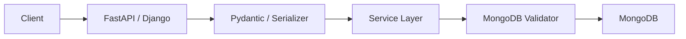
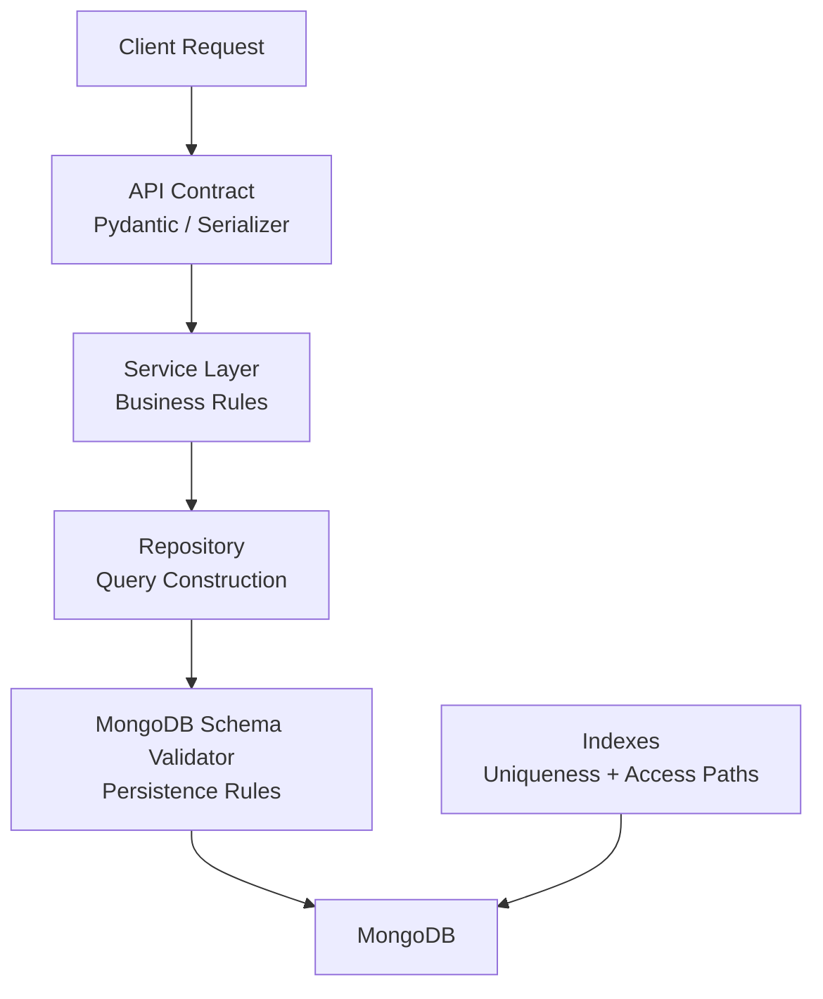

# 07- Schema Validation Questions

## Overview

MongoDB is schema-flexible, but schema flexibility does not mean that production applications should accept arbitrary document structures.

A production MongoDB system typically combines several validation layers:

```text
Client Request
     ↓
API Validation
     ↓
Business Validation
     ↓
MongoDB Schema Validation
     ↓
Database
```

Each layer solves a different problem:

| Layer | Primary responsibility |
|---|---|
| API / Pydantic / serializer | Validate request shape and user input |
| Service layer | Validate business rules |
| MongoDB schema validation | Protect persisted document structure |
| Indexes | Enforce uniqueness and support access patterns |
| Application authorization | Control who may perform the operation |

MongoDB schema validation is therefore a **database integrity boundary**, not a replacement for application validation.

---

## Why Does MongoDB Need Schema Validation?

MongoDB's flexible document model allows documents in the same collection to have different fields.

For example:

```json
{
  "_id": "user-001",
  "name": "Alice",
  "email": "alice@example.com"
}
```

and:

```json
{
  "_id": "user-002",
  "name": 123,
  "email": ["invalid"],
  "legacy": true
}
```

can coexist unless the application or database imposes constraints.

This flexibility is useful during development and schema evolution, but unrestricted flexibility can create production problems:

- Inconsistent field types.
- Missing required fields.
- Unexpected nested structures.
- Broken aggregations.
- Difficult migrations.
- Application serialization failures.
- Inconsistent API responses.
- Invalid data entering through scripts or administrative tools.

Schema validation provides a database-level mechanism for preventing or controlling invalid documents.

---

## Schema Flexibility vs Schema Validation

These concepts are not contradictory.

MongoDB can remain flexible while enforcing important invariants.

For example:

```text
Flexible schema
        +
Required core fields
        +
Type validation
        +
Application validation
        ↓
Controlled production schema
```

A useful production approach is:

> Be flexible about fields that genuinely evolve, but strict about fields whose type and presence are fundamental to the system.

---

## Schema-on-Read vs Schema-on-Write

Traditional relational systems commonly enforce strong schema constraints before data is stored.

MongoDB supports flexible document structures, which can be used in a schema-on-read style.

However, MongoDB also supports schema validation.

This allows a hybrid approach:

```text
Schema flexibility
      +
Database validation
      +
Application-level models
```

For example, an application can permit additional metadata:

```json
{
  "name": "Alice",
  "email": "alice@example.com",
  "metadata": {
    "source": "import",
    "campaign": "spring"
  }
}
```

while still requiring:

```text
name → string
email → string
```

---

## JSON Schema Validation

MongoDB supports JSON Schema validation through the `$jsonSchema` operator.

Example:

```javascript
db.createCollection("users", {
  validator: {
    $jsonSchema: {
      bsonType: "object",
      required: [
        "name",
        "email"
      ],
      properties: {
        name: {
          bsonType: "string"
        },
        email: {
          bsonType: "string"
        }
      }
    }
  }
})
```

This creates a collection with database-level document validation.

---

## Basic Schema Structure

A typical MongoDB validator looks like:

```javascript
{
  validator: {
    $jsonSchema: {
      bsonType: "object",
      required: [...],
      properties: {
        ...
      }
    }
  }
}
```

Important components include:

- `bsonType`
- `required`
- `properties`
- `items`
- `minimum`
- `maximum`
- `minLength`
- `maxLength`
- `pattern`
- `enum`
- `oneOf`
- `anyOf`
- `allOf`

MongoDB's supported JSON Schema vocabulary should be checked against the MongoDB version used by the deployment.

---

## `bsonType`

MongoDB schema validation commonly uses `bsonType` rather than the generic JSON Schema `type`.

Example:

```javascript
{
  bsonType: "string"
}
```

Common BSON types include:

| `bsonType` | Example |
|---|---|
| `string` | `"Alice"` |
| `object` | `{}` |
| `array` | `[]` |
| `objectId` | `ObjectId("...")` |
| `date` | `ISODate("...")` |
| `bool` | `true` |
| `int` | `42` |
| `long` | `NumberLong(42)` |
| `double` | `42.5` |
| `decimal` | `Decimal128("42.50")` |
| `null` | `null` |

Type validation is particularly important because MongoDB allows different BSON types for the same field unless constraints are applied.

---

## Required Fields

Use `required` when a field must exist.

Example:

```javascript
{
  $jsonSchema: {
    bsonType: "object",
    required: [
      "customer_id",
      "status",
      "created_at"
    ]
  }
}
```

This ensures that these fields are present.

However:

> `required` means the field must exist; it does not by itself guarantee the field has the correct type.

Combine it with `properties`.

---

## Required + Type Validation

Production validation commonly combines both:

```javascript
{
  $jsonSchema: {
    bsonType: "object",
    required: [
      "customer_id",
      "status",
      "created_at"
    ],
    properties: {
      customer_id: {
        bsonType: "objectId"
      },
      status: {
        bsonType: "string"
      },
      created_at: {
        bsonType: "date"
      }
    }
  }
}
```

This enforces:

```text
customer_id exists → ObjectId
status exists → string
created_at exists → date
```

---

## Nested Object Validation

Suppose an order contains:

```json
{
  "shipping_address": {
    "city": "Kolkata",
    "postal_code": "700001"
  }
}
```

Validate the nested object:

```javascript
{
  $jsonSchema: {
    bsonType: "object",
    required: [
      "shipping_address"
    ],
    properties: {
      shipping_address: {
        bsonType: "object",
        required: [
          "city",
          "postal_code"
        ],
        properties: {
          city: {
            bsonType: "string"
          },
          postal_code: {
            bsonType: "string"
          }
        }
      }
    }
  }
}
```

Nested validation is useful when downstream code assumes a stable object structure.

---

## Array Validation

Suppose an order contains:

```json
{
  "items": [
    {
      "product_id": "product-001",
      "quantity": 2
    }
  ]
}
```

Validation:

```javascript
{
  $jsonSchema: {
    bsonType: "object",
    required: [
      "items"
    ],
    properties: {
      items: {
        bsonType: "array",
        minItems: 1,
        items: {
          bsonType: "object",
          required: [
            "product_id",
            "quantity"
          ],
          properties: {
            product_id: {
              bsonType: "objectId"
            },
            quantity: {
              bsonType: "int",
              minimum: 1
            }
          }
        }
      }
    }
  }
}
```

This validates both the array and the structure of each element.

---

## String Validation

MongoDB JSON Schema validation can constrain string properties.

Example:

```javascript
{
  bsonType: "string",
  minLength: 1,
  maxLength: 200
}
```

A regular expression can also be used where appropriate:

```javascript
{
  bsonType: "string",
  pattern: "^[A-Z]{2}-[0-9]{6}$"
}
```

Use regex validation carefully.

Complex business rules are generally better implemented in application code.

---

## Enum Validation

For fields with a finite set of valid values:

```javascript
{
  bsonType: "string",
  enum: [
    "pending",
    "confirmed",
    "cancelled"
  ]
}
```

This is useful for state fields.

Example:

```javascript
status: {
  bsonType: "string",
  enum: [
    "pending",
    "confirmed",
    "cancelled"
  ]
}
```

However, enum validation must be considered carefully during deployments because adding a new application state requires a compatible schema-validation rollout.

---

## Numeric Validation

Example:

```javascript
{
  bsonType: "decimal",
  minimum: 0
}
```

For monetary values, use an appropriate numeric representation such as `Decimal128` rather than binary floating-point values when exact decimal arithmetic is required.

Schema validation can enforce the type, but business rules such as:

```text
discount <= subtotal
tax = subtotal × tax_rate
```

belong in the service/domain layer.

---

## Date Validation

Example:

```javascript
{
  bsonType: "date"
}
```

This ensures the value is a BSON date rather than an arbitrary string.

Prefer:

```json
{
  "created_at": "BSON Date"
}
```

over inconsistent representations such as:

```json
{
  "created_at": "2026-09-25"
}
```

stored as strings in some documents and dates in others.

Consistent types simplify:

- Sorting.
- Range queries.
- Aggregation.
- Indexing.
- TTL indexes.
- Time-based analytics.

---

## Nullability

A common source of confusion is the difference between:

```text
Field missing
```

and:

```text
Field exists with null
```

For example:

```json
{
  "phone": null
}
```

is different from:

```json
{}
```

If `phone` may be null, define the accepted types appropriately.

For example:

```javascript
{
  bsonType: [
    "string",
    "null"
  ]
}
```

Use nullability deliberately rather than allowing multiple representations accidentally.

---

## Additional Properties

MongoDB validation can be used to control whether unspecified properties are accepted.

A strict schema can use:

```javascript
additionalProperties: false
```

Example:

```javascript
{
  $jsonSchema: {
    bsonType: "object",
    required: [
      "name",
      "email"
    ],
    additionalProperties: false,
    properties: {
      name: {
        bsonType: "string"
      },
      email: {
        bsonType: "string"
      }
    }
  }
}
```

This is strict.

It can prevent accidental fields but can also make schema evolution harder.

---

## Strict vs Flexible Validation

| Strategy | Advantages | Risks |
|---|---|---|
| Strict schema | Strong consistency | Harder evolution |
| Flexible schema | Easier evolution | More inconsistent data |
| Required core fields | Good balance | Some optional fields remain uncontrolled |
| `additionalProperties: false` | Strong contract | Requires coordinated deployments |
| Application-only validation | Rich business logic | Other writers can bypass it |
| DB + application validation | Defense in depth | More maintenance |

For most production systems, a controlled hybrid approach is practical.

---

## Validation Levels

MongoDB supports validation levels such as:

```text
strict
moderate
```

The validation level determines how validation applies to documents during updates.

A `strict` configuration applies validation broadly to inserts and updates.

A `moderate` configuration can be useful during migrations where legacy documents may not currently satisfy the new validator.

---

## Strict Validation

Example:

```javascript
db.runCommand({
  collMod: "users",
  validationLevel: "strict"
})
```

This is appropriate when the collection should maintain the schema consistently.

It is generally the desired long-term production state for core collections with well-defined contracts.

---

## Moderate Validation

Moderate validation can be useful when introducing constraints into an existing collection containing legacy documents.

The goal is to avoid making a schema migration unnecessarily disruptive.

A typical migration strategy is:

```text
Existing heterogeneous data
        ↓
Analyze violations
        ↓
Clean / migrate legacy data
        ↓
Introduce validation
        ↓
Monitor violations
        ↓
Move toward strict validation
```

Do not use `moderate` as a permanent substitute for cleaning a broken schema without understanding the consequences.

---

## Validation Actions

MongoDB supports validation actions such as:

```text
error
warn
```

`error` rejects documents that violate the validator.

`warn` allows the operation while generating a validation warning.

For production enforcement:

```javascript
validationAction: "error"
```

is generally appropriate once the application and existing data are compatible with the validator.

---

## Creating a Collection With Validation

Example:

```javascript
db.createCollection("orders", {
  validator: {
    $jsonSchema: {
      bsonType: "object",
      required: [
        "tenant_id",
        "customer_id",
        "status",
        "created_at"
      ],
      properties: {
        tenant_id: {
          bsonType: "objectId"
        },
        customer_id: {
          bsonType: "objectId"
        },
        status: {
          bsonType: "string",
          enum: [
            "pending",
            "confirmed",
            "cancelled"
          ]
        },
        created_at: {
          bsonType: "date"
        }
      }
    }
  },
  validationLevel: "strict",
  validationAction: "error"
})
```

---

## Updating Existing Collection Validation

For an existing collection, use `collMod`.

Example:

```javascript
db.runCommand({
  collMod: "orders",
  validator: {
    $jsonSchema: {
      bsonType: "object",
      required: [
        "tenant_id",
        "status"
      ],
      properties: {
        tenant_id: {
          bsonType: "objectId"
        },
        status: {
          bsonType: "string"
        }
      }
    }
  },
  validationLevel: "strict",
  validationAction: "error"
})
```

This is an operational schema change and should be reviewed and tested like any other production database migration.

---

## Inspecting Collection Validation

Use:

```javascript
db.getCollectionInfos({
  name: "orders"
})
```

or:

```javascript
db.runCommand({
  listCollections: 1,
  filter: {
    name: "orders"
  }
})
```

Inspect:

- Validator.
- Validation level.
- Validation action.

Do not rely only on application configuration to know the actual database constraints.

---

## Testing Validation

Test valid documents:

```javascript
db.orders.insertOne({
  tenant_id: ObjectId(),
  customer_id: ObjectId(),
  status: "pending",
  created_at: new Date()
})
```

Then test invalid data:

```javascript
db.orders.insertOne({
  tenant_id: "not-an-object-id",
  status: "unknown"
})
```

With:

```text
validationAction: "error"
```

the invalid write should be rejected.

---

## Validation Error Handling

Application code should distinguish validation failures from infrastructure failures.

In PyMongo:

```python
from pymongo.errors import WriteError

try:
    collection.insert_one(document)
except WriteError as exc:
    # Log structured diagnostic information without sensitive payloads.
    raise ValueError("Document failed MongoDB validation") from exc
```

Do not expose raw MongoDB error messages directly to API clients.

Map database validation failures to an appropriate API-level error contract.

---

## Application Validation vs Database Validation

A mature application generally uses both.

### Application Validation

Example with Pydantic:

```python
from datetime import datetime

from pydantic import BaseModel, Field


class OrderCreate(BaseModel):
    customer_id: str
    status: str = Field(pattern="^(pending|confirmed)$")
    created_at: datetime
```

Application validation provides:

- Better API errors.
- User-friendly messages.
- Business-level validation.
- Early rejection.
- Type conversion.

### Database Validation

MongoDB validation provides:

- Persistence-level protection.
- Protection against scripts.
- Protection against administrative writes.
- Protection against alternative application writers.

---

## Defense-in-Depth Validation

A production request might follow:



Each layer protects a different boundary.

Removing one layer should not accidentally remove every data-integrity control.

---

## Business Rules vs Schema Rules

Schema validation should enforce structural rules.

Good database-level rules:

```text
status must be string
created_at must be date
customer_id must be ObjectId
quantity must be positive integer
email must exist
```

Business rules are usually better in the application:

```text
Only confirmed orders can be shipped.
A cancelled order cannot be refunded twice.
A customer cannot exceed credit limit.
```

Some business invariants can be enforced using database mechanisms, but complex domain logic should not be encoded entirely into MongoDB validators.

---

## Validation and Uniqueness

Schema validation does not replace unique indexes.

For example:

```text
email must be string
```

is schema validation.

```text
email must be unique
```

is an index constraint.

Use:

```javascript
db.users.createIndex(
  {
    email: 1
  },
  {
    unique: true
  }
)
```

The two controls solve different problems.

---

## Validation and Indexes

Consider:

```text
Schema validation
        ↓
Correct data type
        ↓
Index
        ↓
Efficient access
```

For example:

```javascript
{
  email: {
    bsonType: "string"
  }
}
```

combined with:

```javascript
db.users.createIndex({
  email: 1
})
```

provides both structural correctness and efficient lookup.

---

## Validation and Transactions

Transactions do not bypass schema validation.

If a transaction attempts to insert an invalid document:

```text
Transaction
    ↓
Insert invalid document
    ↓
Validation failure
    ↓
Transaction fails / aborts according to application handling
```

Therefore, schema validation remains part of the database integrity boundary even when operations occur inside transactions.

---

## Validation and Bulk Writes

Schema validation applies to individual documents within bulk operations.

Example:

```python
from pymongo import InsertOne

operations = [
    InsertOne(valid_document),
    InsertOne(another_document),
]

collection.bulk_write(operations)
```

If one operation violates validation, application behavior should be designed around the bulk write's ordered/unordered semantics and returned write errors.

Do not assume that a bulk operation has all-or-nothing transaction semantics.

If true atomicity across multiple documents is required, use a transaction where appropriate.

---

## Ordered vs Unordered Bulk Operations

Bulk writes can be ordered:

```python
collection.bulk_write(
    operations,
    ordered=True,
)
```

or unordered:

```python
collection.bulk_write(
    operations,
    ordered=False,
)
```

Validation errors can affect execution differently depending on the mode.

For ingestion pipelines, unordered bulk writes can improve throughput because independent operations can continue after individual failures.

For workflows requiring atomicity, bulk writes alone are not a transaction.

---

## Schema Validation During Updates

Validation is not limited to inserts.

Updates can produce invalid documents too.

Example:

```javascript
db.users.updateOne(
  {
    _id: ObjectId("...")
  },
  {
    $set: {
      email: 12345
    }
  }
)
```

If the validator requires:

```javascript
email: {
  bsonType: "string"
}
```

the update should be rejected under enforcement settings.

This is important because schema migration and update code are common sources of accidental type drift.

---

## Replacement vs Modifier Updates

A replacement operation:

```javascript
db.users.replaceOne(
  {
    _id: user_id
  },
  {
    name: "Alice",
    email: "alice@example.com"
  }
)
```

replaces the document content other than the immutable `_id`.

A modifier update:

```javascript
db.users.updateOne(
  {
    _id: user_id
  },
  {
    $set: {
      email: "alice@example.com"
    }
  }
)
```

changes selected fields.

Strict schema validation makes replacement operations especially important because omitted required fields can cause validation failures.

---

## Validation and Schema Evolution

Schema validation must evolve with the application.

Suppose version one requires:

```text
name
email
```

and version two introduces:

```text
phone
```

A safe rollout may be:

```text
Deploy application capable of reading old + new shape
        ↓
Add optional validation
        ↓
Backfill existing data
        ↓
Deploy writers that populate phone
        ↓
Validate completeness
        ↓
Make phone required
```

Do not deploy a database validator requiring a field before all active writers are prepared to supply it.

---

## Backward-Compatible Schema Migration

A production schema migration should usually follow an expand-and-contract strategy.

```text
Current schema
     ↓
Expand validator
     ↓
Deploy compatible application
     ↓
Backfill data
     ↓
Verify
     ↓
Enforce new requirement
     ↓
Remove legacy support
```

This is especially important in rolling deployments where multiple application versions may run simultaneously.

---

## Multi-Version Application Deployments

Suppose Kubernetes is rolling out:

```text
v1 → v2
```

and v2 introduces:

```text
customer_tier
```

If MongoDB immediately requires:

```javascript
required: [
  "customer_tier"
]
```

v1 pods may fail.

Therefore:

```text
Database schema
      ↓
must remain compatible with
      ↓
all active application versions
```

during the transition.

---

## Schema Validation and Kubernetes

During a Kubernetes rolling deployment:

```text
Pod v1 ──┐
Pod v1 ──┤
Pod v2 ──┤──> MongoDB
Pod v2 ──┘
```

MongoDB validation changes must be compatible with both versions until the rollout completes.

This is a database/application compatibility problem, not merely a Kubernetes deployment problem.

---

## Schema Validation and CI/CD

Validation rules should be treated as version-controlled infrastructure.

A production pipeline can validate:

```text
Schema definition
      ↓
Migration script
      ↓
Test MongoDB
      ↓
Integration tests
      ↓
Compatibility tests
      ↓
Production deployment
```

Do not manually change critical production validators through Compass without recording the change in source control.

---

## Schema Validation as Code

Example migration:

```javascript
db.runCommand({
  collMod: "customers",
  validator: {
    $jsonSchema: {
      bsonType: "object",
      required: [
        "email",
        "status"
      ],
      properties: {
        email: {
          bsonType: "string"
        },
        status: {
          bsonType: "string",
          enum: [
            "active",
            "inactive"
          ]
        }
      }
    }
  },
  validationLevel: "strict",
  validationAction: "error"
})
```

Store this migration alongside application migrations or database deployment artifacts.

---

## Schema Validation in FastAPI

FastAPI commonly validates incoming requests with Pydantic.

Example:

```python
from pydantic import BaseModel, Field


class CustomerCreate(BaseModel):
    name: str = Field(min_length=1, max_length=200)
    email: str
```

The flow is:

```text
HTTP Request
    ↓
Pydantic validation
    ↓
Service logic
    ↓
PyMongo
    ↓
MongoDB validator
```

This provides early validation while retaining a database-level safety boundary.

---

## Schema Validation in Django

Django applications using PyMongo or MongoEngine should not assume Django's native ORM migrations automatically enforce MongoDB document structure.

With PyMongo:

```text
Django View
    ↓
Serializer / Form
    ↓
Service
    ↓
Repository
    ↓
PyMongo
    ↓
MongoDB validator
```

MongoDB validation should be managed explicitly.

If MongoEngine is used, application-level document definitions can provide a model abstraction, but database-level validation may still be valuable when multiple writers can access the collection.

---

## MongoEngine vs MongoDB Validation

MongoEngine provides application-side document modeling.

MongoDB schema validation provides database-side enforcement.

| Concern | MongoEngine | MongoDB Validator |
|---|---|---|
| Application model | Yes | No |
| API-friendly validation | Yes | Limited |
| Database integrity | Partial | Yes |
| Protects direct DB writes | No | Yes |
| Business logic | Better suited | Poor fit |
| Central DB contract | No | Yes |

They can coexist.

---

## Validation With Microservices

Multiple services may write to the same collection:

```text
Order Service ───┐
                 │
Worker ──────────┼──> MongoDB
                 │
Admin Tool ──────┘
```

Application-only validation means each writer must correctly implement the same rules.

MongoDB validation creates a shared persistence boundary.

However, sharing collections between services still creates coupling.

A stronger architecture often assigns clear ownership:

```text
Order Service
    ↓
orders collection
```

rather than allowing many services to mutate the same documents arbitrarily.

---

## Schema Validation and Service Ownership

Schema validation should not become a substitute for ownership boundaries.

Good:

```text
Order Service
    owns
orders
```

Other services interact through:

```text
API
+
events
```

rather than directly modifying order documents.

This reduces coupling and makes schema evolution easier.

---

## Validation and Security

Schema validation can help reduce malformed or unexpected data, but it is not an authorization mechanism.

It does not answer:

```text
Who is allowed to update this document?
```

That requires authentication and authorization.

For example:

```text
MongoDB validator
→ email must be string

Authorization
→ user may update only their own profile
```

Both controls are necessary.

---

## Validation and Untrusted Input

Never assume that MongoDB validation makes arbitrary input safe.

Applications should still validate:

- Request size.
- Allowed fields.
- Authorization.
- Query operators.
- Nested structures.
- Business constraints.

For example, do not allow clients to submit arbitrary MongoDB update operators directly.

Bad:

```json
{
  "$set": {
    "role": "admin"
  }
}
```

The API should construct allowed updates from validated application input.

---

## Schema Validation and NoSQL Injection

Schema validation does not prevent query injection.

For example, unsafe query construction can still allow malicious operators:

```javascript
{
  "email": {
    "$ne": null
  }
}
```

Application code should build queries from validated fields and permitted operators.

Schema validation protects persisted document structure, not query construction.

---

## Validation and Observability

Monitor validation failures.

Useful metrics include:

```text
Validation failures
Validation failures by collection
Validation failures by application version
Validation failures by API endpoint
Validation failures by service
```

A sudden increase can indicate:

- Bad deployment.
- Schema migration problem.
- Legacy writer.
- Data corruption.
- Misconfigured worker.
- Incorrect import process.

---

## Logging Validation Failures

Log structured metadata such as:

```text
collection
service
application_version
operation
error_code
request_id
```

Avoid logging entire documents if they contain sensitive information.

Good:

```json
{
  "event": "mongodb_validation_failure",
  "collection": "orders",
  "service": "order-api",
  "operation": "insert",
  "request_id": "req-123"
}
```

Avoid:

```json
{
  "document": {
    "credit_card_number": "..."
  }
}
```

---

## Schema Drift Detection

Schema validation helps prevent drift but does not automatically solve every schema-management problem.

Useful operational checks include:

- Schema analysis.
- Aggregation-based type checks.
- Validation failure monitoring.
- Application contract tests.
- Migration verification.

For example:

```javascript
db.orders.aggregate([
  {
    $group: {
      _id: {
        status_type: {
          $type: "$status"
        }
      },
      count: {
        $sum: 1
      }
    }
  }
])
```

This can reveal unexpected type distributions.

---

## Schema Validation and MongoDB Compass

Compass can help inspect documents and understand schema distributions.

Useful workflows:

```text
Connect
  ↓
Select database
  ↓
Select collection
  ↓
Analyze schema
  ↓
Identify inconsistencies
  ↓
Design validator
  ↓
Test representative documents
```

Compass is useful for exploration, but production schema changes should generally be version-controlled and deployed through controlled operational processes.

---

## Schema Validation and `mongosh`

Inspect collection configuration:

```javascript
db.getCollectionInfos({
  name: "orders"
})
```

Create a validated collection:

```javascript
db.createCollection("orders", {
  validator: {
    $jsonSchema: {
      bsonType: "object",
      required: [
        "status"
      ],
      properties: {
        status: {
          bsonType: "string"
        }
      }
    }
  }
})
```

Modify validation:

```javascript
db.runCommand({
  collMod: "orders",
  validationLevel: "strict",
  validationAction: "error"
})
```

---

## Schema Validation and Backup/Restore

Schema validation is part of the database configuration and should be considered separately from document data.

A disaster-recovery process should verify:

```text
Data restored
      +
Indexes restored
      +
Users restored
      +
Validators restored
      +
Application compatibility verified
```

A successful document restore is not sufficient if the production schema contract is missing or incorrect.

---

## Schema Validation in Disaster Recovery

A restore runbook should include:

1. Restore database.
2. Verify collection configuration.
3. Verify validators.
4. Verify indexes.
5. Verify users and permissions.
6. Run schema integrity checks.
7. Run application smoke tests.
8. Verify critical read/write paths.

This prevents a restored environment from silently accepting malformed documents.

---

## Performance Considerations

Schema validation adds processing work to writes.

For normal API workloads, validation overhead is generally small compared with the cost of poor application design, but high-throughput ingestion systems should measure it.

Consider:

```text
100,000 writes/sec
```

with complex nested validation.

The validator may become part of the write path.

For high-throughput ingestion:

- Keep validators focused.
- Avoid unnecessary complex expressions.
- Validate detailed business rules in application workers.
- Benchmark representative workloads.

---

## Validation and Bulk Ingestion

Bulk imports are common sources of schema violations.

Typical flow:

```text
CSV / JSON
    ↓
Import process
    ↓
Transformation
    ↓
Validation
    ↓
MongoDB bulk write
```

Do not assume imported data matches production schema.

Prefer:

```text
Raw data
   ↓
Staging
   ↓
Validation
   ↓
Transformation
   ↓
Production collection
```

for high-risk ingestion workflows.

---

## Schema Validation and ETL

ETL pipelines should explicitly handle:

```text
Missing fields
Invalid types
Malformed dates
Unknown enum values
Duplicate records
Unexpected nested structures
```

A worker using Celery or another processing system can validate and normalize data before writing to MongoDB.

MongoDB validation then acts as the final persistence boundary.

---

## Validation Failure Troubleshooting

### Symptom

```text
Application writes are rejected with document validation errors.
```

### Possible Causes

- Required field missing.
- Incorrect BSON type.
- Invalid enum value.
- Nested object has wrong structure.
- Array element violates schema.
- New application version is incompatible.
- Legacy worker is still writing old documents.
- Validator was changed unexpectedly.

### Isolation Strategy

Check:

```text
Application version
+
Exact document shape
+
Collection validator
+
Recent deployments
+
Recent migration
```

### Diagnostic Commands

Inspect validator:

```javascript
db.getCollectionInfos({
  name: "orders"
})
```

Inspect the data shape:

```javascript
db.orders.findOne({
  _id: ObjectId("...")
})
```

Inspect field types:

```javascript
db.orders.aggregate([
  {
    $project: {
      status_type: {
        $type: "$status"
      }
    }
  },
  {
    $limit: 100
  }
])
```

### Root Cause

Determine whether the problem is:

```text
Application contract
Database validator
Migration
Legacy writer
Import pipeline
```

### Corrective Action

Possible actions:

- Fix application payload.
- Backfill existing data.
- Update validator.
- Deploy backward-compatible writer.
- Correct import transformation.
- Coordinate schema migration.

### Prevention

Use:

- Schema migrations.
- Integration tests.
- Contract tests.
- CI validation.
- Observability.
- Versioned database changes.

---

## Schema Migration Troubleshooting

### Symptom

```text
A new deployment cannot write to MongoDB.
```

### Possible Causes

```text
Validator updated before application
Application deployed with old schema
Rolling deployment still contains old pods
```

### Isolation Strategy

Check:

```text
Running application versions
MongoDB validator version
Recent deployment
Write payload
```

### Corrective Action

Use a compatible rollout:

```text
Expand
  ↓
Deploy compatible application
  ↓
Backfill
  ↓
Verify
  ↓
Contract
```

---

## Common Mistake: Treating MongoDB as Schemaless

Why it happens:

> MongoDB is a NoSQL database, so every document can look different.

The result is often:

```text
Document A:
email → string

Document B:
email → array

Document C:
email → null

Document D:
email → missing
```

This causes downstream complexity.

A better approach is:

```text
Flexible where necessary
+
Strict where valuable
```

---

## Common Mistake: Validation Only in Pydantic

Why it happens:

> FastAPI already validates requests.

This ignores other writers:

```text
FastAPI
Celery
Admin scripts
Data migration
MongoDB Compass
Batch importer
Another service
```

Database-level validation protects the persistence boundary.

---

## Common Mistake: Validation Only in MongoDB

The opposite is also problematic.

Database validation cannot provide excellent API errors for complex business rules.

For example:

```text
HTTP 400
"Quantity must be greater than zero"
```

is better than exposing a raw database validation error.

Use application validation for client-facing contracts.

---

## Common Mistake: Making Everything Required

A validator that requires every field can make evolution difficult.

For example:

```javascript
required: [
  "field_a",
  "field_b",
  "field_c",
  "field_d",
  "field_e",
  "field_f"
]
```

may make even a small schema change operationally expensive.

Require fields that represent true invariants.

Keep genuinely optional or evolving fields optional.

---

## Common Mistake: Using `additionalProperties: false` Too Early

Strict property validation can prevent unexpected data, but it can also break:

- Rolling deployments.
- New feature flags.
- Metadata extensions.
- Third-party integrations.

Use strict schemas when the document contract is intentionally closed.

For extensible metadata, a controlled flexible field can be more appropriate.

---

## Common Mistake: Encoding Business Logic in JSON Schema

Avoid trying to make the validator represent the entire domain model.

For example:

```text
If customer tier = premium
and order > 10,000
and inventory available
and payment status = ...
```

is business logic.

Keep such rules in the service/domain layer.

Use MongoDB validation primarily for structural and persistence-level invariants.

---

## Common Mistake: Changing Validators Without Migration Planning

Bad rollout:

```text
Change validator
     ↓
Deploy application later
```

This can break currently running application versions.

Better:

```text
Deploy compatible application
     ↓
Backfill
     ↓
Change validator
     ↓
Remove legacy behavior
```

---

## Common Mistake: Ignoring Non-Application Writers

Production collections may be modified by:

- Background workers.
- Migration scripts.
- Import jobs.
- Administrative tools.
- Data repair scripts.
- Other services.

Before tightening validation, identify every writer.

---

## Interview Question: Is MongoDB Schemaless?

A strong answer:

> MongoDB is schema-flexible rather than literally schema-free. Documents in a collection can have different structures, but production applications can enforce structural rules through MongoDB schema validation, application models, indexes, and service-level contracts.

---

## Interview Question: Why Use MongoDB Schema Validation?

A strong answer:

> Schema validation protects persisted document structure at the database boundary. It prevents invalid types, missing required fields, and malformed nested structures from entering the collection, including writes that bypass the primary application. It complements rather than replaces application-level validation.

---

## Interview Question: What Is `$jsonSchema`?

`$jsonSchema` is a MongoDB validation mechanism based on JSON Schema semantics and MongoDB BSON types.

Example:

```javascript
{
  validator: {
    $jsonSchema: {
      bsonType: "object",
      required: ["email"],
      properties: {
        email: {
          bsonType: "string"
        }
      }
    }
  }
}
```

It is used to define structural constraints for documents.

---

## Interview Question: What Is `validationLevel`?

`validationLevel` controls how MongoDB applies document validation.

The commonly discussed modes are:

```text
strict
moderate
off
```

`strict` is appropriate for consistently enforcing the schema.

`moderate` can be useful during migrations involving legacy documents that may not satisfy the new rules.

---

## Interview Question: What Is `validationAction`?

`validationAction` determines what MongoDB does when a document fails validation.

Common values:

```text
error
warn
```

`error` rejects invalid writes.

`warn` allows the write while recording a validation warning.

---

## Interview Question: Does Schema Validation Replace Pydantic?

No.

Pydantic and MongoDB validators operate at different boundaries.

```text
Pydantic
→ API input contract

MongoDB validator
→ Persistence contract
```

A production FastAPI service can use both.

---

## Interview Question: Does Schema Validation Enforce Uniqueness?

No.

Use a unique index:

```javascript
db.users.createIndex(
  {
    email: 1
  },
  {
    unique: true
  }
)
```

Schema validation controls structure and types; unique indexes enforce uniqueness.

---

## Interview Question: Does Schema Validation Apply to Updates?

Yes.

MongoDB validation applies to relevant inserts and updates according to the configured validation level and operation behavior.

Therefore, validators must be considered when implementing:

- `$set`.
- `$unset`.
- `$push`.
- `$pull`.
- Replacement updates.
- Bulk writes.
- Upserts.

---

## Interview Question: How Would You Introduce Validation to an Existing Collection?

A senior-level answer should include:

```text
Inspect existing data
      ↓
Identify violations
      ↓
Design validator
      ↓
Clean / backfill data
      ↓
Deploy compatible application
      ↓
Introduce validation
      ↓
Monitor failures
      ↓
Increase enforcement
```

Do not immediately apply a strict validator to a large legacy collection without analyzing existing documents.

---

## Interview Scenario: Multiple Services Write to One Collection

Suppose:

```text
Order API
Payment Worker
Admin Tool
Migration Script
```

all write to:

```text
orders
```

A validator can protect structural consistency.

However, the better architectural question is:

> Why do multiple services own the same collection?

Prefer clear ownership where possible:

```text
Order Service
    ↓
orders
```

Other services communicate through APIs or events.

---

## Interview Scenario: New Field Must Become Required

Suppose:

```text
customer_tier
```

must become mandatory.

A safe migration:

```text
Current schema
      ↓
Deploy readers that tolerate missing field
      ↓
Deploy writers that populate field
      ↓
Backfill existing documents
      ↓
Verify completeness
      ↓
Make field required
```

This avoids breaking older application instances during a rolling deployment.

---

## Interview Scenario: Production Validation Suddenly Starts Failing

Investigate:

```text
Validator changed?
Application deployment?
Legacy worker?
Import job?
Data migration?
Rolling deployment?
BSON type changed?
```

Start with the exact rejected document shape and current validator.

Do not immediately disable validation.

Disabling the protection may hide the underlying compatibility problem and introduce more invalid data.

---

## Senior-Level Schema Validation Checklist

Before introducing a validator, ask:

- What persistence invariant does it protect?
- Which fields are truly required?
- Which BSON types are allowed?
- Which fields are intentionally nullable?
- Are arrays bounded?
- Are nested objects validated?
- Should unknown fields be allowed?
- How will the schema evolve?
- Which services write to the collection?
- Are old application versions compatible?
- Does a unique index provide a better constraint?
- Which rules belong in the service layer?
- How will validation failures be monitored?
- How will the validator be version-controlled?
- How will backup and recovery preserve the database contract?

---

## Production Schema Architecture

A mature MongoDB application can use layered contracts:



This separates responsibilities:

```text
API
→ Input contract

Service
→ Business invariants

Repository
→ Data-access behavior

Validator
→ Persistent document structure

Index
→ Uniqueness and query access
```

---

## Production Schema Governance

For larger teams, schema changes should have an explicit lifecycle:

```text
Schema Proposal
      ↓
Compatibility Review
      ↓
Migration Design
      ↓
Application Changes
      ↓
Automated Tests
      ↓
CI/CD
      ↓
Production Migration
      ↓
Monitoring
      ↓
Schema Enforcement
```

This prevents MongoDB's flexibility from turning into unmanaged schema drift.

---

## Key Takeaways

- **MongoDB is schema-flexible, not schema-free**; production systems should enforce important document invariants with database validation, application models, indexes, and service contracts.
- `$jsonSchema`, `required`, `bsonType`, nested validation, arrays, enums, `validationLevel`, and `validationAction` provide practical controls over persisted document structure.
- Use **application validation for API and business rules** and MongoDB validation as a persistence-level safety boundary; neither layer completely replaces the other.
- Schema changes must be **backward-compatible with active application versions and all document writers**, using expand-and-contract migrations, backfills, and controlled CI/CD deployment.
- Senior MongoDB design treats schema validation as part of **data governance, security, observability, migration, recovery, and service ownership**, rather than as a simple collection configuration.