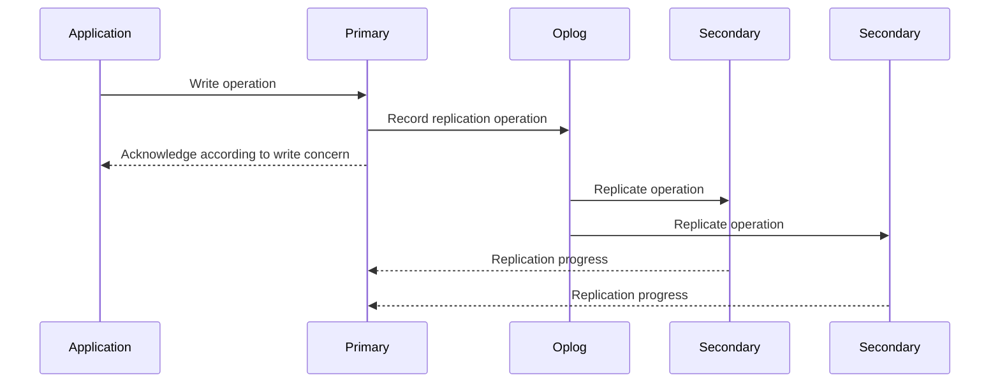
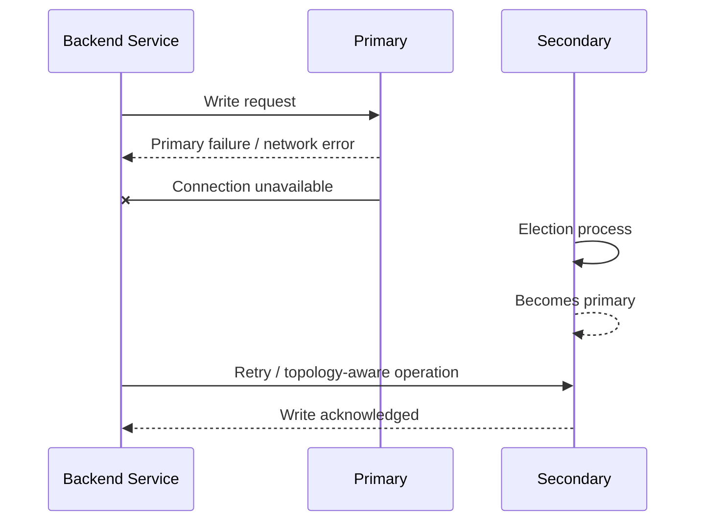
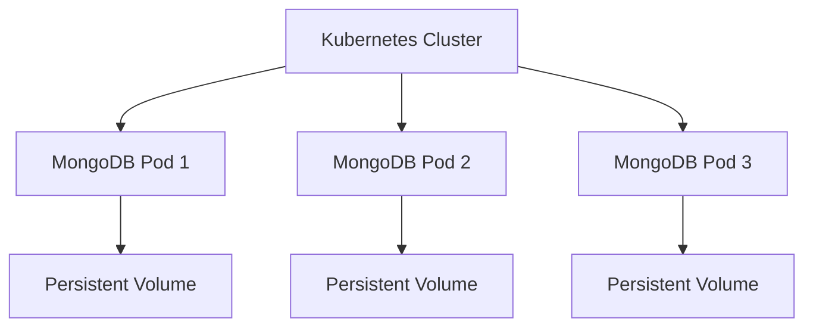

# 09- Replica Set and High Availability Questions

## Overview

MongoDB replica sets provide redundancy, automatic failover, and configurable read/write behavior across multiple `mongod` instances.

For backend engineers, replica sets are important because MongoDB availability is not simply a matter of running multiple database processes. Production behavior depends on replication, elections, write concern, read preference, oplog retention, replication lag, rollback behavior, and application retry logic.

Senior-level interview questions typically focus on:

- How replication works internally
- How elections and failover occur
- What happens when the primary fails
- How majority write concern affects durability
- How secondary reads affect consistency
- How replication lag impacts applications
- What causes rollbacks
- How initial sync works
- How replica-set topology should be designed
- How to diagnose unhealthy members
- How replica sets differ from backups and disaster recovery

## Replica Set Fundamentals

### What Is a Replica Set?

A replica set is a group of MongoDB instances that maintain multiple copies of the same dataset and coordinate to provide high availability.

A typical production topology contains:

```text
                ┌───────────────┐
                │    Primary    │
                │   mongod-1    │
                └───────┬───────┘
                        │
                 Replication
                  through oplog
                  /          \
                 /            \
                ▼              ▼
       ┌──────────────┐ ┌──────────────┐
       │   Secondary  │ │   Secondary  │
       │   mongod-2   │ │   mongod-3   │
       └──────────────┘ └──────────────┘
```

The primary normally accepts writes. Secondary members replicate the primary's operations and can serve reads depending on read preference.

If the primary becomes unavailable, eligible members can participate in an election to select a new primary.

### Why Replica Sets Exist

Replica sets address several production requirements:

- High availability
- Automatic failover
- Data redundancy
- Read scaling for suitable workloads
- Maintenance without complete service interruption
- Configurable consistency and durability

They do not automatically solve:

- Disaster recovery
- Application-level data corruption
- Accidental deletion
- Long-term archival
- Poor query design
- Incorrect application behavior

## Replica Set Architecture

A replica set contains members with different responsibilities.

| Member Type | Typical Role |
|---|---|
| Primary | Accepts writes and normally serves primary reads |
| Secondary | Replicates data and can serve reads |
| Hidden secondary | Replicates data but is hidden from normal application discovery |
| Delayed secondary | Maintains intentionally delayed replication for recovery scenarios |
| Arbiter | Participates in elections without storing data |

A production architecture should generally favor data-bearing members over arbiters when the objective is both resilience and data redundancy.

## Primary

The primary is the member currently responsible for accepting writes for the replica set.

The application typically connects using a replica-set-aware connection string rather than hard-coding a single server.

Example:

```text
mongodb://mongo-1,mongo-2,mongo-3/appdb?replicaSet=rs0
```

The MongoDB driver can discover the current topology and redirect operations appropriately when primary membership changes.

### Primary Responsibilities

The primary:

- Accepts writes
- Generates replication operations
- Maintains the oplog
- Participates in heartbeats and elections
- Serves reads according to read preference
- Coordinates transaction operations involving the replica set

A primary is not permanently tied to one physical server. Leadership can change after an election.

## Secondary Members

Secondaries replicate operations from the primary.

They can be used for:

- Read scaling
- Reporting workloads
- Disaster-recovery support
- Backup workloads
- Dedicated operational tasks

However, secondary reads introduce potential staleness.

For example:

```text
Primary
  │
  ├── Write: order status = "paid"
  │
  ▼
Oplog
  │
  ▼
Secondary
  │
  └── Replication delayed by 2 seconds
```

A client reading from the secondary immediately after the write may observe the previous state.

## Replication and the Oplog

MongoDB replication is based on operations recorded in the oplog.

Conceptually:



The oplog is a capped collection that records operations used for replication.

Secondaries continuously read the oplog and apply operations locally.

### Why the Oplog Matters

The oplog affects:

- Replication
- Initial synchronization
- Secondary recovery
- Replication lag
- Recovery windows
- Backup and operational procedures

If a secondary falls too far behind and the required oplog entries are no longer available, it may need an initial sync instead of continuing from its current position.

## Heartbeats

Replica-set members communicate using heartbeats to determine member availability and topology state.

Heartbeats help members identify:

- Whether another member is reachable
- Whether a member is responding
- Current replica-set state
- Election-related conditions

A network partition can therefore cause different members to have different views of connectivity.

MongoDB's election rules are designed to prevent multiple members from legitimately acting as primary at the same time.

## Elections

An election occurs when a new primary needs to be selected.

Typical triggers include:

- Primary failure
- Network partition
- Process failure
- Step-down
- Administrative action
- Configuration changes that affect eligibility

Conceptually:

```text
Primary becomes unavailable
        ↓
Secondaries detect failure
        ↓
Eligible members initiate election
        ↓
Voting and election rules applied
        ↓
New primary selected
        ↓
Drivers discover new topology
        ↓
Application resumes writes
```

The exact election timing depends on MongoDB configuration, topology, connectivity, and election behavior.

### Election Requirements

A candidate must satisfy MongoDB's eligibility rules and obtain sufficient votes.

Factors affecting election eligibility include:

- Member priority
- Member votes
- Member state
- Connectivity
- Configuration
- Replication state

A member that is unavailable or otherwise ineligible cannot simply become primary because the current primary disappeared.

## Failover

Failover is the process by which the replica set transitions from an unavailable primary to a new primary.

During failover, applications may experience temporary write errors.

A resilient application should:

- Use a replica-set-aware connection string
- Use an appropriate MongoDB driver
- Configure sensible timeouts
- Handle transient errors
- Retry safe operations where appropriate
- Design writes to be idempotent where possible

### Application Failover Flow



The application should not implement its own simplistic "switch to server 2" logic. The MongoDB driver and replica-set topology should handle server discovery.

## Write Concern

Write concern determines how much acknowledgment the client requires before a write is considered successful.

Common configurations include:

```javascript
{ w: 1 }
```

```javascript
{ w: "majority" }
```

### `w: 1`

The primary acknowledges the write after accepting it locally.

This can provide lower latency but does not provide the same durability semantics as waiting for a majority.

### `w: "majority"`

The write is acknowledged after the required majority condition is satisfied.

For a three-member replica set:

```text
Primary
Secondary
Secondary

Majority = 2
```

A majority write therefore requires sufficient acknowledgment from a majority of voting members according to MongoDB's write-concern semantics.

### Write Concern Trade-Off

| Concern | Lower Acknowledgment | Majority |
|---|---|---|
| Write latency | Potentially lower | Potentially higher |
| Durability | Lower | Stronger |
| Availability dependency | Lower | Requires majority availability |
| Suitable for critical writes | Depends on requirement | Common choice |
| Failure behavior | More data-loss exposure | Better protection against failover loss |

The correct choice depends on application durability requirements.

## Read Preference

Read preference controls which replica-set members can serve reads.

Common modes include:

| Mode | Behavior |
|---|---|
| `primary` | Read only from primary |
| `primaryPreferred` | Prefer primary, fall back when unavailable |
| `secondary` | Read from secondary |
| `secondaryPreferred` | Prefer secondary, fall back to primary |
| `nearest` | Choose a member based on network latency and suitability |

### Primary Reads

Primary reads provide the simplest consistency model for many applications.

```text
Application
     │
     ▼
  Primary
```

### Secondary Reads

Secondary reads can distribute read traffic:

```text
                 ┌── Secondary 1
                 │
Application ─────┼── Secondary 2
                 │
                 └── Secondary 3
```

However, they can observe stale data.

### When Secondary Reads Make Sense

Potential use cases include:

- Analytics
- Reporting
- Search-like workloads
- Read-heavy applications tolerant of eventual consistency
- Non-critical dashboards

Avoid blindly routing all reads to secondaries just to increase throughput.

## Read Concern

Read concern controls the consistency characteristics of reads.

For interview purposes, distinguish read concern from read preference:

- **Read preference** answers: "Which member should serve this read?"
- **Read concern** answers: "What consistency guarantees should this read provide?"

These are related but separate concepts.

For example, an application may read from a secondary while still requiring particular visibility guarantees, subject to MongoDB's supported semantics and topology.

## Majority

"Majority" appears in multiple replica-set concepts and should not be treated as a generic synonym for "all nodes."

For a three-voting-member replica set:

```text
Voting members = 3
Majority = 2
```

For a five-voting-member replica set:

```text
Voting members = 5
Majority = 3
```

This matters for:

- Elections
- Majority write concern
- Availability
- Failure tolerance

A three-member replica set can generally continue majority-based operation after losing one voting member, but not after losing enough members to lose a majority.

## Failure Tolerance

For a replica set with `N` voting members, the maximum number of simultaneous voting-member failures that can generally be tolerated while retaining a majority is:

```text
floor((N - 1) / 2)
```

Examples:

| Voting Members | Majority | Failures Before Majority Is Lost |
|---:|---:|---:|
| 3 | 2 | 1 |
| 5 | 3 | 2 |
| 7 | 4 | 3 |

Adding members is not automatically equivalent to improving the architecture. Network topology, latency, operational cost, failure domains, and election behavior also matter.

## Rollbacks

A rollback can occur when a member that had accepted writes diverges from the eventual primary history and later needs to discard operations that are not present in the winning history.

This is one reason write concern matters.

Conceptually:

```text
Old Primary
    │
    ├── Write A
    ├── Write B
    └── Network partition
          │
          ▼
New Primary
    │
    └── Different history

Old Primary rejoins
    ↓
Conflicting operations identified
    ↓
Non-winning operations may be rolled back
```

Applications should not treat an acknowledged write as having identical durability semantics under every possible write concern.

For critical workloads, understand the relationship between:

- Write concern
- Election
- Majority
- Journaling
- Replication
- Application retry behavior

## Initial Sync

A new or significantly outdated secondary may require an initial sync.

Conceptually:

```text
New Secondary
      ↓
Initial synchronization
      ↓
Copy database data
      ↓
Apply required replication operations
      ↓
Catch up with oplog
      ↓
Become SECONDARY
```

Initial sync can consume significant:

- Network bandwidth
- Disk I/O
- CPU
- Storage
- Primary resources depending on the environment

Large production deployments should plan capacity for adding or rebuilding members.

## Secondary Lag

Replication lag measures how far behind a secondary is relative to the primary.

Possible causes include:

- High write volume
- Slow disks
- CPU saturation
- Network latency
- Large operations
- Resource contention
- Secondary workload
- Insufficient hardware capacity

### Why Lag Matters

Lag can affect:

- Secondary read freshness
- Failover readiness
- Backup processes
- Oplog recovery windows
- Operational confidence

A secondary that is technically "up" but significantly behind may not provide the expected availability or recovery characteristics.

## Hidden Members

A hidden member participates in replication but is not normally exposed for application read selection.

Potential uses include:

- Dedicated backups
- Reporting
- Operational workloads
- Isolated analytics

A hidden member can reduce interference with normal application traffic.

However, hidden members still require:

- Storage
- CPU
- Memory
- Monitoring
- Operational maintenance

## Priority

Replica-set member priority influences which members are preferred during elections.

For example:

```text
Primary candidate A: priority 10
Secondary B: priority 5
Secondary C: priority 1
```

This can help influence preferred topology, but priority should not be used as a substitute for proper failure-domain design.

A high-priority member should be placed where it can reliably become primary.

## Arbiter Considerations

An arbiter participates in voting but does not store data.

It can provide an additional vote in specific topologies, but it does not provide an additional data copy.

Conceptually:

```text
Primary       → Data
Secondary     → Data
Arbiter       → Vote only
```

For modern production architectures, a data-bearing member is often preferable when infrastructure and requirements allow it because it contributes both voting capacity and redundancy.

The key interview distinction is:

> An arbiter improves voting topology; it does not improve data redundancy.

## Replica-Set Configuration

Replica-set configuration can be inspected using `rs.conf()`.

Example:

```javascript
rs.conf()
```

Replica-set status can be inspected using:

```javascript
rs.status()
```

Useful information includes:

- Member states
- Primary/secondary status
- Health
- Replication progress
- Member configuration
- Election information

These commands are useful during operational diagnosis.

## Important Replica-Set States

Common member states include:

| State | Meaning |
|---|---|
| PRIMARY | Current primary |
| SECONDARY | Replicating and available as a secondary |
| STARTUP | Initial startup state |
| STARTUP2 | Initial synchronization/startup processing |
| RECOVERING | Recovering and not serving normal traffic |
| ARBITER | Voting-only arbiter |
| DOWN | Member is unavailable |
| UNKNOWN | State cannot currently be determined |

A senior engineer should distinguish a process being alive from a member being healthy and eligible for the intended role.

## Replica-Set Monitoring

Monitor at least:

- Primary availability
- Member health
- Replication lag
- Election frequency
- Oplog window
- Connections
- CPU
- Memory
- Disk usage
- Disk I/O
- Network latency
- Operation latency
- Error rates

An unexpected increase in elections is an operational signal, not merely a normal event.

## Oplog Window

The oplog has a finite amount of retained history.

The effective oplog window determines how long a secondary can remain behind before it may no longer have enough oplog history to catch up normally.

A simplified relationship is:

```text
Oplog Window =
Available Oplog History
÷
Average Oplog Generation Rate
```

This is only a conceptual approximation; actual operational analysis should use MongoDB's reported metrics.

A workload with highly variable write rates requires monitoring rather than relying on a fixed expected window.

## Replica Sets and Transactions

Multi-document transactions depend on replica-set capabilities in production deployments.

Transactions interact with:

- Sessions
- Read concern
- Write concern
- Replica-set topology
- Primary availability
- Retry behavior

A transaction can fail because of transient topology changes.

Application code should therefore understand transient transaction errors and use the driver's supported transaction retry patterns where appropriate.

## Python and Replica Sets

A Python service should use a replica-set-aware connection string.

Example:

```python
from pymongo import MongoClient

client = MongoClient(
    "mongodb://mongo-1,mongo-2,mongo-3/appdb"
    "?replicaSet=rs0"
    "&retryWrites=true"
)
```

The driver discovers the topology and maintains knowledge of:

- Current primary
- Secondaries
- Server availability
- Topology changes

Avoid manually coding:

```python
if primary_failed:
    connect_to("mongo-2")
```

The MongoDB driver is designed to handle topology discovery and server selection.

## Retryable Writes

Transient failures can occur during:

- Primary elections
- Network interruptions
- Connection changes
- Temporary server failures

MongoDB drivers support retryable operations for appropriate operation types and configurations.

However, retries do not eliminate the need for application-level idempotency.

For example, a payment service should not blindly repeat a non-idempotent external operation simply because a database operation was retried.

A robust architecture separates:

```text
Database retryability
        ≠
Business operation idempotency
```

## Replica Sets in Kubernetes

Running MongoDB replica sets in Kubernetes requires careful consideration of:

- Persistent volumes
- Stable network identities
- Pod disruption
- Availability zones
- Storage performance
- Pod scheduling
- Anti-affinity
- Stateful workloads
- Backup strategy
- Operator support

A simplified architecture is:



Do not place all replica-set members on the same failure domain if the goal is infrastructure-level resilience.

For production Kubernetes deployments, storage, scheduling, backup, upgrade, and topology behavior should be explicitly tested.

## Availability Zones and Failure Domains

A production replica set should account for infrastructure failure domains.

For example:

```text
Region
├── Zone A
│   └── Primary
├── Zone B
│   └── Secondary
└── Zone C
    └── Secondary
```

This topology reduces the risk that a single availability-zone failure removes a majority of voting members.

The important design principle is:

> Database redundancy is only useful if the replicas are independent across the failures you are trying to survive.

## Replica Sets vs Backups vs Disaster Recovery

These concepts should be separated.

| Capability | Replica Set | Backup | Disaster Recovery |
|---|---|---|---|
| Node failure | Strong | Not immediate | Possible |
| Automatic failover | Yes | No | Usually no |
| Accidental deletion recovery | Limited | Yes | Yes |
| Logical corruption | Limited | Yes | Yes |
| Historical recovery | Limited | Depends on strategy | Depends on strategy |
| Cross-region recovery | Architecture-dependent | Possible | Core objective |
| RPO/RTO planning | Partially relevant | Required | Required |

A replica set is primarily an availability mechanism.

A backup strategy is primarily a recovery mechanism.

A disaster-recovery architecture addresses failures that may affect the entire primary deployment or region.

## Common Failure Scenarios

### Primary Process Failure

```text
Primary crashes
    ↓
Members detect failure
    ↓
Election
    ↓
New primary
    ↓
Drivers discover topology
    ↓
Application resumes
```

Expected impact:

- Temporary write errors
- Connection/topology changes
- Possible transient application errors

### Network Partition

A network partition can isolate members.

The key concern is preventing multiple primaries and preserving majority semantics.

Applications should be designed to tolerate temporary inability to write rather than assuming uninterrupted availability.

### Secondary Failure

If one secondary fails while the primary and another secondary remain healthy, the replica set may continue operating normally.

However:

- Redundancy is reduced
- Recovery capacity is reduced
- Monitoring should alert
- Repair should not be indefinitely postponed

### Multiple Member Failure

If enough voting members become unavailable to lose a majority, majority-based operations can become unavailable even if one member remains alive.

This is a critical distinction:

> A surviving MongoDB process does not necessarily mean the replica set can continue all operations.

## Troubleshooting Methodology

### Primary Is Unavailable

```text
Symptom
↓
Application cannot perform writes
↓
Possible causes
- Primary process failure
- Network failure
- Election in progress
- Loss of majority
- Configuration issue
↓
Isolation
- Check rs.status()
- Check connectivity
- Check member health
- Check application logs
↓
Root cause
↓
Corrective action
- Restore failed member
- Resolve network issue
- Allow election to complete
- Restore majority availability
↓
Prevention
- Monitor elections
- Use topology-aware drivers
- Distribute members across failure domains
```

### Secondary Lagging

```text
Symptom
↓
Secondary significantly behind primary
↓
Possible causes
- High write volume
- Disk I/O saturation
- CPU pressure
- Network latency
- Expensive secondary workload
↓
Isolation
- Inspect replication status
- Check CPU and disk
- Check network
- Check operation workload
↓
Root cause
↓
Corrective action
- Remove workload bottleneck
- Improve storage
- Scale resources
- Review read/reporting workload
↓
Prevention
- Lag alerting
- Capacity planning
- Dedicated workloads where appropriate
```

### Unexpected Elections

```text
Symptom
↓
Frequent primary changes
↓
Possible causes
- Network instability
- CPU starvation
- Disk stalls
- Process crashes
- Infrastructure failures
↓
Isolation
- Review MongoDB logs
- Inspect host metrics
- Check network stability
- Review election history
↓
Root cause
↓
Corrective action
- Resolve infrastructure bottleneck
- Correct resource limits
- Fix network instability
↓
Prevention
- Election monitoring
- Resource monitoring
- Failure-domain-aware deployment
```

## Production Best Practices

- Use at least three appropriate voting members for production high availability.
- Distribute members across independent failure domains where possible.
- Use replica-set-aware MongoDB connection strings.
- Reuse MongoDB clients so connection pooling works correctly.
- Select write concern based on durability requirements.
- Select read preference based on consistency and latency requirements.
- Monitor replication lag.
- Monitor election frequency.
- Monitor the oplog window.
- Keep secondaries sufficiently provisioned to follow the primary.
- Avoid treating secondary reads as automatically consistent.
- Avoid relying on arbiters when data-bearing redundancy is practical.
- Test primary failover before relying on it in production.
- Maintain independent backups.
- Test restoration procedures.
- Design application operations for transient topology failures.
- Use idempotency for business operations that may be retried.
- Keep credentials and TLS configuration secure.
- Document operational runbooks for member failure and recovery.

## Common Mistakes

### Mistaking Replication for Backup

Replication can replicate accidental or malicious changes just as efficiently as legitimate changes.

### Using a Single MongoDB Host

A single host cannot provide replica-set high availability.

### Putting All Members in One Failure Domain

Three members on three machines in the same availability zone can still be lost through a zone-level failure.

### Reading From Secondaries Without Considering Staleness

A successful secondary read does not guarantee the latest committed application state.

### Ignoring Replication Lag

A secondary can be healthy from a process perspective while being operationally unsuitable for fresh reads or failover.

### Creating Application-Specific Failover Logic

The application should normally rely on the MongoDB driver's topology discovery rather than manually selecting replacement servers.

### Assuming `w: 1` Means Durable Across the Replica Set

`w: 1` acknowledges a write based on the configured write semantics without requiring the same acknowledgment level as `w: "majority"`.

### Using Arbitrary Election Priorities

Priority should reflect the desired topology and infrastructure reliability, not simply which server has the largest machine.

### Treating an Arbiter as a Data Replica

An arbiter contributes a vote but does not contain a copy of the dataset.

### Ignoring Oplog Capacity

A secondary that remains behind beyond the available oplog history may require resynchronization.

## Interview Questions and Answers

### What is a MongoDB replica set?

A replica set is a group of MongoDB instances that maintain replicated copies of a dataset and coordinate primary election and failover.

### Why does MongoDB use a primary and secondaries?

The primary provides a clear write authority while secondaries maintain redundant copies and can serve appropriate reads.

### What happens when the primary fails?

Eligible members detect the failure, participate in an election, and a new primary can be selected. MongoDB drivers then discover the topology change and route subsequent operations to the new primary.

### What is the oplog?

The oplog is a capped collection containing replication operations that secondaries use to reproduce changes from the primary.

### What is replication lag?

Replication lag is the delay between operations being committed on the primary and being applied by a secondary.

### Why is replication lag dangerous?

It can cause stale reads, reduce failover readiness, increase recovery risk, and indicate resource or workload problems.

### What is write concern?

Write concern controls the level of acknowledgment required before a write is considered successful.

### What is the difference between `w: 1` and `w: "majority"`?

`w: 1` requires acknowledgment according to a single-member write acknowledgment level, while `w: "majority"` requires acknowledgment from a majority of voting members according to MongoDB's write-concern semantics.

### What is read preference?

Read preference controls which replica-set members can serve reads.

### Can a secondary become primary?

Yes, if it is eligible and wins an election according to replica-set configuration and voting rules.

### Why are three members commonly used?

Three voting members allow the replica set to maintain a majority after losing one member.

### What is an arbiter?

An arbiter is a voting member that does not store a copy of the data.

### Why might you avoid an arbiter?

It contributes voting capacity without providing data redundancy, so a data-bearing member can provide more resilience when infrastructure permits.

### What is a hidden secondary?

A hidden secondary replicates data but is hidden from normal client discovery and is useful for specialized operational workloads.

### What causes rollback?

Rollback can occur when a member has operations that are not part of the final primary history after a topology change or election.

### What is initial sync?

Initial sync is the process by which a new or significantly outdated member obtains the required dataset and replication history before becoming a normal secondary.

### What happens if a secondary falls behind beyond the oplog window?

It may no longer be able to catch up using the available oplog and may require an initial sync.

### Are replica sets backups?

No. Replica sets provide redundancy and high availability; backups provide recovery capabilities that replication alone does not provide.

### How should a Python application connect to a replica set?

Use a replica-set-aware connection string and a MongoDB driver that supports topology discovery and failover.

### Should an application manually switch from the failed primary to a secondary?

Normally no. The MongoDB driver should handle server selection and topology changes.

### How do secondary reads affect consistency?

Secondary reads can return stale data because replication is asynchronous.

### Can a replica set survive losing two members?

It depends on the topology. A three-member voting replica set generally loses majority availability after losing two voting members.

## Senior-Level Design Questions

### How would you design a highly available MongoDB deployment?

Discuss:

- Multiple voting members
- Independent failure domains
- Appropriate storage
- Majority availability
- Replica-set-aware clients
- Write concern
- Read preference
- Monitoring
- Backup strategy
- Recovery testing
- Operational runbooks

### How would you handle replication lag?

Start with measurement rather than configuration changes.

Investigate:

- Write volume
- CPU
- Disk latency
- Network latency
- Secondary workload
- Large operations
- Oplog window

Then address the underlying bottleneck and monitor whether lag improves.

### How would you design MongoDB across availability zones?

Distribute voting members across independent zones so that loss of one zone does not automatically eliminate the voting majority.

Also evaluate:

- Inter-zone latency
- Storage
- Network cost
- Election behavior
- Application placement

### How would you handle a primary election in a FastAPI service?

Use a replica-set-aware MongoDB client, configure appropriate timeouts and retry behavior, and ensure business operations are idempotent where retries can occur.

### How would you design MongoDB for a payment service?

Separate database retry behavior from payment idempotency.

Use:

- Stable idempotency keys
- Appropriate transaction boundaries
- Strong durability requirements
- Unique constraints where appropriate
- Careful retry handling
- Auditability
- Independent backups
- Monitoring

Do not assume that MongoDB retryable writes alone make an external payment operation idempotent.

## Interview Traps

| Topic | Weak Answer | Strong Answer Direction |
|---|---|---|
| Replica set | "Three servers give backup" | Explain replication, elections, majority, and HA |
| Primary failure | "MongoDB switches immediately" | Explain detection, election, topology discovery, and transient errors |
| Secondary | "Secondary always has latest data" | Explain asynchronous replication and lag |
| Oplog | "It's MongoDB's transaction log" | Explain its role in replication and recovery of secondaries |
| Majority | "Majority means every server" | Explain voting-member majority |
| Arbiter | "It stores another copy" | Explain vote-only behavior |
| Backup | "Replica set is enough" | Distinguish HA from backup and DR |
| Failover | "Application connects to server 2" | Explain driver topology discovery |
| Read preference | "Secondary is faster" | Explain latency, load distribution, and staleness trade-offs |
| Replication lag | "Just add more secondaries" | Diagnose workload, resources, network, and topology |
| Rollback | "MongoDB never loses writes" | Explain divergent histories and durability/write-concern implications |

## Replica Set Architecture Review Checklist

Before deploying a production replica set, verify:

- [ ] Multiple appropriate voting members exist.
- [ ] Members are distributed across failure domains.
- [ ] Storage performance is sufficient.
- [ ] Replica-set-aware connection strings are used.
- [ ] MongoDB drivers are configured appropriately.
- [ ] Write concern matches durability requirements.
- [ ] Read preference matches consistency requirements.
- [ ] Secondary lag is monitored.
- [ ] Election frequency is monitored.
- [ ] Oplog window is monitored.
- [ ] Connection usage is monitored.
- [ ] CPU, memory, disk, and network are monitored.
- [ ] Backup strategy is independent of replication.
- [ ] Restore procedures are tested.
- [ ] Primary failure has been tested.
- [ ] Secondary failure has been tested.
- [ ] Application retry behavior has been tested.
- [ ] Business operations are idempotent where necessary.
- [ ] Security controls are configured.
- [ ] Operational runbooks exist.

## Key Takeaways

- A MongoDB replica set provides **redundancy and automatic failover**, but replication is not a substitute for backups or disaster recovery.
- **Elections, write concern, read preference, replication lag, and the oplog** determine much of the real production behavior of a replica set.
- Applications should use **topology-aware MongoDB drivers** and design retryable business operations with explicit idempotency.
- High availability depends on **failure-domain-aware topology, majority availability, monitoring, and tested operational procedures**.
- Senior-level replica-set design requires reasoning about **consistency, durability, failover, network failures, recovery, and application behavior together**.