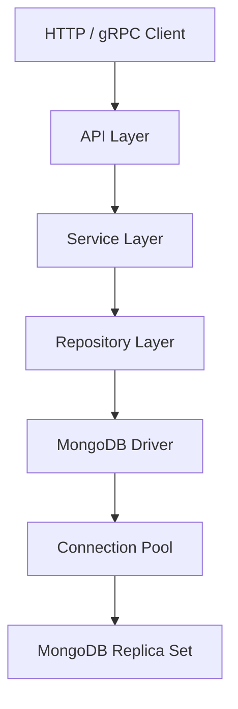
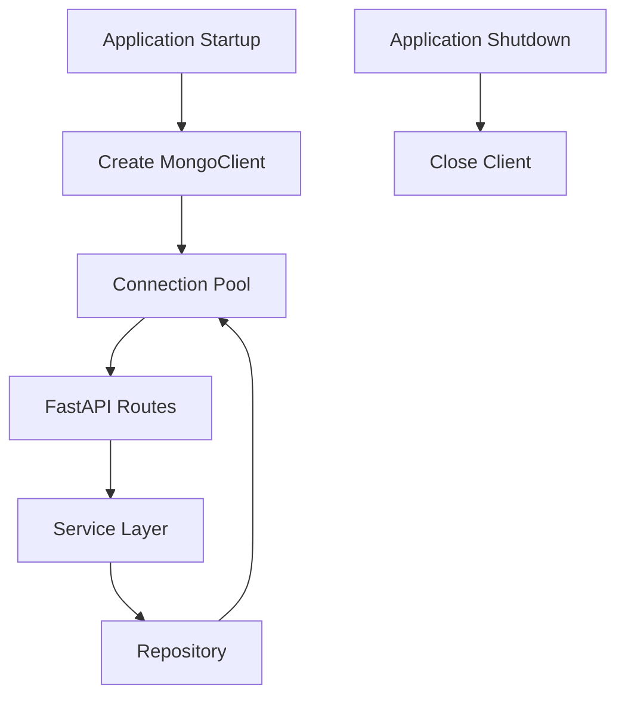
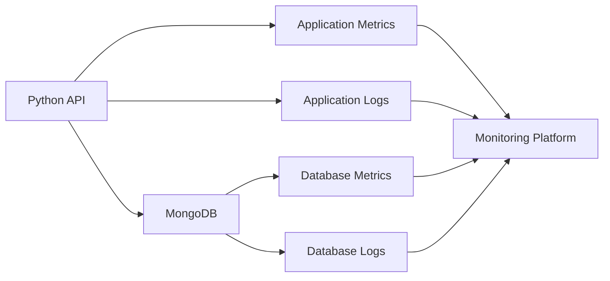

# 10- Python and MongoDB Questions

## Overview

Python is one of the most common languages used to build MongoDB-backed APIs, workers, data-processing services, and microservices.

Production-quality Python integration requires more than knowing how to call `find()` or `insert_one()`. A backend engineer must understand connection lifecycle, connection pooling, BSON types, ObjectId handling, query construction, pagination, bulk operations, aggregation, transactions, retry behavior, timeouts, error handling, and application architecture.

The central engineering principle is:

> MongoDB access should be treated as an infrastructure boundary with explicit connection management, predictable query behavior, controlled serialization, and measurable operational characteristics.

This document focuses on PyMongo and Python application architecture, with relevant FastAPI and Django considerations.

## Python MongoDB Architecture

A production Python service should normally separate transport, business logic, and persistence concerns.



### Responsibilities

| Layer | Responsibility |
|---|---|
| API | HTTP/gRPC request handling, authentication, validation, response mapping |
| Service | Business rules, transaction boundaries, orchestration |
| Repository | MongoDB queries, persistence operations, indexes, aggregation |
| Driver | Connection management, pooling, server selection, protocol handling |
| MongoDB | Persistence, replication, indexing, transactions, aggregation |

This separation is particularly useful when the application grows from a small API into a larger service.

## PyMongo

PyMongo is the standard Python driver for MongoDB.

It provides:

- MongoDB connectivity
- BSON encoding and decoding
- CRUD operations
- Query construction
- Aggregation
- Bulk writes
- Transactions
- Sessions
- Connection pooling
- Server selection
- Retryable operation support
- Error types for operational failures

A Python application should generally use one long-lived `MongoClient` per process rather than constructing a client for every request.

## MongoDB Connection Lifecycle

A typical application lifecycle is:

```text
Application starts
       ↓
Read configuration
       ↓
Create MongoClient
       ↓
Driver discovers topology
       ↓
Connection pool becomes available
       ↓
Application serves requests
       ↓
Requests reuse pooled connections
       ↓
Application shuts down
       ↓
Close MongoClient
```

### Why MongoClient Should Be Reused

Creating a client for every request can result in:

- Excessive connection creation
- TLS handshake overhead
- Increased latency
- Connection exhaustion
- Poor pool utilization
- Increased database load

A long-lived client allows the driver to manage a connection pool efficiently.

## Connection String

A production connection string should normally identify the MongoDB deployment rather than a single hard-coded server.

Example:

```text
mongodb://mongo-1,mongo-2,mongo-3/appdb?replicaSet=rs0
```

A managed deployment may use a DNS-based connection string.

Application code should read the URI from configuration rather than embedding credentials in source code.

```python
import os

MONGODB_URI = os.environ["MONGODB_URI"]
MONGODB_DATABASE = os.environ["MONGODB_DATABASE"]
```

### Production Configuration

Useful client settings may include:

- Server selection timeout
- Connection timeout
- Socket timeout
- Maximum pool size
- Minimum pool size where appropriate
- Retry configuration
- TLS configuration
- Replica-set configuration

Example:

```python
from pymongo import MongoClient

client = MongoClient(
    MONGODB_URI,
    serverSelectionTimeoutMS=5_000,
    connectTimeoutMS=5_000,
    socketTimeoutMS=10_000,
    retryWrites=True,
)
```

Timeouts should be selected based on the service's latency objectives rather than copied blindly.

## Database and Collection Access

PyMongo provides convenient database and collection access.

```python
db = client["orders"]
orders = db["orders"]
```

Equivalent attribute-style access exists, but dictionary-style access is generally clearer when names are dynamic.

```python
orders = client["orders"]["orders"]
```

Avoid creating a new client when accessing another database or collection.

## Health Checking the Connection

A service can use a lightweight command to validate connectivity.

```python
client.admin.command("ping")
```

A health endpoint should distinguish between:

- Process is alive
- Application is ready
- MongoDB dependency is reachable

Do not make every liveness probe perform expensive database operations.

## BSON and Python Types

MongoDB stores BSON rather than plain JSON.

Common BSON types map to Python values through the driver.

| MongoDB/BSON | Python Representation |
|---|---|
| String | `str` |
| Boolean | `bool` |
| Integer | `int` |
| Double | `float` |
| Array | `list` |
| Embedded document | `dict` |
| Date | `datetime.datetime` |
| Binary | `bytes` / BSON binary representation |
| ObjectId | `bson.ObjectId` |
| Null | `None` |

The distinction between JSON and BSON matters when serializing MongoDB documents through APIs.

## ObjectId

MongoDB commonly uses `ObjectId` for `_id`.

Example:

```python
from bson import ObjectId

order_id = ObjectId("65f000000000000000000001")
```

A REST endpoint normally receives an ID as a string, while MongoDB expects an `ObjectId`.

A repository can convert it explicitly:

```python
from bson import ObjectId
from bson.errors import InvalidId


def parse_object_id(value: str) -> ObjectId:
    try:
        return ObjectId(value)
    except InvalidId as exc:
        raise ValueError("Invalid MongoDB ObjectId") from exc
```

Do not silently accept invalid IDs and query MongoDB with an incorrect type.

## ObjectId Serialization

MongoDB documents are not always directly JSON serializable because `ObjectId` is not a standard JSON type.

For example:

```python
document = {
    "_id": ObjectId("65f000000000000000000001"),
    "status": "paid",
}
```

An API response should expose a deliberate representation.

```json
{
  "id": "65f000000000000000000001",
  "status": "paid"
}
```

Keep persistence representation separate from API representation when appropriate.

## Insert Operations

### Insert One

```python
result = orders.insert_one({
    "customer_id": "customer-123",
    "status": "pending",
    "total": 1499.00,
})

order_id = result.inserted_id
```

`insert_one()` returns an `InsertOneResult`.

### Insert Many

```python
result = orders.insert_many([
    {
        "customer_id": "customer-123",
        "status": "pending",
        "total": 100.00,
    },
    {
        "customer_id": "customer-456",
        "status": "pending",
        "total": 250.00,
    },
])

order_ids = result.inserted_ids
```

Bulk insertion is generally more efficient than issuing many independent network round trips.

## Find Operations

### Find One

```python
order = orders.find_one({
    "_id": ObjectId(order_id)
})
```

### Find Many

```python
cursor = orders.find({
    "status": "paid"
})

for order in cursor:
    process_order(order)
```

`find()` returns a cursor rather than immediately loading every document into memory.

This is important for large result sets.

## Cursors

A MongoDB cursor allows the application to iterate through results progressively.

```python
cursor = orders.find({
    "status": "paid"
}).batch_size(500)

for order in cursor:
    process_order(order)
```

Avoid unnecessary:

```python
list(orders.find(...))
```

when the result set can be large.

Materializing a large cursor into a Python list can cause significant memory consumption.

## Projection

Projection limits fields returned from MongoDB.

```python
cursor = orders.find(
    {"status": "paid"},
    {
        "_id": 1,
        "customer_id": 1,
        "total": 1,
    },
)
```

Projection can reduce:

- Network transfer
- BSON decoding
- Python memory usage
- Serialization overhead

Projection should be combined with appropriate indexes and query design when performance matters.

## Sorting

PyMongo supports explicit sort specifications.

```python
from pymongo import DESCENDING

cursor = orders.find({
    "customer_id": "customer-123"
}).sort(
    [("created_at", DESCENDING)]
)
```

For large datasets, verify that an appropriate index supports the query and sort pattern.

## Pagination

Offset pagination:

```python
cursor = (
    orders.find({"status": "paid"})
    .sort("created_at", -1)
    .skip(offset)
    .limit(page_size)
)
```

This is simple but can become inefficient for large offsets.

Cursor-based pagination is generally more appropriate for large collections.

```python
cursor = (
    orders.find({
        "status": "paid",
        "created_at": {"$lt": last_created_at},
    })
    .sort("created_at", -1)
    .limit(page_size)
)
```

For production systems, use a stable ordering strategy. If timestamps can collide, include a unique tie-breaker such as `_id`.

## Update Operations

### Update One

```python
result = orders.update_one(
    {"_id": ObjectId(order_id)},
    {
        "$set": {
            "status": "paid",
            "updated_at": datetime.now(timezone.utc),
        }
    },
)
```

Useful result properties include:

- `matched_count`
- `modified_count`
- `upserted_id`

### Update Many

```python
result = orders.update_many(
    {
        "status": "pending",
        "expires_at": {"$lt": datetime.now(timezone.utc)},
    },
    {
        "$set": {
            "status": "expired",
        }
    },
)
```

Be careful with broad filters. An incorrect `update_many()` filter can modify a large portion of a collection.

## Replace vs Update

`replace_one()` replaces the entire document except for the immutable `_id`.

```python
orders.replace_one(
    {"_id": order_id},
    {
        "_id": order_id,
        "status": "paid",
        "total": 1499.00,
    },
)
```

Use replacement when the application intentionally owns the complete document representation.

Use update operators such as `$set`, `$unset`, `$inc`, and `$push` when modifying selected fields.

## Upsert

An upsert updates an existing document or inserts a new document if no matching document exists.

```python
result = orders.update_one(
    {
        "external_order_id": "ERP-12345",
    },
    {
        "$set": {
            "status": "paid",
            "updated_at": datetime.now(timezone.utc),
        },
    },
    upsert=True,
)
```

Upserts are useful for synchronization and idempotent processing.

If uniqueness is required, enforce it with a unique index rather than relying only on application logic.

## Delete Operations

### Delete One

```python
result = orders.delete_one({
    "_id": ObjectId(order_id)
})
```

### Delete Many

```python
result = orders.delete_many({
    "status": "expired"
})
```

Production deletion workflows should consider:

- Audit requirements
- Referential implications
- Soft-delete requirements
- Backup/recovery implications
- Accidental broad filters

For sensitive systems, deletion should often be protected by service-level authorization and explicit business rules.

## Bulk Writes

Bulk operations reduce network round trips and can improve throughput.

```python
from pymongo import UpdateOne

operations = [
    UpdateOne(
        {"external_id": "order-1"},
        {"$set": {"status": "paid"}},
        upsert=True,
    ),
    UpdateOne(
        {"external_id": "order-2"},
        {"$set": {"status": "cancelled"}},
        upsert=True,
    ),
]

result = orders.bulk_write(
    operations,
    ordered=False,
)
```

### Ordered vs Unordered

| Mode | Behavior | Typical Consideration |
|---|---|---|
| `ordered=True` | Operations execute in order | Useful when order matters |
| `ordered=False` | Operations can execute independently | Often better for throughput |

Unordered operations should only be used when the application does not depend on operation ordering.

## Query Construction

Avoid building query strings manually.

Use Python dictionaries:

```python
query = {
    "tenant_id": tenant_id,
    "status": {"$in": ["paid", "shipped"]},
}
```

This reduces injection-style mistakes and makes query composition explicit.

For dynamic filters:

```python
query: dict = {
    "tenant_id": tenant_id,
}

if status is not None:
    query["status"] = status

if customer_id is not None:
    query["customer_id"] = customer_id
```

Do not allow clients to submit arbitrary MongoDB operators unless that behavior is explicitly designed, validated, and secured.

## Query Operators

Common operators include:

```python
{
    "total": {"$gte": 100},
    "status": {"$in": ["paid", "shipped"]},
    "customer_id": {"$exists": True},
}
```

Logical composition:

```python
{
    "$and": [
        {"status": "paid"},
        {"total": {"$gte": 100}},
    ]
}
```

Many MongoDB queries can be expressed without explicit `$and`:

```python
{
    "status": "paid",
    "total": {"$gte": 100},
}
```

Prefer the simpler representation when it has the same semantics.

## Regex Queries

Regex queries require particular attention to performance.

```python
query = {
    "email": {
        "$regex": "^admin@example",
        "$options": "i",
    }
}
```

Unanchored or complex regex patterns can prevent efficient index usage and cause expensive scans.

Do not expose arbitrary regex input directly to MongoDB without controlling:

- Pattern complexity
- Input size
- Timeout behavior
- Query frequency

For high-scale text search, consider MongoDB's supported text-search capabilities or a dedicated search system depending on requirements.

## Array Queries

Example:

```python
orders.find({
    "items": {
        "$elemMatch": {
            "sku": "SKU-100",
            "quantity": {"$gte": 2},
        }
    }
})
```

Use `$elemMatch` when multiple conditions must apply to the same array element.

This distinction is important when modeling and querying arrays of embedded documents.

## Aggregation from Python

PyMongo accepts aggregation pipelines as Python lists.

```python
pipeline = [
    {
        "$match": {
            "tenant_id": "tenant-123",
            "status": "paid",
        }
    },
    {
        "$group": {
            "_id": "$customer_id",
            "total_spend": {"$sum": "$total"},
            "order_count": {"$sum": 1},
        }
    },
    {
        "$sort": {
            "total_spend": -1,
        }
    },
    {
        "$limit": 100,
    },
]

results = orders.aggregate(pipeline)
```

Keep aggregation pipelines readable and test them independently from API code.

## Aggregation Performance

Python code can be fast while MongoDB remains the bottleneck.

For large workloads:

- Filter early
- Reduce unnecessary fields
- Avoid unnecessary `$unwind`
- Validate `$lookup` behavior
- Limit large intermediate datasets
- Index appropriate initial query patterns
- Measure with `explain()`
- Avoid expensive aggregation on synchronous request paths when latency requirements are strict

Do not retrieve millions of documents into Python simply to perform aggregation that MongoDB can perform more efficiently.

## Transactions in Python

Transactions use sessions.

A transaction can be implemented using the driver's transaction helpers.

```python
from pymongo import MongoClient

client = MongoClient(MONGODB_URI)
db = client["orders"]

def transfer_order_state(order_id: ObjectId) -> None:
    with client.start_session() as session:
        with session.start_transaction():
            db.orders.update_one(
                {"_id": order_id},
                {"$set": {"status": "confirmed"}},
                session=session,
            )

            db.audit_logs.insert_one(
                {
                    "order_id": order_id,
                    "event": "confirmed",
                },
                session=session,
            )
```

The important architectural decision is not how to start the transaction, but where the transaction boundary belongs.

## Transaction Design

A transaction is appropriate when a business invariant requires multiple writes to succeed or fail together.

Examples:

- Updating multiple related documents atomically
- Maintaining a coordinated inventory reservation
- Writing business state and an associated record where atomicity is required

Avoid transactions when:

- A single-document model can satisfy the invariant
- Operations are independent
- The transaction is unnecessarily long
- A workflow spans external services
- The transaction is being used to compensate for poor data modeling

A transaction cannot make an external API call atomic with MongoDB.

## Transaction and External Services

Avoid:

```text
MongoDB transaction
    ↓
Call payment API
    ↓
Wait for external service
    ↓
Commit transaction
```

This can create long-running transactions and couples database resources to external latency.

Prefer architectures using:

- Idempotency
- State machines
- Outbox-style patterns where appropriate
- Kafka or another durable messaging mechanism
- Retryable workflows
- Explicit compensation

## Sessions

Sessions provide context for operations such as:

- Transactions
- Causal consistency features
- Retry-related behavior

Example:

```python
with client.start_session() as session:
    result = orders.find_one(
        {"_id": order_id},
        session=session,
    )
```

Sessions should be scoped appropriately and closed after use.

Do not create unmanaged sessions indefinitely.

## Connection Pooling

`MongoClient` manages a pool of connections internally.

A simplified model:

```text
Python Process
     │
     ▼
MongoClient
     │
     ├── Connection
     ├── Connection
     ├── Connection
     └── Connection
             │
             ▼
         MongoDB
```

Pool sizing should be based on:

- Application concurrency
- Number of worker processes
- Request latency
- Database capacity
- MongoDB connection limits

A common mistake is to configure a large pool per application process without accounting for the total number of processes.

For example:

```text
4 application workers
×
100 maximum connections each
=
potentially 400 connections
```

The actual driver behavior and utilization depend on workload and configuration, but capacity planning must consider the aggregate deployment.

## Timeouts

MongoDB clients should use explicit timeouts appropriate for the service.

Important timeout categories include:

- Server selection timeout
- Connection timeout
- Socket timeout

Timeouts prevent requests from waiting indefinitely for unavailable or unhealthy dependencies.

However, excessively aggressive timeouts can turn temporary latency into unnecessary failures.

Timeouts should be aligned with:

- API timeout budgets
- Retry policy
- Load balancer timeouts
- Upstream/downstream service limits

## Error Handling

PyMongo exposes specific exception types.

Example:

```python
from pymongo.errors import (
    DuplicateKeyError,
    PyMongoError,
    ServerSelectionTimeoutError,
)

try:
    orders.insert_one(order)
except DuplicateKeyError:
    raise OrderAlreadyExistsError
except ServerSelectionTimeoutError:
    raise DatabaseUnavailableError
except PyMongoError:
    raise DatabaseOperationError
```

Do not catch every exception and silently continue.

Different failures require different behavior:

| Error Category | Typical Response |
|---|---|
| Duplicate key | Business-level conflict |
| Validation failure | Client/application error |
| Server selection timeout | Dependency unavailable |
| Transient topology error | Potential retry |
| Transaction failure | Abort/retry according to semantics |
| Unknown database error | Log, alert, and fail safely |

## Retry Behavior

Retries should be applied selectively.

A database retry does not automatically mean that the business operation is safe to repeat.

For example:

```text
Database write retry
        ≠
Payment retry
        ≠
Email delivery retry
```

Business operations should use idempotency keys or equivalent mechanisms where duplicate execution would be harmful.

## Repository Pattern

A repository isolates persistence logic.

```python
from bson import ObjectId
from pymongo.collection import Collection


class OrderRepository:
    def __init__(self, collection: Collection) -> None:
        self.collection = collection

    def get_by_id(self, order_id: ObjectId) -> dict | None:
        return self.collection.find_one({
            "_id": order_id,
        })

    def update_status(
        self,
        order_id: ObjectId,
        status: str,
    ) -> bool:
        result = self.collection.update_one(
            {"_id": order_id},
            {"$set": {"status": status}},
        )

        return result.modified_count == 1
```

The repository should contain persistence concerns rather than business workflows.

## Service Layer

Business rules should remain in a service layer.

```python
class OrderService:
    def __init__(self, repository: OrderRepository) -> None:
        self.repository = repository

    def confirm_order(self, order_id: ObjectId) -> None:
        order = self.repository.get_by_id(order_id)

        if order is None:
            raise OrderNotFoundError

        if order["status"] != "pending":
            raise InvalidOrderStateError

        updated = self.repository.update_status(
            order_id,
            "confirmed",
        )

        if not updated:
            raise OrderUpdateError
```

This separation makes the application easier to test and prevents MongoDB-specific behavior from spreading throughout the codebase.

## FastAPI Integration

FastAPI applications should create and manage MongoDB resources through application lifecycle management.

Conceptually:



The exact implementation depends on the FastAPI and driver versions used by the application.

The important properties are:

- One appropriately scoped client per process
- Explicit lifecycle management
- Dependency injection where useful
- Repository/service separation
- Clean shutdown
- Proper timeout configuration

## FastAPI and Pydantic

Pydantic models should represent API contracts rather than blindly mirroring MongoDB documents.

For example:

```python
from decimal import Decimal

from pydantic import BaseModel


class OrderResponse(BaseModel):
    id: str
    status: str
    total: Decimal
```

MongoDB's internal `_id` field does not have to be exposed directly as `_id`.

API contracts should remain stable even if the persistence schema evolves.

## Synchronous vs Asynchronous MongoDB Access

Traditional PyMongo usage is synchronous.

```python
document = collection.find_one({"_id": order_id})
```

A synchronous database operation executed inside an asynchronous application can block the event-loop thread if used incorrectly.

For high-concurrency async applications, evaluate the currently supported asynchronous MongoDB driver capabilities available in the project's driver version.

The decision should consider:

- Request concurrency
- Database latency
- Application architecture
- Driver maturity and support
- Operational behavior
- Team expertise

Do not select an async driver merely because the API framework uses `async def`.

## Django Integration

Django's native ORM is designed around relational databases.

MongoDB should therefore be integrated deliberately rather than assuming that MongoDB documents behave like Django relational models.

Common approaches include:

- Direct PyMongo
- MongoEngine
- Repository/service architecture

A repository-based architecture can look like:

```text
Django View / DRF ViewSet
          ↓
      Service
          ↓
     Repository
          ↓
       PyMongo
          ↓
       MongoDB
```

This approach makes MongoDB-specific persistence behavior explicit.

## Django REST Framework

For DRF applications, serializers should represent API contracts.

MongoDB-specific identifiers can be converted before serialization.

Example:

```python
def serialize_order(document: dict) -> dict:
    return {
        "id": str(document["_id"]),
        "customer_id": document["customer_id"],
        "status": document["status"],
        "total": document["total"],
    }
```

Avoid exposing raw BSON structures unless the API contract intentionally supports them.

## MongoDB and Django Transactions

If a Django application uses PyMongo transactions, transaction handling belongs in a service or repository boundary rather than being hidden inside a generic ORM abstraction.

Do not assume Django's relational transaction APIs automatically control MongoDB operations performed through PyMongo.

The MongoDB transaction must be explicitly managed through the MongoDB driver.

## Testing Python MongoDB Code

A production test strategy should include several levels.

| Test Type | Purpose |
|---|---|
| Unit | Test business logic independently of MongoDB |
| Repository integration | Test actual MongoDB queries and indexes |
| API integration | Test request-to-database behavior |
| Transaction tests | Validate commit and rollback behavior |
| Failure tests | Validate timeout and dependency failures |
| Performance tests | Validate important query patterns |

Mocks are useful for isolated unit tests, but mocking every MongoDB operation can hide incorrect queries and index assumptions.

Important repository behavior should be validated against a real MongoDB test environment.

## Test Data and Fixtures

Use realistic documents when testing:

- Nested structures
- Arrays
- Large documents
- Missing fields
- Optional fields
- Duplicate keys
- ObjectIds
- Dates
- Multiple tenants

Tests should also cover boundary conditions such as:

- Empty result sets
- Duplicate inserts
- Invalid ObjectIds
- Pagination boundaries
- Concurrent updates
- Transaction failures

## Index Testing

Repository tests should verify that important queries have appropriate indexes.

For performance-sensitive operations, use `explain()` against representative test data.

Example:

```python
plan = collection.find(
    {
        "tenant_id": "tenant-123",
        "status": "paid",
    }
).explain("executionStats")
```

Do not treat a test that only checks returned documents as sufficient evidence that a query is production-ready.

## Multi-Tenant Python Services

MongoDB-backed SaaS applications commonly include tenant identifiers in queries.

Example:

```python
query = {
    "tenant_id": tenant_id,
    "status": "active",
}
```

Tenant isolation should be enforced at the service/repository boundary.

Do not rely on every API handler remembering to add the tenant filter manually.

A missing tenant predicate can become a severe data-isolation vulnerability.

## Security in Python MongoDB Applications

Security concerns include:

- Credentials
- TLS
- Authentication
- Authorization
- Tenant isolation
- Query construction
- Logging
- Secret management

Never log full MongoDB connection strings.

Avoid:

```python
logger.info("MongoDB URI: %s", MONGODB_URI)
```

Connection strings may contain credentials or sensitive topology information.

## Configuration Management

Use environment-specific configuration.

Example:

```python
from dataclasses import dataclass
import os


@dataclass(frozen=True)
class MongoSettings:
    uri: str
    database: str


def load_mongo_settings() -> MongoSettings:
    return MongoSettings(
        uri=os.environ["MONGODB_URI"],
        database=os.environ["MONGODB_DATABASE"],
    )
```

Production secret storage may use systems such as:

- AWS Secrets Manager
- Kubernetes Secrets
- CI/CD secret stores
- Managed cloud secret systems

Do not commit `.env` files containing production credentials.

## Logging

Database logs should contain enough information to diagnose failures without exposing sensitive data.

Useful information includes:

- Operation category
- Collection
- Duration
- Error type
- Correlation/request ID
- Retry state
- Application component

Avoid logging:

- Passwords
- Connection strings
- Sensitive customer data
- Full documents unnecessarily

## Observability

A MongoDB-backed Python service should monitor both application and database behavior.



Useful application metrics include:

- MongoDB operation latency
- Query error rate
- Timeout count
- Connection pool usage
- Retry count
- Transaction failures
- API/database latency ratio

## Performance Considerations

### Avoid N+1 Queries

This pattern is dangerous:

```python
orders = list(collection.find({"customer_id": customer_id}))

for order in orders:
    customer = customers.find_one({
        "_id": order["customer_id"]
    })
```

If there are many orders, this can create many database round trips.

Consider:

- Better data modeling
- Embedding
- Batch retrieval
- `$lookup` where appropriate
- Application-side batching

### Avoid Loading Unnecessary Data

Prefer:

```python
collection.find(
    {"status": "active"},
    {"_id": 1, "name": 1}
)
```

over retrieving large documents when the API only needs two fields.

### Avoid Python-Side Aggregation

Avoid:

```python
documents = list(collection.find(...))

totals = {}
for document in documents:
    ...
```

when the database can efficiently perform the aggregation.

Database-side aggregation can reduce network traffic and application memory usage.

## Large Result Sets

Do not return unlimited MongoDB results through an API.

Use:

- Explicit limits
- Cursor-based pagination
- Streaming where appropriate
- Background processing for large exports
- Batch processing

An endpoint such as:

```text
GET /orders
```

should have bounded result size.

## Background Workers

Celery or other worker systems can process MongoDB workloads outside request paths.

Example:

```text
API Request
    ↓
Create Job
    ↓
Queue
    ↓
Celery Worker
    ↓
MongoDB
    ↓
Update Job Status
```

This is useful for:

- Large exports
- Batch updates
- Aggregation jobs
- Data synchronization
- Periodic cleanup

Do not move every MongoDB operation into a background worker. User-facing reads that require immediate responses should remain synchronous where appropriate.

## Change Streams in Python

Change streams can be consumed from Python for event-driven workflows.

Conceptually:

```text
MongoDB Change Stream
        ↓
Python Consumer
        ↓
Validate Event
        ↓
Idempotency Check
        ↓
Business Processing
        ↓
Kafka / External Service
```

Production consumers should account for:

- Resume tokens
- Process restarts
- Duplicate processing
- Downstream failures
- Backpressure
- Idempotency
- Consumer monitoring

A database event should not automatically be treated as a guaranteed exactly-once business event.

## Error Handling and API Mapping

Do not expose raw PyMongo exceptions to API clients.

Map infrastructure errors to application-level errors.

```text
MongoDB Exception
       ↓
Repository
       ↓
Application Exception
       ↓
API Error Handler
       ↓
HTTP Response
```

For example:

```python
class DatabaseUnavailableError(Exception):
    pass
```

The API layer can then translate this into an appropriate HTTP response without coupling clients to MongoDB implementation details.

## Production Deployment

A Python MongoDB service commonly runs as:

```text
Kubernetes / ECS / VM
        ↓
Python Application
        ↓
MongoDB Driver
        ↓
MongoDB Atlas / Replica Set
```

Deployment configuration should consider:

- Process count
- Connection pool size
- Total connection capacity
- CPU
- Memory
- API timeout
- MongoDB timeout
- Retry behavior
- TLS
- Secrets
- Health checks
- Graceful shutdown

### Connection Pool Capacity

If an application runs multiple processes:

```text
Application instances
        ×
Processes per instance
        ×
Maximum pool size
        =
Potential connection capacity
```

Pool sizing must therefore be evaluated across the entire deployment rather than per process in isolation.

## Graceful Shutdown

Applications should close the MongoDB client during shutdown.

Conceptually:

```text
Shutdown signal
      ↓
Stop accepting requests
      ↓
Finish active requests
      ↓
Close MongoClient
      ↓
Exit process
```

This prevents unnecessary connection leakage during deployments and restarts.

## Common Mistakes

### Creating MongoClient Per Request

This defeats connection pooling and increases overhead.

### Calling `list()` on Large Cursors

This can load a large result set into Python memory.

### Treating ObjectId as a String Inside MongoDB

An `_id` stored as `ObjectId` will not match a query using the same value as a plain string.

### Trusting Client-Supplied MongoDB Operators

Allowing arbitrary query operators from API input can create security and correctness problems.

### Ignoring Indexes

A correct repository implementation can still produce production incidents if its query patterns are not indexed.

### Catching `Exception`

Broad exception handling hides operational failures and makes retries and monitoring difficult.

### Retrying Non-Idempotent Operations

A retry can create duplicate business effects if the operation is not designed for safe repetition.

### Using MongoDB Transactions for External APIs

Database transactions cannot atomically control external systems.

### Mixing Persistence and Business Logic

Putting business rules directly into repository methods makes testing and architecture harder to maintain.

### Forgetting Tenant Filters

A missing tenant predicate can expose another customer's data.

### Assuming Async Means Non-Blocking

An `async def` function can still perform blocking synchronous database operations.

### Oversizing Connection Pools

Large pool limits multiplied across many workers can exhaust MongoDB connections.

## Troubleshooting Methodology

### MongoDB Connection Timeout

```text
Symptom
↓
ServerSelectionTimeoutError
↓
Possible causes
- Incorrect URI
- DNS failure
- Network restriction
- TLS configuration
- MongoDB unavailable
- Replica-set discovery failure
↓
Isolation strategy
- Verify URI
- Test DNS/network connectivity
- Check MongoDB status
- Check TLS configuration
- Inspect server selection details
↓
Root cause
↓
Corrective action
- Fix connectivity/configuration
- Restore database availability
- Correct replica-set settings
↓
Prevention
- Connection health monitoring
- Configuration validation
- Deployment smoke tests
```

### High MongoDB Latency

```text
Symptom
↓
API latency increases
↓
Possible causes
- Missing index
- Poor query plan
- Database resource pressure
- Connection pool exhaustion
- Large documents
- Slow aggregation
- Replication/topology issue
↓
Isolation strategy
- Measure API and DB latency separately
- Inspect connection pool
- Run explain()
- Check MongoDB metrics
↓
Root cause
↓
Corrective action
- Optimize query
- Improve index
- Tune workload
- Adjust capacity
↓
Prevention
- Query monitoring
- Performance tests
- Regression benchmarks
```

### Duplicate Key Error

```text
Symptom
↓
DuplicateKeyError
↓
Possible causes
- Unique index conflict
- Duplicate event
- Concurrent insert
- Incorrect upsert design
↓
Isolation strategy
- Inspect index definition
- Inspect conflicting key
- Check retry behavior
↓
Root cause
↓
Corrective action
- Handle as expected business conflict
- Use idempotent upsert
- Correct data model
↓
Prevention
- Unique-index tests
- Idempotency design
```

### Connection Pool Exhaustion

```text
Symptom
↓
Requests wait for database connections
↓
Possible causes
- Pool too small
- Too much application concurrency
- Long-running queries
- Excessive processes
- Database saturation
↓
Isolation strategy
- Inspect pool metrics
- Measure query latency
- Inspect MongoDB connections
- Check worker/process count
↓
Root cause
↓
Corrective action
- Optimize queries
- Recalculate pool capacity
- Reduce unnecessary concurrency
↓
Prevention
- Connection monitoring
- Load testing
- Capacity planning
```

## Interview Questions and Answers

### Why should MongoClient usually be reused?

Because it manages connection pooling and topology discovery. Creating a new client for every request adds connection overhead and can exhaust database resources.

### Is MongoClient thread-safe?

PyMongo's client is designed for concurrent use by multiple threads and should generally be shared within the appropriate application process rather than recreated per operation.

### Should one MongoClient be shared across multiple processes?

A MongoClient should not be blindly shared across process boundaries. Create the client in each application process so each process owns its own driver state and connection pool.

### What is the difference between a cursor and a list?

A cursor represents a lazily consumed query result, while a list materializes the entire result set in Python memory.

### Why is `ObjectId` important?

It is a BSON identifier type commonly used for MongoDB `_id` values. API strings must be converted appropriately before querying fields stored as `ObjectId`.

### How do you paginate MongoDB results in Python?

Use `skip()` and `limit()` for simple small-scale pagination, but prefer cursor-based pagination for large datasets and deep navigation.

### How do you prevent N+1 queries?

Use appropriate data modeling, batching, aggregation, `$lookup` where justified, or bulk retrieval rather than issuing one query for every document.

### When should you use bulk writes?

Use them when many independent writes can be sent together and the application does not require each operation to be a separate network round trip.

### How do you handle duplicate inserts?

Use unique indexes to enforce the invariant and catch `DuplicateKeyError` as an expected application condition.

### How do you handle MongoDB transactions in Python?

Create a session, start a transaction, execute operations with the session, and commit or abort according to the transaction outcome.

### Should every FastAPI endpoint be async?

No. The choice depends on the database driver and application architecture. A synchronous MongoDB driver performs blocking I/O even when called from an `async def` endpoint.

### How should Django interact with MongoDB?

Through an explicit MongoDB-aware integration such as PyMongo, MongoEngine, or a repository/service layer. MongoDB should not be assumed to behave like Django's native relational ORM.

### How do you handle MongoDB errors in an API?

Translate driver-specific exceptions into application-level errors and then map those errors to appropriate HTTP or gRPC responses.

### How do you make MongoDB operations idempotent?

Use stable business identifiers, unique indexes, idempotency keys, carefully designed upserts, and state-transition rules.

### How do retries affect idempotency?

A retry can execute an operation more than once. Database-level retry behavior and business-level idempotency are separate concerns.

## Senior-Level Python Design Questions

### How would you design a Python MongoDB repository?

Discuss:

- Long-lived MongoClient
- Configuration management
- Repository boundaries
- Type hints
- Query composition
- Projection
- Pagination
- Error translation
- Transactions
- Timeouts
- Index expectations
- Testing

### How would you design a multi-tenant FastAPI application?

A strong design should include:

```text
Request
  ↓
Authentication
  ↓
Resolve tenant
  ↓
Service
  ↓
Repository
  ↓
Tenant-scoped MongoDB query
```

Tenant isolation should be enforced centrally and tested explicitly.

### How would you process one million MongoDB documents?

Avoid loading everything into Python memory.

Consider:

- Cursor iteration
- Batch processing
- Projection
- Bulk writes
- Aggregation
- Background workers
- Parallelism where safe
- Backpressure
- Progress tracking

### How would you optimize a slow Python MongoDB endpoint?

Use measurement:

```text
API latency
↓
Database operation latency
↓
Query shape
↓
explain("executionStats")
↓
Connection pool metrics
↓
MongoDB resource metrics
↓
Root cause
↓
Optimization
↓
Benchmark
```

Do not optimize Python code before establishing whether MongoDB is actually the bottleneck.

### How would you design a reliable MongoDB consumer?

Discuss:

- Change streams or another event source
- Resume tokens
- Durable checkpoints where required
- Idempotency
- Retry strategy
- Dead-letter handling
- Backpressure
- Observability
- Graceful shutdown

## Interview Traps

| Topic | Weak Answer | Senior-Level Direction |
|---|---|---|
| MongoClient | "Create one for every request" | Reuse an appropriately scoped client and its pool |
| Cursor | "Convert everything to a list" | Stream/batch large result sets |
| ObjectId | "It is just a string" | Explain BSON type semantics and serialization |
| Pagination | "Always use skip" | Use cursor pagination for large datasets |
| Async | "`async def` makes DB access async" | Driver behavior determines blocking/non-blocking I/O |
| Transactions | "Put all operations in a transaction" | Use transactions only where atomicity requires them |
| Errors | "Catch Exception" | Handle specific operational and business errors |
| Retry | "Retry every failure" | Retry safe/transient operations and design business idempotency |
| Performance | "Optimize Python first" | Measure database, pool, query, and application latency |
| Security | "Pass filters from the client" | Validate and construct MongoDB queries server-side |
| Multi-tenancy | "Add tenant_id in every route" | Enforce tenant isolation at the service/repository boundary |
| Django | "MongoDB works like Django ORM" | Use MongoDB-aware persistence architecture |

## Production Checklist

Before deploying a Python service backed by MongoDB, verify:

- [ ] MongoClient is reused appropriately within each process.
- [ ] MongoDB URI is externalized.
- [ ] Credentials are stored securely.
- [ ] TLS is configured where required.
- [ ] Server selection timeout is configured.
- [ ] Connection timeout is configured.
- [ ] Socket timeout is configured.
- [ ] Connection pool capacity is understood across all workers.
- [ ] Replica-set-aware connectivity is configured.
- [ ] Retry behavior is intentional.
- [ ] Business operations are idempotent where required.
- [ ] ObjectId conversion is validated.
- [ ] API serialization is explicit.
- [ ] Query construction does not accept unsafe arbitrary operators.
- [ ] Important queries have appropriate indexes.
- [ ] Pagination is bounded.
- [ ] Large cursors are processed incrementally.
- [ ] N+1 access patterns have been reviewed.
- [ ] Aggregations have been performance-tested.
- [ ] Transaction boundaries are intentional.
- [ ] Repository and service responsibilities are separated.
- [ ] MongoDB failures map to appropriate application errors.
- [ ] Metrics cover query latency and errors.
- [ ] Connection pool behavior is monitored.
- [ ] Slow queries can be diagnosed.
- [ ] Integration tests use a real MongoDB environment.
- [ ] Backup and recovery requirements are documented.
- [ ] Graceful shutdown closes database resources.

## Key Takeaways

- A production Python application should use a **long-lived, appropriately scoped MongoClient** so MongoDB connection pooling and topology management work effectively.
- Strong MongoDB integration requires understanding **BSON/ObjectId handling, query construction, cursors, pagination, bulk operations, transactions, timeouts, and retry behavior**.
- Repository and service layers should separate **MongoDB persistence concerns from business logic**, especially in FastAPI, Django, and microservice architectures.
- Database retries do not guarantee business idempotency; reliable systems explicitly design for **duplicate execution, transient failures, tenant isolation, and external-service boundaries**.
- Senior-level Python/MongoDB engineering is driven by **measurement, query/index analysis, connection capacity, failure handling, and production observability**.