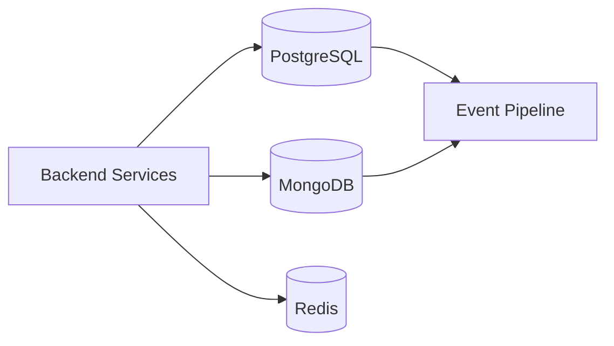
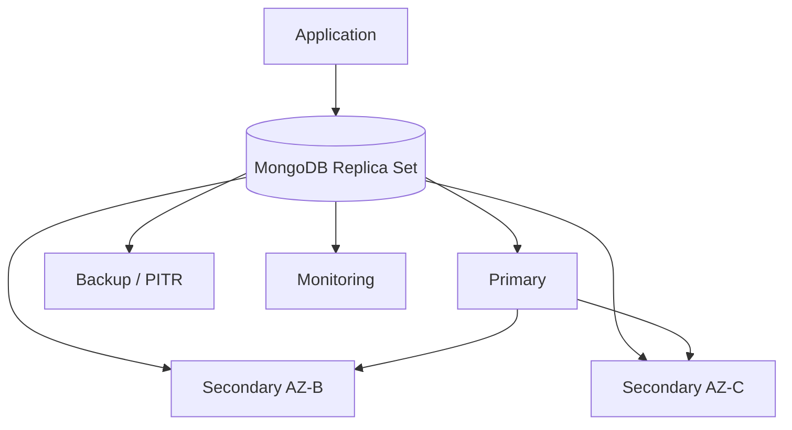

# 16- Comparison and Design Questions

## Overview

MongoDB comparison and design questions evaluate whether an engineer can choose an appropriate persistence model, justify architectural trade-offs, and design MongoDB around real application requirements.

At intermediate level, candidates are expected to understand differences between MongoDB features and relational database concepts. At senior level, the discussion should move toward:

- Access-pattern-driven data modeling
- Consistency requirements
- Transaction boundaries
- Query and index behavior
- Read/write workload characteristics
- Replication and availability
- Sharding
- Caching
- Event-driven architecture
- Operational complexity
- Security
- Backup and disaster recovery
- Cost and organizational trade-offs

A strong answer does not say that one technology is universally better.

Instead, it explains:

```text
Requirements
    ↓
Workload
    ↓
Access Patterns
    ↓
Data Model
    ↓
Consistency Requirements
    ↓
Performance Requirements
    ↓
Operational Constraints
    ↓
Technology Choice
    ↓
Trade-offs
```

## MongoDB vs Relational Databases

The most common comparison is MongoDB versus PostgreSQL or another relational database.

| Concern | MongoDB | PostgreSQL |
|---|---|---|
| Primary model | Document | Relational |
| Schema | Flexible | Strongly structured |
| Relationships | Embedded/reference-based | Foreign keys and joins |
| Joins | `$lookup` available | Native relational joins |
| Transactions | Multi-document transactions supported | Mature transactional model |
| Data modeling | Access-pattern driven | Relationship/entity driven |
| JSON/document workloads | Native | JSONB available |
| Referential integrity | Application/design dependent | Strong database support |
| Horizontal scaling | Native sharding capabilities | Usually requires additional architecture |
| Ad hoc relational queries | Less natural | Strong |
| Embedded aggregates | Natural | Usually normalized or JSON-based |
| Schema evolution | Flexible | Usually migration-driven |
| Operational model | Document-oriented | Relational |

Neither model is inherently superior.

The important question is:

> Which database model naturally represents the application's dominant workload and consistency requirements?

## MongoDB vs PostgreSQL: Data Modeling

Consider an order:

```text
Order
 ├── customer
 ├── items
 │    ├── product
 │    ├── quantity
 │    └── price
 └── status
```

### MongoDB Model

```json
{
  "_id": "order-123",
  "customer_id": "customer-456",
  "status": "confirmed",
  "items": [
    {
      "product_id": "product-1",
      "name": "Keyboard",
      "quantity": 2,
      "unit_price": 75
    }
  ]
}
```

The aggregate can be retrieved with one document read.

### PostgreSQL Model

A relational model may use:

```text
orders
order_items
products
customers
```

with foreign keys connecting the entities.

### Design Trade-Off

MongoDB favors:

```text
Aggregate-oriented reads
```

PostgreSQL favors:

```text
Relationship-oriented modeling
```

This distinction matters more than the SQL-versus-NoSQL label.

## MongoDB vs PostgreSQL: When MongoDB Is a Strong Fit

MongoDB can be a strong fit when:

- Data naturally forms document aggregates.
- Schema varies between records.
- The application frequently reads aggregates together.
- Horizontal scaling is important.
- Relationships are limited or can be modeled through references.
- Rapid schema evolution is useful.
- The workload benefits from document-oriented access patterns.

Examples include:

- Product catalogs
- User profiles
- Content management
- Event metadata
- Configuration documents
- Device metadata
- Certain high-volume operational workloads

## MongoDB vs PostgreSQL: When PostgreSQL Is a Strong Fit

PostgreSQL may be more natural when the application requires:

- Complex relationships
- Strong referential integrity
- Extensive joins
- Relational reporting
- Mature relational constraints
- Highly relational transactional workflows
- SQL-heavy analytics

Examples include:

- Financial accounting
- Complex ERP systems
- Highly relational business systems
- Systems with extensive foreign-key relationships

The final decision should come from workload and consistency requirements rather than database popularity.

## MongoDB vs Redis

MongoDB and Redis are often used together rather than as direct alternatives.

| Concern | MongoDB | Redis |
|---|---|---|
| Primary role | Persistent document database | In-memory data store |
| Durability | Strong persistence options | Persistence available but different semantics |
| Complex documents | Strong | Limited compared with MongoDB |
| Querying | Rich query model | Data-structure-oriented |
| Aggregation | Aggregation pipeline | Limited analytical querying |
| Cache workloads | Possible | Excellent |
| Low-latency access | Fast | Extremely low latency |
| Durable source of truth | Common use | Usually not the default choice |
| TTL | Supported | Core capability |
| Distributed cache | Not primary use | Common use |

A common architecture is:

```text
API
 ↓
Redis
 ├── Cache hit → Response
 └── Cache miss
          ↓
       MongoDB
          ↓
       Redis SET
          ↓
       Response
```

MongoDB remains the durable source of truth while Redis handles hot data.

## MongoDB vs Kafka

MongoDB and Kafka solve fundamentally different problems.

| Concern | MongoDB | Kafka |
|---|---|---|
| Primary role | Database | Event streaming platform |
| Query current state | Excellent | Not primary purpose |
| Store aggregates | Excellent | Not primary purpose |
| Event replay | Limited compared with Kafka | Core capability |
| Consumer groups | No | Yes |
| Event ordering | Document-level considerations | Partition-level ordering |
| Event streaming | Change streams available | Core capability |
| Transactions | Database transactions | Different transactional model |
| Random document lookup | Excellent | Not designed for this |
| Long-term event log | Possible use cases | Core capability |

A common architecture is:

```text
Application
    ↓
MongoDB
    ↓
Change Stream / Outbox
    ↓
Kafka
    ↓
Consumers
```

MongoDB stores application state.

Kafka distributes events between services.

## MongoDB vs Elasticsearch

MongoDB can support many application search patterns, but specialized search workloads may require a dedicated search platform.

| Requirement | MongoDB | Elasticsearch |
|---|---|---|
| Primary document storage | Strong | Possible but different role |
| Transactional application state | Strong | Usually not primary source of truth |
| Basic filtering | Strong | Strong |
| Full-text search | Supported capabilities | Strong |
| Relevance ranking | More limited | Strong |
| Search analytics | Possible | Strong |
| Aggregation | Strong | Strong |
| Operational simplicity | Usually simpler as primary DB | Additional system |

A common architecture is:

```text
Application
   ↓
MongoDB
   ↓
Change Stream / Event Pipeline
   ↓
Search Index
   ↓
Search API
```

MongoDB remains the authoritative store while the search system maintains a derived index.

## MongoDB vs DynamoDB

MongoDB and DynamoDB are both non-relational databases but have different architectural models.

| Concern | MongoDB | DynamoDB |
|---|---|---|
| Data model | Documents | Key-value/document |
| Query model | Rich query and aggregation | Access-pattern/key-oriented |
| Managed AWS service | Not AWS-native | AWS-native |
| Horizontal scaling | Sharding | Managed partitioning |
| Indexing | Multiple index types | Primary key + secondary indexes |
| Aggregation | Rich pipeline | Limited database-side aggregation |
| Operational control | More configurable | Highly managed |
| AWS integration | External platform | Deep AWS integration |
| Local development | Straightforward | AWS/local emulator options |

DynamoDB strongly encourages designing around known access patterns and keys.

MongoDB provides a richer query model and more flexible document-oriented querying.

## MongoDB vs Cassandra

| Concern | MongoDB | Cassandra |
|---|---|---|
| Data model | Document | Wide-column |
| Query flexibility | Higher | Query-driven |
| Joins | `$lookup` | Not relational |
| Aggregation | Rich | Limited database-side aggregation |
| Write scalability | Strong | Strong |
| Data modeling | Document aggregates | Query/table-oriented |
| Operational complexity | Significant at scale | Significant |
| Best fit | Flexible document workloads | Very high-volume distributed writes |

The choice should depend on workload characteristics rather than treating both as generic NoSQL databases.

## MongoDB vs SQL: Transaction Design

MongoDB supports multi-document transactions, but transaction availability does not mean every operation should use one.

### Prefer Single-Document Atomicity When Possible

Instead of:

```text
Document A
Document B
Document C
```

requiring a transaction, consider whether the data can be modeled as one atomic aggregate.

```json
{
  "_id": "order-123",
  "status": "confirmed",
  "items": [
    {
      "product_id": "product-1",
      "quantity": 2
    }
  ]
}
```

This can reduce transaction overhead and simplify failure handling.

### Use Transactions When

- Multiple documents must change atomically.
- A business invariant spans documents.
- Partial updates are unacceptable.

### Avoid Transactions When

- A single document can model the operation.
- The workflow is long-running.
- External HTTP calls are involved.
- The transaction processes large amounts of data.

## MongoDB vs PostgreSQL: Consistency

MongoDB supports configurable read and write concerns.

PostgreSQL typically provides strong transactional semantics within its relational architecture.

The comparison should consider:

```text
Durability
Consistency
Replication
Read-after-write requirements
Failure behavior
Transaction scope
```

Do not reduce the discussion to:

```text
MongoDB = eventual consistency
PostgreSQL = strong consistency
```

MongoDB's consistency behavior depends on configuration, topology, and operation.

## Embedded Documents vs References

This is one of the most important MongoDB design questions.

### Embed When

- Data is frequently read together.
- Child data is bounded.
- Child lifecycle belongs to the parent.
- Atomic updates are useful.
- Duplication is acceptable.

### Reference When

- Child data grows without a practical bound.
- Child data has an independent lifecycle.
- Data is shared by many parents.
- Child records are independently queried.
- Updates should not rewrite large parent documents.

## One-to-One Design

Example:

```text
User
 └── Profile
```

### Embedded

```json
{
  "_id": "user-123",
  "email": "user@example.com",
  "profile": {
    "timezone": "Asia/Kolkata",
    "language": "en"
  }
}
```

Useful when profile data is always accessed with the user.

### Referenced

```text
users
profiles
```

Useful when profile data has an independent lifecycle or access pattern.

## One-to-Many Design

Consider:

```text
Customer
 └── Orders
```

### Small Bounded Collection

Embedding may work:

```json
{
  "_id": "customer-123",
  "orders": [
    {
      "order_id": "order-1",
      "total": 100
    }
  ]
}
```

### Unbounded Collection

Use references:

```text
customers
orders
```

An array that grows indefinitely is a common MongoDB anti-pattern.

## Many-to-Many Design

For:

```text
Users ↔ Roles
```

Possible models include:

### Embedded Small Role Set

```json
{
  "_id": "user-123",
  "roles": [
    "admin",
    "report_viewer"
  ]
}
```

### Reference Collections

```text
users
roles
user_roles
```

The choice depends on:

- Cardinality
- Query patterns
- Update frequency
- Ownership
- Authorization requirements

## Denormalization vs Normalization

### Normalization

Reduces duplication.

```text
Order
 ↓
Product
```

### Denormalization

Stores data required by the read path.

```json
{
  "product_id": "product-1",
  "product_name": "Keyboard",
  "unit_price": 75
}
```

### Why Denormalize?

If historical order information must remain unchanged, copying the product name and price into the order is intentional.

The trade-off is:

```text
Faster/simple reads
        vs
More duplicated data
```

Controlled duplication is a design technique, not automatically bad data modeling.

## Schema Flexibility vs Schema Validation

MongoDB supports flexible schemas, but production systems often need controlled structure.

| Approach | Advantage | Risk |
|---|---|---|
| Completely flexible | Maximum agility | Data inconsistency |
| Application validation | Strong application control | Other writers may bypass it |
| Database validation | Central enforcement | Schema changes require management |
| Both | Defense in depth | More maintenance |

A production system can combine:

```text
Pydantic / application validation
        +
MongoDB JSON Schema validation
```

This prevents the database from becoming an uncontrolled collection of incompatible document shapes.

## Schema Validation vs Application Validation

Application validation can provide:

- API-specific validation
- User-friendly errors
- Business rules
- Type conversion

Database validation provides:

- Database-level enforcement
- Protection against incorrect writers
- Structural guarantees

Neither completely replaces the other.

## Skip/Limit vs Cursor Pagination

| Approach | Advantages | Limitations |
|---|---|---|
| `skip()` + `limit()` | Simple | Deep pages can become expensive |
| Cursor pagination | Efficient for large datasets | More complex |
| Range queries | Efficient | Requires stable ordering |
| Offset pagination | Familiar API | Performance degrades with depth |

Cursor pagination commonly uses a stable key such as:

```text
created_at + _id
```

The second field provides deterministic ordering when timestamps are equal.

## MongoDB Index Design vs Query Design

Indexes should follow actual query patterns.

Suppose the application executes:

```javascript
db.orders.find({
  tenant_id: "tenant-123",
  status: "active"
}).sort({
  created_at: -1
})
```

A candidate index is:

```javascript
db.orders.createIndex({
  tenant_id: 1,
  status: 1,
  created_at: -1
})
```

The design should be validated with:

```javascript
db.orders.find({
  tenant_id: "tenant-123",
  status: "active"
}).sort({
  created_at: -1
}).explain("executionStats")
```

The index should be evaluated using actual execution statistics rather than theoretical rules alone.

## ESR Guideline

The ESR guideline is commonly summarized as:

```text
Equality
Sort
Range
```

For example:

```javascript
{
  tenant_id: 1,
  status: 1,
  created_at: -1
}
```

where:

```text
tenant_id → equality
status    → equality
created_at → sort
```

The exact optimal index depends on the complete query shape, data distribution, and workload.

Do not treat ESR as a mechanical formula that overrides actual execution-plan analysis.

## Covered Queries

A covered query can obtain the required fields directly from the index without fetching the complete document.

Example:

```javascript
db.users.find(
  {
    email: "user@example.com"
  },
  {
    _id: 0,
    email: 1,
    status: 1
  }
)
```

With a suitable index, this can reduce document fetch work.

### Trade-Off

Additional indexes consume:

- Storage
- Memory
- Write resources
- Operational complexity

A covered query is not automatically worth an additional index.

## Compound Index vs Multiple Single-Field Indexes

Suppose queries commonly use:

```text
tenant_id + status
```

A compound index:

```javascript
{
  tenant_id: 1,
  status: 1
}
```

may be more useful than separate indexes:

```javascript
{
  tenant_id: 1
}

{
  status: 1
}
```

because it directly represents the query pattern.

Index intersection exists, but relying on multiple independent indexes is not a substitute for intentionally designed compound indexes.

## Partial Index vs Sparse Index

Both can reduce index size, but their semantics differ.

### Partial Index

Explicitly defines a filter:

```javascript
db.users.createIndex(
  { email: 1 },
  {
    unique: true,
    partialFilterExpression: {
      active: true
    }
  }
)
```

### Sparse Index

Indexes documents where the indexed field exists.

Partial indexes generally provide more explicit control over which documents participate.

Use the mechanism that matches the required semantics rather than selecting one based only on index size.

## TTL Index vs Application Cleanup

| Approach | Advantage | Limitation |
|---|---|---|
| TTL index | Database-managed expiration | Timing is not an exact scheduler |
| Application cleanup | Flexible business rules | Requires worker/process |
| Scheduled batch deletion | Controlled | Can create deletion spikes |

TTL indexes are useful for data such as:

- Temporary sessions
- Short-lived tokens
- Ephemeral events
- Temporary records

Do not use TTL when deletion must happen at an exact business timestamp.

## Transactions vs Eventual Consistency

Use a transaction when immediate atomicity is required.

Use asynchronous/eventual processing when:

```text
Immediate consistency is not required
```

For example:

```text
Order created
    ↓
MongoDB
    ↓
Event
    ↓
Analytics service
```

Analytics does not necessarily need to participate in the order transaction.

This keeps the core transaction small while allowing downstream systems to process asynchronously.

## Transactions vs Saga-Style Workflows

A database transaction provides atomicity inside its supported transactional boundary.

A distributed workflow across:

```text
MongoDB
Payment provider
Kafka
Email service
Inventory service
```

cannot usually be solved with one database transaction.

Use workflow patterns such as:

- Saga
- Compensating actions
- Idempotency
- Outbox
- Event-driven state transitions

The architecture must model partial failure explicitly.

## MongoDB Replica Set vs Sharded Cluster

| Concern | Replica Set | Sharded Cluster |
|---|---|---|
| Primary purpose | HA and replication | Horizontal scaling |
| Data distribution | Full dataset per member | Dataset distributed across shards |
| Complexity | Lower | Higher |
| Automatic failover | Yes | Yes within shard replica sets |
| Horizontal data scaling | Limited | Strong |
| Operational overhead | Lower | Higher |
| Shard-key design | Not required | Critical |
| Suitable starting point | Most deployments | Large-scale workloads |

A common mistake is introducing sharding before proving that a properly sized replica set cannot satisfy the workload.

## Replica Set vs Read Scaling

Replica sets can distribute some read workloads using read preferences.

However:

```text
Replica set
```

does not mean:

```text
Unlimited read scaling
```

All members still participate in replication and storage of the dataset.

Read scaling should account for:

- Replication lag
- Query distribution
- Secondary capacity
- Consistency requirements
- Network topology

## Sharding: Range vs Hashed Keys

### Ranged Sharding

Useful when range queries are important.

Example:

```text
created_at
```

can support temporal locality and range-oriented access, but a poor monotonically increasing key can create write concentration depending on the deployment and workload.

### Hashed Sharding

Provides more even distribution for many workloads.

However, it can make range-based targeting less effective.

### Design Question

Ask:

```text
Do I optimize primarily for distribution?
or
Do I need efficient range targeting?
```

The answer should come from workload requirements.

## Change Streams vs Kafka

Change streams are database change notifications.

Kafka is a distributed event-streaming platform.

| Requirement | Change Streams | Kafka |
|---|---|---|
| Observe MongoDB changes | Excellent | Requires integration |
| Event streaming platform | Limited | Excellent |
| Multiple independent consumers | Possible | Strong |
| Long event retention | Not primary purpose | Strong |
| Consumer groups | Application-managed | Native |
| Database integration | Direct | External pipeline |

Change streams can feed Kafka:

```text
MongoDB
   ↓
Change Stream Consumer
   ↓
Kafka
   ↓
Consumers
```

## MongoDB Change Streams vs Polling

| Approach | Advantage | Limitation |
|---|---|---|
| Change streams | Near-real-time, efficient | Requires supported topology |
| Polling | Simple | Latency and repeated query cost |
| Timestamp polling | Easy to implement | Requires careful ordering |
| Event log | Strong event semantics | Additional architecture |

For systems requiring near-real-time database change notifications, change streams are generally preferable to aggressive polling when the deployment supports them.

## MongoDB + Redis: Cache-Aside vs Write-Through

### Cache-Aside

```text
Read
 ↓
Cache
 ├── Hit → Return
 └── Miss → MongoDB → Cache → Return
```

The application manages cache population.

### Write-Through

```text
Application
    ↓
Cache
    ↓
Persistent Store
```

The cache layer participates directly in writes.

For many backend APIs, cache-aside is easier to reason about.

## Cache Invalidation Design

Suppose:

```text
MongoDB user
+
Redis user cache
```

A user update must consider:

```text
Write MongoDB
↓
Invalidate / update Redis
```

If the cache update fails, the system needs a recovery strategy.

Common approaches:

- TTL
- Explicit invalidation
- Versioned keys
- Event-driven invalidation
- Cache-aside refresh

Cache invalidation should be designed explicitly rather than treated as an implementation detail.

## MongoDB + PostgreSQL: Polyglot Persistence

Using both databases can be justified when workloads differ.

Example:



Possible ownership:

```text
PostgreSQL
→ financial/accounting relationships

MongoDB
→ document-oriented operational aggregates

Redis
→ cache

Kafka
→ events
```

### Risk

Every additional persistence system introduces:

- Failure modes
- Deployment complexity
- Monitoring requirements
- Backup requirements
- Data synchronization concerns
- Operational expertise requirements

Use polyglot persistence deliberately.

## MongoDB vs MongoEngine vs PyMongo

These are not equivalent layers.

| Option | Role |
|---|---|
| PyMongo | MongoDB driver |
| MongoEngine | ODM |
| Django ORM | Relational ORM primarily |
| Repository pattern | Application architecture |

### PyMongo

Provides direct control over:

- Queries
- Aggregations
- Sessions
- Transactions
- Indexes
- Driver configuration

### MongoEngine

Provides document-oriented object mapping.

It can improve developer ergonomics but introduces an abstraction layer.

### Repository Pattern

Provides application-level isolation:

```text
Service
  ↓
Repository
  ↓
MongoDB Driver / ODM
```

For complex applications, this can make persistence concerns easier to test and evolve.

## FastAPI + MongoDB vs Django + MongoDB

| Concern | FastAPI | Django |
|---|---|---|
| API-first development | Strong | Strong with DRF |
| Async architecture | Strong | Supported but framework architecture differs |
| Native MongoDB ORM | No | No |
| Repository pattern | Natural | Natural |
| Pydantic | Native ecosystem | Often via DRF/other serializers |
| MongoDB integration | PyMongo/driver/ODM | PyMongo/MongoEngine/ODM |
| Admin ecosystem | Less integrated | Strong Django ecosystem |
| MongoDB abstraction | Explicit | Requires explicit architecture |

In both frameworks, MongoDB should have a clear persistence boundary.

## MongoDB vs PostgreSQL for Django

Django's native ORM is designed around relational database concepts.

If a Django system needs MongoDB:

```text
Django
  ↓
Service Layer
  ↓
Repository
  ↓
PyMongo / MongoEngine
  ↓
MongoDB
```

Do not assume that Django models, foreign keys, joins, migrations, and ORM behavior will translate directly into MongoDB semantics.

## Design Question: One Large Document vs Multiple Documents

Suppose a customer has:

```text
Profile
Preferences
Orders
Audit events
Notifications
```

Putting everything into one document may appear convenient.

But orders and audit events can grow without bounds.

A better model may be:

```text
customers
    ↓
profile + preferences embedded

orders
    ↓
customer_id

audit_events
    ↓
customer_id

notifications
    ↓
customer_id
```

The design follows:

```text
Bounded aggregate
+
Independent lifecycle
+
Access pattern
```

rather than an attempt to represent the entire business entity in one document.

## Design Question: Single Collection vs Multiple Collections

Multiple collections may be appropriate when:

- Documents have substantially different schemas.
- Access patterns are different.
- Retention policies differ.
- Index requirements differ.
- Ownership differs.

A single collection may be preferable when:

- Documents share a common access pattern.
- Queries need to operate across all variants.
- A discriminator field can distinguish types.
- Indexes can serve the workload effectively.

Do not create one collection per business subtype without a query and operational reason.

## Design Question: Shared Collection vs Tenant Collections

### Shared Collection

```text
orders
 ├── tenant A
 ├── tenant B
 └── tenant C
```

Advantages:

- Simpler operations
- Easier global queries
- Fewer collections
- Easier index management

Risks:

- Tenant isolation must be enforced carefully
- Large tenants can dominate workload

### Tenant-Specific Collections

```text
tenant_a_orders
tenant_b_orders
tenant_c_orders
```

Advantages:

- Stronger physical separation
- Potentially easier tenant-specific lifecycle

Risks:

- Collection explosion
- Operational complexity
- More indexes
- Harder global queries

The shared model is often simpler until isolation requirements justify stronger separation.

## Design Question: Should You Store Relationships in MongoDB?

Yes, but relationships should be modeled according to access patterns.

Possible techniques:

- Embedded documents
- Reference IDs
- Controlled duplication
- Aggregation with `$lookup`
- Application-level joins

Avoid automatically normalizing every relationship just because relational modeling is familiar.

## Design Question: MongoDB for Reporting

MongoDB can support analytical aggregations, but operational and analytical workloads may compete for resources.

For large reporting workloads, consider:

```text
Operational MongoDB
       ↓
Change Stream / ETL
       ↓
Analytics Store
```

Potential destinations include:

- Data warehouse
- Lakehouse
- Specialized analytics system

The goal is to prevent expensive analytical workloads from degrading latency-sensitive operational traffic.

## Design Question: Precompute or Calculate on Read?

Suppose an API needs:

```text
customer lifetime value
```

### Calculate on Read

```text
Request
 ↓
Aggregate millions of records
 ↓
Return result
```

### Precompute

```text
Order event
 ↓
Worker
 ↓
Update derived value
 ↓
API reads value
```

Precomputation trades:

```text
More write/update complexity
```

for:

```text
Faster reads
```

This is useful when the derived value is expensive and frequently requested.

## Design Question: MongoDB as an Event Store

MongoDB can store event-like records, but an event-store architecture has requirements beyond simply storing documents with timestamps.

Consider:

- Ordering
- Append-only semantics
- Replay
- Retention
- Consumer offsets
- Concurrency
- Event versioning
- Event schema evolution

If event streaming and replay are core requirements, Kafka or another event-streaming platform may be a more natural architectural component.

## Design Question: Design for Idempotency

For an API:

```text
POST /orders
```

use an idempotency key:

```json
{
  "idempotency_key": "client-request-123",
  "items": [
    {
      "product_id": "product-1",
      "quantity": 2
    }
  ]
}
```

Enforce uniqueness:

```javascript
db.orders.createIndex(
  {
    customer_id: 1,
    idempotency_key: 1
  },
  {
    unique: true
  }
)
```

This protects against concurrent duplicate requests.

## Design Question: Strong Consistency vs Availability

The correct answer depends on the business operation.

### Stronger Consistency

Useful for:

- Financial state
- Inventory correctness
- Critical authorization state
- State transitions where stale reads are dangerous

### Eventual Consistency

Useful for:

- Analytics
- Search indexes
- Recommendations
- Notifications
- Derived counters

The architecture should separate correctness-critical state from asynchronously derived state where possible.

## Design Question: MongoDB Read Preference

| Read Preference | Typical Use |
|---|---|
| `primary` | Strongest freshness expectation |
| `primaryPreferred` | Prefer primary, tolerate topology changes |
| `secondary` | Intentionally route reads to secondaries |
| `secondaryPreferred` | Prefer secondaries where acceptable |
| `nearest` | Latency-oriented topology |

The exact behavior should be evaluated against replication lag and consistency requirements.

Never select a read preference solely to distribute traffic.

## Design Question: Write Concern

| Write Concern | General Meaning |
|---|---|
| `w: 0` | Do not wait for acknowledgement |
| `w: 1` | Acknowledge primary write |
| `w: "majority"` | Wait for majority acknowledgement |

For important production writes, durability requirements should determine the write concern.

For example:

```javascript
{
  w: "majority"
}
```

may be appropriate when the application needs stronger durability guarantees.

The correct setting depends on the failure model and latency requirements.

## Design Question: Read Concern

Read concern determines the consistency characteristics of data returned by reads.

The appropriate level depends on:

- Replica-set topology
- Transaction usage
- Durability requirements
- Staleness tolerance
- Business correctness

Avoid selecting the strongest setting everywhere without measuring the performance and availability consequences.

## Design Question: Design a High-Availability Architecture

A typical architecture:



Consider:

- Independent failure domains
- Majority availability
- Storage reliability
- Network connectivity
- Automated failover
- Backup
- Monitoring
- Restore testing

High availability and disaster recovery are related but different.

## High Availability vs Disaster Recovery

| Concern | High Availability | Disaster Recovery |
|---|---|---|
| Primary goal | Continue service | Recover after major failure |
| Typical failure | Node/AZ | Region/data loss |
| Mechanism | Replica set | Backup/PITR/secondary environment |
| RTO | Usually low | Defined recovery objective |
| RPO | Usually low | Explicitly defined |
| Operational process | Automated failover | Recovery runbook |

A replica set does not eliminate the need for backups.

## Design Question: Managed MongoDB vs Self-Managed MongoDB

| Concern | Managed | Self-Managed |
|---|---|---|
| Infrastructure operations | Lower | Higher |
| Configuration control | Lower | Higher |
| Backup integration | Usually easier | Team-owned |
| Upgrades | Simplified | Team-owned |
| Scaling | Usually easier | Team-owned |
| Cost visibility | Service-based | Infrastructure + operations |
| Operational expertise | Lower requirement | Higher requirement |
| Custom topology | More constrained | More control |

For many production teams, the operational burden of running a database can be significant.

The decision should consider:

- Team expertise
- Compliance
- Cost
- Required control
- Availability requirements
- Operational maturity

## Design Question: Atlas vs Self-Managed MongoDB

MongoDB Atlas can reduce infrastructure management overhead.

Self-managed deployments can provide more control over:

- Infrastructure
- Networking
- Configuration
- Deployment topology
- Operational tooling

The correct choice depends on organizational requirements rather than simply feature availability.

## Design Question: MongoDB in Docker

Docker is useful for:

- Local development
- Integration testing
- Reproducible environments

A local development setup may be:

```yaml
services:
  mongo:
    image: mongo:latest
    ports:
      - "27017:27017"
```

Production database deployment requires additional consideration around:

- Persistent storage
- Replica sets
- Backups
- Monitoring
- Security
- Upgrade procedures
- Failure domains

A local Docker container should not be treated as a production database architecture.

## Design Question: MongoDB in Kubernetes

Kubernetes introduces:

```text
Pods
Persistent Volumes
Services
Scheduling
Node failure
Pod disruption
Network identity
```

A stateful MongoDB deployment therefore needs careful design around:

- Stable identities
- Persistent storage
- Replica-set configuration
- Pod anti-affinity
- Failure domains
- Backup
- Upgrade strategy

Managed MongoDB may be preferable when the organization does not want to own database operations.

## Design Question: Design Backup Strategy

A production strategy can include:

```text
MongoDB
   ↓
Automated Backup
   ↓
Independent Storage
   ↓
Point-in-Time Recovery
   ↓
Restore Testing
```

Evaluate:

- RPO
- RTO
- Backup frequency
- Retention
- Regional disaster
- Backup isolation
- Restore validation

A backup that has never been restored in a test environment is not sufficient evidence of recovery readiness.

## Design Question: Design for Cost

MongoDB cost is influenced by:

```text
Compute
Storage
IOPS
Memory
Replication
Backups
Network traffic
Indexes
Managed service tier
Operational labor
```

A design that minimizes database compute but requires extensive operational engineering may not be cheaper overall.

Cost analysis should include operational complexity.

## Design Question: Large Documents vs Smaller Documents

### Large Documents

Advantages:

- Fewer reads
- Strong aggregate locality
- Potentially simpler application code

Risks:

- Larger network payloads
- Larger updates
- More memory usage
- Document growth
- Hot-document contention

### Smaller Documents

Advantages:

- More granular updates
- Independent lifecycle
- Smaller payloads

Risks:

- More queries
- More application-side joins
- Potentially more network round trips

The right size is determined by access patterns.

## Design Question: Should You Store Files in MongoDB?

Large binary content should be evaluated separately from normal application documents.

MongoDB provides GridFS for storing files larger than the BSON document size limit or when GridFS semantics are useful.

However, object storage such as Amazon S3 is often a more natural choice for large application files.

A common architecture is:

```text
Application
   ↓
S3
   +
MongoDB
   └── object metadata
```

MongoDB stores metadata while object storage handles large binary content.

## Design Question: Search in MongoDB or Separate Search System?

Use MongoDB querying for normal structured filtering.

Consider a specialized search engine when requirements include:

- Advanced relevance ranking
- Complex full-text search
- Search analytics
- Large-scale text indexing
- Specialized search features

Avoid introducing another distributed system unless the search workload justifies it.

## Design Question: MongoDB and API Gateway

A typical request path:

```text
Client
  ↓
Nginx / API Gateway
  ↓
FastAPI / Django
  ↓
Service Layer
  ↓
Repository
  ↓
MongoDB
```

The API gateway should handle concerns such as:

- Routing
- Authentication integration
- Rate limiting
- Request policies

MongoDB should remain behind application services rather than being exposed directly to clients.

## Design Question: MongoDB and Celery

MongoDB and Celery can participate in asynchronous processing:

```text
API
 ↓
MongoDB
 ↓
Celery Task
 ↓
Worker
 ↓
MongoDB / External Service
```

Use Celery for background jobs such as:

- Report generation
- Data processing
- Notifications
- Backfills
- Non-critical asynchronous workflows

Do not use a background queue to hide an inefficient synchronous query that should be optimized.

## Design Question: MongoDB and gRPC

In a microservice environment:

```text
Service A
   ↓ gRPC
Service B
   ↓
MongoDB
```

MongoDB should normally remain an implementation detail of the owning service.

Avoid:

```text
Service A → Service B MongoDB collection
```

because it creates tight coupling to another service's persistence model.

## Design Question: Database-per-Service vs Shared Database

| Model | Advantages | Risks |
|---|---|---|
| Shared database | Lower infrastructure cost | Tight coupling |
| Separate database | Strong ownership | Higher operational cost |
| Shared cluster, separate databases | Balance | Still shared failure domain |
| Separate clusters | Strong isolation | Highest operational complexity |

For microservices, logical ownership is usually more important than immediately creating a separate physical cluster for every service.

## Design Question: How Would You Migrate From PostgreSQL to MongoDB?

Do not begin with a bulk copy alone.

First establish:

```text
Current access patterns
↓
Target document model
↓
Data mapping
↓
Indexes
↓
Consistency requirements
↓
Migration strategy
↓
Dual-write / CDC strategy
↓
Validation
↓
Cutover
↓
Rollback
```

Possible migration strategies include:

- Offline migration
- Dual writes
- Change data capture
- Shadow reads
- Incremental migration
- Feature-flagged cutover

The migration must account for writes occurring during the transition.

## Design Question: MongoDB Migration Without Downtime

A common pattern:

```text
Existing System
      ↓
Initial Data Migration
      ↓
Continuous Change Capture
      ↓
Validation
      ↓
Shadow Reads
      ↓
Traffic Cutover
      ↓
Monitoring
      ↓
Rollback Window
```

The migration should have measurable validation criteria before traffic is switched.

## Design Question: How Would You Version Documents?

Possible approach:

```json
{
  "_id": "order-123",
  "schema_version": 2,
  "status": "confirmed"
}
```

The application can support multiple versions during rolling migration.

Avoid creating incompatible schema changes that require every document to be rewritten before the next deployment can start.

## Common Comparison Mistakes

### Comparing Databases by Labels

Avoid:

```text
SQL = strong
NoSQL = weak
```

or:

```text
MongoDB = scalable
PostgreSQL = not scalable
```

These statements are too broad to be useful.

### Ignoring Workload

A database decision without:

```text
Read/write ratio
Data volume
Query patterns
Consistency requirements
```

is incomplete.

### Treating All NoSQL Databases as Equivalent

MongoDB, DynamoDB, Cassandra, Redis, and other systems have substantially different data models and operational characteristics.

### Assuming Transactions Solve Distributed Consistency

A MongoDB transaction does not automatically make:

```text
MongoDB
+
Kafka
+
Payment Provider
```

one atomic system.

### Ignoring Operational Cost

Every additional datastore creates:

```text
Monitoring
Backup
Security
Upgrades
Incident response
Capacity planning
```

requirements.

## Common Design Traps

| Trap | Better Reasoning |
|---|---|
| Always embed | Embed bounded, frequently co-read data |
| Always reference | Reference independently managed or unbounded data |
| Always use transactions | First evaluate single-document atomicity |
| Always use Redis | Measure database performance first |
| Always shard | Prove horizontal scaling is required |
| Always read from secondary | Consider freshness and lag |
| Add indexes for every query | Balance read gains against write/storage costs |
| Store everything in one document | Respect growth and lifecycle boundaries |
| Use MongoDB for every workload | Choose storage according to access patterns |
| Use Kafka for every event | Add streaming infrastructure when requirements justify it |

## Senior-Level Comparison Questions

### MongoDB vs PostgreSQL: Which Would You Choose?

A strong answer should begin with:

```text
What are the access patterns?
What are the relationships?
What are the consistency requirements?
What is the expected scale?
What queries dominate?
What operational constraints exist?
```

Then compare the technologies against those requirements.

### MongoDB vs Redis: Which Should Store User Sessions?

For a high-volume, low-latency session workload:

```text
Redis
```

is often a natural choice.

MongoDB may be appropriate when sessions require durable document storage or richer querying.

The answer depends on session lifetime, durability requirements, latency, and scale.

### MongoDB vs Kafka: Where Should Events Live?

If the requirement is:

```text
Current application state
```

MongoDB is appropriate.

If the requirement is:

```text
Distributed event streaming
+
Consumer groups
+
Replay
```

Kafka is more appropriate.

Both can be used together.

### MongoDB vs PostgreSQL: Where Should Financial Transactions Live?

The answer should consider:

- Strong transactional requirements
- Relational integrity
- Auditability
- Reporting
- Existing financial workflows

A relational database may be more natural for highly relational financial systems, but the actual requirements should determine the decision.

## Production Decision Matrix

| Requirement | Commonly Suitable Choice |
|---|---|
| Document aggregates | MongoDB |
| Complex relational data | PostgreSQL |
| Low-latency cache | Redis |
| Event streaming | Kafka |
| Advanced search | Search engine |
| Large object storage | S3/object storage |
| Temporary expiring data | MongoDB TTL / Redis TTL |
| High-volume time-series | MongoDB time-series or specialized system |
| Strong financial relationships | PostgreSQL often fits naturally |
| Flexible content metadata | MongoDB often fits naturally |

These are starting points, not universal rules.

## Architecture Decision Checklist

Before choosing MongoDB, evaluate:

### Data Model

- Does the domain naturally form document aggregates?
- Which data is bounded?
- Which data is unbounded?
- Which entities have independent lifecycles?
- Is controlled denormalization acceptable?

### Queries

- What are the top query patterns?
- Which queries require sorting?
- What pagination strategy is required?
- Are complex joins central to the workload?
- Are full-text search requirements significant?

### Performance

- Expected reads/sec?
- Expected writes/sec?
- p95/p99 latency?
- Document size?
- Index size?
- Working set?
- Connection count?

### Consistency

- Is read-after-write required?
- What durability is required?
- Are transactions required?
- Can derived data be eventually consistent?

### Scalability

- Can a replica set handle the workload?
- Is sharding required?
- What is the shard-key strategy?
- Are hot documents possible?
- Are large tenants possible?

### Reliability

- What failures must be tolerated?
- What is the RPO?
- What is the RTO?
- How is failover handled?
- How are backups tested?

### Security

- Authentication?
- Authorization?
- TLS?
- Network isolation?
- Secret management?
- Encryption?
- Auditing?

### Operations

- Who manages the database?
- How are upgrades handled?
- How are slow queries detected?
- How is storage growth monitored?
- How are incidents handled?

## Interview Answer Structure

For comparison questions, use:

```text
1. Clarify requirements
2. Identify dominant workload
3. Compare data models
4. Compare consistency requirements
5. Compare query capabilities
6. Compare scaling model
7. Compare operational complexity
8. Discuss failure modes
9. Discuss security and DR
10. State the trade-off and conditions for the choice
```

For design questions, use:

```text
Requirements
↓
Access patterns
↓
Data model
↓
Indexes
↓
API/read/write path
↓
Consistency
↓
Caching
↓
Replication
↓
Scaling
↓
Security
↓
Observability
↓
Backup/DR
↓
Failure scenarios
↓
Trade-offs
```

## Key Takeaways

- MongoDB comparisons should be driven by workload, access patterns, consistency, scale, and operational requirements rather than database labels.
- Embedding, referencing, denormalization, indexing, transactions, and sharding are design choices whose correctness depends on the application's read/write behavior.
- MongoDB commonly complements PostgreSQL, Redis, Kafka, search systems, and object storage rather than replacing every specialized backend technology.
- Senior architecture decisions explicitly account for failure modes, connection capacity, consistency, security, observability, backup, disaster recovery, and operational cost.
- The strongest interview answers explain trade-offs and the conditions under which a design should change rather than presenting one technology or pattern as universally correct.