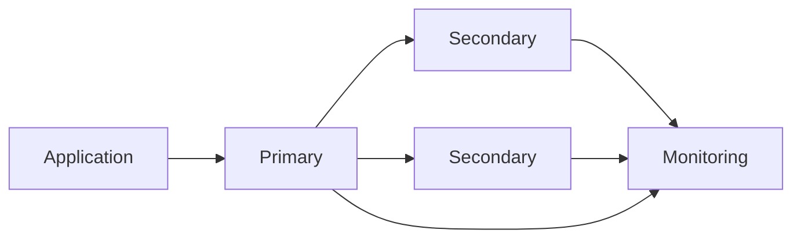
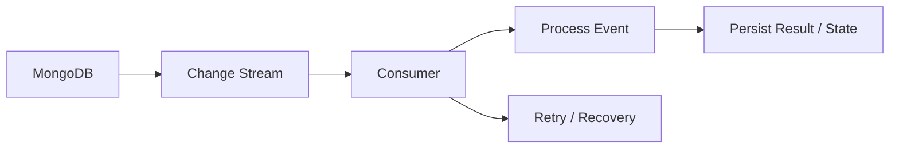
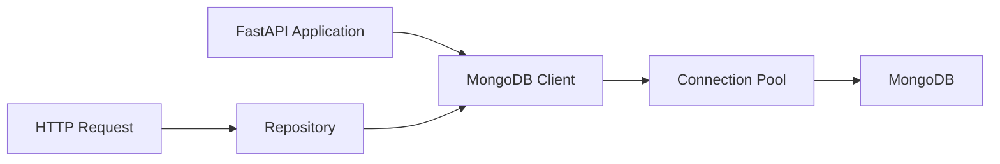
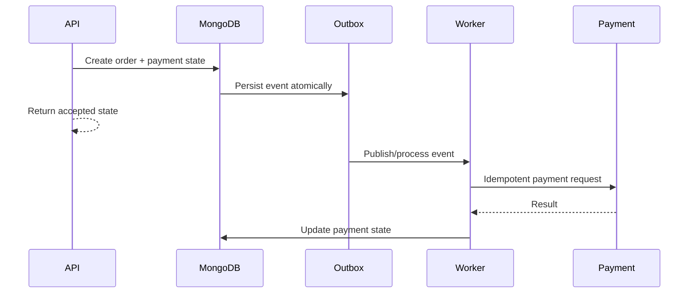
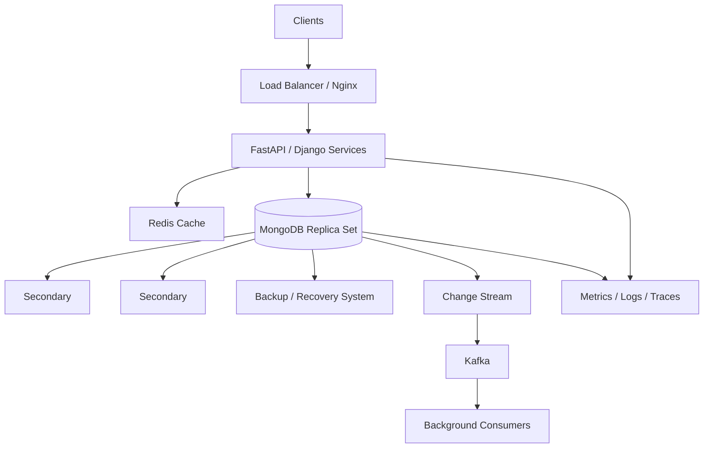

# 18- Senior Level Questions

## Overview

Senior-level MongoDB interviews focus less on syntax and more on engineering judgment.

The interviewer expects the candidate to reason about:

- Data modeling and access patterns
- Query execution and index design
- Consistency and atomicity
- Transactions
- Replica sets and failover
- Sharding and distributed workloads
- Connection management
- Performance and capacity
- Security
- Failure recovery
- Python application architecture
- FastAPI and Django integration
- Observability and operational safety

A strong senior answer should usually explain:

```text
Requirement
    ↓
Access Pattern
    ↓
Data Model
    ↓
Consistency Model
    ↓
Query and Index Strategy
    ↓
Capacity and Scalability
    ↓
Failure Handling
    ↓
Security
    ↓
Observability
    ↓
Trade-offs
```

The objective is not to demonstrate that MongoDB has a feature. The objective is to explain why that feature belongs in a particular production design.

---

## Senior Question: How Would You Design a MongoDB Data Model for a Large Order System?

Start with access patterns rather than collections.

Typical requirements may include:

- Get an order by ID
- List orders for a customer
- Filter by order status
- Display order items
- View shipping information
- Search orders by date
- Generate operational reports
- Update payment or fulfillment state

A reasonable document could be:

```json
{
  "_id": "order-1001",
  "tenant_id": "tenant-1",
  "customer_id": "customer-42",
  "status": "PAID",
  "items": [
    {
      "product_id": "product-1",
      "name": "Mechanical Keyboard",
      "quantity": 2,
      "unit_price": 100
    }
  ],
  "shipping_address": {
    "line1": "10 Example Street",
    "city": "Kolkata",
    "postal_code": "700001"
  },
  "totals": {
    "subtotal": 200,
    "tax": 36,
    "total": 236
  },
  "created_at": "2026-09-27T10:00:00Z"
}
```

Embedding order items and the historical shipping address can be appropriate because they belong to the order's immutable or transactional snapshot.

The senior-level reasoning is more important than the exact document:

- Order items are bounded by business constraints.
- The shipping address should represent the address used at purchase time.
- Product catalog data may remain independently owned.
- Frequently queried fields should have appropriate indexes.
- Reporting workloads may require separate read models rather than expensive operational queries.

---

## Senior Question: When Would You Embed Versus Reference?

Use embedding when related data:

- Is frequently read together
- Has bounded growth
- Shares lifecycle with the parent
- Benefits from atomic updates
- Does not need independent ownership

Use references when data:

- Has an independent lifecycle
- Is shared by many documents
- Can grow without a practical bound
- Is frequently updated independently
- Is queried independently

A useful decision matrix:

| Characteristic | Prefer Embedding | Prefer Reference |
|---|---|---|
| Read together | Strongly | Weakly |
| Bounded size | Yes | Not required |
| Independent lifecycle | No | Yes |
| High sharing | No | Yes |
| Atomic update required | Yes | Transaction may be required |
| Unbounded growth | No | Yes |
| Independent querying | Less suitable | Suitable |

There is no universal rule such as "MongoDB means embedding."

---

## Senior Question: How Would You Model One-to-Many Relationships?

Consider:

```text
Customer → Orders
```

If the number of orders is potentially very large, do not embed all orders inside the customer document.

Instead:

```text
customers
    |
    +-- customer document

orders
    |
    +-- customer_id
```

Query:

```javascript
db.orders.find({
  customer_id: "customer-42"
})
.sort({
  created_at: -1
})
.limit(50)
```

Possible index:

```javascript
db.orders.createIndex({
  customer_id: 1,
  created_at: -1
})
```

The senior consideration is cardinality.

A one-to-few relationship can often be embedded.

A one-to-many or one-to-millions relationship generally requires more careful modeling.

---

## Senior Question: How Would You Handle Many-to-Many Relationships?

Suppose:

```text
Users ↔ Organizations
```

If the number of relationships is bounded and access is mostly user-centric, embedding organization references in the user document may be reasonable.

For large or independently managed relationships, use a relationship collection:

```json
{
  "_id": "...",
  "user_id": "user-1",
  "organization_id": "org-10",
  "role": "admin",
  "created_at": "..."
}
```

Indexes should follow access patterns:

```javascript
db.memberships.createIndex({
  user_id: 1,
  organization_id: 1
})

db.memberships.createIndex({
  organization_id: 1,
  user_id: 1
})
```

The important question is not "Can MongoDB represent many-to-many?"

It can.

The important question is:

> "Which direction must be queried efficiently, and how large can the relationship set become?"

---

## Senior Question: How Would You Design a Multi-Tenant MongoDB Application?

A common document structure is:

```json
{
  "_id": "...",
  "tenant_id": "tenant-123",
  "status": "active",
  "created_at": "..."
}
```

Tenant scope should be applied consistently:

```javascript
{
  tenant_id: "tenant-123",
  status: "active"
}
```

Indexes often include the tenant identifier when tenant-scoped queries dominate:

```javascript
db.orders.createIndex({
  tenant_id: 1,
  status: 1,
  created_at: -1
})
```

Architecture considerations include:

- Tenant isolation
- Authorization
- Index design
- Tenant-specific workload differences
- Large-tenant hotspots
- Data residency
- Backup and recovery
- Operational isolation

A senior engineer should also ask whether the architecture is:

- Shared database/shared collections
- Database per tenant
- Cluster per tenant

The correct model depends on scale, isolation, compliance, and operational requirements.

---

## Senior Question: How Would You Prevent Cross-Tenant Data Leakage?

Do not rely on developers remembering to add:

```python
{"tenant_id": tenant_id}
```

to every query.

Tenant context should be part of the service or repository contract.

For example:

```python
class OrderRepository:
    def __init__(self, collection, tenant_id: str):
        self.collection = collection
        self.tenant_id = tenant_id

    def get(self, order_id: str):
        return self.collection.find_one({
            "_id": order_id,
            "tenant_id": self.tenant_id,
        })
```

Production safeguards should also include:

- Authorization middleware
- Repository/service boundaries
- Tests for tenant isolation
- Background-job isolation
- Export-job isolation
- Administrative access controls
- Audit logging

Tenant isolation is a security property, not merely a query convention.

---

## Senior Question: How Do You Diagnose a Slow MongoDB Query?

Use an evidence-driven process.

```text
Slow Request
    ↓
Identify Query Shape
    ↓
Run explain("executionStats")
    ↓
Inspect Winning Plan
    ↓
Compare Keys vs Documents Examined
    ↓
Inspect Indexes
    ↓
Check Data Distribution
    ↓
Check Server Resources
    ↓
Change Query / Model / Index
    ↓
Measure Again
```

Example:

```javascript
db.orders.find({
  customer_id: "customer-42",
  status: "PAID"
}).sort({
  created_at: -1
}).explain("executionStats")
```

Inspect:

- `nReturned`
- `totalKeysExamined`
- `totalDocsExamined`
- Execution time
- `winningPlan`
- Relevant index stages

A senior engineer should also determine whether the bottleneck is actually MongoDB.

The complete request path may be:

```text
Client
  ↓
Nginx
  ↓
FastAPI
  ↓
Repository
  ↓
Connection Pool
  ↓
MongoDB
```

Database execution time may be only one component of total latency.

---

## Senior Question: What Does a Good Execution Plan Look Like?

There is no single universally correct plan.

For a selective indexed query, an efficient pattern may look conceptually like:

```text
IXSCAN
  ↓
FETCH
  ↓
LIMIT
```

Potentially even:

```text
IXSCAN
  ↓
LIMIT
```

for a covered query.

A concerning pattern might be:

```text
COLLSCAN
  ↓
FILTER
  ↓
SORT
```

especially for a large collection and high-frequency request.

However, `COLLSCAN` is not automatically bad and `IXSCAN` is not automatically good.

Always consider:

- Dataset size
- Selectivity
- Returned result size
- Query frequency
- Sorting
- Working set
- Concurrency

---

## Senior Question: How Do You Design a Compound Index?

Start with the actual query:

```javascript
db.orders.find({
  tenant_id: "tenant-1",
  status: "PAID",
  created_at: {
    $gte: ISODate("2026-01-01")
  }
}).sort({
  priority: -1
})
```

A possible index could be:

```javascript
{
  tenant_id: 1,
  status: 1,
  priority: -1,
  created_at: -1
}
```

The exact ordering must be validated against the workload and MongoDB's index behavior.

Use the ESR guideline as a starting point:

```text
Equality → Sort → Range
```

Then validate using:

```javascript
explain("executionStats")
```

Consider:

- Cardinality
- Selectivity
- Sort direction
- Range predicates
- Query frequency
- Write overhead
- Index size

ESR is a design guideline, not a substitute for measurement.

---

## Senior Question: What Makes an Index Bad?

An index may be problematic when it:

- Supports no meaningful query
- Duplicates another index unnecessarily
- Has poor selectivity for the workload
- Is excessively large
- Increases write overhead
- Consumes memory
- Complicates index management

For example, creating:

```text
status
customer_id
created_at
```

as three separate indexes may be less useful than a carefully designed compound index if the dominant query is:

```text
customer_id + status + created_at
```

Index design must be workload-driven.

---

## Senior Question: How Do You Determine Whether an Index Is Actually Useful?

Use multiple signals:

- Query execution plans
- Query latency
- Index usage statistics
- Query frequency
- Keys examined
- Documents examined
- Production workload
- Write overhead

A simplified lifecycle is:

```text
Query Requirement
      ↓
Index Design
      ↓
Testing
      ↓
Production Deployment
      ↓
Usage Monitoring
      ↓
Performance Validation
      ↓
Retirement if Obsolete
```

Never remove an index merely because it appears unused during a short observation window. Rare operational or seasonal queries may still depend on it.

---

## Senior Question: How Would You Optimize Deep Pagination?

Avoid:

```javascript
db.orders.find({})
  .sort({ created_at: -1 })
  .skip(500000)
  .limit(50)
```

Use range-based pagination:

```javascript
db.orders.find({
  created_at: {
    $lt: last_seen_created_at
  }
})
.sort({
  created_at: -1
})
.limit(50)
```

For deterministic ordering, include `_id` as a tie-breaker.

Conceptually:

```text
Page 1
created_at + _id
       ↓
Cursor
       ↓
Page 2
created_at + _id
       ↓
Cursor
```

The index should match the ordering and filtering strategy.

---

## Senior Question: How Would You Design Pagination for a High-Scale API?

Use a stable ordering such as:

```javascript
{
  created_at: -1,
  _id: -1
}
```

Then encode the last seen values in a cursor.

For example:

```json
{
  "created_at": "2026-09-27T10:00:00Z",
  "id": "..."
}
```

The API can return:

```json
{
  "items": [],
  "next_cursor": "..."
}
```

Advantages:

- Stable pagination
- Better behavior for large offsets
- Predictable database work

Considerations:

- Cursor validation
- Cursor expiration
- Sort stability
- Index alignment
- Data inserted between requests

---

## Senior Question: How Would You Model a Social Feed?

A naive approach might query all followed users on every request:

```text
User
 ↓
Following list
 ↓
Find posts
 ↓
Sort
 ↓
Paginate
```

At scale, this can become expensive.

Possible approaches include:

### Fan-Out on Read

Store posts centrally and construct feeds when users read.

Advantages:

- Less write amplification
- Simpler publishing path

Limitations:

- Potentially expensive reads
- Large fan-out queries

### Fan-Out on Write

Precompute feed entries:

```text
New Post
   ↓
Fan-out Worker
   ↓
User Feed Documents
```

Advantages:

- Fast reads

Limitations:

- High write amplification
- Difficult handling of users with millions of followers

A hybrid strategy may be more appropriate for large accounts.

The correct answer depends on:

- Follower distribution
- Read/write ratio
- Feed freshness
- Latency requirements
- Storage budget

---

## Senior Question: How Would You Model a Product Catalog?

Product data often has:

- Stable product identity
- Frequently changing inventory
- Pricing
- Categories
- Attributes
- Search requirements

Do not automatically place all state into one massive document.

A possible architecture is:

```text
Product
   |
   +-- Catalog metadata
   |
   +-- Pricing
   |
   +-- Inventory
   |
   +-- Search representation
```

The exact boundaries depend on:

- Update frequency
- Access patterns
- Ownership
- Consistency requirements

For example, inventory often has much higher write frequency than product descriptions.

---

## Senior Question: How Would You Handle a Hot Document?

Suppose:

```json
{
  "_id": "global",
  "counter": 123456789
}
```

receives thousands of concurrent updates.

Although:

```javascript
{
  $inc: {
    counter: 1
  }
}
```

is atomic, the document may become a contention hotspot.

Possible solutions include:

- Bucketed counters
- Multiple counter documents
- Periodic aggregation
- Redis counters where appropriate
- Event-based aggregation

The key point:

> Atomicity does not eliminate contention.

---

## Senior Question: When Would You Use a Transaction?

Use a multi-document transaction when a business invariant genuinely spans multiple documents and must transition atomically.

Examples:

- Transferring money between accounts
- Updating multiple strongly related records
- Coordinating state that cannot tolerate intermediate visibility

Avoid transactions when:

- A single document can model the invariant
- The operation is naturally asynchronous
- Eventual consistency is acceptable
- A transaction is being used to compensate for poor data modeling

A senior engineer asks:

> "Can I redesign the document boundary so the invariant becomes single-document atomic?"

before introducing a multi-document transaction.

---

## Senior Question: How Do MongoDB Transactions Compare With PostgreSQL Transactions?

Both support transactions, but MongoDB's document model can reduce the need for them.

| Concern | MongoDB | PostgreSQL |
|---|---|---|
| Single-record atomicity | Document | Row/statement semantics |
| Multi-record transactions | Supported | Supported |
| Modeling strategy | Document aggregates | Relational normalization |
| Join-heavy workloads | Possible through aggregation | Native relational joins |
| Denormalization | Common | Possible |
| Referential constraints | Different model | Strong relational support |

Do not answer:

> "MongoDB transactions are weaker than PostgreSQL."

The correct discussion is workload- and consistency-model-specific.

---

## Senior Question: What Are the Performance Costs of Transactions?

Potential costs include:

- Longer-lived locks or transactional state
- Increased resource consumption
- More coordination
- Higher latency
- Greater retry complexity
- Contention

Transactions should therefore be:

- Short
- Focused
- Predictable
- Bounded in work

Do not place long-running external network calls inside a MongoDB transaction.

---

## Senior Question: How Do You Design a Transaction With Python?

A typical PyMongo pattern is:

```python
from pymongo import MongoClient

client = MongoClient(MONGODB_URI)
db = client["application"]

with client.start_session() as session:
    with session.start_transaction():
        db.accounts.update_one(
            {"_id": source_id},
            {"$inc": {"balance": -amount}},
            session=session,
        )

        db.accounts.update_one(
            {"_id": destination_id},
            {"$inc": {"balance": amount}},
            session=session,
        )
```

Production code should additionally consider:

- Appropriate read/write concerns
- Retry behavior
- Transaction duration
- Error classification
- Idempotency
- Connection lifecycle

---

## Senior Question: What Is the Difference Between Read Concern, Write Concern, and Read Preference?

| Setting | Controls |
|---|---|
| Read concern | Consistency characteristics of reads |
| Write concern | Acknowledgement requirements for writes |
| Read preference | Which replica-set members receive reads |

Conceptually:

```text
Write
  ↓
Write Concern
  ↓
Acknowledgement

Read
  ↓
Read Preference
  ↓
Selected Node
  ↓
Read Concern
  ↓
Consistency Semantics
```

A senior engineer should not treat these as interchangeable settings.

---

## Senior Question: How Would You Design a Highly Available MongoDB Deployment?

A common replica-set architecture is:



Production considerations include:

- Multiple failure domains
- Appropriate member priorities
- Majority write concern where required
- Monitoring replication lag
- Backup strategy
- Network reliability
- Election behavior
- Capacity planning

A three-member replica set is a common baseline, but topology should follow availability requirements.

---

## Senior Question: What Happens When the Primary Fails?

A simplified sequence is:

```text
Primary failure
      ↓
Members detect failure
      ↓
Election
      ↓
Eligible secondary becomes primary
      ↓
Driver discovers topology change
      ↓
Application reconnects / retries where supported
```

During the transition, applications may see:

- Temporary write failures
- Retryable errors
- Connection errors
- Transaction failures

High availability means recovery from failure, not invisible failure.

---

## Senior Question: What Is the Oplog?

The oplog is a replication log maintained by replica-set members.

Conceptually:

```text
Primary
   |
   +--> Oplog
          |
          +--> Secondary 1
          +--> Secondary 2
```

Secondaries consume operations from the oplog to replicate primary changes.

The oplog is important for:

- Replication
- Initial synchronization workflows
- Change streams
- Recovery behavior
- Replication lag analysis

Its effective window matters operationally because a severely lagging member may fall too far behind and require resynchronization.

---

## Senior Question: What Causes Secondary Lag?

Potential causes include:

- High write throughput
- Slow disk
- CPU pressure
- Memory pressure
- Network problems
- Long-running operations
- Resource contention
- Initial sync

Troubleshooting should correlate:

```text
Replication lag
+
CPU
+
Memory
+
Storage latency
+
Network
+
Write workload
```

Do not immediately increase replica count without identifying the cause.

---

## Senior Question: What Is a Rollback?

A rollback can occur when a replica-set member contains writes that are not part of the final committed history after a topology change or failure scenario.

Senior-level considerations include:

- Write concern
- Majority acknowledgement
- Application consistency
- Recovery procedures
- Monitoring

Applications with strict durability requirements should choose appropriate write concerns and understand their deployment behavior.

---

## Senior Question: What Is the Difference Between a Hidden Member and a Secondary?

A hidden replica-set member can replicate data without serving normal application reads.

It can be useful for:

- Reporting
- Backup workloads
- Operational tasks
- Isolation from application traffic

Its exact topology configuration must match the intended workload and failure behavior.

---

## Senior Question: What Is the Role of an Arbiter?

An arbiter participates in elections without storing a full copy of the data.

Arbiters can affect election quorum but do not provide data redundancy.

Therefore:

```text
Arbiter
≠
Data-bearing replica
```

A senior architecture should generally prefer data-bearing members when the operational and availability requirements justify them.

---

## Senior Question: When Should You Shard MongoDB?

Sharding becomes relevant when a single replica set cannot adequately satisfy requirements such as:

- Dataset capacity
- Write throughput
- Read throughput
- Storage scaling
- Horizontal resource scaling

Do not introduce sharding simply because the application is "large."

First investigate:

```text
Query efficiency
    ↓
Indexes
    ↓
Data model
    ↓
Hardware/resources
    ↓
Replica-set capacity
    ↓
Sharding requirement
```

---

## Senior Question: How Do You Select a Shard Key?

Evaluate:

- Cardinality
- Frequency
- Distribution
- Query targeting
- Write distribution
- Monotonicity
- Growth
- Tenant isolation

For a multi-tenant application, a tenant-aware key may be useful if most queries are tenant-scoped, but large tenants can still create hotspots.

The shard key should reflect actual workload patterns.

---

## Senior Question: What Is a Scatter-Gather Query?

A scatter-gather query is routed to multiple shards because the router cannot target the operation to a smaller subset.

Conceptually:

```text
mongos
  |
  +----> Shard 1
  |
  +----> Shard 2
  |
  +----> Shard 3
  |
  ↓
Merge Results
```

This can increase:

- Network traffic
- CPU usage
- Latency
- Resource consumption

Good shard-key design improves query targeting.

---

## Senior Question: What Makes a Bad Shard Key?

Common problems include:

### Low Cardinality

```text
status = ACTIVE
```

A small number of values can create poor distribution.

### High Frequency

If most documents use the same value, distribution can become uneven.

### Monotonic Writes

Increasing values can concentrate new writes in a narrow range.

### Poor Query Alignment

If most queries do not contain the shard key, many operations may become scatter-gather.

A good shard key balances distribution and query targeting.

---

## Senior Question: What Is the Difference Between Range and Hashed Sharding?

| Characteristic | Range | Hashed |
|---|---|---|
| Range queries | Stronger | Weaker |
| Distribution | Depends on values | Usually more evenly distributed |
| Query targeting | Can be excellent | Depends on query |
| Monotonic-key risk | Possible | Reduced |
| Workload suitability | Range-oriented | Distribution-oriented |

Neither is universally superior.

---

## Senior Question: How Would You Handle a Large Aggregation Pipeline?

Start with data reduction.

For example:

```javascript
db.orders.aggregate([
  {
    $match: {
      tenant_id: "tenant-1",
      status: "PAID"
    }
  },
  {
    $project: {
      customer_id: 1,
      amount: 1,
      created_at: 1
    }
  },
  {
    $group: {
      _id: "$customer_id",
      total: {
        $sum: "$amount"
      }
    }
  },
  {
    $sort: {
      total: -1
    }
  },
  {
    $limit: 100
  }
])
```

Consider:

- Early `$match`
- Index support
- Projection
- `$unwind` cardinality
- `$lookup` cost
- `$group` memory
- Sort size
- Pipeline execution statistics

Large analytics workloads may belong in a dedicated analytics architecture rather than the primary transactional workload.

---

## Senior Question: How Would You Optimize `$lookup`?

First determine whether the lookup is necessary.

Ask:

1. Can the data be embedded?
2. Is the foreign field indexed?
3. How many documents participate?
4. What is the join cardinality?
5. Can filtering happen before the lookup?
6. Can the result be precomputed?
7. Is this on a latency-sensitive API path?

A large `$lookup` across high-cardinality collections can become expensive.

---

## Senior Question: How Would You Handle Analytics Without Affecting Production APIs?

Separate workloads where necessary.

Possible approaches include:

```text
Operational MongoDB
        |
        +--> Replication / ETL / Change Stream
                    |
                    v
             Analytics System
```

Depending on requirements, analytics may use:

- Dedicated replica members
- Change streams
- Kafka
- Data warehouse
- Search infrastructure
- Batch pipelines

Do not automatically run expensive reporting aggregations against the primary workload.

---

## Senior Question: How Would You Design a Change Stream Consumer?

A resilient consumer should account for:

- Resume tokens
- Consumer restarts
- Duplicate processing
- Backpressure
- Idempotency
- Monitoring
- Error handling

Conceptually:



A consumer should not assume that receiving an event exactly once is sufficient for correctness.

---

## Senior Question: How Would You Make a Change Stream Consumer Idempotent?

Suppose an event causes:

```text
MongoDB event
   ↓
Send notification
```

If the consumer crashes after sending the notification but before recording completion, it may process the event again.

Use an idempotency key derived from the event or business operation.

Possible mechanisms include:

- Unique event IDs
- Deduplication collection
- Unique index
- Transactional state transition
- Idempotent external API

The correct strategy depends on where the side effect occurs.

---

## Senior Question: How Would You Design MongoDB Access in FastAPI?

Use an application-scoped client rather than creating a client per request.

Conceptually:



A layered design might be:

```text
Router
  ↓
Service
  ↓
Repository
  ↓
MongoDB Driver
```

Responsibilities:

- Router: HTTP contract
- Service: business logic
- Repository: persistence
- Driver: MongoDB communication

This separation improves testing and keeps database details out of API handlers.

---

## Senior Question: How Should a FastAPI Application Manage MongoDB Lifecycle?

A production application should create the database client during application startup and close it during shutdown.

The exact implementation depends on the FastAPI version and lifecycle approach.

Conceptually:

```python
from contextlib import asynccontextmanager

from fastapi import FastAPI
from pymongo import MongoClient

client = MongoClient(MONGODB_URI)


@asynccontextmanager
async def lifespan(app: FastAPI):
    app.state.mongo_client = client
    yield
    client.close()


app = FastAPI(lifespan=lifespan)
```

If the application uses synchronous PyMongo, database calls are blocking and must be handled appropriately.

For an asynchronous application, use the current supported async MongoDB driver approach for the chosen stack.

---

## Senior Question: How Do You Prevent Blocking MongoDB Calls in an Async Application?

First identify the driver model.

```text
FastAPI async endpoint
        |
        +--> Async MongoDB driver
```

is different from:

```text
FastAPI async endpoint
        |
        +--> Blocking PyMongo call
```

The second can block the event loop if executed directly.

The architectural decision should consider:

- Traffic volume
- Concurrency
- Existing driver model
- CPU-bound work
- Deployment architecture
- Team expertise

Async should be chosen for concurrency characteristics, not because it sounds faster.

---

## Senior Question: How Would You Integrate MongoDB With Django?

Do not assume Django's native ORM provides the same MongoDB experience as PostgreSQL.

Possible approaches include:

```text
Django
  ↓
Service Layer
  ↓
Repository
  ↓
PyMongo
```

or an ODM such as MongoEngine when appropriate.

The architecture should explicitly define:

- Connection management
- Serialization
- Validation
- Transactions
- Testing
- Query behavior
- Index management

The Django application should not hide important MongoDB semantics behind an abstraction that developers do not understand.

---

## Senior Question: How Would You Design MongoDB Repository Interfaces?

A repository should expose business-relevant persistence operations rather than leaking every database command.

For example:

```python
class OrderRepository:
    def get_by_id(self, order_id: str, tenant_id: str):
        ...

    def list_by_customer(
        self,
        customer_id: str,
        tenant_id: str,
        limit: int,
        cursor: str | None,
    ):
        ...

    def update_status(
        self,
        order_id: str,
        tenant_id: str,
        status: str,
    ):
        ...
```

This allows the service layer to remain independent from MongoDB-specific details.

However, avoid creating an abstraction so generic that MongoDB's important capabilities disappear.

---

## Senior Question: How Do You Handle Connection Pooling?

A long-lived `MongoClient` maintains connection pools and topology information.

Potential connections should be considered across all application instances:

```text
Pods
 |
 +-- Pod 1 → Pool
 +-- Pod 2 → Pool
 +-- Pod 3 → Pool
 +-- Pod 4 → Pool
              |
              v
           MongoDB
```

A rough capacity relationship is:

```text
Total potential connections
≈
Application instances × Pool capacity
```

Consider:

- Kubernetes replica count
- Autoscaling
- Multiple services
- Connection limits
- Pool sizing
- Deployment bursts

Oversized pools can create database pressure even when request traffic is moderate.

---

## Senior Question: What Timeouts Should a Production MongoDB Client Have?

Consider at least:

- Server selection timeout
- Connection timeout
- Socket/read timeout
- Application request timeout
- Transaction-related time limits where relevant

A useful relationship is:

```text
HTTP Timeout
    >
Database Operation Timeout
    >
Connection Establishment Timeout
```

This prevents database connectivity problems from consuming the entire API latency budget.

Exact values should be derived from service SLOs and measured workload behavior.

---

## Senior Question: How Should MongoDB Errors Map to API Responses?

Do not map every database exception to:

```http
500 Internal Server Error
```

Examples:

| MongoDB Condition | Possible API Treatment |
|---|---|
| Duplicate key | `409 Conflict` |
| Invalid input | `400 Bad Request` |
| Missing document | `404 Not Found` |
| Temporary database failure | `503 Service Unavailable` |
| Authentication/configuration failure | Operational incident |
| Timeout | Depends on retry and request semantics |

The mapping depends on the application's API contract.

---

## Senior Question: How Would You Design Idempotent Writes?

Consider:

```text
POST /orders
```

A client may retry because of a network timeout.

Use an idempotency key:

```text
Idempotency-Key: abc123
```

Persist the relationship between:

```text
idempotency_key
        ↓
operation result
```

A unique index can enforce uniqueness:

```javascript
db.idempotency.createIndex(
  {
    key: 1
  },
  {
    unique: true
  }
)
```

The implementation must also define what happens when the same key is reused with a different request payload.

---

## Senior Question: How Would You Design an Order + Payment Workflow?

Do not assume one MongoDB transaction can make an external payment provider atomic.

A safer architecture can be:



This separates:

- Database atomicity
- Event delivery
- External side effects
- Retry behavior

The transactional outbox pattern can help bridge database state and event publication.

---

## Senior Question: How Would You Handle a Retry Storm?

Suppose MongoDB becomes temporarily unavailable.

Every application instance retries aggressively:

```text
100 Pods
   ↓
Retries
   ↓
MongoDB
   ↓
More load
   ↓
More failures
   ↓
More retries
```

This can create a feedback loop.

Mitigation can include:

- Bounded retries
- Exponential backoff
- Jitter
- Circuit breakers
- Request deadlines
- Load shedding
- Queue-based processing
- Idempotency

Retry policy should be designed as part of system reliability.

---

## Senior Question: What Is the Difference Between Retryable Failure and Permanent Failure?

Examples:

### Potentially Retryable

- Temporary network interruption
- Primary election transition
- Transient server selection failure
- Certain retryable write conditions

### Usually Not Retryable Without Changing Input or Configuration

- Duplicate key
- Authentication failure
- Schema validation failure
- Invalid query
- Authorization failure

Blind retries can amplify failures.

---

## Senior Question: How Would You Secure MongoDB in Production?

Use multiple layers:

```text
Application
   |
Authentication
   |
Authorization
   |
TLS
   |
Network Controls
   |
MongoDB
```

Important controls include:

- Strong authentication
- Least-privilege roles
- TLS
- Private networking
- Secret management
- Encryption at rest
- Encryption in transit
- Auditing where required
- Credential rotation
- Restricted administrative access

Security should be designed into deployment rather than added after development.

---

## Senior Question: How Would You Manage MongoDB Secrets in Kubernetes?

Avoid putting credentials directly into application source code.

A typical architecture is:

```text
Secret Manager
      ↓
Kubernetes Secret / External Secret
      ↓
Pod
      ↓
Environment / Mounted Secret
      ↓
MongoDB Client
```

Depending on the environment, use appropriate secret-management tooling.

The important principles are:

- Never commit credentials
- Avoid logging connection strings
- Restrict secret access
- Rotate credentials
- Use separate credentials per service where practical

---

## Senior Question: How Would You Design MongoDB Authorization?

Start with least privilege.

For example:

```text
Order Service
    |
    +-- Orders read/write
    +-- Limited customer read
```

rather than:

```text
Order Service
    |
    +-- Full cluster administrator
```

Consider:

- Database scope
- Collection scope
- Built-in roles
- Custom roles
- Service identity
- Administrative identity
- Credential rotation

The authorization model should reflect service ownership boundaries.

---

## Senior Question: How Would You Monitor MongoDB in Production?

Monitor both MongoDB and application-level signals.

### Database Metrics

- CPU
- Memory
- Disk usage
- Storage latency
- Connections
- Query latency
- Operations
- Replication lag
- Elections
- Lock/contention indicators
- Index usage

### Application Metrics

- Request latency
- Error rate
- Connection pool wait
- MongoDB operation latency
- Timeout rate
- Retry rate
- Throughput

A useful architecture is:

```text
Application
   |
Metrics + Traces + Logs
   |
Observability Platform
   |
MongoDB Metrics
```

Database health alone cannot explain every API performance problem.

---

## Senior Question: How Would You Investigate Increasing MongoDB Latency?

Use a layered investigation:

```text
Latency increased
      ↓
Did query execution time increase?
      |
      +-- No → Check application/network/pool
      |
      +-- Yes
           ↓
      Did query shape change?
           |
           ↓
      Did execution plan change?
           |
           ↓
      Are indexes still effective?
           |
           ↓
      Did data distribution change?
           |
           ↓
      CPU / memory / storage?
```

Also compare the timing against:

- Application releases
- Data growth
- Index changes
- Traffic spikes
- Replica elections
- Infrastructure changes

Correlation with deployment history often identifies regressions quickly.

---

## Senior Question: How Would You Detect a Query Regression?

Track:

- Query latency
- Execution statistics
- Query shape
- Index usage
- Returned documents
- Documents examined
- Keys examined

A regression may occur even if the application code did not explicitly change the query.

For example:

```text
Dataset growth
     ↓
Selectivity changes
     ↓
Execution plan changes
     ↓
Latency increases
```

Performance testing should therefore use representative datasets.

---

## Senior Question: How Would You Optimize a Write-Heavy MongoDB Workload?

Investigate:

- Number of indexes
- Document size
- Write batch size
- Update patterns
- Hot documents
- Write concern
- Storage latency
- Connection pool
- Replication workload

Potential optimizations include:

- Removing unnecessary indexes
- Using bulk writes
- Updating only required fields
- Reducing document growth
- Avoiding hot documents
- Choosing appropriate write concern
- Improving storage performance

Do not sacrifice required durability or correctness merely to increase throughput.

---

## Senior Question: How Would You Optimize a Read-Heavy Workload?

Consider:

- Query patterns
- Indexes
- Projection
- Covered queries
- Pagination
- Read preference
- Caching
- Working set
- Replica capacity

Potential architecture:

```text
API
 |
 +---- Redis
 |       |
 |       +-- Cache hit
 |
 +---- MongoDB
        |
        +-- Primary
        +-- Secondary
```

Caching should be introduced only where measured workload characteristics justify it.

---

## Senior Question: When Would You Introduce Redis?

Use Redis when the workload benefits from:

- Frequently repeated reads
- Short-lived data
- Rate limiting
- Distributed coordination
- Session-like state
- Counters

For cache-aside:

```text
Request
  ↓
Redis
  |
  +-- Hit → Return
  |
  +-- Miss
        ↓
      MongoDB
        ↓
      Redis
```

Consider:

- Cache invalidation
- TTL
- Stampede protection
- Memory cost
- Stale data
- Failure behavior

Do not introduce Redis solely because MongoDB is slow without first diagnosing the bottleneck.

---

## Senior Question: How Would You Handle Cache Stampede?

Suppose a popular cache entry expires:

```text
1000 requests
     ↓
Cache miss
     ↓
1000 MongoDB queries
```

Potential solutions include:

- Request coalescing
- Distributed locks
- Staggered TTLs
- Early refresh
- Background refresh
- Grace periods

Caching architecture must consider failure behavior, not only cache-hit latency.

---

## Senior Question: How Would You Handle Large Documents?

First identify why the document is large.

Potential causes:

- Unbounded arrays
- Historical events
- Embedded logs
- Large metadata
- Binary data
- Excessive duplication

Possible redesign:

```text
Main Document
     |
     +-- Frequently accessed state

Related Collection
     |
     +-- Large history / events
```

For large binary objects, object storage may be more appropriate than storing the data directly inside ordinary application documents.

---

## Senior Question: How Would You Handle Schema Evolution in Production?

Use backward-compatible deployments.

For example:

```text
Version 1 documents
        +
Version 2 documents
        ↓
Compatible application
        ↓
Background migration
        ↓
Validation tightened
        ↓
Old representation retired
```

Possible techniques include:

- Schema version fields
- Lazy migration
- Background migration
- Dual-read compatibility
- Dual-write during migration
- Gradual rollout

Avoid migrations that require long blocking maintenance windows for very large datasets unless the operational impact is understood.

---

## Senior Question: How Would You Roll Out a New MongoDB Index Safely?

Consider:

1. Identify the query shape.
2. Validate the candidate index against representative data.
3. Estimate storage and write overhead.
4. Test production-like workload.
5. Deploy through a controlled operational process.
6. Monitor query latency and resource usage.
7. Validate index usage.
8. Retire obsolete indexes carefully.

Index deployment is an operational change, not merely a development task.

---

## Senior Question: How Would You Perform a MongoDB Migration With Minimal Downtime?

A generic approach is:

```text
Existing System
      ↓
Initial Data Copy
      ↓
Continuous Synchronization
      ↓
Validation
      ↓
Application Compatibility
      ↓
Controlled Cutover
      ↓
Monitoring
      ↓
Rollback Window
```

Depending on the migration, synchronization can use:

- Change streams
- Application dual writes
- ETL pipelines
- Native migration tooling

The design should explicitly address:

- Consistency
- Missed writes
- Duplicate writes
- Ordering
- Validation
- Rollback

---

## Senior Question: How Would You Migrate PostgreSQL Data to MongoDB?

Do not perform a direct table-to-collection transformation without considering access patterns.

Example relational model:

```text
customers
orders
order_items
products
```

Possible MongoDB model:

```text
orders
  |
  +-- customer snapshot
  +-- order items
  +-- shipping snapshot
```

The migration process should include:

- Source analysis
- Target access patterns
- Data transformation
- Type conversion
- Deduplication
- Validation
- Index creation
- Synchronization
- Cutover

Migration is an opportunity to redesign the model rather than blindly reproduce the relational schema.

---

## Senior Question: How Would You Decide Between MongoDB and PostgreSQL?

Evaluate the workload.

| Requirement | MongoDB Consideration | PostgreSQL Consideration |
|---|---|---|
| Document-oriented data | Strong fit | Possible |
| Complex relational joins | Possible with `$lookup` | Strong fit |
| Flexible document structure | Strong fit | JSONB can help |
| Referential integrity | Application/database design | Strong relational support |
| SQL analytics | Limited relative to SQL ecosystem | Strong |
| Embedded aggregates | Strong fit | Possible |
| Highly relational domain | May require more modeling effort | Strong fit |
| Horizontal document scaling | Native architecture | Requires architecture-specific approach |

Do not choose a database based only on popularity or familiarity.

---

## Senior Question: How Would You Decide Between MongoDB and Redis?

They solve different problems.

```text
MongoDB
→ Durable primary database

Redis
→ Fast in-memory data structure store
```

Redis may complement MongoDB rather than replace it.

A typical architecture is:

```text
Application
    |
    +---- Redis Cache
    |
    +---- MongoDB Primary Store
```

The important design question is ownership:

> "Which system is the source of truth?"

---

## Senior Question: How Would You Decide Between MongoDB and Kafka?

Kafka is an event-streaming platform.

MongoDB is primarily a database.

They can work together:

```text
Application
   |
   +--> MongoDB
   |
   +--> Kafka
```

or:

```text
MongoDB
   ↓
Change Stream
   ↓
Consumer
   ↓
Kafka
```

Use Kafka when the architecture needs:

- Durable event streams
- Multiple independent consumers
- Replay
- High-throughput streaming
- Consumer groups

---

## Senior Question: How Would You Design MongoDB for Kubernetes?

Consider:

- Stateful deployment requirements
- Persistent storage
- Replica topology
- Failure domains
- Resource requests/limits
- Pod disruption
- Network policies
- Secrets
- Monitoring
- Backup
- Upgrade strategy

For production environments, managed MongoDB services can reduce operational burden when their capabilities and cost fit the requirements.

Do not assume running MongoDB inside Kubernetes is automatically the best deployment choice.

---

## Senior Question: How Would You Design Backup and Disaster Recovery?

Start with business requirements:

```text
RPO
RTO
Retention
Compliance
Geographic recovery
```

Then choose the backup mechanism.

Possible layers include:

- Managed backups
- Logical backups
- Physical backups
- Point-in-time recovery
- Cross-region copies

A complete recovery process is:

```text
Failure
  ↓
Declare incident
  ↓
Select recovery point
  ↓
Restore infrastructure
  ↓
Restore MongoDB
  ↓
Validate data
  ↓
Deploy application
  ↓
Verify dependencies
  ↓
Restore traffic
  ↓
Monitor
```

Backups must be periodically restored and validated.

---

## Senior Question: What Is the Difference Between RPO and RTO?

| Term | Meaning |
|---|---|
| RPO | Maximum acceptable data loss |
| RTO | Maximum acceptable service recovery time |

For example:

```text
RPO = 5 minutes
RTO = 30 minutes
```

The backup and recovery architecture must be capable of meeting those requirements.

---

## Senior Question: How Would You Test Disaster Recovery?

A serious DR process should test:

- Backup availability
- Restore process
- Database startup
- Replica configuration
- Application connectivity
- Secrets
- Network access
- Data integrity
- DNS/routing
- Background workers
- External dependencies

A useful exercise is a controlled recovery drill:

```text
Backup
  ↓
Isolated Restore
  ↓
Validation
  ↓
Application Connection
  ↓
Smoke Tests
  ↓
Measure RTO
```

The measured recovery time is more valuable than an untested theoretical RTO.

---

## Senior Question: How Would You Design a MongoDB Production Architecture?

A generic architecture might be:



The actual architecture should be simplified or expanded according to requirements.

Key concerns:

- Connection pooling
- Indexing
- HA
- Backups
- Security
- Observability
- Failure recovery
- Capacity planning
- Cost

---

## Senior Question: How Would You Prevent MongoDB From Becoming a Single Point of Failure?

Use an appropriate replica-set topology.

```text
Application
     |
     v
MongoDB Replica Set
   /     |     \
Primary Secondary Secondary
```

Also consider:

- Failure-domain distribution
- Backup
- Recovery testing
- Network redundancy
- Monitoring
- Application retry behavior

Replication alone does not replace backups.

---

## Senior Question: How Would You Handle a MongoDB Primary During a Deployment?

Application deployments should tolerate topology changes.

Use:

- Driver topology discovery
- Appropriate timeouts
- Retry behavior
- Connection pooling
- Health checks
- Graceful shutdown

Do not build application logic around a permanently fixed primary address when using a replica set.

---

## Senior Question: What Is Connection Pool Multiplication?

Suppose:

```text
10 Pods
×
100 connections per pool
=
Potentially 1,000 connections
```

If multiple services connect to the same MongoDB cluster:

```text
Service A: 10 × 100
Service B: 20 × 50
Service C: 10 × 100
```

the aggregate can become significant.

Connection capacity planning must consider the entire deployment, not a single application instance.

---

## Senior Question: How Would You Troubleshoot Connection Pool Exhaustion?

Check:

- Pool size
- Application concurrency
- Connection wait time
- Query latency
- Slow operations
- Network issues
- Long-running transactions
- Connection leaks
- Pod scaling

The diagnostic model is:

```text
High API latency
      ↓
Check connection acquisition
      ↓
Pool exhausted?
      |
      +-- Yes → Why are connections occupied?
                    ↓
              Slow query / high concurrency /
              network / transaction / leak
```

Increasing pool size without understanding the bottleneck can simply move the problem to MongoDB.

---

## Senior Question: How Would You Diagnose High MongoDB CPU?

Possible causes include:

- Inefficient queries
- Large aggregations
- Sorting
- High request volume
- Excessive concurrency
- Index maintenance
- Background operations

Start with:

```text
CPU spike
  ↓
Identify workload
  ↓
Identify query shapes
  ↓
Inspect execution plans
  ↓
Correlate with traffic
  ↓
Inspect storage/memory
  ↓
Apply targeted optimization
```

Do not immediately scale CPU without understanding the workload.

---

## Senior Question: How Would You Diagnose High Memory Usage?

Investigate:

- Working set
- Index size
- Large documents
- Aggregations
- Sorts
- Connection count
- Application-side buffering
- Storage/cache behavior

Memory pressure can manifest as increased storage access and latency.

The correct fix may be:

- Better indexes
- Smaller documents
- Reduced result sets
- Query optimization
- More memory
- Workload separation

---

## Senior Question: How Would You Diagnose High Disk Usage?

Separate:

```text
Data growth
+
Index growth
+
Journal / operational files
+
Backup storage
+
Replication requirements
```

Investigate:

- Collection statistics
- Index statistics
- Document growth
- Retention policy
- Large historical data
- Unused indexes

For historical data, TTL indexes or archival strategies may be appropriate when the business requirement allows automatic expiration.

---

## Senior Question: How Would You Design TTL-Based Data Retention?

TTL indexes are appropriate for data that should expire automatically.

Example:

```javascript
db.sessions.createIndex(
  {
    expires_at: 1
  },
  {
    expireAfterSeconds: 0
  }
)
```

Potential use cases:

- Sessions
- Temporary tokens
- Short-lived events
- Temporary processing records

Do not use TTL as a substitute for a compliance-grade archival strategy when data must be preserved.

TTL expiration is asynchronous and should not be treated as an exact-time deletion mechanism.

---

## Senior Question: How Would You Design Schema Validation?

Use MongoDB validation for structural invariants.

Example:

```javascript
db.createCollection("users", {
  validator: {
    $jsonSchema: {
      bsonType: "object",
      required: ["email", "status"],
      properties: {
        email: {
          bsonType: "string"
        },
        status: {
          bsonType: "string",
          enum: ["active", "disabled"]
        }
      }
    }
  }
})
```

Combine this with application-level validation.

```text
API Validation
      ↓
Business Validation
      ↓
MongoDB Schema Validation
      ↓
Indexes / Constraints
```

Each layer protects against different classes of invalid data.

---

## Senior Question: How Would You Evolve a MongoDB Schema Without Downtime?

Use compatibility-first deployment.

```text
Deploy code that understands old + new
             ↓
Start writing new representation
             ↓
Migrate old documents
             ↓
Verify migration
             ↓
Remove old representation
             ↓
Tighten validation
```

This is particularly important when multiple application versions run simultaneously during rolling deployments.

---

## Senior Question: How Would You Handle a Large Array That Has Become a Performance Problem?

First determine:

- Maximum size
- Growth rate
- Access patterns
- Update frequency
- Whether the array is independently queried

If unbounded, move the data to another collection.

Instead of:

```json
{
  "_id": "user-1",
  "events": [
    "... potentially millions ..."
  ]
}
```

use:

```text
users
events
```

with:

```json
{
  "user_id": "user-1",
  "created_at": "..."
}
```

Then index:

```javascript
db.events.createIndex({
  user_id: 1,
  created_at: -1
})
```

---

## Senior Question: How Would You Handle Large Historical Data?

Possible strategies include:

- TTL for truly temporary data
- Archival collections
- Separate storage
- Object storage
- Dedicated analytics systems
- Time-based partitioning strategies
- Retention policies

The decision should consider:

- Query requirements
- Compliance
- Cost
- Restore requirements
- Data lifecycle

Do not delete data simply because it is old unless the business retention policy permits it.

---

## Senior Question: How Would You Handle Search Requirements?

MongoDB query operators are not automatically equivalent to a search engine.

For:

```text
Exact filtering
```

regular indexes may be sufficient.

For:

```text
Full-text search
Relevance ranking
Fuzzy matching
Autocomplete
```

consider MongoDB's search capabilities or a dedicated search system.

The architecture should avoid forcing a transactional database to solve a fundamentally different workload.

---

## Senior Question: How Would You Design Observability for MongoDB Queries?

Track:

```text
Request
  ↓
Trace
  ↓
Repository operation
  ↓
MongoDB query
  ↓
Latency
```

Useful application-level telemetry includes:

- Operation type
- Collection
- Query shape identifier
- Latency
- Error
- Timeout
- Retry count

Avoid logging complete query parameters when they may contain sensitive information.

---

## Senior Question: How Would You Prevent Sensitive Data From Appearing in Logs?

Do not blindly log:

```python
logger.info("Mongo query=%s", query)
```

if the query contains:

- Passwords
- Tokens
- Personal information
- Authentication data
- Sensitive business fields

Use structured logging with safe metadata:

```python
logger.info(
    "mongo_operation",
    extra={
        "collection": "orders",
        "operation": "find",
        "query_shape": "orders_by_customer_status",
    },
)
```

Observability should help diagnose failures without becoming a data-exposure mechanism.

---

## Senior Question: How Would You Test a MongoDB Application?

Use multiple layers.

### Unit Tests

Test:

- Business logic
- Services
- Validation
- Error mapping

### Repository Tests

Test:

- Actual MongoDB queries
- Index-dependent behavior
- Aggregations
- Transactions

### Integration Tests

Test:

- Application + MongoDB
- Authentication
- Serialization
- Connection lifecycle

### Production-Like Tests

Test:

- Replica behavior
- Failover
- Retry handling
- Performance
- Large datasets

Containerized MongoDB environments can be useful for repeatable integration tests.

---

## Senior Question: How Would You Test Transaction Retry Behavior?

Do not only test the successful path.

Test:

```text
Transaction
   ↓
Transient failure
   ↓
Retry
   ↓
Commit
```

Also verify that:

- Side effects are not duplicated
- Idempotency is maintained
- Partial writes do not leak
- Application state remains correct

Transaction testing should include failure injection where practical.

---

## Senior Question: How Would You Design a MongoDB Health Check?

Avoid using a heavy business query as a health check.

The health check should distinguish:

```text
Process alive
    vs
MongoDB reachable
    vs
MongoDB usable for required operations
```

For Kubernetes, liveness and readiness should have different semantics.

For example:

```text
Liveness
→ Is the application process functioning?

Readiness
→ Can the application currently serve requests safely?
```

Do not allow an unhealthy MongoDB dependency to cause uncontrolled restart loops.

---

## Senior Question: How Would You Prevent a MongoDB Failure From Causing a Kubernetes Restart Storm?

Consider:

```text
MongoDB unavailable
      ↓
Readiness fails
      ↓
Traffic reduced
```

rather than:

```text
MongoDB unavailable
      ↓
Application exits
      ↓
Kubernetes restarts
      ↓
MongoDB still unavailable
      ↓
More restarts
```

Use:

- Readiness checks
- Appropriate startup behavior
- Bounded retries
- Backoff
- Graceful degradation
- Circuit breakers where appropriate

---

## Senior Question: How Would You Handle MongoDB During a Partial Network Failure?

Distributed systems can experience:

```text
Application
    |
    +---- MongoDB reachable
    |
    +---- Replica member unreachable
```

or:

```text
Application
    |
    X
MongoDB
```

The application should have:

- Connection timeouts
- Request deadlines
- Appropriate retries
- Idempotency
- Failure classification
- Observability

Do not allow network failures to create indefinitely blocked requests.

---

## Senior Question: How Would You Design a MongoDB-Backed REST API for 1 Million Requests Per Second?

Do not answer with:

> "Use sharding."

First decompose the workload:

```text
1M HTTP requests/s
        ↓
Load balancing
        ↓
API instances
        ↓
Cache?
        ↓
Database request rate
```

Determine:

- Cache hit ratio
- Actual database requests
- Read/write ratio
- Query shape
- Document size
- Latency target
- Data locality
- Replication
- Shard requirements

If Redis handles 90% of reads, MongoDB may receive only a fraction of the original request rate.

The architecture should scale each layer independently.

---

## Senior Question: How Would You Estimate MongoDB Capacity?

Estimate:

```text
Requests/sec
×
Database operations/request
×
Average document size
×
Read/write ratio
```

Then consider:

- Index overhead
- Replication
- Storage growth
- Peak traffic
- Working set
- Connection count
- Aggregation workloads
- Backup requirements

Use load testing and production measurements to validate assumptions.

---

## Senior Question: How Would You Design for a 10x Growth in Data?

Ask:

- Which collections grow fastest?
- Which indexes grow fastest?
- What is the working set?
- Which queries degrade with growth?
- Are documents growing?
- Are arrays bounded?
- Will a replica set remain sufficient?
- Will sharding eventually be required?
- What is the backup impact?

A good design anticipates growth without introducing unnecessary distributed complexity prematurely.

---

## Senior Question: What Are the Most Important MongoDB Anti-Patterns?

Common examples include:

- Unbounded arrays
- Excessive embedding
- Excessive referencing
- Missing indexes
- Too many indexes
- Deep `skip()` pagination
- Large `$lookup` workloads
- Large `$unwind` expansions
- Creating MongoDB clients per request
- Unbounded transactions
- Blind retries
- No idempotency
- Arbitrary client-controlled queries
- Excessive document duplication
- Treating MongoDB as a relational database
- Treating MongoDB as a cache
- Treating change streams as Kafka
- Sharding without workload analysis
- No tested backup/restore strategy

The important senior-level skill is knowing why each anti-pattern is dangerous.

---

## Senior Question: How Would You Explain MongoDB Architecture in an Interview?

For a standalone deployment:

```text
Application
    ↓
MongoDB Server
    ↓
Storage Engine
    ↓
Data + Indexes
```

For high availability:

```text
Application
    ↓
MongoDB Driver
    ↓
Replica Set
  /   |   \
 P   S1   S2
```

For horizontal scaling:

```text
Application
    ↓
mongos
  /  |  \
S1  S2  S3
```

A senior answer should explain not only components but why the architecture exists and which failure or scaling problem each component solves.

---

## Senior Question: What Happens Inside a MongoDB Query?

A simplified lifecycle is:

```text
Client
  ↓
MongoDB Driver
  ↓
Connection Pool
  ↓
MongoDB Server
  ↓
Query Parsing
  ↓
Query Planning
  ↓
Candidate Plans
  ↓
Winning Plan
  ↓
Storage Engine
  ↓
Indexes / Documents
  ↓
Result
  ↓
Driver
  ↓
Application
```

The actual implementation is more complex, but this model is useful during interviews.

A senior engineer should connect query behavior to:

- Indexes
- Query planner
- Storage
- Network
- Driver behavior
- Application serialization

---

## Senior Question: What Is a Covered Query and When Is It Useful?

A covered query can satisfy filtering and projection from an index without fetching the full document.

For example, if the application only requires:

```text
customer_id
created_at
status
```

an index containing the necessary fields may reduce document fetches.

Potential benefits:

- Lower document I/O
- Reduced memory pressure
- Lower network transfer
- Lower latency

However, covering indexes can become large and expensive to maintain.

Use them for high-value query patterns rather than indiscriminately.

---

## Senior Question: How Would You Handle a Query That Suddenly Changes Its Execution Plan?

Investigate:

- Data distribution
- Collection growth
- Index changes
- Statistics
- Query shape
- Server version changes
- New competing indexes
- Workload changes

The important principle is:

> Query performance is a property of the workload and execution environment, not only of the query text.

Use `explain()` and production telemetry to compare the old and current behavior.

---

## Senior Question: How Would You Handle an Index Regression After Deployment?

First establish:

```text
Before
↓
Query latency
↓
Execution plan
↓
Keys/docs examined
```

Then compare:

```text
After
↓
Query latency
↓
Execution plan
↓
Keys/docs examined
```

Potential fixes include:

- Correcting index order
- Removing conflicting indexes
- Rewriting the query
- Adjusting projections
- Updating the data model

Do not blindly force an index without understanding the workload.

---

## Senior Question: How Would You Design a MongoDB Migration With Rollback?

A safe migration should consider:

```text
Old Version
    ↓
Backward-Compatible Version
    ↓
Migration
    ↓
Validation
    ↓
New Version
```

Rollback planning should identify:

- Whether old application versions can read new documents
- Whether writes are reversible
- Whether indexes can be removed safely
- Whether data transformations are lossy
- Whether dual representations are temporarily required

A migration that cannot be rolled back should be treated as a high-risk operational change.

---

## Senior Question: How Would You Review a MongoDB Architecture Proposed by Another Engineer?

Review in this order:

### Data Model

- Are document boundaries appropriate?
- Are arrays bounded?
- Are relationships modeled according to access patterns?

### Queries

- Are important query shapes known?
- Are pagination and sorting efficient?

### Indexes

- Do indexes support real queries?
- Is there excessive indexing?

### Consistency

- Are transactions actually required?
- Are read/write concerns appropriate?

### Scalability

- Are there hotspots?
- Is connection pooling sized correctly?
- Is sharding justified?

### Reliability

- What happens during primary failure?
- What happens during network failure?
- Are retries safe?

### Security

- Is least privilege implemented?
- Are secrets protected?
- Is TLS enabled?

### Operations

- Are backups tested?
- Is replication monitored?
- Is query performance observable?

This approach reveals architectural weaknesses without beginning with implementation details.

---

## Senior Question: How Would You Explain a MongoDB Architecture Trade-Off?

Use this structure:

```text
Requirement
    ↓
Option A
    ↓
Option B
    ↓
Benefits
    ↓
Costs
    ↓
Failure Modes
    ↓
Decision
```

For example:

> "Embedding the customer address makes order reads simple and preserves the historical address, but duplicates address data. Referencing the customer address avoids duplication but would make the order dependent on mutable customer state. Since the order needs the address used at purchase time, I would store an immutable snapshot in the order."

This demonstrates engineering judgment rather than feature memorization.

---

## Senior Question: What Would Make You Reject MongoDB for a System?

Potential reasons include:

- Strong relational constraints dominate
- Complex multi-table analytical queries dominate
- Referential integrity is central
- SQL ecosystem requirements are significant
- The workload naturally maps to relational transactions
- The team lacks the operational expertise required

Rejecting MongoDB can be a valid engineering decision.

The correct database is determined by workload and requirements, not by technology preference.

---

## Senior Question: How Would You Explain Why MongoDB Is Appropriate for a System?

A strong answer should connect characteristics to requirements:

```text
Document-oriented domain
        +
Known access patterns
        +
Natural aggregate boundaries
        +
Controlled schema evolution
        +
Required scalability
        +
Operational capability
        =
MongoDB may be appropriate
```

Avoid generic claims such as:

> "MongoDB is faster."

Performance is workload-dependent.

---

## Senior Question: What Distinguishes a Senior MongoDB Engineer From Someone Who Knows MongoDB Syntax?

A syntax-focused engineer knows:

```javascript
find()
updateOne()
aggregate()
createIndex()
```

A senior engineer can explain:

```text
Why the document is modeled this way
Why the query is shaped this way
Why the index has this order
Why the consistency level is appropriate
What happens during failover
How retries behave
How the workload scales
How the system is monitored
How the data is recovered
What trade-offs were accepted
```

That distinction is often the real objective of senior-level interviews.

---

## Senior Interview Decision Matrix

| Problem | First Consider | Avoid Jumping Directly To |
|---|---|---|
| Slow query | `explain()` and query shape | More hardware |
| Large documents | Data model | Larger servers |
| Slow reads | Index/query analysis | Redis |
| High write load | Indexes and hotspots | Sharding |
| API latency | Full request path | MongoDB blame |
| Duplicate records | Unique index | Application-only checks |
| Cross-document invariant | Data model | Transaction immediately |
| Large dataset | Growth and access patterns | Sharding immediately |
| Event processing | Change streams / Kafka requirements | Polling everything |
| Temporary data | TTL | Manual deletion jobs |
| External side effects | Idempotency/outbox | Database transaction alone |
| High connection count | Pool sizing and topology | Unlimited pool growth |
| Data recovery | RPO/RTO | `mongodump` alone |
| Search | Search workload | Regex everywhere |
| Schema evolution | Compatibility strategy | Breaking migration |

---

## Senior Interview Answer Framework

When given an open-ended MongoDB design question, structure the answer around:

```text
1. Clarify requirements
2. Identify access patterns
3. Define document boundaries
4. Decide embedding vs references
5. Define consistency requirements
6. Design query patterns
7. Design indexes
8. Estimate workload and growth
9. Choose replication/scaling strategy
10. Design failure handling
11. Define security controls
12. Define observability
13. Define backup and recovery
14. Explain trade-offs
```

A strong answer does not need to mention every MongoDB feature.

It needs to demonstrate that the features being selected are justified by the workload.

---

## Senior-Level Production Checklist

### Data Modeling

- Access patterns are documented.
- Document boundaries are intentional.
- Unbounded arrays are avoided.
- Cardinality is understood.
- Denormalization has an ownership strategy.
- Hot documents are identified.
- Schema evolution is planned.

### Query and Indexing

- High-value query shapes are known.
- Compound indexes reflect actual predicates and sorting.
- `explain("executionStats")` is used during optimization.
- `totalDocsExamined` and `totalKeysExamined` are monitored.
- Pagination is scalable.
- Index growth and write overhead are considered.

### Transactions and Consistency

- Single-document atomicity is used where possible.
- Multi-document transactions are justified.
- Read and write concerns are intentional.
- Read preference matches consistency requirements.
- Retry behavior is understood.
- External side effects are idempotent.

### High Availability

- Replica-set topology is appropriate.
- Failover behavior is tested.
- Replication lag is monitored.
- Backup strategy is independent of replication.
- Recovery procedures are documented.

### Scalability

- Connection pools are sized across all instances.
- Working-set requirements are understood.
- Hotspots are addressed.
- Sharding is justified by workload requirements.
- Shard-key distribution and query targeting are understood.

### Security

- Authentication is enabled.
- Least privilege is enforced.
- TLS is configured.
- Secrets are externally managed.
- Network access is restricted.
- Sensitive data is protected from logs.

### Operations

- Metrics are collected.
- Query performance is observable.
- Slow operations are diagnosable.
- Storage growth is monitored.
- Backups are validated.
- Restore procedures are tested.
- RPO and RTO are measurable.

## Key Takeaways

- Senior MongoDB interviews test engineering judgment: model around access patterns, choose indexes from real query shapes, and justify consistency and scalability decisions.
- Single-document atomicity should be preferred when the data model can preserve an invariant inside one document; multi-document transactions should solve genuine cross-document consistency requirements.
- Replica sets, sharding, Redis, Kafka, change streams, and transactions solve different problems and should be introduced only when workload requirements justify their complexity.
- Production MongoDB engineering requires equal attention to query performance, connection pools, retries, idempotency, security, observability, backup validation, and failure recovery.
- The strongest senior-level answer explains the requirement, design decision, trade-offs, operational consequences, and behavior under failure rather than simply naming MongoDB features.