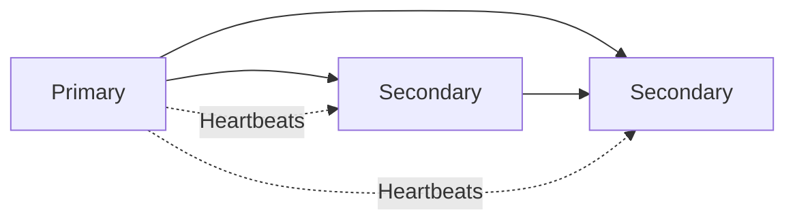
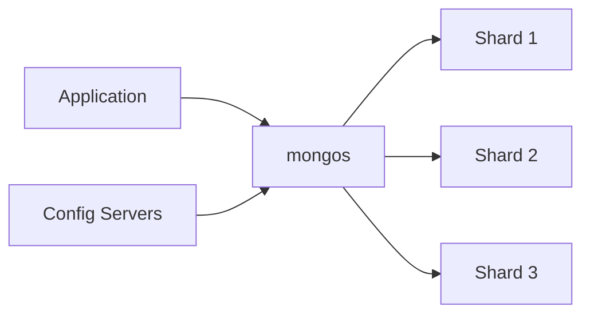
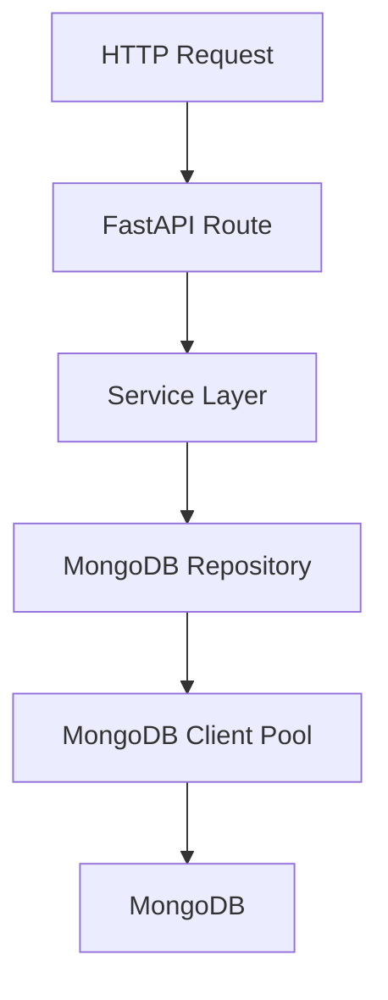
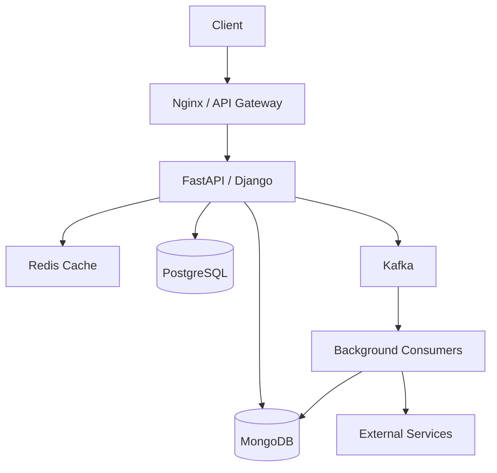

# README

## Overview

This directory contains the MongoDB interview preparation section of the Backend Engineering Playbook.

The material is designed for intermediate-to-senior backend engineers who need to understand MongoDB beyond CRUD syntax. The focus is on **data modeling, query behavior, indexing, performance, consistency, transactions, replication, sharding, security, Python integration, operations, troubleshooting, and architecture trade-offs**.

The central principle throughout this section is:

> MongoDB expertise is primarily about making correct engineering decisions around access patterns, consistency, performance, scalability, and operational reliability.

## Navigation

| # | File | Description |
|---|---|---|
| 01 | [01- Core MongoDB Interview Questions](./01-%20Core%20MongoDB%20Interview%20Questions.md) | MongoDB fundamentals, document model, BSON, ObjectId, architecture, terminology, and relational comparisons |
| 02 | [02- CRUD and Query Questions](./02-%20CRUD%20and%20Query%20Questions.md) | CRUD operations, filters, operators, projection, sorting, pagination, cursors, upserts, and bulk writes |
| 03 | [03- Data Modeling Questions](./03-%20Data%20Modeling%20Questions.md) | Access-pattern-driven schema design, embedding, referencing, denormalization, cardinality, document growth, and schema evolution |
| 04 | [04- Aggregation Questions](./04-%20Aggregation%20Questions.md) | Aggregation pipelines, pipeline stages, expressions, accumulators, $lookup, $facet, $unwind, and optimization |
| 05 | [05- Indexing and Query Performance Questions](./05-%20Indexing%20and%20Query%20Performance%20Questions.md) | Index types, compound indexes, ESR, query planner, explain(), execution statistics, and optimization |
| 06 | [06- Transactions Questions](./06-%20Transactions%20Questions.md) | Single-document atomicity, sessions, multi-document transactions, concerns, retries, limitations, and transaction design |
| 07 | [07- Schema Validation Questions](./07-%20Schema%20Validation%20Questions.md) | JSON Schema validation, required fields, BSON types, nested validation, arrays, validation levels, and schema evolution |
| 08 | [08- Security and Authentication Questions](./08-%20Security%20and%20Authentication%20Questions.md) | Authentication, authorization, roles, TLS, encryption, auditing, network restrictions, credentials, and secret management |
| 09 | [09- Replica Set and High Availability Questions](./09-%20Replica%20Set%20and%20High%20Availability%20Questions.md) | Replica sets, primary/secondary nodes, elections, oplog, failover, rollback, replication lag, and HA |
| 10 | [10- Python and MongoDB Questions](./10-%20Python%20and%20MongoDB%20Questions.md) | PyMongo, MongoClient, CRUD, BSON, ObjectId, aggregation, transactions, pooling, timeouts, and repository patterns |
| 11 | [11- FastAPI and MongoDB Questions](./11-%20FastAPI%20and%20MongoDB%20Questions.md) | FastAPI lifecycle, dependency injection, Pydantic, repositories, ObjectId serialization, pagination, and async considerations |
| 12 | [12- Django and MongoDB Questions](./12-%20Django%20and%20MongoDB%20Questions.md) | Django integration, PyMongo, MongoEngine, repositories, services, transactions, testing, and ORM limitations |
| 13 | [13- Scenario Based Questions](./13-%20Scenario%20Based%20Questions.md) | Real-world MongoDB architecture, modeling, scaling, consistency, performance, and failure scenarios |
| 14 | [14- Troubleshooting Questions](./14-%20Troubleshooting%20Questions.md) | Slow queries, connection failures, replication lag, storage growth, transactions, authentication, and operational diagnosis |
| 15 | [15- Architecture Questions](./15-%20Architecture%20Questions.md) | MongoDB architecture questions on system design, data modeling, distributed systems, HA, and production trade-offs |
| 16 | [16- Comparison and Design Questions](./16-%20Comparison%20and%20Design%20Questions.md) | MongoDB versus PostgreSQL, Redis, Elasticsearch, Kafka, and architecture design trade-offs |
| 17 | [17- Common Interview Traps](./17-%20Common%20Interview%20Traps.md) | Common misconceptions, misleading interview questions, and correct mental models for MongoDB behavior |
| 18 | [18- Senior Level Questions](./18-%20Senior%20Level%20Questions.md) | Senior-level modeling, performance, distributed systems, HA, sharding, architecture, and production trade-offs |

## Documentation Structure

| File | Focus |
|---|---|
| `01- Core MongoDB Interview Questions.md` | MongoDB fundamentals, document model, BSON, ObjectId, architecture, terminology, and relational comparisons |
| `02- CRUD and Query Questions.md` | CRUD operations, filters, operators, projection, sorting, pagination, cursors, upserts, and bulk writes |
| `03- Data Modeling Questions.md` | Access-pattern-driven schema design, embedding, referencing, denormalization, cardinality, document growth, and schema evolution |
| `04- Aggregation Questions.md` | Aggregation pipelines, pipeline stages, expressions, accumulators, `$lookup`, `$facet`, `$unwind`, and optimization |
| `05- Indexing and Query Performance Questions.md` | Index types, compound indexes, ESR, query planner, `explain()`, execution statistics, and optimization |
| `06- Transactions Questions.md` | Single-document atomicity, sessions, multi-document transactions, concerns, retries, limitations, and transaction design |
| `07- Schema Validation Questions.md` | JSON Schema validation, required fields, BSON types, nested validation, arrays, validation levels, and schema evolution |
| `08- Security and Authentication Questions.md` | Authentication, authorization, roles, TLS, encryption, auditing, network restrictions, credentials, and secret management |
| `09- Replica Set and High Availability Questions.md` | Replica sets, primary/secondary nodes, elections, oplog, failover, rollback, replication lag, and HA |
| `10- Python and MongoDB Questions.md` | PyMongo, MongoClient, CRUD, BSON, ObjectId, aggregation, transactions, pooling, timeouts, and repository patterns |
| `11- FastAPI and MongoDB Questions.md` | FastAPI lifecycle, dependency injection, Pydantic, repositories, ObjectId serialization, pagination, and async considerations |
| `12- Django and MongoDB Questions.md` | Django integration, PyMongo, MongoEngine, repositories, services, transactions, testing, and ORM limitations |
| `13- Scenario Based Questions.md` | Real-world MongoDB architecture, modeling, scaling, consistency, performance, and failure scenarios |
| `14- Troubleshooting Questions.md` | Slow queries, connection failures, replication lag, storage growth, transactions, authentication, and operational diagnosis |
| `15- Operations and Monitoring Questions.md` | Monitoring, metrics, database statistics, indexes, replica health, capacity, connections, and runbooks |
| `16- Comparison and Design Questions.md` | MongoDB versus PostgreSQL, Redis, Elasticsearch, Kafka, and architecture design trade-offs |
| `17- Backup and Disaster Recovery Questions.md` | Backup strategies, `mongodump`, `mongorestore`, managed backups, PITR, RPO, RTO, restore testing, and DR |
| `18- Senior Level Questions.md` | Senior-level modeling, performance, distributed systems, HA, sharding, architecture, and production trade-offs |

## Recommended Learning Path

The files should generally be studied in dependency order rather than treated as isolated interview question banks.


A practical progression is:

1. Understand the document model and MongoDB architecture.
2. Learn CRUD semantics and query composition.
3. Design schemas around real application access patterns.
4. Learn aggregation and understand its execution cost.
5. Design indexes from query patterns.
6. Use `explain()` to validate performance assumptions.
7. Understand atomicity, transactions, and consistency settings.
8. Learn schema validation and production security.
9. Understand replica sets and failure behavior.
10. Integrate MongoDB with Python services.
11. Apply MongoDB correctly in FastAPI and Django.
12. Learn monitoring, operations, troubleshooting, and recovery.
13. Practice scenario-based architecture questions.
14. Finish with senior-level trade-offs and system-design problems.

## Core Engineering Areas

### MongoDB Fundamentals

The fundamentals section establishes the vocabulary required for every later topic:

- Database
- Collection
- Document
- Field
- BSON
- ObjectId
- Embedded document
- Array
- Nested document
- Schema flexibility
- Client/server architecture
- MongoDB deployment terminology

The important conceptual difference from a relational database is that MongoDB stores related application data as documents and allows the schema to be designed around access patterns.

Schema flexibility does not mean that production systems should have arbitrary document structures. Mature applications commonly enforce structure through application validation, MongoDB schema validation, migrations, testing, and controlled schema evolution.

### CRUD and Query Design

CRUD should be understood together with query behavior and indexing.

Important areas include:

- `insertOne()`
- `insertMany()`
- `find()`
- `findOne()`
- `updateOne()`
- `updateMany()`
- `replaceOne()`
- `deleteOne()`
- `deleteMany()`
- Upserts
- Bulk writes
- Query operators
- Projection
- Sorting
- Pagination
- Cursors

A senior engineer should understand not only whether an operation is valid, but also:

- Whether it is atomic
- Which indexes can support it
- How many documents it may examine
- How it behaves under concurrent writes
- Whether it scales with collection size
- What happens when the operation fails

## Data Modeling

MongoDB schema design should be driven primarily by application access patterns.

Key decisions include:

- Embed or reference?
- How frequently is related data read?
- How frequently is it updated?
- Is the relationship bounded?
- Can an array grow indefinitely?
- Is the document frequently modified?
- Is duplication acceptable?
- Which fields are queried?
- Which fields are sorted?
- What are the expected cardinalities?

### Embedding vs Referencing

| Consideration | Embedding | Referencing |
|---|---|---|
| Related data usually read together | Strong fit | Weaker fit |
| Atomic updates across related data | Convenient | May require transactions |
| Data duplication | Possible | Lower |
| Large/unbounded relationships | Poor fit | Better fit |
| Independent lifecycle | Less suitable | Better fit |
| Read performance | Often better | May require additional queries |
| Update frequency differs | Can be expensive | Often cleaner |

The correct decision depends on the workload rather than a universal MongoDB rule.

### Document Growth

Avoid unbounded arrays and continuously growing documents.

Potential consequences include:

- Increasing document size
- More expensive updates
- Larger working-set requirements
- Hot-document contention
- Increased replication traffic
- More difficult document movement in sharded environments

A common production pattern is to move high-volume or independently managed child records into a separate collection.

## Schema Validation

MongoDB's flexible schema should not be confused with the absence of validation.

Production systems can combine:

```text
API validation
      ↓
Service/business validation
      ↓
MongoDB schema validation
      ↓
Database persistence
```

Schema validation is particularly useful for enforcing invariants such as:

- Required fields
- BSON types
- Nested structures
- Array element types
- Enumerated values
- Basic document shape

Application validation remains necessary for business rules that depend on external state or multiple documents.

## Query Behavior

Important query categories include:

- Comparison operators
- Logical operators
- Array operators
- Embedded-document queries
- `$exists`
- `$type`
- `$regex`
- `$expr`
- Geospatial queries
- Projection
- Sorting
- Pagination

Queries should be evaluated together with their expected index strategy.

For example:

```javascript
db.orders.find(
  {
    customer_id: ObjectId("65f000000000000000000001"),
    status: "paid"
  },
  {
    _id: 1,
    total: 1,
    created_at: 1
  }
).sort({ created_at: -1 }).limit(50)
```

A production review should ask:

- What index supports this query?
- How selective is `customer_id`?
- Is `status` useful in the compound index?
- Does the index support the sort?
- Can the query be covered?
- How many keys and documents are examined?

## Aggregation

Aggregation should be treated as a data-processing pipeline rather than a collection of isolated operators.

Important stages include:

- `$match`
- `$project`
- `$set`
- `$unset`
- `$group`
- `$sort`
- `$limit`
- `$skip`
- `$unwind`
- `$lookup`
- `$facet`
- `$count`
- `$bucket`
- `$bucketAuto`
- `$replaceWith`
- `$replaceRoot`
- `$unionWith`
- `$merge`
- `$out`

A common optimization principle is to reduce the amount of data flowing through expensive stages.

```text
Large collection
      ↓
Early $match
      ↓
Projection / shaping
      ↓
Selective transformation
      ↓
Grouping / joining
      ↓
Sorting
      ↓
Final result
```

Early filtering can reduce memory, CPU, document processing, and downstream stage workload.

### Aggregation Risks

Watch for:

- `$lookup` over large datasets
- `$unwind` multiplying document counts
- Large `$group` operations
- Expensive sorts
- Unbounded pipelines
- Repeated analytical aggregation in request paths
- Large synchronous API responses

For expensive analytics, consider pre-aggregation, materialized collections, scheduled jobs, or dedicated analytical infrastructure.

## Indexing

Indexes are one of the most important MongoDB performance mechanisms.

Common index types include:

| Index | Typical Use |
|---|---|
| `_id` | Default document identity lookup |
| Single-field | Simple equality/range queries |
| Compound | Multiple predicates and sort patterns |
| Multikey | Array fields |
| Unique | Enforcing uniqueness |
| Partial | Indexing only documents matching a filter |
| Sparse | Indexing documents containing a field |
| TTL | Automatic expiration |
| Text | Text-search workloads |
| Geospatial | Location queries |

Indexes improve reads but increase:

- Storage usage
- Memory requirements
- Write cost
- Maintenance overhead
- Operational complexity

### Compound Index Design

Index design should follow real query patterns.

A useful heuristic is ESR:

```text
Equality → Sort → Range
```

For example, if an application frequently executes:

```javascript
db.orders.find({
  tenant_id: "tenant-123",
  status: "paid",
  created_at: { $gte: ISODate("2026-01-01") }
}).sort({
  created_at: -1
})
```

a candidate index could be:

```javascript
db.orders.createIndex({
  tenant_id: 1,
  status: 1,
  created_at: -1
})
```

The exact index should still be validated using representative data and `explain()`.

## Query Planner and `explain()`

A senior engineer should be comfortable diagnosing a slow query without guessing.

Typical workflow:

```text
Slow request
    ↓
Identify exact database query
    ↓
Run explain("executionStats")
    ↓
Inspect winning plan
    ↓
Check COLLSCAN / IXSCAN / FETCH / SORT
    ↓
Compare nReturned
with totalDocsExamined
and totalKeysExamined
    ↓
Evaluate index suitability
    ↓
Measure optimization
    ↓
Monitor production behavior
```

Important metrics include:

| Metric | Interpretation |
|---|---|
| `nReturned` | Documents returned |
| `totalKeysExamined` | Index entries examined |
| `totalDocsExamined` | Documents examined |
| `executionTimeMillis` | Reported execution time |
| `COLLSCAN` | Collection scan |
| `IXSCAN` | Index scan |
| `FETCH` | Document fetch after index traversal |
| `SORT` | Explicit sort stage |

A query returning 20 documents after examining hundreds of thousands of documents deserves investigation even if its current response time appears acceptable.

## Pagination

For small datasets, `skip()` and `limit()` can be adequate.

For large collections and deep pages, cursor-based pagination is generally more scalable.

Offset pagination:

```javascript
db.orders.find(query)
  .sort({ created_at: -1 })
  .skip(100000)
  .limit(50)
```

Cursor pagination:

```javascript
db.orders.find({
  ...query,
  created_at: { $lt: last_seen_created_at }
})
.sort({ created_at: -1 })
.limit(50)
```

In production, use a stable ordering key. When timestamps are not unique, combine them with a unique tie-breaker such as `_id`.

## Transactions and Atomicity

MongoDB guarantees atomicity for individual document writes.

Multi-document transactions should be used when a business operation genuinely requires atomic changes across multiple documents or collections.

Typical transaction lifecycle:

```text
Start session
    ↓
Start transaction
    ↓
Read/write operations
    ↓
Commit
    ↓
Success
```

On failure:

```text
Start transaction
    ↓
Operation fails
    ↓
Abort transaction
    ↓
Retry or return failure
```

Transactions introduce coordination and performance overhead, so data modeling should not rely on transactions for every related update.

## Read Concern, Write Concern, and Read Preference

These settings control important consistency and availability behavior.

| Setting | Controls |
|---|---|
| Read concern | Consistency guarantees for reads |
| Write concern | Acknowledgment/durability requirements for writes |
| Read preference | Which replica-set members may serve reads |

`majority` write concern is commonly important when the application needs stronger durability guarantees across replica-set members.

Read preference can improve read distribution, but reading from secondaries introduces potential staleness.

These settings should be selected based on business requirements rather than applied mechanically.

## Replica Sets and High Availability

A replica set typically contains:



The primary receives writes and replicates operations through the oplog.

If the primary becomes unavailable, eligible members can participate in an election and a new primary can be selected.

Production considerations include:

- Election behavior
- Majority availability
- Replication lag
- Oplog capacity
- Initial sync
- Rollbacks
- Member priority
- Hidden members
- Read preference
- Write concern

### Replica Sets Are Not Backups

Replication protects against certain node failures.

It does not fully protect against:

- Accidental deletion
- Malicious writes
- Application bugs
- Corrupted application data
- Logical data corruption

Independent backups and restore testing remain necessary.

## Sharding

Sharding distributes data across multiple shards.



The shard key is one of the most important architecture decisions.

Evaluate:

- Cardinality
- Frequency
- Distribution
- Query targeting
- Write distribution
- Monotonicity
- Hot-shard risk
- Resharding requirements

A shard key with excellent cardinality can still be problematic if most writes target the same range or if common queries cannot be targeted efficiently.

## Change Streams

Change streams allow applications to react to database changes without continuously polling collections.

Common event types include:

- Insert
- Update
- Replace
- Delete

A typical architecture is:

```text
MongoDB
   ↓
Change Stream
   ↓
Python Consumer
   ↓
Business Processing
   ↓
Kafka / Queue / External Service
```

Production consumers should consider:

- Resume tokens
- Consumer restarts
- Duplicate delivery
- Idempotency
- Error handling
- Backpressure
- Full-document lookup
- Downstream failures

A change-stream consumer should not assume exactly-once business processing simply because MongoDB provides resumable stream behavior.

## Security

MongoDB production security should be layered.

### Authentication

Use strong authentication mechanisms and avoid shared credentials between unrelated services.

### Authorization

Use least-privilege roles.

For example, an API service that only needs access to one database should not automatically receive administrative privileges.

### Network Security

Restrict MongoDB network exposure using:

- Private networks
- Security groups
- Firewalls
- Kubernetes network policies
- IP restrictions where appropriate

MongoDB should not be unnecessarily exposed directly to the public internet.

### Encryption

Use:

- TLS for data in transit
- Encryption at rest where required
- Secure key management
- Secret rotation

### Credential Management

Never commit connection strings containing credentials into Git.

Use appropriate mechanisms such as:

- Environment variables for local/runtime configuration
- Kubernetes Secrets
- AWS Secrets Manager
- Managed secret systems
- CI/CD secret stores

## Python Integration

A production Python application should generally create a reusable MongoDB client and use the driver's connection pool.

Example:

```python
import os

from pymongo import MongoClient
from pymongo.database import Database


def create_mongo_client() -> MongoClient:
    uri = os.environ["MONGODB_URI"]

    return MongoClient(
        uri,
        serverSelectionTimeoutMS=5_000,
        connectTimeoutMS=5_000,
        socketTimeoutMS=10_000,
        retryWrites=True,
    )


client = create_mongo_client()
db: Database = client[os.environ["MONGODB_DATABASE"]]
```

Avoid creating a new `MongoClient` for every request.

### Repository Pattern

A repository can isolate MongoDB-specific persistence logic:

```python
from bson import ObjectId
from pymongo.collection import Collection


class OrderRepository:
    def __init__(self, collection: Collection) -> None:
        self.collection = collection

    def get_by_id(self, order_id: str) -> dict | None:
        return self.collection.find_one({
            "_id": ObjectId(order_id)
        })
```

Business rules should generally remain in the service layer rather than becoming tightly coupled to MongoDB query code.

## FastAPI Integration

A typical architecture is:



Important considerations include:

- Application lifecycle
- Client initialization
- Dependency injection
- Repository boundaries
- Pydantic validation
- ObjectId serialization
- Pagination
- Transactions
- Error handling
- Timeout configuration
- Connection pooling

Synchronous PyMongo operations execute synchronously. Using `async def` alone does not make those database operations non-blocking.

For genuinely asynchronous database access, use a currently supported asynchronous MongoDB driver and validate its compatibility with the project's Python and MongoDB versions.

## Django Integration

MongoDB should not be treated as if it were Django's native relational database backend.

Possible integration approaches include:

| Approach | Characteristics |
|---|---|
| PyMongo | Explicit MongoDB access and repository architecture |
| MongoEngine | ODM abstraction with MongoDB-specific behavior |
| Repository/service layer | Keeps persistence concerns isolated from Django application logic |

When using PyMongo, Django views, services, or APIs can delegate persistence to repositories.

The architecture should explicitly handle:

- Connections
- Serialization
- Validation
- Transactions
- Testing
- Error translation
- MongoDB-specific query semantics

Avoid designing MongoDB models around assumptions that only make sense for Django's relational ORM.

## MongoDB Compass

Compass is useful for interactive development and diagnosis.

Typical workflows include:

1. Connect to a development or authorized production environment.
2. Browse databases and collections.
3. Inspect document structure.
4. Test query filters.
5. Build aggregation pipelines.
6. Inspect indexes.
7. Analyze schema distributions.
8. Import/export supported data formats.
9. Validate queries before implementing them in application code.

Production access should follow the same authentication and authorization controls as other operational tooling.

## `mongosh` and MongoDB CLI Tools

`mongosh` is useful for interactive administration and diagnostics.

Common operations include:

```javascript
show dbs
use application_db
show collections

db.orders.findOne()

db.orders.getIndexes()

db.orders.explain("executionStats").find({
  tenant_id: "tenant-123"
})
```

MongoDB's database tooling also includes utilities for data movement and backup workflows, including:

```text
mongodump
mongorestore
mongoimport
mongoexport
```

These tools should be used with an explicit understanding of their consistency, performance, authentication, and production-operational implications.

## Performance Engineering

MongoDB performance should be treated as a measurement problem.

A useful workflow is:

```text
Measure
   ↓
Identify bottleneck
   ↓
Form hypothesis
   ↓
Change one variable
   ↓
Benchmark
   ↓
Compare
   ↓
Deploy safely
   ↓
Monitor
```

### Query Performance

Check:

- Query shape
- Index availability
- Selectivity
- Documents examined
- Keys examined
- Sort behavior
- Result size
- Pagination strategy

### Write Performance

Consider:

- Number of indexes
- Write concern
- Bulk writes
- Document size
- Hot documents
- Transaction usage
- Replication overhead

### Connection Performance

Monitor:

- Pool size
- Active connections
- Connection wait time
- Connection creation rate
- Application concurrency
- Database connection limits

### Memory and Working Set

A workload that repeatedly accesses data larger than available memory can experience increased storage I/O and latency.

Monitor the relationship between:

- Working set
- Available memory
- Cache behavior
- Dataset size
- Index size

## Before-and-After Optimization

A senior performance investigation should produce measurable evidence.

```text
Before:
nReturned = 25
totalDocsExamined = 850000
totalKeysExamined = 0
```

After introducing and validating an appropriate index:

```text
After:
nReturned = 25
totalDocsExamined = 25
totalKeysExamined = 25
```

The exact numbers are workload-dependent, but the principle is important: optimization should be demonstrated through execution statistics and representative benchmarks rather than assumptions.

## Production Operations

Production MongoDB monitoring should cover multiple dimensions.

| Area | Examples |
|---|---|
| Queries | Latency, slow operations, execution statistics |
| Connections | Active, available, pool utilization |
| Replication | Lag, member health, elections |
| Storage | Disk usage, growth rate, collection size |
| Indexes | Size, usage, maintenance overhead |
| Resources | CPU, memory, I/O |
| Capacity | Dataset growth, connection growth |
| Errors | Authentication, timeouts, failed operations |
| Availability | Primary health, failovers, service availability |

Operational dashboards should correlate MongoDB metrics with API metrics such as request latency, error rate, throughput, and saturation.

## Backup and Disaster Recovery

Backup strategy should be derived from business requirements.

Key concepts:

| Concept | Meaning |
|---|---|
| RPO | Maximum acceptable data loss measured in time |
| RTO | Maximum acceptable recovery duration |
| Logical backup | Data exported logically from the database |
| Physical backup | Backup of database storage/data files through supported mechanisms |
| PITR | Ability to restore to a specific point in time |
| Restore validation | Testing whether backups can actually recover usable data |

A production recovery process should be tested periodically.

```text
Failure
  ↓
Identify recovery scenario
  ↓
Select recovery point
  ↓
Restore backup
  ↓
Validate data
  ↓
Validate indexes/configuration
  ↓
Run application checks
  ↓
Redirect traffic
  ↓
Monitor recovery
```

## Deployment

MongoDB can be used in several deployment models:

| Deployment | Typical Use |
|---|---|
| Local MongoDB | Development and experimentation |
| Docker | Reproducible development/test environments |
| MongoDB Atlas | Managed production deployments |
| Self-managed replica set | Organizations requiring infrastructure control |
| Sharded cluster | Large-scale distributed workloads |

Production configuration should externalize:

- Connection strings
- Credentials
- TLS configuration
- Database names
- Timeouts
- Pool configuration
- Deployment-specific settings

Do not package production credentials into Docker images or source repositories.

## Troubleshooting Methodology

Use the same diagnostic model across MongoDB incidents:

```text
Symptom
↓
Possible causes
↓
Isolation strategy
↓
Diagnostic commands
↓
Root cause
↓
Corrective action
↓
Prevention
```

### Slow Query

```text
Symptom
↓
High API/database latency
↓
Possible causes:
- Missing index
- Poor compound index
- Low selectivity
- Large result set
- Expensive sort
- Large aggregation
↓
Isolation:
- Capture exact query
- Run explain("executionStats")
↓
Diagnosis:
- Inspect COLLSCAN / IXSCAN
- Compare examined vs returned documents
↓
Corrective action:
- Query redesign
- Index redesign
- Pagination
- Aggregation optimization
↓
Prevention:
- Slow-query monitoring
- Query regression testing
```

### Connection Exhaustion

```text
Symptom
↓
Connection timeout or pool exhaustion
↓
Possible causes:
- Excessive client creation
- Incorrect pool sizing
- Traffic spike
- Long-running operations
- Connection leaks
↓
Isolation:
- Inspect application pool
- Inspect MongoDB connections
- Check operation duration
↓
Corrective action:
- Reuse MongoClient
- Tune pool configuration
- Reduce operation duration
↓
Prevention:
- Connection metrics
- Load testing
- Capacity planning
```

### Replication Lag

```text
Symptom
↓
Secondary is significantly behind primary
↓
Possible causes:
- High write volume
- Slow secondary
- Disk I/O pressure
- Network latency
- Large operations
↓
Isolation:
- Inspect replica-set status
- Measure lag
- Check resource utilization
↓
Corrective action:
- Remove bottleneck
- Scale appropriately
- Review workload
↓
Prevention:
- Replication monitoring
- Capacity planning
- Alerting
```

## Common Production Pitfalls

### Treating MongoDB as Schema-less

Flexible schema does not mean uncontrolled schema.

Use validation, application contracts, migrations, tests, and controlled evolution.

### Overusing Embedding

Embedding everything can produce large documents and hot-document contention.

### Overusing References

Referencing every related entity can force excessive queries and recreate relational access patterns unnecessarily.

### Adding Indexes Without Measurement

Indexes have storage and write costs. Validate them against actual query patterns.

### Using Deep `skip()`

Large offsets can become increasingly expensive. Prefer stable cursor-based pagination for large datasets.

### Ignoring Document Growth

Unbounded arrays and continuously expanding documents are common sources of future performance problems.

### Using Long Transactions

Long transactions increase coordination and resource costs. Keep transaction boundaries narrow.

### Assuming Secondaries Are Always Safe for Reads

Secondary reads can be stale depending on replication lag and read configuration.

### Exposing MongoDB Publicly

MongoDB should normally remain behind appropriate network controls and authentication.

### Creating a MongoDB Client Per Request

Reuse the client so the driver's connection pooling can work effectively.

## Interview Answer Framework

For design questions, avoid jumping directly to MongoDB commands.

Use this sequence:

```text
Requirements
↓
Access patterns
↓
Data model
↓
Query patterns
↓
Indexes
↓
Consistency requirements
↓
Transaction requirements
↓
Scaling strategy
↓
Failure modes
↓
Monitoring
↓
Backup / DR
↓
Trade-offs
```

For performance questions:

```text
Symptom
↓
Measurement
↓
Explain plan
↓
Root cause
↓
Optimization
↓
Benchmark
↓
Production monitoring
```

For architecture questions:

```text
Functional requirements
↓
Data model
↓
Read/write workload
↓
Consistency
↓
Availability
↓
Scale
↓
Failure handling
↓
Security
↓
Observability
↓
Recovery
```

## Senior-Level Interview Topics

Senior MongoDB interviews commonly require reasoning around:

- Modeling a high-volume order system
- Designing multi-tenant collections
- Handling unbounded relationships
- Choosing embedding versus referencing
- Designing compound indexes
- Applying ESR correctly
- Diagnosing an inefficient query
- Explaining a query plan
- Designing cursor pagination
- Optimizing a large aggregation
- Choosing between MongoDB and PostgreSQL
- Designing transaction boundaries
- Handling replication lag
- Designing replica-set topology
- Selecting a shard key
- Preventing hot shards
- Designing change-stream consumers
- Making event processing idempotent
- Handling MongoDB connection exhaustion
- Designing backup and recovery
- Handling schema evolution
- Designing MongoDB for Kubernetes
- Integrating MongoDB with FastAPI
- Integrating MongoDB with Django
- Designing MongoDB in a microservices architecture

## Senior Engineering Review Checklist

Before approving a MongoDB-backed production architecture, verify:

- [ ] Access patterns are documented.
- [ ] Schema design is based on those access patterns.
- [ ] Embedding/reference decisions are explicit.
- [ ] Document growth is bounded.
- [ ] Unbounded arrays have been identified.
- [ ] Critical query shapes are documented.
- [ ] Indexes support critical queries.
- [ ] Index costs have been considered.
- [ ] `explain()` has been used on important queries.
- [ ] Pagination scales with expected data volume.
- [ ] Aggregations have been performance-tested.
- [ ] Transaction boundaries are intentional.
- [ ] Read/write concerns match business requirements.
- [ ] Replica-set behavior is understood.
- [ ] Replication lag is monitored.
- [ ] Shard-key design is workload-driven if sharding is required.
- [ ] Authentication and authorization are configured.
- [ ] TLS requirements are satisfied.
- [ ] Secrets are managed securely.
- [ ] Connection pooling is configured.
- [ ] Timeouts are explicit.
- [ ] Slow queries are monitored.
- [ ] Storage growth is monitored.
- [ ] Backup strategy is documented.
- [ ] Restore procedures are tested.
- [ ] RPO and RTO are defined.
- [ ] Failure scenarios have operational runbooks.

## Interview Traps

| Topic | Common Weak Answer | Senior-Level Direction |
|---|---|---|
| Schema | "MongoDB is schema-less" | Flexible schema with explicit application and database validation |
| Modeling | "Always embed" | Decide from access patterns, cardinality, growth, and update behavior |
| Indexes | "Add an index" | Analyze query shape, selectivity, ordering, sort, and maintenance cost |
| Performance | "Use indexes" | Measure with `explain()` and execution statistics |
| Pagination | "Use skip/limit" | Use cursor pagination when datasets and offsets become large |
| Transactions | "Transactions are unnecessary in MongoDB" | Use them where atomic multi-document invariants require them |
| Replication | "Secondaries are backups" | Separate HA, replication, backups, and DR |
| Sharding | "Use hashed keys" | Evaluate distribution, targeting, write patterns, and workload skew |
| FastAPI | "`async` makes database calls async" | Distinguish synchronous and asynchronous MongoDB drivers |
| Django | "MongoDB works like Django ORM" | Use MongoDB-aware persistence architecture |
| Security | "Username/password is enough" | Include least privilege, TLS, network controls, secrets, and auditing |
| Operations | "Atlas handles everything" | Understand application configuration, monitoring, backups, recovery, and operational ownership |

## MongoDB and Backend Architecture

MongoDB frequently appears alongside other backend technologies rather than operating as the only infrastructure component.

A realistic service may use:



Each component should have a clear responsibility.

For example:

- MongoDB: document-oriented persistent state
- PostgreSQL: strongly relational or transactional workloads
- Redis: caching, ephemeral state, coordination
- Kafka: durable event streaming
- Celery: background task execution
- Nginx: reverse proxy/API gateway responsibilities

Do not introduce MongoDB, Redis, Kafka, or another technology simply because it is available. Each additional system adds operational complexity.

## Final Interview Checklist

Before considering the MongoDB topic interview-ready, you should be able to explain without relying on memorized definitions:

- How MongoDB's document model differs from relational modeling.
- How access patterns influence schema design.
- When to embed and when to reference.
- How document growth affects production systems.
- How MongoDB queries interact with indexes.
- How to design compound indexes.
- How ESR applies to query patterns.
- How to use `explain()` to diagnose performance.
- Why `totalDocsExamined` and `totalKeysExamined` matter.
- How aggregation pipelines execute and how to optimize them.
- When MongoDB transactions are necessary.
- How read concern, write concern, and read preference affect behavior.
- How replica-set elections and replication work.
- How replication lag affects applications.
- How to design a shard key.
- How change streams support event-driven architectures.
- How to build reliable Python MongoDB integrations.
- How FastAPI and Django should interact with MongoDB.
- How MongoDB should be secured.
- How MongoDB should be monitored.
- How backups and recovery should be designed.
- How to diagnose production failures systematically.
- How to explain MongoDB trade-offs against PostgreSQL and other backend technologies.

## Key Takeaways

- MongoDB engineering starts with **access patterns and data modeling**, not CRUD syntax.
- **Query design, indexing, and performance analysis must be treated as one system** and validated with real execution statistics.
- Transactions, consistency settings, replica sets, sharding, and change streams are **architectural tools with measurable trade-offs**.
- Production MongoDB requires **security, observability, capacity planning, backup validation, disaster recovery, and operational runbooks**.
- Senior-level MongoDB expertise means explaining **trade-offs, scalability limits, failure modes, and operational consequences**, not merely knowing commands.