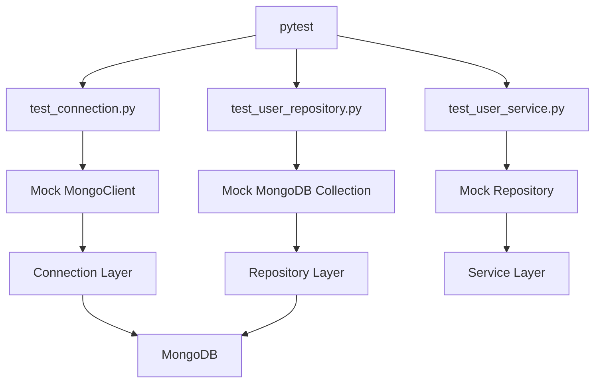

# README.md

## Overview

This directory contains the automated tests for the Python MongoDB CRUD application.

The test suite verifies the application's database connection management, repository behavior, and service-layer business logic without requiring a live MongoDB server for unit tests.

The project separates responsibilities into:

```text
Application
    ↓
Service Layer
    ↓
Repository Layer
    ↓
PyMongo
    ↓
MongoDB
```

The tests mirror these boundaries:

| Test file | Responsibility |
|---|---|
| `test_connection.py` | MongoDB client lifecycle, database access, and health checks |
| `test_user_repository.py` | MongoDB CRUD operations and repository behavior |
| `test_user_service.py` | Business validation and service-layer behavior |

The tests use `pytest` and Python mocks for unit-level isolation.

## Test Strategy

The project primarily uses unit tests at the repository and service boundaries.



The separation is intentional:

- Connection tests verify client configuration and lifecycle behavior.
- Repository tests verify database operations without depending on MongoDB availability.
- Service tests verify business rules without testing MongoDB internals.
- Integration tests against a real MongoDB deployment can be added separately when database-specific behavior needs verification.

## Dependencies

The test suite requires:

```text
pymongo
pytest
```

Install the project dependencies with:

```bash
pip install -r requirements.txt
```

Run the complete test suite with:

```bash
pytest
```

For more detailed output:

```bash
pytest -v
```

For a specific test file:

```bash
pytest tests/test_user_repository.py -v
```

For a specific test:

```bash
pytest tests/test_user_repository.py::test_create_inserts_user_and_returns_id -v
```

## Test Configuration

The project uses environment-based MongoDB configuration through the application settings layer.

Example configuration:

```dotenv
MONGODB_URI=mongodb://localhost:27017
MONGODB_DATABASE=crud_app
MONGODB_SERVER_SELECTION_TIMEOUT_MS=5000
MONGODB_CONNECT_TIMEOUT_MS=5000
MONGODB_SOCKET_TIMEOUT_MS=10000
MONGODB_MAX_POOL_SIZE=100
MONGODB_MIN_POOL_SIZE=0
```

Unit tests should not require these values to point to a running MongoDB instance.

The repository and service tests mock their database boundaries, allowing the suite to run in local development and CI without provisioning MongoDB.

## Connection Tests

`test_connection.py` verifies the connection-management layer.

The tests cover:

- `MongoClient` creation.
- Client caching.
- MongoDB client configuration.
- Database selection.
- Successful health checks.
- Failed health checks.
- Client shutdown.
- Cache cleanup.

The important behavior is that the application reuses a `MongoClient` within a process instead of creating a new client for every operation.

```python
client = get_client()
database = get_database()
```

This matches PyMongo's connection-pooling model and avoids unnecessary connection churn.

## Repository Tests

`test_user_repository.py` verifies persistence behavior using a mocked MongoDB collection.

The tests cover:

- User creation.
- Generated identifiers.
- Document normalization.
- User lookup by `_id`.
- User lookup by email.
- Missing-user behavior.
- Pagination.
- Active-user filtering.
- Invalid pagination parameters.
- User updates.
- Update timestamps.
- Invalid update data.
- User deletion.

The repository is intentionally tested independently from the service layer.

For example:

```python
collection = MagicMock()
repository = UserRepository(collection)

repository.create(
    name="Alice",
    email="alice@example.com",
)
```

The test verifies the MongoDB operation that would be issued rather than requiring a real database.

This makes repository tests:

- Fast.
- Deterministic.
- Suitable for CI.
- Independent of database availability.
- Focused on repository behavior.

## Service Tests

`test_user_service.py` verifies business-level behavior.

The service layer is responsible for coordinating validation and persistence:

```text
Request
  ↓
UserService
  ├── Validate input
  ├── Normalize input
  ├── Apply business rules
  └── Call UserRepository
          ↓
       MongoDB
```

The repository is mocked so that service tests do not depend on MongoDB or PyMongo behavior.

Tests cover:

- User creation.
- Input normalization.
- Invalid input handling.
- Duplicate email handling.
- User retrieval.
- Email lookup.
- Pagination delegation.
- Invalid pagination.
- User updates.
- Invalid update data.
- User deletion.

This boundary is important because business rules should remain testable without requiring infrastructure.

## Mocking Strategy

Use mocks at architectural boundaries.

| Layer | Mock |
|---|---|
| Connection | `MongoClient` |
| Repository | MongoDB `Collection` |
| Service | `UserRepository` |

This prevents tests from becoming coupled to implementation details below the layer under test.

For example, a service test should not need to know whether the repository uses:

```python
collection.find_one(...)
```

or:

```python
collection.aggregate(...)
```

The service should only care about the repository contract.

## Unit Tests vs Integration Tests

Unit tests and integration tests serve different purposes.

| Concern | Unit test | Integration test |
|---|---|---|
| Speed | Very fast | Slower |
| MongoDB required | No | Yes |
| Query correctness | Mocked | Real MongoDB |
| Index behavior | Not verified | Verified |
| BSON behavior | Limited | Verified |
| Transactions | Mocked | Real database |
| Replica-set behavior | Not verified | Requires appropriate topology |
| CI complexity | Low | Higher |

The current test suite focuses on unit-level behavior.

A production-grade project should additionally use integration tests for behavior that mocks cannot realistically verify, such as:

- MongoDB query semantics.
- Unique indexes.
- Schema validation.
- Aggregation pipelines.
- Transactions.
- Index usage.
- Change streams.
- Replica-set behavior.

## Test Isolation

Tests should remain independent.

The connection test suite clears the cached MongoDB client between tests:

```python
get_client.cache_clear()
```

This prevents one test from influencing another through the `lru_cache` used by `get_client()`.

Mocked collections and repositories should also be created per test rather than shared globally.

Avoid:

```python
shared_collection = MagicMock()
```

at module scope when mutable mock state can leak between tests.

Prefer fixtures:

```python
@pytest.fixture
def collection() -> MagicMock:
    return MagicMock()
```

## Testing Repository Contracts

Repository tests should verify the contract between application code and MongoDB.

Important assertions include:

- Correct query filters.
- Correct update operators.
- Correct projection.
- Correct sorting.
- Correct pagination.
- Correct handling of MongoDB results.
- Correct handling of missing documents.
- Correct normalization before persistence.

For example, a lookup test should verify both the returned document and the actual filter:

```python
collection.find_one.assert_called_once_with(
    {"_id": user_id},
)
```

This catches accidental changes to database access behavior.

## Testing Business Rules

Business rules belong primarily in service-level tests.

Examples include:

- Empty names are rejected.
- Empty email addresses are rejected.
- Email addresses are normalized.
- Duplicate email errors are translated into application-level errors.
- Updates require at least one mutable field.
- Pagination parameters remain bounded and valid.

The service tests should not duplicate every MongoDB query assertion from the repository tests.

This keeps the test suite focused and reduces coupling.

## CI Considerations

The unit test suite is suitable for CI because it does not require a MongoDB service.

A minimal GitHub Actions workflow can run:

```yaml
- name: Install dependencies
  run: pip install -r requirements.txt

- name: Run tests
  run: pytest -v
```

For integration tests, a separate CI job can provision MongoDB using a service container or another controlled test environment.

Keep unit and integration tests distinguishable when the suite grows:

```text
tests/
    unit/
    integration/
```

The current project keeps the test files directly under `tests/`; restructuring is only necessary when the test suite becomes large enough to benefit from separate test categories.

## Failure Diagnosis

When a test fails, identify the layer first.

```text
Test failure
    ↓
Which layer?
    ↓
Connection → client/configuration/cache
Repository → query/update/persistence contract
Service → validation/business rule
    ↓
Inspect mock calls and return values
    ↓
Determine root cause
    ↓
Fix implementation or test expectation
```

Common failures include:

| Failure | Likely cause |
|---|---|
| Unexpected `MongoClient` call count | Client cache not cleared |
| Wrong `find_one()` filter | Repository query changed |
| Incorrect `update_one()` arguments | Update contract changed |
| Service test calls MongoDB | Repository boundary was not mocked |
| Duplicate-email test fails | `DuplicateKeyError` handling changed |
| Pagination test fails | Validation or repository pagination changed |

## Common Testing Mistakes

### Requiring MongoDB for Every Unit Test

A unit test should not fail because a local MongoDB server is unavailable.

Use mocks for unit-level tests and reserve real MongoDB for integration tests.

### Testing Implementation Details Across Layers

A service test should not assert MongoDB collection calls directly.

Test the service contract and mock its repository dependency.

### Sharing Mutable Mocks

Shared mocks can retain call history and return values across tests.

Create mocks through fixtures or inside individual tests.

### Over-Mocking

Mocking every internal function can make tests brittle and provide little confidence.

Mock external boundaries while exercising the logic that the test is intended to verify.

### Ignoring Database Constraints

A mock cannot automatically reproduce MongoDB constraints such as:

- Unique indexes.
- Schema validation.
- Query planner behavior.
- Index selection.
- Transaction semantics.

These require integration tests against MongoDB.

## Production Testing Principles

The test suite should evolve with the application's architecture.

For a backend service using MongoDB, a practical testing hierarchy is:

```text
Fast feedback
    │
    ├── Unit tests
    │     ├── Models
    │     ├── Services
    │     ├── Repositories
    │     └── Configuration
    │
    ├── Integration tests
    │     ├── MongoDB queries
    │     ├── Indexes
    │     ├── Transactions
    │     └── Aggregations
    │
    └── End-to-end tests
          ├── API
          ├── Authentication
          ├── Database
          └── External dependencies
```

Keep the majority of tests fast and deterministic, while using integration tests for database behavior that cannot be reliably represented with mocks.

## Key Takeaways

- Test connection management, repositories, and services at their respective architectural boundaries.
- Use mocks for fast unit tests and real MongoDB integration tests for database-specific behavior.
- Keep tests isolated by clearing cached clients and avoiding shared mutable test state.
- Verify repository query contracts while keeping service tests focused on business rules.
- Treat unique indexes, transactions, aggregation, and query-planner behavior as integration-test concerns.