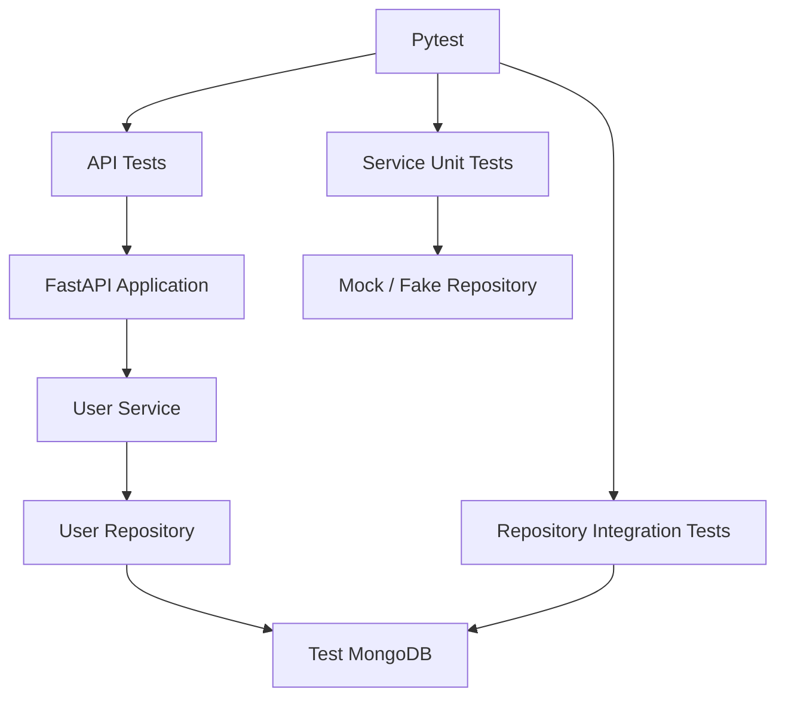
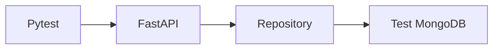
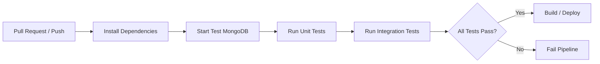

# README

## Overview

This directory contains the test suite and test-specific configuration for the FastAPI MongoDB REST API project.

The tests are designed to validate the application at multiple boundaries:

- API request and response contracts
- Pydantic validation
- FastAPI routing and dependency injection
- User service business rules
- MongoDB repository behavior
- MongoDB-specific constraints such as unique indexes
- Pagination and filtering
- Error handling
- Persistence behavior

The project uses a layered architecture:

```text
HTTP Client
    ↓
FastAPI Router
    ↓
Pydantic Validation
    ↓
User Service
    ↓
User Repository
    ↓
PyMongo
    ↓
MongoDB
```

Tests should validate behavior at the appropriate boundary rather than coupling every test to implementation details.

## Test Structure

| File | Purpose |
|---|---|
| `__init__.py` | Marks the test directory as a Python package. |
| `test_users.py` | User API test suite. |
| `.env.example` | Example MongoDB configuration for testing. |
| `.gitignore` | Excludes local test artifacts and environment files. |
| `requirements.txt` | Test and runtime dependencies used by this project. |

## Testing Strategy

The test suite should use a combination of unit, API, and integration testing.



### Unit Tests

Unit tests isolate a single component and replace external dependencies.

Typical targets include:

- Service business rules
- Validation logic
- Repository-independent transformations
- Error mapping

For example, `UserService.create_user()` can be tested with a fake repository without requiring MongoDB.

### API Tests

API tests exercise the FastAPI application through an HTTP client.

They should verify:

- HTTP methods
- URL paths
- request validation
- response status codes
- response schemas
- error responses
- dependency injection
- pagination
- filtering

### Integration Tests

Integration tests should use a real MongoDB test instance when validating database behavior.

They are particularly important for:

- Unique indexes
- ObjectId behavior
- MongoDB query semantics
- Update operators
- Aggregation pipelines
- Index behavior
- Transactions
- Write conflicts

Mocks cannot reproduce all MongoDB semantics accurately.

## Test Isolation

Tests must never connect to a production database.

Use a dedicated database such as:

```text
fastapi_mongodb_test
```

Example configuration:

```dotenv
MONGODB_URI=mongodb://localhost:27017
MONGODB_DATABASE=fastapi_mongodb_test
```

Tests should be isolated from one another.

Preferred approaches include:

- Creating required test data inside each test.
- Cleaning collections after tests.
- Using fixtures with controlled lifecycle.
- Using disposable MongoDB instances for CI.
- Using unique identifiers when multiple tests share a database.

Avoid test suites where one test depends on data created by another test.

## User API Coverage

The current application exposes user CRUD operations.

| Operation | Endpoint | Expected Result |
|---|---|---|
| Create | `POST /users` | `201 Created` |
| Retrieve | `GET /users/{user_id}` | `200 OK` |
| List | `GET /users` | `200 OK` |
| Update | `PATCH /users/{user_id}` | `200 OK` |
| Delete | `DELETE /users/{user_id}` | `204 No Content` |

Important error cases include:

| Scenario | Status |
|---|---:|
| User does not exist | `404 Not Found` |
| Duplicate email | `409 Conflict` |
| Invalid request body | `422 Unprocessable Entity` |
| Invalid query parameter | `422 Unprocessable Entity` |

## Create User Tests

Creation tests should verify:

- Valid user creation
- Generated MongoDB identifier
- Email validation
- Default `active=True`
- Required fields
- Field length limits
- Duplicate email handling
- Persisted timestamps

Example request:

```json
{
  "name": "Alice Smith",
  "email": "alice@example.com",
  "active": true
}
```

Expected response characteristics:

```json
{
  "id": "<object-id>",
  "name": "Alice Smith",
  "email": "alice@example.com",
  "active": true,
  "created_at": "<timestamp>",
  "updated_at": "<timestamp>"
}
```

Tests should not assert exact timestamps or ObjectId values. Validate their presence, type, and relevant relationships instead.

## Read User Tests

Tests should cover:

- Existing user
- Missing user
- Invalid ObjectId
- Response serialization
- Correct user fields

An invalid ObjectId should not cause an unhandled MongoDB exception.

The API should return the application's defined `404 Not Found` behavior.

## List User Tests

The list endpoint supports bounded offset pagination:

```http
GET /users?skip=20&limit=20
```

It also supports filtering:

```http
GET /users?active=true
```

Test cases should include:

- Default `skip`
- Default `limit`
- Custom `skip`
- Custom `limit`
- `limit=1`
- `limit=100`
- Negative `skip`
- `limit=0`
- `limit > 100`
- Empty result sets
- Active users
- Inactive users
- Combined pagination and filtering

The test suite should verify both result count and result content.

For large datasets, `skip()` can become increasingly expensive because MongoDB may need to walk past many documents. Production systems with deep pagination should consider keyset pagination.

## Update User Tests

The update endpoint performs partial updates.

Example:

```json
{
  "name": "Updated Name"
}
```

The test should verify that only the requested field changes.

For example:

```text
Before:
name       = Alice
email      = alice@example.com
active     = true

PATCH:
name       = Alice Smith

After:
name       = Alice Smith
email      = alice@example.com
active     = true
```

Also test:

- Updating email
- Updating active status
- Updating multiple fields
- Updating a nonexistent user
- Invalid ObjectId
- Invalid email
- Duplicate email
- Empty update payload

The `updated_at` field should change when an update occurs, while `created_at` should remain unchanged.

## Delete User Tests

Deletion should be verified as a state transition rather than only a status-code check.

```text
DELETE /users/{id}
        ↓
204 No Content
        ↓
GET /users/{id}
        ↓
404 Not Found
```

Also test deletion of:

- Existing user
- Nonexistent user
- Invalid ObjectId

The API should not report successful deletion when no matching document exists.

## Duplicate Email Testing

The user collection has a unique email index.

The database constraint is important because application-level checks alone cannot guarantee uniqueness under concurrency.

Consider two concurrent requests:

```text
Request A ── find email ── not found ── insert
                                      │
Request B ── find email ── not found ─┘
                                      ↓
                              Unique Index
                                      ↓
                         One insert succeeds
                         One insert fails
```

Tests should therefore verify both:

- Application-level duplicate detection.
- MongoDB `DuplicateKeyError` handling.

The unique index is the authoritative concurrency-safe constraint.

## Validation Testing

Pydantic validation should reject malformed requests before they reach the repository.

Important cases include:

- Missing `name`
- Empty `name`
- Name longer than 100 characters
- Missing `email`
- Invalid email
- Invalid `active` value
- Invalid update fields
- Invalid query parameters

Example invalid request:

```json
{
  "name": "",
  "email": "invalid-email"
}
```

The test should verify that the API returns a validation error and that no MongoDB write occurs.

## Dependency Overrides

FastAPI dependency injection allows API tests to replace production dependencies.

For example:

```python
from fastapi.testclient import TestClient

from src.main import app
from src.api.routes.users import get_user_service


def test_create_user(test_service):
    app.dependency_overrides[get_user_service] = lambda: test_service

    try:
        client = TestClient(app)

        response = client.post(
            "/users",
            json={
                "name": "Test User",
                "email": "test@example.com",
            },
        )

        assert response.status_code == 201
    finally:
        app.dependency_overrides.clear()
```

Always clear dependency overrides after a test or fixture.

Otherwise, one test can unintentionally affect later tests.

## MongoDB Integration Testing

A real MongoDB instance should be used when testing behavior that depends on MongoDB itself.

Examples include:

- Unique indexes
- Compound indexes
- ObjectId queries
- `$set` updates
- `$inc` and other update operators
- Aggregation
- Transactions
- Query filtering
- Sorting
- Index selection

A typical integration environment is:



For local development, MongoDB can run as a dedicated Docker container.

For CI, use an isolated MongoDB service or disposable test infrastructure.

## Test Fixtures

Fixtures should control application and database lifecycle.

A useful fixture hierarchy is:

```text
Session
  └── MongoDB Test Instance
       └── Test Database
            ├── Collection Setup
            └── Test Data
                 └── Individual Test
```

Fixtures should avoid hidden shared state.

Good fixtures:

- Create deterministic state.
- Have explicit scope.
- Clean up resources.
- Do not depend on test ordering.
- Do not contain unnecessary business logic.

## MongoDB Cleanup

When using a shared test database, collections should be cleaned between tests or test groups.

For example:

```python
collection.delete_many({})
```

For more isolated testing, use a unique database per test session or disposable MongoDB instance.

Avoid dropping databases indiscriminately in environments where the connection could accidentally point to a non-test database.

A safer strategy is to explicitly validate the database name before destructive test cleanup.

## Testing MongoDB Errors

Database failures should be tested separately from normal API validation.

Important MongoDB failures include:

- Duplicate key
- Connection failure
- Server selection timeout
- Operation timeout
- Transaction failure
- Network interruption

Tests should verify that internal database exceptions do not leak implementation details to API consumers.

For example, a duplicate key should become:

```json
{
  "detail": "A user with this email already exists"
}
```

rather than exposing a raw PyMongo exception or MongoDB server response.

## Pagination Performance

Offset pagination is simple:

```python
collection.find(
    filters
).sort(
    "created_at",
    -1
).skip(
    skip
).limit(
    limit
)
```

However, large offsets can become inefficient.

For high-volume collections, a cursor-based strategy can use a stable ordering such as:

```text
created_at + _id
```

Conceptually:

```text
First request
    ↓
Newest 20 records
    ↓
Return last record's cursor
    ↓
Next request
    ↓
Query records after cursor
    ↓
Next 20 records
```

Tests should be expanded if the API evolves from offset pagination to cursor pagination.

## Testing Indexes

Integration tests should verify important indexes exist where the application depends on them.

For example:

```javascript
db.users.getIndexes()
```

The user collection currently relies on a unique email index.

Tests can validate:

- Index exists.
- Index is unique.
- Expected indexed fields exist.
- Duplicate values are rejected.

Index tests should focus on application-critical constraints rather than asserting every implementation detail of MongoDB's query planner.

## Query Performance Tests

Do not make fragile execution-time assertions such as:

```python
assert query_time < 0.01
```

Machine load, CI infrastructure, MongoDB version, and dataset size can make such assertions unreliable.

Instead, performance tests should measure:

- `nReturned`
- `totalKeysExamined`
- `totalDocsExamined`
- Query plan
- Index usage
- Relative performance between known implementations

Use `explain()` for query-plan analysis:

```javascript
db.users.find({
  email: "alice@example.com"
}).explain("executionStats")
```

A healthy indexed lookup should generally avoid unnecessary collection scans.

## Test Data Design

Test data should represent realistic access patterns.

For users, include combinations such as:

```text
Active users
Inactive users
Multiple users
Duplicate email attempts
Long valid names
Boundary-length names
Recently created users
Older users
```

Avoid creating thousands of documents unless the test specifically validates large-dataset behavior.

Performance tests should use deliberately sized datasets and should be separated from the normal functional test suite.

## Unit vs Integration Tests

| Test Type | MongoDB | Primary Purpose | Typical Speed |
|---|---|---|---|
| Service unit test | No | Business rules | Very fast |
| API unit-style test | No / mocked | HTTP contract | Fast |
| Repository integration test | Yes | MongoDB behavior | Medium |
| API integration test | Yes | End-to-end behavior | Slower |
| Performance test | Yes | Query and workload behavior | Slow |

A healthy project uses the appropriate test type for each concern.

Do not turn every test into an integration test. At the same time, do not mock MongoDB so aggressively that real persistence behavior is never validated.

## FastAPI and Synchronous PyMongo

This project uses synchronous PyMongo.

When synchronous PyMongo is used, regular FastAPI `def` route handlers are appropriate because FastAPI can execute synchronous handlers in its threadpool rather than blocking the event loop directly.

The architecture is:

```text
HTTP Request
    ↓
FastAPI
    ↓
Sync Route Handler
    ↓
UserService
    ↓
UserRepository
    ↓
PyMongo MongoClient
    ↓
MongoDB
```

Do not automatically convert synchronous PyMongo calls into `async def` simply because the application uses FastAPI.

If an asynchronous MongoDB driver is introduced, the database layer and application lifecycle should be redesigned consistently around asynchronous I/O.

## Connection Pool Testing

`MongoClient` should normally be created once per application process and reused.

It maintains a connection pool internally.

Tests should avoid creating a new client for every request:

```text
Bad:

Request → MongoClient()
Request → MongoClient()
Request → MongoClient()
```

Prefer:

```text
Application Process
        │
        └── MongoClient
              │
              ├── Connection
              ├── Connection
              └── Connection
```

Integration tests should verify that application startup and shutdown correctly manage the database client lifecycle.

## Environment Configuration

Test configuration should be externalized.

Example:

```dotenv
MONGODB_URI=mongodb://localhost:27017
MONGODB_DATABASE=fastapi_mongodb_test
MONGODB_SERVER_SELECTION_TIMEOUT_MS=5000
MONGODB_CONNECT_TIMEOUT_MS=5000
MONGODB_SOCKET_TIMEOUT_MS=10000
MONGODB_MAX_POOL_SIZE=100
MONGODB_MIN_POOL_SIZE=0
```

Never commit actual credentials.

For MongoDB Atlas, connection strings should be injected through CI/CD secrets or a managed secret store.

## CI Pipeline

A production-oriented CI pipeline should run tests before deployment.



CI should use:

- Isolated MongoDB
- Dedicated credentials
- Deterministic test data
- Test-specific environment variables
- Test result reporting
- Coverage reporting where useful

Do not use production MongoDB for CI.

## Common Testing Mistakes

### Mocking MongoDB Everywhere

Mocks are useful for unit tests but cannot fully reproduce MongoDB behavior.

**Problem:** A mocked repository can make incorrect queries appear correct.

**Avoid it:** Maintain integration tests against a real MongoDB instance.

### Testing Only HTTP Status Codes

A `200 OK` response does not guarantee correct application behavior.

**Avoid it:** Assert response fields, persisted state, and important invariants.

### Relying on Application-Level Uniqueness

Checking for an existing email before inserting does not eliminate race conditions.

**Avoid it:** Use and test the MongoDB unique index.

### Sharing Test State

One test depending on another test's inserted documents makes the suite order-dependent.

**Avoid it:** Isolate test data and clean up deterministically.

### Using Production Configuration

A mistaken environment variable can cause destructive tests to target the wrong database.

**Avoid it:** Use explicit test configuration and validate the database name before cleanup.

### Creating MongoClient Per Request

Creating clients repeatedly wastes resources and defeats connection pooling.

**Avoid it:** Reuse a process-level `MongoClient`.

### Fragile Performance Assertions

Fixed execution-time thresholds often fail unpredictably in CI.

**Avoid it:** Analyze query plans and database statistics separately from functional correctness.

## Troubleshooting Test Failures

Use a structured investigation flow:

```text
Symptom
↓
Possible causes
↓
Isolation strategy
↓
Diagnostic commands
↓
Root cause
↓
Corrective action
↓
Prevention
```

### MongoDB Connection Failure

```text
Symptom
↓
ServerSelectionTimeoutError
↓
Check MongoDB process/container and connection string
↓
mongosh "$MONGODB_URI"
↓
Verify host, port, credentials, TLS, and network access
↓
Correct configuration or infrastructure
↓
Keep CI and test environments isolated
```

### Duplicate Key Failure

```text
Symptom
↓
DuplicateKeyError
↓
Inspect email value and unique index
↓
db.users.getIndexes()
↓
Determine whether duplicate data or expected concurrent insertion caused it
↓
Map expected conflicts to HTTP 409
↓
Retain database-level uniqueness
```

### Unexpected Query Performance

```text
Symptom
↓
Slow test or production query
↓
Inspect filter, sort, cardinality, and dataset size
↓
explain("executionStats")
↓
Check COLLSCAN, IXSCAN, keys examined, and documents examined
↓
Adjust query or index
↓
Add regression coverage for the access pattern
```

### Test Data Leakage

```text
Symptom
↓
Tests pass or fail depending on execution order
↓
Inspect database contents before the test
↓
Run test in isolation and then as part of the suite
↓
Identify shared state or incomplete cleanup
↓
Fix fixture scope and teardown
↓
Make every test independently repeatable
```

## Interview-Relevant Testing Questions

### Why are MongoDB integration tests necessary if repositories are mocked?

Because mocks validate application assumptions but cannot validate MongoDB-specific behavior such as indexes, query operators, ObjectId semantics, aggregation behavior, write conflicts, or transaction behavior.

### Why should duplicate email be enforced by MongoDB?

Because application-level existence checks are vulnerable to concurrent requests. A unique database index provides an atomic constraint at the persistence layer.

### Should every FastAPI test use a real MongoDB instance?

No. Use unit tests for business logic and fast API-contract tests, then use targeted integration tests for actual MongoDB behavior.

### How would you test a MongoDB query optimization?

Use a representative dataset and inspect `explain("executionStats")`. Compare the query plan, `totalKeysExamined`, `totalDocsExamined`, and returned documents before and after the optimization.

### How would you test transaction behavior?

Use a real MongoDB replica set or suitable MongoDB test environment because transactions depend on MongoDB deployment capabilities that mocks cannot accurately reproduce.

## Key Takeaways

- Use layered testing: fast unit tests for business logic, API tests for HTTP contracts, and real MongoDB integration tests for persistence behavior.
- Keep test databases isolated, deterministic, and impossible to confuse with production databases.
- Database constraints such as unique indexes must be tested because application-level validation alone cannot guarantee correctness under concurrency.
- Use `explain()` and representative datasets for MongoDB performance testing instead of fragile fixed execution-time assertions.
- Treat test isolation, connection lifecycle, CI safety, and reproducibility as production engineering concerns rather than test-suite details.