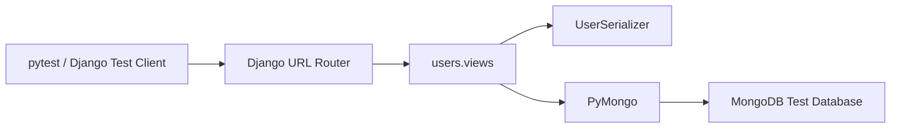
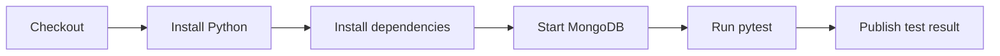

# README

## Overview

This test suite validates the Django application layer that exposes MongoDB-backed user operations.

The application intentionally uses **PyMongo instead of Django's relational ORM** for user persistence. Tests should therefore verify both HTTP behavior and MongoDB-specific behavior such as `ObjectId` validation, unique email constraints, serialization, CRUD operations, and error handling.

The test suite should remain isolated from developer and production MongoDB instances. Prefer a dedicated test database and explicit collection cleanup over running tests against the application's normal development database.

## Test Scope

| Area | What to verify |
|---|---|
| User listing | Successful retrieval, serialization, ordering, response shape |
| User creation | Validation, insertion, `ObjectId` generation, timestamps |
| User retrieval | Valid IDs, invalid IDs, missing users |
| User update | Full and partial updates, timestamps, duplicate email handling |
| User deletion | Successful deletion and missing-user behavior |
| Serialization | MongoDB `_id` conversion and API representation |
| Validation | Required fields, invalid email, invalid ObjectId |
| MongoDB errors | Duplicate keys and database failures |
| API routing | Collection and detail endpoints |
| Integration | Django request → view → PyMongo → response |

## Test Architecture

The tests should exercise the application at the API boundary rather than mocking every MongoDB operation.



This provides useful integration coverage while keeping the test database isolated from development and production data.

## Test Isolation

Tests should use a dedicated MongoDB database.

A typical configuration is:

```text
MONGODB_URI=mongodb://localhost:27017
MONGODB_DATABASE=django_mongodb_app_test
```

Do not point automated tests at:

- A production MongoDB cluster
- A shared development database
- A developer's personal database
- A database containing persistent test data

For CI/CD, the MongoDB service should be provisioned specifically for the test job.

## Recommended Test Categories

### API Contract Tests

Verify:

- HTTP status codes
- Response JSON structure
- Required fields
- Error response format
- ObjectId representation
- HTTP method behavior

### Validation Tests

Verify:

- Missing required fields
- Invalid email addresses
- Invalid user IDs
- Invalid field types
- Partial update behavior

### Persistence Tests

Verify:

- Documents are inserted correctly
- Updates modify the intended document
- Deletes remove the intended document
- MongoDB-generated `_id` values are returned correctly
- Timestamps are stored and updated correctly

### Constraint Tests

Verify:

- Email uniqueness
- Duplicate-key handling
- Invalid ObjectId handling
- Missing-document handling

### Failure-Path Tests

Verify application behavior when MongoDB operations fail.

Examples include:

- Connection failures
- Server selection failures
- Duplicate key errors
- Socket timeouts
- Other `PyMongoError` failures

Production code should translate database failures into stable API responses rather than exposing internal MongoDB exceptions.

## Test Naming

Use names that describe observable behavior.

Prefer:

```python
def test_create_user_returns_201(client):
    ...
```

over:

```python
def test_user_view(client):
    ...
```

For failure scenarios:

```python
def test_create_user_returns_409_for_duplicate_email(client):
    ...
```

This makes failures immediately understandable in CI output.

## Test Data

Use deterministic test data.

Example:

```python
USER_PAYLOAD = {
    "name": "Alice Smith",
    "email": "alice@example.com",
    "is_active": True,
}
```

Avoid reusing production-like credentials or real personal information.

For MongoDB documents, generate fresh `ObjectId` values through MongoDB or PyMongo rather than hard-coding identifiers unless the test specifically verifies identifier parsing.

## Example Test Structure

A representative test module can follow this structure:

```python
from __future__ import annotations

from django.urls import reverse
from rest_framework.test import APIClient

from users.views import _users_collection


def test_create_user_returns_201() -> None:
    client = APIClient()

    response = client.post(
        reverse("users:user-list"),
        {
            "name": "Alice Smith",
            "email": "alice@example.com",
            "is_active": True,
        },
        format="json",
    )

    assert response.status_code == 201
    assert response.data["name"] == "Alice Smith"
    assert response.data["email"] == "alice@example.com"
    assert "id" in response.data
```

The exact test implementation should match the project's final MongoDB fixture and test-database strategy.

## CRUD Coverage

The minimum API coverage should include the following matrix:

| Operation | Success | Validation failure | Missing resource | Database failure |
|---|---:|---:|---:|---:|
| List users | Yes | N/A | N/A | Yes |
| Create user | Yes | Yes | N/A | Yes |
| Retrieve user | Yes | Yes | Yes | Yes |
| Update user | Yes | Yes | Yes | Yes |
| Delete user | Yes | Yes | Yes | Yes |

## MongoDB-Specific Assertions

Do not test only the HTTP response.

Where appropriate, verify the underlying MongoDB document.

Example:

```python
document = _users_collection.find_one(
    {"email": "alice@example.com"},
)

assert document is not None
assert document["name"] == "Alice Smith"
assert document["is_active"] is True
```

This catches errors where the API response appears correct but persistence behavior is incorrect.

## ObjectId Testing

MongoDB uses `ObjectId` internally while the API exposes identifiers as strings.

Test both valid and invalid identifiers.

Valid example:

```text
507f1f77bcf86cd799439011
```

Invalid examples should include:

```text
not-an-object-id
123
""
```

Expected behavior:

```text
Invalid ObjectId
       ↓
Validation failure
       ↓
HTTP 400
```

Do not allow malformed identifiers to reach MongoDB unnecessarily.

## Duplicate Email Testing

The users collection defines a unique email index.

A duplicate insertion should therefore be handled as a conflict rather than an internal server error.

Expected flow:

```text
POST /users/
      ↓
Serializer validation
      ↓
MongoDB insert_one()
      ↓
DuplicateKeyError
      ↓
HTTP 409 Conflict
```

The test should verify both the HTTP status and stable error response.

## Update Testing

Test both update modes:

- `PUT` for complete replacement of writable fields
- `PATCH` for partial modification

Example partial update:

```python
response = client.patch(
    reverse(
        "users:user-detail",
        kwargs={"user_id": user_id},
    ),
    {"name": "Updated Name"},
    format="json",
)

assert response.status_code == 200
assert response.data["name"] == "Updated Name"
```

Verify that fields not included in a `PATCH` request remain unchanged.

## Timestamp Testing

User documents contain:

- `created_at`
- `updated_at`

Creation should initialize both values.

An update should modify `updated_at` without changing `created_at`.

Example:

```python
created = _users_collection.find_one({"_id": user_id})

# Perform update here.

updated = _users_collection.find_one({"_id": user_id})

assert updated["created_at"] == created["created_at"]
assert updated["updated_at"] >= created["updated_at"]
```

Avoid assertions that depend on exact timestamp equality because execution time and clock resolution can vary.

## Error Handling Tests

Database failures should be tested explicitly.

A PyMongo operation can be mocked when the objective is to verify error translation:

```python
from unittest.mock import patch

from pymongo.errors import PyMongoError


@patch("users.views._users_collection.find")
def test_list_users_returns_503_on_database_error(mock_find, client):
    mock_find.side_effect = PyMongoError("database unavailable")

    response = client.get(reverse("users:user-list"))

    assert response.status_code == 503
```

Use mocking selectively. A test suite composed entirely of mocks can pass while the actual MongoDB integration is broken.

## Integration vs Unit Tests

| Test type | MongoDB required | Primary purpose |
|---|---:|---|
| Serializer tests | No | Validation and representation |
| View unit tests | No | Error translation and control flow |
| API integration tests | Yes | Request-to-database behavior |
| Repository tests | Yes | MongoDB query correctness |
| End-to-end tests | Yes | Full application behavior |

For this project, API integration tests should be the primary persistence-level tests.

## Test Database Cleanup

Each test should leave the database in a known state.

A simple cleanup strategy is:

```python
def clear_users() -> None:
    _users_collection.delete_many({})
```

For larger suites, prefer fixtures that provide controlled lifecycle management.

Avoid deleting an entire database when the test process could accidentally connect to a non-test environment.

## Pytest Fixture Pattern

A project-level fixture can centralize API client and MongoDB cleanup:

```python
import pytest
from rest_framework.test import APIClient

from users.views import _users_collection


@pytest.fixture
def client() -> APIClient:
    return APIClient()


@pytest.fixture(autouse=True)
def clean_users():
    _users_collection.delete_many({})
    yield
    _users_collection.delete_many({})
```

In a production-quality suite, make the database selection itself test-specific before relying on automatic cleanup.

## Running Tests

From the project root:

```bash
pytest
```

Run the users tests specifically:

```bash
pytest tests/test_users.py
```

Run with verbose output:

```bash
pytest -v
```

Run a single test:

```bash
pytest tests/test_users.py::test_create_user_returns_201 -v
```

## CI/CD Considerations

The CI pipeline should provision MongoDB before executing tests.

A typical workflow is:



Tests should fail if MongoDB is unavailable rather than silently skipping persistence coverage.

## Common Testing Mistakes

### Testing Against the Development Database

This can corrupt developer data and make test results non-deterministic.

Use a dedicated test database.

### Mocking Every MongoDB Operation

Excessive mocking verifies implementation details rather than real persistence behavior.

Use integration tests for critical MongoDB queries.

### Asserting Exact Timestamps

Exact timestamp comparisons are brittle.

Compare ordering or existence instead.

### Ignoring Database Constraints

Application-level validation does not replace MongoDB's unique indexes.

Test duplicate-key behavior explicitly.

### Testing Only HTTP Status Codes

A `201` response does not prove that the document was persisted correctly.

Verify important persisted fields.

### Sharing Mutable Test Documents

Reusing the same dictionary or MongoDB document across tests can introduce hidden state.

Create fresh test data per test.

## Test Safety

The test suite should never:

- Use production credentials
- Use production MongoDB connection strings
- Delete arbitrary databases
- Depend on developer-specific local state
- Require manually created test documents
- Persist test data across unrelated test runs

Environment variables should be injected through the test environment or CI configuration.

## Key Takeaways

- Test the Django-to-PyMongo request path for critical user operations rather than relying exclusively on mocks.
- Isolate tests with a dedicated MongoDB database and deterministic cleanup.
- Explicitly test MongoDB-specific behavior such as `ObjectId`, unique indexes, `DuplicateKeyError`, and persistence.
- Treat database failures as first-class test cases and verify stable HTTP error responses.
- Keep tests deterministic, independent, and safe to run repeatedly in local development and CI/CD.