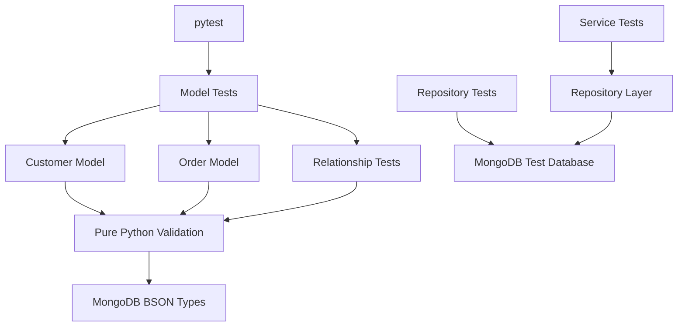
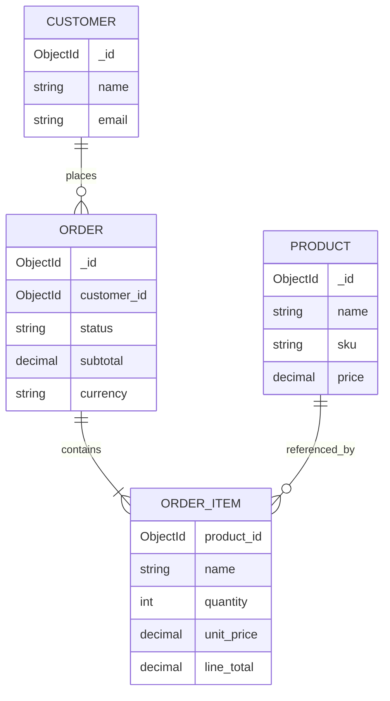

# README.md

## Overview

This directory contains the automated tests for the MongoDB Data Modeling Application.

The tests validate the application's domain models and data-modeling behavior independently from MongoDB infrastructure wherever possible. The goal is to verify that document construction, normalization, validation, relationships, and business invariants remain stable as the application evolves.

The test suite is organized around the application's model layer rather than MongoDB commands. Repository and integration tests should be responsible for validating persistence behavior against an actual MongoDB instance.

## Test Scope

The test suite is expected to cover:

- Customer document construction and normalization
- Product document construction and validation
- Order document construction and calculated totals
- Order status validation
- Relationships between customers, products, and orders
- Invalid model input
- MongoDB-specific types such as `ObjectId`
- Timestamp creation and update behavior
- Model invariants that must remain true regardless of persistence implementation

The current test files are organized by domain responsibility:

| File | Responsibility |
| --- | --- |
| `__init__.py` | Marks the test directory as a Python package |
| `test_customer_model.py` | Tests customer document construction and updates |
| `test_order_model.py` | Tests order document construction, totals, and status behavior |
| `test_relationships.py` | Tests relationships and references between domain documents |

Additional repository, service, integration, and API tests can be added as the application grows.

## Test Architecture

The model tests should remain lightweight and deterministic.



Model tests should not require a running MongoDB server unless the behavior being tested explicitly depends on MongoDB persistence semantics.

## Testing Principles

### Keep Model Tests Fast

Model builders such as `build_customer()` and `build_order()` are deterministic application logic. Their tests should execute without network access or external infrastructure.

This makes them suitable for every CI run, including pull requests.

### Test Behavior, Not Implementation Details

Prefer assertions against the resulting document structure and business invariants:

```python
assert customer["email"] == "user@example.com"
assert customer["is_active"] is True
assert isinstance(customer["_id"], ObjectId)
```

Avoid tests that depend unnecessarily on private implementation details or the exact sequence of internal function calls.

### Test Invalid Input Explicitly

Validation tests are as important as successful-path tests.

Examples include:

- Empty customer names
- Invalid customer emails
- Empty product names
- Negative product prices
- Negative stock quantities
- Orders without items
- Invalid quantities
- Negative unit prices
- Unsupported order statuses

These tests protect domain invariants before invalid data reaches MongoDB.

### Keep Persistence Tests Separate

A model test should not become a repository integration test.

For example:

```text
Model test
    ↓
build_order(...)
    ↓
assert document structure

Repository test
    ↓
create_order(...)
    ↓
MongoDB
    ↓
find_one(...)
    ↓
assert persisted document
```

This separation makes failures easier to diagnose and keeps the unit-test suite fast.

## Running the Tests

Install the project dependencies from the test directory:

```bash
python -m pip install -r requirements.txt
```

Run the complete test suite:

```bash
pytest
```

Run the model tests only:

```bash
pytest tests/test_customer_model.py tests/test_order_model.py
```

Run relationship tests:

```bash
pytest tests/test_relationships.py
```

Run with verbose output:

```bash
pytest -v
```

Run with coverage:

```bash
pytest --cov=src --cov-report=term-missing
```

## Test Configuration

The project uses `pytest` as the test runner.

A typical CI workflow should execute the test suite from the project root:

```bash
python -m pytest
```

Using `python -m pytest` ensures that the test runner is executed using the Python interpreter associated with the active environment.

If the project uses the `src` layout, ensure the application package is importable in the test environment. The CI environment should reproduce the same import behavior used during local development.

## Model Test Expectations

### Customer Tests

Customer model tests should verify:

- `_id` is generated as an `ObjectId`
- Names are normalized
- Emails are normalized to lowercase
- Optional phone numbers are handled correctly
- `is_active` defaults to `True`
- `created_at` is generated
- `updated_at` is generated
- Invalid customer data is rejected where model validation applies
- Update payloads contain only supported mutable fields
- Update operations refresh `updated_at`

### Product Tests

Product model tests should verify:

- `_id` is an `ObjectId`
- Names are normalized
- SKUs are normalized to uppercase
- Categories are normalized
- Prices are represented consistently
- Negative prices are rejected
- Negative stock quantities are rejected
- Optional descriptions are normalized
- `is_active` defaults to `True`
- Creation timestamps are generated
- Update payloads contain only mutable fields

### Order Tests

Order model tests should verify:

- An order requires at least one item
- `customer_id` is preserved as an `ObjectId`
- Item quantities are positive
- Unit prices cannot be negative
- Line totals are calculated correctly
- Order subtotal is calculated from line totals
- Currency is normalized
- New orders start in `pending` status
- Creation and update timestamps are generated
- Unsupported order statuses are rejected

### Relationship Tests

Relationship tests should focus on how the application's data model represents relationships.

The application's intended relationship structure is:



The order references the customer through `customer_id`, while order items contain a `product_id` reference and a snapshot of purchase information.

This is intentional denormalization: the order stores product name and price information required to preserve the historical state of the purchase.

## Test Data Design

Test data should be:

- Deterministic
- Minimal
- Representative of production data structures
- Independent between tests
- Explicit about identifiers and relationships

Prefer small fixtures over large reusable datasets.

For example:

```python
from bson import ObjectId

customer_id = ObjectId()
product_id = ObjectId()

items = [
    {
        "product_id": product_id,
        "name": "Backend Engineering Book",
        "quantity": 2,
        "unit_price": "49.99",
    }
]
```

Using generated `ObjectId` values keeps relationship tests realistic without requiring MongoDB.

## Isolation and Test Independence

Each test should be independently executable.

Avoid:

```python
customer = create_customer(...)
order = create_order(customer_id=customer["_id"], ...)
```

in a pure model test because this introduces unnecessary persistence coupling.

Prefer constructing documents directly:

```python
customer_id = ObjectId()

order = build_order(
    customer_id=customer_id,
    items=[
        {
            "product_id": ObjectId(),
            "name": "Product",
            "quantity": 1,
            "unit_price": "10.00",
        }
    ],
)

assert order["customer_id"] == customer_id
```

This verifies the relationship representation without requiring a database.

## MongoDB-Specific Assertions

MongoDB documents should be tested according to their BSON semantics.

Important assertions include:

| Field | Expected behavior |
| --- | --- |
| `_id` | `ObjectId` |
| `customer_id` | `ObjectId` reference |
| `product_id` | `ObjectId` reference |
| `created_at` | timezone-aware UTC datetime |
| `updated_at` | timezone-aware UTC datetime |
| Monetary fields | consistent decimal representation |
| Arrays | expected item/document structure |

Avoid converting every BSON value to a string simply to make assertions easier. Doing so can hide type-related defects that would affect persistence or query behavior.

## Unit Tests vs Integration Tests

Use unit tests for:

- Document construction
- Validation
- Normalization
- Calculations
- Relationship representation
- Status transitions
- Update payload generation

Use integration tests for:

- Insert behavior
- Unique indexes
- Query behavior
- Projection
- Sorting
- Pagination
- Aggregation
- Update operators
- Atomic operations
- Transactions
- MongoDB-specific validation
- Index behavior

A useful separation is:

| Test Type | MongoDB Required | Primary Goal |
| --- | ---: | --- |
| Model unit test | No | Validate application model behavior |
| Service unit test | Usually no | Validate business rules |
| Repository integration test | Yes | Validate persistence behavior |
| Aggregation integration test | Yes | Validate database pipelines |
| Transaction integration test | Yes | Validate transactional behavior |
| End-to-end test | Yes | Validate complete application flow |

## Failure Diagnosis

When a test fails, identify the layer responsible before changing the implementation.

```text
Test failure
    ↓
Identify failing layer
    ↓
Model / Service / Repository / MongoDB
    ↓
Reproduce with smallest test
    ↓
Inspect input and expected document
    ↓
Verify BSON types and values
    ↓
Fix implementation or test expectation
    ↓
Run focused test
    ↓
Run complete suite
```

A failing model test should not be "fixed" by adding MongoDB dependencies unless the tested behavior genuinely requires MongoDB.

## Production-Oriented Testing Considerations

### Deterministic Time

Tests involving `created_at` and `updated_at` should avoid asserting exact timestamps.

Prefer:

```python
assert document["created_at"].tzinfo is not None
assert document["updated_at"].tzinfo is not None
```

When exact time behavior must be tested, use a clock abstraction or a controlled test-time mechanism rather than relying on arbitrary sleeps.

### ObjectId Testing

Do not compare generated identifiers to hard-coded values unless the identifier itself is intentionally supplied.

Prefer:

```python
assert isinstance(document["_id"], ObjectId)
```

For relationship tests, generate identifiers explicitly so equality can be verified:

```python
customer_id = ObjectId()

order = build_order(
    customer_id=customer_id,
    items=[...],
)

assert order["customer_id"] == customer_id
```

### Decimal and Monetary Values

Monetary values require particular care.

Avoid floating-point equality for financial calculations:

```python
assert order["subtotal"] == 99.98
```

Prefer a decimal-based representation appropriate for the application's MongoDB persistence strategy.

The test suite should verify that the application does not introduce binary floating-point rounding errors into monetary calculations.

## CI/CD Expectations

The test suite should run before packaging or deployment.

A typical CI sequence is:

```text
Checkout
   ↓
Install dependencies
   ↓
Lint
   ↓
Run unit tests
   ↓
Run integration tests
   ↓
Generate coverage
   ↓
Build/package
   ↓
Deploy
```

Model tests should remain independent of external MongoDB infrastructure so that basic validation can run reliably in every CI environment.

Integration tests can use a dedicated MongoDB service, container, or managed test database depending on the CI architecture.

## Common Testing Mistakes

### Testing Only the Happy Path

A model that successfully creates valid documents may still accept invalid production data.

Test both valid and invalid inputs.

### Using MongoDB for Every Test

Starting MongoDB for every model test adds latency and infrastructure coupling without providing additional confidence.

Keep pure model behavior as unit tests.

### Sharing Mutable Test Data

Reusing mutable dictionaries across tests can cause hidden state leakage.

Create fresh test data for each test or use pytest fixtures with appropriate scopes.

### Testing Implementation Instead of Behavior

Tests should verify externally meaningful behavior rather than private helper structure.

This allows internal refactoring without unnecessary test rewrites.

### Ignoring BSON Types

An `ObjectId` represented as a string may work in an API payload but behave differently in MongoDB queries.

Tests should verify the boundary between API representation and MongoDB representation explicitly.

### Overusing Integration Tests

Integration tests are valuable but slower and more operationally expensive.

Use them where MongoDB behavior itself is part of the requirement.

## Key Takeaways

- Keep model tests fast, deterministic, and independent of MongoDB infrastructure whenever persistence behavior is not being tested.
- Validate BSON-specific types such as `ObjectId` and timezone-aware timestamps explicitly.
- Test both successful document construction and invalid domain input.
- Use integration tests for MongoDB-specific behavior such as indexes, queries, aggregation, transactions, and persistence semantics.
- Treat relationship tests as data-model tests: verify how references and controlled duplication represent business relationships.