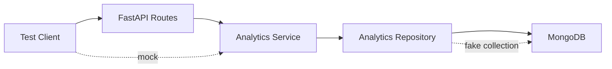

# README.md

## Overview

This directory contains the automated tests for the **MongoDB Aggregation Analytics API**.

The tests validate the API contract, analytics service integration, aggregation behavior, input validation, and health-check behavior without requiring a live MongoDB instance for unit-level tests.

The test suite is intentionally separated into API and aggregation-focused tests:

| File | Responsibility |
|---|---|
| `test_analytics_api.py` | FastAPI endpoint and HTTP contract tests |
| `test_aggregation.py` | MongoDB aggregation repository and service behavior |
| `__init__.py` | Test package marker |

The preferred testing strategy is to keep database-dependent behavior isolated behind the repository layer and mock or replace that boundary in unit tests. This keeps the majority of the suite deterministic, fast, and suitable for CI/CD execution.

## Test Architecture

The expected application flow is:

```text
HTTP Request
     |
     v
FastAPI Route
     |
     v
Analytics Service
     |
     v
Analytics Repository
     |
     v
MongoDB Aggregation Pipeline
     |
     v
Analytics Result
     |
     v
HTTP Response
```

Tests should validate each important boundary independently.



## Test Strategy

The project uses multiple levels of testing.

| Test level | MongoDB required | Primary purpose |
|---|---:|---|
| API unit/integration boundary | No | Validate HTTP behavior and service interaction |
| Repository unit tests | No | Validate aggregation pipeline construction |
| Service tests | No | Validate business rules and validation |
| MongoDB integration tests | Yes | Validate actual aggregation behavior |
| End-to-end tests | Yes | Validate the complete request-to-database flow |

The default test suite should not require developers to run MongoDB locally.

Database integration tests should be introduced separately when the correctness of an aggregation depends on MongoDB's actual execution engine.

## Test Environment

Create a virtual environment and install the project dependencies:

```bash
python -m venv .venv
```

Activate it on Windows:

```powershell
.venv\Scripts\Activate.ps1
```

Activate it on Linux or macOS:

```bash
source .venv/bin/activate
```

Install dependencies:

```bash
pip install -r requirements.txt
```

The test environment can use the same MongoDB configuration as the application when integration tests are enabled.

Example:

```text
MONGODB_URI=mongodb://localhost:27017
MONGODB_DATABASE=mongodb_aggregation_analytics
```

Do not commit real credentials or production connection strings.

## Running Tests

Run the complete test suite:

```bash
pytest
```

Run with verbose output:

```bash
pytest -v
```

Run a specific test module:

```bash
pytest tests/test_aggregation.py
```

```bash
pytest tests/test_analytics_api.py
```

Run a specific test:

```bash
pytest tests/test_aggregation.py::test_sales_by_period_rejects_invalid_granularity
```

Run with coverage when the coverage dependency is installed:

```bash
pytest --cov=src --cov-report=term-missing
```

## API Tests

`test_analytics_api.py` uses FastAPI's `TestClient` to test the HTTP boundary.

The tests should verify:

- HTTP status codes
- Response structure
- Response serialization
- Query parameter handling
- Validation behavior
- Service invocation
- Empty result handling
- Error mapping
- Route registration
- Health-check behavior

Example request:

```python
response = client.get(
    "/analytics/top-products?limit=10",
)

assert response.status_code == 200
```

The API test should not require a live MongoDB connection when the service layer is mocked.

This provides fast feedback for changes to:

- FastAPI routes
- Pydantic schemas
- Request validation
- Response contracts
- Service integration
- Error handling

## Aggregation Tests

`test_aggregation.py` focuses on repository-level aggregation behavior.

Instead of connecting to MongoDB, the repository's collection boundary can be replaced with a deterministic fake:

```python
class FakeCollection:
    def __init__(self) -> None:
        self.pipelines = []

    def aggregate(self, pipeline):
        self.pipelines.append(pipeline)
        return []
```

This allows tests to inspect the pipeline sent to MongoDB.

For example:

```python
analytics_repository.sales_by_category(
    start_date=start_date,
    end_date=end_date,
)

pipeline = fake_collection.pipelines[0]

assert pipeline[0]["$match"]["created_at"] == {
    "$gte": start_date,
    "$lt": end_date,
}
```

This approach verifies repository behavior without depending on:

- MongoDB availability
- Database state
- Network connectivity
- Local database configuration
- Test execution order

## What Aggregation Tests Should Validate

Aggregation tests should focus on behavior rather than merely checking that a function executes.

Important assertions include:

- `$match` filters
- Date boundaries
- Status filters
- `$unwind` behavior
- `$group` keys
- Accumulators
- `$project` output
- `$sort` ordering
- `$limit` behavior
- `$dateTrunc` configuration
- Invalid parameter handling
- Product and customer grouping
- Identifier normalization

For example, a sales-by-period aggregation should verify that the requested granularity reaches `$dateTrunc` correctly:

```text
API request
    |
    | granularity=month
    v
Service
    |
    v
Repository
    |
    v
$dateTrunc
    |
    | unit = month
    v
MongoDB
```

## Testing Date Ranges

Analytics queries commonly use half-open time intervals:

```text
[start_date, end_date)
```

For example:

```python
{
    "created_at": {
        "$gte": start_date,
        "$lt": end_date,
    },
}
```

This prevents overlapping periods when consecutive windows are queried.

For example:

```text
January:
2025-01-01 00:00:00 <= created_at < 2025-02-01 00:00:00

February:
2025-02-01 00:00:00 <= created_at < 2025-03-01 00:00:00
```

Tests should explicitly verify these boundaries.

Avoid using ambiguous local timestamps in tests. Prefer timezone-aware UTC timestamps:

```python
from datetime import datetime, timezone

start_date = datetime(
    2025,
    1,
    1,
    tzinfo=timezone.utc,
)
```

## Testing Validation

Invalid API parameters should be tested explicitly.

Examples include:

- Invalid aggregation granularity
- Zero or negative limits
- Invalid date ranges
- Missing required parameters
- Malformed timestamps
- Unsupported query parameters where strict validation is required

A repository-level validation test might look like:

```python
with pytest.raises(
    ValueError,
    match="limit must be greater than zero",
):
    analytics_repository.top_products(limit=0)
```

API-level tests should verify that application validation is translated into an appropriate HTTP response.

## Testing Empty Results

Analytics endpoints must handle an empty dataset without treating it as an error.

Expected response shape:

```json
{
  "data": [],
  "total": 0
}
```

This distinction is important:

| Condition | Expected behavior |
|---|---|
| No matching records | Successful empty result |
| Invalid request | Client validation error |
| Database unavailable | Server/infrastructure error |
| Unexpected application exception | Server error |

An empty aggregation result should not become a `404` merely because no records matched.

## Mocking Guidelines

Mock at architectural boundaries rather than mocking implementation details throughout the application.

Preferred boundaries:

```text
FastAPI route
      |
      v
Analytics service  <-- mock here for API tests
      |
      v
Repository          <-- fake collection here for repository tests
      |
      v
MongoDB
```

Avoid mocking every internal function.

Excessive mocking can make tests pass while the real components are incompatible.

A useful rule is:

> Mock external dependencies and architectural boundaries; test internal business behavior directly.

## MongoDB Integration Tests

Unit tests cannot prove that MongoDB actually executes an aggregation correctly.

For important production aggregations, maintain a separate integration suite that runs against a controlled MongoDB instance.

An integration test should validate:

1. Test database creation.
2. Fixture data insertion.
3. Required indexes.
4. Aggregation execution.
5. Result correctness.
6. Database cleanup.

Example architecture:

```text
pytest
  |
  v
Test Fixture
  |
  v
MongoDB Test Database
  |
  v
Real Aggregation Pipeline
  |
  v
Assertions
  |
  v
Cleanup
```

Integration tests are especially valuable for:

- `$lookup`
- `$unwind`
- `$facet`
- `$bucket`
- `$dateTrunc`
- Complex expressions
- Decimal handling
- ObjectId conversion
- Index-dependent query behavior

## Test Data Design

Use deterministic fixture data.

Good analytics fixtures should cover:

- Multiple customers
- Multiple products
- Multiple categories
- Multiple orders
- Different order statuses
- Multiple dates
- Multiple quantities
- Different revenue values
- Empty result windows
- Boundary timestamps

Example conceptual dataset:

```text
Customer A
 ├── Order 1
 │    ├── Electronics
 │    └── Books
 └── Order 2
      └── Electronics

Customer B
 └── Order 3
      └── Books
```

Fixtures should be small enough to understand manually but diverse enough to exercise the aggregation logic.

## Numeric Precision

Analytics involving monetary values require explicit numeric semantics.

MongoDB monetary values should normally use `Decimal128` rather than binary floating-point values when exact decimal representation is required.

Python tests may therefore encounter values such as:

```python
from bson import Decimal128

revenue = Decimal128("499.93")
```

API schemas can convert database values into a consistent serialized representation.

Tests should verify both:

- Database-level numeric correctness
- API-level serialization correctness

Do not silently mix `float`, `Decimal`, and `Decimal128` without an explicit conversion strategy.

## Test Isolation

Each test should be independent.

Avoid relying on:

- Test execution order
- Global mutable state
- Shared database state
- Previous test results
- Local developer configuration
- Production databases

For integration tests, use a dedicated database or isolated collection namespace.

For example:

```text
mongodb_aggregation_analytics_test
```

Never point automated tests at a production database.

## CI/CD Testing

The test suite should be suitable for GitHub Actions or another CI platform.

A typical CI flow is:

```text
Checkout
   |
   v
Install Python
   |
   v
Install dependencies
   |
   v
Run linting
   |
   v
Run unit tests
   |
   v
Run integration tests
   |
   v
Publish test results
```

Unit tests should run without external infrastructure whenever possible.

MongoDB integration tests can use:

- A CI MongoDB service
- A containerized MongoDB instance
- A dedicated test environment
- MongoDB Atlas test infrastructure

Do not embed database credentials directly in workflow files.

Use CI secrets or environment variables.

## Common Testing Mistakes

| Mistake | Problem | Better approach |
|---|---|---|
| Connecting to production MongoDB | Risk of data corruption | Dedicated test database |
| Testing only HTTP status codes | Business logic can still be wrong | Assert response data and service behavior |
| Mocking everything | Tests stop representing real behavior | Mock architectural boundaries |
| No aggregation integration tests | Pipeline may be syntactically valid but semantically wrong | Run important pipelines against real MongoDB |
| Using random fixture data | Failures become difficult to reproduce | Deterministic fixtures |
| Using local naive datetimes | Timezone bugs | Use timezone-aware UTC values |
| Ignoring empty results | APIs become inconsistent | Test successful empty responses |
| Testing only happy paths | Production failures remain hidden | Include validation and infrastructure failure cases |
| Sharing mutable fixtures | Test coupling | Create isolated fixtures |
| Mixing numeric types | Monetary precision problems | Define explicit numeric conversion rules |

## Troubleshooting Test Failures

Use the following workflow:

```text
Test failure
    ↓
Identify failing layer
    ↓
API / Service / Repository / MongoDB
    ↓
Reproduce with the smallest failing test
    ↓
Inspect inputs and generated aggregation pipeline
    ↓
Check expected vs actual result
    ↓
Determine application or database behavior
    ↓
Fix implementation or test expectation
    ↓
Run targeted test
    ↓
Run complete test suite
```

### API Test Failure

Check:

- Route registration
- HTTP method
- Query parameters
- Pydantic validation
- Response model
- Service mock target
- Exception handling

### Aggregation Test Failure

Check:

- Pipeline stages
- `$match` criteria
- Grouping keys
- Date boundaries
- Numeric types
- Expected sort order
- `$limit` position
- Mocked collection behavior

### Integration Test Failure

Check:

- MongoDB connectivity
- Connection string
- Authentication
- Database name
- Collection state
- MongoDB server version
- Replica-set requirements
- Test fixture initialization

## Production Test Considerations

Tests should protect the contracts that matter in production.

For analytics APIs, this includes:

- Stable response schemas
- Correct date boundaries
- Correct aggregation semantics
- Deterministic ordering
- Pagination and limits
- Monetary precision
- Error handling
- MongoDB query performance
- Index assumptions
- Backward-compatible schema evolution

A test suite should not merely maximize code coverage. It should provide confidence that the application's externally visible behavior and critical database operations remain correct.

## Key Takeaways

- Keep API tests, service tests, repository tests, and MongoDB integration tests separated by architectural responsibility.
- Mock external boundaries for fast deterministic tests, but use real MongoDB integration tests for important aggregation semantics.
- Test analytics edge cases explicitly, especially date boundaries, empty results, limits, invalid parameters, and numeric precision.
- Use deterministic, isolated fixtures and never execute automated tests against production data.
- Treat aggregation pipelines as production-critical code and test both their construction and their behavior against MongoDB.