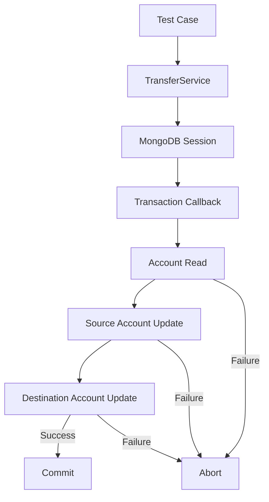
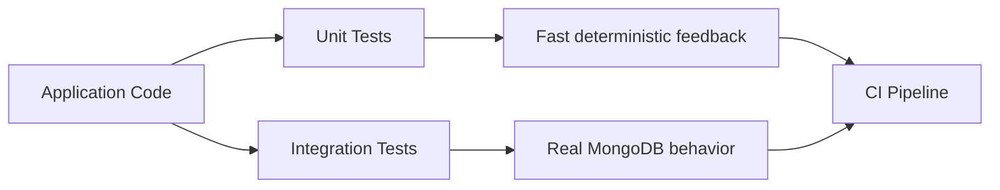

# README

## Overview

This directory contains the automated test suite for the MongoDB Transactions Application.

The tests focus on the transaction service and, specifically, the correctness of multi-document account transfers. The suite verifies successful commits, validation failures, business-rule failures, MongoDB failures, and transaction rollback behavior.

The tests are designed primarily as unit tests. MongoDB client, collection, and session behavior is represented through controlled test doubles so transaction semantics can be validated without requiring a running MongoDB server.

## Test Structure

| File | Responsibility |
|---|---|
| `__init__.py` | Marks the test directory as a Python package |
| `test_transactions.py` | Tests successful transfers, validation, account lookup, and transaction-service behavior |
| `test_rollback.py` | Tests transaction abort and rollback behavior when operations fail |

## Testing Strategy

The application separates transaction orchestration from persistence details:



The test suite verifies both paths:

- **Commit path** — all required operations succeed and the transaction commits.
- **Rollback path** — a business or infrastructure failure causes the transaction to abort.
- **Validation path** — invalid input is rejected before database operations begin.

## Running the Tests

From the project root:

```bash
pytest
```

Run the transaction tests explicitly:

```bash
pytest tests/test_transactions.py
```

Run rollback-specific tests:

```bash
pytest tests/test_rollback.py
```

Run with verbose output:

```bash
pytest -v
```

Run with coverage when the coverage tooling is installed:

```bash
pytest --cov=src --cov-report=term-missing
```

## Test Environment

The unit tests do not require a running MongoDB instance.

The test suite uses:

- `pytest` for test execution and assertions.
- `unittest.mock.MagicMock` for MongoDB collection behavior.
- Lightweight session and client doubles for transaction lifecycle testing.

This keeps unit tests deterministic and fast.

Integration tests against an actual MongoDB replica set should be maintained separately when database-specific behavior needs verification.

## Transaction Test Cases

The transaction tests cover the following scenarios:

| Scenario | Expected behavior |
|---|---|
| Valid transfer | Transaction commits |
| Zero amount | Validation failure |
| Negative amount | Validation failure |
| Non-finite amount | Validation failure |
| Empty account identifier | Validation failure |
| Same source and destination | Validation failure |
| Source account missing | Transaction aborts |
| Destination account missing | Transaction aborts |
| Insufficient funds | Transaction aborts |
| Destination update fails | Transaction aborts |
| MongoDB operation fails | Transaction aborts and infrastructure error is surfaced |
| Invalid input | MongoDB transaction is not started |

## Rollback Verification

A rollback test should verify more than simply checking that an exception was raised.

The important transaction invariants are:

```text
Transaction starts
      ↓
Database operations execute using the same session
      ↓
An operation fails
      ↓
Transaction aborts
      ↓
Transaction does not commit
```

The tests therefore verify:

- The transaction was started.
- The failure was propagated to the caller.
- The transaction was marked as aborted.
- The transaction was not marked as committed.
- Subsequent operations were not executed when an earlier operation failed.
- MongoDB operations received the active transaction session.

## Unit Tests vs Integration Tests

Unit tests validate application behavior without depending on MongoDB infrastructure.

Integration tests should be added when validating behavior that depends on the actual MongoDB server, such as:

- Replica-set transaction support.
- Actual transaction commit and abort behavior.
- Write concerns.
- Read concerns.
- Retryable transaction behavior.
- MongoDB-specific error labels.
- Concurrent transaction behavior.
- Write conflicts.
- Unique-index violations.
- Transaction lifetime limits.

A production-oriented test strategy should therefore use both levels:



## Common Testing Mistakes

### Testing only the success path

A transaction implementation is incomplete if only successful transfers are tested.

Failure paths are particularly important because the primary purpose of a transaction is to preserve consistency when operations fail.

### Mocking away transaction boundaries

Mocks should verify that operations use the same session. Otherwise, a test can pass even when application code accidentally executes database operations outside the transaction.

### Assuming exceptions prove rollback

An exception only proves that the application observed a failure. It does not prove that MongoDB aborted the transaction.

Integration tests should verify actual database state after a failed transaction.

### Testing implementation details excessively

Tests should focus primarily on externally observable behavior and transaction invariants rather than private implementation details.

For example, validating that the transfer either commits both balance changes or persists neither change is more valuable than tightly coupling tests to internal helper names.

## CI Considerations

The unit test suite should run on every pull request and before merging changes.

A typical CI sequence is:

```text
Install dependencies
        ↓
Run unit tests
        ↓
Run linting/type checks
        ↓
Run integration tests
        ↓
Build/deploy
```

Unit tests should remain independent of external MongoDB infrastructure where possible so that failures can be diagnosed quickly.

Integration tests requiring MongoDB should use an isolated test database or ephemeral MongoDB environment and must never execute against production data.

## Key Takeaways

- Transaction tests must verify both successful commits and failure-driven aborts.
- MongoDB operations belonging to one transaction must use the same session.
- Unit tests should validate transaction orchestration without requiring a live MongoDB server.
- Integration tests are required to prove actual MongoDB commit, rollback, replica-set, and concurrency behavior.
- CI should execute the transaction test suite automatically and keep production databases completely isolated from tests.